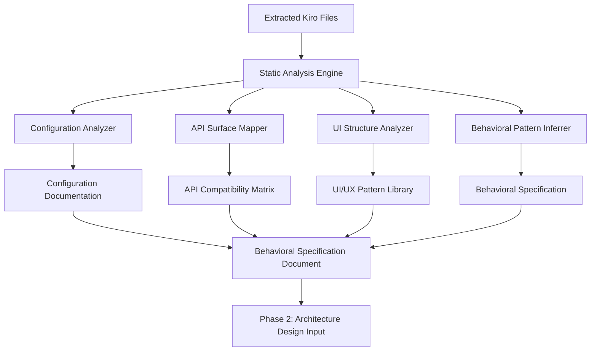

# Design Document: Identify Transfiguration Behavior

## Overview

This design document outlines the systematic approach for Phase 1: Discovery & Documentation of Kiro.dev behaviors through static analysis of extracted files. The goal is to create a comprehensive behavioral specification that will serve as the foundation for future Rust/WASM transfiguration phases.

## Architecture

### Analysis Pipeline Architecture



### Component Architecture

#### 1. Static Analysis Engine
**Purpose**: Orchestrate all analysis components and manage file processing
- **Input**: Extracted Kiro files at `/Users/neetipatni/Desktop/extracted_kiro`
- **Output**: Structured analysis results for each component
- **Technology**: Bash scripts + JSON processing tools (jq, grep, find)

#### 2. Configuration Analyzer
**Purpose**: Extract and document all configuration structures
- **Targets**: package.json, product.json, settings schemas, keybindings
- **Output**: Complete configuration documentation with schemas and defaults
- **Methods**: JSON parsing, schema extraction, command mapping

#### 3. API Surface Mapper
**Purpose**: Document complete extension API compatibility surface
- **Targets**: TypeScript definitions, extension manifests, contribution points
- **Output**: API compatibility matrix for extension ecosystem
- **Methods**: TypeScript parsing, manifest analysis, API cataloging

#### 4. UI Structure Analyzer
**Purpose**: Document visual components, layouts, and styling systems
- **Targets**: HTML templates, CSS files, theme definitions, media assets
- **Output**: UI/UX pattern library with visual specifications
- **Methods**: DOM structure analysis, CSS parsing, asset cataloging

#### 5. Behavioral Pattern Inferrer
**Purpose**: Infer runtime behaviors from static code patterns
- **Targets**: Event handlers, state management, animation code, performance patterns
- **Output**: Behavioral inference documentation with confidence levels
- **Methods**: Code pattern matching, control flow analysis, dependency tracing

## Components and Interfaces

### Analysis Component Interfaces

#### Configuration Analyzer Interface
```bash
# Input: Configuration files
analyze_configuration() {
    local config_file="$1"
    local output_dir="$2"
    
    # Extract schema, commands, settings
    jq '.contributes.commands[]' "$config_file" > "$output_dir/commands.json"
    jq '.contributes.keybindings[]' "$config_file" > "$output_dir/keybindings.json"
    jq '.contributes.configuration' "$config_file" > "$output_dir/settings.json"
}
```

#### API Surface Mapper Interface
```bash
# Input: TypeScript definitions and manifests
map_api_surface() {
    local ts_files="$1"
    local manifest_files="$2"
    local output_dir="$3"
    
    # Extract API interfaces and contribution points
    grep -r "export interface\|export class" "$ts_files" > "$output_dir/api_interfaces.txt"
    grep -r "contributes" "$manifest_files" > "$output_dir/contribution_points.json"
}
```

#### UI Structure Analyzer Interface
```bash
# Input: HTML, CSS, and media files
analyze_ui_structure() {
    local html_files="$1"
    local css_files="$2"
    local output_dir="$3"
    
    # Extract component structures and styling
    find "$html_files" -name "*.html" -exec cat {} \; > "$output_dir/html_structure.html"
    find "$css_files" -name "*.css" -exec cat {} \; > "$output_dir/css_styles.css"
}
```

#### Behavioral Pattern Inferrer Interface
```bash
# Input: JavaScript/TypeScript source files
infer_behavioral_patterns() {
    local source_files="$1"
    local output_dir="$2"
    
    # Extract event patterns and state management
    grep -r "addEventListener\|onClick" "$source_files" > "$output_dir/event_patterns.txt"
    grep -r "setState\|state\." "$source_files" > "$output_dir/state_patterns.txt"
}
```

## Data Models

### Behavioral Specification Schema

```json
{
  "kiro_behavioral_spec": {
    "version": "1.0.0",
    "source_analysis": {
      "extracted_files_path": "/Users/neetipatni/Desktop/extracted_kiro",
      "analysis_date": "2025-01-XX",
      "vs_code_base_version": "1.103.2"
    },
    "configuration": {
      "commands": [],
      "keybindings": [],
      "settings": {},
      "menus": [],
      "themes": []
    },
    "api_surface": {
      "vscode_apis": [],
      "kiro_specific_apis": [],
      "contribution_points": [],
      "activation_events": []
    },
    "ui_structure": {
      "components": [],
      "layouts": [],
      "styling": {},
      "animations": [],
      "media_assets": []
    },
    "behavioral_patterns": {
      "event_handling": [],
      "state_management": [],
      "performance_optimizations": [],
      "error_handling": []
    },
    "inferences": {
      "assumed_behaviors": [],
      "confidence_levels": {},
      "vs_code_baseline_references": []
    }
  }
}
```

### Configuration Documentation Model

```json
{
  "configuration_spec": {
    "package_json": {
      "commands": [
        {
          "command": "kiro.openFile",
          "title": "Open File",
          "category": "File",
          "keybinding": "Ctrl+O"
        }
      ],
      "settings": [
        {
          "key": "kiro.ai.enabled",
          "type": "boolean",
          "default": true,
          "description": "Enable AI assistance"
        }
      ]
    },
    "product_json": {
      "branding": {},
      "urls": {},
      "feature_flags": {},
      "built_in_extensions": []
    }
  }
}
```

### API Compatibility Matrix Model

```json
{
  "api_compatibility": {
    "vscode_standard_apis": {
      "window": ["showInformationMessage", "showErrorMessage"],
      "workspace": ["openTextDocument", "saveAll"],
      "commands": ["registerCommand", "executeCommand"]
    },
    "kiro_specific_apis": {
      "kiro_agent": ["sendAIRequest", "processAIResponse"],
      "aws_integration": ["authenticateAWS", "syncSettings"]
    },
    "extension_compatibility": {
      "supported_contribution_points": [],
      "activation_events": [],
      "api_version_requirements": {}
    }
  }
}
```

## Error Handling

### Analysis Error Categories

#### 1. File Access Errors
- **Missing Files**: Handle cases where expected files don't exist
- **Permission Errors**: Handle restricted file access
- **Corrupted Files**: Handle malformed JSON or binary files

#### 2. Parsing Errors
- **Invalid JSON**: Graceful handling of malformed configuration files
- **Encoding Issues**: Handle different text encodings
- **Binary Files**: Skip or handle binary files appropriately

#### 3. Analysis Completeness Errors
- **Incomplete Extraction**: Handle partial or incomplete file extraction
- **Missing Dependencies**: Handle missing referenced files or modules
- **Version Mismatches**: Handle version compatibility issues

### Error Handling Strategy

```bash
# Error handling wrapper for analysis functions
safe_analyze() {
    local analysis_function="$1"
    local input_path="$2"
    local output_path="$3"
    
    if [[ ! -d "$input_path" ]]; then
        echo "ERROR: Input path does not exist: $input_path" >&2
        return 1
    fi
    
    mkdir -p "$output_path"
    
    if ! "$analysis_function" "$input_path" "$output_path" 2>"$output_path/errors.log"; then
        echo "WARNING: Analysis function $analysis_function failed, see $output_path/errors.log" >&2
        return 2
    fi
    
    echo "SUCCESS: Analysis completed for $analysis_function" >&2
    return 0
}
```

## Testing Strategy

### Analysis Validation Approach

#### 1. Static Analysis Validation
- **File Coverage**: Ensure all relevant files are processed
- **Schema Validation**: Validate extracted JSON against expected schemas
- **Completeness Checks**: Verify all expected configuration elements are found

#### 2. Cross-Reference Validation
- **API Consistency**: Verify API references match actual implementations
- **Configuration Coherence**: Ensure settings references match actual settings
- **Dependency Validation**: Verify all referenced dependencies exist

#### 3. Baseline Comparison
- **VS Code OSS Comparison**: Compare findings against VS Code OSS 1.103.2 baseline
- **Known Kiro Features**: Validate against known Kiro-specific features
- **Extension Compatibility**: Verify extension API surface completeness

### Testing Implementation

```bash
# Validation test suite
validate_analysis_results() {
    local results_dir="$1"
    
    # Test 1: File coverage
    test_file_coverage "$results_dir"
    
    # Test 2: JSON schema validation
    test_json_schemas "$results_dir"
    
    # Test 3: API completeness
    test_api_completeness "$results_dir"
    
    # Test 4: Configuration coherence
    test_configuration_coherence "$results_dir"
    
    echo "Validation complete. See $results_dir/validation_report.txt"
}
```

## Performance Considerations

### Analysis Performance Optimization

#### 1. Parallel Processing
- **File Processing**: Process multiple files concurrently where possible
- **Analysis Components**: Run independent analysis components in parallel
- **Output Generation**: Generate documentation sections concurrently

#### 2. Incremental Analysis
- **Change Detection**: Only re-analyze files that have changed
- **Cached Results**: Cache intermediate analysis results
- **Selective Processing**: Allow analysis of specific components only

#### 3. Resource Management
- **Memory Usage**: Stream large files rather than loading entirely into memory
- **Disk I/O**: Minimize redundant file reads
- **CPU Usage**: Optimize regex patterns and JSON processing

### Performance Implementation

```bash
# Parallel analysis execution
run_parallel_analysis() {
    local input_dir="$1"
    local output_dir="$2"
    
    # Run analysis components in parallel
    analyze_configuration "$input_dir" "$output_dir/config" &
    map_api_surface "$input_dir" "$output_dir/api" &
    analyze_ui_structure "$input_dir" "$output_dir/ui" &
    infer_behavioral_patterns "$input_dir" "$output_dir/behavior" &
    
    # Wait for all background jobs to complete
    wait
    
    # Combine results
    combine_analysis_results "$output_dir"
}
```

## Implementation Phases

### Phase 1.1: Core Analysis Infrastructure (Week 1)
- Set up analysis pipeline architecture
- Implement basic file processing and error handling
- Create output directory structure and logging

### Phase 1.2: Configuration Analysis (Week 1-2)
- Implement configuration analyzer for package.json and product.json
- Extract command definitions, keybindings, and settings schemas
- Generate configuration documentation

### Phase 1.3: API Surface Mapping (Week 2-3)
- Implement TypeScript definition parsing
- Extract extension contribution points and activation events
- Generate API compatibility matrix

### Phase 1.4: UI Structure Analysis (Week 3-4)
- Implement HTML/CSS parsing and documentation
- Extract theme definitions and media assets
- Generate UI/UX pattern library

### Phase 1.5: Behavioral Pattern Inference (Week 4-5)
- Implement code pattern analysis for event handling and state management
- Generate behavioral inference documentation with confidence levels
- Create VS Code OSS baseline comparisons

### Phase 1.6: Integration and Validation (Week 5-6)
- Combine all analysis results into comprehensive behavioral specification
- Implement validation and testing suite
- Generate final documentation for Phase 2 input

## Deliverables

### Primary Deliverables
1. **Behavioral Specification Document**: Complete JSON specification of all discovered Kiro behaviors
2. **API Compatibility Matrix**: Full documentation of extension API surface for compatibility planning
3. **UI/UX Pattern Library**: Visual component and styling documentation for UI replication
4. **Configuration Schema**: Complete mapping of all settings, preferences, and customization options

### Supporting Deliverables
1. **Analysis Tools**: Reusable bash scripts and tools for ongoing analysis
2. **Validation Suite**: Testing framework for verifying analysis completeness and accuracy
3. **Baseline Comparison**: Documentation of differences from VS Code OSS 1.103.2
4. **Phase 2 Requirements**: Detailed requirements for architecture design phase based on discoveries

This design provides a systematic, tool-based approach to extracting all discoverable behavioral information from the static Kiro files, creating the foundation needed for successful Rust/WASM transfiguration in future phases.