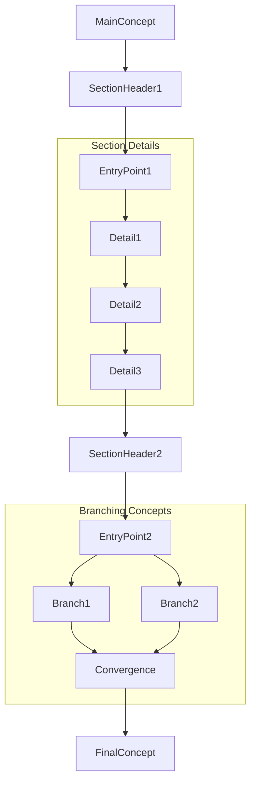
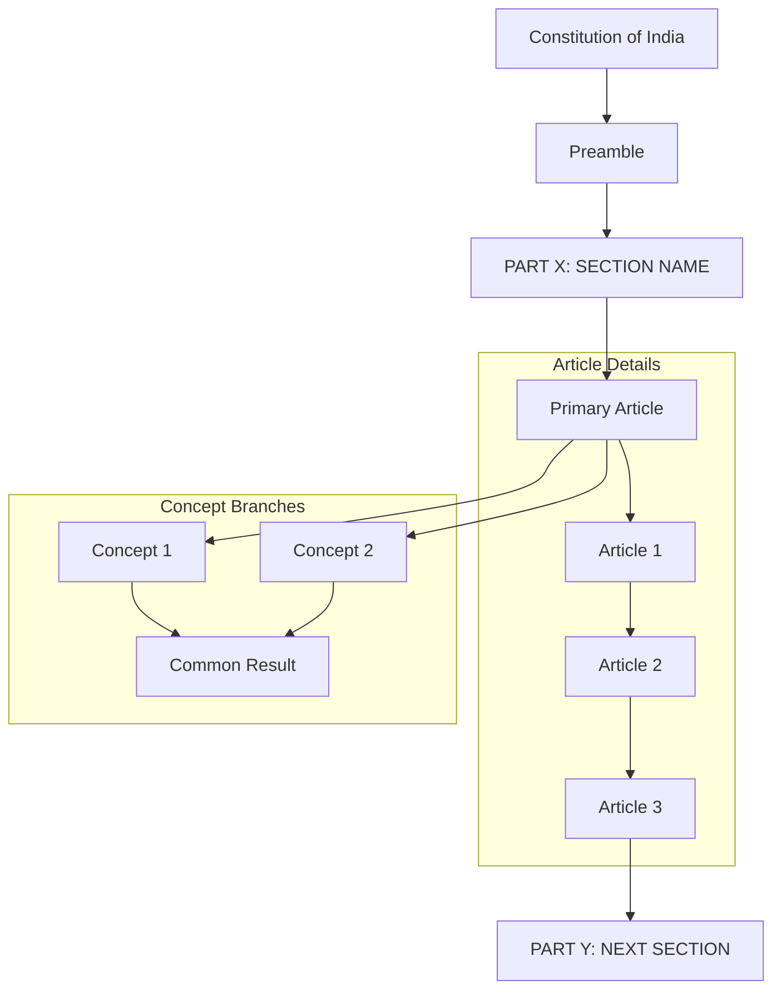
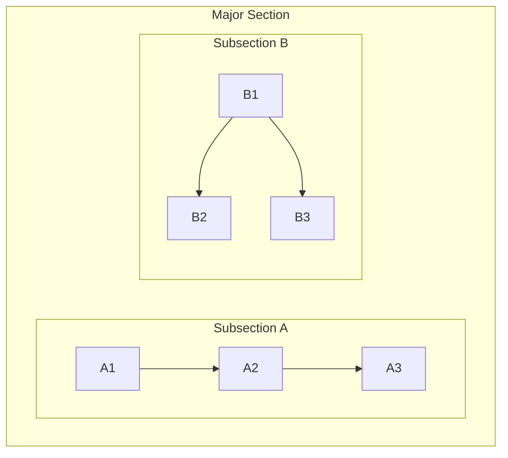

# Mermaid Design Patterns for Constitutional Diagrams

## Purpose
This document provides proven design patterns for creating effective, mobile-friendly Mermaid diagrams that tell the constitutional story like a saga map.

## Core Design Philosophy

### Saga Map Approach
- **Story-like Flow**: Diagrams should read like a narrative progression
- **Mobile-First**: Optimize for vertical (tall) rather than horizontal (wide) layouts
- **Logical Branching**: Show how constitutional concepts branch and reconverge
- **Visual Hierarchy**: Use different layout patterns for different content types

---

## Pattern 1: Mobile-Friendly Saga Map

### When to Use
- Constitutional structure overviews
- Multi-part constitutional sections
- Complex hierarchical relationships
- Any diagram that needs to work well on mobile devices

### Structure


### Key Features
- **Primary Flow**: Top-Down (TD) for mobile compatibility
- **Section Variety**: Mix of LR (horizontal) and TB (vertical) subgraphs
- **Clear Transitions**: Connect subgraphs through entry/exit points
- **Contained Complexity**: Each section fits mobile screen width

---

## Pattern 2: Constitutional Part Structure

### Template


---

## Layout Decision Matrix

### Use Horizontal (LR) Subgraphs When:
- **Sequential Articles**: Art 1 → Art 2 → Art 3 → Art 4
- **Process Steps**: Application → Review → Approval → Implementation
- **Timeline Events**: Historical progression of amendments
- **Short Lists**: 2-5 items that fit mobile width

### Use Vertical (TB) Subgraphs When:
- **Branching Logic**: Multiple paths from one source
- **Hierarchical Structures**: Superior → Subordinate relationships
- **Category Expansions**: One concept splitting into multiple types
- **Long Lists**: 6+ items that need vertical space

### Use Mixed Patterns When:
- **Complex Relationships**: Some parts sequential, others hierarchical
- **Story Progression**: Different narrative styles in different sections
- **Mobile Optimization**: Balancing readability with screen constraints

---

## Mobile Optimization Rules

### Screen Width Considerations
- **Maximum Horizontal Elements**: 4 items in LR subgraphs
- **Preferred Width**: Keep subgraphs under 800px equivalent
- **Text Length**: Use `<br/>` for long labels to control width
- **Connection Clarity**: Avoid long horizontal connections

### Vertical Flow Benefits
- **Natural Scrolling**: Users expect to scroll down, not right
- **Reading Pattern**: Top-to-bottom matches reading habits
- **Touch Navigation**: Easier to navigate on mobile devices
- **Content Density**: More information in less horizontal space

---

## Styling Patterns

### Color Scheme for Constitutional Diagrams
```mermaid
%% Foundation elements
classDef foundation fill:#e1f5fe,stroke:#01579b,stroke-width:3px

%% Part headers
classDef partHeader fill:#f3e5f5,stroke:#7b1fa2,stroke-width:2px,font-weight:bold

%% Content categories
classDef territory fill:#e8f5e8,stroke:#2e7d32,stroke-width:2px
classDef citizenship fill:#fff3e0,stroke:#ef6c00,stroke-width:2px
classDef rights fill:#fce4ec,stroke:#c2185b,stroke-width:2px
classDef duties fill:#e0f2f1,stroke:#00695c,stroke-width:2px
classDef governance fill:#fff8e1,stroke:#f57f17,stroke-width:2px
```

### Application Pattern
```mermaid
class Constitution,Preamble foundation
class PartHeaders partHeader
class TerritoryArticles territory
class CitizenshipArticles citizenship
class RightsArticles rights
```

---

## Common Patterns Library

### Pattern: Sequential Articles
```mermaid
subgraph "Articles X-Y: Topic Name"
    direction LR
    ArtX[Art X: First] --> ArtY[Art Y: Second] --> ArtZ[Art Z: Third]
end
```

### Pattern: Branching Rights
```mermaid
subgraph "Rights Categories"
    direction TB
    General[General Provisions]
    General --> Right1[Specific Right 1]
    General --> Right2[Specific Right 2]
    General --> Right3[Specific Right 3]
end
```

### Pattern: Process Flow
```mermaid
subgraph "Constitutional Process"
    direction LR
    Start[Initiation] --> Review[Review] --> Approval[Approval] --> Implementation[Implementation]
end
```

### Pattern: Hierarchical Structure
```mermaid
subgraph "Government Hierarchy"
    direction TB
    Union[Union Government]
    Union --> State[State Government]
    Union --> UT[Union Territory]
    State --> Local[Local Government]
end
```

---

## Implementation Checklist

### Before Creating Diagram
- [ ] Identify the story/narrative flow
- [ ] Determine mobile vs desktop priority
- [ ] Choose primary direction (TD recommended)
- [ ] Plan subgraph layout patterns
- [ ] Select appropriate color scheme

### During Creation
- [ ] Start with main vertical flow
- [ ] Add subgraphs with appropriate directions
- [ ] Connect subgraphs through clear entry/exit points
- [ ] Apply consistent styling
- [ ] Test readability at mobile width

### After Creation
- [ ] Validate syntax using online Mermaid editor
- [ ] Test rendering in mobile viewport
- [ ] Verify story flow makes sense
- [ ] Check color contrast and accessibility
- [ ] Document any custom patterns used

---

## Advanced Techniques

### Nested Subgraphs


### Cross-Subgraph Connections
```mermaid
graph TD
    subgraph "Section 1"
        A1 --> A2
    end
    subgraph "Section 2"
        B1 --> B2
    end
    A2 --> B1  %% Clean connection between sections
```

### Responsive Text Formatting
```mermaid
%% Use line breaks for mobile readability
LongTitle[Very Long Constitutional<br/>Article Title That Would<br/>Be Too Wide Otherwise]

%% Keep short titles single line
ShortTitle[Art 1: Name]
```

---

## Quality Standards

### Every Constitutional Diagram Must:
- **Tell a Story**: Clear narrative progression
- **Work on Mobile**: Readable on narrow screens
- **Use Consistent Styling**: Follow established color schemes
- **Maintain Clarity**: No overcrowded sections
- **Follow Patterns**: Use established layout patterns
- **Validate Syntax**: Render without errors

### Success Metrics
- **Mobile Readability**: Diagram fits and reads well on 375px width
- **Story Clarity**: Non-experts can follow the constitutional narrative
- **Visual Balance**: No section dominates inappropriately
- **Performance**: Renders quickly without layout issues

---

## Troubleshooting Common Issues

### Diagram Too Wide
- Convert LR subgraphs to TB
- Break long horizontal chains into vertical sections
- Use shorter node labels with line breaks

### Poor Mobile Experience
- Reduce horizontal elements per row
- Increase vertical spacing
- Use more descriptive section headers

### Confusing Flow
- Add clear section headers
- Use consistent connection patterns
- Simplify complex branching

### Rendering Issues
- Validate syntax in online editor
- Check for proper subgraph closure
- Verify class definitions match node IDs

---

**Document Version:** 1.0  
**Created:** For Constitution of India diagram project  
**Focus:** Mobile-friendly saga map patterns  
**Next Review:** After creating 10+ diagrams using these patterns