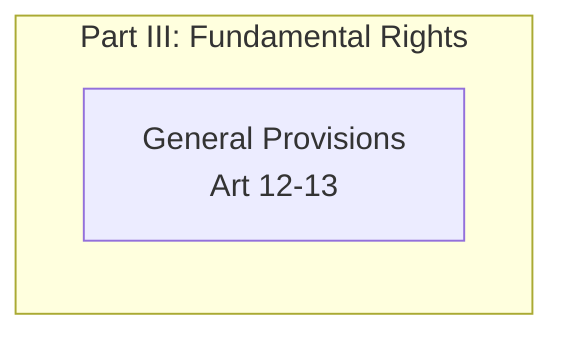
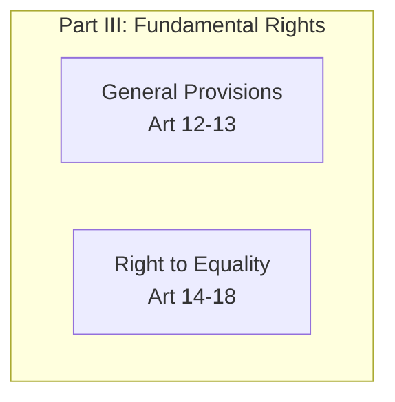
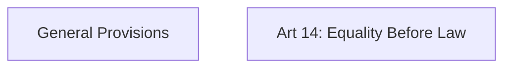
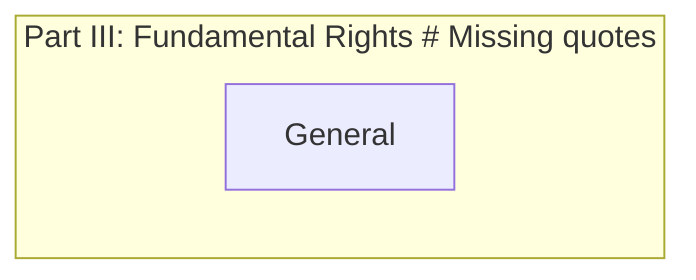
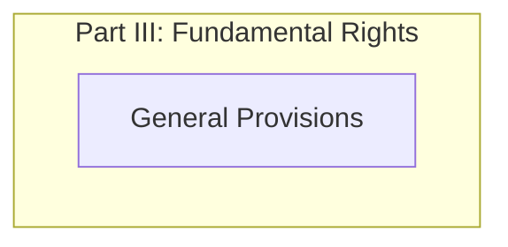
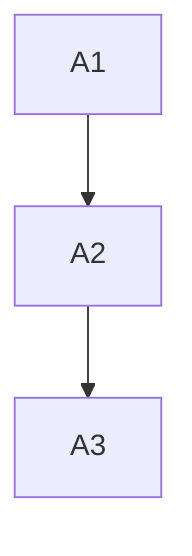
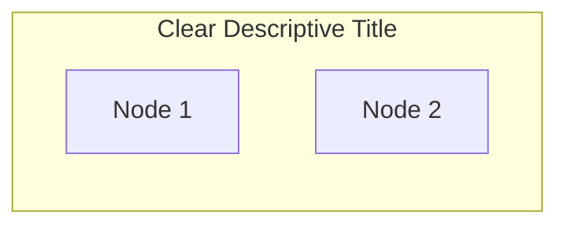
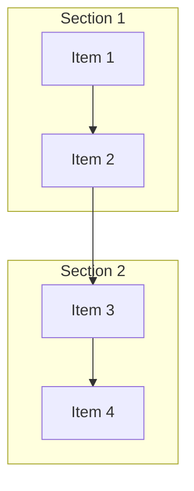

# Mermaid Syntax Guide and Best Practices

## Purpose
This guide provides comprehensive rules and best practices for creating syntactically correct Mermaid diagrams in the Constitution of India analysis project.

## Common Syntax Errors and Fixes

### 1. Direction Declaration Issues

**❌ WRONG:**
```mermaid
graph TD
    direction TD E1[General Provisions]  # Invalid - direction mixed with node
```

**❌ ALSO WRONG:**


**✅ CORRECT:**


**Note:** When main graph is `graph TD`, additional `direction TD` in subgraphs is redundant and can cause parse errors.

### 2. Node ID and Label Syntax

**❌ WRONG:**
```mermaid
graph TD
    E1[Genera  # Incomplete bracket
    E2[Art 14: Equality Before Law]]  # Double closing bracket
```

**✅ CORRECT:**


### 3. Subgraph Declaration

**❌ WRONG:**


**✅ CORRECT:**


### 4. Connection Syntax

**❌ WRONG:**
```mermaid
graph TD
    A1 -> A2  # Wrong arrow type for flowchart
    A2 => A3  # Wrong arrow type
```

**✅ CORRECT:**


## Mandatory Syntax Rules

### 1. Graph Declaration
- Always start with `graph TD` (Top-Down) or `graph TB` (Top-Bottom)
- Avoid `graph LR` (Left-Right) as it creates wide, hard-to-read diagrams

### 2. Node Naming Convention
- Use alphanumeric IDs: `A1`, `B2`, `C3`
- Keep IDs short and systematic
- Use descriptive labels in square brackets: `[Article Description]`

### 3. Subgraph Structure


### 4. Line Breaks in Labels
- Use `<br/>` for line breaks in node labels
- Example: `E1[General Provisions<br/>Art 12-13]`

### 5. Special Characters
- Escape special characters in labels: `\[`, `\]`, `\(`, `\)`
- Use quotes around subgraph titles containing special characters

## Layout Best Practices

### 1. Vertical Layout Priority
- Always use `graph TD` for main graph
- Use `direction TD` within subgraphs for vertical flow
- This creates box-like, readable diagrams

### 2. Subgraph Organization


### 3. Connection Patterns
- Connect subgraphs through their last/first nodes
- Maintain logical flow from top to bottom
- Avoid crossing connections where possible

## Class Definitions and Styling

### 1. Color Scheme
```mermaid
classDef foundation fill:#e1f5fe
classDef territory fill:#e8f5e8
classDef citizenship fill:#fff3e0
classDef rights fill:#fce4ec
```

### 2. Class Application
```mermaid
class A1,A2,A3 foundation
class B1,B2,B3 territory
```

## Validation Checklist

Before saving any Mermaid diagram, verify:

- [ ] Graph starts with `graph TD` or `graph TB`
- [ ] All node IDs are alphanumeric (A1, B2, C3, etc.)
- [ ] All square brackets are properly closed `[label]`
- [ ] Subgraph titles are in quotes `"Title"`
- [ ] Direction declarations are inside subgraphs
- [ ] Connections use `-->` arrows
- [ ] No mixing of direction and node declarations
- [ ] Special characters are properly escaped
- [ ] Class definitions come after the graph structure
- [ ] Class applications reference existing node IDs

## Error Troubleshooting

### Parse Error on Line X
1. Check the line number mentioned in error
2. Look for:
   - Unclosed brackets `[`
   - Missing quotes in subgraph titles
   - Invalid direction placement
   - Malformed node IDs

### "Unable to render rich display"
1. Validate entire Mermaid syntax
2. Check for:
   - Mixed syntax patterns
   - Invalid arrow types
   - Malformed subgraph structure

### Common Fix Patterns
```mermaid
# Fix incomplete brackets
E1[General Provisions  # ❌ Missing closing bracket
E1[General Provisions] # ✅ Correct

# Fix redundant direction declarations
subgraph "Part III"
    direction TD       # ❌ Redundant when main graph is TD
    E1[General]
end

subgraph "Part III"    # ✅ Clean subgraph without redundant direction
    E1[General]
end

# Fix connection syntax
A1 -> A2  # ❌ Wrong arrow
A1 --> A2 # ✅ Correct arrow
```

## File Validation Process

### Before Saving
1. Copy Mermaid code to online validator (mermaid.live)
2. Verify rendering works correctly
3. Check for any syntax warnings
4. Ensure layout is readable and box-like

### After Saving
1. Test rendering in the application
2. Verify all connections display correctly
3. Check that styling classes are applied
4. Confirm readability and layout quality

## Emergency Fixes

If you encounter a syntax error:

1. **Immediate Fix**: Comment out problematic lines with `%%`
2. **Identify Issue**: Use validation checklist above
3. **Apply Fix**: Correct syntax following this guide
4. **Test**: Validate before uncommenting
5. **Document**: Note the issue type for future reference

## Quality Standards

Every Mermaid diagram must:
- Render without errors
- Display in a readable box-like format
- Use consistent styling and colors
- Follow the established naming conventions
- Maintain logical top-to-bottom flow
- Include proper subgraph organization

## Update Protocol

When modifying existing diagrams:
1. Backup current version
2. Apply changes following this guide
3. Validate syntax completely
4. Test rendering
5. Update task tracking if successful