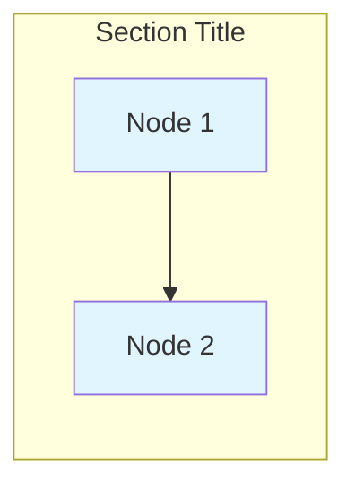

# Mermaid Troubleshooting and Error Resolution

## Current Error Analysis

### Error: "Parse error on line 25: direction TD E1[Genera"

This specific error indicates a malformed direction declaration mixed with node definition.

**Problem Pattern:**
```mermaid
direction TD E1[Genera  # ❌ Invalid syntax
```

**Root Cause:**
- Direction declaration (`direction TD`) incorrectly combined with node definition
- Incomplete node label (missing closing bracket)
- Possible text truncation or copy-paste error

## Systematic Error Detection

### Step 1: Locate the Problematic File
```bash
# Search for the specific error pattern
grep -r "direction TD.*E1" Mermaid01/
grep -r "E1\[Genera" Mermaid01/
```

### Step 2: Common Error Patterns to Check

#### Pattern 1: Mixed Direction and Node Declaration
```mermaid
# ❌ WRONG
direction TD E1[General Provisions]

# ✅ CORRECT
subgraph "Section"
    direction TD
    E1[General Provisions]
end
```

#### Pattern 2: Incomplete Brackets
```mermaid
# ❌ WRONG
E1[General Provisions  # Missing closing bracket
E1[General Provisions]] # Double closing bracket

# ✅ CORRECT
E1[General Provisions]
```

#### Pattern 3: Invalid Characters in Labels
```mermaid
# ❌ WRONG
E1[General Provisions<br>Art 12-13]  # Invalid line break syntax

# ✅ CORRECT
E1[General Provisions<br/>Art 12-13]
```

## Diagnostic Commands

### Find All Mermaid Files with Potential Issues
```bash
# Check for direction statements outside subgraphs
grep -n "^direction" Mermaid01/*.md

# Check for incomplete brackets
grep -n "\[.*[^]]$" Mermaid01/*.md

# Check for malformed node IDs
grep -n "direction.*\[" Mermaid01/*.md
```

### Validate Mermaid Syntax
```bash
# Check each file for basic syntax issues
for file in Mermaid01/*.md; do
    echo "Checking $file"
    grep -n "```mermaid" -A 100 "$file" | grep -E "(direction|graph|subgraph|\[|\])"
done
```

## Quick Fix Protocol

### 1. Emergency Syntax Fix
If you find the problematic line:
```mermaid
# Replace this pattern:
direction TD E1[Genera

# With this corrected version:
subgraph "Section Name"
    direction TD
    E1[General Provisions]
end
```

### 2. Systematic File Repair
For each Mermaid file:
1. Open the file
2. Locate the Mermaid code block
3. Check for these patterns:
   - `direction` statements outside subgraphs
   - Incomplete node labels
   - Mixed syntax patterns
4. Apply corrections following the syntax guide

### 3. Validation Steps
After fixing:
1. Copy the Mermaid code to https://mermaid.live
2. Verify it renders without errors
3. Check the layout is readable
4. Save the corrected file

## Prevention Measures

### 1. Template Structure
Always use this template for new diagrams:


### 2. Validation Workflow
Before saving any Mermaid diagram:
1. Check syntax against the guide
2. Test in online validator
3. Verify rendering quality
4. Confirm no error messages

### 3. Common Mistake Avoidance
- Never mix `direction` with node definitions on same line
- Always close brackets in node labels
- Use `<br/>` not `<br>` for line breaks
- Keep direction statements inside subgraphs
- Use quotes around subgraph titles

## Recovery Procedures

### If Diagram Won't Render
1. **Backup**: Save current version as `.backup`
2. **Isolate**: Comment out sections with `%%`
3. **Test**: Find the problematic section
4. **Fix**: Apply corrections from this guide
5. **Validate**: Test each section before uncommenting

### If Multiple Files Affected
1. **Identify**: Use grep commands to find all affected files
2. **Prioritize**: Fix files in order of importance
3. **Batch Fix**: Apply same correction pattern to similar errors
4. **Test**: Validate each file after correction

## Quality Assurance

### Post-Fix Checklist
- [ ] All Mermaid diagrams render without errors
- [ ] Layout is readable and box-like (not too wide)
- [ ] All connections display correctly
- [ ] Styling classes are applied properly
- [ ] No syntax warnings in validator
- [ ] File follows naming conventions

### Monitoring
- Regularly test diagram rendering
- Keep syntax guide updated with new patterns
- Document any new error types encountered
- Maintain backup versions of working diagrams

## Emergency Contacts and Resources

### Online Validators
- https://mermaid.live - Primary validation tool
- https://mermaid-js.github.io/mermaid-live-editor/ - Alternative validator

### Documentation
- Official Mermaid docs: https://mermaid-js.github.io/mermaid/
- Syntax reference: https://mermaid-js.github.io/mermaid/#/flowchart

### Quick Reference
- Graph types: `graph TD`, `graph TB`, `graph LR`, `graph RL`
- Node shapes: `[]` rectangle, `()` rounded, `{}` rhombus
- Connections: `-->` arrow, `---` line, `-.->` dotted arrow
- Subgraph: `subgraph "title"` ... `end`