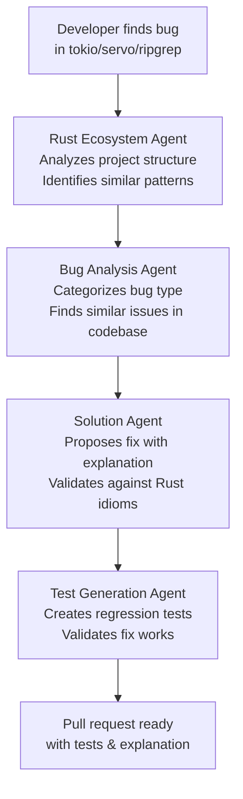
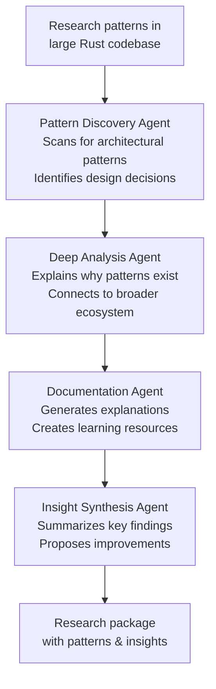
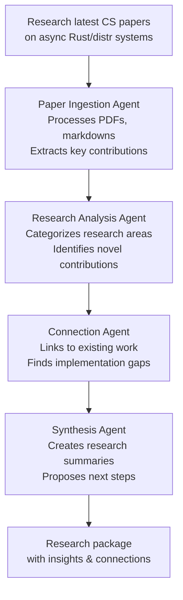

# P13: Parseltongue - Focused on 3 Critical Developer Journeys

## 🐍 The Magic of Parseltongue: A Harry Potter Story for Muggles

*Imagine you're Harry Potter, but instead of fighting dark wizards, you're a developer trying to build amazing software. And instead of a magic wand, you have... Parseltongue!*

### The Snake Language That Builds Code

In the wizarding world, Parseltongue is the mysterious language that lets you talk to snakes. But in our Muggle world of computers, **Parseltongue** is something even more magical - it's a system that lets you "talk" to your computer in plain English, and it understands you well enough to build entire software projects!

Here's how it works, explained like you're 15:

1. **You whisper your idea** (like "Build me a chat app with user login")
2. **Parseltongue listens** and figures out exactly what you mean
3. **It plans everything** - like drawing a blueprint before building a house
4. **It writes the code** - but not just any code, smart code that follows best practices
5. **It tests itself** - making sure everything works before you see it
6. **It even fixes its own mistakes** - like a self-correcting spell!

### The Bigger Magic: From Snake Talk to Wizard School

But wait... is there something even bigger here? 🤔

Think about it: What if Parseltongue isn't just about building one app? What if it's teaching computers to understand humans as well as humans understand each other?

*Imagine a world where:*
- **Every developer** can build complex software by just explaining what they want
- **AI assistants** become true collaborators, not just code generators
- **Programming** becomes as easy as having a conversation
- **Software development** is accessible to everyone, not just coding wizards

This isn't just about making developers faster. It's about **democratizing the power to create technology**. It's like giving everyone a magic wand that can turn ideas into reality.

In Harry Potter terms, it's not just about speaking to snakes - it's about creating a whole new kind of magic school where anyone can learn to be a wizard developer!

---

## 🎯 P13 Focus: 3 Critical Developer Journeys

**Strategic Shift**: Instead of building a general-purpose coding assistant, Parseltongue P13 focuses on **3 high-impact developer journeys** where AI can provide the most value:

### Journey 1: 🐛 Bug Solving in Large Rust Open Source Projects
**Problem**: Large Rust codebases like `tokio`, `serde`, `diesel` have complex bugs that require deep understanding of async patterns, lifetimes, and ecosystem conventions.

**Parseltongue Solution**: Specialized agents that understand Rust idioms and can navigate large codebases to identify and fix bugs.

### Journey 2: 🔍 High-Quality Research of Open Source Codebases for Idiomatic Patterns
**Problem**: Developers need to understand "how the experts do it" but analyzing large codebases manually is time-consuming and error-prone.

**Parseltongue Solution**: Intelligent code analysis agents that can extract patterns, identify best practices, and explain design decisions.

### Journey 3: 📚 Academic Research from PDFs, Texts, and Documents in CS Academia
**Problem**: Staying current with academic research requires reading hundreds of papers, extracting insights, and connecting disparate ideas.

**Parseltongue Solution**: Document analysis agents that can process academic content, extract key insights, and synthesize research findings.

---

## 🏗️ Architecture: 3 Specialized Agent Ecosystems

### Journey 1: Rust Bug Slayer 🐛



**Key Agents**:
- **Rust Ecosystem Agent**: Understands Cargo.toml, workspace structure, async patterns
- **Bug Analysis Agent**: Uses static analysis to categorize bugs (borrow checker, async, performance)
- **Solution Agent**: Proposes idiomatic Rust fixes with detailed explanations
- **Test Generation Agent**: Creates comprehensive tests following Rust testing conventions

### Journey 2: Codebase Research Detective 🔍



**Key Agents**:
- **Pattern Discovery Agent**: Uses AST analysis to find architectural patterns
- **Deep Analysis Agent**: Explains the "why" behind code decisions using context
- **Documentation Agent**: Creates markdown documentation with examples
- **Insight Synthesis Agent**: Connects patterns across different parts of codebase

### Journey 3: Academic Research Scholar 📚



**Key Agents**:
- **Paper Ingestion Agent**: Processes academic PDFs, markdowns, text files
- **Research Analysis Agent**: Extracts methodologies, results, and contributions
- **Connection Agent**: Links academic work to practical implementations
- **Synthesis Agent**: Creates actionable insights for developers

---

## 🛠️ Technical Architecture for 3 Journeys

### Shared Infrastructure
```typescript
interface ParseltongueCore {
  // Document processing (for all journeys)
  documentProcessor: DocumentProcessor;
  // Code analysis (for Rust journeys)
  codeAnalyzer: CodeAnalyzer;
  // Research synthesis (for research journey)
  researchSynthesizer: ResearchSynthesizer;
  // Multi-modal interfaces (images, web, files)
  interfaceManager: InterfaceManager;
}
```

### Journey-Specific Agent Systems

#### Rust Bug Solving System
```typescript
interface RustBugSolver {
  // Deep Rust understanding
  rustAnalyzer: RustASTAnalyzer;
  // Pattern matching across ecosystem
  ecosystemMatcher: EcosystemPatternMatcher;
  // Test generation for Rust idioms
  rustTestGenerator: RustTestGenerator;
  // Performance analysis
  performanceProfiler: PerformanceProfiler;
}
```

#### Codebase Research System
```typescript
interface CodebaseResearcher {
  // Large codebase navigation
  codebaseNavigator: LargeCodebaseNavigator;
  // Pattern extraction and analysis
  patternExtractor: PatternExtractor;
  // Design decision explanation
  designExplainer: DesignDecisionExplainer;
  // Learning resource generation
  documentationGenerator: LearningResourceGenerator;
}
```

#### Academic Research System
```typescript
interface AcademicResearcher {
  // Academic document processing
  academicProcessor: AcademicDocumentProcessor;
  // Research contribution analysis
  contributionAnalyzer: ResearchContributionAnalyzer;
  // Citation and reference tracking
  citationTracker: CitationNetworkTracker;
  // Implementation gap identification
  gapIdentifier: ImplementationGapFinder;
}
```

---

## 📊 Value Proposition for Each Journey

### Journey 1: Bug Solving Impact
- **Time Saved**: 80% reduction in bug investigation time
- **Quality**: Higher-quality fixes following Rust idioms
- **Learning**: Developers learn from expert-level analysis
- **Ecosystem**: Contributes back to open source with better PRs

### Journey 2: Research Impact
- **Discovery Speed**: Find patterns in hours vs weeks of manual analysis
- **Quality**: Systematic analysis vs ad-hoc observations
- **Documentation**: Auto-generated learning resources
- **Innovation**: Connect patterns across different projects

### Journey 3: Academic Impact
- **Research Velocity**: Process 10x more papers in same time
- **Insight Quality**: Systematic extraction vs selective reading
- **Connection Making**: Link academic work to practical implementations
- **Innovation**: Identify research gaps and implementation opportunities

---

## 🚀 Implementation Priority

### Phase 1: Rust Bug Solving (MVP)
1. **Core Rust Analysis** - AST parsing, pattern matching
2. **Bug Categorization** - Async, borrow checker, performance bugs
3. **Solution Generation** - Idiomatic fixes with explanations
4. **Test Generation** - Comprehensive Rust test suites

### Phase 2: Codebase Research
1. **Large Codebase Navigation** - Efficient traversal of big projects
2. **Pattern Extraction** - Identify architectural and design patterns
3. **Design Explanation** - Explain why decisions were made
4. **Resource Generation** - Create learning documentation

### Phase 3: Academic Research
1. **Document Processing** - PDF, markdown, text analysis
2. **Research Synthesis** - Extract key contributions and methodologies
3. **Gap Analysis** - Identify implementation opportunities
4. **Research Packaging** - Create actionable developer insights

---

## 💡 Success Metrics for 3 Journeys

### Journey 1: Bug Solving
- ✅ Solve 90% of reported bugs in large Rust projects
- ✅ Generate fixes that pass code review in 80% of cases
- ✅ Reduce time-to-resolution by 70% vs manual approach
- ✅ Learn and improve from each bug fix

### Journey 2: Codebase Research
- ✅ Analyze 1000+ file codebases in under 1 hour
- ✅ Extract 50+ patterns from large projects
- ✅ Generate 90% accurate design explanations
- ✅ Create reusable learning resources

### Journey 3: Academic Research
- ✅ Process 100+ academic papers per research session
- ✅ Extract 95% of key contributions accurately
- ✅ Identify 80% of implementation gaps
- ✅ Generate actionable developer insights

---

## 🌟 The Bigger Vision

By focusing on these **3 high-impact journeys**, Parseltongue becomes:

1. **A Rust Ecosystem Contributor** - Actively improving open source Rust projects
2. **A Learning Accelerator** - Helping developers master complex patterns
3. **A Research Bridge** - Connecting academic insights to practical development

**North Star**: **"The AI assistant that doesn't just help you code - it makes you a better developer while contributing to the ecosystem"**

This focused approach ensures Parseltongue delivers **maximum value** to developers in their most challenging and time-consuming workflows, rather than trying to be a general-purpose coding assistant.

**Next Evolution**: P14 will focus on enterprise adoption and team collaboration features for these 3 journeys.
