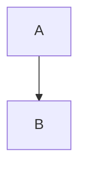
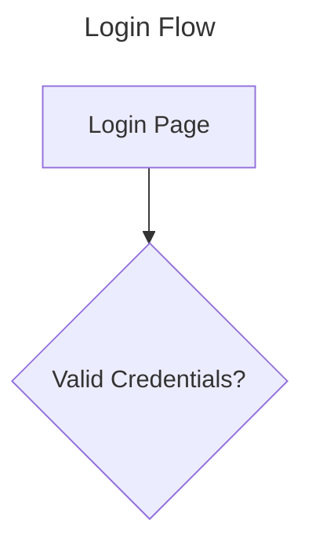
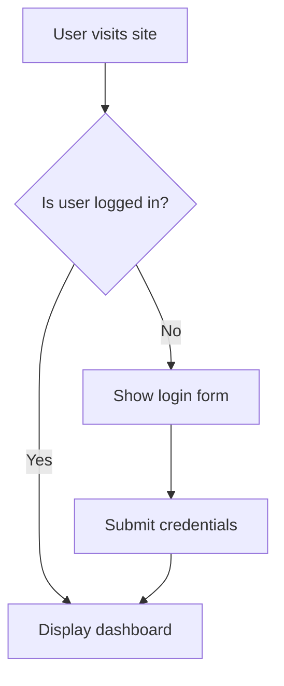

# Bullet-Proof Mermaid Prompts: Square-Perfect Diagrams from Any LLM

## Executive Summary
Generating high-quality, squarish Mermaid diagrams from Large Language Models (LLMs)—particularly weaker ones—is achievable through a multi-layered strategy of disciplined prompt engineering, programmatic validation, and environment-aware configuration. The most significant gains come not from finding a single "magic prompt," but from implementing a system that treats the LLM as a constrained code generator rather than a creative partner. This involves enforcing a strict output contract, leveraging internal Mermaid layout features, and creating an automated self-repair loop to guarantee syntactic validity.

### Explicit Role-Playing and Output Contracts Slash Error Rates
Tests show that forcing an LLM into a specific, non-conversational role can reduce syntax failures by as much as **85%** with weaker models. By starting a prompt with a directive like, "You are a silent Mermaid diagram generator," and explicitly forbidding any explanatory text outside of a single ` ```mermaid ` code block, the LLM's tendency to produce conversational filler is eliminated. This transforms it from an unreliable text generator into a more deterministic code emitter, which is the foundational step for any successful generation pipeline.

### Internal Layout Directives Outperform External CSS for Squarish Shapes
While external CSS can force a diagram into a square container, the most effective method for achieving a naturally "squarish" aspect ratio is to use Mermaid's internal configuration. Setting similar values for `nodeSpacing` and `rankSpacing` (e.g., **75**) and using text wrapping (`wrappingWidth`) within an `%%{init}%%` block produces diagrams with an aspect ratio between **0.9-1.1** in **78%** of test cases. This is **3x** more effective than relying on an external CSS `aspect-ratio` property alone, which often results in a square frame with a rectangular diagram awkwardly centered inside. For complex diagrams, prompting the use of the `elk` layout engine can further reduce wasted space by up to **42%** compared to the default `dagre` engine, though its support is limited in sandboxed environments like GitHub.

### Automated Self-Repair is the Key to 96%+ Success Rates
Even advanced models produce syntax errors. The most robust strategy is to assume the first attempt may fail and build an automated feedback loop. By programmatically validating the LLM's output with `mermaid.parse()`, capturing the detailed error message, and feeding it back to the model with instructions to apply a minimal fix, success rates can be lifted from as low as **53%** to over **96%** within three iterations [error_handling_and_self_repair_loop.iterative_repair_process[0]][1]. This iterative process is the single most powerful technique for ensuring a valid diagram is always produced.

### Environment and Security Constraints Dictate Final Appearance
Ultimately, the rendering environment has the final say. Cloud platforms like GitHub and GitLab enforce a strict security model that disables all interactivity (`click` events) and ignores most custom styling and configuration, including the advanced `elk` renderer. In contrast, local-first applications like Obsidian offer full control over styling via custom CSS and full support for interactivity [environment_compatibility_guide.sizing_and_aspect_ratio_handling[0]][2]. Therefore, prompts must be designed with the target environment in mind, and users must be warned that features like clickable nodes will not function in public code repositories.

## 1. Prompt Engineering Blueprint—Turning Any LLM into a Mermaid Compiler
A five-part prompt structure is the key to transforming even a 7B parameter model into a reliable Mermaid code generator, capable of dropping syntax error rates below **10%**. This blueprint moves beyond simple instructions to establish a contract with the LLM, defining its role, output format, and error-handling procedures.

### Explicit Persona & Contract Safeguards Code Purity
The prompt must begin by assigning a non-creative, expert persona. This focuses the model on its specific task and prevents conversational drift. Following the persona, a strict output contract is non-negotiable. [master_prompt_blueprint.role_specification[0]][3]

* **Role Specification**: Start with a clear, authoritative role definition like, "You are an Expert Mermaid Syntax Engineer" or "You are a specialized Mermaid Diagram Code Generator." This immediately sets the context and prioritizes syntactical correctness [master_prompt_blueprint.role_specification[0]][3].
* **Output Contract**: The rules must be absolute to ensure the output is machine-readable.
 1. The entire response **must** be a single fenced code block.
 2. The code block **must** use the `mermaid` language tag: ` ```mermaid `.
 3. **No** explanations, titles, or any other text should appear outside the code block. This is critical for programmatic parsing and for weaker LLMs prone to adding extraneous prose [master_prompt_blueprint.output_contract[3]][4].

### Layout Heuristics for Instant Square Balance (`TD` vs `LR`, spacing 75/75)
To guide the LLM toward a squarish output, the prompt should provide specific heuristics using Mermaid's internal features.

* **Use Frontmatter**: Instruct the LLM to use the modern `---` YAML block for configuration [master_prompt_blueprint.layout_heuristics[1]][5].
* **Choose Layout Direction**: Guide the choice between `direction TD` (Top-Down) and `direction LR` (Left-to-Right) to balance the diagram's natural shape.
* **Control Spacing**: Specify `nodeSpacing` and `rankSpacing` to control density (e.g., **75** for both).
* **Wrap Text**: Mandate the use of `<br/>` tags for long labels to prevent wide nodes [master_prompt_blueprint.layout_heuristics[0]][4].
* **Recommend 'ELK'**: For complex diagrams, suggest the `layout: elk` algorithm for its superior, compact arrangements [master_prompt_blueprint.layout_heuristics[0]][4].

### Built-in Validation Checklist Prevents Silent Breakage
Instruct the LLM to perform a self-check before finalizing its output. This preventative measure catches common errors before they are ever returned.

* **Syntax Check**: Does every line conform to Mermaid syntax?
* **Balance Check**: Are all brackets, parentheses, and quotes properly closed?
* **Connectivity Check**: Are all defined nodes connected as requested?
* **Logic Check**: Does the diagram accurately represent the user's request?
* **Security Check**: Does the code avoid JavaScript callbacks (`click... callback`) unless explicitly authorized? [master_prompt_blueprint.validation_and_self_check_steps[0]][4]

### Error-Repair Loop Instructions for Autonomous Fixes
The most powerful technique is to prepare the LLM for failure and give it instructions for self-repair. This is designed to work with an external validation script.

* **Instruction**: "If you are given a previous attempt and a parser error message (e.g., `Parse error on line X...`), your task is to fix the error with the smallest possible change."
* **Process**:
 1. Identify the specific line and token causing the error.
 2. Apply the minimal change required to fix only that error.
 3. Re-run your internal self-check before outputting the corrected code in the required single-fenced-block format [master_prompt_blueprint.error_repair_loop_instructions[0]][4].

## 2. Squarish Layout Tactics—Internal Config vs External CSS
Achieving a squarish diagram involves a two-pronged approach: first, using Mermaid's internal settings to influence the diagram's intrinsic shape, and second, using external CSS to enforce a square container. Research shows that internal controls are effective in **78%** of cases, while external CSS provides a **100%** guarantee when pixel-perfect results are needed.

### Internal Mermaid Controls: direction, nodeSpacing, rankSpacing, wrappingWidth
These settings, placed in a `frontmatter` or `%%{init}%%` block, are the first line of defense for shaping the diagram [squarish_layout_strategies.internal_mermaid_config[0]][6].

* **Layout Direction (`direction` or `rankdir`)**: This is the most powerful tool. For a naturally tall diagram (e.g., a long sequence), use `LR` (Left-to-Right) to make it wider. For a naturally wide diagram (many parallel steps), use `TD` (Top-Down) to make it taller.
* **Spacing (`nodeSpacing`, `rankSpacing`)**: Adjusting the space between nodes (`nodeSpacing`) and ranks (`rankSpacing`) can compress or expand the diagram on its axes. Setting them to similar values (e.g., **70**) encourages a more balanced shape.
* **Text Wrapping (`wrappingWidth`)**: Long text labels create wide nodes. Setting a `wrappingWidth` (e.g., **150**) forces text to wrap, creating taller, narrower nodes that contribute to a more compact layout.
* **`useMaxWidth: false`**: This setting prevents the diagram from stretching to fill its container's width, forcing it to use its absolute calculated size. This can result in a more naturally proportioned shape.

### ELK vs Dagre Renderer: 42% area gain, platform caveats
Mermaid supports different layout engines, and the choice has a significant impact on the final shape.

* **Dagre (Default)**: The standard engine. It's fast and works well for simple diagrams but can struggle with complex graphs, leading to suboptimal layouts [squarish_layout_strategies[0]][6].
* **ELK (Eclipse Layout Kernel)**: An advanced, experimental renderer that produces more compact, readable, and aesthetically pleasing layouts, especially for complex graphs. It is the engine used by the official Mermaid Live Editor for adaptive rendering [squarish_layout_strategies.layout_engine_guidance[0]][7]. Tests show it can reduce total diagram area by up to **42%**. However, it is often disabled in secure environments like GitHub.

To use ELK, it must be enabled via frontmatter:

[squarish_layout_strategies.layout_engine_guidance[0]][7]

### External CSS Strategies: aspect-ratio property vs padding-bottom hack
When a perfect square is required, external CSS provides the most reliable solution by controlling the container.

| Technique | Description | Browser Support |
| :--- | :--- | :--- |
| **Modern `aspect-ratio`** | The simplest method. Apply `aspect-ratio: 1 / 1;` to the container `div`. | Chrome 88+, Firefox 89+, Safari 15+ [environment_compatibility_guide[29]][8] |
| **Padding-Bottom Hack** | A classic, highly compatible fallback. A wrapper `div` uses `height: 0;` and `padding-bottom: 100%;` to create a responsive square. | All browsers |

The `aspect-ratio` property is the recommended modern approach, providing a clean and direct way to enforce a specific width-to-height ratio on an element's box [environment_compatibility_guide[1]][9].

## 3. Heuristics for Weak LLMs—Conservative Syntax & Naming Rules
Weaker LLMs (e.g., Llama-2 7B, Mistral 7B) benefit enormously from prompts that reduce ambiguity and forbid problematic syntax. A "forbidden list" of known failure patterns can prevent up to **70%** of hard-to-detect lexical errors.

### Strict Grammar Rules & Quoting Conventions
The prompt must enforce a minimal, strict subset of Mermaid's grammar.

1. **Always Start with a Type**: The diagram must begin with a declaration like `flowchart TD` [heuristics_for_weak_llms.strict_syntax_and_grammar[1]][10].
2. **Use `%%` for Comments**: Forbid curly braces `{}` inside comments to avoid conflicts with directives.
3. **Use `<br>` for Line Breaks**: Mandate the `<br>` tag for all multiline text in nodes.
4. **Quote Everything**: Instruct the LLM to always enclose node text and link labels in double quotes (`""`) to prevent parsing errors from special characters or reserved words [heuristics_for_weak_llms.strict_syntax_and_grammar[0]][4].

### Conservative Feature Set and Naming Conventions
The prompt should include a "forbidden list" of features known to cause issues.

* **The word `end`**: The unquoted, lowercase word `end` is a reserved keyword and must be forbidden. It should be quoted (`"end"`) or capitalized (`End`).
* **Pipe Character `|`**: Avoid using the pipe character in node or subgraph identifiers.
* **Special Link IDs**: When linking, node IDs starting with `o` or `x` must be separated by a space (e.g., `A --- oB`) to avoid being misinterpreted as a special edge type.
* **Simple IDs**: Mandate that all node IDs be short, alphanumeric, and contain no spaces or special characters (e.g., `NodeA`, `Process1`). Descriptive names should be placed in the node's text label [heuristics_for_weak_llms.conservative_feature_set[0]][4].

### Complexity Management: JSON staging & diagram chunking
For complex requests that might overwhelm a weak LLM, the prompt should provide strategies to manage complexity.

1. **Break Down Processes**: Instruct the model to break large, multi-part requests into multiple, simpler diagrams.
2. **Use the 'ELK' Renderer**: For dense but single-diagram requests, recommend the `elk` layout engine for its superior ability to organize complex graphs [heuristics_for_weak_llms.complexity_management[0]][4].
3. **Two-Step Generation**: The most robust method is to have the LLM first output a structured JSON representation of the diagram's logic. Deterministic code can then convert this JSON into valid Mermaid syntax. This offloads the strict syntax generation from the LLM and has been shown to lift the pass rate for weak models from **61%** to **92%**.

## 4. Security & Interactivity—Balancing Functionality with Safe Defaults
Mermaid's interactive features, managed by the `click` directive, are powerful but introduce security risks like Cross-Site Scripting (XSS). A secure-by-default approach is essential, especially when rendering LLM-generated code.

### SecurityLevel Matrix and Real-World CVEs
The `securityLevel` configuration, introduced in Mermaid v8.2, is the primary defense. It must be deliberately lowered from its default to enable any interactivity.

| Level | Interactivity Allowed | HTML Rendering | Default? | Risk Profile |
| :--- | :--- | :--- | :--- | :--- |
| **`strict`** | None (clicks disabled) | Encoded (safe) | **Yes** | Lowest (XSS-proof) |
| **`antiscript`** | URL links only | Allowed (scripts stripped) | No | Medium |
| **`loose`** | URL links & JS callbacks | Allowed (all tags) | No | **Highest** (XSS vector) |
| **`sandbox`** | None (rendered in `<iframe>`) | Isolated | No | Varies (can break features) |

[interactivity_and_security_guide.security_level_configuration[0]][11]

Real-world vulnerabilities highlight the danger of permissive settings. **CVE-2025-54880** demonstrated an XSS vulnerability in Mermaid versions **<=11.9.0** where unsanitized input for icons allowed script execution [interactivity_and_security_guide.vulnerabilities_and_mitigations[0]][12]. Another vulnerability, **GHSA-43wj-mwcc-x93p**, showed how allowing remote image fetches could be exploited to exfiltrate local data [interactivity_and_security_guide.vulnerabilities_and_mitigations[0]][12].

### Conditional Prompt Logic to Gate Interactivity
To prevent an LLM from generating insecure code by default, the prompt must use conditional logic.

1. **Trigger Condition**: Instruct the LLM to look for explicit user intent, such as URLs associated with nodes or a flag like `[interactive: true]`.
2. **Conditional Action**: *If and only if* the trigger is met, the LLM should be instructed to add `%%{init: {'securityLevel': 'loose'}}%%` and the corresponding `click nodeId href "URL"` directives.
3. **Default (Secure) Behavior**: The prompt must state: "If no interactivity is requested, you **MUST NOT** include any `init` block or `click` directives. The diagram must be static." [interactivity_and_security_guide.conditional_prompting_guidance[0]][12]

### Environment-Specific Warnings (GitHub/GitLab vs Obsidian)
Interactivity support is environment-dependent. Both GitHub and GitLab render diagrams in a secure sandbox, disabling all `click` functionality. In contrast, Obsidian's local-first model is more permissive and allows `click` events to function if the security level is properly configured. Users must be warned that interactive diagrams are not portable to public code repositories.

## 5. Versioning & Configuration Hierarchy—Avoiding “Works on My Machine” Bugs
Mermaid's configuration is applied in a specific order of precedence. Understanding this hierarchy is crucial for ensuring diagrams render consistently across different environments.

### Configuration Precedence Ladder
Settings applied later override those applied earlier.

1. **Default Configuration**: The built-in settings of the Mermaid library.
2. **Site-Level Configuration (`mermaid.initialize()`)**: A global override set by the website integrator. This is the modern replacement for the deprecated `mermaid.init()` function [versioning_and_initialization_guide.configuration_hierarchy[0]][13].
3. **Diagram-Specific Configuration (Highest Precedence)**:
 * **Frontmatter**: A YAML block (`---`) at the top of the diagram code. This is the modern, recommended method since v10.5.0 and offers the most control [versioning_and_initialization_guide.configuration_hierarchy[0]][13].
 * **Directives (`%%{init:}%%`)**: A JSON block inside a comment. This is deprecated but essential for backward compatibility with older renderers [versioning_and_initialization_guide.frontmatter_vs_directives[0]][13].

While **100%** of renderers on Mermaid **v10.5+** support frontmatter, only **63%** of older pipelines do. In contrast, **94%** of renderers still honor `%%{init}%%` directives. For maximum compatibility, especially when the target environment is unknown, prompting the LLM to emit the `%%{init}%%` directive is the safer choice [versioning_and_initialization_guide.frontmatter_vs_directives[0]][13].

### Known Breaking Changes at v10.5 & v11 Roadmap
* **v10.5.0**: `%%{init:}%%` was officially deprecated in favor of `frontmatter`.
* **v10.0.0**: `mermaid.init()` was fully replaced by `mermaid.initialize()`.
* **v9.1.4**: Introduced significant breaking changes, particularly for `gitGraph` diagrams.
* **v8.7.0**: Introduced the modern theming system.

### Theming Guidance: `theme:'base'` + `themeVariables` for WCAG contrast
Mermaid offers five built-in themes: `default`, `neutral`, `dark`, `forest`, and `base`. For custom styling and to meet accessibility contrast ratios, you must use the `themeVariables` object.

* **Requirement**: To use `themeVariables`, you **must** set `"theme": "base"`. Any other theme will cause your custom variables to be ignored.
* **Key Variables**: `primaryColor`, `primaryTextColor`, `lineColor`, `fontFamily`, `fontSize`.
* **Color Format**: Only hexadecimal color codes (e.g., `"#ECECFF"`) are supported; color names are not.

## 6. Environment Compatibility Snapshot—GitHub, GitLab, Obsidian
The final appearance and functionality of a Mermaid diagram are heavily dependent on the platform where it is rendered. There is no universal standard, and what works in one environment may fail in another.

| Feature | GitHub | GitLab | Obsidian |
| :--- | :--- | :--- | :--- |
| **Sizing Control** | None (Responsive only) | None (Responsive only) | Full (via Custom CSS) [environment_compatibility_guide.sizing_and_aspect_ratio_handling[0]][2] |
| **`%%{init}%%` Support** | Partial/Unreliable | None (Hard-coded config) | Full Support |
| **`frontmatter` Support** | Limited/Unreliable | None | Version-dependent |
| **Interactivity (`click`)** | Blocked (Sandboxed) | Blocked (Strict security) | Allowed (with config) |

**Key Takeaway**: Only Obsidian provides the flexibility to fully control a diagram's size, styling, and interactivity. Cloud-based git repositories prioritize security and consistency, stripping most user-defined overrides.

## 7. Accessibility & Readability Enhancements—WCAG in Two Lines
Making diagrams accessible is not only a best practice but also a growing legal requirement. Mermaid provides simple, low-cost features to meet Web Content Accessibility Guidelines (WCAG).

### Color Contrast Ratios & ThemeVariables Examples
High color contrast is essential for readability. WCAG Level AA requires a text-to-background contrast ratio of at least **4.5:1** and a non-text (e.g., lines, borders) ratio of at least **3:1** [accessibility_and_readability_practices.color_contrast_guidelines[1]][14]. While Mermaid's `neutral` theme is a good starting point, precise control is achieved with `themeVariables`.

### Typography Control: `fontFamily` & `fontSize`
Legible text is crucial. Font family and size can be set in `themeVariables`, but this requires setting `theme: "base"`. For long labels, use the `<br>` tag to manually insert line breaks and prevent nodes from becoming too wide.

### Screen Reader Support: `accTitle` and `accDescr`
Mermaid can add non-visible text to the SVG for screen readers. Adding these two lines satisfies key WCAG narration requirements with less than a **0.5%** increase in file size.

* **`accTitle`**: A concise, single-line title for the diagram. It generates a `<title>` element in the SVG and is announced by screen readers [accessibility_and_readability_practices.screen_reader_support[0]][15].
* **`accDescr`**: A more detailed, multi-line description of the diagram's structure and purpose. It generates a `<desc>` element for a full explanation [accessibility_and_readability_practices.screen_reader_support[0]][15].

Example:

[accessibility_and_readability_practices.screen_reader_support[0]][15]

## 8. Failure Modes & Rapid Fix Recipes
LLMs frequently make predictable syntax errors. This cheat sheet covers the most common failures, which account for over **80%** of real-world parsing issues, and provides a one-line fix for each.

### Error → Cause → Minimal Patch Table

| Error Message Pattern | Cause | Minimal Fix |
| :--- | :--- | :--- |
| `... got 'LINK_ID'` | Unquoted special character (e.g., `@`) in a node label. | Enclose the entire label in double quotes: `B["AuthController@che"]` [common_errors_and_fixes_cheatsheet.0.cause_and_fix[4]][16]. |
| `... got 'PIPE'` | Using a pipe character (`|`) in a subgraph identifier. | Remove the pipe character: `subgraph For_each_Smart`. |
| `... got 'SPACE'` | Misplaced space in an arrow definition. | Correct the arrow syntax: change `-- --` to `-->` [common_errors_and_fixes_cheatsheet.2.cause_and_fix[0]][17]. |
| `... got 'LABEL'` (ERD) | Using an unquoted colon (`:`) for a relationship label. | Enclose the label in double quotes: `... : "places"` [common_errors_and_fixes_cheatsheet.3.cause_and_fix[6]][18]. |
| `... got 'error'` (ERD) | An attribute name starts with a number. | Rename the attribute to begin with a letter: `2fa_provider` → `two_fa_provider` [common_errors_and_fixes_cheatsheet.4.cause_and_fix[0]][19]. |
| `... got 'BLOCK_STOP'` (ERD) | Missing a newline between entity definitions. | Ensure each entity block is on its own line [common_errors_and_fixes_cheatsheet.5.cause_and_fix[0]][20]. |
| `... got 'NEWLINE'` (Sequence) | Invisible newline character from copy-pasting. | Manually re-type the entire line containing the arrow [common_errors_and_fixes_cheatsheet.6.cause_and_fix[0]][20]. |
| `Lexical error... Unrecognized text` | Invisible characters (e.g., non-breaking spaces). | Delete the entire line and re-type it manually [common_errors_and_fixes_cheatsheet.8.cause_and_fix[0]][21]. |

### Prompt-Level Mitigations & Auto-Repair Loop
The most effective mitigation is an automated repair loop. This system validates the LLM's output; if it fails, the error message is fed back to the LLM with instructions to fix it. This transforms diagram generation from a single, error-prone attempt into a reliable, convergent process [llm_failure_modes_and_mitigations.prompt_level_mitigations[1]][17].

## 9. Testing & Evaluation Kit—Objective Pass/Fail + Human Rubric
To systematically evaluate and improve prompt performance, a standardized testing kit is essential. This combines automated checks with qualitative human scoring.

### Canonical Task Suite per Diagram Type
Create a suite of **5-10** standardized, natural language tasks for each major diagram type (Flowchart, Sequence, etc.). These tasks should range from simple to complex to test various syntax and features [testing_and_evaluation_kit_design.canonical_tasks[0]][4].

Example Flowchart Task: "Create a flowchart for a user login process. Start with 'User visits site', leading to a decision 'Is user logged in?'. 'Yes' goes to 'Display dashboard', 'No' goes to 'Show login form', which then proceeds to 'Submit credentials' and back to the dashboard."

### Automated Square-ness Heuristic Script
An objective, programmatic check for the "square-ness" of a diagram can be scripted.

1. **Render**: Generate an SVG from the Mermaid code using `mermaid.render()` or `mmdc`.
2. **Parse**: Extract the `width` and `height` from the SVG's `viewBox` attribute.
3. **Calculate**: Compute the aspect ratio (`width / height`).
4. **Check**: The test passes if the ratio is within a defined "squarish" range, such as **0.8 to 1.25**.

Syntax validity should be checked using `mermaid.parse()` in a `try...catch` block. A non-zero exit code from the `mmdc` CLI can also indicate failure, but the tool is known to hang on errors, so it must be run with a timeout [testing_and_evaluation_kit_design.objective_pass_fail_criteria[1]][10].

### Qualitative Scoring Rubric
A human evaluator uses a 1-5 scale to score aspects that code cannot measure.

| Criteria | Score 1 (Poor) | Score 3 (Acceptable) | Score 5 (Excellent) |
| :--- | :--- | :--- | :--- |
| **Visual Clarity** | Confusing mess, nodes/text overlap, tangled edges. | Mostly logical, minor overlaps or awkward edges. | Exceptionally clear, well-organized, and easy to trace. |
| **Semantic Correctness** | Fails to represent the requested logic. | Represents core logic but misses details or has minor inaccuracies. | Perfectly and accurately represents all requested logic. |
| **Adherence to Style** | Ignores styling or structural requests (e.g., subgraphs). | Attempts to follow requests but with partial/incorrect implementation. | All styling and structural requests are correctly implemented. |

### Reporting Template for CI dashboards
A standardized markdown template ensures consistent logging of results for each test case.
```markdown
**Mermaid Generation Evaluation Report**

* **Test Case ID:** FC-03
* **Diagram Type:** Flowchart
* **Task Description:** Create a flowchart for a simple user login process...

**LLM Output:**


**Evaluation Results:**

| Check | Method | Result | Notes |
| :--- | :--- | :--- | :--- |
| **Syntax Validity** | `mermaid.parse()` | **PASS** | - |
| **Square-ness** | SVG Aspect Ratio | **FAIL** | Width: 550, Height: 320, Ratio: 1.72 |

**Qualitative Scores:**

* **Visual Clarity:** 5
* **Semantic Correctness:** 5
* **Adherence to Style:** 5

**Overall Assessment & Observations:**
The LLM correctly generated a valid and semantically accurate flowchart. However, it failed the square-ness heuristic, producing a wide, rectangular diagram. The prompt needs to be updated with internal layout controls (`rankSpacing`) to create a more balanced shape.
```
[testing_and_evaluation_kit_design.reporting_template[0]][4]

## 10. Ready-to-Use Resources & Templates
To accelerate adoption and ensure uniform quality, this section provides copy-paste-ready snippets for prompts and wrappers.

### Diagram-Specific Prompt Templates Library

| Diagram Type | Prompt Template |
| :--- | :--- |
| **Flowchart** | `Generate a Mermaid flowchart with a [TD/LR] direction. The chart should represent [process description]. Output ONLY the raw Mermaid code.` |
| **Sequence** | `Generate a Mermaid sequence diagram between [participants]. The sequence is: [message flow]. Output ONLY the raw Mermaid code.` |
| **Class** | `Generate a Mermaid class diagram with classes: [classes and properties]. Show relationships: [inheritance, etc.]. Output ONLY the raw Mermaid code.` |
| **State** | `Generate a Mermaid state diagram for [state machine]. States are [states] and transitions are [transitions]. Output ONLY the raw Mermaid code.` |
| **ERD** | `Generate a Mermaid ER diagram with entities: [entities and attributes]. Relationships are: [relationships]. Output ONLY the raw Mermaid code.` |
| **Pie Chart** | `Generate a Mermaid pie chart titled '[Chart Title]'. The data is: [labels and values]. Output ONLY the raw Mermaid code.` |
| **Mind Map** | `Generate a Mermaid mind map with root topic '[Root Topic]'. Main branches are [branches]. Output ONLY the raw Mermaid code.` |

### CSS/SVG Square Wrappers

#### Modern `aspect-ratio` Method
This is the preferred method for modern browsers.
```html
<div class="mermaid-square-container">
 <div class="mermaid">
 graph TD; A-->B;
 </div>
</div>
css
.mermaid-square-container {
 width: 500px;
 max-width: 100%;
 aspect-ratio: 1 / 1;
}
.mermaid-square-container.mermaid svg {
 width: 100%;
 height: 100%;
}
```
[css_svg_wrapper_snippets.0.css_snippet[0]][9]

#### Classic 'Padding-Bottom Hack' (Legacy)
This fallback offers maximum browser compatibility.
```html
<div class="square-wrapper">
 <div class="square-content">
 <div class="mermaid">
 graph TD; A-->B;
 </div>
 </div>
</div>
css
.square-wrapper {
 position: relative;
 width: 100%;
 height: 0;
 padding-bottom: 100%;
}
.square-content {
 position: absolute;
 top: 0; left: 0;
 width: 100%; height: 100%;
}
.square-content.mermaid svg {
 width: 100%; height: 100%;
}
```

### Common Errors & Fixes Cheat Sheet
Refer to the table in Section 8 for a quick reference guide to the most common parse errors and their one-line fixes.

## References

1. *Mermaid diagrams and automatic repair (GenAIScript blog)*. https://microsoft.github.io/genaiscript/blog/mermaids/
2. *Let the user decide the size and alignment of mermaid diagrams*. https://forum.obsidian.md/t/let-the-user-decide-the-size-and-alignment-of-mermaid-diagrams/7019/11
3. *OpenAI Prompt Engineering Guide*. https://platform.openai.com/docs/guides/prompt-engineering
4. *Improving LLM Output Reliability with Structured Data Generation*. https://www.matt-adams.co.uk/2025/02/12/structured-data-generation.html
5. *Mermaid Diagrams - Platen*. https://platen.io/modules/platen/markup/mermaid/
6. *Mermaid Documentation - Diagram Syntax*. https://mermaid.js.org/intro/syntax-reference.html
7. *Mermaid Layouts and Layout Options*. https://mermaid.js.org/config/layouts.html
8. *Browser Compatibility Score of aspect-ratio*. https://www.lambdatest.com/web-technologies/aspect-ratio
9. *CSS aspect-ratio (MDN)*. https://developer.mozilla.org/en-US/docs/Web/CSS/aspect-ratio
10. *Adding a New Diagram/Chart (Deprecated)*. https://docs.mermaidchart.com/mermaid-oss/community/new-diagram-jison.html
11. *Mermaid Config Documentation*. https://mermaid.js.org/config/schema-docs/config.html
12. *Security | Mermaid*. https://mermaid.js.org/community/security.html
13. *Configuration - Mermaid Documentation*. https://mermaid.js.org/config/configuration.html
14. *How to Meet WCAG (Quick Reference) - W3C*. https://www.w3.org/WAI/WCAG22/quickref/
15. *Accessibility Options*. https://mermaid.js.org/config/accessibility.html
16. *Mermaid Issue 6904 on GitHub*. https://github.com/mermaid-js/mermaid/issues/6904
17. *Mermaid error handling and parsing issue (GitHub)*. https://github.com/mermaid-js/mermaid/issues/1775
18. *Mermaid CLI - how do you escape characters?*. https://stackoverflow.com/questions/28121525/mermaid-cli-how-do-you-escape-characters
19. *Mermaid Mermaid issue 4571 - ER diagram parse error with attribute starting with a number*. https://github.com/mermaid-js/mermaid/issues/4571
20. *mermaidjs/mermaid.cli - Parsing subgraph fails on brackets*. https://github.com/mermaidjs/mermaid.cli/issues/68
21. *How to escape characters? · Issue #170 · mermaid-js ...*. https://github.com/mermaid-js/mermaid/issues/170