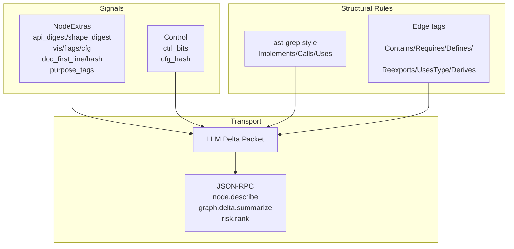

# A006: ISG Strategy for LLMs — Minto Pyramid Summary (CPU-only)

[Essence / Answer]
- Yes: An LLM can reliably reason through LLDs via a CPU-only ISG if we combine structural rules (ast-grep style) with compact interface/context signals and expose small delta packets over stdio.
- Ship five low-risk infrastructure changes now (incremental parsing, rope+interner, ignore-aware scan, debounced workers, stdio JSON-RPC) and enrich ISG with NodeExtras, edge tags, and control-flow fingerprints.
- Keep RustRover analysis JVM-first and legally safe; use native helpers as bounded accelerators with strict contracts.

[SCQA]
- Situation: Parseltongue already meets ambitious latency targets (<12 ms update, <1 ms query) and aspires to be a “Universal IDE Performance Accelerator.”
- Complication: Naming is noisy; heavy analysis (MIR/HIR/type) can be expensive; legal/licensing constraints; need deterministic, incremental signals that are editor/LLM-ready.
- Question: Can we power LLM reasoning (implementors, callers, safety, blast radius, change impact) with CPU-only analysis, incrementally, without reverse engineering?
- Answer: Yes—use tree-sitter + syn for structure; ast-grep-style rules to emit edges; NodeExtras to attach compact, deterministic context; JSON-RPC to stream LLM-friendly deltas.

[Key Messages]
- K1: Zed-inspired pipeline (incremental parsing, scheduling, stdio service) for keystroke-grade latency and lean memory.
- K2: ISG as source-of-truth (Calls/Implements/Uses + tags for Contains/Requires/DefinesAssocType/Reexports/UsesType/Derives).
- K3: Interface/context signals (api_digest + shape_digest, vis/flags, trait contracts, cfg_active, doc fingerprints, purpose tags, ctrl_bits/cfg_hash) make changes machine-legible.
- K4: JVM-first RustRover analysis; native helpers (demangle/DWARF/object scan) behind a strict ABI and black-box validation only where ROI is proven.
- K5: Measurement discipline (JFR/async-profiler, CI perf gates) and legality (OSS sources, no decompilation) are non-negotiable.

[Supporting Messages]
- S1: Structural rules (A003)
  - Rules are edge generators with captures/constraints; keep packs small, versioned, and explainable.
- S2: Interface context (A004)
  - NodeExtras holds vis/flags/module_path/generics/where_bounds/derives/doc/api_digest/shape_digest/cfg_active.
  - LLM Delta Packet includes node/api/effects/coupling/control/trait_contract/doc/change.
- S3: Behavioural hints (A005)
  - ctrl_bits bitfield (cyclomatic, has_loop, early_return, exit_kinds, await_cnt, unsafe_cnt) + cfg_hash for logic-change detection; optional WritesField/ReadsField stubs.
- S4: Low-risk infra (A002 plus strategy)
  - ignore-aware scan, cargo_metadata, rope/interner, debounced workers, stdio JSON-RPC; batch+bincode if time.
- S5: Comparative stance
  - Zed: best live-incremental; RustRover: strongest persistent index (heavier). Adopt selectively.

[Decisions and Tradeoffs]
- Do now: tree-sitter increments, rope+interner, ignore-aware scan, debounced workers, stdio JSON-RPC.
- Consider if needed: batch+bincode transport; optional rust-analyzer HIR/type if Calls/impl accuracy improves >10%.
- Skip for now: broad binary ingestion or deep reverse engineering with licensing risks.

[KPIs]
- Update p95 < 5 ms per edited file; Query p95 < 1 ms; RSS +≤ 30% vs baseline; delta packet ≤ 1.5 KB.
- Accuracy uplift: Implements +100% vs heuristics; Calls +10–20% without RA.
- Determinism: digests stable across platforms; spans round-trip; zero CI crashes.

[Risks & Mitigations]
- Legal/EULA: stay JVM-first, OSS sources, runtime introspection; no redistribution of decompiled code.
- JNI/FFI overhead: batch, direct buffers, counters, fallbacks.
- Cross-platform: signed artifacts, min glibc, MSVC static CRT; smoke tests per OS/arch.
- Data/memory: stream DWARF; compact summaries; bounded pools.

[Deliverables Produced]
- A001 StrategicEvolution (category pivot to Universal IDE Performance Accelerator)
- A002 WhenToStopOptimizing (pragmatic keep/consider/skip)
- A003 StructuralPatternISG (ast-grep-style rules and plan)
- A004 InterfaceContextISG (NodeExtras, signals, delta packet, endpoints)
- A005 ReasoningWithISG (LLD reasoning + behavioural hints ctrl_bits/cfg_hash)
- A006 Minto Pyramid Summary (this file)

[Keywords / Handles]
- ISG, NodeExtras, api_digest, shape_digest, ctrl_bits, cfg_hash, exit_kinds, await_cnt, unsafe_cnt
- Edge tags: Contains, Requires, DefinesAssocType, Reexports, UsesType, Derives, Calls, Implements, Uses
- LLM Delta Packet; graph.delta.summarize; node.describe; risk.rank; rules.apply/list/stats
- Zed, tree-sitter, syn, rope, interner, ripgrep/ignore
- RustRover, JVM-first analysis, JFR, async-profiler, Hybrid Plan 2.0
- cfg_active, purpose_tags, doc_first_line, doc_hash, WritesField, ReadsField, MutatesSelf

[Mermaid — Concept Map]

[Next Actions]
- Implement ctrl_bits/cfg_hash extraction with a single-pass syn/tree-sitter scanner; wire into NodeExtras and delta packet.
- Add rules.apply/list/stats endpoints and golden edges/tests; perf gates in CI.
- Integrate ignore-aware scanner + debounced workers; evaluate live typing on large files.
