# A011: Evolved Journey - Complete User Experience PRD

## Executive Summary

**Job to Be Done:** Help Rust developers make fast, confident contributions to OSS projects, even when new to the codebase.

**Primary User:** Rust developer who wants to contribute to OSS but doesn't know where to start or how to avoid breaking things.

**Key Innovation:** Interface Signature Graph (ISG) + Dual-State Architecture that shows architectural structure and simulates changes before implementation.

## User Journey: Install → First Contribution

### Phase 0: System Validation & Installation (0-10 minutes)

#### Job: "Is this going to work on my system and is it worth installing?"

**User Concern:** "I don't want to waste time on tools that won't work or require complex setup."

**Experience Design:**
```bash
# One-command system validation
curl -sSL https://get.parseltongue.sh | sh

# Intelligent system check
✓ Apple Silicon M1/M2/M3 detected - optimized
✓ 16GB+ RAM found - sufficient for model
✓ Rust 1.70+ installed - compatible
⚠  Ollama not found - installing Qwen 2.5-Coder 7B Q4_K_M (~4.25GB)
✓ Model download: 60-90 tokens/sec, 128k context
✓ System ready: <5s codebase analysis, <1ms queries
```

**Architecture Differentiator:** Pre-flight validation that prevents failed installations
```rust
// System validator with intelligent recommendations
pub struct SystemValidator {
    pub apple_silicon_check: AppleSiliconOptimizer,
    pub memory_analyzer: MemoryRequirementValidator,
    pub rust_toolchain: RustCompatibilityChecker,
    pub ollama_installer: OneClickModelDeployment,
}
```

**Success Criteria:**
- ✅ < 60 seconds from curl to first successful analysis
- ✅ Zero manual configuration required
- ✅ Intelligent fallbacks for different system specs

### Phase 1: First Value Discovery (10-30 minutes)

#### Job: "Show me this actually works on a real project"

**User Concern:** "I don't want to read docs - show me it works immediately."

**Experience Design:**
```bash
# Auto-detect Rust projects and offer immediate analysis
$ parseltongue
🔍 Found 3 Rust projects in current directory:
   1. ./my-rust-app (5.2k LOC)
   2. ./dependency (1.1k LOC)
   3. ./tests (800 LOC)

🎯 Quick start suggestion: Analyze ./my-rust-app (your main project)
[Y/n]? Y

⚡ Building Interface Signature Graph...
✓ 1,247 interfaces analyzed in 3.2 seconds
✓ 42 architectural patterns identified
✓ 12 potential contribution opportunities found

💡 Ready for natural language queries!
Try: "parseltongue ask 'where should I add error handling?'"
```

**Architecture Differentiator:** Zero-config immediate value demonstration
```rust
// Intelligent project discovery with immediate analysis
pub struct ProjectDiscovery {
    pub rust_project_finder: RustProjectDetector,
    pub quick_analyzer: SubSecondISGGeneration,
    pub pattern_matcher: ImmediateInsightEngine,
    pub opportunity_scout: ContributionOpportunityFinder,
}
```

**Success Criteria:**
- ✅ < 30 seconds from first run to architectural insights
- ✅ Immediate actionable contribution opportunities identified
- ✅ No manual configuration or setup required

### Phase 2: Architectural Understanding (30-60 minutes)

#### Job: "Help me understand how this codebase actually works"

**User Concern:** "This codebase is huge and I'm afraid of breaking something."

**Experience Design:**
```bash
$ parseltongue ask "what are the main architectural components?"

🏗️  Core Architecture (3 main layers):
   1. API Layer (421 interfaces)
      - HTTP handlers, request/response models
      - Authentication middleware
      - Rate limiting and validation

   2. Business Logic (312 interfaces)
      - Domain models, service layer
      - Business rules and validation
      - Event handling and workflows

   3. Data Layer (214 interfaces)
      - Database repositories, query builders
      - Data access objects, caching layer
      - Migration and schema management

🔗 Key Dependencies:
   API Layer → Business Logic → Data Layer
   All layers depend on shared error handling and logging

💡 Contribution Opportunities:
   - High Impact: API layer rate limiting enhancement
   - Low Risk: Data layer query optimization
   - Learning: Business logic feature addition
```

**Architecture Differentiator:** Interface-centric understanding vs code-level analysis
```rust
// Architectural pattern recognition and explanation
pub struct ArchitecturalIntelligence {
    pub pattern_detector: LayerIdentification,
    pub dependency_mapper: InterfaceRelationshipMapper,
    pub opportunity_ranker: ImpactVsRiskAnalyzer,
    pub explainer: NaturalLanguageArchitecturalDescription,
}
```

**Success Criteria:**
- ✅ Comprehensive architectural understanding in < 5 minutes
- ✅ Risk-assessed contribution opportunities
- ✅ Clear mental model of codebase structure

### Phase 3: Safe Contribution Planning (1-2 hours)

#### Job: "Help me plan a change that won't break everything"

**User Concern:** "I want to contribute but I'm afraid of introducing regressions."

**Experience Design:**
```bash
$ parseltongue propose "Add rate limiting to API endpoints"

🎯 Change Impact Analysis:
   • Interfaces to modify: 12 (API layer)
   • Interfaces to add: 3 (rate limiting service)
   • Blast radius: API layer only (isolated)
   • Risk level: LOW (well-contained change)

🔬 Predictive Simulation:
   Current Request Flow:
   Client → HTTP Handler → Service → Database

   Proposed Request Flow:
   Client → Rate Limiter → HTTP Handler → Service → Database

⚠️  Identified Risks:
   - Rate limiter performance bottleneck (mitigation: Redis cache)
   - Existing client compatibility (mitigation: gradual rollout)
   - Testing complexity (mitigation: integration test templates)

✅ Change Safety Score: 8.5/10

📋 Implementation Plan:
   1. Create rate limiting service (2 interfaces)
   2. Add rate limiting middleware (1 interface)
   3. Update API handlers to use middleware (12 interfaces)
   4. Add comprehensive tests (existing patterns)
   5. Update documentation (README + API docs)

💡 Pro Tip: Start with a single endpoint for validation
```

**Architecture Differentiator:** Dual-state architecture with predictive simulation
```rust
// Change simulation with risk assessment
pub struct ChangeSimulator {
    pub impact_analyzer: BlastRadiusCalculator,
    pub dependency_checker: InterfaceDependencyGraph,
    pub risk_assessor: MultiDimensionalRiskAnalysis,
    pub mitigation_generator: RiskMitigationStrategies,
}
```

**Success Criteria:**
- ✅ Change impact prediction with > 90% accuracy
- ✅ Risk mitigation strategies automatically generated
- ✅ Implementation plan with step-by-step guidance

### Phase 4: Confident Implementation (2-4 hours)

#### Job: "Guide me through implementing this change safely"

**User Concern:** "I have the plan but I'm nervous about the actual implementation."

**Experience Design:**
```bash
$ parseltongue implement --guided "rate limiting"

🛠️  Step 1: Create RateLimiting Service
   File to create: src/services/rate_limiting.rs
   Interfaces: RateLimitService, RateLimitConfig

   [S]how template [C]reate manually [A]bort? S

// Shows optimized template
pub struct RateLimitService {
    limiter: Arc<RateLimiter>,
    config: RateLimitConfig,
}

impl RateLimitService {
    pub fn new(config: RateLimitConfig) -> Self { /* ... */ }
    pub fn check_rate(&self, key: &str) -> Result<(), RateLimitError> { /* ... */ }
}

💡 Template uses existing error handling patterns from codebase

✅ Template created at src/services/rate_limiting.rs
🧪 Test generated at tests/services/rate_limiting_test.rs

🛠️  Step 2: Add Rate Limiting Middleware
   File to modify: src/middleware/mod.rs

   [A]pply change [S]how diff [V]iew code [A]bort? A

✅ Middleware added successfully
🧪 Integration tests updated automatically
📝 Documentation updated in README.md

🛠️  Step 3: Update API Handlers (12 interfaces)
   Progress: ████████████████████ 12/12

✅ All handlers updated
🧪 All tests passing: 142 existing + 8 new

🎯 Ready for PR!
```

**Architecture Differentiator:** Guided implementation with automatic test generation
```rust
// Step-by-step implementation with validation
pub struct GuidedImplementation {
    pub template_generator: ContextualCodeTemplates,
    pub test_generator: AutomaticTestCreation,
    pub change_applier: SafeCodeModification,
    pub validator: ContinuousValidation,
}
```

**Success Criteria:**
- ✅ Step-by-step guidance reduces implementation anxiety
- ✅ Automatic test generation ensures safety
- ✅ Continuous validation prevents breaking changes

### Phase 5: Quality Contribution Submission (4-6 hours)

#### Job: "Help me create a high-quality PR that gets accepted"

**User Concern:** "I've implemented the change but will maintainers accept it?"

**Experience Design:**
```bash
$ parseltongue submit --project iggy

🔍 PR Quality Analysis:
   ✓ Code follows project style guide
   ✓ Tests cover all new functionality
   ✓ Documentation is comprehensive
   ✓ Commit messages follow project conventions
   ✓ Breaking changes properly documented
   ✓ Performance impact measured (< 2% overhead)

📝 PR Draft Generated:
   Title: feat: Add configurable rate limiting to API layer

   Body:
   ## Problem
   API endpoints currently have no rate limiting, making them vulnerable
   to abuse and potential DoS attacks.

   ## Solution
   Added configurable rate limiting middleware using token bucket algorithm.
   - Configurable limits per endpoint
   - Redis-based distributed rate limiting
   - Graceful degradation when Redis is unavailable
   - Comprehensive logging and metrics

   ## Testing
   - Unit tests for rate limiting logic (100% coverage)
   - Integration tests for API endpoints
   - Load testing showing < 2% performance overhead
   - Chaos testing for Redis failure scenarios

   ## Breaking Changes
   None - feature is behind optional configuration

   🎯 PR Score: 9.2/10 (High quality, ready for review)

💡 Community Alignment:
   ✓ This addresses issue #1234 from project roadmap
   ✓ Similar implementations discussed in Discord last week
   ✓ Maintainer @username expressed interest in rate limiting

🚀 Ready to submit?
[Y/n]? Y

✅ PR created: https://github.com/iggy-rs/iggy/pull/567
🎯 Next: Monitor PR feedback and respond to reviews
```

**Architecture Differentiator:** Community intelligence integration for PR optimization
```rust
// Community-aligned contribution optimization
pub struct CommunityIntelligence {
    pub project_analyzer: GitHubProjectAnalyzer,
    pub style_matcher: ProjectConventionDetector,
    pub pr_optimizer: QualityAndAlignmentScorer,
    pub community_context: DiscordAndGitHubIntegration,
}
```

**Success Criteria:**
- ✅ > 90% PR acceptance rate through pre-validation
- ✅ Community-aligned contributions that address real needs
- ✅ Professional reputation building through quality submissions

### Phase 5: Submit Quality PR (4-6 hours)

#### Job: "Help me create a good PR that gets accepted"

**User Concern:** "I implemented the change - how do I submit it properly?"

**Experience Design:**
```bash
$ parseltongue submit --project iggy

🔍 PR Quality Check:
   ✓ Code follows project style guide
   ✓ Tests cover new functionality
   ✓ Documentation is complete
   ✓ Breaking changes documented

📝 PR Draft Generated:
   Title: feat: Add configurable rate limiting

   Body:
   ## Problem
   API endpoints lack rate limiting

   ## Solution
   Added configurable rate limiting middleware
   - Configurable limits per endpoint
   - Redis-based distributed rate limiting
   - Comprehensive logging

   ## Testing
   - Unit tests for rate limiting logic (100% coverage)
   - Integration tests for API endpoints
   - Load testing showing < 2% overhead

   ## Breaking Changes
   None - feature behind optional config

🎯 PR Score: 9.2/10 (Ready for review)

✅ PR created: https://github.com/iggy-rs/iggy/pull/567
```

**Architecture Differentiator:** PR quality validation
```rust
// PR quality and project alignment validation
pub struct PRValidator {
    pub style_matcher: ProjectConventionChecker,
    pub test_generator: AutomaticTestCreator,
    pub documentation_checker: DocumentationValidator,
    pub pr_optimizer: QualityAndAlignmentScorer,
}
```

**Success Criteria:**
- ✅ High-quality PR generated automatically
- ✅ Project conventions followed
- ✅ Tests and documentation included

## Technical Architecture

### Core Innovation: Interface Signature Graph (ISG)

**Differentiator:** Analyzes interfaces instead of code

```rust
// Traditional approach: Line-by-line code analysis
pub struct CodeAnalysis {
    pub ast_parser: SyntaxTreeParser,           // Complex, fragile
    pub code_analyzer: InstructionAnalyzer,     // Implementation details
    pub pattern_matcher: CodePatternMatcher,   // Brittle heuristics
}

// Parseltongue approach: Interface-level understanding
pub struct InterfaceSignatureGraph {
    pub interface_extractor: InterfaceSignatureExtractor, // Robust
    pub relationship_mapper: InterfaceRelationshipMapper, // Stable
    pub pattern_recognizer: ArchitecturalPatternRecognizer, // Accurate
}
```

**Key Technical Advantages:**
1. **Stability:** Interfaces change rarely vs implementation churn
2. **Accuracy:** Architectural understanding vs code trivia
3. **Performance:** Interface graphs are small and fast to query
4. **Predictability:** Interface changes have predictable impact

### Dual-State Architecture: Risk Reduction

**Approach:** Simulate changes before implementing them

```rust
// Parallel universes of code
pub struct DualStateArchitecture {
    pub isg_current: InterfaceSignatureGraph,  // Reality
    pub isg_future: InterfaceSignatureGraph,    // Vision
    pub change_simulator: ImpactPredictor,     // Bridge
    pub validation_engine: SafetyValidator,     // Gatekeeper
}

// Change simulation before implementation
impl ChangeSimulator {
    fn simulate_change(&self, change: &Change) -> SimulationResult {
        // Apply change to ISG_future (not real code)
        let future_isg = self.apply_change_to_future(change);

        // Analyze impact across interface graph
        let impact = self.analyze_interface_impact(&future_isg);

        // Predict test failures and compilation issues
        let risks = self.identify_potential_breakages(&future_isg);

        // Generate mitigation strategies
        let mitigations = self.generate_mitigation_strategies(&risks);

        SimulationResult { impact, risks, mitigations }
    }
}
```

### Performance Advantages

**Performance metrics:**

```rust
pub struct PerformanceGuarantees {
    // SLA-grade performance contracts
    pub ingestion_speed: "5 seconds for 100k+ LOC codebase",
    pub query_latency: "500 microseconds for any interface query",
    pub memory_usage: "4GB peak on 16GB Apple Silicon",
    pub accuracy: "95%+ change impact prediction",

    // Economic advantages
    pub speed_multiplier: "1000x faster than manual review",
    pub cost_reduction: "50x lower AI token costs",
    pub quality_improvement: "5x higher PR acceptance rates",
}
```

### Opinionated Stack: Simplified Choices

**Decision reduction - pre-selected optimal choices:**

```rust
pub struct OpinionatedArchitecture {
    // Language and Platform
    pub language: "Rust (native performance, zero-cost abstractions)",
    pub target: "Apple Silicon 16GB+ (optimized memory usage)",
    pub interface: "TUI-only (no web complexity, instant startup)",

    // AI and Intelligence
    pub model: "Qwen 2.5-Coder 7B Q4_K_M (single optimal choice)",
    pub context: "128k window for enterprise codebases",
    pub specialization: "Code-tuned for Rust pattern recognition",

    // Data and Persistence
    pub storage: "SQLite + JSON (reliable, fast, simple)",
    pub caching: "In-memory ISG for sub-millisecond queries",
    pub persistence: "Automatic snapshot and recovery",
}
```

## Success Metrics

### User Success Metrics

**Time to First Accepted PR**
- **Target:** < 4 hours from installation to first contribution
- **Baseline:** 40+ hours (manual approach)
- **Improvement:** 10x faster

**PR Acceptance Rate**
- **Target:** > 90% acceptance rate
- **Baseline:** ~70% industry average
- **Improvement:** 1.3x better

### Technical Performance Metrics

**Speed Guarantees:**
- **Ingestion:** < 5 seconds for 100k+ LOC
- **Queries:** < 500µs for any interface lookup
- **Simulation:** < 1ms for change impact analysis
- **Startup:** < 500ms to ready state

**Accuracy Guarantees:**
- **Change Prediction:** > 95% impact accuracy
- **Risk Assessment:** > 90% risk identification
- **Template Quality:** > 95% idiomatic code generation
- **Test Coverage:** 100% automated test generation

## Competitive Differentiation

### Competitive Advantages:

**1. Architectural Innovation**
- Interface Signature Graph vs traditional code analysis
- Dual-state simulation reduces change risk
- Predictive change impact with > 95% accuracy

**2. Performance Advantages**
- Sub-5 second ingestion vs hours/days manually
- Sub-millisecond queries vs manual analysis
- 4GB memory footprint vs enterprise requirements

**3. Complete Experience**
- End-to-end journey from installation to ecosystem leadership
- Guided implementation with automatic validation
- Career acceleration through strategic contribution planning

**4. Opinionated Design**
- Single optimal model choice eliminates decision fatigue
- TUI-only interface removes web complexity
- Rust-native performance with Apple Silicon optimization

**5. Community Intelligence**
- Cross-project architectural pattern recognition
- Community-aligned contribution optimization
- Ecosystem-wide influence and reputation building

This creates a product that helps developers understand codebases and become valued OSS community members through intelligent contribution assistance and career development.

---

## User Journey Diagram

```mermaid
---
title: Parseltongue User Journey - Installation to First Contribution
accTitle: Complete User Journey Flow for Rust Developers
accDescr: A comprehensive flowchart showing the 5-phase journey from system installation through first accepted PR, with timing estimates and success criteria at each stage.
config:
  theme: "base"
  themeVariables:
    primaryColor: "#ECECFF"
    primaryTextColor: "#2E2E5F"
    primaryBorderColor: "#2E2E5F"
    lineColor: "#2E2E5F"
    secondaryColor: "#F6F8FF"
    tertiaryColor: "#FFF9E6"
    sectionBkgColor: "#E6F3FF"
    altSectionBkgColor: "#FFFAE6"
    gridColor: "#D0D0E6"
    fontFamily: "system-ui, -apple-system, sans-serif"
    fontSize: "14px"
  flowchart:
    nodeSpacing: 75
    rankSpacing: 75
    defaultRenderer: "elk"
    useMaxWidth: false
    htmlLabels: true
    wrappingWidth: 150
---

flowchart TD
    %% Phase 0: System Validation & Installation
    A[Phase 0: System Validation<br/>0-10 minutes] --> B{Apple Silicon<br/>M1/M2/M3?}
    B -- Yes --> C[✓ Optimized Configuration]
    B -- No --> D[⚠ Generic x86 Config]

    C --> E{16GB+ RAM?}
    D --> E
    E -- Yes --> F[✓ Sufficient Memory]
    E -- No --> G[⚠ Memory Warnings]

    F --> H{Rust 1.70+?}
    G --> H
    H -- Yes --> I[✓ Compatible Toolchain]
    H -- No --> J[⚠ Install Rust First]

    I --> K{Ollama Available?}
    J --> K
    K -- Yes --> L[✓ Use Existing Ollama]
    K -- No --> M[🚀 Auto-Install Qwen 2.5-Coder<br/>7B Q4_K_M ~4.25GB]

    L --> N[✅ System Ready<br/><5s codebase analysis<br/><1ms queries]
    M --> N

    %% Phase 1: First Value Discovery
    N --> O[Phase 1: First Value Discovery<br/>10-30 minutes]
    O --> P{Auto-Detect Rust<br/>Projects?}
    P -- Yes --> Q[🔍 Found N Projects<br/>Show sizes & complexity]
    P -- No --> R[❌ No Rust Projects<br/>Exit with guidance]

    Q --> S[🎯 Suggest Main Project<br/>User: Y/n?]
    S --> T[⚡ Build ISG<br/>1,247 interfaces<br/>3.2 seconds]

    T --> U[✅ Architectural Insights<br/>42 patterns identified<br/>12 opportunities found]
    U --> V[💡 Ready for Queries<br/>Where should I add<br/>error handling?]

    %% Phase 2: Architectural Understanding
    V --> W[Phase 2: Architectural Understanding<br/>30-60 minutes]
    W --> X[📝 Natural Language Query<br/>What are main components?]
    X --> Y[🏗️ Architecture Analysis<br/>3 main layers identified]

    Y --> Z[API Layer<br/>421 interfaces<br/>HTTP handlers, auth, rate limiting]
    Y --> AA[Business Logic<br/>312 interfaces<br/>Domain models, services, events]
    Y --> BB[Data Layer<br/>214 interfaces<br/>Repositories, queries, caching]

    Z --> CC[🔗 Key Dependencies<br/>API → Business → Data]
    AA --> CC
    BB --> CC

    CC --> DD[💡 Opportunity Ranking<br/>High Impact: API enhancements<br/>Low Risk: Data optimization]

    %% Phase 3: Safe Contribution Planning
    DD --> EE[Phase 3: Safe Contribution Planning<br/>1-2 hours]
    EE --> FF[🎯 Change Proposal<br/>Add rate limiting to API]

    FF --> GG[🔬 Impact Analysis<br/>12 interfaces to modify<br/>3 interfaces to add<br/>Risk: LOW (isolated)]

    GG --> HH[⚠️ Risk Assessment<br/>Performance bottleneck<br/>Client compatibility<br/>Testing complexity]

    HH --> II[✅ Safety Score: 8.5/10<br/>Mitigation strategies generated]
    II --> JJ[📋 Implementation Plan<br/>Step-by-step guidance<br/>Template recommendations]

    %% Phase 4: Confident Implementation
    JJ --> KK[Phase 4: Confident Implementation<br/>2-4 hours]
    KK --> LL[🛠️ Guided Implementation<br/>Step 1: Create Service]

    LL --> MM{Template Options<br/>[S]how [C]reate [A]bort}
    MM --> NN[✅ RateLimiting Service<br/>Optimized template<br/>Existing patterns used]

    NN --> OO[🧪 Auto-Generated Tests<br/>Integration test templates<br/>Follow project conventions]

    OO --> PP[🛠️ Step 2: Add Middleware<br/>Apply changes safely]
    PP --> QQ[✅ Middleware Integrated<br/>All handlers updated<br/>12/12 complete]

    QQ --> RR[🧪 All Tests Passing<br/>142 existing + 8 new<br/>0 failures]

    %% Phase 5: Quality Submission
    RR --> SS[Phase 5: Quality Submission<br/>4-6 hours]
    SS --> TT[🔍 PR Quality Analysis<br/>Style guide compliance<br/>Test coverage validation]

    TT --> UU[✅ Quality Score: 9.2/10<br/>Ready for review]
    UU --> VV[📝 PR Draft Generated<br/>Problem/Solution/Breaking<br/>Testing documentation]

    VV --> WW[🎯 PR Created<br/>https://github.com/project/pull/567]
    WW --> XX[🚀 Monitor Feedback<br/>Respond to reviews<br/>Iterate if needed]

    %% Success Criteria
    XX --> YY[✅ First Accepted PR<br/>Total time: 4-6 hours<br/>vs 40+ hours manual]

    %% Styling for phase differentiation
    classDef phase0 fill:#E6F3FF,stroke:#2E2E5F,stroke-width:2px
    classDef phase1 fill:#FFF9E6,stroke:#2E2E5F,stroke-width:2px
    classDef phase2 fill:#F6F8FF,stroke:#2E2E5F,stroke-width:2px
    classDef phase3 fill:#FFE6E6,stroke:#2E2E5F,stroke-width:2px
    classDef phase4 fill:#E6FFE6,stroke:#2E2E5F,stroke-width:2px
    classDef phase5 fill:#F0E6FF,stroke:#2E2E5F,stroke-width:2px
    classDef success fill:#D4EDDA,stroke:#155724,stroke-width:3px
    classDef decision fill:#FFF3CD,stroke:#856404,stroke-width:2px

    class A,N,O,W,EE,KK,SS phase0,phase1,phase2,phase3,phase4,phase5
    class B,E,H,K,P decision
    class YY success
```

## System Architecture Diagram

```mermaid
---
title: Parseltongue System Architecture - Dual-State ISG Design
accTitle: Complete System Architecture for Interface-Centric Code Analysis
accDescr: A comprehensive architecture diagram showing the dual-state Interface Signature Graph system, from TUI interface through SQLite persistence to local LLM integration.
config:
  theme: "base"
  themeVariables:
    primaryColor: "#ECECFF"
    primaryTextColor: "#2E2E5F"
    primaryBorderColor: "#2E2E5F"
    lineColor: "#2E2E5F"
    secondaryColor: "#F6F8FF"
    tertiaryColor: "#FFF9E6"
    sectionBkgColor: "#E6F3FF"
    altSectionBkgColor: "#FFFAE6"
    gridColor: "#D0D0E6"
    fontFamily: "system-ui, -apple-system, sans-serif"
    fontSize: "14px"
  flowchart:
    nodeSpacing: 75
    rankSpacing: 75
    defaultRenderer: "elk"
    useMaxWidth: false
    htmlLabels: true
    wrappingWidth: 150
---

flowchart LR
    %% User Interface Layer
    subgraph UI["User Interface Layer"]
        TUI[TUI Interface<br/>ratatui-native<br/><500ms startup]
        CMD[Three Commands<br/>analyze. ask. propose. implement]
    end

    %% Command Processing Layer
    subgraph CMD_PROC["Command Processing"]
        HEALTH[Health Checks<br/>300ms SLA]
        AUTH[API Key Detection<br/>Local vs Cloud]
        INGEST[Repository Ingestion<br/>≤5s for 100k LOC]
    end

    %% Core Architecture - Dual State
    subgraph DUAL_STATE["Dual-State Architecture"]
        subgraph ISG_CURRENT["ISG_current (Reality)"]
            CURRENT[Interface Graph<br/>What exists now]
            CURRENT_META[Node Metadata<br/>signatures<br/>line numbers<br/>interface types]
        end

        subgraph ISG_FUTURE["ISG_future (Vision)"]
            FUTURE[Interface Graph<br/>What should exist]
            FUTURE_META[Change Actions<br/>CREATE.EDIT.DELETE<br/>impact analysis]
        end

        SIMULATOR[Change Simulator<br/>Blast radius calculator<br/>Risk assessment<br/>Mitigation strategies]
    end

    %% Persistence Layer
    subgraph PERSISTENCE["Persistence Layer"]
        subgraph SQLITE_BRIDGE["SQLite Bridge"]
            SCHEMA[Codebase Table<br/>interface_uid<br/>current/future_code<br/>future_action]
            SNAPSHOTS[Snapshot Operations<br/>≤500ms save/load<br/>Consistency validation]
        end

        CACHE[In-Memory Cache<br/>Sub-millisecond queries<br/>ISG graph persistence]
    end

    %% Intelligence Layer
    subgraph INTELLIGENCE["Intelligence Layer"]
        subgraph LOCAL_LLM["Local LLM Integration"]
            OLLAMA[Ollama Local<br/>Qwen 2.5-Coder 7B<br/>Q4_K_M quantization]
            MODEL[Model Configuration<br/>128k context<br/>60-90 tokens/sec<br/>4.25GB memory]
        end

        ARCH_INTEL[Architectural Intelligence<br/>Pattern recognition<br/>Dependency mapping<br/>Opportunity ranking]
    end

    %% Code Analysis Layer
    subgraph ANALYSIS["Code Analysis Layer"]
        PARSER[Syn Parser<br/>Rust AST extraction<br/>Interface signatures]
        EXTRACTOR[Interface Extractor<br/>Function.Method.Trait<br/>Struct.Enum.Module]
        REL_MAPPER[Relationship Mapper<br/>Interface dependencies<br/>Architectural patterns]
    end

    %% Output & Integration Layer
    subgraph OUTPUT["Output & Integration"]
        TEMPLATES[Code Templates<br/>Context-aware<br/>Project-specific patterns]
        TESTS[Test Generation<br/>Automatic creation<br/>Project conventions]
        DOCS[Documentation<br/>README updates<br/>API documentation]
    end

    %% Data Flow Connections
    TUI --> CMD
    CMD --> HEALTH
    CMD --> AUTH
    CMD --> INGEST

    HEALTH --> ISG_CURRENT
    AUTH --> OLLAMA
    INGEST --> PARSER

    PARSER --> EXTRACTOR
    EXTRACTOR --> REL_MAPPER
    REL_MAPPER --> CURRENT

    CURRENT --> CURRENT_META
    CURRENT --> SIMULATOR
    SIMULATOR --> FUTURE
    FUTURE --> FUTURE_META

    CURRENT_META --> SCHEMA
    FUTURE_META --> SCHEMA
    SCHEMA --> SNAPSHOTS
    SNAPSHOTS --> CACHE

    CACHE --> ARCH_INTEL
    OLLAMA --> ARCH_INTEL
    MODEL --> OLLAMA
    ARCH_INTEL --> TEMPLATES

    TEMPLATES --> TESTS
    TESTS --> DOCS
    DOCS --> TUI

    %% Performance Annotations
    subgraph PERF_SLAS["Performance SLAs"]
        SLA1[Ingestion: ≤5s<br/>2.1MB file dump]
        SLA2[Queries: ≤500µs<br/>Basic interface lookups]
        SLA3[Simulation: ≤1ms<br/>Change impact analysis]
        SLA4[PRD Loop: ≤30s<br/>Full iteration cycle]
    end

    %% Guardrails
    subgraph GUARDRAILS["Implementation Guardrails"]
        CONSTRAINT1[TUI-Only Interface<br/>No web complexity]
        CONSTRAINT2[Signatures-Only<br/>Interface-level analysis]
        CONSTRAINT3[Compile-Time<br/>Type safety validation]
        CONSTRAINT4[Apple Silicon<br/>16GB+ optimization]
    end

    %% Styling for layer differentiation
    classDef ui fill:#E6F3FF,stroke:#2E2E5F,stroke-width:2px
    classDef processing fill:#FFF9E6,stroke:#2E2E5F,stroke-width:2px
    classDef core fill:#F6F8FF,stroke:#2E2E5F,stroke-width:3px
    classDef persistence fill:#E6FFE6,stroke:#2E2E5F,stroke-width:2px
    classDef intelligence fill:#F0E6FF,stroke:#2E2E5F,stroke-width:2px
    classDef analysis fill:#FFE6E6,stroke:#2E2E5F,stroke-width:2px
    classDef output fill:#FFFAE6,stroke:#2E2E5F,stroke-width:2px
    classDef metrics fill:#D4EDDA,stroke:#155724,stroke-width:2px
    classDef guards fill:#F8D7DA,stroke:#721C24,stroke-width:2px

    class UI,TUI,CMD ui
    class CMD_PROC,HEALTH,AUTH,INGEST processing
    class DUAL_STATE,ISG_CURRENT,ISG_FUTURE,CURRENT,FUTURE,SIMULATOR core
    class PERSISTENCE,SQLITE_BRIDGE,SCHEMA,SNAPSHOTS,CACHE persistence
    class INTELLIGENCE,OLLAMA,MODEL,ARCH_INTEL intelligence
    class ANALYSIS,PARSER,EXTRACTOR,REL_MAPPER analysis
    class OUTPUT,TEMPLATES,TESTS,DOCS output
    class PERF_SLAS,SLA1,SLA2,SLA3,SLA4 metrics
    class GUARDRAILS,CONSTRAINT1,CONSTRAINT2,CONSTRAINT3,CONSTRAINT4 guards
```



---

Parseltongue is a tool for helping Rust developers make fast, confident OSS contributions through architectural intelligence and predictive change simulation.