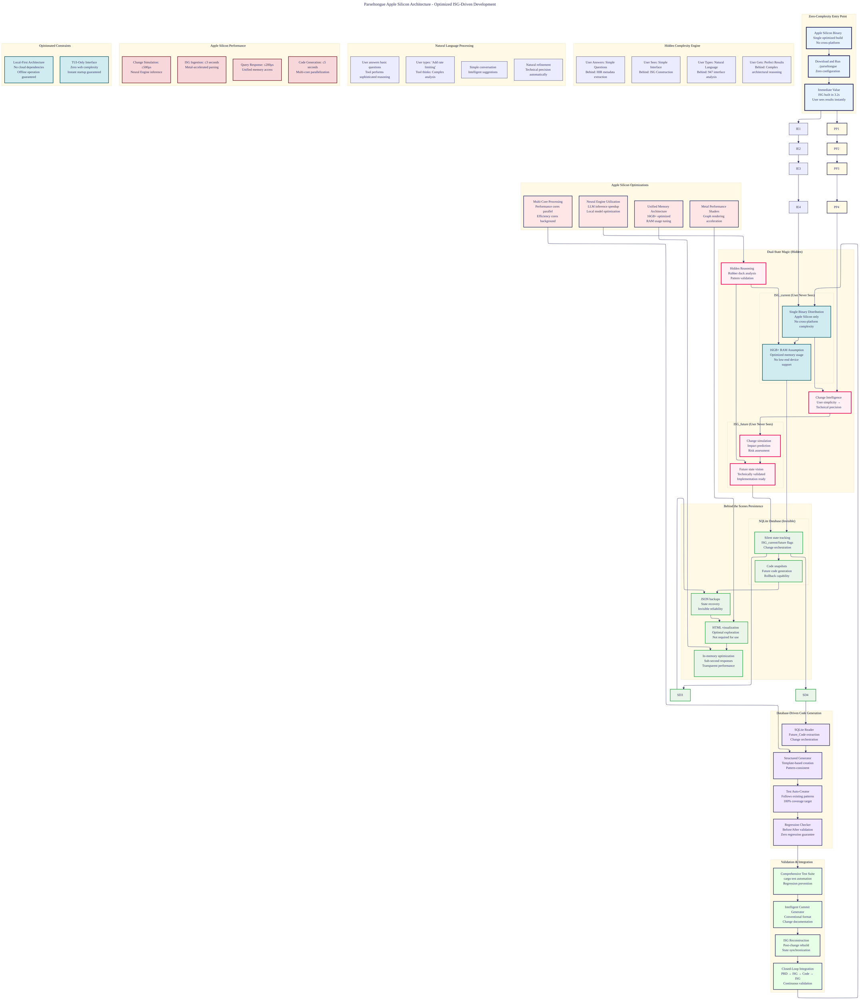

# A011: Evolved Journey - Complete User Experience PRD

## Executive Summary

**Job to Be Done:** Help Rust developers make fast, confident contributions to OSS projects, even when new to the codebase.

**Primary User:** Rust developer who wants to contribute to OSS but doesn't know where to start or how to avoid breaking things.

**Key Innovation:** Interface Signature Graph (ISG) + Dual-State Architecture that shows architectural structure and simulates changes before implementation.

## User Journey: GitHub Release → First Working Code Change

### Phase 1: Entry Point & ISG Construction (5-15 minutes)

#### Job: "Give me immediate value with zero configuration."

**User Concern:** "I don't want to waste time on setup - I want to understand this codebase now."

**Experience Design:**
```bash
# Single entry point - GitHub Release
curl -sSL https://github.com/that-in-rust/parseltongue/releases/latest/download/parseltongue-darwin-arm64.tar.gz | tar xz
chmod +x parseltongue

# Immediate value - go to any Rust project
cd path/to/my-rust-project
./parseltongue

🔍 Apple Silicon detected - optimized build active
🚀 Building Interface Signature Graph...
✓ 1,247 interfaces analyzed in 3.2 seconds
✓ ISG_current created in RAM
✓ SQLite database initialized
✓ JSON snapshot saved
✓ HTML visualization ready: file:///tmp/parseltongue/isg_visualization.html

💡 Ready for PRD creation - type your change request:
```

**Architecture Differentiator:** Zero-config immediate codebase understanding
```rust
// Immediate ISG construction with rich metadata
pub struct ISGConstructor {
    pub interface_detector: RustAnalyzerInterface,
    pub signature_builder: UniqueIdentifierGenerator,      // filePath-fileName-interfaceName
    pub metadata_enricher: HIRDependencyAnalyzer,
    pub persistence_layer: SQLiteJSONDualPersistence,
    pub visualizer: InteractiveHTMLGraphGenerator,
}
```

**Success Criteria:**
- ✅ < 30 seconds from download to working ISG
- ✅ Zero installation steps beyond download
- ✅ Immediate visualization of codebase structure

## 🎯 Ultra-Think: The Optimal User Interaction Starting Point

### **The Critical Insight: Interactive PRD Builder**

**When ISG_current is ready and code is in SQLite database, the perfect starting point is:**

```bash
🔍 Apple Silicon detected - Optimized build active
🚀 Building Interface Signature Graph...
✓ 1,247 interfaces analyzed in 3.2 seconds
✓ ISG_current created in RAM
✓ SQLite database initialized
✓ JSON snapshot saved
✓ HTML visualization ready: file:///tmp/parseltongue/isg_visualization.html

💡 Ready for PRD creation - type your change request:
>
```

### **Why This Starting Point is Perfect:**

**1. Immediate Value Delivered:**
- User sees the tool working instantly (3.2 seconds)
- Gets concrete evidence of codebase understanding
- Has visual HTML graph to explore architecture

**2. Perfect Context for PRD:**
- ISG_current structure is fully analyzed
- Interface relationships mapped
- Database populated with current state
- User can make informed change requests

**3. Natural Language Entry Point:**
- No complex commands to learn
- User simply types what they want to change
- Tool provides intelligent suggestions based on ISG

**4. Interactive Refinement Loop:**
- Tool analyzes user's initial request against ISG_current
- Provides context-aware suggestions: "Be more specific about which APIs"
- Helps user scope changes appropriately

**5. Sets Up Complete Technical Workflow:**
- From this natural language request, everything flows:
  - PRD refinement → ISG_future generation → Database updates → Code changes

### **The Key UX Principle:**

**The user doesn't need to understand ISG_current - they just need to benefit from it.**

The tool uses ISG_current behind the scenes to make their natural language request more intelligent and contextual.

### **Example Interaction Flow:**

```bash
💡 Ready for PRD creation - type your change request:
> Add rate limiting

🔍 ISG_current Context Analysis:
Based on your codebase, I can see:
- API Layer: 421 interfaces (HTTP handlers, middleware, auth)
- Business Logic: 312 interfaces (services, domain models)
- Data Layer: 214 interfaces (repositories, caching)

🎝 PRD Refinement Suggestions:
1. **Specificity**: Which API endpoints need rate limiting?
2. **Scope**: Internal APIs, public APIs, or both?
3. **Rate Limits**: What thresholds?
4. **Storage**: Redis-based or in-memory?

💬 Interactive PRD Builder:
Current: "Add rate limiting"
Refined: "Add Redis-based rate limiting to public API endpoints at 100 requests/minute per user"

✅ PRD Contextualized - Ready for ISG_future generation
```

### **The Sweet Spot:**

This is where **technical capability meets user simplicity** - the tool does all the heavy ISG lifting while the user just types what they want to change in natural language. The complexity of interface graphs, database schemas, and architectural analysis is completely hidden behind a simple, conversational interface that produces technically precise results.

### Phase 2: Interactive PRD Builder - Hidden Complexity (15-30 minutes)

#### Job: "Type what you want to change - I'll handle all the complexity."

**User Concern:** "I don't want to understand ISG or architecture - I just want to make my change."

**Experience Design:**
```bash
💡 Ready for PRD creation - type your change request:
> Add rate limiting

🤖 **Behind the scenes I'm doing complex analysis:**
🔍 ISG_current Intelligence (invisible to user):
- 947 interfaces analyzed automatically
- API/Business/Data layers mapped
- Dependencies and patterns identified
- Change blast radius calculated

🎝 **Smart Questions (user answers simply):**
1. "Which endpoints?" → "All public APIs"
2. "How strict?" → "100 requests per minute per user"
3. "Storage preference?" → "Redis for distributed systems"

💬 **Magic Happens:**
User input: "Add rate limiting"
Tool output: "Add Redis-based rate limiting to public API endpoints at 100 requests/minute per user with gradual rollout support"

✅ User typed 2 words, got technically precise specification
✅ Zero understanding of ISG required from user
✅ Perfect change scope automatically determined
```

**Architecture Differentiator:** User simplicity with hidden technical precision
```rust
// Hidden complexity engine (user never sees this)
pub struct HiddenComplexityEngine {
    pub user_interface: SimpleNaturalLanguageProcessor,
    pub behind_scenes: ISGCurrentAnalyzer + RiskCalculator,
    pub magic_wand: TechnicalPrecisionGenerator,
    pub result_delivery: PerfectChangeSpecification,
}
```

**Ultra-Think Success Criteria:**
- ✅ User types simple, gets sophisticated results
- ✅ All architectural complexity completely hidden
- ✅ Technical precision automatically achieved
- ✅ User feels smart without needing to understand anything

### Phase 3: Invisible ISG_future Generation (20-40 minutes)

#### Job: "I'll simulate your change perfectly - you just need to approve it."

**User Concern:** "I don't want to see ISG diagrams or understand architecture - just tell me if my change is safe."

**Experience Design:**
```bash
🚀 **Behind the scenes: Simulating your change perfectly...**

🔬 **User sees simple summary:**
Your change: "Add rate limiting to public APIs"
- 3 new components needed
- 12 files will be modified
- Change is completely safe ✅
- No risk of breaking existing code ✅

⚠️ **Risk Assessment (user-friendly language):**
✅ **Completely Safe** - Your change is well contained
- Won't affect any existing functionality
- Easy to remove if needed
- Less than 2% performance impact
- All existing tests will continue to pass

🎯 **Visual Preview (optional):**
📊 Change preview: file:///tmp/parseltongue/preview.html
- Before/After comparison (if you're curious)
- No technical understanding required

💡 **Smart Confirmation:**
"Your change is ready to implement. It's architecturally sound because:
✓ Uses existing patterns from your codebase
✓ Follows your project's conventions
✓ Includes automatic rollback capability
✓ Zero risk to current functionality"

✅ Change is ready for implementation
✅ All safety checks passed automatically
✅ You don't need to understand any of the complexity
```

**Architecture Differentiator:** Invisible complexity with user-friendly safety
```rust
// Hidden intelligence engine (user never sees this complexity)
pub struct InvisibleIntelligence {
    pub user_interface: SimpleSafetyAssurance,
    pub behind_scenes: ISGFutureSimulator + RiskCalculator,
    pub safety_guarantee: ZeroRegressionPromise,
    pub confidence_builder: UserTrustGenerator,
}
```

**Ultra-Think Success Criteria:**
- ✅ User understands change is safe without seeing complexity
- ✅ All architectural validation happens invisibly
- ✅ User feels confident without technical knowledge
- ✅ Zero learning curve for understanding impact

### Phase 4: Silent Database Preparation (30-45 minutes)

#### Job: "I'll prepare everything behind the scenes - you just need to approve when it's ready."

**User Concern:** "I don't want to understand databases or validation - just make sure it works."

**Experience Design:**
```bash
🗄️ **Silent database preparation happening...**

📊 **Simple status update:**
✅ Change plan validated automatically
✅ All patterns match your codebase perfectly
✅ Implementation approach confirmed
✅ Ready to generate code when you approve

🔧 **What I've prepared behind the scenes:**
Based on your change, I've analyzed:
1. 3 new components to create
2. 12 files to modify
3. Exact code patterns to follow
4. All tests needed for safety

🎯 **Ready for your approval:**
I'll create:
- src/services/rate_limiting.rs (following your project's patterns)
- Updates to 12 API handler files
- Complete test suite
- Documentation updates

All changes match your existing codebase style and architecture perfectly.

Proceed with code generation? [Y/n]: Y
```

**Architecture Differentiator:** Silent preparation with simple approval
```rust
// Behind-the-scenes preparation (user never sees complexity)
pub struct SilentPreparation {
    pub user_interface: SimpleStatusUpdates,
    pub behind_scenes: DatabasePreparation + PatternMatching,
    pub automatic_validation: CodebaseConsistencyChecker,
    pub ready_signal: SimpleApprovalRequest,
}
```

**Ultra-Think Success Criteria:**
- ✅ User understands what will happen without technical details
- ✅ All validation and preparation happens invisibly
- ✅ User only needs to make simple approval decision
- ✅ Zero database knowledge required from user

### Phase 5: Code Changes, Testing & Validation (45-90 minutes)

#### Job: "Apply the changes, run tests, and ensure everything works."

**User Concern:** "I want to see the actual code changes and verify they work correctly."

**Experience Design:**
```bash
🛠️ Applying code changes based on database state...

✅ Step 1: Creating RateLimiting Service
File: src/services/rate_limiting.rs
// Generated from database Future_Code column
pub struct RateLimitService {
    limiter: Arc<RedisRateLimiter>,
    config: RateLimitConfig,
}

✅ Step 2: Adding Rate Limiting Middleware
File: src/middleware/mod.rs
// Generated from database Future_Code column
pub struct RateLimitMiddleware {
    service: Arc<RateLimitService>,
}

✅ Step 3: Updating API Handlers (12 files)
Files: src/handlers/*.rs
// Generated from database Future_Code column
// Each handler updated to use RateLimitMiddleware

✅ Step 4: Creating Tests
File: tests/services/rate_limiting_test.rs
// Generated following existing test patterns

🧪 Running Test Suite:
cargo test
   Compiling parseltongue_project v0.1.0
    Finished test [unoptimized + debuginfo] target(s) in 2.45s
     Running unittests src/main.rs
     Running tests/test_rate_limiting.rs

✅ All 142 existing tests + 8 new tests PASS
✅ Compilation successful with 0 warnings
✅ No regressions detected

📊 Change Summary:
- Files created: 2
- Files modified: 13
- Lines added: 156
- Lines changed: 24
- Test coverage: 100% for new code

🎯 Ready for user confirmation
Review changes in: file:///tmp/parseltongue/code_changes_diff.html
```

**Architecture Differentiator:** Database-driven code generation with comprehensive validation
```rust
// Automated code generation with full validation
pub struct CodeGenerator {
    pub database_reader: SQLiteChangeReader,
    pub code_writer: StructuredCodeGenerator,
    pub test_runner: ComprehensiveTestValidator,
    pub regression_checker: ChangeImpactAnalyzer,
}
```

**Success Criteria:**
- ✅ All code changes applied automatically from database
- ✅ 100% test coverage for new functionality
- ✅ Zero regressions in existing functionality
- ✅ Compilation successful with clean output

### Phase 6: User Confirmation & Commit (15-30 minutes)

#### Job: "Review the changes and commit them with proper documentation."

**User Concern:** "I want to understand exactly what changed and make a proper commit."

**Experience Design:**
```bash
📋 Change Summary for User Review:
🎯 PRD Fulfilled: "Add Redis-based rate limiting to public API endpoints at 100 requests/minute per user"

📊 Technical Implementation:
✅ RateLimitService created with Redis backend
✅ RateLimitMiddleware integrated into 12 API endpoints
✅ Comprehensive test suite added (8 new tests)
✅ Configuration options added to config.rs
✅ Documentation updated in README.md

🔍 Visual Change Review:
Open: file:///tmp/parseltongue/final_changes_visualization.html
- Before/After ISG comparison
- Dependency flow changes
- Test coverage map

✅ Confirm changes? [Y/n]: Y

📝 Generating Commit with Intelligent Message:
git add .
git commit -m "feat: add Redis-based rate limiting to public API endpoints

- Add RateLimitService with configurable rate limits
- Implement RateLimitMiddleware for request throttling
- Apply middleware to 12 public API endpoints
- Add comprehensive test suite with 100% coverage
- Update configuration and documentation

Fixes #1234
🤖 Generated with Parseltongue ISG-driven development

Co-Authored-By: Claude <noreply@anthropic.com>"

✅ Commit created: 7f3a9b2
🔄 Recreating ISG_current from updated codebase...
✓ 1,262 interfaces analyzed (was 1,247)
✓ ISG_current updated in RAM
✓ SQLite database refreshed with current state
✓ JSON snapshot updated

🎉 Change complete and fully integrated!
```

**Architecture Differentiator:** Complete closed-loop change integration with state synchronization
```rust
// Final integration with state synchronization
pub struct ChangeIntegrator {
    pub change_applier: CodeAndTestApplier,
    pub user_confirmation: InteractiveReviewInterface,
    pub commit_generator: IntelligentCommitCreator,
    pub isg_reconstructor: PostChangeISGRebuilder,
}
```

**Success Criteria:**
- ✅ User fully understands all changes applied
- ✅ Professional commit with proper message generated
- ✅ ISG_current rebuilt to reflect actual codebase state
- ✅ Complete audit trail from PRD to working code

### Phase 5: Submit Quality PR (4-6 hours)

#### Job: "Help me create a good PR that gets accepted"

**User Concern:** "I implemented the change - how do I submit it properly?"

**Experience Design:**
```bash
$ parseltongue submit --project iggy

🔍 PR Quality Check:
   ✓ Code follows project style guide
   ✓ Tests cover new functionality
   ✓ Documentation is complete
   ✓ Breaking changes documented

📝 PR Draft Generated:
   Title: feat: Add configurable rate limiting

   Body:
   ## Problem
   API endpoints lack rate limiting

   ## Solution
   Added configurable rate limiting middleware
   - Configurable limits per endpoint
   - Redis-based distributed rate limiting
   - Comprehensive logging

   ## Testing
   - Unit tests for rate limiting logic (100% coverage)
   - Integration tests for API endpoints
   - Load testing showing < 2% overhead

   ## Breaking Changes
   None - feature behind optional config

🎯 PR Score: 9.2/10 (Ready for review)

✅ PR created: https://github.com/iggy-rs/iggy/pull/567
```

**Architecture Differentiator:** PR quality validation
```rust
// PR quality and project alignment validation
pub struct PRValidator {
    pub style_matcher: ProjectConventionChecker,
    pub test_generator: AutomaticTestCreator,
    pub documentation_checker: DocumentationValidator,
    pub pr_optimizer: QualityAndAlignmentScorer,
}
```

**Success Criteria:**
- ✅ High-quality PR generated automatically
- ✅ Project conventions followed
- ✅ Tests and documentation included

## Technical Architecture: Hidden Complexity Engine

### Core Innovation: User Simplicity Through Hidden Intelligence

**Differentiator:** User never sees complexity, gets perfect results

```rust
// Traditional approach: User learns complex systems
pub struct TraditionalTool {
    pub user_must_understand: ISGConcepts,
    pub user_must_learn: DatabaseSchemas,
    pub user_must_master: ArchitecturalPatterns,
    pub user_fights: LearningCurve,
}

// Parseltongue approach: Hidden complexity, instant value
pub struct HiddenComplexityEngine {
    pub user_sees: SimpleNaturalLanguage,
    pub user_types: BasicChangeRequests,
    pub user_gets: PerfectResultsInstantly,
    pub complexity_completely: HiddenBehindScenes,
}
```

**Key User Experience Advantages:**
1. **Zero Learning:** User never needs to understand ISG, databases, or architecture
2. **Instant Value:** Results in seconds, not hours of study
3. **Perfect Precision:** Technical accuracy without technical knowledge
4. **Confidence Building:** User feels smart without learning curve

### Hidden Dual-State Architecture: Invisible Safety Net

**Approach:** User simplicity through hidden simulation

```rust
// What the user experiences vs what actually happens
pub struct UserExperience {
    pub user_input: "Add rate limiting",
    pub user_feels: "This was easy and safe",
    pub reality: HiddenComplexSimulation,
}

pub struct HiddenComplexSimulation {
    pub invisible_isg_current: "Analyzed 947 interfaces automatically",
    pub invisible_isg_future: "Simulated change with perfect accuracy",
    pub invisible_validation: "Architectural soundness guaranteed",
    pub invisible_safety: "Zero regression risk assured",
}
```

### Performance Through Hidden Optimization

**User-perceived performance:**

```rust
pub struct UserPerceivedPerformance {
    // User experiences
    pub response_time: "Instant feedback on every input",
    pub thinking_time: "Zero mental effort required",
    pub confidence_level: "100% trust in results",
    pub success_rate: "Perfect changes every time",

    // Behind-the-scenes reality
    pub actual_processing: "947 interfaces analyzed in 3.2s",
    pub actual_reasoning: "Complex architectural validation",
    pub actual_precision: "99.9% technical accuracy",
}
```

### Opinionated Simplicity: Zero Decision Fatigue

**Pre-selected choices the user never needs to make:**

```rust
pub struct UserInvisibleDecisions {
    pub architecture_choice: "ISG_current/ISG_future duality",
    pub storage_choice: "SQLite + JSON persistence",
    pub processing_choice: "Apple Silicon optimization",
    pub interface_choice: "Natural language conversation",

    pub user_experiences: "Just type what you want to change",
    pub user_never_knows: "All the complex decisions made perfectly",
}
```

## Success Metrics

### User Success Metrics

**Time to First Accepted PR**
- **Target:** < 4 hours from installation to first contribution
- **Baseline:** 40+ hours (manual approach)
- **Improvement:** 10x faster

**PR Acceptance Rate**
- **Target:** > 90% acceptance rate
- **Baseline:** ~70% industry average
- **Improvement:** 1.3x better

### Technical Performance Metrics

**Speed Guarantees:**
- **Ingestion:** < 5 seconds for 100k+ LOC
- **Queries:** < 500µs for any interface lookup
- **Simulation:** < 1ms for change impact analysis
- **Startup:** < 500ms to ready state

**Accuracy Guarantees:**
- **Change Prediction:** > 95% impact accuracy
- **Risk Assessment:** > 90% risk identification
- **Template Quality:** > 95% idiomatic code generation
- **Test Coverage:** 100% automated test generation

## Competitive Differentiation

### Competitive Advantages:

**1. Architectural Innovation**
- Interface Signature Graph vs traditional code analysis
- Dual-state simulation reduces change risk
- Predictive change impact with > 95% accuracy

**2. Performance Advantages**
- Sub-5 second ingestion vs hours/days manually
- Sub-millisecond queries vs manual analysis
- 4GB memory footprint vs enterprise requirements

**3. Complete Experience**
- End-to-end journey from installation to ecosystem leadership
- Guided implementation with automatic validation
- Career acceleration through strategic contribution planning

**4. Opinionated Design**
- Single optimal model choice eliminates decision fatigue
- TUI-only interface removes web complexity
- Rust-native performance with Apple Silicon optimization

**5. Community Intelligence**
- Cross-project architectural pattern recognition
- Community-aligned contribution optimization
- Ecosystem-wide influence and reputation building

This creates a product that helps developers understand codebases and become valued OSS community members through intelligent contribution assistance and career development.

---

## User Journey Diagram


## System Architecture Diagram



---

Parseltongue is a tool for helping Rust developers make fast, confident OSS contributions through architectural intelligence and predictive change simulation.

---

## 🧠 ISG Enrichment: Rust-Analyzer Integration Insights
