# A011: Evolved Journey - Complete User Experience PRD

## Executive Summary

**Job to Be Done:** Help Rust developers make fast, confident contributions to OSS projects, even when new to the codebase.

**Primary User:** Rust developer who wants to contribute to OSS but doesn't know where to start or how to avoid breaking things.

**Key Innovation:** Interface Signature Graph (ISG) + Dual-State Architecture that shows architectural structure and simulates changes before implementation.

## User Journey: GitHub Release → First Working Code Change

### Phase 1: Entry Point & ISG Construction (5-15 minutes)

#### Job: "Give me immediate value with zero configuration."

**User Concern:** "I don't want to waste time on setup - I want to understand this codebase now."

**Experience Design:**
```bash
# Single entry point - GitHub Release
curl -sSL https://github.com/that-in-rust/parseltongue/releases/latest/download/parseltongue-darwin-arm64.tar.gz | tar xz
chmod +x parseltongue

# Immediate value - go to any Rust project
cd path/to/my-rust-project
./parseltongue

🔍 Apple Silicon detected - optimized build active
🚀 Building Interface Signature Graph...
✓ 1,247 interfaces analyzed in 3.2 seconds
✓ ISG_current created in RAM
✓ SQLite database initialized
✓ JSON snapshot saved
✓ HTML visualization ready: file:///tmp/parseltongue/isg_visualization.html

💡 Ready for PRD creation - type your change request:
```

**Architecture Differentiator:** Zero-config immediate codebase understanding
```rust
// Immediate ISG construction with rich metadata
pub struct ISGConstructor {
    pub interface_detector: RustAnalyzerInterface,
    pub signature_builder: UniqueIdentifierGenerator,      // filePath-fileName-interfaceName
    pub metadata_enricher: HIRDependencyAnalyzer,
    pub persistence_layer: SQLiteJSONDualPersistence,
    pub visualizer: InteractiveHTMLGraphGenerator,
}
```

**Success Criteria:**
- ✅ < 30 seconds from download to working ISG
- ✅ Zero installation steps beyond download
- ✅ Immediate visualization of codebase structure

### Phase 2: PRD Creation with ISG Context (15-30 minutes)

#### Job: "Help me create a precise change request using this codebase's actual structure."

**User Concern:** "I know what I want to change, but I need to understand how it fits into the existing architecture."

**Experience Design:**
```bash
💡 Ready for PRD creation - type your change request:
> Add rate limiting to API endpoints

🔍 ISG_current Context Analysis:
Based on your codebase, I can see:
- API Layer: 421 interfaces (HTTP handlers, middleware, auth)
- Business Logic: 312 interfaces (services, domain models)
- Data Layer: 214 interfaces (repositories, caching)

🎝 PRD Refinement Suggestions:
1. **Specificity**: Which API endpoints need rate limiting? (all vs specific routes)
2. **Scope**: Internal APIs, public APIs, or both?
3. **Rate Limits**: What thresholds? (requests/minute per user/API key)
4. **Storage**: Redis-based or in-memory?

💬 Interactive PRD Builder:
Current: "Add rate limiting to API endpoints"
Refined: "Add Redis-based rate limiting to public API endpoints at 100 requests/minute per user, with gradual rollout support"

✅ PRD Contextualized with ISG_current architecture
✅ Change scope clearly bounded
✅ Implementation approach defined
```

**Architecture Differentiator:** PRD creation enriched with real codebase structure
```rust
// PRD refinement using ISG context
pub struct PRDRefiner {
    pub isg_analyzer: ISGCurrentStructureMapper,
    pub scope_detector: InterfaceBlastRadiusCalculator,
    pub suggestion_engine: ContextualRequirementBuilder,
    pub interactive_builder: StepByStepPRDCreator,
}
```

**Success Criteria:**
- ✅ PRD precisely scoped to actual codebase structure
- ✅ Implementation approach technically validated
- ✅ User makes informed decisions about scope and complexity

### Phase 3: ISG_future Generation & Risk Assessment (20-40 minutes)

#### Job: "Show me exactly what this change looks like before writing any code."

**User Concern:** "I want to see the impact of my change and understand if it's safe."

**Experience Design:**
```bash
🚀 Generating ISG_future from PRD + ISG_current...

🔬 Change Simulation:
- Interfaces to CREATE: 3 (RateLimitService, RateLimitConfig, RateLimitMiddleware)
- Interfaces to EDIT: 12 (API handlers to add middleware)
- Interfaces to DELETE: 0
- Blast radius: API Layer only (isolated change)

⚠️ Risk Assessment:
✅ **LOW RISK** - Well-contained architectural change
- Dependency impact: Minimal (new service, existing patterns)
- Test coverage: High (can auto-generate from existing patterns)
- Performance impact: <2% overhead (measurable)
- Rollback complexity: Simple (middleware can be disabled)

🎯 ISG_future Visualization:
HTML Updated: file:///tmp/parseltongue/isg_future_visualization.html
- Green nodes: New interfaces to create
- Yellow nodes: Existing interfaces to modify
- Red edges: New dependencies to add

💡 Rubber Duck Debugging Analysis:
"I'm looking at ISG_current + PRD + ISG_future. The change is architecturally sound because:
1. Rate limiting sits at the middleware layer (clean separation)
2. Uses existing error handling patterns from codebase
3. Follows current service dependency injection approach
4. Test interfaces can be created following existing TDD patterns"

✅ ISG_future generated and validated
✅ All change impacts identified and quantified
✅ Implementation approach risk-assessed
```

**Architecture Differentiator:** Dual-state simulation with predictive validation
```rust
// ISG_future generation with comprehensive risk analysis
pub struct ISGFutureGenerator {
    pub change_analyzer: PRDToISGTransformer,
    pub risk_assessor: MultiDimensionalRiskCalculator,
    pub rubber_duck_engine: ArchitecturalSoundnessValidator,
    pub impact_visualizer: InteractiveChangeMapper,
}
```

**Success Criteria:**
- ✅ Complete change impact simulation before code changes
- ✅ Risk quantification with mitigation strategies
- ✅ Visual representation of proposed architectural changes

### Phase 4: SQLite Integration & Rubber Duck Debugging (30-45 minutes)

#### Job: "Apply the changes to the database and validate the implementation approach."

**User Concern:** "Make sure this change is technically sound before touching the codebase."

**Experience Design:**
```bash
🗄️ Updating SQLite database with ISG_future changes...

📊 Database State Changes:
Codebase Table Updates:
- Rows with Future_Action = "CREATE": 3
- Rows with Future_Action = "EDIT": 12
- Rows with Future_Action = "DELETE": 0
- Future_Code populated for all 15 changes

🦆 Rubber Duck Debugging Session:
"Looking at ISG_current + PRD + ISG_future + Database changes:

1. **Interface Consistency**: All new interfaces follow existing naming conventions
2. **Dependency Flow**: RateLimitService → RateLimitMiddleware → API Handlers (clean)
3. **Test Strategy**: Can mirror existing service test patterns exactly
4. **Error Handling**: Integrates with current Result<T, Error> patterns
5. **Configuration**: Follows existing config struct approach

✅ Architectural soundness confirmed
✅ Implementation approach validated
✅ Database ready for code generation"

🔧 Code Generation Preparation:
Based on database changes, I will:
1. Create src/services/rate_limiting.rs (3 new interfaces)
2. Edit src/middleware/mod.rs (add RateLimitMiddleware)
3. Edit 12 API handler files (add middleware calls)
4. Create tests/services/rate_limiting_test.rs (follow existing patterns)

Continue with code changes? [Y/n]: Y
```

**Architecture Differentiator:** Database-driven change validation with architectural reasoning
```rust
// SQLite integration with comprehensive validation logic
pub struct SQLiteIntegrator {
    pub isg_future_applier: DatabaseChangeWriter,
    pub rubber_duck_validator: ArchitecturalReasoningEngine,
    pub consistency_checker: InterfacePatternMatcher,
    pub code_generation_prepper: ImplementationPlanner,
}
```

**Success Criteria:**
- ✅ All changes validated against existing architectural patterns
- ✅ Database state accurately reflects planned modifications
- ✅ Implementation approach confirmed through rubber duck analysis

### Phase 5: Code Changes, Testing & Validation (45-90 minutes)

#### Job: "Apply the changes, run tests, and ensure everything works."

**User Concern:** "I want to see the actual code changes and verify they work correctly."

**Experience Design:**
```bash
🛠️ Applying code changes based on database state...

✅ Step 1: Creating RateLimiting Service
File: src/services/rate_limiting.rs
// Generated from database Future_Code column
pub struct RateLimitService {
    limiter: Arc<RedisRateLimiter>,
    config: RateLimitConfig,
}

✅ Step 2: Adding Rate Limiting Middleware
File: src/middleware/mod.rs
// Generated from database Future_Code column
pub struct RateLimitMiddleware {
    service: Arc<RateLimitService>,
}

✅ Step 3: Updating API Handlers (12 files)
Files: src/handlers/*.rs
// Generated from database Future_Code column
// Each handler updated to use RateLimitMiddleware

✅ Step 4: Creating Tests
File: tests/services/rate_limiting_test.rs
// Generated following existing test patterns

🧪 Running Test Suite:
cargo test
   Compiling parseltongue_project v0.1.0
    Finished test [unoptimized + debuginfo] target(s) in 2.45s
     Running unittests src/main.rs
     Running tests/test_rate_limiting.rs

✅ All 142 existing tests + 8 new tests PASS
✅ Compilation successful with 0 warnings
✅ No regressions detected

📊 Change Summary:
- Files created: 2
- Files modified: 13
- Lines added: 156
- Lines changed: 24
- Test coverage: 100% for new code

🎯 Ready for user confirmation
Review changes in: file:///tmp/parseltongue/code_changes_diff.html
```

**Architecture Differentiator:** Database-driven code generation with comprehensive validation
```rust
// Automated code generation with full validation
pub struct CodeGenerator {
    pub database_reader: SQLiteChangeReader,
    pub code_writer: StructuredCodeGenerator,
    pub test_runner: ComprehensiveTestValidator,
    pub regression_checker: ChangeImpactAnalyzer,
}
```

**Success Criteria:**
- ✅ All code changes applied automatically from database
- ✅ 100% test coverage for new functionality
- ✅ Zero regressions in existing functionality
- ✅ Compilation successful with clean output

### Phase 6: User Confirmation & Commit (15-30 minutes)

#### Job: "Review the changes and commit them with proper documentation."

**User Concern:** "I want to understand exactly what changed and make a proper commit."

**Experience Design:**
```bash
📋 Change Summary for User Review:
🎯 PRD Fulfilled: "Add Redis-based rate limiting to public API endpoints at 100 requests/minute per user"

📊 Technical Implementation:
✅ RateLimitService created with Redis backend
✅ RateLimitMiddleware integrated into 12 API endpoints
✅ Comprehensive test suite added (8 new tests)
✅ Configuration options added to config.rs
✅ Documentation updated in README.md

🔍 Visual Change Review:
Open: file:///tmp/parseltongue/final_changes_visualization.html
- Before/After ISG comparison
- Dependency flow changes
- Test coverage map

✅ Confirm changes? [Y/n]: Y

📝 Generating Commit with Intelligent Message:
git add .
git commit -m "feat: add Redis-based rate limiting to public API endpoints

- Add RateLimitService with configurable rate limits
- Implement RateLimitMiddleware for request throttling
- Apply middleware to 12 public API endpoints
- Add comprehensive test suite with 100% coverage
- Update configuration and documentation

Fixes #1234
🤖 Generated with Parseltongue ISG-driven development

Co-Authored-By: Claude <noreply@anthropic.com>"

✅ Commit created: 7f3a9b2
🔄 Recreating ISG_current from updated codebase...
✓ 1,262 interfaces analyzed (was 1,247)
✓ ISG_current updated in RAM
✓ SQLite database refreshed with current state
✓ JSON snapshot updated

🎉 Change complete and fully integrated!
```

**Architecture Differentiator:** Complete closed-loop change integration with state synchronization
```rust
// Final integration with state synchronization
pub struct ChangeIntegrator {
    pub change_applier: CodeAndTestApplier,
    pub user_confirmation: InteractiveReviewInterface,
    pub commit_generator: IntelligentCommitCreator,
    pub isg_reconstructor: PostChangeISGRebuilder,
}
```

**Success Criteria:**
- ✅ User fully understands all changes applied
- ✅ Professional commit with proper message generated
- ✅ ISG_current rebuilt to reflect actual codebase state
- ✅ Complete audit trail from PRD to working code

### Phase 5: Submit Quality PR (4-6 hours)

#### Job: "Help me create a good PR that gets accepted"

**User Concern:** "I implemented the change - how do I submit it properly?"

**Experience Design:**
```bash
$ parseltongue submit --project iggy

🔍 PR Quality Check:
   ✓ Code follows project style guide
   ✓ Tests cover new functionality
   ✓ Documentation is complete
   ✓ Breaking changes documented

📝 PR Draft Generated:
   Title: feat: Add configurable rate limiting

   Body:
   ## Problem
   API endpoints lack rate limiting

   ## Solution
   Added configurable rate limiting middleware
   - Configurable limits per endpoint
   - Redis-based distributed rate limiting
   - Comprehensive logging

   ## Testing
   - Unit tests for rate limiting logic (100% coverage)
   - Integration tests for API endpoints
   - Load testing showing < 2% overhead

   ## Breaking Changes
   None - feature behind optional config

🎯 PR Score: 9.2/10 (Ready for review)

✅ PR created: https://github.com/iggy-rs/iggy/pull/567
```

**Architecture Differentiator:** PR quality validation
```rust
// PR quality and project alignment validation
pub struct PRValidator {
    pub style_matcher: ProjectConventionChecker,
    pub test_generator: AutomaticTestCreator,
    pub documentation_checker: DocumentationValidator,
    pub pr_optimizer: QualityAndAlignmentScorer,
}
```

**Success Criteria:**
- ✅ High-quality PR generated automatically
- ✅ Project conventions followed
- ✅ Tests and documentation included

## Technical Architecture

### Core Innovation: Interface Signature Graph (ISG)

**Differentiator:** Analyzes interfaces instead of code

```rust
// Traditional approach: Line-by-line code analysis
pub struct CodeAnalysis {
    pub ast_parser: SyntaxTreeParser,           // Complex, fragile
    pub code_analyzer: InstructionAnalyzer,     // Implementation details
    pub pattern_matcher: CodePatternMatcher,   // Brittle heuristics
}

// Parseltongue approach: Interface-level understanding
pub struct InterfaceSignatureGraph {
    pub interface_extractor: InterfaceSignatureExtractor, // Robust
    pub relationship_mapper: InterfaceRelationshipMapper, // Stable
    pub pattern_recognizer: ArchitecturalPatternRecognizer, // Accurate
}
```

**Key Technical Advantages:**
1. **Stability:** Interfaces change rarely vs implementation churn
2. **Accuracy:** Architectural understanding vs code trivia
3. **Performance:** Interface graphs are small and fast to query
4. **Predictability:** Interface changes have predictable impact

### Dual-State Architecture: Risk Reduction

**Approach:** Simulate changes before implementing them

```rust
// Parallel universes of code
pub struct DualStateArchitecture {
    pub isg_current: InterfaceSignatureGraph,  // Reality
    pub isg_future: InterfaceSignatureGraph,    // Vision
    pub change_simulator: ImpactPredictor,     // Bridge
    pub validation_engine: SafetyValidator,     // Gatekeeper
}

// Change simulation before implementation
impl ChangeSimulator {
    fn simulate_change(&self, change: &Change) -> SimulationResult {
        // Apply change to ISG_future (not real code)
        let future_isg = self.apply_change_to_future(change);

        // Analyze impact across interface graph
        let impact = self.analyze_interface_impact(&future_isg);

        // Predict test failures and compilation issues
        let risks = self.identify_potential_breakages(&future_isg);

        // Generate mitigation strategies
        let mitigations = self.generate_mitigation_strategies(&risks);

        SimulationResult { impact, risks, mitigations }
    }
}
```

### Performance Advantages

**Performance metrics:**

```rust
pub struct PerformanceGuarantees {
    // SLA-grade performance contracts
    pub ingestion_speed: "5 seconds for 100k+ LOC codebase",
    pub query_latency: "500 microseconds for any interface query",
    pub memory_usage: "4GB peak on 16GB Apple Silicon",
    pub accuracy: "95%+ change impact prediction",

    // Economic advantages
    pub speed_multiplier: "1000x faster than manual review",
    pub cost_reduction: "50x lower AI token costs",
    pub quality_improvement: "5x higher PR acceptance rates",
}
```

### Opinionated Stack: Simplified Choices

**Decision reduction - pre-selected optimal choices:**

```rust
pub struct OpinionatedArchitecture {
    // Language and Platform
    pub language: "Rust (native performance, zero-cost abstractions)",
    pub target: "Apple Silicon 16GB+ (optimized memory usage)",
    pub interface: "TUI-only (no web complexity, instant startup)",

    // AI and Intelligence
    pub model: "Qwen 2.5-Coder 7B Q4_K_M (single optimal choice)",
    pub context: "128k window for enterprise codebases",
    pub specialization: "Code-tuned for Rust pattern recognition",

    // Data and Persistence
    pub storage: "SQLite + JSON (reliable, fast, simple)",
    pub caching: "In-memory ISG for sub-millisecond queries",
    pub persistence: "Automatic snapshot and recovery",
}
```

## Success Metrics

### User Success Metrics

**Time to First Accepted PR**
- **Target:** < 4 hours from installation to first contribution
- **Baseline:** 40+ hours (manual approach)
- **Improvement:** 10x faster

**PR Acceptance Rate**
- **Target:** > 90% acceptance rate
- **Baseline:** ~70% industry average
- **Improvement:** 1.3x better

### Technical Performance Metrics

**Speed Guarantees:**
- **Ingestion:** < 5 seconds for 100k+ LOC
- **Queries:** < 500µs for any interface lookup
- **Simulation:** < 1ms for change impact analysis
- **Startup:** < 500ms to ready state

**Accuracy Guarantees:**
- **Change Prediction:** > 95% impact accuracy
- **Risk Assessment:** > 90% risk identification
- **Template Quality:** > 95% idiomatic code generation
- **Test Coverage:** 100% automated test generation

## Competitive Differentiation

### Competitive Advantages:

**1. Architectural Innovation**
- Interface Signature Graph vs traditional code analysis
- Dual-state simulation reduces change risk
- Predictive change impact with > 95% accuracy

**2. Performance Advantages**
- Sub-5 second ingestion vs hours/days manually
- Sub-millisecond queries vs manual analysis
- 4GB memory footprint vs enterprise requirements

**3. Complete Experience**
- End-to-end journey from installation to ecosystem leadership
- Guided implementation with automatic validation
- Career acceleration through strategic contribution planning

**4. Opinionated Design**
- Single optimal model choice eliminates decision fatigue
- TUI-only interface removes web complexity
- Rust-native performance with Apple Silicon optimization

**5. Community Intelligence**
- Cross-project architectural pattern recognition
- Community-aligned contribution optimization
- Ecosystem-wide influence and reputation building

This creates a product that helps developers understand codebases and become valued OSS community members through intelligent contribution assistance and career development.

---

## User Journey Diagram

```mermaid
---
title: Parseltongue Technical Workflow - GitHub Release to Working Code
accTitle: Complete Technical Workflow for ISG-Driven Development
accDescr: A comprehensive flowchart showing the 6-phase technical workflow from GitHub download through database-driven code changes, with ISG_current/ISG_future duality and validation loops.
config:
  theme: "base"
  themeVariables:
    primaryColor: "#ECECFF"
    primaryTextColor: "#2E2E5F"
    primaryBorderColor: "#2E2E5F"
    lineColor: "#2E2E5F"
    secondaryColor: "#F6F8FF"
    tertiaryColor: "#FFF9E6"
    sectionBkgColor: "#E6F3FF"
    altSectionBkgColor: "#FFFAE6"
    gridColor: "#D0D0E6"
    fontFamily: "system-ui, -apple-system, sans-serif"
    fontSize: "14px"
  flowchart:
    nodeSpacing: 75
    rankSpacing: 75
    defaultRenderer: "elk"
    useMaxWidth: false
    htmlLabels: true
    wrappingWidth: 150
---

%%{init: {'theme': 'base', 'themeVariables': {'primaryColor': '#ECECFF', 'primaryTextColor': '#2E2E5F', 'primaryBorderColor': '#2E2E5F', 'lineColor': '#2E2E5F', 'secondaryColor': '#F6F8FF', 'tertiaryColor': '#FFF9E6', 'sectionBkgColor': '#E6F3FF', 'altSectionBkgColor': '#FFFAE6', 'gridColor': '#D0D0E6', 'fontFamily': 'system-ui, -apple-system, sans-serif', 'fontSize': '14px'}, 'flowchart': {'nodeSpacing': 75, 'rankSpacing': 75, 'defaultRenderer': 'elk', 'useMaxWidth': false, 'htmlLabels': true, 'wrappingWidth': 150}}%%
flowchart TD
    %% Phase 1: GitHub Release & ISG Construction
    P1["Phase 1: GitHub Release<br/>& ISG Construction<br/>5-15 minutes"] --> S1["Download Apple Silicon<br/>Binary from GitHub<br/>Release Page"]

    S1 --> S2["./parseltongue in<br/>Rust project directory"]
    S2 --> S3["🔍 Apple Silicon detected<br/>Optimized build active"]
    S3 --> S4["🚀 Build ISG_current<br/>1,247 interfaces<br/>3.2 seconds"]
    S4 --> S5["✅ ISG_current in RAM<br/>SQLite initialized<br/>JSON saved<br/>HTML visualization ready"]

    %% Phase 2: PRD Creation with ISG Context
    S5 --> P2["Phase 2: PRD Creation<br/>with ISG Context<br/>15-30 minutes"]
    P2 --> S6["💡 User types change request<br/>Add rate limiting to API"]
    S6 --> S7["🔍 ISG_current Analysis<br/>API Layer: 421 interfaces<br/>Business Logic: 312<br/>Data Layer: 214"]

    S7 --> S8["🎝 Interactive PRD Refinement<br/>Specificity, Scope, Limits, Storage"]
    S8 --> S9["💬 Refined PRD<br/>Redis-based rate limiting<br/>Public APIs only<br/>100 req/min per user"]

    S9 --> S10["✅ PRD contextualized<br/>Change scope bounded<br/>Implementation defined"]

    %% Phase 3: ISG_future Generation & Risk Assessment
    S10 --> P3["Phase 3: ISG_future Generation<br/>& Risk Assessment<br/>20-40 minutes"]
    P3 --> S11["🚀 Generate ISG_future<br/>from PRD + ISG_current"]
    S11 --> S12["🔬 Change Simulation<br/>CREATE: 3 interfaces<br/>EDIT: 12 interfaces<br/>DELETE: 0 interfaces"]

    S12 --> S13["⚠️ Risk Assessment<br/>LOW RISK - Well contained<br/>Minimal dependencies<br/>High test coverage<br/><2% performance impact"]

    S13 --> S14["🎯 ISG_future Visualization<br/>HTML updated<br/>Green nodes: New<br/>Yellow nodes: Modified<br/>Red edges: Dependencies"]

    S14 --> S15["💡 Rubber Duck Debugging<br/>Architectural soundness<br/>Pattern consistency<br/>Integration strategy"]

    S15 --> S16["✅ ISG_future validated<br/>Impacts quantified<br/>Risk assessed"]

    %% Phase 4: SQLite Integration & Validation
    S16 --> P4["Phase 4: SQLite Integration<br/>& Rubber Duck Debugging<br/>30-45 minutes"]
    P4 --> S17["🗄️ Update SQLite Database<br/>Future_Action populated<br/>Future_Code generated"]

    S17 --> S18["📊 Database State<br/>CREATE rows: 3<br/>EDIT rows: 12<br/>DELETE rows: 0"]

    S18 --> S19["🦆 Rubber Duck Validation<br/>Interface consistency<br/>Dependency flow<br/>Test strategy<br/>Error handling patterns"]

    S19 --> S20["🔧 Code Generation Prep<br/>Implementation plan<br/>File list<br/>Change strategy"]

    S20 --> S21["✅ Database ready<br/>Architectural validation<br/>Implementation confirmed"]

    %% Phase 5: Code Changes & Testing
    S21 --> P5["Phase 5: Code Changes<br/>& Testing<br/>45-90 minutes"]
    P5 --> S22["🛠️ Apply Code Changes<br/>From database state"]
    S22 --> S23["✅ Step 1: Create Service<br/>src/services/rate_limiting.rs"]
    S23 --> S24["✅ Step 2: Add Middleware<br/>src/middleware/mod.rs"]
    S24 --> S25["✅ Step 3: Update Handlers<br/>12 API handler files"]
    S25 --> S26["✅ Step 4: Create Tests<br/>tests/services/rate_limiting_test.rs"]

    S26 --> S27["🧪 Run Test Suite<br/>cargo test"]
    S27 --> S28["✅ 142 existing + 8 new<br/>tests PASS<br/>Compilation successful<br/>0 regressions"]

    S28 --> S29["📊 Change Summary<br/>Files created: 2<br/>Files modified: 13<br/>Lines added: 156<br/>Test coverage: 100%"]

    S29 --> S30["🎯 Ready for<br/>user confirmation"]

    %% Phase 6: User Confirmation & Commit
    S30 --> P6["Phase 6: User Confirmation<br/>& Commit<br/>15-30 minutes"]
    P6 --> S31["📋 Change Review<br/>PRD fulfilled<br/>Implementation complete<br/>Documentation updated"]

    S31 --> D1{"✅ Confirm changes?<br/>Review diff<br/>Check visualization"}
    D1 -- "Y" --> S32["📝 Intelligent Commit<br/>Professional message<br/>Conventional format"]
    D1 -- "N" --> S33["🔄 Iterate on changes<br/>Back to Phase 5"]

    S32 --> S34["✅ Commit created<br/>7f3a9b2"]
    S34 --> S35["🔄 Rebuild ISG_current<br/>1,262 interfaces<br/>Database refreshed<br/>JSON updated"]

    S35 --> S36["🎉 Change complete<br/>Fully integrated<br/>Closed-loop workflow"]

    %% Success Criteria
    S36 --> S37["✅ Working Code Change<br/>Total time: 2-3 hours<br/>vs 8+ hours manual<br/>Zero regressions"]

    %% Styling for phase differentiation
    classDef phase1 fill:#E6F3FF,stroke:#2E2E5F,stroke-width:2px
    classDef phase2 fill:#FFF9E6,stroke:#2E2E5F,stroke-width:2px
    classDef phase3 fill:#F6F8FF,stroke:#2E2E5F,stroke-width:2px
    classDef phase4 fill:#FFE6E6,stroke:#2E2E5F,stroke-width:2px
    classDef phase5 fill:#E6FFE6,stroke:#2E2E5F,stroke-width:2px
    classDef phase6 fill:#F0E6FF,stroke:#2E2E5F,stroke-width:2px
    classDef success fill:#D4EDDA,stroke:#155724,stroke-width:3px
    classDef decision fill:#FFF3CD,stroke:#856404,stroke-width:2px
    classDef database fill:#E8F5E8,stroke:#28A745,stroke-width:2px
    classDef isg fill:#FFF0F5,stroke:#E91E63,stroke-width:2px

    class P1,P2,P3,P4,P5,P6 phase1,phase2,phase3,phase4,phase5,phase6
    class D1 decision
    class S37 success
    class S17,S18 database
    class S4,S11,S35 isg
```



## System Architecture Diagram

```mermaid
---
title: Parseltongue Apple Silicon Architecture - Optimized ISG-Driven Development
accTitle: Apple Silicon Optimized System Architecture for ISG-Driven Development
accDescr: A comprehensive architecture diagram showing the Apple Silicon-optimized Parseltongue system with dual-state ISG architecture, SQLite persistence, and database-driven code generation pipeline.
config:
  theme: "base"
  themeVariables:
    primaryColor: "#ECECFF"
    primaryTextColor: "#2E2E5F"
    primaryBorderColor: "#2E2E5F"
    lineColor: "#2E2E5F"
    secondaryColor: "#F6F8FF"
    tertiaryColor: "#FFF9E6"
    sectionBkgColor: "#E6F3FF"
    altSectionBkgColor: "#FFFAE6"
    gridColor: "#D0D0E6"
    fontFamily: "system-ui, -apple-system, sans-serif"
    fontSize: "14px"
  flowchart:
    nodeSpacing: 75
    rankSpacing: 75
    defaultRenderer: "elk"
    useMaxWidth: false
    htmlLabels: true
    wrappingWidth: 150
---

%%{init: {'theme': 'base', 'themeVariables': {'primaryColor': '#ECECFF', 'primaryTextColor': '#2E2E5F', 'primaryBorderColor': '#2E2E5F', 'lineColor': '#2E2E5F', 'secondaryColor': '#F6F8FF', 'tertiaryColor': '#FFF9E6', 'sectionBkgColor': '#E6F3FF', 'altSectionBkgColor': '#FFFAE6', 'gridColor': '#D0D0E6', 'fontFamily': 'system-ui, -apple-system, sans-serif', 'fontSize': '14px'}, 'flowchart': {'nodeSpacing': 75, 'rankSpacing': 75, 'defaultRenderer': 'elk', 'useMaxWidth': false, 'htmlLabels': true, 'wrappingWidth': 150}}%%
flowchart TD
    %% Entry Point & Apple Silicon Optimization
    subgraph Entry_Point["GitHub Release Entry Point"]
        EP1["Apple Silicon Binary<br/>Single optimized build<br/>M1/M2/M3 native"]
        EP2["Zero Configuration<br/>Download and run<br/>./parseltongue"]
        EP3["Hardware Detection<br/>Apple Silicon confirmed<br/>16GB+ RAM expected"]
    end

    %% ISG Construction Engine
    subgraph ISG_Engine["ISG Construction Engine"]
        IE1["Rust Analyzer Integration<br/>HIR metadata extraction<br/>Interface signatures"]
        IE2["Unique ID Generator<br/>filePath-fileName-interfaceName<br/>No conflicts guaranteed"]
        IE3["Interface Classifier<br/>Test vs Normal interfaces<br/>Dependency mapping"]
        IE4["Metadata Enrichment<br/>HIR info, relationships<br/>Utility analytics"]
    end

    %% Dual-State Core Architecture
    subgraph Dual_State_Core["Dual-State ISG Core"]
        subgraph ISG_Current_RAM["ISG_current (RAM)"]
            IC1["Interface Graph<br/>Current reality state"]
            IC2["Rich Metadata<br/>HIR enriched<br/>Dependency mapped"]
        end

        subgraph ISG_Future_RAM["ISG_future (RAM)"]
            IF1["Proposed Graph<br/>Future state vision"]
            IF2["Change Actions<br/>CREATE EDIT DELETE<br/>Impact calculated"]
        end

        DC1["Change Simulator<br/>Blast radius analysis<br/>Risk assessment engine"]
        DC2["Rubber Duck Engine<br/>Architectural reasoning<br/>Pattern validation"]
    end

    %% Multi-Persistence Layer
    subgraph Multi_Persistence["Multi-Persistence Layer"]
        subgraph SQLite_Database["SQLite Database"]
            SD1["Codebase Table<br/>id, ISG_current_ind<br/>ISG_future_ind, interface_uid"]
            SD2["Current_Code Column<br/>Source code snapshot"]
            SD3["Future_Code Column<br/>Generated from PRD"]
            SD4["Future_Action Column<br/>CREATE EDIT DELETE"]
        end

        MP1["JSON Snapshots<br/>ISG_current backup<br/>ISG_future proposals"]
        MP2["HTML Visualization<br/>Interactive graph display<br/>Before/After views"]
        MP3["In-Memory Cache<br/>Sub-millisecond queries<br/>Graph traversal optimized"]
    end

    %% PRD Processing Pipeline
    subgraph PRD_Pipeline["PRD Processing Pipeline"]
        PP1["Interactive PRD Builder<br/>Context-aware suggestions<br/>Scope refinement"]
        PP2["ISG Context Analyzer<br/>Architecture-aware prompts<br/>Change scoping"]
        PP3["Risk Calculator<br/>Multi-dimensional analysis<br/>Mitigation strategies"]
        PP4["Refinement Engine<br/>Iterative PRD improvement<br/>Feasibility validation"]
    end

    %% Code Generation Engine
    subgraph Code_Generation["Database-Driven Code Generation"]
        CG1["SQLite Reader<br/>Future_Code extraction<br/>Change orchestration"]
        CG2["Structured Generator<br/>Template-based creation<br/>Pattern-consistent"]
        CG3["Test Auto-Creator<br/>Follows existing patterns<br/>100% coverage target"]
        CG4["Regression Checker<br/>Before/After validation<br/>Zero regression guarantee"]
    end

    %% Apple Silicon Optimized Components
    subgraph Apple_Silicon_Opt["Apple Silicon Optimizations"]
        AS1["Metal Performance Shaders<br/>Graph rendering acceleration"]
        AS2["Neural Engine Utilization<br/>LLM inference speedup<br/>Local model optimization"]
        AS3["Unified Memory Architecture<br/>16GB+ optimized<br/>RAM usage tuning"]
        AS4["Multi-Core Processing<br/>Performance cores parallel<br/>Efficiency cores background"]
    end

    %% Validation & Integration
    subgraph Validation_Integration["Validation & Integration"]
        VI1["Comprehensive Test Suite<br/>cargo test automation<br/>Regression prevention"]
        VI2["Intelligent Commit Generator<br/>Conventional format<br/>Change documentation"]
        VI3["ISG Reconstruction<br/>Post-change rebuild<br/>State synchronization"]
        VI4["Closed-Loop Integration<br/>PRD → ISG → Code → ISG<br/>Continuous validation"]
    end

    %% Data Flow Connections
    EP1 --> EP2
    EP2 --> EP3
    EP3 --> IE1

    IE1 --> IE2
    IE2 --> IE3
    IE3 --> IE4
    IE4 --> IC1

    IC1 --> IC2
    IC1 --> DC1
    DC1 --> IF1
    IF1 --> IF2
    DC2 --> IC2
    DC2 --> IF2

    IC2 --> SD1
    IF2 --> SD1
    SD1 --> SD2
    SD1 --> SD3
    SD1 --> SD4
    SD2 --> MP1
    SD3 --> MP1
    MP1 --> MP2
    MP2 --> MP3

    EP3 --> PP1
    PP1 --> PP2
    PP2 --> PP3
    PP3 --> PP4
    PP4 --> DC1

    SD4 --> CG1
    CG1 --> CG2
    CG2 --> CG3
    CG3 --> CG4
    CG4 --> VI1

    AS1 --> MP2
    AS2 --> DC2
    AS3 --> MP3
    AS4 --> CG2

    VI1 --> VI2
    VI2 --> VI3
    VI3 --> VI4
    VI4 --> IC1

    %% Performance Optimizations
    subgraph Apple_Silicon_Perf["Apple Silicon Performance"]
        ASP1["ISG Ingestion: ≤3 seconds<br/>Metal-accelerated parsing"]
        ASP2["Query Response: ≤200µs<br/>Unified memory access"]
        ASP3["Change Simulation: ≤500µs<br/>Neural Engine inference"]
        ASP4["Code Generation: ≤5 seconds<br/>Multi-core parallelization"]
    end

    %% Implementation Constraints
    subgraph Implementation_Constraints["Opinionated Constraints"]
        IC1["Single Binary Distribution<br/>Apple Silicon only<br/>No cross-platform complexity"]
        IC2["16GB+ RAM Assumption<br/>Optimized memory usage<br/>No low-end device support"]
        IC3["Local-First Architecture<br/>No cloud dependencies<br/>Offline operation guaranteed"]
        IC4["TUI-Only Interface<br/>Zero web complexity<br/>Instant startup guaranteed"]
    end

    %% Styling for component differentiation
    classDef entry fill:#E6F3FF,stroke:#2E2E5F,stroke-width:3px
    classDef isg fill:#FFF0F5,stroke:#E91E63,stroke-width:3px
    classDef persistence fill:#E8F5E8,stroke:#28A745,stroke-width:2px
    classDef pipeline fill:#FFF9E6,stroke:#2E2E5F,stroke-width:2px
    classDef generation fill:#F0E6FF,stroke:#2E2E5F,stroke-width:2px
    classDef optimization fill:#FFE6E6,stroke:#2E2E5F,stroke-width:2px
    classDef validation fill:#E6FFE6,stroke:#2E2E5F,stroke-width:2px
    classDef performance fill:#F8D7DA,stroke:#721C24,stroke-width:2px
    classDef constraints fill:#D1ECF1,stroke:#0C5460,stroke-width:2px

    class EP1,EP2,EP3 entry
    class IC1,IC2,IF1,IF2,DC1,DC2 isg
    class SD1,SD2,SD3,SD4,MP1,MP2,MP3 persistence
    class PP1,PP2,PP3,PP4 pipeline
    class CG1,CG2,CG3,CG4 generation
    class AS1,AS2,AS3,AS4 optimization
    class VI1,VI2,VI3,VI4 validation
    class ASP1,ASP2,ASP3,ASP4 performance
    class IC1,IC2,IC3,IC4 constraints
```



---

Parseltongue is a tool for helping Rust developers make fast, confident OSS contributions through architectural intelligence and predictive change simulation.