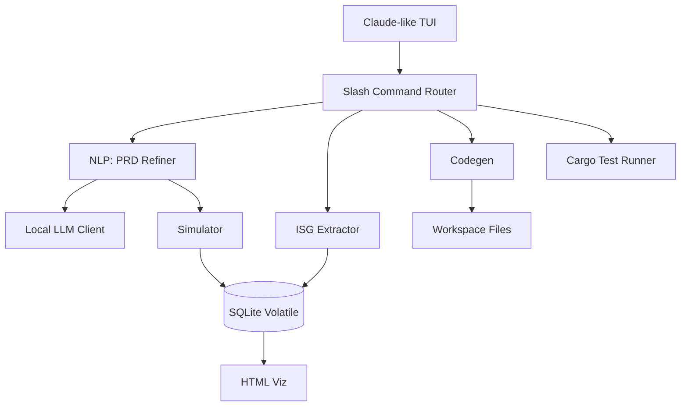
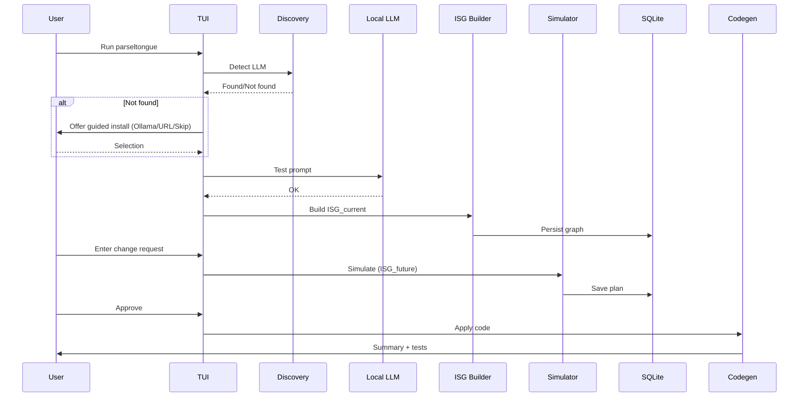
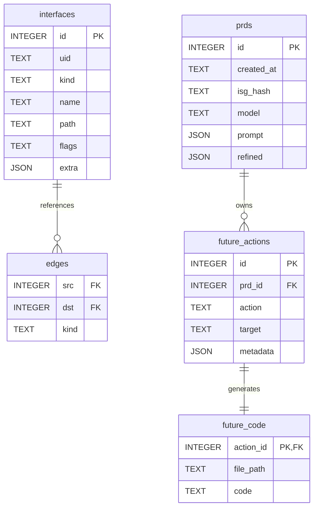
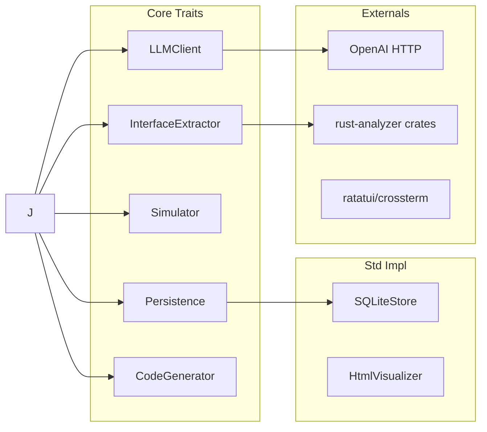

# A012: Executable Journey v0.1 — Pyramid Spec (User Journeys → HLD → LLD → Interfaces)

Status: v0.1 (DB reset allowed; no migrations/rollback required)

Goal: Rewrite A011’s experience as executable specifications in a Rust-native stack with a Claude-like terminal UI, adding explicit LLM setup flows and rigorous, testable contracts.


============
Section 01
============


Top level version of happy path
1. User downloads binary from github OR compiles from source by cloning the repo
2. User goes to the Rust git repository he wants to work on and copies the binary to the root folder
3. User runs `./parseltongue` and is greeted by a UI which is very similar to Claude Code
4. Background task is triggered to tell the user
  - What is their system configuration - is it Apple Silicon with 16GB+ RAM OR NOT
    - If yes ask them if
      - they want to enter anthropic key OR
      - they want to trigger one-click setup for Ollama if it does NOT exist
        - if it exists ask them to enter the Ollama anthropic format key
          - export ANTHROPIC_BASE_URL=https://api.company.ai/api/anthropic OR http://localhost:934/v1 (inspired by platform 9 and 3 quarters)
          - export ANTHROPIC_AUTH_TOKEN=z000zzzZz000000z0z00zz00z00zz00z.Z0Zz0zZZzZzZzZzz
        - if it does not exist then they say Ollama_Yes to install it and then we trigger a set of commands to install Ollama with our pre-configured model qwen2.5-coder:7b
          - this will be often 0.5x slower than a usual anthropic paid api key and little lesser on the quality of reasoning but with context length 128k
          - we are simulating that in future the SOTA local LLMs will be faster than what they are today, so that users do not feel a lot of difference, and thus we will wait for the reality to arrive there
    - If no then ask them to enter anthropic key - comprehensive list of anthropic keys providers from z.ai to anthropic itself (Opinionated take of what order and comments we offer, so example we could z.ai is $ xx per unit token and ab performance against say anthropic which is better performance but higher cost and so on... eventually reminding them that if they had apple silicon of 16GB RAM then it would have been zero)
      - If they have anthropic key which works, then move to next step
      - If they do not have anthropic key then ask them exit the application or enter the anthropic key again
5. 


============
Section 02
============


---

## 0. Glossary and Constraints

- ISG: Interface Signature Graph (current/future duality)
- LLM: Local LLM with OpenAI-compatible HTTP API
- DB: Local SQLite used as a volatile state engine (resettable from codebase)
- OS support: Apple Silicon focus acceptable; cross-platform not required in v0.1
- No migrations: DB is derived from codebase; `pt reset` re-derives all state
- Segment focus (v0.1): Apple Silicon (M1/M2/M3), 16GB+ RAM recommended; TUI-only; local-first; offline by default

---

## 1. User Journeys (Pyramid Top)

This section is the single source of truth for end-to-end UX. All engineering must satisfy these contracts.

### 1.1 First-Time Setup: Local LLM API + First Run

Job: “Help me run locally with a Claude-like TUI, including a working local LLM.”

Preconditions
- Segment focus: Apple Silicon (M1/M2/M3), 16GB+ RAM recommended; TUI-only; offline by default
- Rust tool binary available: `parseltongue` (Apple Silicon build acceptable)
- Developer has a Rust project directory

Flow (CLI transcript; user-visible only)
```bash
$ ./parseltongue
🔎 Checking local LLM connectivity…
  • Searching common endpoints
    - http://localhost:11434/v1 (Ollama)
    - http://localhost:1234/v1 (LM Studio)
    - http://127.0.0.1:8000/v1 (generic)
✗ No local LLM found


💡 Options
  [1] Install and start Ollama (recommended)
  [2] I already have an endpoint → enter URL
  [3] Skip LLM (reduced capabilities)
> 1

📦 One-time setup (Ollama on macOS):
  1) If Homebrew is not installed:
     /bin/bash -c "$(curl -fsSL https://raw.githubusercontent.com/Homebrew/install/HEAD/install.sh)"
  2) Install Ollama:
     brew install ollama
  3) Start the Ollama server (foreground):
     ollama serve &>~/.parseltongue/ollama.log &
     # or run as a service: brew services start ollama
  4) Pull a local coding model:
     ollama pull qwen2.5-coder:7b
     # alternatives: deepseek-coder:7b, codellama:7b-code
  5) Verify the OpenAI-compatible API:
     curl -s http://localhost:11434/v1/models | jq '.data[].id'
     # expected: ["qwen2.5-coder:7b", ...]


Straightforward bootstrap script (copy-paste):
```bash
set -euo pipefail

has_cmd(){ command -v "$1" >/dev/null 2>&1; }

if ! has_cmd brew; then
  /bin/bash -c "$(curl -fsSL https://raw.githubusercontent.com/Homebrew/install/HEAD/install.sh)"
fi

brew install ollama jq >/dev/null 2>&1 || true

# Start Ollama (prefer service; fallback to background)
brew services start ollama >/dev/null 2>&1 || (nohup ollama serve >/dev/null 2>&1 &)

# Wait for API to become available
until curl -sSf http://localhost:11434/v1/models >/dev/null; do
  printf "."; sleep 1;
done
printf "\n"

# Pull a coder model if missing
if ! ollama list | grep -q 'qwen2.5-coder:7b'; then
  ollama pull qwen2.5-coder:7b
fi

export PT_LLM_URL=${PT_LLM_URL:-http://localhost:11434/v1}

# Launch Parseltongue from current directory or PATH
if [ -x ./parseltongue ]; then
  ./parseltongue
else
  parseltongue
fi
```

🧭 Alternative: LM Studio
  - Download: https://lmstudio.ai
  - Start the server (OpenAI-compatible), choose a coder model, ensure the endpoint shows http://localhost:1234/v1

Press Enter when ready…

🔁 Retrying LLM connectivity…
✓ Found LLM: http://localhost:11434/v1 (OpenAI-compatible)
✓ Model available: qwen2.5-coder:7b
✓ Test prompt roundtrip OK (250ms)

🚀 Building ISG_current…
✓ 1,247 interfaces analyzed in 3.4s
✓ SQLite (volatile) initialized (resettable)
✓ JSON snapshot saved
✓ HTML graph ready: file:///tmp/parseltongue/isg.html

💬 Ready — type your change request or use a slash command
> add rate limiting to public APIs
```

Postconditions
- LLM endpoint configured and validated
- ISG_current constructed and persisted
- TUI in “conversation-ready” state

Errors and Recovery
- LLM timeout: show actionable guidance (check server, model, firewall)
- Unsupported API schema: ask for a custom endpoint URL; provide examples
- DB errors: offer `pt reset` to rebuild from codebase

Acceptance Criteria
- ≤ 60s from binary run to usable TUI with validated LLM (if provider present)
- Clear, copy-pastable instructions for the common local LLMs
- Skippable LLM preserves non-LLM features with clear capability note


### 1.2 Interactive PRD Builder (Claude-like TUI)

Job: “Type what I want; you make it precise.”

Preconditions
- LLM validated (or skipped with capability note)
- ISG_current available

Flow (user-visible)
```bash
> add rate limiting
🔍 Context scan (ISG_current)
  - API layer: 421
  - Services: 312
  - Data: 214

🎛️ Refine (answer inline):
  1) Endpoints? → public APIs
  2) Limits? → 100 req/min/user
  3) Storage? → Redis (distributed)

✨ PRD: “Redis-based rate limiting on public APIs at 100 rpm/user with gradual rollout.”
Proceed? [Y/n]: Y
```

Postconditions
- PRD v1 saved (immutable) with provenance (prompt, ISG hash, model id)

Acceptance Criteria
- ≤ 3 UI turns to reach a precise PRD for common tasks
- PRD includes measurable success criteria and blast radius summary


### 1.3 Safe Simulation (ISG_future) and Summary

Job: “Show me safety in human terms; keep complexity hidden.”

Flow
```bash
🧪 Simulating change (ISG_future)…
  + create: 3 components
  ~ modify: 12 files
  - delete: 0
Risk: LOW (well-contained); est perf impact < 2%
Artifacts: preview at file:///tmp/parseltongue/preview.html

Proceed to prepare code changes? [Y/n]: Y
```

Acceptance Criteria
- Risk explained without diagrams by default; visuals optional
- Clear revert narrative (“fully removable”, “doesn’t affect X”)


### 1.4 Code Prep, Apply, Test

Flow
```bash
🗃️ Preparing DB state (volatile)
  plan validated
  future_code generated

🛠️ Applying changes
  src/services/rate_limiting.rs (new)
  src/middleware/mod.rs (updated)
  12 handlers updated

🧪 Running tests (cargo test)
✓ All existing + new tests pass
```

Acceptance Criteria
- Deterministic codegen from DB state
- Unit tests created to 100% for new code paths (v0.1 scope)


### 1.5 Review and Commit

Flow
```bash
📋 Summary
  PRD fulfilled
  Files created: 2; modified: 13
  Tests: 8 new; all green

Confirm? [Y/n]: Y
📝 Commit message generated (conventional)
```

Acceptance Criteria
- Human-readable summary mirrors PRD
- Optional link to ISG diff visualization


---

## 2. High-Level Design (HLD)

Guiding Principles
- Test-first: every claim backed by executable checks
- Layered Rust architecture with DI via traits
- Errors: thiserror in libraries, anyhow in app
- DB is derived state; resets are expected in v0.1

Components (Rust crates/modules)
- tui: Claude-like terminal UX (ratatui + crossterm)
- command: slash commands (/model, /plugins, /doctor, /reset)
- nlp: PRD refinement, prompt templates, LLMClient
- isg: extraction (rust-analyzer adapter), dependency graph (petgraph)
- simulate: blast radius, risk heuristics
- persist: SQLite + JSON snapshots (rusqlite + serde_json)
- codegen: deterministic file changes from DB ‘future_code’
- tests: e2e harness, fixtures, property tests

Mermaid (System Overview)


LLM Integration (v0.1)
- OpenAI-compatible HTTP client (reqwest)
- Autodetect common local endpoints; allow manual URL
- Streaming optional; minimal backpressure
- Config precedence: CLI flags → env (PT_LLM_URL, ANTHROPIC_API_KEY) → discovery

Environment variable compatibility (Claude parity)
- Recognized key: ANTHROPIC_API_KEY (single standard key when auth is required)
- Local engines (Ollama/LM Studio) typically do not require a key
- Keys are never printed; only used as Authorization headers when needed

Examples
```bash
export PT_LLM_URL=http://localhost:11434/v1
export ANTHROPIC_API_KEY="{{ANTHROPIC_API_KEY}}"  # only if your endpoint requires a key
./parseltongue
```


Plugin Parity (Claude-like UI)
- Slash commands: /model, /plugins, /doctor, /reset, /help
- Project-local configs: `.parseltongue/` directory
- v0.1: read-only command manifests; execution via core tools only

Security/Privacy
- Local-first; no outbound by default
- Keys loaded from env/keychain when present; never printed

---

## 3. Low-Level Design (LLD)

3.1 Traits (L1: Core)
```rust
pub trait LLMClient {
    fn model(&self) -> String;
    fn chat(&self, messages: &[Message]) -> anyhow::Result<LLMResponse>;
}

pub trait InterfaceExtractor {
    fn build_isg_current(&self, root: &std::path::Path) -> anyhow::Result<ISG>;
}

pub trait Simulator {
    fn simulate(&self, isg: &ISG, prd: &PRD) -> anyhow::Result<ImpactReport>;
}

pub trait Persistence {
    fn reset(&self) -> anyhow::Result<()>; // v0.1: drop & recreate
    fn save_isg(&self, isg: &ISG) -> anyhow::Result<()>;
    fn save_prd(&self, prd: &PRD) -> anyhow::Result<()>;
    fn save_future(&self, fut: &FuturePlan) -> anyhow::Result<()>;
}

pub trait CodeGenerator {
    fn apply(&self, fut: &FuturePlan) -> anyhow::Result<ApplySummary>;
}
```

3.2 Implementations (L2: Std / L3: External)
- LLMClientOpenAI (reqwest)
- RustAnalyzerAdapter (ra_ap_* crates)
- SQLiteStore (rusqlite; reset on demand)
- HtmlVisualizer (static assets under cache/)
- CodeWriter (atomic writes; tempfiles; diff support)

3.3 Data Contracts
```rust
pub struct PRD { /* natural → refined specification + provenance */ }
pub struct ISG { /* nodes, edges, flags, source maps */ }
pub struct FuturePlan { /* created/modified artifacts + tests */ }
pub struct ImpactReport { /* counts, risk level, perf estimate */ }
```

3.4 SQLite (v0.1, resettable)
```sql
PRAGMA foreign_keys = ON;

DROP TABLE IF EXISTS interfaces;
DROP TABLE IF EXISTS edges;
DROP TABLE IF EXISTS prds;
DROP TABLE IF EXISTS future_actions;
DROP TABLE IF EXISTS future_code;
DROP TABLE IF EXISTS runs;

CREATE TABLE interfaces(
  id INTEGER PRIMARY KEY,
  uid TEXT UNIQUE NOT NULL,
  kind TEXT NOT NULL,
  name TEXT NOT NULL,
  path TEXT NOT NULL,
  flags TEXT,
  extra JSON
);

CREATE TABLE edges(
  src INTEGER NOT NULL,
  dst INTEGER NOT NULL,
  kind TEXT NOT NULL,
  FOREIGN KEY(src) REFERENCES interfaces(id) ON DELETE CASCADE,
  FOREIGN KEY(dst) REFERENCES interfaces(id) ON DELETE CASCADE
);

CREATE TABLE prds(
  id INTEGER PRIMARY KEY,
  created_at TEXT NOT NULL,
  isg_hash TEXT NOT NULL,
  model TEXT,
  prompt JSON,
  refined JSON
);

CREATE TABLE future_actions(
  id INTEGER PRIMARY KEY,
  prd_id INTEGER NOT NULL,
  action TEXT NOT NULL,  -- CREATE|MODIFY|DELETE
  target TEXT NOT NULL,
  metadata JSON,
  FOREIGN KEY(prd_id) REFERENCES prds(id) ON DELETE CASCADE
);

CREATE TABLE future_code(
  action_id INTEGER PRIMARY KEY,
  file_path TEXT NOT NULL,
  code TEXT NOT NULL,
  FOREIGN KEY(action_id) REFERENCES future_actions(id) ON DELETE CASCADE
);

CREATE INDEX IF NOT EXISTS idx_interfaces_uid ON interfaces(uid);
CREATE INDEX IF NOT EXISTS idx_edges_src ON edges(src);
CREATE INDEX IF NOT EXISTS idx_edges_dst ON edges(dst);
```

3.5 Error Taxonomy (thiserror)
```rust
#[derive(thiserror::Error, Debug)]
pub enum PTError {
    #[error("LLM connection failed: {0}")] LlmConnection(String),
    #[error("ISG build failed: {0}")] IsgBuild(String),
    #[error("Simulation failed: {0}")] Simulation(String),
    #[error("DB error: {0}")] Db(String),
    #[error("Codegen failed: {0}")] Codegen(String),
}
```

3.6 Concurrency Model
- tokio runtime; IO-bound tasks (LLM calls, file IO) are async
- CPU-bound ISG steps batched; respect Send + Sync
- Rate limiter around LLMClient; per-model qps setting
- Stress tests: parallel PRD refinement + ISG persistence

3.7 Observability (v0.1)
- Logs: structured (tracing); levels gate via /config
- Metrics: basic counters (isg_nodes, prd_count, llm_latency_ms)
- Artifacts: HTML previews under cache dir; paths printed in TUI

---

## 4. TUI and Slash Commands (Claude-like Parity)

- /model: select model or set PT_LLM_URL; test roundtrip
- /plugins: list `.parseltongue/plugins/*.toml` (read-only in v0.1)
- /doctor: run environment checks (LLM reachable, rustc/cargo, perms)
- /reset: drop and recreate SQLite (derived from workspace)
- /help: quick cheatsheet; keybindings; links

Transcript examples
```bash
> /model
Models: qwen2.5-coder:7b (local), deepseek-coder:7b (local)
Current: qwen2.5-coder:7b
> /doctor
✓ LLM reachable (258ms)
✓ DB writable (resettable)
✓ Workspace detected (Cargo.toml)
```

---

## 5. Test Strategy (TDD-First)

- Unit
  - LLMClient: mock server; latency + error cases
  - ISG extractor: fixtures over mini-crates; node/edge invariants
  - Simulator: golden impacts for common patterns
  - SQLiteStore: reset semantics; FK integrity; indexes used
- Property Tests
  - Graph invariants (no dangling edges; UID uniqueness)
- Integration/E2E
  - “rate limiting” scenario from User Journey: PRD → simulate → codegen → tests green
- Performance Sanity (v0.1 targets)
  - Ingestion: ≤ 5s for 100k LOC
  - PRD refinement call: ≤ 2s with local model

Pass/Fail Gates
- CI runs cargo test; fail on warnings (RUSTFLAGS=-Dwarnings)
- New code paths: unit tests mandatory, 100% line coverage where practical

---

## 6. Security & Privacy (v0.1)

- Local-first; no network egress unless user sets PT_LLM_URL to remote
- Secrets via env/keychain; never printed or logged
- File writes are atomic; no destructive actions without confirmation

---

## 7. Diagrams

7.1 User Journey (Sequence)


7.2 ER Diagram (SQLite v0.1)


7.3 Layered Architecture


---

## 8. Acceptance Checklist (Executable)

- LLM Setup
  - [ ] `/doctor` confirms reachable endpoint
  - [ ] `/model` lists and selects local models
- ISG
  - [ ] Ingestion ≤ 5s for 100k LOC (sample repo)
  - [ ] Deterministic UIDs; no dangling edges
- PRD
  - [ ] ≤ 3 turns to precise PRD for common tasks
  - [ ] Stored with provenance (isg_hash, model)
- Simulation
  - [ ] Impact report with clear human summary
- Codegen & Tests
  - [ ] Generated code compiles
  - [ ] New tests pass; no regressions
- Reset
  - [ ] `/reset` drops & rebuilds DB reliably

---

## 9. Migration/Reset Policy (v0.1)

- DB is derived. No schema migrations needed. Use `/reset` to drop/recreate.

---

## 10. Claude UI Parity Notes → Rust

- Terminal-first, fast rendering (ratatui)
- Slash commands; status line; thinking toggle is cosmetic in v0.1
- Plugins are read-only manifests in `.parseltongue/` to start; executable hooks later

---

Parseltongue v0.1 delivers a Claude-like, local-first UX for Rust codebases with rigorous, testable contracts. The database is resettable, the LLM setup is explicit and user-friendly, and all complexity remains hidden behind a conversational interface.