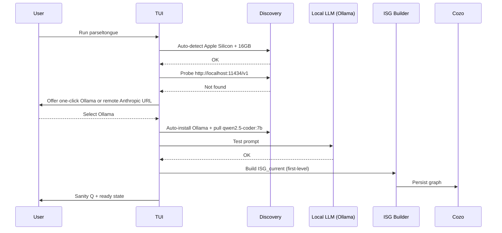
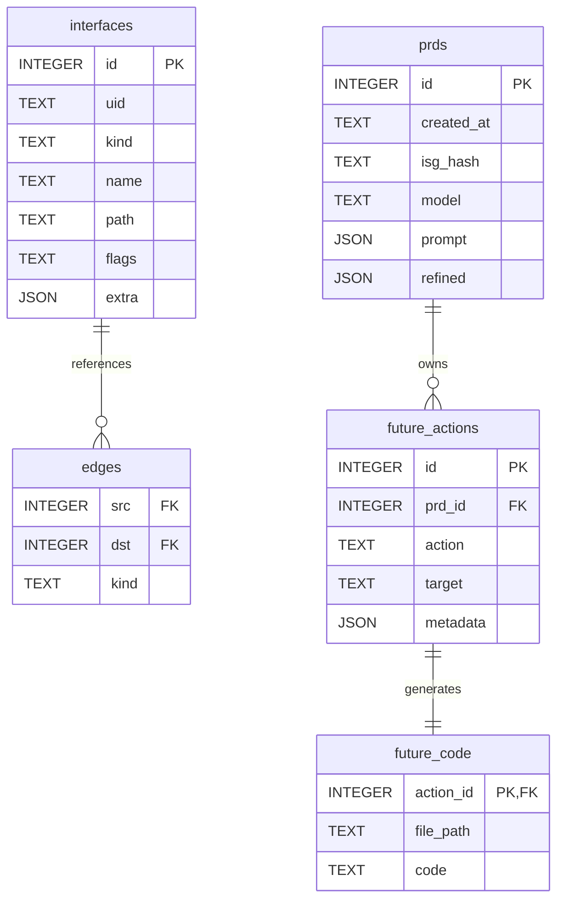

# A013: Architecture v1 (48h MVP) — Parseltongue

Status: Draft for 48-hour delivery (v0.1 MVP)
References: A012 Executable Journey (PRD), Section 01/02

1. Product Brief (Shreyas Doshi style)
- Problem: Engineers want a Claude-like TUI to plan and safely evolve Rust codebases via PRD-driven changes with tight feedback (structure-aware, reversible).
- Audience: Individual contributors on Apple Silicon (16GB+), terminal-first.
- Desired outcome: In ≤60s from run, a validated local LLM + ISG_current + chat to refine a small PRD and preview safe changes.
- Constraints: Local-first; Anthropic-compatible schema; Ollama + qwen2.5-coder:7b only in v0.1; DB is derived and resettable; no migrations.
- Success metrics (MVP):
  - Time-to-ready ≤ 60s with local provider available
  - Ingestion ≤ 5s on 100k LOC sample
  - PRD to precise spec in ≤ 3 turns for a common change (e.g., rate limiting)
  - Deterministic codegen for stub scenario; tests compile and pass
- Non-goals (MVP): Cross-platform; multi-language; advanced viz; remote provider marketplace.
- Risks: Local LLM perf; ISG extraction flakiness; schema churn. Mitigate with stubs, retries, reset.

2. MVP Scope (ship in 48h)
- Must-have
  - Auto-detect Apple Silicon + 16GB; Ollama one-click install; Anthropic-compatible env (ANTHROPIC_BASE_URL, ANTHROPIC_API_KEY/AUTH_TOKEN)
  - LLM connectivity + sanity prompt
  - ISG_current extraction (first-level) and persistence (Cozo)
  - TUI chat with PRD refinement skeleton
  - Safe Simulation stub (counts + LOW risk constant) and summary screen
  - Codegen stub files for one scenario (rate limiting scaffold) + cargo test integration
  - /doctor, /model, /reset
- Nice-to-have
  - HTML viz export from DB snapshot
  - Confidence/reasoning badges; property tests for graph invariants

3. Evaluation of the A012 Architecture (Summary)
Your vision is strong: an AI-assisted evolution pipeline using ISG for comprehension, DB for auditability, and compile/test loops for safety. It’s well-aligned with Rust and a Claude-like TUI. Main concerns: redundant persistence paths, potential LLM bottlenecks for graph diffs.

Step-by-Step Feedback
|| Step | Pros | Cons | Suggestions |
||------|------|------|-------------|
|| 1. Arrival | Seamless CLI; fits workflows | Requires owning the TUI UX | Build on ratatui; add LSP via tower-lsp if needed |
|| 2. ISG | RAM speed + graph structure | Redundant JSON/HTML persist | DB as single source; export views on demand |
|| 3. DB | Granular diffs | SQLite lacks native graph | Use Cozo as single DB (graph + code); SQLite export optional |
|| 4. PRD | Reduces hallucination | Chatty; no versioning | Store PRD in DB + commit message snippet |
|| 5. Future | Risk-aware loop | LLM-heavy; no parallelism | Tokio, parallel subgraphs; early diff previews |

Overall opinion: Strong foundation; with storage unification + async pipelines + Git-native versioning, production viability in ~2–3 months.

4. Refined Architecture (MVP-first, rigorous)
- LLM integration: Anthropic-compatible HTTP only
  - Local default: Ollama at http://localhost:11434/v1
  - Optional proxy: http://localhost:934/v1
  - Model: qwen2.5-coder:7b (only) — ~0.5× speed vs paid, slightly lower reasoning, 128k context
- Persistence: Cozo (embedded RocksDB; single source of truth)
  - Relations: sig_metadata, code_blobs, isg_edges, prds, future_actions, future_code
  - Queries: Datalog for subsets/deltas; JSON/HTML exports on demand
- Graph: petgraph in RAM; persist ISG_current → Cozo
- Extraction: rust-analyzer adapter (first-level interfaces only for MVP)
- TUI: ratatui + crossterm; slash commands /doctor, /model, /reset, /help
- Orchestration: tokio + tracing; retries for LLM + ISG; rate limiter around LLM
- Security: local-first; no egress unless ANTHROPIC_BASE_URL is remote; never print keys

5. Minimal-Context LLM Interactions (Cozo-first; scalable now, efficient later)
- Always slice context to: PRD + ISG_current subset + proposed deltas + code snippets for changing subset only
- Query DB to curate subset; avoid full code dumps; load code blobs only for affected signatures
- Close-loop prompts: LLM outputs JSON diffs or small scripts; we validate/apply; errors feed back into next turn

6. Migration Plan (Post-MVP)
- v0.2: Deepen Cozo usage (recursion, reachability, vector indexes)
  - Incremental ISG updates via git diff; recursive queries for blast radius
  - Optional SQLite export for compatibility/backups

7. System Overview (MVP)
```mermaid path=null start=null
flowchart TD
  TUI[Claude-like TUI] --> CMD[Slash Command Router]
  CMD --> NLP[PRD Refiner]
  NLP --> LLM[Anthropic-compatible Client]
  CMD --> ISG[Extractor (first-level)]
  ISG --> DB[(Cozo - single source)]
  NLP --> SIM[Simulator (stub v0.1)]
  SIM --> DB
  CMD --> GEN[Codegen (stub scenario)]
  GEN --> FS[Workspace Files]
  CMD --> TEST[Cargo Test Runner]
  DB --> VIZ[HTML Export (optional)]
```

8. First-Run Sequence (MVP)


9. Data Model (Cozo v0.1)


9.1 Cozo Schema (relations)
```text path=null start=null
:create sig_metadata {
  uid: String,              // unique interface id (e.g., filepath-module::trait<fn_sig>)
  =>
  kind: String,
  name: String,
  path: String,
  flags: String?,
  extra: String?           // JSON string
}

:create isg_edges {
  src: String,
  dst: String,
  kind: String
}

:create prds {
  id: Int,
  =>
  created_at: String,
  isg_hash: String,
  model: String?,
  prompt: String?,         // JSON
  refined: String?         // JSON
}

:create future_actions {
  id: Int,
  =>
  prd_id: Int,
  action: String,          // CREATE|MODIFY|DELETE
  target: String,
  metadata: String?        // JSON
}

:create future_code {
  action_id: Int,
  =>
  file_path: String,
  code: String
}

:create code_blobs {
  sig_key: String,         // references sig_metadata.uid
  =>
  current_code: String,
  future_code: String?
}
```

9.2 Cozo Query Examples
```text path=null start=null
# Subset of ISG for a module
?[uid, kind, name, path] := *sig_metadata { path ~ "/src/.*" => kind = kind, name = name, path = path, uid = uid }

# Direct edges for that subset
?[src, dst, k] := *isg_edges { src ~ "/src/.*", dst ~ "/src/.*" => kind = k }

# Planned changes (deltas)
?[uid, action] := *future_actions { action = action, target = uid }

# Fetch code blobs only for changing signatures
?[sig, curr, fut] := *code_blobs { sig_key = sig => current_code = curr, future_code = fut }, *future_actions { target = sig }
```

10. Interfaces and Contracts (MVP)
```rust path=null start=null
pub trait LLMClientAnthropic {
    fn model(&self) -> String;
    fn chat(&self, messages: &[Message]) -> anyhow::Result<LLMResponse>;
}

pub trait InterfaceExtractor {
    fn build_isg_current(&self, root: &std::path::Path) -> anyhow::Result<ISG>;
}

pub trait Simulator {
    fn simulate(&self, isg: &ISG, prd: &PRD) -> anyhow::Result<ImpactReport>;
}

pub trait Persistence {
    fn reset(&self) -> anyhow::Result<()>;
    fn save_isg(&self, isg: &ISG) -> anyhow::Result<()>;
    fn save_prd(&self, prd: &PRD) -> anyhow::Result<()>;
    fn save_future(&self, fut: &FuturePlan) -> anyhow::Result<()>;
}

pub trait CodeGenerator {
    fn apply(&self, fut: &FuturePlan) -> anyhow::Result<ApplySummary>;
}
```

11. Configuration (Anthropic-compatible only)
```bash path=null start=null
# Local Ollama (default, no key required)
export ANTHROPIC_BASE_URL=http://localhost:11434/v1

# Remote Anthropic provider
export ANTHROPIC_BASE_URL=https://api.anthropic.com/v1
export ANTHROPIC_API_KEY="{{ANTHROPIC_API_KEY}}"

# Optional local proxy (Platform 9¾)
export ANTHROPIC_BASE_URL=http://localhost:934/v1
export ANTHROPIC_AUTH_TOKEN="{{ANTHROPIC_AUTH_TOKEN}}"

# Cozo database path (embedded)
export COZO_DB_PATH=".parseltongue/parseltongue.cozo"
```

12. Test Strategy (TDD-first, 48h cut)
- Unit: LLM client (mock server), ISG extractor (mini-crate fixtures), CozoStore (reset semantics)
- Property: Graph invariants (no dangling edges; UID uniqueness)
- Integration/E2E: “rate limiting” scenario — PRD → simulate (stub) → codegen scaffold → cargo test
- CI gate: cargo test; warnings denied (RUSTFLAGS=-Dwarnings)

13. Execution Plan (48h)
- Day 1 AM: Scaffold crate, ratatui shell, /doctor; detect platform + RAM; Ollama install script; env wiring
- Day 1 PM: LLM ping + sanity prompt; ISG_first_level extractor + persist to Cozo; /reset runs Cozo init script; DB schema
- Day 2 AM: PRD chat skeleton; simulator stub; codegen scaffold; cargo test wiring
- Day 2 PM: Polishing; logs/metrics; HTML export optional; acceptance checklist run; demo script

14. Demo Script (5 min)
1) ./parseltongue → auto-detect → one-click Ollama → sanity prompt OK
2) /doctor → green checks
3) Ingest repo → ISG_current built
4) “add rate limiting” → PRD refined → simulate → codegen scaffold → tests pass
5) Summary + commit message preview

15. Acceptance Checklist (Executable)
- LLM Setup
  - [ ] /doctor confirms reachable endpoint
  - [ ] /model shows qwen2.5-coder:7b (local)
- ISG
  - [ ] Ingestion ≤ 5s for 100k LOC (sample)
  - [ ] Deterministic UIDs; no dangling edges
- PRD
  - [ ] ≤ 3 turns to precise PRD for common tasks
  - [ ] Stored with provenance (isg_hash, model)
- Simulation
  - [ ] Human-readable impact summary
- Codegen & Tests
  - [ ] Generated scaffold compiles
  - [ ] New tests pass; no regressions
- Reset
  - [ ] /reset drops & rebuilds DB reliably

16. Cutlines (if behind)
- Drop HTML export; keep DB snapshot only
- Simulator remains “LOW risk” stub with counts
- Codegen limited to 1–2 files; skip diffs in TUI (show summary only)

17. Open Questions
- rust-analyzer access path: crate or LSP adapter?
- Export: SQLite/JSON export fallback needed?
- Provider template: which vendors to list by default (anthropic.com, z.ai, …)?

18. Next (v0.2+)
- Advanced Datalog (recursion/reachability); partial reparse via git diff
- Confidence thresholds + parallel subgraph planning
- Interactive HTML viz; richer rubber-ducking with diffs; vector search where helpful
