# L1 Technical Architecture - Improved Vertical Layout

```mermaid
---
config:
  flowchart:
    nodeSpacing: 100
    rankSpacing: 150
    curve: basis
    padding: 50
---
flowchart TD
    %% L1 - High Level System Architecture (Enhanced Vertical Layout)
    CC["Claude Code<br/>Agentic Terminal<br/>Coding Tool"]

    %% Core Interfaces - Linear Flow
    CC --> Terminal["Terminal Interface<br/>Natural Language<br/>Commands"]
    Terminal --> IDE["VS Code Extension<br/>Native Integration"]
    IDE --> GitHub["GitHub Integration<br/>@claude mentions<br/>& PRs"]
    GitHub --> PluginSystem["Plugin Ecosystem<br/>Extensible<br/>Command System"]

    %% Core Capabilities - Linear Flow
    PluginSystem --> Tasks["Routine Task<br/>Execution<br/>Code explanations<br/>git workflows"]
    Tasks --> Editing["Advanced Editing<br/>Real-time<br/>collaboration"]
    Editing --> Collaboration["Team Collaboration<br/>Code reviews<br/>& PR management"]
    Collaboration --> Extensions["Custom Extensions<br/>Agents, hooks<br/>MCP servers"]

    %% Key Features - Linear Flow
    Extensions --> MultiModal["Multi-modal Input<br/>Text, images<br/>files"]
    MultiModal --> LiveEdit["Live Code Editing<br/>Real-time diff<br/>application"]
    LiveEdit --> Social["Social Coding<br/>@mentions<br/>& discussions"]
    Social --> Customization["Deep Customization<br/>Custom agents<br/>& workflows"]

    %% Data Flow - Linear Flow
    Customization --> LLM["Claude LLM<br/>Integration<br/>Context understanding"]
    LLM --> Tools["Tool Execution<br/>Engine<br/>Bash, grep, edit, todo"]
    Tools --> MCP["MCP Protocol<br/>Support<br/>External service<br/>integration"]
    MCP --> SDK["Multi-Language SDK<br/>TypeScript<br/>& Python support"]

    %% Architecture Benefits - Organized in columns
    LLM -.-> Benefits["Benefits:<br/>• Natural language<br/>  programming<br/>• Context-aware<br/>  assistance<br/>• Multi-platform<br/>  support<br/>• Plugin<br/>  extensibility"]
    Tools -.-> Reliability["Reliability:<br/>• Plugin ecosystem<br/>• Extensible<br/>  architecture<br/>• Enterprise-grade<br/>  security<br/>• Permission<br/>  management"]
    MCP -.-> Scalability["Scalability:<br/>• Cloud & local<br/>  deployment<br/>• Team collaboration<br/>• Custom integrations<br/>• Multi-language<br/>  SDKs"]
    SDK -.-> Ecosystem["Ecosystem:<br/>• Hook system<br/>• Agent framework<br/>• Security validation<br/>• Development<br/>  tooling"]

    %% Styling for better readability
    classDef primary fill:#e3f2fd,stroke:#1976d2,stroke-width:4px,color:#000
    classDef secondary fill:#f3e5f5,stroke:#7b1fa2,stroke-width:3px,color:#000
    classDef feature fill:#e8f5e8,stroke:#388e3c,stroke-width:3px,color:#000
    classDef benefit fill:#fff3e0,stroke:#f57c00,stroke-width:3px,color:#000

    class CC primary
    class Terminal,IDE,GitHub,PluginSystem secondary
    class Tasks,Editing,Collaboration,Extensions,MultiModal,LiveEdit,Social,Customization feature
    class LLM,Tools,MCP,SDK,Benefits,Reliability,Scalability,Ecosystem benefit
```

## L1 Architecture Overview

This improved L1 diagram features:
- **Enhanced vertical spacing** (150px rank spacing vs 75px originally)
- **Linear flow organization** with clear progression from interfaces → capabilities → features → data flow
- **Multi-line node labels** for better readability
- **Organized benefit nodes** in a structured layout
- **Improved styling** with better contrast and readability

# L2 Technical Architecture - Improved Component Layout

```mermaid
---
config:
  flowchart:
    nodeSpacing: 80
    rankSpacing: 120
    curve: basis
    padding: 40
---
flowchart TD
    %% L2 - Component Architecture (Restructured for Clarity)
    Core["Core Engine<br/>Node.js/TypeScript<br/>Runtime"]

    %% Plugin System Section
    Core --> PluginSystem["Plugin Architecture<br/>Extensible Command<br/>System"]
    PluginSystem --> PluginRow1["Agent SDK Plugin<br/>Custom agent<br/>development"]
    PluginSystem --> PluginRow2["Commit Commands<br/>Plugin<br/>Git workflow<br/>automation"]
    PluginSystem --> PluginRow3["Feature Development<br/>Plugin<br/>Code architect<br/>explorer, reviewer"]
    PluginSystem --> PluginRow4["PR Review Toolkit<br/>Code analysis<br/>& feedback"]
    PluginSystem --> PluginRow5["Security Guidance<br/>Plugin<br/>Best practices<br/>& validation"]
    PluginSystem --> HookFramework["Hook Framework<br/>Lifecycle<br/>management"]

    %% Hook System Subsection
    HookFramework --> PreToolHooks["PreToolUse Hooks<br/>Command validation<br/>& modification"]
    HookFramework --> PostToolHooks["PostToolUse Hooks<br/>Response processing"]
    HookFramework --> SessionHooks["Session Hooks<br/>Start/end lifecycle<br/>events"]

    %% SDK Layer Subsection
    PluginSystem --> SDKLayer["Multi-Language<br/>SDK Layer<br/>TypeScript &<br/>Python Support"]
    SDKLayer --> TSSDK["TypeScript SDK<br/>ES modules<br/>type safety"]
    SDKLayer --> PySDK["Python SDK<br/>Package management<br/>virtual envs"]
    TSSDK --> TSAgents["TS Agent Framework<br/>Type-safe agent<br/>development"]
    PySDK --> PyAgents["Python Agent<br/>Framework<br/>Pythonic agent<br/>patterns"]

    %% Development Infrastructure Section
    Core --> DevEnv["Development<br/>Environment<br/>Docker +<br/>DevContainer"]
    DevEnv --> Container["Containerized<br/>Development<br/>Isolated build<br/>environment"]
    DevEnv --> Tooling["Development<br/>Tooling<br/>Scripts &<br/>automation"]
    DevEnv --> Examples["Example<br/>Implementations<br/>Hook scripts<br/>agent templates"]

    %% Build & Deployment Section
    Core --> BuildSystem["Build System<br/>CI/CD Integration<br/>Automated workflows"]
    BuildSystem --> GitHubActions["GitHub Actions<br/>Workflow automation"]
    BuildSystem --> Publishing["NPM Publishing<br/>Package distribution"]
    BuildSystem --> Verification["Plugin Verification<br/>SDK compliance<br/>checking"]

    %% Configuration Management Section
    Core --> ConfigSystem["Configuration<br/>System<br/>Settings &<br/>preferences"]
    ConfigSystem --> ClaudeConfig[".claude/ Directory<br/>Commands, agents<br/>settings"]
    ConfigSystem --> ProjectConfig["Project Settings<br/>Per-project<br/>configuration"]
    ConfigSystem --> SecurityConfig["Security<br/>Configuration<br/>Permission rules<br/>& validation"]

    %% External Integrations Section
    Core --> Integrations["External<br/>Integrations<br/>MCP & API<br/>Support"]
    Integrations --> MCP["MCP Protocol<br/>External service<br/>connections"]
    Integrations --> OAuth["OAuth<br/>Authentication<br/>Secure API access"]
    Integrations --> WebSearch["Web Search<br/>External knowledge<br/>access"]
    Integrations --> ValidationHooks["Validation Hooks<br/>Command security<br/>checking"]

    %% Data Management Section
    Core --> DataFlow["Data Management<br/>Context & state<br/>persistence"]
    DataFlow --> SessionStorage["Session Storage<br/>Conversation<br/>persistence"]
    DataFlow --> FileContext["File Context<br/>System<br/>Codebase<br/>understanding"]
    DataFlow --> PluginState["Plugin State<br/>Extension<br/>persistence"]

    %% Component Relationships
    PluginSystem -.-> ConfigSystem
    DevEnv -.-> BuildSystem
    Integrations -.-> DataFlow
    SDKLayer -.-> PluginSystem
    HookFramework -.-> ValidationHooks

    %% Enhanced Styling
    classDef core fill:#e3f2fd,stroke:#1976d2,stroke-width:4px,color:#000
    classDef plugin fill:#f3e5f5,stroke:#7b1fa2,stroke-width:3px,color:#000
    classDef infrastructure fill:#e8f5e8,stroke:#388e3c,stroke-width:3px,color:#000
    classDef integration fill:#fff3e0,stroke:#f57c00,stroke-width:3px,color:#000
    classDef sdk fill:#fce4ec,stroke:#e91e63,stroke-width:3px,color:#000

    class Core core
    class PluginSystem,PluginRow1,PluginRow2,PluginRow3,PluginRow4,PluginRow5,HookFramework,PreToolHooks,PostToolHooks,SessionHooks plugin
    class SDKLayer,TSSDK,PySDK,TSAgents,PyAgents sdk
    class DevEnv,BuildSystem,Container,Tooling,GitHubActions,Publishing,Verification,Examples infrastructure
    class ConfigSystem,Integrations,MCP,OAuth,WebSearch,ClaudeConfig,ProjectConfig,SecurityConfig,ValidationHooks,SessionStorage,FileContext,PluginState,DataFlow integration
```

## L2 Architecture Overview

# L3 Technical Architecture - Enhanced Implementation Details

```mermaid
---
config:
  flowchart:
    nodeSpacing: 60
    rankSpacing: 100
    curve: basis
    padding: 30
---
flowchart TD
    %% L3 - Technical Implementation Details (Restructured for Clarity)
    Runtime["Node.js Runtime<br/>Event-driven<br/>architecture"]

    %% Core Engine Components - Linear Flow
    Runtime --> TerminalRenderer["Terminal Renderer<br/>Interactive UI<br/>system"]
    TerminalRenderer --> CommandParser["Command Parser<br/>Natural language<br/>processing"]
    CommandParser --> ToolExecutor["Tool Executor<br/>Command execution<br/>engine"]
    ToolExecutor --> SessionManager["Session Manager<br/>Conversation state<br/>management"]

    %% Plugin Architecture Implementation - Organized Sections
    Runtime --> PluginLoader["Plugin Loader<br/>Dynamic plugin<br/>discovery"]
    PluginLoader --> PluginRegistry["Plugin Registry<br/>Command<br/>registration"]
    PluginLoader --> AgentFramework["Agent Framework<br/>Custom agent<br/>support"]
    PluginLoader --> HookSystem["Hook System<br/>Lifecycle events"]
    HookSystem --> HookValidator["Hook Validator<br/>JSON schema<br/>validation"]
    HookSystem --> HookExecutor["Hook Executor<br/>Command<br/>preprocessing"]

    %% SDK Implementation - Subsection
    PluginLoader --> SDKRuntime["SDK Runtime Layer<br/>Multi-language<br/>execution"]
    SDKRuntime --> TSSDKImpl["TypeScript SDK<br/>Implementation<br/>ES modules<br/>type definitions"]
    SDKRuntime --> PySDKImpl["Python SDK<br/>Implementation<br/>Package management<br/>imports"]
    TSSDKImpl --> TSAgentEngine["TS Agent Engine<br/>Type-safe agent<br/>lifecycle"]
    PySDKImpl --> PyAgentEngine["Python Agent<br/>Engine<br/>Pythonic agent<br/>patterns"]

    %% Tool System Implementation - Grid Layout
    ToolExecutor --> BashTool["Bash Tool<br/>Shell command<br/>execution"]
    ToolExecutor --> EditTool["Edit Tool<br/>File modification<br/>system"]
    ToolExecutor --> TodoTool["Todo Tool<br/>Task management"]
    ToolExecutor --> GrepTool["Grep Tool<br/>Advanced search"]
    ToolExecutor --> LSTool["LS Tool<br/>Directory listing"]
    ToolExecutor --> ValidationTool["Validation Tool<br/>SDK compliance<br/>checking"]

    %% Hook System Implementation - Linear Flow
    HookSystem --> PreToolValidator["PreToolUse<br/>Validator<br/>Command security<br/>checking"]
    PreToolValidator --> CommandRules["Command Rules<br/>Engine<br/>Pattern matching<br/>& validation"]
    PreToolValidator --> SecurityScanner["Security Scanner<br/>Input<br/>sanitization"]
    HookSystem --> PostToolProcessor["PostToolUse<br/>Processor<br/>Response<br/>enhancement"]

    %% Configuration Implementation - Subsection
    SessionManager --> SettingsManager["Settings Manager<br/>JSON configuration<br/>files"]
    SettingsManager --> ProjectSettings["Project Settings<br/>.claude/settings.json"]
    SettingsManager --> UserSettings["User Settings<br/>Global preferences"]
    SettingsManager --> PluginSettings["Plugin Settings<br/>Plugin-specific<br/>config"]
    SettingsManager --> SecuritySettings["Security Settings<br/>Permission rules<br/>& validation"]

    %% Authentication & Security - Organized Flow
    Runtime --> AuthManager["Authentication<br/>Manager<br/>OAuth & API key<br/>support"]
    AuthManager --> TokenManager["Token Manager<br/>Secure credential<br/>storage"]
    AuthManager --> PermissionManager["Permission Manager<br/>Tool access<br/>control"]
    AuthManager --> SecurityValidator["Security Validator<br/>Input<br/>sanitization"]
    AuthManager --> HookSecurity["Hook Security<br/>Layer<br/>Pre/post execution<br/>validation"]

    %% External Integrations Implementation - Subsection
    Runtime --> MCPClient["MCP Client<br/>Protocol<br/>implementation"]
    MCPClient --> MCPServers["MCP Servers<br/>External service<br/>connections"]
    MCPClient --> OAuthFlows["OAuth Flows<br/>Authentication<br/>workflows"]
    MCPClient --> WebSearchAPI["Web Search API<br/>External knowledge<br/>queries"]
    MCPClient --> ValidationLayer["MCP Validation<br/>Layer<br/>Protocol compliance<br/>checking"]

    %% Development Infrastructure Implementation - Subsection
    Runtime --> DevContainer["Dev Container<br/>Dockerfile<br/>configuration"]
    DevContainer --> BuildTools["Build Tools<br/>TypeScript<br/>compilation"]
    DevContainer --> TestFramework["Test Framework<br/>Unit & integration<br/>tests"]
    DevContainer --> LintTools["Lint Tools<br/>Code quality<br/>enforcement"]
    DevContainer --> ExampleTemplates["Example Templates<br/>Hook & agent<br/>templates"]

    %% Data Persistence Implementation - Subsection
    SessionManager --> SQLiteDB["SQLite Database<br/>Session & context<br/>storage"]
    SQLiteDB --> ConversationStore["Conversation Store<br/>Message history"]
    SQLiteDB --> ContextCache["Context Cache<br/>File & project<br/>context"]
    SQLiteDB --> PluginData["Plugin Data<br/>Extension state<br/>persistence"]
    SQLiteDB --> HookState["Hook State<br/>Execution history<br/>& logs"]

    %% Communication Layers - Clean Connections
    TerminalRenderer -.-> CommandParser
    CommandParser -.-> ToolExecutor
    ToolExecutor -.-> AuthManager
    SessionManager -.-> SettingsManager
    HookSystem -.-> PreToolValidator
    PluginLoader -.-> SDKRuntime

    %% Enhanced Styling for Better Readability
    classDef runtime fill:#e3f2fd,stroke:#1976d2,stroke-width:4px,color:#000
    classDef component fill:#f3e5f5,stroke:#7b1fa2,stroke-width:3px,color:#000
    classDef tool fill:#e8f5e8,stroke:#388e3c,stroke-width:3px,color:#000
    classDef integration fill:#fff3e0,stroke:#f57c00,stroke-width:3px,color:#000
    classDef sdk fill:#fce4ec,stroke:#e91e63,stroke-width:3px,color:#000

    class Runtime runtime
    class TerminalRenderer,CommandParser,ToolExecutor,SessionManager,PluginLoader,PluginRegistry,AgentFramework,HookSystem,HookValidator,HookExecutor,SDKRuntime,TSSDKImpl,PySDKImpl,TSAgentEngine,PyAgentEngine,PreToolValidator,CommandRules,SecurityScanner,PostToolProcessor,ValidationTool,SettingsManager,ProjectSettings,UserSettings,PluginSettings,SecuritySettings,AuthManager,TokenManager,PermissionManager,SecurityValidator,HookSecurity,MCPClient,MCPServers,OAuthFlows,WebSearchAPI,ValidationLayer,DevContainer,BuildTools,TestFramework,LintTools,ExampleTemplates,SQLiteDB,ConversationStore,ContextCache,PluginData,HookState component
```

## L3 Architecture Overview

This improved L3 diagram features:
- **Modular organization** by functional areas (Core, Plugins, Tools, Security, etc.)
- **Linear subsection flows** within each major component area
- **Grid layout for tools** to reduce horizontal spread
- **Clear visual separation** between different implementation areas
- **Enhanced labeling** with multi-line descriptions for complex components

## Architecture Improvement Summary

### Key Improvements Made:
1. **Enhanced Vertical Layout**: Increased rank spacing significantly (100-150px vs 40-75px)
2. **Linear Flow Organization**: Restructured complex branching into clear linear progressions
3. **Better Node Labeling**: Multi-line descriptions for improved readability
4. **Sectioned Organization**: Clear visual groupings by functional areas
5. **Improved Styling**: Better contrast and visual hierarchy
6. **Reduced Horizontal Spread**: More compact width while maintaining clarity

### Readability Enhancements:
- **Clear Visual Hierarchy**: Primary → Secondary → Feature → Benefit progression
- **Organized Subsections**: Each major component broken into logical subsections
- **Consistent Spacing**: Uniform node and rank spacing throughout
- **Better Contrast**: Enhanced color schemes and stroke weights
- **Multi-line Labels**: Complex component descriptions split across multiple lines
