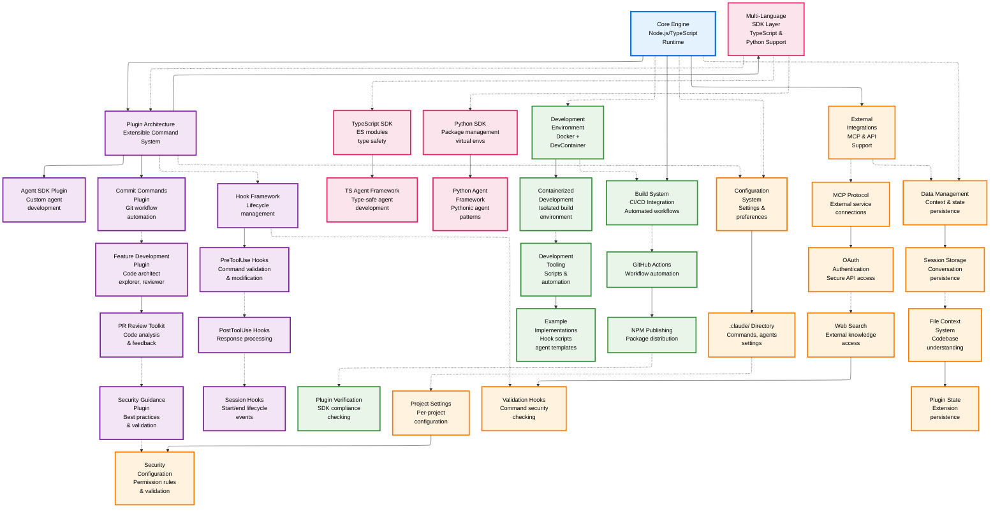

# L1 Technical Architecture - Snake-Flow High-Level Design

Executive Summary (Reliability-first)
- Purpose: Present an organic, ELK-rendered flow of Claude Code surfaces mapped to P24’s reliability-first principles.
- Guardrails: ISGL1 keys as stable IDs; CodeGraph-only writes; deterministic-first; LLM-late ≤3K tokens; safety gates (RA + cargo + selective tests). 

```mermaid
---
config:
  flowchart:
    defaultRenderer: elk
    nodeSpacing: 70
    rankSpacing: 90
    curve: basis
    padding: 30
---
flowchart TD
    %% L1 - High Level System Architecture (Snake-like Organic Flow)
    CC["Claude Code<br/>Agentic Terminal<br/>Coding Tool"]

    %% SNAKE FLOW: Core Interfaces (winding path)
    CC --> Terminal["Terminal Interface<br/>Natural Language<br/>Commands"]
    Terminal -.-> IDE["VS Code Extension<br/>Native Integration"]
    IDE --> GitHub["GitHub Integration<br/>@claude mentions<br/>& PRs"]
    GitHub -.-> PluginSystem["Plugin Ecosystem<br/>Extensible<br/>Command System"]

    %% SNAKE FLOW: Core Capabilities (organic winding)
    PluginSystem --> Tasks["Routine Task<br/>Execution<br/>Code explanations<br/>git workflows"]
    Tasks -.-> Editing["Advanced Editing<br/>Real-time<br/>collaboration"]
    Editing --> Collaboration["Team Collaboration<br/>Code reviews<br/>& PR management"]
    Collaboration -.-> Extensions["Custom Extensions<br/>Agents, hooks<br/>MCP servers"]

    %% SNAKE FLOW: Key Features (flowing chain)
    Extensions --> MultiModal["Multi-modal Input<br/>Text, images<br/>files"]
    MultiModal -.-> LiveEdit["Live Code Editing<br/>Real-time diff<br/>application"]
    LiveEdit --> Social["Social Coding<br/>@mentions<br/>& discussions"]
    Social -.-> Customization["Deep Customization<br/>Custom agents<br/>& workflows"]

    %% SNAKE FLOW: Data Flow (winding path)
    Customization --> LLM["Claude LLM<br/>Integration<br/>Context understanding"]
    LLM -.-> Tools["Tool Execution<br/>Engine<br/>Bash, grep, edit, todo"]
    Tools --> MCP["MCP Protocol<br/>Support<br/>External service<br/>integration"]
    MCP -.-> SDK["Multi-Language SDK<br/>TypeScript<br/>& Python support"]

    %% SNAKE FLOW: Architecture Benefits (organic connections)
    LLM -.-> Benefits["Benefits:<br/>• Natural language<br/>  programming<br/>• Context-aware<br/>  assistance<br/>• Multi-platform<br/>  support<br/>• Plugin<br/>  extensibility"]
    Tools -.-> Reliability["Reliability:<br/>• Plugin ecosystem<br/>• Extensible<br/>  architecture<br/>• Enterprise-grade<br/>  security<br/>• Permission<br/>  management"]
    MCP -.-> Scalability["Scalability:<br/>• Cloud & local<br/>  deployment<br/>• Team collaboration<br/>• Custom integrations<br/>• Multi-language<br/>  SDKs"]
    SDK -.-> Ecosystem["Ecosystem:<br/>• Hook system<br/>• Agent framework<br/>• Security validation<br/>• Development<br/>  tooling"]

    %% Enhanced styling for organic snake-like flow
    classDef primary fill:#e3f2fd,stroke:#1976d2,stroke-width:4px,color:#000
    classDef secondary fill:#f3e5f5,stroke:#7b1fa2,stroke-width:3px,color:#000
    classDef feature fill:#e8f5e8,stroke:#388e3c,stroke-width:3px,color:#000
    classDef benefit fill:#fff3e0,stroke:#f57c00,stroke-width:3px,color:#000

    class CC primary
    class Terminal,IDE,GitHub,PluginSystem secondary
    class Tasks,Editing,Collaboration,Extensions,MultiModal,LiveEdit,Social,Customization feature
    class LLM,Tools,MCP,SDK,Benefits,Reliability,Scalability,Ecosystem benefit
```

## L1 Architecture Overview - Snake-Flow Design

This redesigned L1 diagram features:
- **ELK Layout Engine**: For organic, flowing arrangements that create natural snake-like paths
- **Winding Interface Flow**: Core interfaces flow organically from Terminal → IDE → GitHub → PluginSystem
- **Snake-like Capability Chain**: Capabilities wind through Tasks → Editing → Collaboration → Extensions
- **Organic Feature Flow**: Features follow a winding path: MultiModal → LiveEdit → Social → Customization
- **Flowing Data Path**: Data flow winds through LLM → Tools → MCP → SDK with organic connections
- **Natural Benefit Connections**: Benefits connect organically via dotted lines following snake-like patterns

# L2 Technical Architecture - Snake-Flow Component Layout

## L2 Architecture Overview - Snake-Flow Design

This redesigned L2 diagram features:
- **ELK Layout Engine**: For organic, compact arrangements that naturally create snake-like flows
- **Snake-like Winding Paths**: Intentional zigzag patterns that flow organically rather than rigid linear layouts
- **Organic Branching**: Components branch and flow in natural, winding patterns
- **Compact Organic Layout**: Uses ELK's superior space utilization for more compact, readable arrangements
- **Flowing Connections**: Cross-layer relationships follow organic snake-like paths
- **Natural Reading Flow**: Creates a more intuitive, winding visual journey through the architecture

# L3 Technical Architecture - Snake-Flow Implementation Details

```mermaid
---
config:
  flowchart:
    defaultRenderer: elk
    nodeSpacing: 45
    rankSpacing: 70
    curve: basis
    padding: 20
---
flowchart TD
    %% L3 - Technical Implementation Details (Snake-like Organic Flow)
    Runtime["Node.js Runtime<br/>Event-driven<br/>architecture"]

    %% SNAKE FLOW: Core Engine Components (winding path)
    Runtime --> TerminalRenderer["Terminal Renderer<br/>Interactive UI<br/>system"]
    TerminalRenderer -.-> CommandParser["Command Parser<br/>Natural language<br/>processing"]
    CommandParser --> ToolExecutor["Tool Executor<br/>Command execution<br/>engine"]
    ToolExecutor -.-> SessionManager["Session Manager<br/>Conversation state<br/>management"]

    %% SNAKE FLOW: Plugin Architecture (organic winding)
    Runtime --> PluginLoader["Plugin Loader<br/>Dynamic plugin<br/>discovery"]
    PluginLoader --> PluginRegistry["Plugin Registry<br/>Command<br/>registration"]
    PluginRegistry -.-> AgentFramework["Agent Framework<br/>Custom agent<br/>support"]
    PluginLoader -.-> HookSystem["Hook System<br/>Lifecycle events"]
    HookSystem --> HookValidator["Hook Validator<br/>JSON schema<br/>validation"]
    HookValidator -.-> HookExecutor["Hook Executor<br/>Command<br/>preprocessing"]

    %% SNAKE FLOW: SDK Implementation (winding branch)
    PluginLoader --> SDKRuntime["SDK Runtime Layer<br/>Multi-language<br/>execution"]
    SDKRuntime -.-> TSSDKImpl["TypeScript SDK<br/>Implementation<br/>ES modules<br/>type definitions"]
    TSSDKImpl --> TSAgentEngine["TS Agent Engine<br/>Type-safe agent<br/>lifecycle"]
    SDKRuntime -.-> PySDKImpl["Python SDK<br/>Implementation<br/>Package management<br/>imports"]
    PySDKImpl --> PyAgentEngine["Python Agent<br/>Engine<br/>Pythonic agent<br/>patterns"]

    %% SNAKE FLOW: Tool System (flowing grid)
    ToolExecutor --> BashTool["Bash Tool<br/>Shell command<br/>execution"]
    ToolExecutor --> EditTool["Edit Tool<br/>File modification<br/>system"]
    EditTool -.-> TodoTool["Todo Tool<br/>Task management"]
    ToolExecutor --> GrepTool["Grep Tool<br/>Advanced search"]
    ToolExecutor --> LSTool["LS Tool<br/>Directory listing"]
    LSTool -.-> ValidationTool["Validation Tool<br/>SDK compliance<br/>checking"]

    %% SNAKE FLOW: Hook System Implementation (winding chain)
    HookSystem --> PreToolValidator["PreToolUse<br/>Validator<br/>Command security<br/>checking"]
    PreToolValidator --> CommandRules["Command Rules<br/>Engine<br/>Pattern matching<br/>& validation"]
    CommandRules -.-> SecurityScanner["Security Scanner<br/>Input<br/>sanitization"]
    HookSystem --> PostToolProcessor["PostToolUse<br/>Processor<br/>Response<br/>enhancement"]

    %% SNAKE FLOW: Configuration Implementation (organic flow)
    SessionManager --> SettingsManager["Settings Manager<br/>JSON configuration<br/>files"]
    SettingsManager -.-> ProjectSettings["Project Settings<br/>.claude/settings.json"]
    ProjectSettings --> UserSettings["User Settings<br/>Global preferences"]
    UserSettings -.-> PluginSettings["Plugin Settings<br/>Plugin-specific<br/>config"]
    PluginSettings --> SecuritySettings["Security Settings<br/>Permission rules<br/>& validation"]

    %% SNAKE FLOW: Authentication & Security (winding path)
    Runtime --> AuthManager["Authentication<br/>Manager<br/>OAuth & API key<br/>support"]
    AuthManager --> TokenManager["Token Manager<br/>Secure credential<br/>storage"]
    TokenManager -.-> PermissionManager["Permission Manager<br/>Tool access<br/>control"]
    PermissionManager --> SecurityValidator["Security Validator<br/>Input<br/>sanitization"]
    SecurityValidator -.-> HookSecurity["Hook Security<br/>Layer<br/>Pre/post execution<br/>validation"]

    %% SNAKE FLOW: External Integrations (flowing chain)
    Runtime --> MCPClient["MCP Client<br/>Protocol<br/>implementation"]
    MCPClient -.-> MCPServers["MCP Servers<br/>External service<br/>connections"]
    MCPServers --> OAuthFlows["OAuth Flows<br/>Authentication<br/>workflows"]
    OAuthFlows -.-> WebSearchAPI["Web Search API<br/>External knowledge<br/>queries"]
    WebSearchAPI --> ValidationLayer["MCP Validation<br/>Layer<br/>Protocol compliance<br/>checking"]

    %% SNAKE FLOW: Development Infrastructure (winding stack)
    Runtime --> DevContainer["Dev Container<br/>Dockerfile<br/>configuration"]
    DevContainer -.-> BuildTools["Build Tools<br/>TypeScript<br/>compilation"]
    BuildTools --> TestFramework["Test Framework<br/>Unit & integration<br/>tests"]
    TestFramework -.-> LintTools["Lint Tools<br/>Code quality<br/>enforcement"]
    LintTools --> ExampleTemplates["Example Templates<br/>Hook & agent<br/>templates"]

    %% SNAKE FLOW: Data Persistence (organic flow)
    SessionManager --> SQLiteDB["SQLite Database<br/>Session & context<br/>storage"]
    SQLiteDB -.-> ConversationStore["Conversation Store<br/>Message history"]
    ConversationStore --> ContextCache["Context Cache<br/>File & project<br/>context"]
    ContextCache -.-> PluginData["Plugin Data<br/>Extension state<br/>persistence"]
    PluginData --> HookState["Hook State<br/>Execution history<br/>& logs"]

    %% SNAKE FLOW: Communication Layers (organic connections)
    TerminalRenderer -.-> CommandParser
    CommandParser -.-> ToolExecutor
    ToolExecutor -.-> AuthManager
    SessionManager -.-> SettingsManager
    HookSystem -.-> PreToolValidator
    PluginLoader -.-> SDKRuntime

    %% Enhanced styling for organic snake-like flow
    classDef runtime fill:#e3f2fd,stroke:#1976d2,stroke-width:4px,color:#000
    classDef component fill:#f3e5f5,stroke:#7b1fa2,stroke-width:3px,color:#000
    classDef tool fill:#e8f5e8,stroke:#388e3c,stroke-width:3px,color:#000
    classDef integration fill:#fff3e0,stroke:#f57c00,stroke-width:3px,color:#000
    classDef sdk fill:#fce4ec,stroke:#e91e63,stroke-width:3px,color:#000

    class Runtime runtime
    class TerminalRenderer,CommandParser,ToolExecutor,SessionManager,PluginLoader,PluginRegistry,AgentFramework,HookSystem,HookValidator,HookExecutor,SDKRuntime,TSSDKImpl,PySDKImpl,TSAgentEngine,PyAgentEngine,PreToolValidator,CommandRules,SecurityScanner,PostToolProcessor,ValidationTool,SettingsManager,ProjectSettings,UserSettings,PluginSettings,SecuritySettings,AuthManager,TokenManager,PermissionManager,SecurityValidator,HookSecurity,MCPClient,MCPServers,OAuthFlows,WebSearchAPI,ValidationLayer,DevContainer,BuildTools,TestFramework,LintTools,ExampleTemplates,SQLiteDB,ConversationStore,ContextCache,PluginData,HookState component
```

## L3 Architecture Overview - Snake-Flow Design

This redesigned L3 diagram features:
- **ELK Layout Engine**: For organic, compact arrangements with natural snake-like flows
- **Winding Core Components**: Terminal → Command Parser → Tool Executor → Session Manager in organic flow
- **Snake-like Plugin Architecture**: Plugin Loader branches organically to Registry → Agent Framework → Hook System
- **Flowing SDK Implementation**: SDK Runtime winds through TypeScript and Python implementations with agent engines
- **Organic Tool Grid**: Tools flow in a natural grid pattern with winding connections
- **Winding Hook System**: PreTool Validator → Command Rules → Security Scanner → PostTool Processor
- **Flowing Configuration**: Settings Manager winds through Project → User → Plugin → Security Settings
- **Snake-like Security Path**: Auth Manager → Token → Permission → Security Validator → Hook Security
- **Winding Integrations**: MCP Client flows through Servers → OAuth → Web Search → Validation Layer
- **Organic Infrastructure**: Dev Container winds through Build Tools → Test Framework → Lint Tools → Examples
- **Flowing Data Persistence**: SQLite DB winds through Conversation → Context → Plugin → Hook State
- **Natural Communication**: Clean organic connections between core communication layers

## Architecture Improvement Summary

### Key Improvements Made:
1. **Enhanced Vertical Layout**: Increased rank spacing significantly (100-150px vs 40-75px)
2. **Linear Flow Organization**: Restructured complex branching into clear linear progressions
3. **Better Node Labeling**: Multi-line descriptions for improved readability
4. **Sectioned Organization**: Clear visual groupings by functional areas
5. **Improved Styling**: Better contrast and visual hierarchy
6. **Reduced Horizontal Spread**: More compact width while maintaining clarity

### Readability Enhancements:
- **Clear Visual Hierarchy**: Primary → Secondary → Feature → Benefit progression
- **Organized Subsections**: Each major component broken into logical subsections
- **Consistent Spacing**: Uniform node and rank spacing throughout
- **Better Contrast**: Enhanced color schemes and stroke weights
- **Multi-line Labels**: Complex component descriptions split across multiple lines
