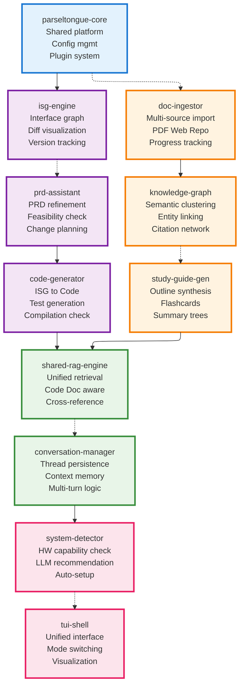
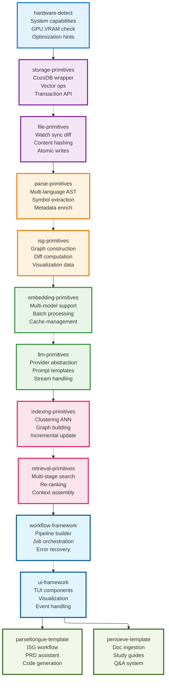
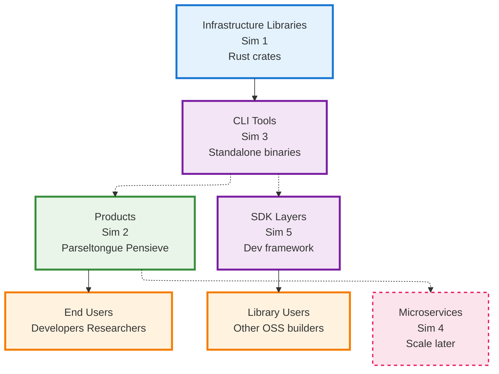

# P05 Modular Architecture for Parseltongue & Pensieve

## Overview

This document presents 5 different architectural simulations for building **Parseltongue** (Claude Code alternative) and **Pensieve** (NotebookLM alternative) as a collection of **independent, reusable Rust OSS projects**.

Each module is designed to be:
- **Standalone useful**: A library or CLI tool with independent value
- **Composable**: Can be combined for Parseltongue, Pensieve, or other products
- **Rust-first**: Low jitter, fearless concurrency, pure Rust philosophy

### Executive Summary (Reliability-first)
- Guardrails: ISGL1 as stable IDs; CodeGraph-only writes; deterministic-first; LLM-late ≤3K tokens.
- Safety gates: RA diagnostics overlay → cargo check --quiet → selective tests; rollback on fail.
- SLOs: RA 0.6–1.2s; cargo 1.5–3.5s; tests 2–8s p95 (impacted set).
- Scope: This P05 modules doc is read-only by design; only codegraph-write-surface mutates code.

### CodeGraph Integration & Write Discipline
- Read-only modules: cozo-kit, isg-store, vector-store, rust-isg, tree-sitter-multi, rag-core, chunk-engine, embed-pipeline, citation-kit, rata-ollama-tui, job-orchestrator, llm-router, ollama-kit.
- Single writer: codegraph-write-surface receives Future_Code/Future_Action and manages apply/rollback.
- Validation: preflight-safety-gate enforces RA overlay + cargo + selective tests before any apply.

### Three-Word Tool Aliases (P25 crosswalk)
- cozo-kit → cozo-db-adapter
- isg-store → isg-graph-store
- vector-store → vector-index-store
- rust-isg → rust-isg-generator
- tree-sitter-multi → multi-language-parser
- ollama-kit → ollama-client-kit
- llm-router → llm-provider-router
- rag-core → rag-retrieval-core
- chunk-engine → chunk-strategy-engine
- embed-pipeline → embedding-batch-pipeline
- citation-kit → citation-extractor-kit
- rata-ollama-tui → tui-ollama-shell
- job-orchestrator → async-job-orchestrator

### Executable Test Hooks (TDD-first)
- ISG determinism
  ```bash path=null start=null
  parse-to-isg ./src > isg.json && jq '. | length' isg.json
  ```
  ```json path=null start=null
  {"nodes": ">= 1000", "deterministic": true}
  ```
- Summary coverage KPI
  ```bash path=null start=null
  interface-summary-generator --cozo cozo://isg --write summaries --report
  ```
  ```json path=null start=null
  {"coverage": ">=0.95", "missing": []}
  ```
- Retrieval regression
  ```bash path=null start=null
  hybrid-retrieval-engine --cozo cozo://isg --seed "E0277" --k 50 --report
  ```
  ```json path=null start=null
  {"precision@15": ">=0.85", "recall@15": ">=0.9"}
  ```
- Preflight SLOs
  ```bash path=null start=null
  preflight-safety-gate --candidate 1234 --tests impacted.json
  ```
  ```json path=null start=null
  {"status":"pass","ra_ms": "<=1200","cargo_ms": "<=3500","tests_ms": "<=8000"}
  ```

---

## Simulation 1: Core Infrastructure Libraries

This approach focuses on foundational infrastructure that multiple products can build upon.

```mermaid
---
config:
  flowchart:
    defaultRenderer: elk
    nodeSpacing: 50
    rankSpacing: 70
    curve: basis
    padding: 20
---
flowchart TD
    %% SIMULATION 1: Core Infrastructure (Snake-Flow)
    
    %% Layer 1: Database & Storage
    CozoKit["cozo-kit<br/>CozoDB Adapter<br/>Type-safe queries<br/>Migration system"]
    CozoKit --> ISGStore["isg-store<br/>ISG persistence<br/>Graph operations<br/>Version control"]
    ISGStore -.-> VectorStore["vector-store<br/>Embedding storage<br/>ANN search<br/>Quantization"]
    
    %% Layer 2: Code Analysis
    VectorStore --> RustISG["rust-isg<br/>Rust AST → ISG<br/>Syn roundtrip<br/>RA integration"]
    RustISG -.-> TreeSitterParse["tree-sitter-multi<br/>Multi-language parsing<br/>Structure extraction<br/>Symbol tables"]
    
    %% Layer 3: LLM Integration
    TreeSitterParse --> OllamaKit["ollama-kit<br/>Ollama client<br/>Auto-discovery<br/>Model management"]
    OllamaKit --> LLMRouter["llm-router<br/>Multi-provider<br/>Anthropic/Ollama<br/>Fallback logic"]
    
    %% Layer 4: RAG & Retrieval
    LLMRouter -.-> RAGCore["rag-core<br/>Retrieval engine<br/>Centroid search<br/>Re-ranking"]
    RAGCore --> ChunkEngine["chunk-engine<br/>Smart chunking<br/>Overlap handling<br/>Structure-aware"]
    
    %% Layer 5: UI & Orchestration
    ChunkEngine -.-> RataTUI["rata-ollama-tui<br/>Auto-config TUI<br/>Ollama integration<br/>Chat interface"]
    RataTUI --> JobOrch["job-orchestrator<br/>Async pipelines<br/>Resumable tasks<br/>Progress tracking"]
    
    %% Cross-layer: Utilities
    JobOrch -.-> EmbedPipe["embed-pipeline<br/>Batch embedding<br/>Caching<br/>Deduplication"]
    EmbedPipe --> CitationKit["citation-kit<br/>Grounding logic<br/>Source tracking<br/>Quote extraction"]
    
    %% Styling
    classDef storage fill:#e3f2fd,stroke:#1976d2,stroke-width:3px
    classDef analysis fill:#f3e5f5,stroke:#7b1fa2,stroke-width:3px
    classDef llm fill:#fff3e0,stroke:#f57c00,stroke-width:3px
    classDef rag fill:#e8f5e8,stroke:#388e3c,stroke-width:3px
    classDef ui fill:#fce4ec,stroke:#e91e63,stroke-width:3px
    
    class CozoKit,ISGStore,VectorStore storage
    class RustISG,TreeSitterParse analysis
    class OllamaKit,LLMRouter llm
    class RAGCore,ChunkEngine,EmbedPipe,CitationKit rag
    class RataTUI,JobOrch ui
```



### Module Descriptions

#### Storage Layer
- **cozo-kit**: Type-safe CozoDB adapter with migrations, transaction helpers, and query builders
- **isg-store**: Specialized storage for Interface Signature Graphs with versioning and diff operations
- **vector-store**: Generic vector storage with multiple backend support (CozoDB, FAISS, custom)

#### Analysis Layer  
- **rust-isg**: Rust-specific ISG generator using `syn` + `rust-analyzer` for semantic enrichment
- **tree-sitter-multi**: Unified multi-language parser with structure extraction for non-Rust code

#### LLM Layer
- **ollama-kit**: Smart Ollama client with auto-discovery, health checks, model download orchestration
- **llm-router**: Unified interface for Anthropic/Ollama with automatic fallback and cost optimization

#### RAG Layer
- **rag-core**: Production-grade retrieval with centroid search, kNN graph walks, hybrid fusion
- **chunk-engine**: Structure-aware chunking for code/docs with configurable strategies
- **embed-pipeline**: Efficient batch embedding with caching and content-hash deduplication
- **citation-kit**: Citation extraction and grounding logic with exact quote spans

#### UI Layer
- **rata-ollama-tui**: Ratatui-based TUI that auto-configures Ollama on Apple Silicon
- **job-orchestrator**: Async job system with progress tracking, resumability, and back-pressure

---

## Simulation 2: Product-Centric Feature Modules

This approach organizes modules around user-facing features and workflows.



**Product Combinations:**
- **Parseltongue** = `parseltongue-core` + `isg-engine` + `prd-assistant` + `code-generator` + `shared-rag-engine` + `conversation-manager` + `system-detector` + `tui-shell`
- **Pensieve** = `parseltongue-core` + `doc-ingestor` + `knowledge-graph` + `study-guide-gen` + `shared-rag-engine` + `conversation-manager` + `system-detector` + `tui-shell`
- **Hybrid IDE** = All modules combined for unified code + doc intelligence

---

## Simulation 3: CLI-First Composable Tools

This approach creates standalone CLI tools that can be composed via pipes and configuration.

```mermaid
---
config:
  flowchart:
    defaultRenderer: elk
    nodeSpacing: 45
    rankSpacing: 65
    curve: basis
    padding: 20
---
flowchart TD
    %% SIMULATION 3: CLI Tools (Snake-Flow)
    
    %% Ingestion Tools
    Ingest["cozo-ingest<br/>CLI ingestion tool<br/>Multi-format support<br/>Progress output"]
    Ingest --> Parse["parse-to-isg<br/>AST to ISG CLI<br/>Rust syn tree-sitter<br/>JSON output"]
    Parse -.-> Chunk["smart-chunk<br/>Structure chunking<br/>Configurable strategy<br/>JSONL output"]
    
    %% Embedding Tools
    Chunk --> Embed["ollama-embed<br/>Batch embedding CLI<br/>Auto model mgmt<br/>Binary vectors"]
    Embed -.-> Index["vector-index<br/>ANN index builder<br/>Multiple backends<br/>Mmap support"]
    
    %% Query Tools
    Index --> Query["cozo-query<br/>SQL-like queries<br/>ISG graph walks<br/>JSON results"]
    Query -.-> Retrieve["rag-retrieve<br/>Semantic search CLI<br/>Hybrid scoring<br/>Context assembly"]
    
    %% Generation Tools
    Retrieve --> Prompt["prompt-forge<br/>Template engine<br/>Citation formatting<br/>Context injection"]
    Prompt -.-> Generate["ollama-generate<br/>Streaming LLM CLI<br/>Multi-provider<br/>Citation parsing"]
    
    %% Utility Tools
    Generate --> Visualize["isg-viz<br/>HTML visualization<br/>Graph rendering<br/>Diff views"]
    Visualize -.-> Watch["cozo-watch<br/>File system monitor<br/>Auto re-index<br/>Delta updates"]
    
    %% Orchestration
    Watch --> Compose["task-compose<br/>Pipeline orchestrator<br/>YAML workflows<br/>Parallel execution"]
    
    %% Styling
    classDef ingest fill:#e3f2fd,stroke:#1976d2,stroke-width:3px
    classDef embed fill:#f3e5f5,stroke:#7b1fa2,stroke-width:3px
    classDef query fill:#fff3e0,stroke:#f57c00,stroke-width:3px
    classDef gen fill:#e8f5e8,stroke:#388e3c,stroke-width:3px
    classDef util fill:#fce4ec,stroke:#e91e63,stroke-width:3px
    
    class Ingest,Parse,Chunk ingest
    class Embed,Index embed
    class Query,Retrieve query
    class Prompt,Generate gen
    class Visualize,Watch,Compose util
```



**CLI Composition Examples:**
```bash
# Parseltongue workflow
parse-to-isg ./src | smart-chunk | ollama-embed | vector-index cozo://./data
cozo-query "MATCH (n:Interface) RETURN n" | rag-retrieve | prompt-forge prd.md | ollama-generate

# Pensieve workflow  
cozo-ingest --pdf ./docs | smart-chunk --strategy semantic | ollama-embed | vector-index
echo "Summarize main themes" | rag-retrieve --k 20 | prompt-forge --template study-guide | ollama-generate

# Watch mode for live updates
cozo-watch ./src --on-change "parse-to-isg | smart-chunk | ollama-embed | vector-index --update"
```

---

## Simulation 4: Service-Oriented Microservices

This approach creates independent services that communicate via APIs.

```mermaid
---
config:
  flowchart:
    defaultRenderer: elk
    nodeSpacing: 45
    rankSpacing: 65
    curve: basis
    padding: 20
---
flowchart TD
    %% SIMULATION 4: Microservices (Snake-Flow)
    
    %% Gateway
    Gateway["api-gateway<br/>Axum HTTP server<br/>Auth routing<br/>Rate limiting"]
    
    %% Core Services
    Gateway --> ISGService["isg-service<br/>Interface graph API<br/>CRUD operations<br/>Diff endpoints"]
    ISGService -.-> EmbedService["embedding-service<br/>Batch embed API<br/>Model management<br/>Cache layer"]
    
    %% Storage Services
    EmbedService --> CozoService["cozo-service<br/>Graph DB API<br/>Query endpoint<br/>Transaction mgmt"]
    CozoService -.-> VectorService["vector-service<br/>ANN search API<br/>Index mgmt<br/>Similarity queries"]
    
    %% Intelligence Services
    VectorService --> RAGService["rag-service<br/>Retrieval API<br/>Hybrid search<br/>Context packing"]
    RAGService -.-> LLMService["llm-service<br/>Generation API<br/>Streaming SSE<br/>Multi-provider"]
    
    %% Orchestration Services
    LLMService --> WorkflowService["workflow-service<br/>Pipeline orchestration<br/>Job scheduling<br/>State management"]
    WorkflowService -.-> NotifyService["notification-service<br/>Progress updates<br/>WebSocket events<br/>Error alerts"]
    
    %% Supporting Services
    NotifyService --> ConfigService["config-service<br/>Settings API<br/>Feature flags<br/>Runtime config"]
    ConfigService -.-> MetricsService["metrics-service<br/>Telemetry API<br/>Health checks<br/>Performance stats"]
    
    %% Styling
    classDef gateway fill:#e3f2fd,stroke:#1976d2,stroke-width:3px
    classDef core fill:#f3e5f5,stroke:#7b1fa2,stroke-width:3px
    classDef storage fill:#fff3e0,stroke:#f57c00,stroke-width:3px
    classDef intel fill:#e8f5e8,stroke:#388e3c,stroke-width:3px
    classDef support fill:#fce4ec,stroke:#e91e63,stroke-width:3px
    
    class Gateway gateway
    class ISGService,EmbedService core
    class CozoService,VectorService storage
    class RAGService,LLMService,WorkflowService intel
    class NotifyService,ConfigService,MetricsService support
```



**Service Deployment:**
- Each service is an independent Rust binary with its own API
- Communication via HTTP/gRPC with service discovery
- Independent scaling and deployment
- Can run locally or distributed across machines

---

## Simulation 5: Layer-Based Development Kit

This approach creates a development kit with clear abstraction layers.



**SDK Usage:**
```rust
// Build custom tool with L1-L4 primitives
use storage_primitives::CozoClient;
use parse_primitives::RustParser;
use embedding_primitives::OllamaEmbedder;
use retrieval_primitives::HybridRetriever;

// Or use L6 templates for quick start
use parseltongue_template::ISGWorkflow;
use pensieve_template::StudyGuideBuilder;
```

---

## Summary: Module Reusability Matrix

| Module Type | Parseltongue | Pensieve | Other Tools | Standalone Value |
|-------------|--------------|----------|-------------|------------------|
| **cozo-kit** | ✓ | ✓ | ✓ | High - Generic graph DB adapter |
| **isg-store** | ✓ | ✗ | ✓ | Medium - ISG-specific but reusable |
| **rust-isg** | ✓ | ✗ | ✓ | High - Rust code analysis tool |
| **ollama-kit** | ✓ | ✓ | ✓ | High - LLM client library |
| **rag-core** | ✓ | ✓ | ✓ | High - Generic RAG engine |
| **rata-ollama-tui** | ✓ | ✓ | ✓ | High - Reusable TUI framework |
| **doc-ingestor** | ✗ | ✓ | ✓ | High - Document processing tool |
| **knowledge-graph** | ✗ | ✓ | ✓ | Medium - Knowledge extraction |
| **prd-assistant** | ✓ | ✗ | ✗ | Low - Parseltongue-specific |
| **code-generator** | ✓ | ✗ | ✓ | Medium - Code gen framework |

## Recommended Build Strategy

**Phase 1: Foundation (Weeks 1-4)**
1. `cozo-kit` - Database adapter
2. `ollama-kit` - LLM integration
3. `chunk-engine` - Smart chunking
4. `embed-pipeline` - Embedding system

**Phase 2: Intelligence (Weeks 5-8)**
5. `rag-core` - Retrieval engine
6. `rust-isg` - AST to ISG
7. `vector-store` - ANN search
8. `citation-kit` - Grounding

**Phase 3: Products (Weeks 9-12)**
9. `isg-engine` - Full ISG system
10. `doc-ingestor` - Document processing
11. `rata-ollama-tui` - TUI interface
12. Integration and testing

**Phase 4: Polish (Weeks 13-16)**
13. CLI tools for each module
14. Documentation and examples
15. Performance optimization
16. Community feedback integration

---

## Comparison Matrix: Which Simulation to Choose?

| Criteria | Sim 1: Infrastructure | Sim 2: Features | Sim 3: CLI Tools | Sim 4: Microservices | Sim 5: SDK Layers |
|----------|----------------------|-----------------|------------------|---------------------|-------------------|
| **Ease of Start** | Medium | Easy | Easy | Hard | Medium |
| **Reusability** | ⭐⭐⭐⭐⭐ | ⭐⭐⭐ | ⭐⭐⭐⭐⭐ | ⭐⭐⭐ | ⭐⭐⭐⭐⭐ |
| **Composability** | ⭐⭐⭐⭐ | ⭐⭐⭐ | ⭐⭐⭐⭐⭐ | ⭐⭐⭐⭐ | ⭐⭐⭐⭐⭐ |
| **Time to Market** | Slow | Fast | Medium | Slow | Medium |
| **Scalability** | ⭐⭐⭐ | ⭐⭐⭐ | ⭐⭐⭐ | ⭐⭐⭐⭐⭐ | ⭐⭐⭐⭐ |
| **Maintenance** | Easy | Medium | Easy | Hard | Easy |
| **Testing** | Isolated | Integrated | Isolated | Complex | Layered |
| **Community Appeal** | High | Medium | Very High | Low | High |
| **Best For** | Library builders | Product teams | Unix philosophy fans | Enterprise scale | Framework builders |

## Recommended Hybrid Approach

**Combine Simulation 1 + Simulation 3 for maximum impact:**

1. **Build Infrastructure Libraries (Sim 1)** as the foundation
2. **Wrap each library in CLI tools (Sim 3)** for standalone utility
3. **Compose into products** via configuration and pipelines
4. **Layer SDK (Sim 5)** on top for framework users



## Example: ISG Module Across All Simulations

To illustrate how a single concept (ISG) manifests across different architectural approaches:

**Simulation 1 (Infrastructure)**
- `isg-store` crate: Core graph operations, versioning, persistence

**Simulation 2 (Features)**
- `isg-engine` module: Complete ISG workflow for Parseltongue

**Simulation 3 (CLI)**
- `parse-to-isg` binary: Converts code → ISG JSON
- `isg-viz` binary: Renders ISG → HTML visualization
- `isg-diff` binary: Compares ISG versions

**Simulation 4 (Microservices)**
- `isg-service`: REST API for ISG CRUD operations
  - `POST /isg/generate` - Create ISG from codebase
  - `GET /isg/:id/diff/:other_id` - Compare two ISGs
  - `GET /isg/:id/visualize` - Get visualization data

**Simulation 5 (SDK Layers)**
- L2: `isg-primitives` - Low-level graph construction
- L6: `parseltongue-template` - High-level ISG workflow

## Key Insights

### 🎯 The ISG Concept is Universally Applicable

Just like ISG (Interface Signature Graph) can be used for:
- **Parseltongue**: Rust code refactoring with PRD-driven changes
- **Knowledge bases**: Document/concept relationship graphs
- **Dependency analysis**: Understanding codebases
- **Code search**: Semantic code navigation

Each module should be designed with this "universal applicability" mindset.

### 🔧 Build "Horizontal" Infrastructure, Not "Vertical" Products

Instead of:
```
Parseltongue (monolith) = ISG + PRD + LLM + TUI + CozoDB
```

Build:
```
cozo-kit (horizontal) → Used by: Parseltongue, Pensieve, analytics tools, etc.
ollama-kit (horizontal) → Used by: Any LLM-powered Rust project
isg-store (horizontal) → Used by: Code analysis, documentation, refactoring tools
```

### 🚀 CLI-First Philosophy = Maximum Composability

Every library should have a corresponding CLI that:
1. **Validates** the library works standalone
2. **Documents** the API through usage examples
3. **Enables** Unix-style composition
4. **Attracts** users who prefer tools over libraries

### 📦 Publish Early, Publish Often

Treat each module as its own OSS project:
- Individual GitHub repos (or monorepo with independent releases)
- Semantic versioning
- Comprehensive README with examples
- CI/CD for each module
- crates.io publication

This creates a **portfolio of useful tools** rather than a single monolithic project.

---

## Conclusion

Building Parseltongue and Pensieve as **modular, composable Rust OSS projects** provides:

✅ **Independent Value**: Each module is useful on its own  
✅ **Community Engagement**: Multiple entry points for contributors  
✅ **Flexible Assembly**: Mix and match for different products  
✅ **Future-Proof**: Easy to adapt as requirements change  
✅ **Portfolio Effect**: Multiple projects gain visibility  

**Start with Simulation 1 (Infrastructure Libraries) + Simulation 3 (CLI Tools)** and evolve based on user feedback and scaling needs.
