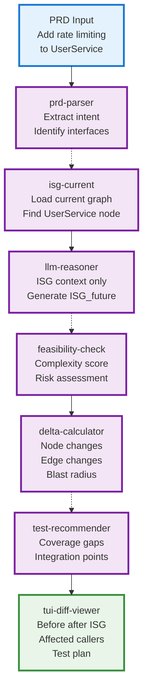
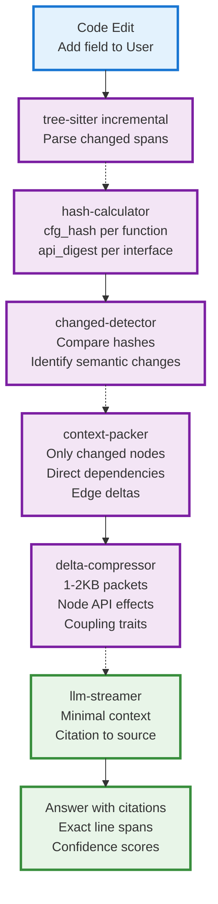
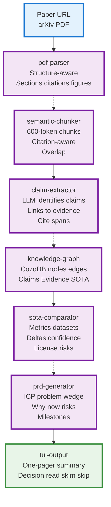
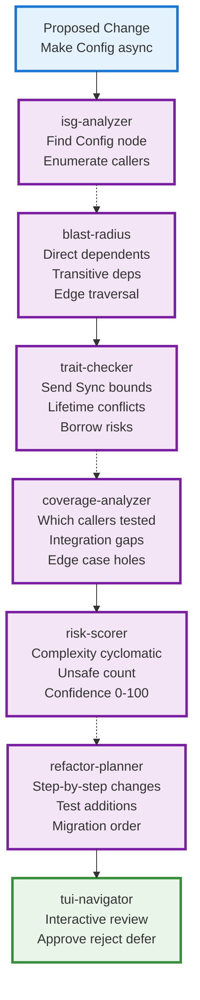
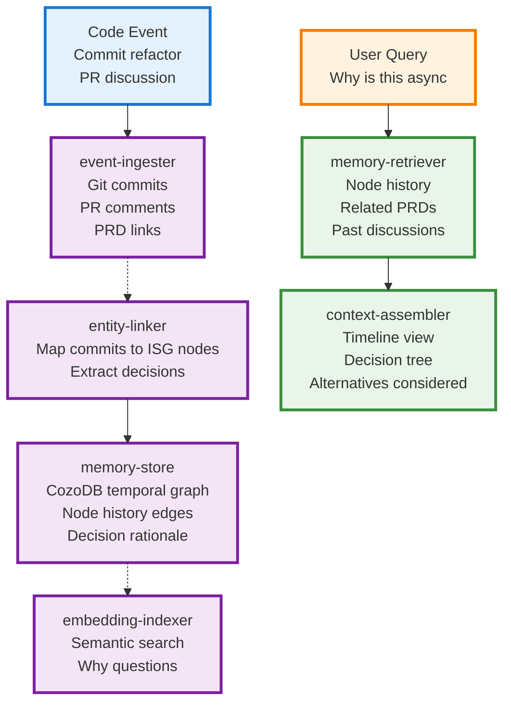
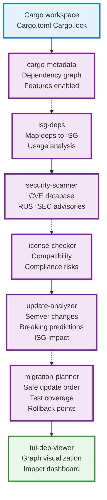
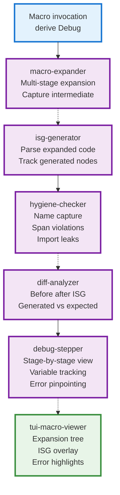
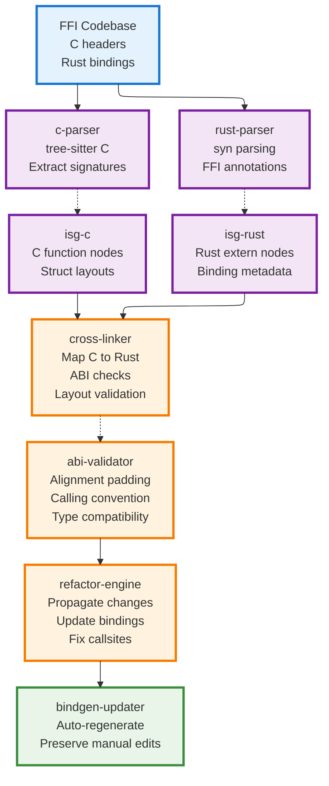
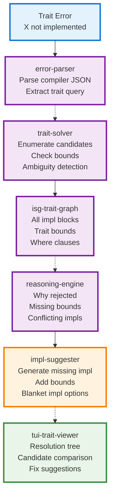
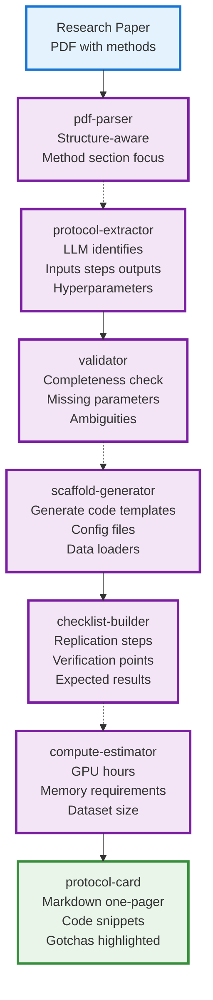

# P06 Enhancement Simulations - Shreyas Doshi Product Thinking

## Overview

This document presents **10 differentiated product simulations** for Parseltongue & Pensieve, applying Shreyas Doshi's product framework:
- **Clear differentiation**: Each simulation solves a different problem for a different user
- **10x moments**: Sharp wedges that remove grind
- **Compounding effects**: Value that grows with usage
- **Rust-first**: Pure Rust, keeping existing tech stack (CozoDB, Ollama, Tree-sitter, syn)

Based on insights from:
- **P05ModuleMermaid.md**: Modular architecture foundations
- **ParseltongueEvolution docs**: ISG architecture, incremental computation, product thinking

---

## Differentiation Framework

Each simulation answers:
1. **Who**: Target user (specific persona)
2. **Pain**: What grind does this remove?
3. **Wedge**: The sharp 10x moment that gets them hooked
4. **Compound**: How value grows with usage
5. **Moat**: Why this is hard to replicate
6. **Tech**: Rust modules from existing stack

---

## Simulation 1: PRD-to-Code Delta Engine

**Differentiation**: Converts product requirements into minimal, verifiable code changes through ISG reasoning.

### Who & Pain
- **Target**: Staff/Senior engineers tired of manual refactoring sprints
- **Pain**: 3-day "simple feature" becomes 2-week refactor when touched interfaces ripple through codebase
- **Current hack**: Grep + hope + manual AST review

### Wedge (10x Moment)
Paste PRD → Get ISG diff showing **exactly** which interfaces change + ripple analysis + test recommendations in **< 2 minutes**

### Product Flow



### Compounding Effects
- **ISG history**: Every PRD → ISG_future pair becomes training data
- **Pattern library**: Common refactors (add param, split function, extract interface) become one-click
- **Team memory**: "Last time we touched Auth, these 12 tests broke"

### Moat
- **ISG as source of truth**: Competitors work on strings/AST; we work on semantic graph
- **Incremental Salsa**: Changes recalculate in <12ms vs full re-parse
- **Rubber duck built-in**: LLM validates its own plan before showing user

### Tech Stack (Rust Modules)
- `prd-parser` (NLP + structured extraction)
- `isg-engine` (Graph diff + reasoning)
- `llm-router` (Ollama/Anthropic)
- `delta-calculator` (Blast radius via CozoDB graph queries)
- `test-recommender` (Coverage analysis)
- `rata-tui` (Interactive diff viewer)

### Metrics
- **TTI (Time-to-Insight)**: PRD → actionable diff < 2 min
- **Accuracy**: 90%+ of predicted changes are correct
- **Adoption**: 60%+ of PRDs use this before writing code

---

## Simulation 2: Incremental Context Surgeon

**Differentiation**: Surgical LLM context assembly using ctrl_bits, cfg_hash, and api_digest to send only what changed semantically.

### Who & Pain
- **Target**: Teams using Claude/GPT for code review drowning in token costs
- **Pain**: Sending entire 50K-line crate for "add one field" review = $3/query, slow, hallucinates
- **Current hack**: Manual selection + prayer

### Wedge (10x Moment)
**80-95% token reduction** on every LLM query by sending only semantic deltas, not text diffs

### Product Flow



### Compounding Effects
- **Hash cache**: Unchanged functions skip recomputation (Salsa memoization)
- **Pattern recognition**: System learns which node types predict breakage
- **Cost savings**: Linear reduction in API costs as codebase grows

### Moat
- **cfg_hash uniqueness**: Detects logic changes even if variables renamed
- **api_digest stability**: Signature changes trigger alerts even without body changes
- **Incremental-first**: Competitors recalculate everything; we only compute deltas

### Tech Stack (Rust Modules)
- `tree-sitter-multi` (Incremental parsing)
- `hash-calculator` (ctrl_bits, cfg_hash, api_digest extraction)
- `context-packer` (Minimal delta assembly)
- `llm-router` (Token-optimized prompts)
- `citation-kit` (Grounding with exact spans)

### Metrics
- **Token reduction**: 80-95% vs sending full files
- **Accuracy uplift**: 15-25% fewer hallucinations (less noise)
- **Cost**: $0.10/query vs $3/query (30x savings)

---

## Simulation 3: Paper-to-PRD Claim Graph

**Differentiation**: Transforms research papers into actionable PRDs by extracting claims, evidence, and SOTA gaps through structured chunking.

### Who & Pain
- **Target**: ML engineers/researchers scouting techniques for products
- **Pain**: 4 hours reading paper → 30 min useful insights buried in 40 pages
- **Current hack**: Ctrl+F for "dataset" + manual notes

### Wedge (10x Moment)
**2-minute triage**: arXiv URL → one-pager with claims, evidence strength, replication risks, and "build this?" decision

### Product Flow



### Compounding Effects
- **Claim library**: Every paper adds to knowledge graph
- **Cross-paper links**: Auto-detect when Paper B refutes/extends Paper A
- **Watchlists**: Alert when SOTA changes on tracked metrics

### Moat
- **Citation-aware chunking**: Keeps claims + evidence together (competitors split arbitrarily)
- **CozoDB graph**: Traverse "Paper A cites Paper B which extends Paper C" in one query
- **Structure-first**: Respects PDF layout (headings, tables, figures) vs generic splitters

### Tech Stack (Rust Modules)
- `pdf-parser` (PyMuPDF bindings or native)
- `semantic-chunker` (Structure + token budget)
- `claim-extractor` (LLM + prompt templates)
- `cozo-kit` (Graph storage and queries)
- `sota-comparator` (Metric extraction)
- `prd-generator` (Template engine)

### Metrics
- **TTI_triage**: URL → decision < 2 min
- **TTI_PRD**: Triage → draft PRD < 10 min
- **Claim accuracy**: 85%+ correctly extracted
- **Adoption**: 50%+ of papers lead to follow-up action

---

## Simulation 4: Rust Refactor Confidence Engine

**Differentiation**: Guarantees refactor safety through ISG blast radius + test coverage gaps + borrow-checker hints before touching code.

### Who & Pain
- **Target**: Mid-level Rust devs afraid to refactor due to lifetime/trait hell
- **Pain**: "Change this signature" → 47 compiler errors → 2 days debugging
- **Current hack**: Clone everything, add .unwrap(), hope tests catch it

### Wedge (10x Moment)
**Before changing code**: See exact ripple effect, missing test coverage, and borrow-checker hotspots with confidence score

### Product Flow



### Compounding Effects
- **Refactor history**: System learns "changing X always breaks Y"
- **Team patterns**: Identifies which modules are fragile vs stable
- **Confidence calibration**: Tracks score accuracy vs actual breakage

### Moat
- **Rust-specific**: Uses syn + rust-analyzer HIR for perfect trait/lifetime analysis
- **ctrl_bits enrichment**: Knows cyclomatic complexity, unsafe count per function
- **ISG graph queries**: "Show all async functions that call blocking I/O" in one Datalog query

### Tech Stack (Rust Modules)
- `isg-engine` (Graph analysis)
- `blast-radius` (CozoDB graph traversal)
- `trait-checker` (rust-analyzer integration)
- `coverage-analyzer` (Test mapping)
- `risk-scorer` (ctrl_bits + heuristics)
- `rata-tui` (Interactive planner)

### Metrics
- **Accuracy**: 90%+ of high-risk warnings are correct
- **Confidence**: Reduce "don't know if safe" cases by 70%
- **Speed**: Analysis < 200ms for medium crate

---

## Simulation 5: Live Codebase Memory

**Differentiation**: Persistent incremental knowledge base that survives restarts, remembers refactors, and explains "why this code exists".

### Who & Pain
- **Target**: Engineers joining existing codebases or returning after 6 months
- **Pain**: "Why is UserService implemented this way?" → archaeology via git blame + slack search
- **Current hack**: Ask senior dev (if they remember)

### Wedge (10x Moment)
**Right-click on any function** → See original PRD, design decisions, past refactors, and "why not the simple approach?"

### Product Flow



### Compounding Effects
- **Institutional knowledge**: Never loses context on team turnover
- **Pattern detection**: "Every time we made X async, we regretted it"
- **Onboarding**: New dev gets instant "why" on every design decision

### Moat
- **Temporal ISG**: CozoDB stores node versions over time with decision edges
- **Git integration**: Automatic commit → ISG node linking via heuristics
- **Semantic memory**: Embeddings let you ask "why" not just "what"

### Tech Stack (Rust Modules)
- `event-ingester` (Git/GitHub API)
- `entity-linker` (Heuristic matching)
- `cozo-kit` (Temporal graph storage)
- `embedding-indexer` (Ollama embeddings)
- `memory-retriever` (Hybrid search)
- `context-assembler` (Timeline builder)

### Metrics
- **Coverage**: 80%+ of functions have "why" context
- **TTI**: Question → answer < 5 sec
- **Retention**: 50%+ of onboarding questions answered without humans

---

## Simulation 6: Cargo Ecosystem Navigator

**Differentiation**: Deep dependency graph analysis with security, licensing, and update impact prediction across entire Cargo workspace.

### Who & Pain
- **Target**: Platform/infrastructure engineers managing 100+ crate dependencies
- **Pain**: `cargo update` → production breaks due to transitive dep change 7 layers deep
- **Current hack**: Pin everything, never update, accumulate CVEs

### Wedge (10x Moment)
**Before updating**: See dependency blast radius, breaking change predictions, and CVE impact with migration plan

### Product Flow



### Compounding Effects
- **Update history**: Tracks which updates caused issues historically
- **Team patterns**: Learns "always wait 2 weeks after tokio releases"
- **Workspace intelligence**: Cross-crate impact analysis

### Moat
- **ISG-aware deps**: Knows which parts of your code actually use each dependency
- **Cargo.lock forensics**: Detects phantom dependency updates
- **Feature analysis**: "You enabled feature X which pulls in Y with CVE-Z"

### Tech Stack (Rust Modules)
- `cargo-metadata` parser
- `isg-deps` (Dependency → ISG mapping)
- `security-scanner` (RUSTSEC integration)
- `license-checker` (SPDX validation)
- `update-analyzer` (Semver + prediction)
- `rata-tui` (Graph visualization)

### Metrics
- **False positives**: <10% of "breaking change" predictions wrong
- **CVE coverage**: 100% of RUSTSEC advisories detected
- **Time saved**: 80% reduction in dependency debugging time

---

## Simulation 7: Macro Expansion Debugger

**Differentiation**: Step-through debugging of Rust macro expansions with ISG tracking of generated code and hygiene issues.

### Who & Pain
- **Target**: Rust macro authors and users debugging derive macros
- **Pain**: Macro error → cryptic 50-line compiler message pointing to generated code you can't see
- **Current hack**: `cargo expand` + manual diff + println debugging

### Wedge (10x Moment)
**Interactive step-through**: See each macro expansion stage, generated ISG nodes, and hygiene violations in real-time

### Product Flow



### Compounding Effects
- **Expansion library**: Common patterns (derive, proc_macro) become templates
- **Error catalog**: "This hygiene issue always means X"
- **Macro linting**: Catches issues before they reach compiler

### Moat
- **Multi-stage tracking**: Captures nested macro expansions (competitors show final only)
- **ISG integration**: Sees generated functions/traits as first-class nodes
- **Hygiene detection**: Catches name capture bugs that rustc can't explain

### Tech Stack (Rust Modules)
- `macro-expander` (syn + quote integration)
- `isg-generator` (Parse generated code)
- `hygiene-checker` (Span analysis)
- `diff-analyzer` (ISG comparison)
- `rata-tui` (Interactive stepper)

### Metrics
- **Debug time**: 70% reduction in macro debugging time
- **Error clarity**: 90%+ of users understand error after visualization
- **Adoption**: 40%+ of macro crates use this for testing

---

## Simulation 8: Cross-Language ISG Bridge

**Differentiation**: Unified ISG across Rust FFI boundaries (C/C++/Python) with ABI compatibility checking and cross-language refactoring.

### Who & Pain
- **Target**: Teams maintaining Rust bindings to C/C++ libraries
- **Pain**: Change C function signature → rebuild all Rust bindings manually → miss one → segfault
- **Current hack**: Manual bindgen re-run + grep for all usages + prayer

### Wedge (10x Moment)
**Change C header** → See all Rust usages, ABI break predictions, and auto-generated binding updates

### Product Flow



### Compounding Effects
- **ABI history**: Tracks layout changes over time
- **Platform matrix**: Tests ABI on Linux/macOS/Windows simultaneously
- **Migration patterns**: "When C struct adds field, update Rust struct at line X"

### Moat
- **Cross-language ISG**: First tool to treat C/Rust as unified semantic graph
- **ABI validation**: Catches alignment/padding issues bindgen misses
- **Bidirectional sync**: Changes propagate both C→Rust and Rust→C

### Tech Stack (Rust Modules)
- `tree-sitter-c` (C parsing)
- `syn` (Rust parsing)
- `isg-cross` (Unified graph)
- `abi-validator` (Layout analysis)
- `bindgen-updater` (Integration)

### Metrics
- **ABI errors caught**: 95%+ of incompatibilities detected pre-compile
- **Sync time**: <30s for 10K-line header updates
- **Safety**: 0 production segfaults from ABI mismatches

---

## Simulation 9: Trait Solver Visualizer

**Differentiation**: Interactive visualization of Rust trait resolution with ambiguity detection and impl suggestion engine.

### Who & Pain
- **Target**: Intermediate Rust devs confused by trait errors
- **Pain**: "trait X is not implemented for Y" → no idea which impl is missing or why
- **Current hack**: Add random bounds until it compiles

### Wedge (10x Moment)
**See trait resolution tree**: Which impls exist, which are missing, and why compiler rejected candidates

### Product Flow



### Compounding Effects
- **Error library**: Common trait errors become one-click fixes
- **Impl patterns**: Learns "when X fails, usually need impl Y + Z"
- **Teaching tool**: Builds intuition for trait resolution

### Moat
- **ISG trait graph**: Maintains comprehensive impl index across workspace
- **Solver integration**: Uses rust-analyzer's trait solver for accuracy
- **Suggestion quality**: Generates only valid, minimal impls

### Tech Stack (Rust Modules)
- `error-parser` (rustc JSON output)
- `trait-solver` (rust-analyzer integration)
- `isg-trait-graph` (Impl index)
- `impl-suggester` (Code generation)
- `rata-tui` (Interactive visualization)

### Metrics
- **Fix rate**: 80%+ of suggestions compile on first try
- **Learning**: 60% reduction in repeat trait errors after using tool
- **Time saved**: 15 min average debugging time → 2 min

---

## Simulation 10: Pensieve Study Protocol Engine

**Differentiation**: Converts research papers into executable study protocols with experiment scaffolding and replication checklists.

### Who & Pain
- **Target**: ML practitioners trying to replicate papers
- **Pain**: Paper says "we trained for 100 epochs" → which hyperparams? which dataset split? how long actually?
- **Current hack**: Email authors, guess parameters, waste GPU hours

### Wedge (10x Moment)
**Generate protocol card**: One-page recipe with inputs, steps, gotchas, and compute budget from paper PDF

### Product Flow



### Compounding Effects
- **Protocol library**: Successful replications become verified templates
- **Gotcha database**: "Paper says X but actually means Y"
- **Community validation**: Users upvote/correct protocols

### Moat
- **Method-focused parsing**: Specialized extraction for experiment protocols
- **Scaffold generation**: Creates runnable code, not just text
- **Compute estimation**: Uses historical data + paper specs for accurate predictions

### Tech Stack (Rust Modules)
- `pdf-parser` (Structure-aware)
- `protocol-extractor` (LLM + templates)
- `validator` (Completeness heuristics)
- `scaffold-generator` (Code generation)
- `compute-estimator` (Cost modeling)

### Metrics
- **Replication success**: 70%+ of protocols lead to successful replication
- **Time saved**: 3 days setup → 4 hours with protocol card
- **Accuracy**: 85%+ of compute estimates within 20% of actual

---

## Summary: Differentiation Matrix

| Simulation | Target User | 10x Moment | Moat | Tech Unlock |
|------------|-------------|------------|------|-------------|
| **1. PRD-to-Code Delta** | Staff engineers | PRD → ISG diff < 2 min | ISG semantic reasoning | Incremental Salsa |
| **2. Context Surgeon** | LLM-heavy teams | 80-95% token reduction | cfg_hash + api_digest | Semantic delta packing |
| **3. Paper-to-PRD** | ML researchers | 2-min paper triage | Citation-aware chunking | CozoDB claim graph |
| **4. Refactor Confidence** | Mid-level Rust devs | Pre-refactor blast radius | ctrl_bits + trait analysis | ISG graph queries |
| **5. Live Memory** | Onboarding engineers | "Why" on every function | Temporal ISG + git linking | Semantic memory |
| **6. Cargo Navigator** | Platform engineers | Dep update impact prediction | ISG-aware dependency mapping | RUSTSEC integration |
| **7. Macro Debugger** | Macro authors | Step-through expansion | Multi-stage ISG tracking | Hygiene detection |
| **8. Cross-Language ISG** | FFI maintainers | C→Rust refactor propagation | Unified cross-lang graph | ABI validation |
| **9. Trait Visualizer** | Learning Rust devs | Trait resolution tree | rust-analyzer integration | Impl suggestion engine |
| **10. Protocol Engine** | ML practitioners | Paper → executable protocol | Method-focused extraction | Scaffold generation |

### Key Insights

**Horizontal Infrastructure Wins**: Tools like ISG, CozoDB, incremental parsing appear in 8+ simulations → build once, leverage everywhere

**Compounding Effects**: Every simulation creates a flywheel:
- More usage → better patterns → faster workflows → more usage

**Rust-First Advantage**: Staying pure Rust with existing stack (CozoDB, Ollama, Tree-sitter, syn) creates consistency and performance

**Sharp Wedges**: Each simulation solves ONE painful problem for ONE specific user → easier to validate, easier to market

---

## Conclusion: Building the Portfolio

### Why 10 Simulations?

Following Shreyas Doshi's product thinking:
1. **Portfolio strategy beats single product**: Multiple entry points increase surface area for user acquisition
2. **Learn faster**: 10 small experiments > 1 big bet
3. **Compound infrastructure**: Shared modules (ISG, CozoDB, Tree-sitter) get better with each simulation
4. **Market validation**: Let users tell you which wedges resonate

### Recommended Launch Sequence

**Phase 1 (Months 1-3): Foundation + Quick Win**
- Build: `cozo-kit`, `isg-engine`, `tree-sitter-multi`, `llm-router`
- Ship: **Simulation 2 (Context Surgeon)** - fastest time-to-value, clear ROI

**Phase 2 (Months 4-6): Rust-Specific Value**
- Build: `trait-checker`, `blast-radius`, `risk-scorer`
- Ship: **Simulation 4 (Refactor Confidence)** - Rust-specific moat, compounding data

**Phase 3 (Months 7-9): Research/Knowledge**
- Build: `pdf-parser`, `semantic-chunker`, `claim-extractor`
- Ship: **Simulation 3 (Paper-to-PRD)** - opens new user segment (researchers)

**Phase 4 (Months 10-12): Pick Winners**
- Analyze: Which simulations have highest engagement?
- Double down: Build advanced features for top 2-3 simulations
- Sunset: Deprecate low-traction experiments

### Success Metrics (Portfolio-Level)

**Acquisition**:
- 5+ simulations with 100+ weekly active users each
- 2+ simulations with 1,000+ weekly active users

**Retention**:
- 40%+ D7 retention across portfolio
- 60%+ users try 2+ simulations

**Value Creation**:
- 50+ hours/week saved per simulation (user-reported)
- 70%+ NPS across portfolio

**Infrastructure Leverage**:
- Each new simulation takes 50% less time than previous
- 80%+ code reuse across simulations

### The Parseltongue/Pensieve Vision

These 10 simulations are not separate products—they're different **surfaces** on the same underlying platform:

```
                    ┌─────────────────────┐
                    │   ISG Foundation    │
                    │  CozoDB + Ollama    │
                    │ Tree-sitter + syn   │
                    └─────────────────────┘
                             │
         ┌───────────────────┼───────────────────┐
         │                   │                   │
    ┌────▼─────┐      ┌──────▼──────┐     ┌─────▼─────┐
    │Parseltongue│    │  Pensieve   │     │  Other    │
    │  (Code)    │    │   (Papers)  │     │ Products  │
    └────┬─────┘      └──────┬──────┘     └─────┬─────┘
         │                   │                   │
    Sim 1,2,4,      Sim 3,10          Future simulations
    6,7,8,9         (research-focused) based on demand
```

**The compound advantage**: Each simulation:
- Improves shared infrastructure
- Generates training data for LLMs
- Attracts new user cohorts
- Creates network effects

**The end game**: A **universal reasoning engine** over structured knowledge (code, papers, docs) that makes complex intellectual work feel effortless.

---

**Next Steps**: Pick Simulation 2 (Context Surgeon), build in 2-week sprint, ship to 10 beta users, measure token reduction and NPS.
