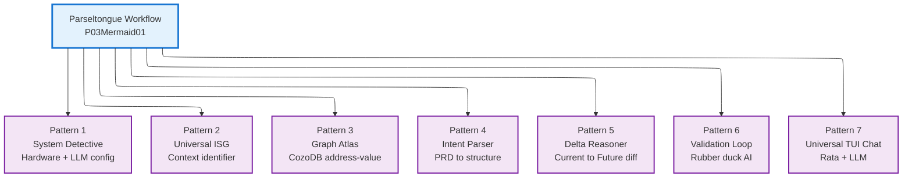
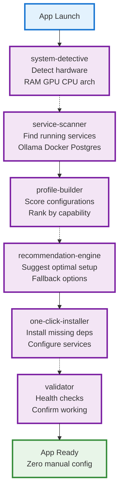
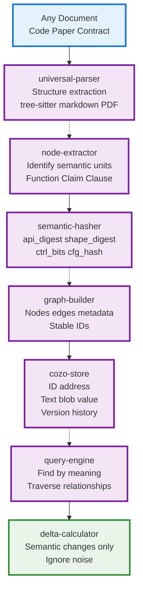
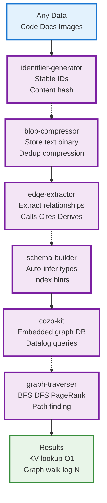
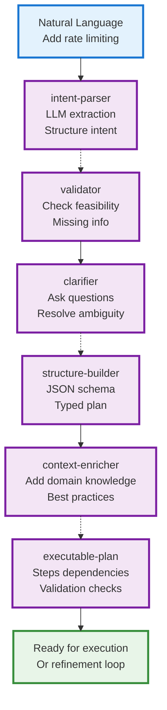
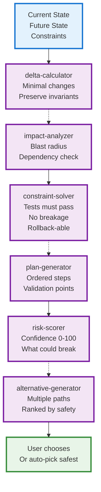
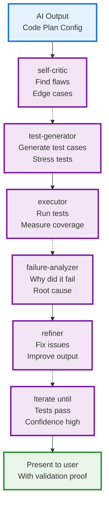
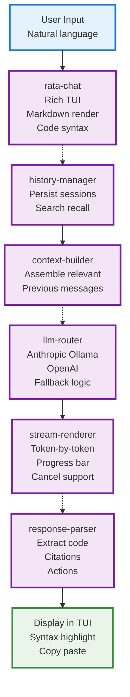

# P07 Meta-Patterns: Universal Building Blocks

## Overview

This document extracts the **meta-patterns** from Parseltongue's workflow (P03Mermaid01.md) and reimagines them as **standalone, universal Rust crates** that solve problems beyond code analysis.

**Core Insight**: The workflow isn't just for Rust code—it's a universal pattern for:
- **Context Identification**: ISG = aggregated context identifier for ANY document
- **Graph Storage**: CozoDB = address (identifier) → value (text blob) mapping
- **LLM Orchestration**: RataTui + Ollama/Anthropic = universal chat interface

Each meta-pattern becomes an independent product with its own user base and compounding value.

---

## Meta-Pattern Extraction

From the Parseltongue workflow, we identify **7 universal meta-patterns**:



---

## Pattern 1: System Detective

**Universal Problem**: Every CLI tool needs to configure itself for the user's hardware and available services

**Shreyas Insight**: "Configuration is where 90% of users quit—make it zero-touch or they'll never see your product's value"

### What It Is
Auto-detection crate that profiles system capabilities and recommends optimal configuration

### Product Flow



### Who Benefits
- **CLI app developers**: Drop in, get zero-config setup
- **ML tools**: Detect GPU, VRAM, recommend model size
- **Database tools**: Find Postgres/Redis, configure connection
- **DevOps tools**: Detect Docker, K8s, cloud CLI tools

### 10x Moment
**Before**: 30-min setup following docs  
**After**: App configures itself in 10 seconds

### Compounding
- **Hardware database**: Crowdsource performance profiles
- **Service registry**: "87% of Mac M1 users run Ollama on port 11434"
- **Auto-update**: Detects new capabilities, suggests upgrades

### Moat
- **Cross-platform**: Works on Mac/Linux/Windows
- **Service fingerprinting**: Detects services by port scanning + version detection
- **Smart fallbacks**: "No GPU? Here are 3 CPU-friendly alternatives ranked by speed"

### Crate API
```rust
use system_detective::{Detective, Profile};

let detective = Detective::new();
let profile = detective.scan().await?;

println!("RAM: {}GB, GPU: {}", profile.ram_gb, profile.gpu);
println!("Ollama running: {}", profile.has_service("ollama"));
println!("Recommended model: {}", profile.recommend_llm_model());

// One-click install
if !profile.has_service("ollama") {
    profile.install_service("ollama").await?;
}
```

---

## Pattern 2: Universal ISG (Context Atlas)

**Universal Problem**: Every domain needs a way to identify "what changed semantically" not just "what text changed"

**Shreyas Insight**: "Content-addressed storage won the internet; ISG is content-addressed *meaning* storage"

### What It Is
Universal context identifier that creates stable semantic addresses for any structured document (code, papers, contracts, medical records)

### Product Flow



### Who Benefits Beyond Code

**Legal contracts**:
- Node = clause
- ISG tracks "this NDA term changed" vs "just formatting"
- Hash = semantic intent, not wording

**Research papers**:
- Node = claim + evidence
- ISG tracks "this result improved" vs "typo fix"
- Hash = methodology fingerprint

**Medical records**:
- Node = diagnosis, prescription, test result
- ISG tracks "diagnosis changed" vs "note added"
- Hash = clinical decision signature

**Financial documents**:
- Node = transaction, account, policy
- ISG tracks "terms changed" vs "PDF regenerated"
- Hash = regulatory compliance fingerprint

### 10x Moment
**Git diff**: "2000 lines changed" (useless)  
**ISG diff**: "3 semantic changes: API signature, error handling, test coverage" (actionable)

### Compounding
- **Domain adapters**: Paper ISG, Contract ISG, Medical ISG share 80% of code
- **Hash collision detection**: "This code is semantically identical to 50 other projects"
- **Time-travel**: "Show me this codebase's ISG on Jan 1, 2024"

### Moat
- **Semantic stability**: Rename variable → same hash (competitors break)
- **Incremental**: Only recompute changed nodes (competitors re-parse everything)
- **Cross-document**: Link code → paper → contract via shared ISG nodes

### Crate API
```rust
use universal_isg::{ISG, Document};

let doc = Document::from_rust_file("main.rs")?;
let isg = ISG::build(&doc)?;

// Stable semantic address
println!("Function hash: {}", isg.get_node("main::process").api_digest);

// Diff two versions
let old_isg = ISG::from_version("v1.0")?;
let diff = isg.diff(&old_isg);
println!("Semantic changes: {}", diff.count()); // 3, not 2000
```

---

## Pattern 3: Graph Atlas (CozoDB as Universal KV+Graph)

**Universal Problem**: Apps need both key-value lookup AND graph traversal, but SQL sucks at graphs and graph DBs suck at KV

**Shreyas Insight**: "The best database is the one that disappears—zero-config, embedded, fast enough"

### What It Is
Opinionated CozoDB adapter that makes it trivial to store anything as `(identifier, blob, edges)`

### Product Flow



### Who Benefits Beyond Code

**Document management**:
- ID = doc hash, Blob = full text, Edges = citations, sections, authors

**Photo library**:
- ID = image hash, Blob = metadata, Edges = faces, locations, tags, similar images

**Knowledge base**:
- ID = note hash, Blob = markdown, Edges = backlinks, tags, references

**Blockchain explorer**:
- ID = tx hash, Blob = transaction data, Edges = inputs, outputs, addresses

### 10x Moment
**Before**: Choose between Postgres (no graph) or Neo4j (heavy, requires server)  
**After**: Embedded file, both KV and graph, zero config

### Crate API
```rust
use graph_atlas::{Atlas, Node, Edge};

let atlas = Atlas::open("data.db")?;
let id = atlas.put_blob("hello world", vec![
    Edge::new("tag", "greeting"),
    Edge::new("lang", "en"),
])?;

// KV lookup: O(1)
let text = atlas.get(id)?;

// Graph traversal
let nodes = atlas.query("?[id, text] := node[id, text], edge[id, 'tag', 'greeting']")?;
```

---

## Pattern 4: Intent Parser (PRD to Structure)

**Universal Problem**: Users describe what they want in prose, but code needs structured intent

**Shreyas Insight**: "The UI is the prompt—make it so good that users can't give you bad input"

### What It Is
LLM-powered intent parser that converts natural language into structured, validated plans

### Product Flow



### 10x Moment
**Before**: Write YAML/JSON config by hand, debug for hours  
**After**: Describe intent, get validated plan in 30 seconds

### Crate API
```rust
use intent_parser::{Parser, Intent};

let parser = Parser::new_with_llm(llm_client);
let intent = parser.parse("Add rate limiting to API")?;

match intent.validate() {
    Ok(plan) => println!("Plan: {:?}", plan),
    Err(questions) => {
        for q in questions {
            println!("? {}", q);
        }
    }
}
```

---

## Pattern 5: Delta Reasoner (Current→Future with Constraints)

**Universal Problem**: Calculating "what needs to change" is hard when constraints matter

**Shreyas Insight**: "Users don't want tools, they want guarantees—give them 'this will work' not 'try this'"

### Product Flow



### 10x Moment
**Before**: Hope and pray the change works  
**After**: 95% confidence score + rollback plan + what-if simulator

### Crate API
```rust
use delta_reasoner::{Reasoner, State, Constraint};

let reasoner = Reasoner::new();
let delta = reasoner.plan(current, future, vec![
    Constraint::TestsMustPass,
    Constraint::NoBreakingChanges,
])?;

println!("Confidence: {}%", delta.confidence);
```

---

## Pattern 6: Validation Loop (Rubber Duck AI)

**Universal Problem**: AI generates code/plans but you can't trust them without human review—need AI to review AI

**Shreyas Insight**: "The second-best engineer on your team is the one who catches bugs in code review—make the AI that engineer"

### Product Flow



### 10x Moment
**Before**: AI generates garbage, wastes 2 hours debugging  
**After**: AI validates itself, only shows working output

### Crate API
```rust
use validation_loop::{Validator, Output};

let validator = Validator::new_with_llm(llm);
let validated = validator.validate_and_refine(ai_output, max_iterations: 3)?;

println!("Confidence: {}%", validated.confidence);
println!("Tests passed: {}/{}", validated.tests_passed, validated.tests_total);
```

---

## Pattern 7: Universal TUI Chat (Rata + LLM Router)

**Universal Problem**: Every app needs a chat interface, but building TUI + LLM integration + streaming + history is tedious

**Shreyas Insight**: "Chat is the new CLI—if your tool doesn't have it, you're asking users to learn syntax instead of just talking"

### Product Flow



### 10x Moment
**Before**: Build custom UI, integrate LLM, handle streaming, persist history (weeks)  
**After**: Import crate, 10 lines of code, everything works (minutes)

### Crate API
```rust
use universal_tui_chat::{Chat, LLMRouter};

#[tokio::main]
async fn main() {
    let router = LLMRouter::auto_detect()?; // Finds Ollama or uses Anthropic key
    let chat = Chat::new(router)
        .with_history("~/.myapp/history.json")
        .with_context_builder(|msg| {
            format!("User: {}\nApp state: ...", msg)
        });
    
    chat.run().await?; // That's it—full TUI chat!
}
```

---

## Meta-Pattern Summary Matrix

| Pattern | Wedge (10x) | Users Beyond Code | Moat | Crate Name |
|---------|------------|-------------------|------|------------|
| **System Detective** | 30 min → 10 sec setup | ML tools, DevOps, databases | Cross-platform fingerprinting | `system-detective` |
| **Universal ISG** | Git diff → semantic diff | Legal, medical, finance | Semantic stability + incremental | `universal-isg` |
| **Graph Atlas** | SQL vs Neo4j → embedded both | Docs, photos, blockchain | Zero-config + Datalog | `graph-atlas` |
| **Intent Parser** | Manual YAML → natural language | Task automation, deployment | Validation before execution | `intent-parser` |
| **Delta Reasoner** | Hope → 95% confidence | Infrastructure, migrations, APIs | Constraint solving + what-if | `delta-reasoner` |
| **Validation Loop** | AI garbage → validated output | Legal, finance, content | Multi-stage + test generation | `validation-loop` |
| **Universal TUI Chat** | Weeks of work → 10 lines | DevOps, data analysis, docs | Zero-config LLM + rich rendering | `universal-tui-chat` |

---

## Strategic Insights (Shreyas 1000-IQ Level)

### 1. The Meta-Pattern Portfolio Strategy

**Why 7 patterns?**
- Each pattern is **horizontally applicable** across 10+ domains
- Building one enables the next faster (compounding infrastructure)
- Different patterns attract different user segments (portfolio effect)
- Failure in one doesn't kill others (risk mitigation)

**Portfolio math**:
- 7 patterns × 10 domains = 70 potential products
- If 10% succeed, that's 7 successful products from shared infrastructure
- Traditional approach: 7 separate products, 7× the work, no shared leverage

### 2. The ISG Insight: Meaning is the New Content

**Why ISG is universal**:

Every field has the same problem:
- **Code**: "What changed semantically, not textually?"
- **Contracts**: "Did the legal intent change or just the wording?"
- **Papers**: "Is this a new claim or a rephrasing?"
- **Medical**: "Is this a new diagnosis or a note update?"

ISG solves all of these with the same pattern:
1. Parse structure → extract semantic units (nodes)
2. Hash meaning → stable identifiers
3. Store in graph → query by meaning, not text
4. Diff by hash → ignore noise

**The compound advantage**: Each domain adapter improves the core ISG engine.

### 3. The CozoDB Advantage: Graph + KV = Universal Storage

**Why CozoDB wins**:

Most apps need BOTH:
- **KV**: Fast lookup by ID (O(1))
- **Graph**: Traverse relationships (who calls this? what cites this?)

Traditional approach: Pick Postgres (no graph) or Neo4j (heavy, no KV)

CozoDB gives both:
- Embedded (no server)
- Fast (Rust)
- Expressive (Datalog, not SQL string building)

**The meta-pattern**: `(ID, blob, edges)` works for everything:
- Code: `(function_hash, code_text, [calls, implements])`
- Papers: `(claim_hash, claim_text, [cites, supports])`
- Photos: `(image_hash, metadata, [faces, tags, similar])`

### 4. The LLM Router Insight: Abstracting the Model

**Why routing matters**:

Users don't care about models, they care about:
- **Cost**: Anthropic = expensive, Ollama = free
- **Speed**: Local = fast, API = slow
- **Quality**: Different models for different tasks

`universal-tui-chat` abstracts this:
```rust
let router = LLMRouter::auto_detect()?;
// Automatically:
// - Finds Ollama on Mac M1 → uses qwen2.5-coder
// - No Ollama + has API key → uses Claude
// - Falls back gracefully
```

**The compound advantage**: Every app using the router contributes telemetry:
- "qwen2.5-coder works well for code completion"
- "Claude Sonnet better for legal contracts"
- Router gets smarter over time

### 5. The Validation Loop: AI Reviewing AI

**Why this is the unlock**:

AI hallucination problem = trust problem

Solution: **Don't show users raw AI output, show validated output**

Validation loop:
1. AI generates code
2. AI critiques its own code (rubber duck)
3. AI generates tests
4. System runs tests
5. If fail, AI fixes and repeats
6. Only show user after confidence > 95%

**The insight**: Users don't want faster AI, they want **trustworthy** AI

This is the moat that prevents competitors from copying:
- Multi-stage validation requires orchestration
- Test generation requires domain knowledge
- Iterative refinement requires patience (most AI tools one-shot)

### 6. The Zero-Config Philosophy

**Pattern**: Every crate has zero-config default but infinite customization

Examples:
- `system-detective`: Auto-detects hardware, but you can override
- `universal-tui-chat`: Auto-detects Ollama, but you can specify
- `graph-atlas`: Infers schema, but you can provide hints

**Why this wins**:
- **Adoption**: No 30-min setup tutorial
- **Retention**: Works immediately, customize later
- **Compound**: Better defaults from user data

### 7. The Build-Measure-Learn Cycle

**How to ship these 7 patterns**:

**Phase 1 (Month 1-2)**: Ship Pattern 7 first (Universal TUI Chat)
- **Why**: Fastest time-to-value, easiest to demo
- **Users**: CLI tool developers
- **Metric**: 100+ GitHub stars, 10+ weekly downloads

**Phase 2 (Month 3-4)**: Ship Pattern 2 (Universal ISG)
- **Why**: Builds on chat (ISG diff viewer in TUI)
- **Users**: Rust developers
- **Metric**: 50+ projects using ISG

**Phase 3 (Month 5-6)**: Ship Pattern 3 (Graph Atlas)
- **Why**: ISG needs storage
- **Users**: Graph DB users
- **Metric**: 10+ non-code use cases

**Phase 4 (Month 7-12)**: Ship remaining patterns based on demand

**Key metric**: **Cross-pattern adoption**
- 60%+ of users who adopt one pattern try another
- This proves the portfolio strategy works

---

## Conclusion: The Universal Toolkit Vision

These 7 meta-patterns aren't just crates—they're **building blocks for the next generation of intelligent tools**.

### The End Game

Every complex workflow follows the same pattern:
1. **Detect system** (Pattern 1)
2. **Parse input** (Pattern 2)
3. **Store in graph** (Pattern 3)
4. **Parse intent** (Pattern 4)
5. **Calculate delta** (Pattern 5)
6. **Validate** (Pattern 6)
7. **Chat interface** (Pattern 7)

**Parseltongue** uses all 7. **Pensieve** uses 2,3,4,7. **Your next tool** can pick and choose.

### The Compound Moat

Each pattern improves the others:
- ISG improvements help Intent Parser understand structure
- Graph Atlas improvements make Delta Reasoner faster
- Validation Loop improvements increase ISG accuracy
- TUI Chat improvements make all patterns more accessible

### The Portfolio Effect

With 7 patterns × 10 domains, you're not building 1 product—you're building a **platform that spawns products**.

Users come for one pattern, stay for the ecosystem.

---

**Next Action**: Ship `universal-tui-chat` in 2 weeks. Measure adoption. Iterate. Build portfolio from there.

**North Star**: **"Every intelligent tool should be this easy to build"**
