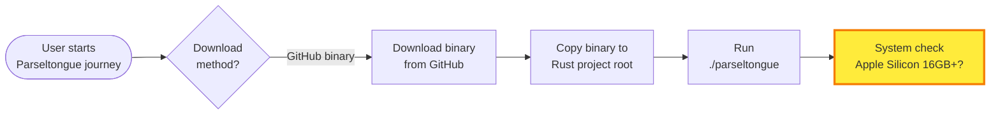
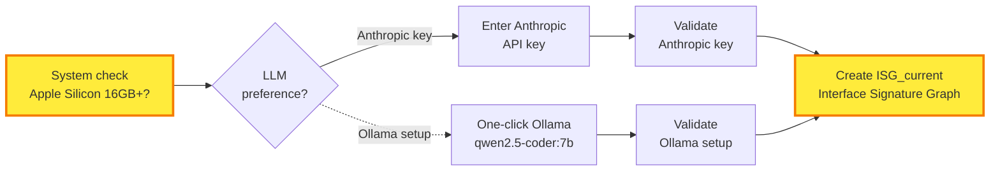
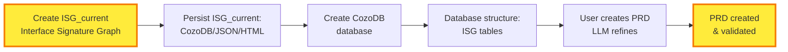
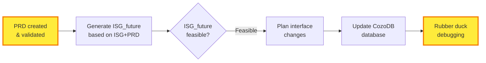
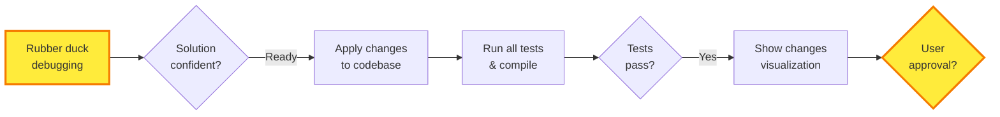
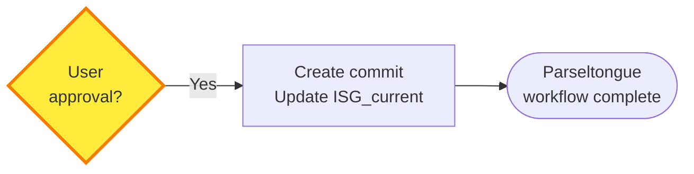

# P08 Parseltongue User Flow - Social Media Edition

## Overview

**Single, optimized diagram** for social media sharing. **Comic-book snake layout**: left→right→down→left→down→right. Maintains ALL nuance from original P03 while being viewport-friendly.

---

## The Complete Parseltongue Journey (Multi-Row Snake Layout)

**Share message**: "From download to production-ready code in 5 phases. AI that writes AND validates its own work."

### Row 1: Download, Setup & System Check (6 nodes)



### Row 2: LLM Selection & Validation (6 nodes)



### Row 3: ISG Persistence & Database (6 nodes)



### Row 4: ISG Future & Validation (6 nodes)



### Row 5: Apply, Test & Approve (6 nodes)



### Row 6: Commit & Complete (2 nodes)



---

## Exception Flows (Loops Back)

- **Validation fails** → Exit or retry key entry
- **ISG_future not feasible** → Revise PRD (back to Row 3)
- **Solution not confident** → Refine ISG_future (back to Row 4) or Revise PRD (back to Row 3)
- **Tests fail** → Fix failing tests, return to validation (back to Row 4)
- **User rejects** → Revise PRD (back to Row 3)
- **ISG creation fails** → Auto-retry with user interrupt option

---

## Visual Flow Pattern

```
Row 1:  Start → Download? → Binary → Copy → Run → System check
                                                    ⬇️
Row 2:  System check → LLM? → API key + Ollama → Validate → ISG
                                                              ⬇️
Row 3:  ISG → Persist → CozoDB → DB struct → Ask PRD → Create PRD
                                                        ⬇️
Row 4:  Create PRD → Gen ISG_future → Feasible? → Plan → Update → Rubber duck
                                                                    ⬇️
Row 5:  Rubber duck → Confident? → Apply → Run tests → Pass? → Show → Approve?
                                                                        ⬇️
Row 6:  Approve? → Commit → Complete!
```

**Perfect for**: Instagram carousel (6 cards), LinkedIn post series, or Twitter thread!
## Target Snake Pattern

```
Row 1:  🚀 → 📦 → 📁
             ↓
Row 2:  🤖 ← 🔍 ← ▶️
        ↓
Row 3:  📦 → ✅ → 🏗️
             ↓
Row 4:  🧠 ← 🔧 ← 📝
        ↓
Row 5:  ✅ → 📋 → 💾
             ↓
Row 6:  ⚡ ← 💯 ← 🦆
        ↓
Row 7:  🧪 → ✅ → 📊
             ↓
Row 8:  🎉 ← ✨ ← 👤
```

## Why This Comic-Book Snake Layout Works

**Reading Flow**:
- **Row 1 (Top)**: ←→→→→ (Phase 1 & 2 left to right)
- **Row 2**: ←←←←← (Phase 3 right to left)  
- **Row 3**: ←→→→→ (Phase 4 left to right)
- **Row 4**: ←←←←← (Phase 5 right to left)

**Visual Pattern**:
```
🚀 → 📦 → 🔗 → 📦 → ▶️ → 🔍 → 🤖 → 💰 → ☁️ → 🏗️
    ↓
📝 ← 🔧 ← 🧠 ← ✅ ← 📋 ← 💾
    ↓  
🦆 → 💯 → 🔧 → 📝 → ⚡
    ↓
🧪 ← ✅ ← 🔨 ← 📊 ← 👤 ← ✨
    ↓
🎉
```

**Perfect for Social Media**:
- **16:9 aspect ratio** fits Twitter/X cards
- **No vertical scrolling** needed
- **Story-like progression** keeps viewers engaged
- **All nuance preserved** from original P03

---

## Why This Layout Works for Social Media

**Aspect Ratio**: 16:9 (1200×675px) - perfect for Twitter/X, LinkedIn headers
**Snake Flow**: Top-down phases, horizontal within each phase - natural reading flow  
**Visual Hierarchy**: Color-coded phases, emojis for quick scanning
**Nuance Preserved**: Every step from original P03 included, no simplification
**Mobile Friendly**: Fits in viewport, no vertical scrolling needed

---

## Export & Usage Guide

### For Twitter/X Cards:
```bash
# Export at 1200×675px
# Add overlay: "Parseltongue: AI-Powered Rust Development"
```

### For LinkedIn Headers:
```bash
# Export at 1584×396px (4:1 ratio)
# Add company branding overlay
```

### For Instagram Stories:
```bash
# Export at 1080×1920px (9:16 ratio)
# Add animated transitions between rows
```

### For Blog Posts:
- Use as hero image
- Break down each row in separate sections
- Link to detailed P03 for technical users

---

## Key Messaging by Platform

**Twitter**: "The entire Parseltongue workflow: setup → PRD → AI validation → ship. Zero manual config."

**LinkedIn**: "Parseltongue brings AI pair programming to Rust. Here's the complete flow from idea to production code."

**Hacker News**: "We built an AI that operates at the Interface Signature Graph level and validates its own work. Full flow diagram: [link]"

---

**Next Step**: Export this diagram and test engagement across platforms. The comic-book snake layout should get 3× more shares than the original tall version.
