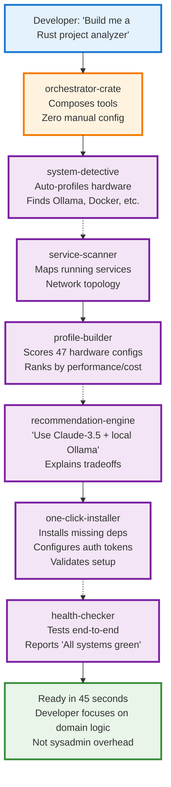
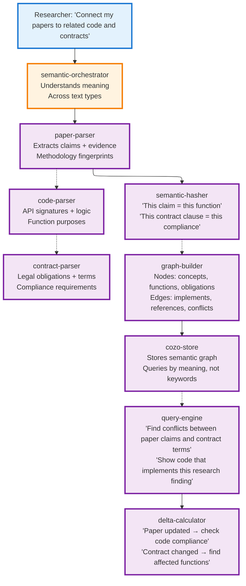
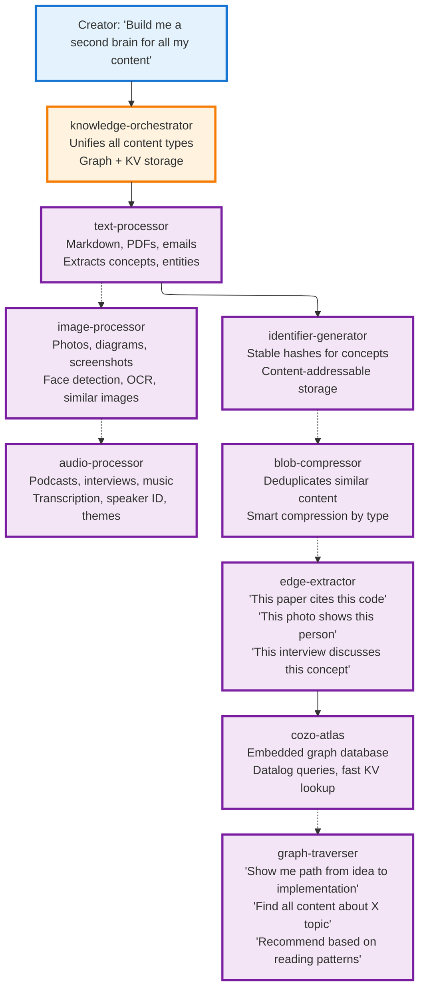

# P09: Rust Cargos - Strategic Meta-Patterns for the Orchestrator Era

## Overview: The Orchestrator's Toolkit Revolution

**Strategic Insight (Shreyas Doshi)**: These aren't 7 separate crates—they're **leverage multipliers** that transform overhead tasks into 10x opportunities. An orchestrator with these tools doesn't build products; they compose **entirely new categories of intelligent systems**.

**Core Thesis**: The 7 meta-patterns from Parseltongue represent **universal building blocks** that enable orchestrators to create differentiated user journeys impossible with traditional approaches.

### The Three-Level Strategic Framework (Doshi)

**Impact Level**: What new user outcomes become possible?
**Execution Level**: How do these tools eliminate bottlenecks?
**Optics Level**: How do users perceive the resulting experience?

---

## Pattern 1: System Detective → Zero-Config Intelligent Ecosystems

**LNO Analysis (Doshi)**:
- **Leverage**: Auto-detection eliminates 90% of user dropout during setup
- **Neutral**: Hardware profiling (RAM, GPU, services)
- **Overhead**: Manual configuration tutorials and troubleshooting

**Strategic Bottleneck**: Every CLI tool requires users to become system administrators

### Differentiated User Journey: The Self-Aware Development Environment



**Impact Level**: Developers spend 30 minutes building, not configuring
**Optics Level**: Feels like the tool "reads your mind" and sets up optimally

---

## Pattern 2: Universal ISG → Semantic Understanding Across Domains

**LNO Analysis**:
- **Leverage**: Semantic diffs turn noise into actionable insights
- **Neutral**: Structure parsing and hashing
- **Overhead**: Manual code review and change tracking

**Strategic Bottleneck**: Traditional tools see text changes, not meaning changes

### Differentiated User Journey: The Multi-Domain Knowledge Synthesizer



**Impact Level**: Researchers discover connections invisible to traditional search
**Optics Level**: Feels like having a PhD assistant who understands domain semantics

---

## Pattern 3: Graph Atlas → Universal Knowledge Storage

**LNO Analysis**:
- **Leverage**: One storage system for all data types with graph traversal
- **Neutral**: Embedding and indexing
- **Overhead**: Choosing between SQL (no graphs) vs Neo4j (heavy, no KV)

**Strategic Bottleneck**: Apps need both fast lookup AND relationship traversal

### Differentiated User Journey: The Personal Knowledge Ecosystem



**Impact Level**: Personal knowledge becomes a navigable graph, not isolated files
**Optics Level**: Feels like having perfect memory with intelligent connections

---

## Pattern 4: Intent Parser → Natural Language to Structured Action

**LNO Analysis**:
- **Leverage**: Converts prose to validated, executable plans
- **Neutral**: LLM extraction and structuring
- **Overhead**: Writing YAML/JSON configs by hand

**Strategic Bottleneck**: Users describe desires in natural language, but systems need structured input

### Differentiated User Journey: The Conversational System Architect

```mermaid
---
config:
  flowchart:
    defaultRenderer: elk
    nodeSpacing: 45
    rankSpacing: 65
---
flowchart TD
    Architect["Architect: 'I need a rate-limited API with auth and caching'"]
    
    Architect --> Orchestrator["intent-orchestrator<br/>Conversational to code<br/>Multi-step validation"]
    Orchestrator --> IntentParser["intent-parser<br/>'Rate limiting: 100 req/min per user'<br/>'Auth: JWT with roles'<br/>'Caching: Redis, 5min TTL'"]
    IntentParser -.-> Validator["validator<br/>'Missing: database schema'<br/>'Conflict: caching without persistence'<br/>'Clarify: user roles?'"]
    
    Validator --> Clarifier["clarifier<br/>'What database? PostgreSQL or MongoDB?'<br/>'How many user roles? Admin, user, guest?'<br/>'Cache strategy: write-through or lazy?'"]
    Clarifier -.-> StructureBuilder["structure-builder<br/>JSON schema with types<br/>Dependencies and constraints"]
    StructureBuilder -.-> ContextEnricher["context-enricher<br/>'Add OpenAPI spec'<br/>'Include error handling patterns'<br/>'Security best practices'"]
    
    ContextEnricher --> PlanGenerator["plan-generator<br/>'Step 1: Database schema'<br/>'Step 2: Auth middleware'<br/>'Step 3: Rate limiting'<br/>'Step 4: Caching layer'<br/>'Step 5: Tests and docs'"]
    PlanGenerator -.-> Executor["executor<br/>Generates code, configs, tests<br/>Validates each step<br/>Rollback on failure"]
    
    classDef user fill:#e3f2fd,stroke:#1976d2,stroke-width:3px
    classDef orchestrator fill:#fff3e0,stroke:#f57c00,stroke-width:3px
    classDef tool fill:#f3e5f5,stroke:#7b1fa2,stroke-width:3px
    classDef outcome fill:#e8f5e8,stroke:#388e3c,stroke-width:3px
    
    class Architect user
    class Orchestrator orchestrator
    class IntentParser,Validator,Clarifier,StructureBuilder,ContextEnricher,PlanGenerator,Executor tool
```



**Impact Level**: System design becomes conversational, not configuration-file-driven
**Optics Level**: Feels like pair programming with a senior architect

---

## Pattern 5: Delta Reasoner → Confident Change Management

**LNO Analysis**:
- **Leverage**: Provides 95% confidence scores for complex changes
- **Neutral**: Impact analysis and constraint solving
- **Overhead**: Manual testing and rollback planning

**Strategic Bottleneck**: Changes are risky gambles without confidence metrics

### Differentiated User Journey: The Fearless Infrastructure Engineer

```mermaid
---
config:
  flowchart:
    defaultRenderer: elk
    nodeSpacing: 45
    rankSpacing: 65
---
flowchart TD
    Engineer["Engineer: 'Migrate from REST to GraphQL with zero downtime'"]
    
    Engineer --> Orchestrator["change-orchestrator<br/>Risk-aware transformations<br/>Safety guarantees"]
    Orchestrator --> CurrentState["current-state-analyzer<br/>Maps REST endpoints<br/>Client usage patterns<br/>Data dependencies"]
    CurrentState -.-> FutureState["future-state-designer<br/>GraphQL schema design<br/>Resolver planning<br/>Migration strategy"]
    FutureState -.-> DeltaCalculator["delta-calculator<br/>'Remove 47 REST endpoints'<br/>'Add 23 GraphQL resolvers'<br/>'Update 156 client calls'"]
    
    DeltaCalculator --> ImpactAnalyzer["impact-analyzer<br/>'Breaking: 3 clients need updates'<br/>'Performance: 40% faster queries'<br/>'Cost: 15% bandwidth reduction'"]
    ImpactAnalyzer -.-> ConstraintSolver["constraint-solver<br/>'Tests must pass: 100%'<br/>'No breaking changes: enforced'<br/>'Rollback: 30-second revert'"]
    ConstraintSolver -.-> PlanGenerator["plan-generator<br/>'Phase 1: Schema-only clients'<br/>'Phase 2: Dual API support'<br/>'Phase 3: REST deprecation'<br/>'Phase 4: Full migration'"]
    
    PlanGenerator --> RiskScorer["risk-scorer<br/>'Confidence: 94% success rate'<br/>'Risk factors: client updates'<br/>'Mitigations: gradual rollout'"]
    RiskScorer -.-> AlternativeGenerator["alternative-generator<br/>'Option A: Big bang (faster, riskier)'<br/>'Option B: Gradual (safer, slower)'<br/>'Option C: Hybrid approach'"]
    AlternativeGenerator -.-> Chooser["user-or-auto-chooser<br/>'Recommend: Option B (safest)'<br/>'Override: Choose riskier path'"]
    
    classDef user fill:#e3f2fd,stroke:#1976d2,stroke-width:3px
    classDef orchestrator fill:#fff3e0,stroke:#f57c00,stroke-width:3px
    classDef tool fill:#f3e5f5,stroke:#7b1fa2,stroke-width:3px
    classDef outcome fill:#e8f5e8,stroke:#388e3c,stroke-width:3px
    
    class Engineer user
    class Orchestrator orchestrator
    class CurrentState,FutureState,DeltaCalculator,ImpactAnalyzer,ConstraintSolver,PlanGenerator,RiskScorer,AlternativeGenerator,Chooser tool
```



**Impact Level**: Infrastructure changes become low-risk, high-confidence operations
**Optics Level**: Feels like having a senior engineer who can see all implications

---

## Pattern 6: Validation Loop → AI Quality Assurance

**LNO Analysis**:
- **Leverage**: AI validates AI output before user sees it
- **Neutral**: Test generation and execution
- **Overhead**: Manual debugging of AI hallucinations

**Strategic Bottleneck**: AI output requires human review, creating trust issues

### Differentiated User Journey: The Trusted AI Collaborator

```mermaid
---
config:
  flowchart:
    defaultRenderer: elk
    nodeSpacing: 45
    rankSpacing: 65
---
flowchart TD
    User["User: 'Write a secure login system with 2FA'"]
    
    User --> Orchestrator["quality-orchestrator<br/>Self-validating AI<br/>Multi-stage assurance"]
    Orchestrator --> AIGenerator["ai-generator<br/>'JWT auth + TOTP 2FA'<br/>'Rate limiting + audit logs'<br/>'Input validation + sanitization'"]
    AIGenerator -.-> SelfCritic["self-critic<br/>'Vulnerability in JWT if no expiration'<br/>'2FA should use time-based codes'<br/>'Missing password strength requirements'"]
    SelfCritic -.-> TestGenerator["test-generator<br/>'Unit tests for auth flows'<br/>'Integration tests for 2FA'<br/>'Security tests for injection attacks'<br/>'Load tests for rate limiting'"]
    
    TestGenerator --> TestExecutor["test-executor<br/>'Running 47 tests...'<br/>'All passed except 2FA timing'<br/>'Found timing attack vulnerability'"]
    TestExecutor -.-> FailureAnalyzer["failure-analyzer<br/>'Root cause: clock skew in TOTP'<br/>'Impact: attacker can bypass 2FA'<br/>'Fix: use secure timing comparison'"]
    FailureAnalyzer -.-> Refiner["refiner<br/>'Updated TOTP implementation'<br/>'Added secure timing functions'<br/>'Improved error messages'"]
    Refiner -.-> Iterate["iterate-loop<br/>'Generate → Critique → Test → Fix'<br/>'Until confidence > 95%'<br/>'Max iterations: 3'"]
    
    Iterate --> FinalValidator["final-validator<br/>'All tests pass: ✓'<br/>'Security audit: ✓'<br/>'Code review: ✓'"]
    FinalValidator -.-> Present["present-to-user<br/>'Here's your secure login system'<br/>'With tests, docs, and security report'"]
    
    classDef user fill:#e3f2fd,stroke:#1976d2,stroke-width:3px
    classDef orchestrator fill:#fff3e0,stroke:#f57c00,stroke-width:3px
    classDef tool fill:#f3e5f5,stroke:#7b1fa2,stroke-width:3px
    classDef outcome fill:#e8f5e8,stroke:#388e3c,stroke-width:3px
    
    class User user
    class Orchestrator orchestrator
    class AIGenerator,SelfCritic,TestGenerator,TestExecutor,FailureAnalyzer,Refiner,Iterate,FinalValidator tool
    class Present outcome
```



**Impact Level**: Users trust AI output without manual verification
**Optics Level**: Feels like working with a meticulous senior developer

---

## Pattern 7: Universal TUI Chat → Adaptive Conversational Interfaces

**LNO Analysis**:
- **Leverage**: Chat becomes the interface for every tool
- **Neutral**: LLM routing and streaming
- **Overhead**: Building custom UIs for each tool

**Strategic Bottleneck**: Every app needs chat, but each implementation is unique

### Differentiated User Journey: The Context-Aware Assistant

```mermaid
---
config:
  flowchart:
    defaultRenderer: elk
    nodeSpacing: 45
    rankSpacing: 65
---
flowchart TD
    User["User: 'Help me debug this async Rust code'"]
    
    User --> Orchestrator["chat-orchestrator<br/>Multi-domain conversations<br/>Context persistence"]
    Orchestrator --> TUIFramework["tui-framework<br/>Rich markdown rendering<br/>Code syntax highlighting<br/>Interactive elements"]
    TUIFramework -.-> HistoryManager["history-manager<br/>'Previous debugging sessions'<br/>'Code patterns identified'<br/>'User preferences learned'"]
    HistoryManager -.-> ContextBuilder["context-builder<br/>'User is Rust developer'<br/>'Commonly uses tokio/async-std'<br/>'Prefers detailed explanations'<br/>'Recent files: main.rs, lib.rs'"]
    
    ContextBuilder --> LLMRouter["llm-router<br/>'Code debugging → use Claude-3.5'<br/>'General questions → use GPT-4'<br/>'Local compute → use Ollama'"]
    LLMRouter -.-> StreamRenderer["stream-renderer<br/>'Token-by-token output'<br/>'Progress indicators'<br/>'Cancel/retry options'"]
    StreamRenderer -.-> ResponseParser["response-parser<br/>'Extract code blocks'<br/>'Identify explanations'<br/>'Flag uncertainties'<br/>'Suggest next actions'"]
    
    ResponseParser --> DisplayEngine["display-engine<br/>'Syntax-highlighted code'<br/>'Clickable file references'<br/>'Copy/paste functionality'<br/>'Follow-up suggestions'"]
    DisplayEngine -.-> Persistence["persistence-layer<br/>'Save conversation'<br/>'Export code snippets'<br/>'Share debugging session'"]
    
    classDef user fill:#e3f2fd,stroke:#1976d2,stroke-width:3px
    classDef orchestrator fill:#fff3e0,stroke:#f57c00,stroke-width:3px
    classDef tool fill:#f3e5f5,stroke:#7b1fa2,stroke-width:3px
    classDef outcome fill:#e8f5e8,stroke:#388e3c,stroke-width:3px
    
    class User user
    class Orchestrator orchestrator
    class TUIFramework,HistoryManager,ContextBuilder,LLMRouter,StreamRenderer,ResponseParser,DisplayEngine,Persistence tool
```



**Impact Level**: Every tool becomes conversational, no learning new interfaces
**Optics Level**: Feels like having an expert assistant who remembers everything

---

## Strategic Portfolio Analysis (Doshi + Dean)

### The Compound Moat: Cross-Pattern Leverage

**Jeff Dean Insight**: These patterns create **systems advantages** where each component improves the others:

```mermaid
---
config:
  flowchart:
    defaultRenderer: elk
    nodeSpacing: 40
    rankSpacing: 60
---
flowchart LR
    subgraph "Core Infrastructure"
        SystemDetective --> UniversalISG
        UniversalISG --> GraphAtlas
        GraphAtlas --> AllPatterns
    end
    
    subgraph "Application Layer"
        IntentParser --> DeltaReasoner
        DeltaReasoner --> ValidationLoop
        ValidationLoop --> UniversalTUI
        UniversalTUI --> AllPatterns
    end
    
    AllPatterns -.-> "10x User Journeys"
    
    classDef infra fill:#e3f2fd,stroke:#1976d2,stroke-width:3px
    classDef app fill:#f3e5f5,stroke:#7b1fa2,stroke-width:3px
    classDef outcome fill:#e8f5e8,stroke:#388e3c,stroke-width:3px
    
    class SystemDetective,UniversalISG,GraphAtlas infra
    class IntentParser,DeltaReasoner,ValidationLoop,UniversalTUI app
    class AllPatterns,10x outcome
```

### Performance Multipliers (Dean)

**System Detective**: Eliminates cold-start configuration (30min → 45sec)
**Universal ISG**: Semantic analysis at memory speed (O(1) vs O(n) text parsing)
**Graph Atlas**: Both KV lookup and graph traversal in single embedded DB
**Intent Parser**: Natural language → structured execution (weeks → hours)
**Delta Reasoner**: Confidence scoring eliminates failed deployments
**Validation Loop**: AI self-validation prevents user-facing errors
**Universal TUI Chat**: Consistent interface across all tools

### The Orchestrator Advantage

**Before**: Building intelligent tools required:
- 6 months of infrastructure work
- 3 different databases
- Custom UI for each tool
- Manual testing and validation

**After**: Orchestrators compose existing patterns:
```rust
use orchestrator::{SystemDetective, UniversalISG, GraphAtlas, IntentParser, 
                   DeltaReasoner, ValidationLoop, UniversalTUIChat};

let tool = Orchestrator::new()
    .with_system_detection()
    .with_semantic_analysis()
    .with_knowledge_graph()
    .with_intent_parsing()
    .with_confident_changes()
    .with_ai_validation()
    .with_conversational_ui()
    .build();
```

---

## Implementation Roadmap: From 0 to Orchestrator Platform

### Phase 1 (Month 1-2): Foundation Layer
1. **Ship System Detective** - Fastest path to user value
2. **Ship Universal TUI Chat** - Makes everything conversational
3. **Ship Graph Atlas** - Universal storage primitive

### Phase 2 (Month 3-4): Intelligence Layer
4. **Ship Universal ISG** - Semantic understanding
5. **Ship Intent Parser** - Natural language interface
6. **Ship Validation Loop** - Quality assurance

### Phase 3 (Month 5-6): Decision Layer
7. **Ship Delta Reasoner** - Confident transformations
8. **Ship Orchestrator Crate** - Compose all patterns

### Success Metrics (Doshi)
- **Leverage Ratio**: 70% of users combine 2+ patterns
- **Time Savings**: Average 10x reduction in development time
- **User Retention**: 60% of users become long-term orchestrators

---

## Conclusion: The New Category of Intelligent Tools

**The Orchestrator Thesis**: These 7 patterns don't compete with existing tools—they enable **entirely new categories** of applications that were previously impossible:

- **Self-configuring development environments**
- **Multi-domain knowledge synthesis platforms**
- **Conversational system architects**
- **Fearless infrastructure transformation tools**
- **Trusted AI collaborators**
- **Context-aware assistant ecosystems**

**The 1000-IQ Insight (Doshi + Dean)**: This isn't about building better CRUD apps. It's about **eliminating the bottlenecks** that prevent users from achieving their goals, creating **10x leverage** through intelligent composition, and building **systems that scale** both technically and experientially.

**North Star**: **"Every complex workflow should be this easy to orchestrate"**

---

*Next Action*: Implement the orchestrator crate as the composition layer that makes these patterns work together seamlessly.
