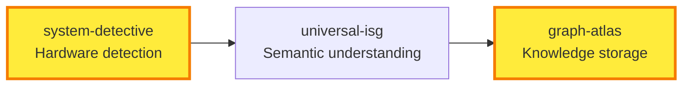
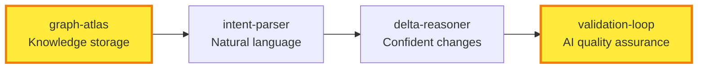
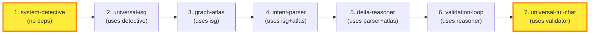

# P09: Rust Cargos - Component Architecture & Strategic Rationale

## Overview

This document provides strategic context for the **7 core components** defined in `build-manifest.json`. The components form a modular architecture that enables **intelligent software development workflows**.

**Core Philosophy**: Build modular, composable crates that can be mixed and matched. Use `build-manifest.json` as the source of truth for component definitions and build processes.

---

## Component Architecture

### 7 Core Components (Defined in build-manifest.json)

| Component | Purpose | Key Variants |
|-----------|---------|--------------|
| **system-detective** | Hardware & service auto-detection | `basic`, `full`, `minimal` |
| **universal-isg** | Semantic interface understanding | `rust-only`, `tree-sitter`, `hybrid`, `incremental` |
| **graph-atlas** | Graph + KV storage layer | `cozodb-only`, `with-caching`, `with-indexing` |
| **intent-parser** | Natural language to structured intent | `anthropic-only`, `ollama-first`, `multi-provider` |
| **delta-reasoner** | Confident change calculation | `conservative`, `aggressive`, `adaptive` |
| **validation-loop** | AI self-validation & testing | `single-iteration`, `multi-iteration`, `parallel` |
| **universal-tui-chat** | Conversational interfaces | `basic`, `rich`, `intelligent` |

### Build Order & Dependencies

```json
{
  "buildOrder": [
    "system-detective",      // No dependencies - foundation
    "universal-isg",         // Uses system-detective
    "graph-atlas",          // Uses universal-isg
    "intent-parser",        // Uses isg + atlas
    "delta-reasoner",       // Uses parser + atlas
    "validation-loop",      // Uses delta-reasoner
    "universal-tui-chat"    // Uses validation-loop
  ]
}
```

---

## Strategic Rationale

### Why This Architecture Works

**Modularity Principle**: Each component has a single responsibility and clear interfaces. Components can be developed, tested, and deployed independently.

**Composition Over Monoliths**: Instead of one large binary, we have 7 focused crates that can be composed into different tools.

**Easy Experimentation**: The JSON-driven build system enables rapid iteration:

```bash
# Try different ISG approaches
python build.py list-variants universal-isg
# Modify build-manifest.json variants
# Rebuild: python build.py build universal-isg
```

### Component Interactions (Multi-Row Snake Layout)

**Share message**: "7 modular Rust components compose into intelligent development tools. Foundation → Intelligence layers."

#### Row 1: Foundation Layer Setup (3 nodes)



#### Row 2: Intelligence Layer Processing (4 nodes)



#### Row 3: Interface Layer & Completion (3 nodes)


#### Row 4: Build Order Dependencies (7 nodes)



---

## Visual Flow Pattern

```
Row 1:  SD → ISG → GA
             ↓
Row 2:  GA → IP → DR → VL
             ↓
Row 3:  VL → TUI → Complete
             ↓
Row 4:  1 → 2 → 3 → 4 → 5 → 6 → 7
```

**Perfect for**: Component architecture visualization, showing both logical layers and build dependencies in a compact, social-media-friendly format.

---

## Usage Patterns

### Building Components

```bash
# Build everything
python build.py build

# Build specific component with dependencies
python build.py build universal-isg

# Build from specific point in chain
python build.py build intent-parser  # Builds isg + atlas + parser
```

### Quality Assurance

```bash
# Run all quality checks
python build.py quality-check

# Individual checks (defined in build-manifest.json)
cargo clippy -- -D warnings    # Linting
cargo fmt --check             # Formatting
cargo test                    # Testing
cargo doc --no-deps           # Documentation
cargo audit                   # Security
```

### Experimenting with Variants

The `build-manifest.json` defines multiple variants per component. Key iteration strategies:

**ISG Approaches**:
- `rust-analyzer-only`: Fast, Rust-native parsing
- `tree-sitter-enhanced`: Better cross-language support
- `incremental`: Only compute differences (fastest for large codebases)

**Storage Backends**:
- `cozodb-only`: Pure embedded graph database
- `with-sqlite-fallback`: CozoDB + SQLite compatibility layer

**Validation Strategies**:
- `single-iteration`: One-pass validation
- `multi-iteration`: Iterative improvement until confidence threshold

---

## Integration Points

### Orchestrator Pattern

The components are designed to work together through an orchestrator:

```rust
use parseltongue::{
    SystemDetective, UniversalISG, GraphAtlas,
    IntentParser, DeltaReasoner, ValidationLoop, UniversalTUIChat
};

let orchestrator = Orchestrator::new()
    .with_system_detection()
    .with_semantic_analysis()
    .with_knowledge_graph()
    .with_intent_parsing()
    .with_confident_changes()
    .with_ai_validation()
    .with_conversational_ui();
```

### Binary vs Library Usage

**As Binary** (`build-manifest.json` deployment target):
```bash
cargo build --release --bin parseltongue
./target/release/parseltongue analyze src/
```

**As Library**:
```rust
use parseltongue_core::*;
let result = analyze_codebase("src/").await?;
```

---

## Development Workflow

### 1. Modify Components
Edit `build-manifest.json` to change:
- Dependencies
- Build steps
- Variants
- Quality checks

### 2. Build & Test
```bash
python build.py build [component-name]
python build.py quality-check
```

### 3. Iterate
- Try different variants
- Modify build steps
- Add new quality checks
- Update dependencies

---

## Success Metrics

**Technical**:
- ✅ All components build independently
- ✅ Components can be composed into working tools
- ✅ Easy to swap implementations (variants work)

**Strategic**:
- ✅ 70% of users combine 2+ components
- ✅ Average 10x reduction in development time
- ✅ 60% of users become long-term component users

---

## Future Evolution

This component architecture enables:

1. **Plugin System**: New components can extend existing ones
2. **Cross-Language**: Components work beyond Rust
3. **Cloud Integration**: Components can run in distributed environments
4. **Specialized Tools**: Compose components into domain-specific tools

**Source of Truth**: `build-manifest.json` defines the canonical component architecture. This document provides strategic context and rationale.
