```mermaid
---
config:
  flowchart:
    nodeSpacing: 75
    rankSpacing: 75
    curve: basis
---
flowchart TD
    %% Spec-Driven Initiation
    Start(["User starts<br/>Parseltongue journey"]) --> SpecChoice{"Development<br/>approach?"}
    SpecChoice -->|Agent-orchestrated| AgentInit["Initialize agent<br/>ecosystem"]
    SpecChoice -->|Spec-driven| SpecInit["Initialize OpenSpec<br/>specification system"]
    SpecChoice -->|Hybrid| HybridInit["Combined agent +<br/>spec workflow"]

    %% Agent Ecosystem Initialization (Claude Code Patterns)
    AgentInit --> SystemDetect["system-detective<br/>Hardware profiling<br/>Service detection"]
    SystemDetect --> PluginLoad["Plugin system<br/>Load workflow plugins<br/>Hot reloading"]
    PluginLoad --> SecurityScan["Security hook<br/>Pre-execution validation<br/>Vulnerability scanning"]

    %% Spec-Driven Development (OpenSpec Patterns)
    SpecInit --> SpecValidation["OpenSpec validation<br/>Schema compliance<br/>Requirement parsing"]
    SpecValidation --> SpecAgent["Spec analysis agent<br/>Dependency mapping<br/>Change impact analysis"]
    SpecAgent --> SpecStorage["Spec persistence<br/>Version control<br/>Change tracking"]

    %% Hybrid Workflow Integration
    HybridInit --> UnifiedInit["Unified agent-spec<br/>orchestration"]
    UnifiedInit --> MultiModalDetect["Multi-modal interface<br/>detection"]
    MultiModalDetect --> InterfaceChoice{"Interface<br/>mode?"}

    %% Multi-Modal Interface Setup
    InterfaceChoice -->|Terminal| TerminalInit["Terminal interface<br/>Rich TUI support<br/>Command routing"]
    InterfaceChoice -.->|Multi-modal| MultiModalInit["Multi-modal interface<br/>Images, web, files<br/>Advanced input types"]
    InterfaceChoice -.->|Dashboard| DashboardInit["Web dashboard<br/>Visual workflow<br/>Interactive editing"]
    TerminalInit --> LLMDetect["LLM detection<br/>& intelligent routing<br/>Provider optimization"]
    MultiModalInit --> LLMDetect
    DashboardInit --> LLMDetect
    LLMDetect --> ConfigValidate["Configuration validation<br/>Settings verification<br/>Environment setup"]

    %% Intelligent Workflow Processing
    ConfigValidate --> ISGAgent["universal-isg agent<br/>Semantic understanding<br/>Interface analysis"]
    ISGAgent --> HookExecute["Execute workflow hooks<br/>Pre/post processing<br/>State management"]
    HookExecute --> GraphStore["graph-atlas agent<br/>Knowledge storage<br/>Graph traversal<br/>KV operations"]

    %% Spec-Enhanced PRD Processing
    GraphStore --> EventTrigger["Event-driven system<br/>State transitions<br/>Hook notifications"]
    EventTrigger --> StatePersist["Session persistence<br/>State serialization<br/>Cross-session continuity"]
    StatePersist --> PRDAgent["intent-parser agent<br/>Natural language processing<br/>Intent extraction"]
    PRDAgent --> SpecIntegration["OpenSpec integration<br/>Spec compliance<br/>Requirement validation"]
    SpecIntegration --> ValidationAgent["validation-loop agent<br/>AI self-validation<br/>Quality assurance<br/>Test generation"]
    ValidationAgent --> DeltaAgent["delta-reasoner agent<br/>Change calculation<br/>Risk assessment<br/>Confidence scoring"]

    %% Plugin-Enhanced Code Generation
    DeltaAgent --> DuplicateCheck["Intelligent duplicate detection<br/>Semantic similarity<br/>Automated cleanup"]
    DuplicateCheck --> PlanReady["Implementation plan<br/>Agent coordination<br/>Execution strategy"]
    PlanReady --> CodeGen["Agent-orchestrated code generation<br/>Multi-agent collaboration<br/>Context-aware output"]
    CodeGen --> PluginEnhance["Plugin system enhancement<br/>Custom extensions<br/>Domain-specific logic"]
    PluginEnhance --> SecurityValidate["Security validation hooks<br/>Vulnerability scanning<br/>Compliance checking"]

    %% Multi-Modal Validation & Completion
    SecurityValidate --> TestGen["Automated testing<br/>Test generation<br/>Coverage analysis"]
    TestGen --> QualityReview["Code quality review<br/>Agent-based validation<br/>Best practices"]
    QualityReview --> MultiModalValidate["Multi-modal validation<br/>Cross-interface testing<br/>Compatibility checks"]
    MultiModalValidate --> SpecValidationFinal["OpenSpec final validation<br/>Spec compliance check<br/>Requirement fulfillment"]
    SpecValidationFinal --> ContainerTest["Containerized testing<br/>Isolated execution<br/>Environment validation"]
    ContainerTest --> EventLog["Event-driven logging<br/>Audit trails<br/>Performance metrics"]

    %% Final State Management & Completion
    EventLog --> StateUpdate["State persistence<br/>Session finalization<br/>Artifact storage"]
    StateUpdate --> Complete(["Parseltongue workflow<br/>complete"])

    %% Error Handling & Recovery
    ISGAgent -->|Fails| RetryISG["Auto-retry ISG creation<br/>User interrupt option<br/>Fallback strategies"]
    RetryISG --> ISGAgent
    ConfigValidate -->|Invalid| ConfigRetry["Configuration retry<br/>Auto-correction<br/>User guidance"]
    ConfigRetry --> ConfigValidate
    SpecValidation -->|Invalid| SpecRetry["Spec validation retry<br/>Schema correction<br/>Requirement clarification"]
    SpecRetry --> SpecValidation

    %% Styling for different component types
    classDef agent fill:#ffeb3b,stroke:#f57c00,stroke-width:3px
    classDef openspec fill:#e3f2fd,stroke:#1976d2,stroke-width:3px
    classDef hybrid fill:#f3e5f5,stroke:#7b1fa2,stroke-width:3px
    classDef system fill:#fff3e0,stroke:#f57c00,stroke-width:3px
    classDef security fill:#ffebee,stroke:#c62828,stroke-width:3px
    classDef workflow fill:#e8f5e8,stroke:#388e3c,stroke-width:3px
    classDef error fill:#fff3e0,stroke:#f57c00,stroke-width:3px

    %% Apply styling classes
    class Start,SpecChoice,AgentInit,SpecInit,HybridInit agent
    class SystemDetect,PluginLoad,SpecValidation,SpecAgent,SpecStorage,UnifiedInit,SpecIntegration,SpecValidationFinal openspec
    class InterfaceChoice,MultiModalDetect,TeminalInit,MultiModalInit,DashboardInit,MultiModalValidate hybrid
    class SecurityScan,HookExecute,SecurityValidate security
    class ISGAgent,GraphStore,EventTrigger,StatePersist,PRDAgent,ValidationAgent,DeltaAgent workflow
    class DuplicateCheck,PlanReady,CodeGen,PluginEnhance,TestGen,QualityReview workflow
    class ContainerTest,EventLog,StateUpdate,Complete workflow
    class RetryISG,ConfigRetry,SpecRetry error
```

```mermaid
---
config:
  flowchart:
    nodeSpacing: 75
    rankSpacing: 75
    curve: basis
---
flowchart TD
    %% User Journey Initiation
    Start(["User starts<br/>Parseltongue journey"]) --> Choice{"Agent<br/>orchestration?"}
    Choice -->|Agent mode| AgentInit["Initialize agent<br/>ecosystem"]
    Choice -->|Legacy mode| LegacyFlow["Original P03<br/>workflow"]

    %% Agent Ecosystem Initialization
    AgentInit --> SystemDetect["system-detective<br/>Hardware profiling<br/>Service detection"]
    SystemDetect --> PluginLoad["Plugin system<br/>Load workflow plugins<br/>Hot reloading"]
    PluginLoad --> SecurityScan["Security hook<br/>Pre-execution validation<br/>Vulnerability scanning"]

    %% Multi-Modal Interface Setup
    SecurityScan --> InterfaceChoice{"Interface<br/>mode?"}
    InterfaceChoice -->|Terminal| TerminalInit["Terminal interface<br/>Rich TUI support<br/>Command routing"]
    InterfaceChoice -.->|Multi-modal| MultiModalInit["Multi-modal interface<br/>Images, web, files<br/>Advanced input types"]
    TerminalInit --> LLMDetect["LLM detection<br/>& intelligent routing<br/>Provider optimization"]
    MultiModalInit --> LLMDetect
    LLMDetect --> ConfigValidate["Configuration validation<br/>Settings verification<br/>Environment setup"]

    %% Intelligent Workflow Processing
    ConfigValidate --> ISGAgent["universal-isg agent<br/>Semantic understanding<br/>Interface analysis"]
    ISGAgent --> HookExecute["Execute workflow hooks<br/>Pre/post processing<br/>State management"]
    HookExecute --> GraphStore["graph-atlas agent<br/>Knowledge storage<br/>Graph traversal<br/>KV operations"]

    %% Agent-Orchestrated PRD Processing
    GraphStore --> EventTrigger["Event-driven system<br/>State transitions<br/>Hook notifications"]
    EventTrigger --> StatePersist["Session persistence<br/>State serialization<br/>Cross-session continuity"]
    StatePersist --> PRDAgent["intent-parser agent<br/>Natural language processing<br/>Intent extraction"]
    PRDAgent --> ValidationAgent["validation-loop agent<br/>AI self-validation<br/>Quality assurance<br/>Test generation"]
    ValidationAgent --> DeltaAgent["delta-reasoner agent<br/>Change calculation<br/>Risk assessment<br/>Confidence scoring"]

    %% Plugin-Enhanced Code Generation
    DeltaAgent --> DuplicateCheck["Intelligent duplicate detection<br/>Semantic similarity<br/>Automated cleanup"]
    DuplicateCheck --> PlanReady["Implementation plan<br/>Agent coordination<br/>Execution strategy"]
    PlanReady --> CodeGen["Agent-orchestrated code generation<br/>Multi-agent collaboration<br/>Context-aware output"]
    CodeGen --> PluginEnhance["Plugin system enhancement<br/>Custom extensions<br/>Domain-specific logic"]
    PluginEnhance --> SecurityValidate["Security validation hooks<br/>Vulnerability scanning<br/>Compliance checking"]

    %% Multi-Modal Validation & Completion
    SecurityValidate --> TestGen["Automated testing<br/>Test generation<br/>Coverage analysis"]
    TestGen --> QualityReview["Code quality review<br/>Agent-based validation<br/>Best practices"]
    QualityReview --> MultiModalValidate["Multi-modal validation<br/>Cross-interface testing<br/>Compatibility checks"]
    MultiModalValidate --> ContainerTest["Containerized testing<br/>Isolated execution<br/>Environment validation"]
    ContainerTest --> EventLog["Event-driven logging<br/>Audit trails<br/>Performance metrics"]

    %% Final State Management & Completion
    EventLog --> StateUpdate["State persistence<br/>Session finalization<br/>Artifact storage"]
    StateUpdate --> Complete(["Parseltongue workflow<br/>complete"])

    %% Legacy Flow Connection
    LegacyFlow -.-> Complete

    %% Error Handling & Recovery
    ISGAgent -->|Fails| RetryISG["Auto-retry ISG creation<br/>User interrupt option<br/>Fallback strategies"]
    RetryISG --> ISGAgent
    ConfigValidate -->|Invalid| ConfigRetry["Configuration retry<br/>Auto-correction<br/>User guidance"]
    ConfigRetry --> ConfigValidate

    %% Styling for different component types
    classDef agent fill:#ffeb3b,stroke:#f57c00,stroke-width:3px
    classDef system fill:#e3f2fd,stroke:#1976d2,stroke-width:3px
    classDef interface fill:#f3e5f5,stroke:#7b1fa2,stroke-width:3px
    classDef security fill:#ffebee,stroke:#c62828,stroke-width:3px
    classDef workflow fill:#e8f5e8,stroke:#388e3c,stroke-width:3px
    classDef error fill:#fff3e0,stroke:#f57c00,stroke-width:3px

    %% Apply styling classes
    class Start,Choice,AgentInit,LegacyFlow agent
    class SystemDetect,PluginLoad,InterfaceChoice,TerminalInit,MultiModalInit,LLMDetect,ConfigValidate system
    class SecurityScan,HookExecute,SecurityValidate security
    class ISGAgent,GraphStore,EventTrigger,StatePersist,PRDAgent,ValidationAgent,DeltaAgent interface
    class DuplicateCheck,PlanReady,CodeGen,PluginEnhance,TestGen,QualityReview workflow
    class MultiModalValidate,ContainerTest,EventLog,StateUpdate,Complete workflow
    class RetryISG,ConfigRetry error
```

# P12: Complete Claude-Inspired Parseltongue Workflow (Enhanced with OpenSpec Patterns)

## 🐍 The Magic of Parseltongue: A Harry Potter Story for Muggles

*Imagine you're Harry Potter, but instead of fighting dark wizards, you're a developer trying to build amazing software. And instead of a magic wand, you have... Parseltongue!*

### The Snake Language That Builds Code

In the wizarding world, Parseltongue is the mysterious language that lets you talk to snakes. But in our Muggle world of computers, **Parseltongue** is something even more magical - it's a system that lets you "talk" to your computer in plain English, and it understands you well enough to build entire software projects!

Here's how it works, explained like you're 15:

1. **You whisper your idea** (like "Build me a chat app with user login")
2. **Parseltongue listens** and figures out exactly what you mean
3. **It plans everything** - like drawing a blueprint before building a house
4. **It writes the code** - but not just any code, smart code that follows best practices
5. **It tests itself** - making sure everything works before you see it
6. **It even fixes its own mistakes** - like a self-correcting spell!

### The Bigger Magic: From Snake Talk to Wizard School

But wait... is there something even bigger here? 🤔

Think about it: What if Parseltongue isn't just about building one app? What if it's teaching computers to understand humans as well as humans understand each other?

*Imagine a world where:*
- **Every developer** can build complex software by just explaining what they want
- **AI assistants** become true collaborators, not just code generators
- **Programming** becomes as easy as having a conversation
- **Software development** is accessible to everyone, not just coding wizards

This isn't just about making developers faster. It's about **democratizing the power to create technology**. It's like giving everyone a magic wand that can turn ideas into reality.

In Harry Potter terms, it's not just about speaking to snakes - it's about creating a whole new kind of magic school where anyone can learn to be a wizard developer!

---

## Overview

**Enhanced comprehensive diagram** showing the complete agent-orchestrated Parseltongue workflow inspired by both Claude Code and OpenSpec patterns. **Spec-driven development with agent coordination, plugin ecosystems, and multi-modal validation.**

**Share message**: "Parseltongue evolution complete: Agent-orchestrated, spec-driven workflow with Claude Code + OpenSpec patterns. From specification to validated implementation in one integrated system."

---

## The Complete Agent-Orchestrated Parseltongue Workflow (Single Diagram)



---

## OpenSpec Architecture Integration

### Spec-Driven Development Engine (O1)
**Implementation**: Formal specification system with:
- **Schema-based validation** for requirement compliance
- **Dependency mapping** between specifications
- **Change impact analysis** for modification planning
- **Version-controlled specifications** with change tracking

### Multi-Agent Spec Processing (O2)
**Implementation**: Specialized agents for specification handling:
- **Spec analysis agent**: Parse and validate requirements
- **Dependency mapping agent**: Identify specification relationships
- **Change impact agent**: Calculate modification scope
- **Validation agent**: Ensure implementation matches specs

### Interactive Specification Interface (O3)
**Implementation**: Multi-modal specification editing:
- **Terminal interface** for command-line specification editing
- **Web dashboard** for visual requirement management
- **Interactive validation** with real-time feedback
- **Collaborative editing** for team specification development

### Plugin-Enhanced Spec Validation (O4)
**Implementation**: Extensible validation system:
- **Custom validation plugins** for domain-specific rules
- **Schema extensibility** for organization-specific requirements
- **Validation rule marketplace** for community contributions
- **Automated compliance checking** against industry standards

### Specification-Driven Testing (O5)
**Implementation**: Test generation from specifications:
- **Behavioral test generation** from requirement descriptions
- **Edge case identification** from specification constraints
- **Regression test automation** based on specification changes
- **Coverage analysis** against specification requirements

---

## Enhanced Technical Architecture

### Unified Agent-Spec Coordination
```typescript
interface UnifiedWorkflowEngine {
  // Agent orchestration layer
  agentCoordinator: AgentCoordinator;
  // Specification management layer
  specManager: SpecificationManager;
  // Plugin ecosystem layer
  pluginManager: PluginManager;
  // Multi-modal interface layer
  interfaceManager: InterfaceManager;
}

// Specification-driven agent execution
async executeWorkflow(requirements: Specification): Promise<WorkflowResult> {
  // Parse and validate specification
  const validatedSpec = await this.specManager.validate(requirements);

  // Plan agent execution based on spec dependencies
  const executionPlan = await this.agentCoordinator.plan(validatedSpec);

  // Execute with plugin enhancements and security validation
  return await this.executePlan(executionPlan);
}
```

### Specification Schema System
```typescript
// OpenSpec-compatible specification schema
interface Specification {
  metadata: SpecMetadata;
  requirements: Requirement[];
  dependencies: SpecDependency[];
  validation: ValidationRule[];
  interfaces: InterfaceDefinition[];
  constraints: Constraint[];
}

// Schema-based validation
class SpecValidator {
  async validate(spec: Specification): Promise<ValidationResult> {
    // Schema compliance checking
    // Dependency resolution
    // Constraint validation
    // Interface compatibility
  }
}
```

### Multi-Modal Specification Interface
```typescript
interface SpecificationInterface {
  // Terminal interface for specification editing
  terminalEditor: TerminalSpecEditor;
  // Web dashboard for visual specification management
  webDashboard: WebSpecDashboard;
  // Interactive validation with real-time feedback
  validationEngine: RealTimeValidator;
  // Collaborative editing capabilities
  collaborationManager: CollaborationManager;
}
```

---

## Enhanced Security Integration

### Spec-Driven Security Validation
- **Requirement-based security policies**
- **Automated compliance checking**
- **Security constraint enforcement**
- **Audit trail generation**

### Plugin Security Framework
- **Sandboxed plugin execution**
- **Permission-based plugin capabilities**
- **Security review automation**
- **Malicious plugin detection**

---

## Enhanced Multi-Modal Capabilities

### Specification Interface Matrix
| Interface Type | Spec Editing | Validation | Collaboration | Visualization |
|----------------|--------------|------------|---------------|---------------|
| Terminal | ✅ Command-line editing | ✅ Real-time feedback | ❌ | ❌ |
| Dashboard | ✅ Visual editing | ✅ Interactive validation | ✅ | ✅ |
| API | ✅ Programmatic editing | ✅ Batch validation | ✅ | ❌ |
| IDE Plugin | ✅ In-editor editing | ✅ Live validation | ✅ | ✅ |

### Advanced Multi-Modal Features
- **Visual specification editing** with drag-and-drop requirements
- **Interactive validation** with real-time constraint checking
- **Collaborative specification development** with conflict resolution
- **Specification visualization** with dependency graphs and flowcharts

---

## Enhanced Plugin Ecosystem

### OpenSpec Plugin Categories
- **Spec validation plugins**: Custom validation rules for domain-specific requirements
- **Interface plugins**: Additional input/output interfaces for specifications
- **Agent plugins**: Specialized agents for specific domains or workflows
- **Integration plugins**: Connectors to external specification systems
- **Visualization plugins**: Custom dashboards and reporting tools

### Plugin Development Workflow
1. **Plugin scaffolding** with OpenSpec CLI tools
2. **Schema validation** for plugin metadata and capabilities
3. **Testing framework** for plugin validation
4. **Publication pipeline** to plugin marketplace
5. **Version management** and dependency resolution

---

## Success Metrics (Enhanced)

**Technical Excellence**:
- ✅ Spec validation accuracy >98%
- ✅ Agent-spec integration latency <50ms
- ✅ Plugin ecosystem reaches 200+ extensions
- ✅ Multi-modal interface support across 8+ interface types

**Strategic Impact**:
- ✅ 90% of workflows use spec-driven development
- ✅ Security incidents reduced by 95% vs P03
- ✅ Development velocity increased by 5x vs P03
- ✅ Specification compliance automated across all workflows

**North Star**: **"The most secure, extensible, and specification-driven workflow platform ever built"**

---

**Final Evolution**: P12 establishes the foundation for P13 (enterprise integration) and P14 (industry-specific specification templates).

---

## The Complete Agent-Orchestrated Parseltongue Workflow (Single Diagram)



---

## Claude Code Architecture Integration

### Agent-Based Workflow Engine (H1)
**Implementation**: Each workflow step becomes an autonomous agent with:
- Single responsibility and clear interfaces
- Event-driven communication patterns
- Dependency management and coordination

### Plugin System with Hot Reloading (H2)
**Implementation**: Runtime plugin loading for:
- Custom workflow extensions
- Domain-specific enhancements
- Third-party agent contributions

### Event-Driven State Management (H3)
**Implementation**: Hook-based state transitions with:
- Pre/post execution hooks
- State serialization/deserialization
- Cross-session continuity

### Command System with Security Hooks (H4)
**Implementation**: Every operation includes:
- Pre-execution security scanning
- Permission validation
- Comprehensive audit trails

### Multi-Modal Interface Abstraction (H5)
**Implementation**: Support for multiple input/output types:
- Terminal interactions with rich TUI
- Image processing and analysis
- Web search and content retrieval
- File upload and processing

### Configuration-Driven Command Routing (H6)
**Implementation**: JSON-based workflow customization:
- Agent behavior modification
- Environment-specific settings
- Runtime configuration updates

### Security-First Hook System (H7)
**Implementation**: Proactive vulnerability detection:
- Command injection prevention
- XSS vulnerability scanning
- Unsafe code pattern detection
- Session-aware warning management

### Containerized Development Environment (H8)
**Implementation**: Isolated execution environments:
- Reproducible development setups
- Resource isolation and security
- Cross-platform compatibility

### Intelligent Duplicate Detection (H9)
**Implementation**: Semantic analysis for:
- Workflow deduplication
- Code similarity detection
- Automated cleanup suggestions
- Pattern recognition

---

## Technical Architecture

### Agent Coordination Layer
```typescript
interface WorkflowAgent {
  name: string;
  dependencies: string[];
  capabilities: AgentCapability[];
  async execute(context: WorkflowContext): Promise<AgentResult>;
  async validate(input: AgentInput): Promise<ValidationResult>;
}
```

### Plugin System Architecture
```typescript
interface ParseltonguePlugin {
  metadata: PluginMetadata;
  agents: WorkflowAgent[];
  hooks: WorkflowHook[];
  commands: WorkflowCommand[];
  settings: PluginSettings;
}
```

### Event-Driven State Management
```typescript
interface WorkflowEvent {
  type: EventType;
  source: AgentId;
  target?: AgentId;
  payload: EventPayload;
  timestamp: number;
}

class EventBus {
  async publish(event: WorkflowEvent): Promise<void>;
  async subscribe(agentId: AgentId, eventType: EventType): Promise<void>;
}
```

---

## Security Integration

### Pre-Execution Security Hooks
- **Path-based validation**: GitHub Actions workflow security
- **Content pattern matching**: Command injection detection
- **Subprocess validation**: Safe child process execution
- **Network access control**: Domain whitelisting

### Runtime Security Monitoring
- **Real-time vulnerability scanning**
- **Session-aware warning management**
- **Configurable security policies**
- **Audit trail generation**

---

## Multi-Modal Capabilities

### Interface Support Matrix
| Interface Type | Input Support | Output Support | Integration |
|----------------|---------------|----------------|-------------|
| Terminal | Commands, Text | Rich TUI, Tables | Native |
| Images | Upload, Analysis | Generation, Editing | Plugin |
| Web Content | Search, Fetch | Summaries, Links | Plugin |
| Files | Upload, Processing | Generation, Editing | Native |
| Audio | Transcription | Generation | Plugin |

---

## Plugin Ecosystem

### Built-in Plugin Categories
- **Security plugins**: Vulnerability scanning, compliance checking
- **Interface plugins**: Multi-modal input/output handlers
- **Workflow plugins**: Custom workflow step implementations
- **Integration plugins**: External service connectors
- **Analytics plugins**: Usage tracking and optimization

### Plugin Marketplace Integration
- **Metadata-driven discovery**
- **Dependency resolution**
- **Version compatibility checking**
- **Installation and update management**

---

## Usage Examples

### Basic Agent-Orchestrated Workflow
```bash
# Launch with default agent ecosystem
python parseltongue.py run-workflow "Add authentication to API"

# Interactive mode with full Claude Code features
python parseltongue.py run-workflow --interactive --plugins=all
```

### Plugin-Enhanced Execution
```bash
# Load custom security plugins
python parseltongue.py load-plugin enhanced-security-scanner
python parseltongue.py load-plugin compliance-checker

# Execute with enhanced security
python parseltongue.py run-workflow --security-scan "Implement payment system"
```

### Multi-Modal Development
```bash
# Enable multi-modal interfaces
python parseltongue.py enable-multimodal

# Upload design mockups and generate code
python parseltongue.py upload-image design.png --generate-component
```

---

## Migration Path

### From P03 to P12
1. **Phase 1**: Replace linear workflow with agent-based execution
2. **Phase 2**: Add plugin system for extensibility
3. **Phase 3**: Integrate security hooks and validation
4. **Phase 4**: Enable multi-modal interfaces
5. **Phase 5**: Add marketplace and community features

### Backward Compatibility
- **P03 workflows** execute unchanged in P12 agent system
- **Gradual migration** path for existing implementations
- **Plugin bridge** for legacy workflow components

---

## Performance Characteristics

### Agent Execution Metrics
- **Agent response time**: <100ms for workflow decisions
- **Plugin loading time**: <50ms with hot reloading
- **Security scan overhead**: <5% of total execution time
- **Multi-modal processing**: Variable based on content type

### Scalability Features
- **Agent parallelism**: Multiple agents execute concurrently
- **Plugin isolation**: Faulty plugins don't affect core workflow
- **Resource management**: Configurable memory and CPU limits
- **Horizontal scaling**: Agent distribution across machines

---

## Success Metrics

**Technical Excellence**:
- ✅ Agent response time <100ms for all workflow steps
- ✅ Plugin loading time <50ms with hot reloading
- ✅ Security vulnerability detection rate >95%
- ✅ Multi-modal interface support across 5+ input types

**Strategic Impact**:
- ✅ 80% of workflow steps use custom plugins
- ✅ Security incidents reduced by 90% vs P03
- ✅ Development velocity increased by 3x vs P03
- ✅ Plugin ecosystem reaches 100+ active extensions

**North Star**: **"The most secure, extensible, and intelligent workflow platform ever built"**

---

**Evolution Path**: P12 establishes the foundation for P13 (marketplace integration) and P14 (community-driven workflow templates).
