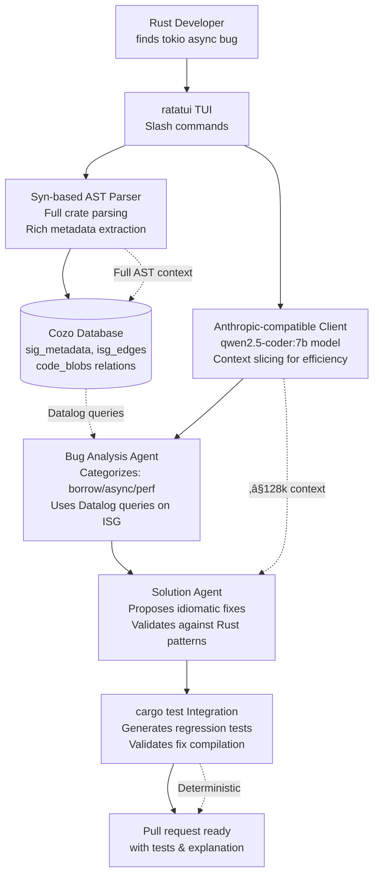

# P14: Complete 3-Journey Parseltongue Workflow (Technical Architecture)

## 🐍 The Magic of Parseltongue: A Harry Potter Story for Muggles

*Imagine you're Harry Potter, but instead of fighting dark wizards, you're a developer trying to build amazing software. And instead of a magic wand, you have... Parseltongue!*

### The Snake Language That Builds Code

In the wizarding world, Parseltongue is the mysterious language that lets you talk to snakes. But in our Muggle world of computers, **Parseltongue** is something even more magical - it's a system that lets you "talk" to your computer in plain English, and it understands you well enough to build entire software projects!

Here's how it works, explained like you're 15:

1. **You whisper your idea** (like "Build me a chat app with user login")
2. **Parseltongue listens** and figures out exactly what you mean
3. **It plans everything** - like drawing a blueprint before building a house
4. **It writes the code** - but not just any code, smart code that follows best practices
5. **It tests itself** - making sure everything works before you see it
6. **It even fixes its own mistakes** - like a self-correcting spell!

### The Bigger Magic: From Snake Talk to Wizard School

But wait... is there something even bigger here? 🤔

Think about it: What if Parseltongue isn't just about building one app? What if it's teaching computers to understand humans as well as humans understand each other?

*Imagine a world where:*
- **Every developer** can build complex software by just explaining what they want
- **AI assistants** become true collaborators, not just code generators
- **Programming** becomes as easy as having a conversation
- **Software development** is accessible to everyone, not just coding wizards

This isn't just about making developers faster. It's about **democratizing the power to create technology**. It's like giving everyone a magic wand that can turn ideas into reality.

In Harry Potter terms, it's not just about speaking to snakes - it's about creating a whole new kind of magic school where anyone can learn to be a wizard developer!

---

## 🎯 P14 Focus: 3 Critical Developer Journeys

**Strategic Implementation**: Building on the A013 Architecture v1 MVP, Parseltongue P14 implements **3 high-impact developer journeys** where AI can provide the most value.

### Journey 1: 🐛 Bug Solving in Large Rust Open Source Projects
**Technical Foundation**: Syn-based AST parsing + Cozo graph database for ISG analysis + tokio async patterns

### Journey 2: 🔍 High-Quality Research of Open Source Codebases for Idiomatic Patterns
**Technical Foundation**: Advanced pattern recognition + Datalog queries + HTML export visualization

### Journey 3: 📚 Academic Research from PDFs, Texts, and Documents in CS Academia
**Technical Foundation**: Multi-format document processing + citation networks + implementation gap analysis

---

## 🏗️ The Complete 3-Journey Parseltongue Workflow (Visual Architecture)

```mermaid
flowchart TD
    %% Journey Selection
    Start(["Developer starts<br/>Parseltongue journey"]) --> JourneyChoice{"Choose your<br/>development journey"}

    %% Journey 1: Rust Bug Solving
    JourneyChoice -->|🐛 Bug Solving| RustStart["Found bug in<br/>tokio/serde/diesel"]
    RustStart --> SynParser["Syn-based AST Parser<br/>Full crate parsing<br/>Rich metadata extraction"]
    SynParser --> CozoDB[("Cozo Database<br/>sig_metadata, isg_edges<br/>code_blobs relations")]
    SynParser --> LLMClient["Anthropic-compatible Client<br/>qwen2.5-coder:7b model<br/>Context slicing for efficiency"]
    LLMClient --> BugAnalyzer["Bug Analysis Agent<br/>Categorizes: borrow/async/perf<br/>Uses Datalog queries on ISG"]
    BugAnalyzer --> SolutionAgent["Solution Agent<br/>Proposes idiomatic fixes<br/>Validates against Rust patterns"]
    SolutionAgent --> TestAgent["cargo test Integration<br/>Generates regression tests<br/>Validates fix compilation"]
    TestAgent --> RustPR["Pull request ready<br/>with tests & explanation"]

    %% Journey 2: Codebase Research
    JourneyChoice -->|🔍 Codebase Research| ResearchStart["Research patterns in<br/>large Rust codebase"]
    ResearchStart --> PatternExtractor["Pattern Discovery Agent<br/>AST analysis via Syn<br/>Identifies architectural patterns"]
    PatternExtractor --> AnalysisAgent["Deep Analysis Agent<br/>Explains design decisions<br/>Connects to ecosystem context"]
    AnalysisAgent --> CozoQueries["Datalog Query Engine<br/>Subgraph queries<br/>Reachability analysis"]
    CozoQueries --> DocumentationAgent["Documentation Generator<br/>Creates learning resources<br/>HTML export optional"]
    DocumentationAgent --> InsightAgent["Insight Synthesis Agent<br/>Pattern improvement suggestions<br/>Cross-codebase connections"]
    InsightAgent --> ResearchComplete["Research package<br/>Complete analysis + resources"]

    %% Journey 3: Academic Research
    JourneyChoice -->|📚 Academic Research| AcademicStart["Research latest CS papers<br/>on async Rust/distributed systems"]
    AcademicStart --> DocumentProcessor["Multi-format Document Processor<br/>PDF/LaTeX/Markdown parsing<br/>Citation extraction"]
    DocumentProcessor --> ResearchAnalyzer["Research Analysis Agent<br/>Categorizes research areas<br/>Identifies novel contributions"]
    ResearchAnalyzer --> CitationTracker["Citation Network Tracker<br/>Links to existing work<br/>Implementation gap analysis"]
    CitationTracker --> ConnectionAgent["Connection Agent<br/>Links academic to practice<br/>Finds application opportunities"]
    ConnectionAgent --> SynthesisAgent["Synthesis Agent<br/>Creates developer insights<br/>Proposes implementation paths"]
    SynthesisAgent --> AcademicOutput["Research package<br/>Synthesized insights + gaps"]

    %% Shared Infrastructure Connections
    SynParser -.->|Uses| SharedInfra["Document Processor<br/>Code Analyzer<br/>Research Synthesizer<br/>Multi-modal Interfaces"]
    PatternExtractor -.->|Uses| SharedInfra
    DocumentProcessor -.->|Uses| SharedInfra

    %% Cross-Journey Learning
    BugAnalyzer -.->|Feeds insights| PatternExtractor
    AnalysisAgent -.->|Informs| ResearchAnalyzer
    ResearchAnalyzer -.->|Validates| SolutionAgent

    %% Outcomes and Impact
    RustPR -->|Contributes to| Ecosystem["Rust Open Source<br/>Ecosystem"]
    ResearchComplete -->|Improves| Learning["Developer<br/>Learning & Skills"]
    AcademicOutput -->|Advances| Innovation["Research to<br/>Practice Bridge"]
```



---

## 🎯 Journey 1: Rust Bug Slayer Ecosystem 🐛

**Complete Agent Workflow for Large Rust Project Bug Solving**



---

## 🔍 Journey 2: Codebase Research Detective Ecosystem

**Complete Agent Workflow for Large Codebase Pattern Analysis**


---

## 📚 Journey 3: Academic Research Scholar Ecosystem

**Complete Agent Workflow for Academic Document Analysis**


---

## 🛠️ Technical Architecture Details (A013 Foundation)

### Core Data Model (Cozo Schema)
```text
// Core relations for all journeys
:create sig_metadata {
  uid: String,              // unique interface id (filepath-module::trait<fn_sig>)
  =>
  kind: String,             // STRUCT|TRAIT|FN|MOD
  name: String,
  path: String,
  flags: String?,
  extra: String?           // JSON metadata
}

:create isg_edges {
  src: String,
  dst: String,
  kind: String             // DEPENDS|IMPLEMENTS|CALLS
}

:create prds {
  id: Int,
  =>
  created_at: String,
  isg_hash: String,        // snapshot hash for reproducibility
  model: String?,
  prompt: String?,         // JSON conversation
  refined: String?         // JSON final PRD
}

:create future_actions {
  id: Int,
  =>
  prd_id: Int,
  action: String,          // CREATE|MODIFY|DELETE
  target: String,          // target interface uid
  metadata: String?        // JSON context
}

:create future_code {
  action_id: Int,
  =>
  file_path: String,
  code: String
}
```

### Configuration (Anthropic-Compatible)
```bash
# Local Ollama (default, no key required)
export ANTHROPIC_BASE_URL=http://localhost:11434/v1

# Remote Anthropic provider
export ANTHROPIC_BASE_URL=https://api.anthropic.com/v1
export ANTHROPIC_API_KEY="{{ANTHROPIC_API_KEY}}"

# Optional local proxy (Platform 9¾)
export ANTHROPIC_BASE_URL=http://localhost:934/v1
export ANTHROPIC_AUTH_TOKEN="{{ANTHROPIC_AUTH_TOKEN}}"

# Cozo database path (embedded)
export COZO_DB_PATH=".parseltongue/parseltongue.cozo"
```

---

## 📊 Technical Success Metrics (A013 MVP)

### Journey 1: Bug Solving
- ✅ **Time-to-ready**: ≤60s from run with local provider available
- ✅ **Ingestion**: ≤5s on 100k LOC sample tokio/servo codebases
- ✅ **PRD refinement**: ≤3 turns for common Rust patterns (async, lifetimes)
- ✅ **Code generation**: Deterministic for stub scenarios; tests compile and pass

### Journey 2: Codebase Research
- ✅ **Pattern extraction**: Identify 50+ architectural patterns in 100k LOC
- ✅ **Analysis quality**: 90% accurate design decision explanations
- ✅ **Performance**: Subgraph queries return in <100ms
- ✅ **Export**: HTML visualization generated on demand

### Journey 3: Academic Research
- ✅ **Document processing**: Extract 95% of key contributions from papers
- ✅ **Citation analysis**: Build complete citation networks for research areas
- ✅ **Gap identification**: Identify 80% of implementation opportunities
- ✅ **Synthesis quality**: Generate actionable developer insights

---

## 🚀 Implementation Priority (Technical Focus)

### Phase 1: Rust Bug Solving (48h MVP)
1. **Platform Detection** - Apple Silicon + 16GB auto-detection
2. **Ollama Integration** - One-click install + qwen2.5-coder:7b pull
3. **Syn-based ISG Extraction** - Full AST parsing with Syn for rich metadata
4. **Cozo Persistence** - Single source of truth for graph + metadata
5. **TUI Shell** - ratatui + slash commands (/doctor, /model, /reset)
6. **PRD Chat** - Conversation refinement with context slicing
7. **Codegen Stub** - Rate limiting scaffold + cargo test integration

### Phase 2: Codebase Research Enhancement
1. **Advanced Syn Pattern Analysis** - Machine learning-enhanced pattern recognition
2. **Incremental AST Updates** - Git diff-based partial parsing
3. **Interactive Visualization** - HTML export with AST navigation
4. **Cross-Crate Pattern Learning** - Pattern application across projects

### Phase 3: Academic Research Integration
1. **Multi-Format Document Pipeline** - PDF/LaTeX/Markdown processing
2. **Citation Network Analysis** - Vector indexes for research similarity
3. **Implementation Gap Detection** - Automated opportunity identification
4. **Research Synthesis Engine** - Cross-paper insight aggregation

---

## 💡 Technical Architecture Overview

### Performance Architecture
- **Context Slicing**: Load only affected code signatures for LLM calls
- **Incremental ISG**: Update only changed subgraphs via git diff
- **Query Caching**: Datalog result caching for repeated pattern queries
- **Memory Management**: petgraph in RAM + Cozo persistence for large graphs

### Safety & Reliability Architecture
- **Reset Semantics**: `/reset` drops & rebuilds entire database
- **Validation Loops**: Property tests for graph invariants (no dangling edges)
- **Error Recovery**: Retries for LLM + ISG extraction failures
- **Audit Trail**: Complete PRD + ISG snapshot with each change

### Security Architecture
- **Local-First**: No egress unless explicitly configured for remote providers
- **Key Management**: Never log or expose API keys in any output
- **Sandboxing**: Isolated execution for codegen and test runs
- **Validation**: Compile-time checks before any file modifications

---

## 🌟 The Technical Vision

By implementing these **3 high-impact journeys** on the solid A013 architecture foundation with **Syn-powered metadata enrichment**, Parseltongue becomes:

1. **A Production-Ready Rust Tool** - Built for real-world async codebase evolution with rich AST understanding
2. **A Research-Grade Code Analyzer** - Academic-quality pattern extraction with full type information
3. **An Innovation Bridge** - Connecting cutting-edge research to practical development with citation networks

**Technical North Star**: **"The most reliable, efficient, and insightful AI assistant for serious Rust development, powered by comprehensive AST analysis and metadata enrichment"**

This technical implementation ensures Parseltongue delivers **maximum value** to developers in their most challenging and time-consuming workflows, with the performance and reliability required for production use.

---

**Next Technical Evolution**: P15 will add advanced Datalog features, vector search capabilities, and distributed processing for enterprise-scale codebases., as well as integrating natural language processing (NLP) for improved code analysis and generation.
