# P21: Parseltongue Architecture v0.1 - Complete Vision

## 🎯 Executive Summary: Unified Architecture for Large Rust Codebases

**Parseltongue** is a **journey-aware code intelligence system** that combines **ISG transformation philosophy** (P03) with **pattern-guided intelligence** (P20) using **CozoDB-native Datalog queries** and **sub-agent parallel processing** for **production-scale Rust development**.

**Core Innovation**: Pattern database doesn't replace ISG - it **guides ISG_future generation** through micro-PRDs, enabling **predictive transformation validation** before code generation.

---

## 🏗️ Architecture Overview: 3 Journeys, 1 System

### **Journey 1: Bug Fixing** 🐛 (Pattern-Guided Reactive Fixing)
- **Speed**: 60-90s end-to-end
- **Accuracy**: 90-95% (pattern boost)
- **Approach**: Pattern DB → Micro-PRD → ISG_future → Validate → Apply

### **Journey 2: Pattern Research** 🔍 (Pattern Cataloging)
- **Speed**: 30-60s for 5MB codebase
- **Coverage**: 95%+ pattern detection
- **Approach**: Hybrid 128K scan → Sub-agent validation → Catalog output

### **Journey 3: Academic Research** 📚 (Deep Synthesis)
- **Speed**: 1-2 min
- **Depth**: Full document synthesis
- **Approach**: 128K context + specialized agents → Research insights

---

## 📊 System Architecture: Mother Table + Context Layers

### **Core Data Model: CozoDB-Native Design**

**Mother Relation** (Single Source of Truth):
```datalog
::create interface_code {
    uid: String
    =>
    current_code: String,
    future_code: String?
}
```

**9 Supporting Relations** (Context Layers):
1. `interface_metadata` - Structural info (rust-analyzer enriched)
2. `interface_relationships` - Graph edges (CALLS, DEPENDS, IMPLEMENTS)
3. `interface_patterns` - Pattern annotations (with vector embeddings)
4. `pattern_library` - Pattern knowledge (150+ patterns, HNSW indexed)
5. `transformation_plan` - ISG_future representation
6. `feasibility_checks` - Validation results
7. `caller_analysis` - Impact analysis
8. `isg_versions` + `version_changes` - Time travel (rollback)
9. `micro_prds` + `prd_interface_mapping` - Requirements traceability

---

## 🎭 The Missing Bridge: Pattern-Guided ISG Transformation

### **Current Gap (P20 Reality)**
```
Bug description → Pattern DB → LLM generates fix → Cargo validates → Apply
```
- **ISG**: Retrieval only (search index)
- **No PRD**: Bug description ≠ specification
- **No ISG_future**: No predictive modeling
- **Reactive**: Validate after coding

### **Proposed Synthesis (P21 Vision)**
```
Bug description → Pattern DB → Micro-PRD → ISG_future (pattern-guided) → 
Feasibility check → Pattern-applied code → ISG_current ← ISG_future
```
- **ISG**: Transformation engine (predictive modeling)
- **Micro-PRD**: Traceable specification (200-500 tokens)
- **ISG_future**: Graph-level transformation plan
- **Proactive**: Validate before coding

---

## 🧠 Component Architecture: Sub-Agents + CozoDB

### **Agent Team (7-8 Parallel Sub-Agents)**

| Agent | Model | Role | Context | Speed |
|-------|-------|------|---------|-------|
| **A1** | STLM 50M | Error → Pattern Mapping | 3-4K | 300 t/s |
| **A2** | MiniLM 22M | ISG Dependency Search | 3-4K | 400 t/s |
| **A3** | MiniLM 22M | Vector Pattern Search | 3-4K | 400 t/s |
| **A4** | SmolLM2 135M | Anti-Pattern Detection | 3-4K | 200 t/s |
| **A5** | SmolLM2 135M | Pattern Recognition | 3-4K | 200 t/s |
| **A6** | Gemma 270M | Constraint Validation | 4-8K | 150 t/s |
| **R1** | Qwen 14B | Pattern-Guided Reasoning | 20K | 15 t/s |

**Coordination**: Rust workspace with tokio async, CozoDB embedded, llama.cpp servers

---

## 🗂️ CozoDB Schema: Datalog-Native Design

### **Mother Relation (What Changes)**
```datalog
::create interface_code {
    uid: String
    =>
    current_code: String,
    future_code: String?
}
```

### **Pattern Library (150+ Rust Patterns)**
```datalog
::create pattern_library {
    pattern_id: String
    =>
    name: String,
    category: String,
    pattern_type: String,
    description: String,
    code_template: String,
    constraints: String,  // JSON: ["F: Send + 'static"]
    fix_template: String,
    transformation_type: String,
    times_suggested: Int = 0,
    times_accepted: Int = 0,
    success_rate: Float = 0.0,
    avg_confidence: Float = 0.0,
    error_codes: String?,  // JSON: ["E0277"]
    error_keywords: String?,  // JSON: ["cannot be sent"]
    embedding: <F32; 384>  // Vector for HNSW similarity
}

# HNSW index for pattern similarity search
::hnsw create pattern_library:pattern_vec_idx {
    dim: 384, m: 50, dtype: F32, fields: [embedding],
    distance: Cosine, ef_construction: 20
}
```

### **ISG_future Generation**
```datalog
::create transformation_plan {
    uid: String
    =>
    action: String,  // 'CREATE', 'MODIFY', 'DELETE'
    reason: String?,  // "Add Send bound for async_spawn_send pattern"
    pattern_used: String?,
    prd_requirement: String?,
    signature_old: String?,
    signature_new: String?,
    constraints_added: String?,  // JSON array
    confidence: Float?,
    generated_at: Validity,
    feasibility_checked: Bool = false
}
```

### **Feasibility Validation**
```datalog
::create feasibility_checks {
    uid: String,
    check_type: String
    =>
    passed: Bool,
    severity: String,  // 'Critical', 'Warning'
    issue_description: String?,
    affected_uids: String?,  // JSON array
    suggested_fixes: String?,
    checked_at: Validity
}
```

---

## 🔄 Complete Bug Fixing Flow: Pattern → PRD → ISG_future → Validate → Apply

### **Phase 0: Setup (One-Time)**

```mermaid
flowchart TD
    User["🐛 User: Bug found"] --> CheckISG{"ISG + Patterns exist?"}
    CheckISG -->|❌ No| BuildISG["⚙️ Build ISG<br/>━━━━━━━━━━━━<br/>RataTUI 4 phases:<br/>• AST Parsing (20-40s)<br/>• Edge Extraction (30-60s)<br/>• Embeddings (40-90s)<br/>• CozoDB Index (20-40s)"]
    BuildISG --> LoadPatterns["⚙️ Load Pattern DB<br/>━━━━━━━━━━━━<br/>• 150+ patterns<br/>• 100+ anti-patterns<br/>• 200+ error mappings<br/>• HNSW indices<br/>━━━━━━━━━━━━<br/>Time: 5-10s"]
    LoadPatterns --> Annotate["⚙️ Annotate Patterns<br/>━━━━━━━━━━━━<br/>For each node:<br/>• Query patterns<br/>• Detect anti-patterns<br/>• Store metadata<br/>━━━━━━━━━━━━<br/>Result: Enriched ISG"]
    CheckISG -->|✅ Yes| ISGReady["✅ ISG Ready (Cached)"]
    Annotate --> ISGReady
```


### **Phase 1: Pattern-Guided Discovery**

```mermaid
flowchart TD
    ISGReady --> Phase1["🔍 PHASE 1: Discovery<br/>━━━━━━━━━━━━━━━━<br/>Time: 5-10 seconds<br/>Pattern-aware search"]

    Phase1 --> A1["A1: Scope Seeder<br/>━━━━━━━━━━━━<br/>Model: STLM 50M<br/>⭐ Query error→pattern DB<br/>• Parse error messages<br/>• Match error codes<br/>• Get pattern hints<br/>━━━━━━━━━━━━<br/>Output: seeds + hints<br/>Boost: +0.85<br/>━━━━━━━━━━━━<br/>Ex: 'cannot be sent'<br/>→ async_spawn_send"]

    A1 --> ParallelRetrieval{{"⚡ PARALLEL<br/>A2 + A3"}}

    ParallelRetrieval --> A2["A2: Exact Retriever<br/>━━━━━━━━━━━━<br/>CozoDB Datalog<br/>2-hop CALLS/DEPENDS<br/>Cap: 30 nodes/hop<br/>━━━━━━━━━━━━<br/>⭐ Include patterns<br/>⭐ Anti-pattern flags<br/>⭐ Idiomatic scores"]

    ParallelRetrieval --> A3["A3: Vector Retriever<br/>━━━━━━━━━━━━<br/>CozoDB HNSW<br/>K=15 similar<br/>Filter: L4-L5<br/>━━━━━━━━━━━━<br/>⭐ Boost by hints"]

    A2 --> Merge["⚙️ Merge & Dedup<br/>━━━━━━━━━━━━<br/>Combine ~30-50 items<br/>━━━━━━━━━━━━<br/>⭐ Sort by pattern:<br/>• Anti-patterns first<br/>• Then idiomatic score"]
    A3 --> Merge

    Merge --> Phase2["🔬 PHASE 2: Validation"]
```


### **Phase 2: Pattern-Guided Validation**

```mermaid
flowchart TD
    Phase2 --> ParallelValidation{{"⚡ PARALLEL<br/>A4 + A5 + A6"}}

    ParallelValidation --> A4["A4: Anti-Pattern Detector<br/>━━━━━━━━━━━━<br/>Model: MiniLM 22M<br/>⭐ Query anti-pattern DB<br/>• Vector search<br/>• If distance < 0.2 → FLAG<br/>• Extract severity<br/>━━━━━━━━━━━━<br/>Output: bug type,<br/>severity, confidence<br/>━━━━━━━━━━━━<br/>Ex: async_spawn_no_send<br/>95% confidence"]

    ParallelValidation --> A5["A5: Pattern Recognizer<br/>━━━━━━━━━━━━<br/>Model: SmolLM2 135M<br/>⭐ Query pattern DB<br/>• Find idiomatic patterns<br/>• Match signatures<br/>• Get fix + example code<br/>━━━━━━━━━━━━<br/>Output: pattern_id,<br/>example, boost +0.9<br/>━━━━━━━━━━━━<br/>Ex: async_spawn_send<br/>with code sample"]

    ParallelValidation --> A6["A6: Constraint Enforcer<br/>━━━━━━━━━━━━<br/>Model: Gemma 270M<br/>⭐ Query constraints<br/>• Get required bounds<br/>• Validate code<br/>• Flag missing<br/>━━━━━━━━━━━━<br/>Output: required,<br/>current, missing<br/>━━━━━━━━━━━━<br/>Ex: Missing Send<br/>validation FAIL"]

    A4 --> ContextBuilder["📦 Context Builder<br/>━━━━━━━━━━━━<br/>Smart reordering:<br/>━━━━━━━━━━━━<br/>START (80%):<br/>• Bug + errors<br/>• ⭐ Anti-patterns<br/>• ⭐ Severity<br/>━━━━━━━━━━━━<br/>EARLY (70%):<br/>• Function code<br/>• ⭐ Pattern + example<br/>━━━━━━━━━━━━<br/>MIDDLE (40%):<br/>• Alternatives<br/>━━━━━━━━━━━━<br/>END (70%):<br/>• History<br/>• ⭐ Effectiveness<br/>━━━━━━━━━━━━<br/>10-15K tokens"]
    A5 --> ContextBuilder
    A6 --> ContextBuilder
```


### **Phase 3: Pattern-Guided Reasoning**

```mermaid
flowchart TD
    ContextBuilder --> Phase3["🧠 PHASE 3: Deep Reasoning<br/>━━━━━━━━━━━━━━━━<br/>Time: 30-45 seconds<br/>Pattern-guided fix generation"]

    Phase3 --> R1["R1: Qwen 7B (20K)<br/>━━━━━━━━━━━━<br/>Context: 10-15K<br/>Buffer: 5K free<br/>Temp: 0.1<br/>━━━━━━━━━━━━<br/>⭐ Pattern-aware:<br/>• Sees anti-pattern<br/>• Gets example code<br/>• Historical: 94% success<br/>• Boost: +0.9<br/>━━━━━━━━━━━━<br/>Tasks: Analyze bug,<br/>apply pattern, validate,<br/>generate diff<br/>━━━━━━━━━━━━<br/>Output: code changes,<br/>confidence (boosted!),<br/>pattern used"]

    R1 --> ConfidenceCheck{"Confidence<br/>≥ 0.75?<br/>━━━━━━━━<br/>Pattern boost<br/>often pushes<br/>0.70 → 0.92!"}

    ConfidenceCheck -->|❌ Low| IterateR1["⚠️ Low Confidence<br/>Request clarification<br/>⟲ Loop back"]
    IterateR1 --> R1

    ConfidenceCheck -->|✅ High| Phase4["⚙️ PHASE 4: Validation<br/>Time: 15-20 seconds"]
```


### **Phase 4: Cargo Validation**

```mermaid
flowchart TD
    Phase4 --> ApplyChanges["Apply to temp workspace"]
    ApplyChanges --> CargoFmt["1️⃣ cargo fmt --check"]
    CargoFmt --> FmtPass{"Format OK?"}
    FmtPass -->|❌| FmtError["Auto-fix"]
    FmtError --> CargoFmt
    FmtPass -->|✅| CargoCheck["2️⃣ cargo check -q"]
    CargoCheck --> CheckPass{"Compile OK?"}
    CheckPass -->|❌| CheckError["Feed errors to R1"]
    CheckError --> R1
    CheckPass -->|✅| CargoBuild["3️⃣ cargo test --no-run"]
    CargoBuild --> BuildPass{"Build OK?"}
    BuildPass -->|❌| CheckError
    BuildPass -->|✅| CargoTest["4️⃣ cargo test -q"]
    CargoTest --> TestPass{"Tests Pass?"}
    TestPass -->|❌| TestError["Feed failures to R1"]
    TestError --> R1
    TestPass -->|✅| Phase5["✅ PHASE 5: Presentation"]
```


### **Phase 5: User Review & Learning**

```mermaid
flowchart TD
    Phase5 --> ShowDiff["📊 Show Results<br/>• Diff view<br/>• Test results ✅<br/>• Confidence: 0.87<br/>• Time: 72s"]

    ShowDiff --> UserReview{"User<br/>Approves?"}

    UserReview -->|❌| UserFeedback["💬 Feedback<br/>⟲ Loop to R1"]
    UserFeedback --> R1

    UserReview -->|✅| ApplyFinal["✅ Apply to Codebase<br/>━━━━━━━━━━━━<br/>• Write changes<br/>• Update ISG"]

    ApplyFinal --> GitCommit["📝 Suggested Commit<br/>━━━━━━━━━━━━<br/>Message:<br/>'fix: async spawn Send'<br/>━━━━━━━━━━━━<br/>⭐ Include pattern:<br/>'async_spawn_send'"]

    GitCommit --> LearnFromFix["🧠 Learning Phase<br/>━━━━━━━━━━━━<br/>Store in CozoDB:<br/>1. Bug embedding<br/>2. Solution<br/>3. Similar issues<br/>━━━━━━━━━━━━<br/>⭐ Update effectiveness:<br/>• times_suggested++<br/>• times_accepted++<br/>• avg_confidence<br/>━━━━━━━━━━━━<br/>Pattern DB learns!<br/>95% success (48/51)"]

    LearnFromFix --> Complete(["🎉 Bug Fixed!<br/>━━━━━━━━━━━━<br/>Time: 60-90s<br/>Confidence: 90-95%<br/>━━━━━━━━━━━━<br/>Pattern: async_spawn_send<br/>Tests: ✅ Pass<br/>Cargo: ✅ Success<br/>━━━━━━━━━━━━<br/>DB updated!"])
```


---

## 🔍 Key Datalog Query Examples

### **Error-to-Pattern Mapping**
```datalog
# Find patterns matching error message
?[pattern_id, name, distance, code_template] := 
    error_text = "cannot be sent between threads",
    error_vec = vec_embed(error_text),
    ~pattern_library:pattern_vec_idx{
        pattern_id, name, code_template 
        | query: error_vec, k: 3, ef: 20, bind_distance: distance
    },
    distance < 0.3
# Result: async_spawn_send pattern, 95% confidence
```

### **Blast Radius Analysis**
```datalog
# Find 2-hop dependencies of spawn function
blast_radius[uid, hop] := 
    start['src/runtime.rs-runtime-spawn'],
    *interface_relationships{from_uid: start, to_uid: uid},
    hop = 1

blast_radius[uid, hop] := 
    blast_radius[intermediate, prev_hop],
    prev_hop < 3,
    *interface_relationships{from_uid: intermediate, to_uid: uid},
    hop = prev_hop + 1

?[uid, current_code] := blast_radius[uid, hop],
    *interface_code{uid, current_code}
```

### **Pattern-Guided ISG_future Generation**
```datalog
# Generate transformation plan using pattern
?[] <~ put(transformation_plan[], {
    uid: 'src/runtime.rs-runtime-spawn',
    action: 'MODIFY',
    reason: 'Add Send bound for async_spawn_send pattern',
    pattern_used: 'async_spawn_send',
    signature_new: 'pub fn spawn<F>(f: F) where F: Future + Send + ''static',
    constraints_added: '["Send", "''static"]',
    confidence: 0.92,
    feasibility_checked: false
})
```

### **Feasibility Validation**
```datalog
# Check if transformation creates cycles
?[has_cycle] := 
    target_uid['src/runtime.rs-runtime-spawn'],
    *transformation_plan{uid: target_uid, action: 'MODIFY'},
    ?[node, component] <~ StronglyConnectedComponent(*interface_relationships[]),
    component_size = count(node, component),
    has_cycle = component_size > 1
```

### **Pattern Effectiveness Learning**
```datalog
# Update pattern success rate
?[] <~ update(pattern_library[], 
    'async_spawn_send',
    name,
    times_suggested + 1,
    times_accepted + 1,
    (times_accepted + 1) / (times_suggested + 1)
)
```

---

## 📈 Performance & Metrics

### **Journey 1: Bug Fixing**
- **Total Time**: 60-90s (after initial 3-4 min setup)
- **Accuracy**: 90-95% (vs 85-90% baseline)
- **Confidence**: 85-95% (pattern boost)
- **First-try Success**: 85% (vs 70% baseline)
- **Pattern Learning**: Effectiveness improves over time

### **Journey 2: Pattern Research**
- **Total Time**: 30-60s
- **Pattern Coverage**: 95%+ detection
- **Context**: 20K or 128K hybrid (scan → validate)
- **Output**: Categorized pattern catalog

### **Journey 3: Academic Research**
- **Total Time**: 1-2 min
- **Depth**: Full document synthesis
- **Context**: 128K (full visibility)
- **Output**: Research insights with citations

---

## ✅ Key Innovations

### **1. Pattern-Guided ISG Transformation**
- Pattern DB suggests WHAT to change (constraints, signatures)
- ISG_future models transformation at graph level
- Feasibility validation before code generation
- **Result**: Predictive, explainable, rollback-capable changes

### **2. Micro-PRD Generation**
- Every fix has traceable specification (200-500 tokens)
- Pattern DB provides transformation templates
- User sees intent (interface changes) not just mechanics (code lines)

### **3. CozoDB-Native Design**
- Datalog queries for graph traversal (recursive dependencies)
- HNSW vector search for pattern similarity
- Built-in time travel for rollback capability
- Hybrid relational-graph-vector in single database

### **4. Sub-Agent Parallel Processing**
- 7-8 specialized agents working simultaneously
- Context preservation: 10x compression, 15K tokens free for reasoning
- Journey-specific agent configuration (latency vs throughput vs accuracy)

### **5. Learning Loop**
- Pattern effectiveness tracked per repository
- ISG versioning with rollback capability
- Historical success rates improve future predictions

---

## 🏛️ Architecture Principles

### **ISG Transformation Philosophy (P03)**
1. **Predictive Modeling**: ISG_future before code generation
2. **Feasibility Gates**: Validate before applying changes
3. **Graph-Level Reasoning**: Interface changes, not just code diffs
4. **Rollback Safety**: ISG versioning for safe experimentation

### **Pattern-Guided Intelligence (P20)**
1. **Instant Error Mapping**: "cannot be sent" → async_spawn_send pattern
2. **Anti-Pattern Detection**: Flag known issues with 95% confidence
3. **Example Code Included**: R1 sees working patterns in context
4. **Historical Effectiveness**: "This pattern worked 94% of the time"

### **Sub-Agent Coordination (P17/P16)**
1. **Journey-Aware Configuration**: 7-8 agents for bugs, 10-15 for research
2. **Context Preservation**: 10x compression with quality increase
3. **Parallel Processing**: Embarrassingly parallel Phase 1
4. **Validation Gates**: Cargo check before user presentation

---

## 🔧 Implementation Roadmap

### **Phase 1: Core Infrastructure (Week 1-2)**
1. **CozoDB Schema** - Mother table + 9 supporting relations
2. **Pattern Library** - 150 Rust patterns with HNSW indexing
3. **ISG Extraction** - syn + rust-analyzer multi-level extraction
4. **Sub-Agent Framework** - 7-8 agent team with tokio coordination

### **Phase 2: Pattern Integration (Week 3-4)**
1. **Micro-PRD Generator** - Pattern-guided PRD creation (A0 agent)
2. **ISG_future Generation** - Pattern templates → graph transformations
3. **Feasibility Validator** - Pre-code validation with pattern guidance
4. **Transformation Applier** - Pattern-guided code generation from ISG_future

### **Phase 3: Learning & Optimization (Week 5-6)**
1. **Pattern Effectiveness Tracking** - Success rate per repository
2. **ISG Versioning** - Time travel and rollback capability
3. **Context Optimization** - Fine-tune agent context budgets
4. **Performance Benchmarking** - 5MB codebase: 60-90s target

### **Phase 4: Journey Integration (Week 7-8)**
1. **Journey 1**: Pattern-guided bug fixing (full flow)
2. **Journey 2**: Pattern research (hybrid 128K scan + validation)
3. **Journey 3**: Academic research (128K deep synthesis)
4. **Cross-Journey Consistency** - Unified agent contracts

---

## 🎯 Success Metrics

### **Performance Targets**
- **Journey 1**: 60-90s end-to-end, 90-95% accuracy
- **Journey 2**: 30-60s, 95%+ pattern coverage
- **Journey 3**: 1-2 min, full document synthesis

### **Quality Metrics**
- **Accuracy**: 90-95% for Journey 1 (vs 85-90% baseline)
- **Confidence**: 85-95% (pattern boost improvement)
- **Learning**: Pattern effectiveness improves over time
- **Rollback**: 100% safe via ISG versioning

### **User Experience**
- **Traceability**: Every fix has micro-PRD specification
- **Explainability**: Graph-level diffs, not just code changes
- **Safety**: Feasibility validation before code generation
- **Learning**: System gets better with each fix

---

## 📚 Related Documents

- **[P20: Bug Fixing User Journey](./P20_Bug_Fixing_UserJourney.md)** - Pattern-guided bug fixing implementation
- **[P17: Sub-Agent Game](./P17SubAgentGame.md)** - Journey-aware agent orchestration
- **[P16: Sub-Agent Architecture](./P16NotesOnSubAgents.md)** - Technical agent implementation
- **[P15: Architecture Validation](./P15ValidateArchitecture.md)** - Rust stack validation
- **[P00: Core User Flow](./P00CoreUserflow20251014p1.md)** - Original ISG philosophy
- **[P03: Mermaid User Flow](./P03Mermaid01.md)** - Visual flow inspiration

---

## ✅ Bottom Line

**Parseltongue v0.1 bridges the gap between ISG transformation philosophy and pattern-guided intelligence:**

- ✅ **ISG as transformation engine** (predictive, graph-level changes)
- ✅ **Pattern DB guidance** (150+ idioms, anti-patterns, error mappings)
- ✅ **Micro-PRD traceability** (every fix has a specification)
- ✅ **CozoDB-native design** (Datalog + HNSW + time travel)
- ✅ **Sub-agent parallel processing** (7-8 agents, 60-90s performance)
- ✅ **Learning loop** (patterns improve over time)

**Result**: **Rust-specialized expert system** that combines the best of P03's architectural vision with P20's practical pattern intelligence! 🚀

*This architecture represents the complete synthesis of all previous documents into a cohesive, implementable system for production-scale Rust development.*
