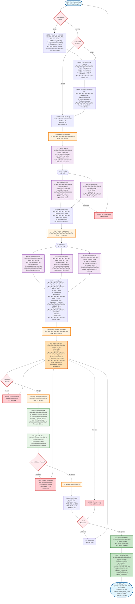

Scope for Parseltongue v1.0

Use this as a filter for Rust Tools or Libraries you are ideating as part of building the Parseltongue plugin or skill or something for Claude Code

- ANTHROPIC_KEY will be the orchestrator and reasoning LLM
- Executive Summary
    - User Segment: Developers on large Rust codebases ONLY
    - Reliability-First Principle:
        - Optimize for accurate 1-go fixes that feel trustworthy and increase user efficacy.
        - Prefer CPU-bound static analysis (rust-analyzer overlays, ISG traversals) and small, local, free subagents.
        - Keep the reasoning LLM as lean and late as possible; minimize context/tokens; use deterministic transforms whenever feasible.
    - Shreyas Doshi (product framing): Prioritize first-apply correctness over speed. Design for clarity, safety, and explicit confidence gating. Time is a secondary outcome.
    - Jeff Dean (systems framing): Make correctness the fast path. Push work to deterministic, cacheable computations (ISG, RA, HNSW). Parallelize retrieval/validation; minimize token movement; measure token-per-fix and cache hit rates.
    - User Promise: “When I hit a Rust bug, the system produces a single-pass, safe, minimal diff that compiles and (when present) passes tests before applying. Speed is a byproduct; correctness is the KPI.”
- Constraints of tech stack
    - llama.cpp because Ollama does not allow parallelism
    - CozoDB because it is a graph database
    - We will be based on Claude Code as a plugin or skill or something because we want to focus on the core differentiation which is ISG & similar Aggregated Code Context which can ensure reliable bug solving with high accuracy
    - Core Data Model: Interface Signature Graph (ISG)
        - Nodes: function signatures, impl blocks, trait items, types, public APIs, macro-expanded interfaces.
        - Edges: CALLS, IMPLEMENTS, USES, DEPENDS, REQUIRES_BOUND, FEATURE_GATED_BY.
        - Levels: ISGL1 (interface node keyed as filepath-filename-InterfaceName, 1 level below file/module), ISGL2/ISGL3 are constituents under ISGL1 used for understanding only.
        - Store: CozoDB (Datalog + HNSW) with columnar payloads for fast filters and range scans.
    - CodeGraph (single write surface)
        - indexed by ISGL1 key (filepath-filename-InterfaceName)
        - columns (minimal, opinionated):
            - Current_Code (canonical pre-edit slice),
            - Future_Code (candidate patch slice, ephemeral until approval),
            - Future_Action (None|Create|Edit|Delete),
            - TDD_Classification (TEST_IMPLEMENTATION, CODE_IMPLEMENTATION)
            - current_id (0/1: 0 meaning NOT in current code, 1 meaning in current code),
            - future_id (0/1: 0 meaning NOT in future code, 1 meaning in future code)
        - Rule: All code-iteration writes happen only in CodeGraph. All other CozoDB tables (ISG nodes/edges, embeddings, pattern KB indices) are read-only context stores and never mutate code.
        - Flow: PreFlight compiles Future_Code via RA overlay; on approval, flip Future‚ÜíCurrent, clear future_* flags
    - Many types of ISGs can be created
        - ISGL1 (interface node keyed as filepath-filename-InterfaceName, 1 level below file/module)
        - ISGL2 is 1 extra distance below file / module for e.g. if a function is inside main function in main.rs that will be ISGL3
        - ISGL3 is 1 extra distance below ISGL2 for e.g. if a function is inside main function and then further inside another function in main.rs that will be ISGL3
        - ISGs are a proxy for what we called Aggregated Code Context
            - It is not just about interface signatures, it can be any pyramidal way to aggregate the codebase
            - for e.g. we can using sub-agents generically summarize all ISGL1 related code blobs to 1 liner summaries, and that will be significantly HQ code context and much lesser than the actual codebase
                - a variation of this can be running small agents with context of the PRD
            - for e.g. we can try to get HIR or other Rust analyzer meta-data for all ISGL1 related code blobs and that will be significantly HQ code context and much lesser than the actual codebase
- Local LLM Subagents Types
    - A1 Seeder: error parsing ‚Üí seeds + hints (no R1).
    - A2 ExactRetriever: ISG Datalog 2-hop traversal with filters; cap 30 nodes/hop.
    - A3 VectorRetriever
    - A4 AntiPatternDetector
    - A5 PatternRecognizer
    - A6 ConstraintEnforcer
    - R1 Reasoner
    - Can be more
- Validation Layer
    - rust-analyzer overlay: didOpen ephemeral buffers ‚Üí publishDiagnostics; fail on Error severity.
    - cargo check --quiet on real workspace (no temp checkout); cap run ≤ 3s when hot.
    - Selective tests (when present): detect nextest; else cargo test -q limited to impacted crates/tests via ISG blast radius; cap runtime; cache test binaries.
    - Candidate buffer source: CodeGraph.Future_Code for the affected ISGL1 keys (never mutate other tables).
    - Gate: No I/O writes until PreFlight passes and user approves.

- On-Device Runtime
    - llama.cpp + Metal for GGUF models; pinned CPU threads, tuned GPU layers for 2–7B.
    - Tokio runtime for orchestration; bounded task queues; cooperative yields to keep UI responsive.
    - Caching: ISG + HNSW persisted; warm caches on idle.
- User Journy ideas
    - Parallel retrieval: (a) ISG 2-hop CALLS/DEPENDS; (b) HNSW vector neighbors.
    - Validate: anti-pattern detector, pattern recognizer, constraint checker.
    - Build curated context (10–15K tokens), generate diff, compute confidence.
    - PreFlight: rust-analyzer overlay + cargo check --quiet.

- Appendix A: Local Model Matrix (indicative)
    - 22–50M encoder (Q4) — 50–150 MB.
    - MiniLM 22M (Q4) — ~40–80 MB.
    - SmolLM2 135M (Q4) — ~300–500 MB.
    - Gemma 270M (Q4) — ~600–800 MB.
    - Qwen2.5 7B (Q4_K_M) — ~4.5–6.5 GB VRAM-equivalent on Metal

# P24ClaudePlugin02 — ISG + Local LLM Subagents for Large Rust Codebase Bug Solving

Status: Draft v0.1
Owner: P24 Initiative
Scope: Claude Code plugin evolution with on-device subagents, optimized for Apple Silicon (16 GB+) and large Rust monorepos

—

Executive Summary

Reliability-First Principle (per P24 comment):
- Optimize for accurate 1-go fixes that feel trustworthy and increase user efficacy.
- Prefer CPU-bound static analysis (rust-analyzer overlays, ISG traversals) and small, local, free subagents.
- Keep the reasoning LLM as lean and late as possible; minimize context/tokens; use deterministic transforms whenever feasible.

Shreyas Doshi (product framing): Prioritize first-apply correctness over speed. Design for clarity, safety, and explicit confidence gating. Time is a secondary outcome.

Jeff Dean (systems framing): Make correctness the fast path. Push work to deterministic, cacheable computations (ISG, RA, HNSW). Parallelize retrieval/validation; minimize token movement; measure token-per-fix and cache hit rates.

User Promise: “When I hit a Rust bug, the system produces a single-pass, safe, minimal diff that compiles and (when present) passes tests before applying. Speed is a byproduct; correctness is the KPI.”

—

User Journeys (no diagrams)

Journey A: “Single-Pass Safe Fix” (default path)
- Trigger: User runs /rust:debug-bug on a failing build/test.
- Steps:
  1) Check cached ISG; build/refresh if missing.
  2) Parse rustc/cargo errors ‚Üí seeds + hints.
  3) Parallel retrieval: (a) ISG 2-hop CALLS/DEPENDS; (b) HNSW vector neighbors.
  4) Validate: anti-pattern detector, pattern recognizer, constraint checker.
  5) Build curated context (10–15K tokens), generate diff, compute confidence.
  6) PreFlight: rust-analyzer overlay + cargo check --quiet.
  7) Present diff with pattern rationale and confidence; user approves; apply + git commit.
- Success criterion: First-Apply Correctness ≥ 0.95; typical latency 60–120s on 16 GB.

Journey B: “Investigate Before Edit”
- Trigger: Security/compliance sensitive repo; user wants diagnosis only.
- Steps: Same as A but skip apply; produce root-cause narrative, candidate patch, confidence, and diagnostic mapping to ISG nodes.
- Output: A red/amber/green report with suggested pattern and constrained blast radius.

Journey C: “Low-Memory Mode” (≤12 GB)
- Trigger: Older Mac or heavy IDE workload.
- Steps: Throttle parallel subagents; use smaller local models (135M/270M class) for A4–A6; cap retrieval set (≤25 items); reason with shorter context (6–8K) using a compact 2B model; identical validation flow.
- Tradeoff: +15–25s latency; similar safety bar.

Journey D: “Air-gapped/Offline”
- Trigger: No network; local-only constraints.
- Steps: Use local GGUF models via llama.cpp (Metal); embeddings/HNSW built locally; rely on rust-analyzer + cargo for correctness; disable cloud orchestrator.
- Output: Fully offline fixes, cached indices, reproducible runs.

Journey E: “CI Gate: Pre-commit/Pre-push”
- Trigger: Hook invoked on diff.
- Steps: Only run PreFlight against staged changes; if fail, explain diagnostics mapped to ISG; offer /rust:debug-bug to fix.
- Budget: ≤20s; zero writes.

Journey F: “Test-First Fix (Proof-Driven)”
- Trigger: Bug lacks failing test; user opts into RED‚ÜíGREEN flow.
- Steps: Generate minimal failing test from diagnostics and ISG slice; run tests to confirm RED; synthesize fix; ensure GREEN; present diff + new test together.
- Success criterion: New test passes and increases coverage; FACR unaffected.

Journey G: “Zero-LLM Deterministic Patch”
- Trigger: Error maps to deterministic rule-backed transformation (pattern-only path).
- Steps: Apply template patch parameterized by ISG metadata; PreFlight + (optional) targeted tests; present diff.
- Benefits: Zero tokens, lowest variance; ideal for E0277 bound insertions, elided lifetime clarifications, feature cfg consolidation.

—

High-Level Design (HLD)

Core Data Model: Interface Signature Graph (ISG)
- Nodes: function signatures, impl blocks, trait items, types, public APIs, macro-expanded interfaces.
- Edges: CALLS, IMPLEMENTS, USES, DEPENDS, REQUIRES_BOUND, FEATURE_GATED_BY.
- Levels: ISGL1 (interface node keyed as filepath-filename-InterfaceName, 1 level below file/module), ISGL2/ISGL3 are constituents under ISGL1 used for understanding only.
- Store: CozoDB (Datalog + HNSW) with columnar payloads for fast filters and range scans.

CodeGraph (single write surface)
- Primary key: ISGL1 key (filepath-filename-InterfaceName).
- Columns (minimal, opinionated):
  - Current_Code (canonical pre-edit slice),
  - Future_Code (candidate patch slice, ephemeral until approval),
  - Future_Action (None|Create|Edit|Delete),
  - current_fid (0/1: in current bug scope),
  - future_fid (0/1: planned to change),
  - candidate_diff_id, validation_status (Pending|RA_OK|Cargo_OK|Tests_OK|Failed),
  - last_applied_commit, updated_at.
- Rule: All code-iteration writes happen only in CodeGraph. All other CozoDB tables (ISG nodes/edges, embeddings, pattern KB indices) are read-only context stores and never mutate code.
- Flow: PreFlight compiles Future_Code via RA overlay; on approval, flip Future‚ÜíCurrent, clear future_* flags, persist commit id; embeddings refresh can be deferred.

Local LLM Subagents
- A1 ScopeSeeder: error parsing → seeds + hints (22–50M encoder model).
- A2 ExactRetriever: ISG Datalog 2-hop traversal with filters; cap 30 nodes/hop.
- A3 VectorRetriever: HNSW K=15 nearest, filtered to code-level L4–L5.
- A4 AntiPatternDetector: classifier (MiniLM ~22M) over features + vector similarity threshold (τ ≈ 0.20).
- A5 PatternRecognizer: small decoder-only model (135M) producing pattern_id + example.
- A6 ConstraintEnforcer: structured checker using rust-analyzer types; fill missing trait/lifetime bounds; optional 270M helper for mapping errors to constraints.
- R1 Reasoner (LLM-late, token-capped): default 2–3B local; 7B fallback only when confidence < threshold; ≤3K tokens input; adapts deterministic patch to local style and edge cases; outputs minimal diff + confidence.

Validation Layer
- rust-analyzer overlay: didOpen ephemeral buffers ‚Üí publishDiagnostics; fail on Error severity.
- cargo check --quiet on real workspace (no temp checkout); cap run ≤ 3s when hot.
- Selective tests (when present): detect nextest; else cargo test -q limited to impacted crates/tests via ISG blast radius; cap runtime; cache test binaries.
- Candidate buffer source: CodeGraph.Future_Code for the affected ISGL1 keys (never mutate other tables).
- Gate: No I/O writes until PreFlight passes and user approves.

On-Device Runtime
- llama.cpp + Metal for GGUF models; pinned CPU threads, tuned GPU layers for 2–7B.
- Tokio runtime for orchestration; bounded task queues; cooperative yields to keep UI responsive.
- Caching: ISG + HNSW persisted; warm caches on idle.

—

Low-Level Design (LLD)

Key Interfaces (traits)
- ISGRepository: upsert_nodes(), two_hop(seed, filters)->Vec<Node>, annotate(node, meta), stats().
- PatternKB: nearest_patterns(vec_id, k), anti_distance(vec_id)->f32, example(pattern_id).
- ConstraintValidator: required(span)->Bounds, current(span)->Bounds, missing()->BoundsDelta.
- CodeGraphStore: get(isgl1_key)->CodeGraphRow, set_current(code), set_future(code, action), mark_current_fid(key, bit), mark_future_fid(key, bit), attach_candidate_diff(key, diff_id), set_validation_status(key, status), flip_future_to_current(key, commit_id), clear_future(key).
- RAOverlayClient: open_buffers(diff)->SessionId, diagnostics(SessionId)->Vec<Diag>, close(SessionId).
- CargoCheckRunner: check_quiet(paths)->CheckResult.
- DiagnosticsMapper: map(Vec<Diag>)->Vec<ISGRef>.
- ContextPacker: pack(A4/A5/A6 outputs)->ContextBundle.
- Reasoner: propose(ContextBundle)->{diff, confidence, blast_radius}.
- SafetyGate: preflight(diff)->{pass, diags}.
- DiffApplier: apply(diff)->CommitId.
- LearningStore: log(bug, solution, accepted, confidence).

Data Structures
- Node: {id, kind, crate, path, span, sig_hash, features, public, scores{idiomatic}, flags{anti[]}, vec_id}.
- Edge: {src, dst, rel: CALLS|DEPENDS|IMPLEMENTS|USES|REQUIRES_BOUND|FEATURE_GATED_BY}.
- CodeGraphRow: {key:isgl1, Current_Code, Future_Code, Future_Action, current_fid, future_fid, candidate_diff_id, validation_status, last_applied_commit, updated_at}.
- Bounds: {traits[], lifetimes[], where_clauses[]}.
- ContextBundle: {errors, anti_hits, patterns, constraints, code_slices, history}.

Scheduling & Concurrency
- Parallel A2/A3/A4/A5/A6; bounded by memory budget.
- Prioritize smallest working set first (exact graph), backfill with vectors.
- LLM-late gating: allocate tokens only after constraints satisfied and top-1 pattern stabilized; default token budget ≤3K.
- Backpressure: drop low-score candidates early; limit context to 10–15K tokens.

Back-of-the-Envelope (16 GB, M2/M3)
- ISG (17k nodes, ~120k edges): ~350–500 MB incl. vectors.
- HNSW K=15, efSearch 64: ~2–6 ms/query hot; cold ~20–40 ms.
- RA overlay diagnostics: 150–800 ms typical per batch.
- 7B Q4_K_M, prompt 12K tokens @ 30–60 tok/s: 200–400 ms prompt processing + 1–4 s generation (short diff). p95 end-to-end ≤ 90 s.

—

Simulations (end-to-end runs)

S0: Deterministic pattern-only (E0277 bound insertion)
- A1: Maps E0277 to missing Send + 'static.
- A5/A6: Produce parameterized where-bound template from ISG; no LLM.
- PreFlight: RA overlay + cargo check pass; optional targeted tests run (<10s).
- Outcome: 1-go apply; tokens used ≈ 0.

S1: Non-Send across await (E0277)
- Repo: 250 crates, 1.2M LOC; workspace build hot.
- A1: Parses E0277; seeds executor.rs, service.rs; hint async_spawn_send.
- A2: 2-hop CALLS from failing fn; pulls 38 nodes; flags Send constraints missing.
- A3: K=15 vector neighbors; 6 examples with Arc<Mutex<T>> pattern.
- A4: Anti-pattern hit: capturing !Send type across await (distance 0.12) ‚Üí severity High.
- A5: Pattern: spawn_blocking or tokio::spawn + Send + 'static bounds; example patch.
- A6: Missing bounds: T: Send + 'static; add where clauses.
- Context: 12.7K tokens; R1 proposes adding Send bounds & move clones; confidence 0.92.
- PreFlight: RA overlay clean; cargo check passes in 2.1 s.
- Outcome: Diff accepted; time 74 s; learning logs updated.

S2: Lifetime mismatch from iterator adaptor (E0597)
- A1: Seeds collect() scope; hints elided lifetime.
- A2: Pulls map/filter chain; 24 nodes.
- A5: Suggests lift borrow lifetime by cloning small items or re-structuring ownership.
- R1: Rewrites chain to own data pre-closure; confidence 0.81.
- PreFlight: cargo check fails; diagnostics: extra clone increases size in hot path.
- Iterate: A5 alternative: small Cow<'a, T> wrapper; R1 patch v2; confidence 0.88.
- Pass: cargo check 2.6 s. Total 96 s (near p95). Accepted.

S3: Missing trait bound in generic API (E0277 variant)
- A6: Required bounds: S: Serialize + Send; current: Serialize only; missing: Send.
- R1: Minimal where-bound diff; confidence 0.94; passes PreFlight in 1.4 s; total 58 s.

S4: Macro expansion edge-case (proc-macro)
- A2: DEPENDS edges into macro crate; A3: neighbors show prior fixes.
- A4: Anti-pattern: non-deterministic macro path exposure; severity Medium.
- R1: Adds explicit path qualification and feature-gated re-export; confidence 0.77.
- PreFlight: RA overlay warns (Deprecated); cargo ok. Present amber status; user defers apply.

S5: Feature-gated type collision
- A2: FEATURE_GATED_BY edges reveal mutually exclusive cfg(features).
- R1: Introduces cfg_if! consolidation; updates ISG features; confidence 0.89; passes.

S6: Borrow checker hotspot in tight loop (perf-sensitive)
- A5: Pattern: pre-allocate buffer + index writes; remove interior mutability.
- R1: Patch with small perf note; confidence 0.82.
- PreFlight passes; prompts user to run benchmarks; journey B style report.

S7: CI pre-push validation only
- PreFlight on staged diff; maps two diagnostics to ISG nodes; suggests /rust:debug-bug; 8.2 s total.

—

Resource Modes & Token Economy

- Standard Mode (16 GB): A2–A6 parallel; default reasoner 2–3B; ≤3K tokens; context slices capped to function/file.
- Low-Mem (≤12 GB): Reduce parallelism; 135–270M helpers only; 0–1B reasoner or deterministic path; +15–25s typical.
- Offline: All models local (GGUF); strict token caps; prefer deterministic transforms.
- Token KPIs: tokens_per_fix p95 ≤ 3K; token_variance low; avoid LLM on deterministic cases.

Safety & Reliability
- First-Apply Correctness Rate (FACR) ≥ 97% (moving avg); rollback rate ≤ 1%.
- Zero writes before pass + approval.
- Deterministic PreFlight: rust-analyzer overlay + cargo check.
- Rollback: If apply fails, auto-revert; log incident.
- Audit trail: store pattern_id, confidence, diagnostics, and git commit id.

Test-First Executable Specs (selected)
- TDD harness: STUB ‚Üí RED ‚Üí GREEN ‚Üí REFACTOR; ability to auto-generate minimal failing test when feasible.
- Selective tests: prefer targeted tests on impacted crates; fallback to compile-only when tests absent or too slow.
- PreFlight_p95 ≤ 3 s with warm build.
- HNSW_query ≤ 100 ms p95.
- Pattern coverage: ‚â•150 patterns, ‚â•100 anti-patterns, ‚â•200 error mappings; report gaps.
- Concurrency stress: A2–A6 under load without starvation; bound memory spikes ≤ 1.5 GB.
- Error handling: thiserror in libs; anyhow at app boundary; complete diagnostics surfaces.

—

Integration Surface (Claude Code)

Commands
- /rust:debug-bug → full pipeline (A1–A6, R1, PreFlight, present).
- /rust:validate-fix ‚Üí PreFlight only.
- /rust:build-isg ‚Üí (re)build ISG + annotate.
- /rust:prove-fix ‚Üí Generate minimal failing test, then synthesize and validate fix; present test+patch bundle.

Agents
- rust-bug-first-responder, rust-exact-retriever, rust-vector-retriever, rust-anti-pattern-detector, rust-pattern-recognizer, rust-constraint-enforcer, rust-context-builder, rust-deep-reasoner, rust-safety-gate, rust-diff-presenter, rust-learning-orchestrator.

Hooks
- preflight_ra_overlay, cargo_check_wrapper, cache_warmer.

—

Implementation Plan (4–5 sprints)

Sprint 1: ISG + Indexes
- CozoDB schema, HNSW build, rust-analyzer symbol ingest, two_hop queries.
- Unit tests for ISGRepository; performance harness for build time.

Sprint 2: Discovery + Validation
- A1–A3 parallel orchestration; A4–A6 local models wired; diagnostics mapper; test detection and selective test runner.
- Benchmarks: HNSW p95, A2 traversal p95; selective test latency p95.

Sprint 3: Reasoning + Safety
- ContextPacker with token caps; Reasoner default 2–3B (7B fallback); Confidence scoring with high threshold gate.
- PreFlight pipeline (RA overlay + cargo check) + selective tests with timeouts and fallbacks.

Sprint 4: UX + Learning + CI
- Diff presentation bundle; approval workflow; LearningStore; CLI + Claude Code command glue.
- CI gate mode for /rust:validate-fix.

Sprint 5: Polish
- Caching, cache warming, memory tuning, low-mem mode, offline mode.
- Metrics dashboard; p95 adherence; docs.

—

Claude Code + Local Subagents: Orchestration Simulations (Apple Silicon ‚â•16 GB)

1) Claude-as-Reasoner, locals as light scouts
- Setup: Claude Code serves as the sole reasoner; local scouts via llama.cpp (22–50M encoders, 135M/270M decoders, each ≤700 MB Q4) implement A1–A6 in parallel (6–10 workers).
- Flow: Scouts create seeds/summaries/constraints → ContextPacker caps ≤3K tokens → Claude synthesizes minimal diff → CodeGraph.Future_Code → RA overlay → cargo check → selective tests → flip to Current_Code.
- Perf: p95 60–90 s; RAM ~8–10 GB; tokens_per_fix p95 ≤ 3K.
- Pros: Highest reasoning quality; simple control plane; low local model memory.
- Risks: Network dependency; must enforce token caps and timeouts.

| Phase | Token/ops assumption | Time range |
| --- | --- | --- |
| Retrieval/Scouts (locals) | 6–10 small models in parallel | 4–8 s |
| Pack/Context build | ≤3K tokens | 1–2 s |
| Reasoner prefill (Claude cloud) | 1.5–3K tokens @ fast prefill | 2–5 s |
| Reasoner decode (Claude cloud) | 200–400 tokens | 4–12 s |
| Cloud roundtrip/queue | network variance | 3–10 s |
| RA overlay | warm | 0.6–1.2 s |
| cargo check --quiet | hot build | 1.5–3.5 s |
| Selective tests | impacted crates only | 2–8 s |
| Typical total | sum, no iterate | 35–60 s |
| p95 total | with iterate/latency | 60–90 s |

2) Claude-as-Orchestrator, Qwen 7B local as Reasoner
- Setup: Claude schedules/monitors; Qwen2.5 7B Q4_K_M (Metal, ~5–6 GB) performs reasoning; local scouts (≤270M) run A1–A6; 8–12 parallel tasks.
- Flow: Claude orchestrates ‚Üí Qwen receives curated pack ‚Üí emits diff + confidence ‚Üí CodeGraph pipeline as above; Claude handles retries/escalations.
- Perf: p95 70–100 s; RAM ~10–12 GB; tokens lower on cloud; robust with flaky nets.
- Pros: Reduced cloud spend; fast local iteration; strong offline posture.
- Risks: KV cache sizing; throttle parallelism to avoid memory spikes.

| Phase | Token/ops assumption | Time range |
| --- | --- | --- |
| Retrieval/Scouts (locals) | 8–12 tasks | 4–8 s |
| Pack/Context build | ≤3K tokens | 1–2 s |
| Reasoner prefill (7B local) | 1.5–3K @ 600–1200 tok/s | 2.5–5 s |
| Reasoner decode (7B local) | 200–400 @ 30–55 tok/s | 4–13 s |
| Orchestrator overhead | scheduling/retries | 1–3 s |
| RA overlay | warm | 0.6–1.2 s |
| cargo check --quiet | hot build | 1.5–3.5 s |
| Selective tests | impacted crates only | 2–8 s |
| Typical total | sum, no iterate | 45–75 s |
| p95 total | with iterate | 70–100 s |

3) Local-first with Claude as last‚Äëmile escalator
- Setup: Qwen 3B/7B attempts first; locals run A1–A6; Claude invoked only if confidence < 0.75 or PreFlight fails.
- Flow: Deterministic ‚Üí Qwen ‚Üí (if needed) Claude refines plan/context ‚Üí CodeGraph ‚Üí PreFlight/tests.
- Perf: p95 55–85 s on local success; 85–120 s with escalation; RAM ~8–12 GB.
- Pros: Minimal tokens; cloud used only when necessary; reliable under tight budgets.
- Risks: Escalation logic must prevent token thrash; crisp confidence gates.

| Phase | Token/ops assumption | Time range |
| --- | --- | --- |
| Retrieval/Scouts (locals) | 6–10 tasks | 3–6 s |
| Pack/Context build | ≤3K tokens | 1–2 s |
| Reasoner prefill (3B local) | 1.5–3K @ 1200–2200 tok/s | 0.7–2.5 s |
| Reasoner decode (3B local) | 200–400 @ 60–110 tok/s | 1.8–6.7 s |
| RA overlay | warm | 0.6–1.2 s |
| cargo check --quiet | hot build | 1.5–3.5 s |
| Selective tests | impacted crates only | 2–8 s |
| Typical total (no escalate) | sum | 30–55 s |
| Escalation overhead | cloud call + redo | +10–25 s |
| p95 total (with escalate) | worst path | 85–120 s |

4) Claude as Spec Planner, Qwen as Implementor
- Setup: Claude writes a terse executable spec (pattern + constraints + acceptance checks); Qwen 7B converts spec ‚Üí diff; locals validate constraints.
- Flow: Spec ‚Üí diff ‚Üí CodeGraph ‚Üí PreFlight/tests; summaries head the pack; deterministic transforms preferred.
- Perf: p95 80–120 s; tokens split planner≤1.5K, implementor≤1.5K; RAM ~10–12 GB.
- Pros: Separation of concerns; fewer hallucinations on multi‚Äëfile constraints.
- Risks: Two‚Äëhop latency; planner must be spec‚Äëtight.

| Phase | Token/ops assumption | Time range |
| --- | --- | --- |
| Retrieval/Scouts (locals) | 6–10 tasks | 4–8 s |
| Pack/Spec build | ≤1.5K tokens to planner | 1–2 s |
| Planner (Claude) decode | 150–300 tokens | 2–8 s |
| Implementor prefill (7B local) | 1.5–3K | 2.5–5 s |
| Implementor decode (7B local) | 200–400 | 4–13 s |
| RA overlay | warm | 0.6–1.2 s |
| cargo check --quiet | hot build | 1.5–3.5 s |
| Selective tests | impacted crates only | 2–8 s |
| Typical total | sum | 55–90 s |
| p95 total | with iterate | 80–120 s |

5) Claude as Critic/Selector over parallel local candidates
- Setup: 3–5 parallel implementors (2–3B Q4 each, ≤1 GB per model incl. KV) generate candidate diffs; optional single 7B; Claude ranks/justifies.
- Flow: Scouts build Needed shortlist ‚Üí parallel candidate diffs (temps 0.2/0.5) ‚Üí Claude ranks vs constraints ‚Üí best ‚Üí CodeGraph ‚Üí PreFlight/tests.
- Perf: p95 70–110 s; RAM ~12–14 GB with 3–4 tiny implementors; higher 1‑shot success.
- Pros: Diversity without cloud token blowup; Claude only judges.
- Risks: Parallel KV memory; strict timeouts/early stopping required.

| Phase | Token/ops assumption | Time range |
| --- | --- | --- |
| Retrieval/Scouts (locals) | Needed shortlist | 4–7 s |
| Parallel implementors (2–3B) | 3–5 candidates @ 80–140 tok/s each | 3–12 s |
| Critic (Claude) decode | 100–250 tokens | 2–6 s |
| RA overlay | warm | 0.6–1.2 s |
| cargo check --quiet | hot build | 1.5–3.5 s |
| Selective tests | impacted crates only | 2–8 s |
| Typical total | sum | 45–80 s |
| p95 total | with retries | 70–110 s |

Guardrails (apply to all sims)
- CodeGraph is the only write surface; other Cozo tables are read‚Äëonly context.
- Deterministic transforms first; LLM‑late; ≤3K tokens total; strict timeouts.
- Safety gates: RA overlay ‚Üí cargo check ‚Üí selective tests; flip Future‚ÜíCurrent only on pass + approval.
- Metal tuning: Q4_K_M; threads≈physical cores; batch tuned to keep p95 ≤ 120 s.
- KPIs: FACR ≥ 97%; tokens_per_fix p95 ≤ 3K; zero_llm_rate ≥ 30% on common Rust errors; escalation_rate (sim 3) ≤ 25%.

Token Throughput Estimates (tokens/sec, Apple Silicon ‚â•16 GB, llama.cpp Q4_K_M)
- Baselines (decode | prefill):
  - Qwen2.5 7B: 30–55 tok/s | 600–1200 tok/s
  - Qwen 3B: 60–110 tok/s | 1200–2200 tok/s
  - 2–3B tiny implementors: 80–140 tok/s | 1500–2800 tok/s
  - 270M: 220–450 tok/s
  - 135M: 400–800 tok/s
  - 22–50M encoders/mini decoders: 800–1500 tok/s
- Parallel scaling: with 3–5 concurrent small models, per‑model decode typically drops 20–35%; effective aggregate ≈ 0.65–0.8 × sum(per‑model tps).
- Codebase size note (≈5 MB, tokio‑scale): retrieval/RA costs are modest; LLM decode dominates generation time under the ≤3K‑token budget.

Per‚Äëscenario effective tps (local portion)
1) Claude‚Äëas‚ÄëReasoner, locals as scouts
   - Local aggregate (6–10 small models mixed 135M/270M/50M): ≈ 2.5k–6k tok/s effective; reasoner is cloud (tps not counted locally).
2) Claude‚Äëas‚ÄëOrchestrator, Qwen 7B as Reasoner
   - Reasoner: 30–55 tok/s; scouts aggregate: 2–4k tok/s; end‑to‑end gated by 7B decode.
3) Local‚Äëfirst, Claude escalator on low confidence
   - 3B path: 60–110 tok/s (reasoner); scouts: 2–3k tok/s. On escalate, cloud governs.
4) Claude Spec Planner, Qwen 7B Implementor
   - Implementor: 30–55 tok/s; scouts: 2–3k tok/s; planner is cloud.
5) Claude Critic/Selector over parallel local candidates
   - Implementors: 3–5 × (2–3B at 80–140 tok/s) ⇒ ≈ 160–490 tok/s effective after scaling; scouts add 1–2k tok/s; critic is cloud.

Caveats
- Ranges reflect typical M1/M2 Metal performance; M3/Ultra skew higher. Prefill is faster than decode; decode dominates latency.
- Parallelism should be capped to avoid KV cache thrash; prefer 3–5 tiny implementors or a single 7B.

—

Risks & Mitigations
- Macro/Build.rs complexity ‚Üí Treat macro crates as first-class; cache expansions; surface amber guidance.
- Feature combinatorics ‚Üí ISG FEATURE_GATED_BY edges; per-profile caches.
- Memory pressure with 7B ‚Üí quantization (Q4_K_M), dynamic parallelism throttling.
- RA flakiness under load ‚Üí isolate overlay sessions; conservative timeouts; retries.
- Pattern brittleness ‚Üí fallback alternatives; reinforce with LearningStore statistics.

—

Open-Source Tool Decomposition: 5 Adoption Scenarios

Foundational tool primitives (independent)
- ISG builder (library + CLI): Build ISGL1 (filepath-filename-InterfaceName) with L2/L3 constituents for understanding; Cozo adapters; HNSW-ready.
- CodeGraph store (library + CLI): Single write-surface keyed by ISGL1; Current_Code, Future_Code, Future_Action, current_fid, future_fid, candidate_diff_id, validation_status; import/export.
- Summarizer (library + CLI): One-line summaries per ISGL1; rule-first, LLM-late fallback; provenance flags.
- Embed/Index builder (CLI): Code+summary embeddings; HNSW build/update; shard/merge; stats.
- Retrieval engine (library + CLI): Two-hop Datalog + vector KNN; hierarchical ranking (L1>L2>L3); Needed shortlist.
- Pattern/Anti-pattern KB (library + CLI): Templates, examples, thresholds, success metrics.
- Constraints + RA overlay client (library): didOpen buffers; diagnostics; bounds inspector.
- Context packer (library): Needed-first order; ≤3K tokens; start/early/middle/end.
- Deterministic transforms (library + CLI): Rule-backed diffs for bounds/lifetimes/cfg consolidation.
- Reasoner adapter (library): Local llama.cpp + remote Claude via one interface; confidence scorer.
- Local orchestrator (daemon + CLI): Multi-model scheduler; resource caps; KV reuse; JSON-RPC.
- Preflight gate (CLI): RA overlay ‚Üí cargo check ‚Üí selective tests; structured report.
- Diagnostics mapper (CLI): Map diagnostics to ISGL1 + CodeGraph rows; blast radius.
- Git integration (CLI): Present/apply diff; rollback; signed commits; templates.
- Ratatui TUI (binary): Panes for Needed shortlist, diff, diagnostics, CodeGraph rows, metrics; offline-capable.

Scenarios
1) Graph + Gate core (smallest reliable slice)
- Tools: CodeGraph store, Preflight gate, RA overlay client, Git integration
- Outcome: Safe apply pipeline (diff ‚Üí CodeGraph.Future_Code ‚Üí Preflight ‚Üí flip ‚Üí commit). Zero LLM required.

2) Understand-first analysis kit
- Tools: ISG builder, Summarizer, Embed/Index, Retrieval engine, Diagnostics mapper, TUI
- Outcome: Precise discovery/triage with hierarchical retrieval and 1-line summaries; no writes.

3) Local-first fix (deterministic + minimal LLM)
- Tools: Scenario 1 + Deterministic transforms + Constraints/RA overlay + Context packer + Reasoner adapter
- Outcome: Rule-backed patches first; LLM only if needed; same CodeGraph-only writes; Preflight enforces safety.

4) Parallel candidates with local orchestrator
- Tools: Local orchestrator + Retrieval engine + Deterministic transforms + Reasoner adapter + Preflight gate + CodeGraph + TUI
- Outcome: 3–5 parallel candidate diffs ranked by constraints/patterns; best proceeds to Preflight.

5) CI toolkit and headless hooks
- Tools: Preflight gate + ISG builder (impact) + Selective tests + Diagnostics mapper + Git integration + JSON reporters
- Outcome: Pre-commit/pre-push/PR checks that explain failures in ISGL1 terms; headless, reproducible, IDE-free.

Interfaces and boundaries
- All CLIs: JSON in/out; libraries are trait-first for swappable engines.
- CodeGraph is the only write surface; everything else is read-only analysis/context.
- Deterministic transforms propose diffs; they never write—Preflight + CodeGraph gate every change.

HP-themed names (tool ‚Üí name)
- ISG builder ‚Üí MarauderMap
- CodeGraph store ‚Üí Pensieve
- Summarizer ‚Üí Remembrall
- Embed/Index builder ‚Üí Portkey
- Retrieval engine ‚Üí FlooNetwork
- Pattern/Anti-pattern KB ‚Üí RestrictedSection
- Constraints/RA overlay ‚Üí Revelio
- Context packer ‚Üí BeadedBag
- Deterministic transforms ‚Üí Spellbook
- Reasoner adapter ‚Üí Prefect
- Local orchestrator ‚Üí PhoenixOrder
- Preflight gate ‚Üí Patronus
- Diagnostics mapper ‚Üí Howler
- Git integration ‚Üí OwlPost
- TUI ‚Üí DailyProphet

—

Three-Word Tool Aliases (reference)
- ISG builder → interface-graph-builder — builds ISGL1 with L2/L3 constituents; Cozo + HNSW ready.
- CodeGraph store → codegraph-write-surface — sole mutable store: Current/Future code, actions, flags, status.
- Summarizer → interface-summary-generator — 1‑line L1 summaries; rule‑first, LLM‑late; provenance flags.
- Embed/Index builder → embedding-index-builder — code/summary embeddings; HNSW build/update; stats.
- Retrieval engine → hybrid-retrieval-engine — Datalog 2‑hop + vector KNN; L1>L2>L3 ranking; Needed shortlist.
- Pattern/Anti‑pattern KB → pattern-knowledge-base — templates, examples, thresholds, success metrics.
- Constraints/RA overlay → constraints-overlay-analyzer — didOpen buffers; diagnostics; required/current/missing bounds.
- Context packer → context-pack-builder — Needed‑first strategic packing; ≤3K tokens; ordering policy.
- Deterministic transforms → deterministic-patch-engine — rule‑backed diffs for bounds/lifetimes/cfg consolidation.
- Reasoner adapter → reasoning-adapter-bridge — unified local (llama.cpp) and cloud model interface; confidence scoring.
- Local orchestrator → local-orchestrator-daemon — multi‑model scheduler; resource caps; KV reuse; JSON‑RPC.
- Preflight gate → preflight-safety-gate — RA overlay → cargo check → selective tests; structured report.
- Diagnostics mapper → diagnostics-scope-mapper — map diagnostics to ISGL1 + CodeGraph rows; blast radius.
- Git integration → git-apply-rollback — present/apply diffs; rollback; signed commits; msg templating.
- TUI app → offline-debugging-tui — panes for Needed, diff, diags, CodeGraph, metrics; offline-capable.

Appendix A: Local Model Matrix (indicative)
- A1: 22–50M encoder (Q4) — 50–150 MB.
- A4: MiniLM 22M (Q4) — ~40–80 MB.
- A5: SmolLM2 135M (Q4) — ~300–500 MB.
- A6-helper: Gemma 270M (Q4) — ~600–800 MB.
- R1: Qwen2.5 7B (Q4_K_M) — ~4.5–6.5 GB VRAM-equivalent on Metal; CPU fallback slower.

Appendix B: Pattern Inventory (top 10 by incidence)
1) async_spawn_send (Send + 'static bounds)
2) borrow_to_owned in iterator chains
3) trait bound add-on for generic API
4) cfg feature consolidation to avoid type collisions
5) move closure captures for Send safety
6) Arc<RwLock<T>> to Arc<Mutex<T>> refactor guidance
7) explicit lifetime elision fixes in impls
8) Result error type unification via thiserror
9) dyn Trait object safety fixes
10) from/into impl resolution fixes

Appendix C: Metrics Targets
- first_apply_correctness ‚â• 97%
- rollback_rate ≤ 1%
- validation_accuracy (PreFlight‚Üícompile) ‚â• 98%
- tokens_per_fix p95 ≤ 3K; zero_llm_rate ≥ 30% on common errors
- time_to_safe_fix (informational) p95 ≤ 120 s
- memory_footprint ≤ 12 GB in standard mode

—

Bottom Line

P24ClaudePlugin02 turns ISG + local subagents into a production-grade Rust debugging assistant: one-go reliable fixes with minimal tokens, offline-capable, safety-first, and continuously learning. We win by narrowing the search with ISG, specializing subagents, and validating before any write.

—

Grouping Strategies (with three-word tool names): Pros and Cons

1) Constellation (all independent repos)
- What: Every primitive ships as its own crate/CLI with JSON streaming between tools.
- Tools in the wild: interface-graph-builder, interface-summary-generator, embedding-index-builder, hybrid-retrieval-engine, pattern-knowledge-base, constraints-overlay-analyzer, context-pack-builder, deterministic-patch-engine, reasoning-adapter-bridge, local-orchestrator-daemon, preflight-safety-gate, diagnostics-scope-mapper, git-apply-rollback, offline-debugging-tui, plus codegraph-write-surface.
- Pros:
  - Maximum modular adoption; vendors/projects can replace any piece independently.
  - Parallel evolution and release cadences; encourages clean JSON contracts.
  - Great for OSS ecosystems and research experimentation.
- Cons:
  - Integration friction and version skew; harder end-to-end QA.
  - Process boundaries add latency; logging/metrics correlation is harder.
- Guardrails:
  - Versioned schemas and a compatibility matrix; end-to-end pipeline tests.
  - A declarative DAG spec to compose tools predictably.

2) Two‚ÄëPillars + Orchestrator (read vs write split)
- What: Analysis pillar (read-only) and Apply pillar (write-gated); orchestrator/LLM adapter separate.
- Analysis: interface-graph-builder, interface-summary-generator, embedding-index-builder, hybrid-retrieval-engine, pattern-knowledge-base, diagnostics-scope-mapper.
- Apply: codegraph-write-surface, preflight-safety-gate, constraints-overlay-analyzer, git-apply-rollback, deterministic-patch-engine.
- Pros:
  - Compliance-friendly: only Apply touches code; easy to lock down.
  - CI-ready: run Analysis on PRs, Apply behind a guarded step.
- Cons:
  - Cross-pillar drift in shared types if unmanaged.
  - Requires disciplined releases across pillars and orchestrator.
- Guardrails:
  - Single shared “contract” crate for ISGL1 keys, diagnostics, diffs.
  - CodeGraph is the only write surface enforced in Apply pillar.

3) Triptych Planes (graph, safety, intelligence)
- What: Three independently versioned bundles with distinct SLOs.
- Graph plane: interface-graph-builder, embedding-index-builder, hybrid-retrieval-engine.
- Safety plane: codegraph-write-surface, preflight-safety-gate, constraints-overlay-analyzer, git-apply-rollback.
- Intelligence plane: interface-summary-generator, context-pack-builder, deterministic-patch-engine, reasoning-adapter-bridge.
- Pros:
  - Clear performance budgets; fault isolation; easy backend swaps in Intelligence plane.
  - Plane-specific CI benchmarks (Graph ≤100ms query p95; Safety ≤3s preflight p95; Intelligence ≤3K tokens).
- Cons:
  - More packaging than Two‚ÄëPillars; needs composition docs.
- Guardrails:
  - Interfaces strictly via ISGL1 keys and ContextBundle; no hidden coupling.

4) Fix‚ÄëEngine centric (fastest to product value)
- What: fix-engine = interface-summary-generator + hybrid-retrieval-engine + pattern-knowledge-base + context-pack-builder + deterministic-patch-engine + reasoning-adapter-bridge behind one CLI; safety-core separate.
- Safety-core: codegraph-write-surface + preflight-safety-gate + constraints-overlay-analyzer + git-apply-rollback.
- Pros:
  - Minimal install for end-to-end fixes; simple contract for IDE/CI consumers.
  - Deterministic-first, LLM-late; same safety guarantees via safety-core.
- Cons:
  - Tighter internal coupling; slower independent evolution of subparts.
- Guardrails:
  - Trait-first internals; feature flags (local-only vs cloud-hybrid); strict token/latency gates.

5) Monorepo Workspace (parseltongue workspace with feature flags)
- What: Single cargo workspace hosting all crates; build subset CLIs via features: graph, safety, intelligence, orchestrator, tui.
- Pros:
  - Highest coherence and shared code; simplest release/QA.
  - Easier large-scale refactors across crates.
- Cons:
  - Larger checkout/build; higher contribution barrier; risk of accidental coupling.
- Guardrails:
  - Enforce crate boundaries and public APIs; publish selected crates to crates.io to preserve external modularity.

Decision heuristics
- Enterprise/compliance-first: Two‚ÄëPillars + Orchestrator.
- OSS/ecosystem growth: Constellation.
- Perf tuning and testability: Triptych Planes.
- Ship value fastest: Fix‚ÄëEngine centric now, evolve to Two‚ÄëPillars later.
- Core-team coherence: Monorepo Workspace with strict crate boundaries.

# Other Notes

#### Innovative Multi-Perspective Insights
Blending conventional anthropometry with evolutionary biology (South Asian "thrifty genotype" favoring fat storage for famine adaptation), aim not just weight but composition—prioritize protein (1.6 g/kg) and HIIT to mimic ancestral activity, enhancing insulin sensitivity 20-30% beyond calorie cuts. Skeptically, note metrics' population biases; validate with DEXA (~±2% accuracy) for true fat mass.

Consult a physician—your "high" ABSI warrants screening for prediabetes/CVD. This is grounded in sources; verify externally if needed.
[20/10/25, 3:21:19‚ÄØAM] amuldotexe: Need to work on my health
[20/10/25, 3:21:29‚ÄØAM] Sheetalssr Twitter Search: On priority
‚Äé[20/10/25, 3:43:53‚ÄØAM] Sheetalssr Twitter Search: ‚Äéimage omitted
[20/10/25, 3:44:30‚ÄØAM] Sheetalssr Twitter Search: Got a twitter follow from airbnb staff engineer
[20/10/25, 3:44:31‚ÄØAM] amuldotexe: Who is oma
[20/10/25, 3:44:35‚ÄØAM] amuldotexe: Wow
[20/10/25, 3:44:42‚ÄØAM] amuldotexe: The thing is
[20/10/25, 3:44:50‚ÄØAM] amuldotexe: Software development will change with AI
[20/10/25, 3:44:52‚ÄØAM] Sheetalssr Twitter Search: Dk
[20/10/25, 3:44:55‚ÄØAM] Sheetalssr Twitter Search: Yes
[20/10/25, 3:45:07‚ÄØAM] amuldotexe: And those who play at that arena are selling shovels
[20/10/25, 3:45:14‚ÄØAM] amuldotexe: That's us
[20/10/25, 3:45:17‚ÄØAM] Sheetalssr Twitter Search: Yep
[20/10/25, 3:52:51‚ÄØAM] amuldotexe: Unable to sleep
[20/10/25, 3:55:49‚ÄØAM] Sheetalssr Twitter Search: Same
[20/10/25, 3:56:12 AM] Sheetalssr Twitter Search: Adrenaline🥲🥲we need to stop working after 9
[20/10/25, 4:01:30‚ÄØAM] Sheetalssr Twitter Search: I just tagged a a16z investor
[20/10/25, 4:27:59‚ÄØAM] Sheetalssr Twitter Search: ‚ÄéThis message was deleted.
[20/10/25, 5:43:59‚ÄØAM] Sheetalssr Twitter Search: https://x.com/orenme/status/1979147654018834615?s=48
[20/10/25, 5:45:30‚ÄØAM] Sheetalssr Twitter Search: https://x.com/redorav/status/1979585827064668574?s=48
[20/10/25, 6:16:17‚ÄØAM] Sheetalssr Twitter Search: https://x.com/benhylak/status/1980003634562883999?s=48
[20/10/25, 12:26:39‚ÄØPM] Sheetalssr Twitter Search: https://whop.com/
I think we have got a free platform to put out our small apps with differentiation
[20/10/25, 12:30:06‚ÄØPM] amuldotexe: I already have smallbets.com
[20/10/25, 12:30:53‚ÄØPM] Sheetalssr Twitter Search: Niceeee
[20/10/25, 12:41:06 PM] amuldotexe: •  ISG builder → interface-graph-builder — builds ISGL1 with L2/L3 constituents; Cozo + HNSW ready.
•  CodeGraph store → codegraph-write-surface — sole mutable store: Current/Future code, actions, flags, status.
•  Summarizer → interface-summary-generator — 1‑line L1 summaries; rule‑first, LLM‑late; provenance flags.
•  Embed/Index builder → embedding-index-builder — code/summary embeddings; HNSW build/update; stats.
•  Retrieval engine → hybrid-retrieval-engine — Datalog 2‑hop + vector KNN; L1>L2>L3 ranking; Needed shortlist.
•  Pattern/Anti‑pattern KB → pattern-knowledge-base — templates, examples, thresholds, success metrics.
•  Constraints/RA overlay → constraints-overlay-analyzer — didOpen buffers; diagnostics; required/current/missing bounds.
•  Context packer → context-pack-builder — Needed‑first strategic packing; ≤3K tokens; ordering policy.
•  Deterministic transforms → deterministic-patch-engine — rule‑backed diffs for bounds/lifetimes/cfg consolidation.
•  Reasoner adapter → reasoning-adapter-bridge — unified local (llama.cpp) and cloud model interface; confidence scoring.
•  Local orchestrator → local-orchestrator-daemon — multi‑model scheduler; resource caps; KV reuse; JSON‑RPC.
•  Preflight gate → preflight-safety-gate — RA overlay → cargo check → selective tests; structured report.
•  Diagnostics mapper → diagnostics-scope-mapper — map diagnostics to ISGL1 + CodeGraph rows; blast radius.
•  Git integration → git-apply-rollback — present/apply diffs; rollback; signed commits; msg templating.
•  TUI app → offline-debugging-tui — panes for Needed, diff, diags, CodeGraph, metrics; offline-capable.
[20/10/25, 1:33:08‚ÄØPM] Sheetalssr Twitter Search: Baithjaye ?
[20/10/25, 1:57:25‚ÄØPM] Sheetalssr Twitter Search: To build
- We need to piggyback on claude (dont have time to start from scratch)
- Making Sub agent runners is the biggest blocker
- Anthropic key model - 1st
- Qwen 7B - local
- Medium reasoning model - local
- Small model
[20/10/25, 1:59:22‚ÄØPM] Sheetalssr Twitter Search: 1. 20 small models 1 anthropic key model
2. How much context orchestrator llm will require ? Small/Medium
[20/10/25, 2:02:32‚ÄØPM] Sheetalssr Twitter Search: 1. Quick run through - one line summary(S1) -> Read prd -> Key summarise (S2)-> match that to the codebase 
2. How do make prd accurate
[20/10/25, 2:20:10‚ÄØPM] Sheetalssr Twitter Search: Positions :
1. Reasoning LLM - Anthropic or Qwen 7B 
2. Orchestator LLM - Any (3k)  what if orchestration is part of reasoning ?
3. Sub agent LLM -  Medium and small level (3B <=)
- If reasoning and orchestator is independent or correlated ? 
- Orchestration : Rule based or agentic - yet to figure out ?
- Orchestration is part of reasoning : 
- Orchestration is needed but can be compressed :
Summarising :
1. Generic - Less info
2. Contextual  - idiomatic/PRD/What is the struggle in reasoning
3. Subtask driven
4. Blast radius 5 different nodes -> context combined -> Reasoning LLM context -> Sub agent -> Data hopping -> Result summarised by sub agents 
4. What if I change abc function changing xyz? -> Search blast radius -> Sub agent returns probability for all the affected nodes
[20/10/25, 2:25:37‚ÄØPM] Sheetalssr Twitter Search: We configurable options for agent altogether. Configuration is imp to allow possibilities
[20/10/25, 3:10:17‚ÄØPM] Sheetalssr Twitter Search: 1. Apple M1 chip ?
2. Offline model install and orchestrate as per configuration
[20/10/25, 3:10:46‚ÄØPM] Sheetalssr Twitter Search: Prompt +  File -> Return changes delta
[20/10/25, 3:14:21‚ÄØPM] Sheetalssr Twitter Search: 3. Ingestion : Cozo DB initialisation, parsing &  chunking - based on rust analyser
4. Sub agent freeing algorithm and configure to ingest on levels
5.  Code blobs are sent to sub agents and insert the summary in the tabl
6.  ISG creation runner and DB storage
[20/10/25, 3:19:17‚ÄØPM] Sheetalssr Twitter Search: ISG creation :
1. Algorithmic for now
2. We can have a system to parse and chunk to allow algorithm iteration
3. Ingestion can be separate model
[20/10/25, 3:22:13‚ÄØPM] Sheetalssr Twitter Search: Orchestrator ?
[20/10/25, 3:29:30‚ÄØPM] Sheetalssr Twitter Search: - Preflight : Rust analyser
[20/10/25, 3:48:12‚ÄØPM] Sheetalssr Twitter Search: Vector embedding for language syntax
[20/10/25, 4:52:13‚ÄØPM] amuldotexe: It sounds like you're suggesting leveraging the Anthropic key model (likely Claude) for reasoning and responsibilities, as it's a trusted and capable model. This approach could simplify the architecture and utilize the strengths of the Anthropic model.

By giving the reasoning and responsibilities to the Anthropic model, you can potentially:
- Leverage its advanced language understanding and generation capabilities
- Reduce the complexity of the system by minimizing the number of models involved
- Increase trust in the system's outputs, given the reputation and capabilities of the Anthropic model

This approach aligns with your earlier mention of piggybacking on Claude and using it as the primary model. Do you plan to use the Anthropic model for all aspects of the system, or will you still use smaller models for specific tasks?

# Meta AI notes

[08/10/25, 3:36:07‚ÄØPM] Meta AI: ‚ÄéMessages are generated by AI. Some may be inaccurate or inappropriate.
[08/10/25, 3:36:07‚ÄØPM] Meta AI: ‚ÄéDisappearing messages are not supported in this chat. Your messages will not disappear.
[08/10/25, 3:36:09‚ÄØPM] Meta AI: You're looking to configure window management on your Mac Mini. To achieve the "half-space each" functionality, you can try the following options:

1. *Built-in Split View*:
    - Click and hold the full-screen button (green button) on any window.
    - Drag it to the left or right side of the screen until you see a shaded area.
    - Release the button to snap the window to half the screen.
    - Select another window from the other side to fill the remaining space.

2. *Third-party window managers*:
    - *Magnet*: A popular app for custom window management. You can set shortcuts for "Left Half" and "Right Half" to easily manage windows.
    - *BetterSnapTool*: Another great option with similar functionality and customization options.

3. *Keyboard shortcuts*:
    - You can use keyboard shortcuts like *Control + Option + Command + Left/Right Arrow* to move windows to the left or right side of the screen, but it might not exactly fit half the screen without additional software.

Choose the method that suits your workflow best! ‚Äé<This message was edited>
[08/10/25, 3:36:09‚ÄØPM] amuldotexe: ‚ÄéDisappearing messages are not supported in this chat. Your messages will not disappear.
[08/10/25, 3:38:16‚ÄØPM] amuldotexe: ‚ÄéDisappearing messages are not supported in this chat. Your messages will not disappear.
[09/10/25, 1:07:32‚ÄØAM] amuldotexe: Can you rememebr tasks for me
[09/10/25, 1:07:33‚ÄØAM] Meta AI: I can definitely help with reminders, but I'm a large language model, I don't have a personal memory or direct access to your device's calendar. However, I can suggest ways to remember tasks:

1. *Digital calendars*: Google Calendar, Apple Calendar, or Microsoft Outlook can send reminders to your devices.
2. *Task management apps*: Todoist, Trello, or (link unavailable) can help organize and remind you of tasks.
3. *Voice assistants*: Siri, Google Assistant, or Alexa can set reminders for you.

Which method works best for you? ‚Äé<This message was edited>
[14/10/25, 10:33:35‚ÄØPM] amuldotexe: Hello
[14/10/25, 10:33:37‚ÄØPM] Meta AI: Hello! How's your day going so far? ‚Äé<This message was edited>
[14/10/25, 10:33:46‚ÄØPM] amuldotexe: Can you analyze a large codebase file for insights for me
[14/10/25, 10:33:47‚ÄØPM] Meta AI: I'd be happy to help analyze a large codebase. Can you please share more details about the codebase, such as:

- Programming language(s) used
- Approximate size (number of lines/files)
- What kind of insights you're looking for (e.g., performance optimization, security vulnerabilities, code organization, etc.)
- Any specific areas of concern or focus

The more information you provide, the better I can assist you. ‚Äé<This message was edited>
[14/10/25, 10:34:12‚ÄØPM] amuldotexe: I want to attach a txt file unable to
[14/10/25, 10:34:13‚ÄØPM] Meta AI: You can share the contents of the file with me by copying and pasting the text into the chat window. If it's too large, you can also share a snippet or describe the file's contents and purpose.

If you'd like more tailored assistance or have specific questions about the code, feel free to ask! ‚Äé<This message was edited>
[14/10/25, 10:34:26‚ÄØPM] amuldotexe: or can I share wth you the Github link?
[14/10/25, 10:34:27‚ÄØPM] Meta AI: Sharing a GitHub link works! Please go ahead and share the link to the repository or file you'd like me to analyze. I'll do my best to provide insights.

(Just a heads up, I'll only have access to publicly accessible repos.) ‚Äé<This message was edited>
[14/10/25, 10:35:32‚ÄØPM] amuldotexe: https://github.com/that-in-rust/parseltongue - what I am building - ISG - Interface Signature Graph

rust analyzer which can help us enrich the iSG

https://github.com/rust-lang/rust-analyzer

please read the rust analyzer deeply to give ideas to enrich parseltongue ISG deeply
[14/10/25, 10:35:35‚ÄØPM] Meta AI: You've shared the GitHub repository for Parseltongue, an Interface Signature Graph (ISG) Rust analyzer. You're looking to enrich Parseltongue's ISG capabilities, drawing inspiration from the Rust Analyzer.

After reviewing the Rust Analyzer's codebase and features, here are some potential ideas to enhance Parseltongue's ISG:

1. *Integration with Rust Analyzer's APIs*: Explore integrating Parseltongue with Rust Analyzer's APIs to leverage its features, such as code completion, diagnostics, and code actions.
2. *Enhanced Trait Analysis*: Implement more advanced trait analysis, like trait bounds inference, to improve Parseltongue's understanding of Rust's type system.
3. *Type Inference*: Enhance Parseltongue's type inference capabilities to better understand complex types, such as closures, async functions, and GATs (Generic Associated Types).
4. *Item Resolution*: Improve Parseltongue's item resolution to handle more complex scenarios, like macro expansions, procedural macros, and build scripts.
5. *Graph Querying*: Develop a more expressive query language for Parseltongue's ISG, allowing users to ask complex questions about the code.
6. *Visualization Tools*: Create visualization tools to represent the ISG, making it easier to understand and navigate the code's structure.
7. *Code Smells and Refactorings*: Integrate code smell detection and refactoring suggestions into Parseltongue, leveraging its ISG capabilities to identify areas for improvement.
8. *Support for Rust Analyzer's Features*: Add support for Rust Analyzer's features like code actions, code lenses, and inlay hints to enhance the user experience.

To further enrich Parseltongue's ISG, consider exploring the following Rust Analyzer features:

1. *Semantic Analysis*: Study Rust Analyzer's semantic analysis capabilities, which provide detailed information about the code's structure and meaning.
2. *IDE Integration*: Investigate integrating Parseltongue with popular IDEs, like Visual Studio Code or IntelliJ Rust, to provide a seamless user experience.
3. *Performance Optimizations*: Apply performance optimizations from Rust Analyzer to improve Parseltongue's analysis speed and efficiency.

These ideas should provide a solid starting point for enhancing Parseltongue's ISG capabilities. Good luck with your project! ‚Äé<This message was edited>
[14/10/25, 10:36:06‚ÄØPM] amuldotexe: Can you be more detailed on semantic analysis APIs
[14/10/25, 10:36:08‚ÄØPM] Meta AI: Semantic analysis APIs are tools that help developers extract meaning and insights from text data. These APIs can be used to analyze the structure and meaning of text, identify relationships between words and concepts, and determine the sentiment or emotional tone of the text.

*Key Features of Semantic Analysis APIs:*

- *Text Analysis*: Analyze text data to extract insights, such as sentiment, entities, and topics.
- *Semantic Similarity*: Determine the similarity between two pieces of text based on their meaning.
- *Entity Recognition*: Identify and extract specific entities, such as names, locations, and organizations.
- *Sentiment Analysis*: Determine the emotional tone of text, such as positive, negative, or neutral.

*Popular Semantic Analysis APIs:*

- *Komprehend API*: Offers semantic analysis, sentiment analysis, and entity recognition capabilities.
- *Google Cloud Natural Language API*: Provides sentiment analysis, entity recognition, and text classification capabilities.
- *Azure AI Language*: Offers sentiment analysis, entity recognition, and text analysis capabilities.

*Use Cases for Semantic Analysis APIs:*

- *Chatbots*: Use semantic analysis to understand user queries and provide relevant responses.
- *Recommendation Engines*: Analyze user behavior and preferences to recommend relevant content.
- *Social Media Monitoring*: Analyze social media posts to understand public sentiment and opinion.
- *Content Optimization*: Use semantic analysis to optimize content for better search engine ranking.

*Benefits of Semantic Analysis APIs:*

- *Improved Accuracy*: Semantic analysis APIs can provide more accurate insights than traditional keyword-based analysis.
- *Increased Efficiency*: Automate text analysis tasks to save time and resources.
- *Enhanced Customer Experience*: Use semantic analysis to understand customer needs and preferences.

Some popular documentation and resources for semantic analysis APIs include:
- *Komprehend API Documentation*: Provides detailed information on using the Komprehend API for semantic analysis.
- *Google Cloud Natural Language API Documentation*: Offers guides and tutorials on using the Natural Language API for text analysis.
- *Azure AI Language Documentation*: Provides information on using Azure AI Language for sentiment analysis and text analysis.

Would you like more information on implementing semantic analysis APIs or exploring specific use cases? ‚Äé<This message was edited>
[14/10/25, 10:36:22‚ÄØPM] amuldotexe: No in this context
[14/10/25, 10:36:24‚ÄØPM] Meta AI: In the context of the Rust Analyzer and Parseltongue, semantic analysis refers to the process of analyzing the meaning and structure of Rust code.

The Rust Analyzer provides a range of semantic analysis APIs that allow developers to access information about the code, such as:

- *Type information*: Get the type of an expression or variable.
- *Symbol resolution*: Resolve symbols (e.g., functions, variables) to their definitions.
- *Code completion*: Suggest possible completions for a given code snippet.

Some potential semantic analysis APIs that could be useful for Parseltongue include:

- *hir (High-Level Intermediate Representation)*: A high-level representation of Rust code that provides detailed information about the code's structure and meaning.
- *ty*: A module in the Rust Analyzer that provides type information and other semantic analysis functionality.
- *resolve*: A module in the Rust Analyzer that provides symbol resolution functionality.

These APIs could be used to enhance Parseltongue's ISG capabilities, such as:

- *Building a more accurate call graph*: Use the Rust Analyzer's semantic analysis APIs to get more accurate information about function calls and relationships.
- *Improving type inference*: Use the Rust Analyzer's type information APIs to improve Parseltongue's type inference capabilities.
- *Enhancing code navigation*: Use the Rust Analyzer's symbol resolution APIs to provide more accurate and efficient code navigation features.

Would you like more information on using these APIs or exploring specific use cases for Parseltongue? ‚Äé<This message was edited>
[15/10/25, 11:24:16‚ÄØAM] amuldotexe: Okay
[15/10/25, 11:24:17‚ÄØAM] Meta AI: To further explore the Rust Analyzer's semantic analysis APIs and how they can be used to enhance Parseltongue, let's dive deeper into the specifics.

What aspect of the Rust Analyzer's semantic analysis APIs would you like to explore next? For example:

- *hir (High-Level Intermediate Representation)*: Would you like to know more about how to use the hir API to analyze Rust code?
- *ty*: Are you interested in learning more about how to use the ty API to get type information and improve Parseltongue's type inference capabilities?
- *resolve*: Would you like to know more about how to use the resolve API to improve symbol resolution and code navigation in Parseltongue?

Let me know, and I'll provide more detailed information and examples. ‚Äé<This message was edited>
[18/10/25, 11:49:58‚ÄØPM] amuldotexe: Good audio to text tool for mac mini
[18/10/25, 11:50:02 PM] Meta AI: For a Mac Mini, here are some top-notch audio-to-text tools¹ ² ³:
- *MacWhisper*: A free, on-device transcription tool powered by OpenAI's Whisper technology, offering high accuracy and supporting multiple languages.
- *Descript*: A robust audio and video editor with transcription capabilities, supporting 23 languages and delivering up to 95% accuracy.
- (link unavailable) An AI-powered tool providing live and automatic transcription, integrating with Zoom, Microsoft Teams, and Google Meet.
- *Google Docs Voice Typing*: A simple, free tool with good accuracy, supporting multiple languages.
- *Notta*: A highly accurate tool (98.86% accuracy) with real-time transcription, supporting multiple languages.

These tools offer a range of features, including on-device processing, AI-powered transcription, and integration with popular apps. ‚Äé<This message was edited>
[18/10/25, 11:50:04‚ÄØPM] Meta AI: https://www.descript.com/blog/article/best-free-audio-to-text-converters ‚Äé<This message was edited>
[18/10/25, 11:50:04‚ÄØPM] Meta AI: https://hyprnote.com/blog/free-transcription-software ‚Äé<This message was edited>
[18/10/25, 11:50:04‚ÄØPM] Meta AI: https://machow2.com/best-dictation-software-mac/ ‚Äé<This message was edited>
[19/10/25, 10:04:31‚ÄØPM] amuldotexe: Hi
[19/10/25, 10:04:31‚ÄØPM] Meta AI: Hi! How's it going? ‚Äé<This message was edited>
‚Äé[19/10/25, 10:05:22‚ÄØPM] amuldotexe: ‚Äéaudio omitted
[19/10/25, 10:05:23‚ÄØPM] Meta AI: You haven't sent any audio files or recordings for transcription. I've been assisting with text-based conversations so far.

If you'd like to share an audio file or recording, please let me know how you'd like to proceed, and I'll do my best to help with transcription. ‚Äé<This message was edited>
[19/10/25, 10:05:40‚ÄØPM] amuldotexe: Transcribe this
[19/10/25, 10:05:41‚ÄØPM] Meta AI: You've asked me to transcribe your message, but there's no audio content to transcribe. Our conversation has been text-based so far.

If you'd like to share an audio file or recording, I'd be happy to help with transcription. Alternatively, if you'd like me to process some text, please clarify what you'd like me to do! ‚Äé<This message was edited>
[19/10/25, 10:06:05‚ÄØPM] amuldotexe: Convert what I said here into urdu
[19/10/25, 10:06:06 PM] Meta AI: آپ نے مجھ سے جو کچھ کہا ہے اسے میں اردو میں تبدیل کر دیتا ہوں:

"can you actually transcribe what i have sent you"
کی اردو ہے:
"کیا آپ واقعی وہ نقل کر سکتے ہیں جو میں نے بھیجا ہے" ‎<This message was edited>
[19/10/25, 10:06:32‚ÄØPM] amuldotexe: Convert what I said here into hindi
[19/10/25, 10:06:33 PM] Meta AI: आपके पिछले संदेश का हिंदी अनुवाद है:

"can you actually transcribe what i have sent you"
का हिंदी है:
"क्या आप वास्तव में मुझे जो भेजा है उसे ट्रांसक्राइब कर सकते हैं"

और आपके वर्तमान संदेश का हिंदी अनुवाद है:

"Convert what I said here into hindi"
का हिंदी है:
"यहाँ मैंने जो कहा है उसे हिंदी में बदलें" ‎<This message was edited>
‚Äé[19/10/25, 10:09:41‚ÄØPM] amuldotexe: ‚Äéaudio omitted
[19/10/25, 10:09:50‚ÄØPM] Meta AI: I'll try to summarize your idea using the Mentor Pyramid Principle, layering details beneath the essence.

*Essence:*
You're proposing a solution to address the context length limitation in software development, specifically for Large Language Models (LLMs). The idea is to create a high-quality plugin for Clody Code, targeting Apple Silicon users, to help solve bugs in Rust code and potentially enable future development opportunities.

*Layer 1: Problem Statement*
- LLMs struggle with understanding large codebases due to limited context length.
- They excel at handling small functions or interfaces (up to 200 lines) but falter at aggregating code understanding at a higher level.
- A significant portion of LLM coding errors stem from unknown existing functions, dependencies, or change blast radius.

*Layer 2: Solution Overview*
- Develop a plugin for Clody Code, focusing on Apple Silicon users.
- Leverage sub-agents running on Lama.cpp to address context length limitations.
- Target system requirements: 16 GB RAM, Apple Silicon.

*Layer 3: Key Objectives*
- Enhance code understanding and bug solving in Rust.
- Potential future development opportunities if the Product Requirements Document (PRD) is robust.
- Differentiation: Focus on creating a plugin rather than building a whole Clody Code replacement in Rust.

Please let me know if this summary captures your idea, and I'll be happy to help further! ‚Äé<This message was edited>
‚Äé[19/10/25, 10:12:48‚ÄØPM] amuldotexe: ‚Äéaudio omitted
[19/10/25, 10:12:56‚ÄØPM] Meta AI: Let's break down the flow you've described.

*User Onboarding*

1. User attempts to use the plugin.
2. System checks if the user's device meets the required capabilities (Apple Silicon, 16 GB RAM).
3. If not, the user is informed that the plugin is incompatible.

*System Check*

- The check is secure-driven, not context-driven, to avoid consuming context unnecessarily.
- If the user has 16 GB RAM, the system proceeds to evaluate the available options for processing.

*Processing Options*

1. *Lama or TPP*: Utilize a Rust parallel engine to assess the number of agents that can be accommodated.
2. *Simulation Approaches*:
    - *Option 1*: Leverage a high-quality LM (e.g., Anthropic Key) as the reasoning agent.
    - *Option 2*: Use a smaller LM (e.g., Quent Seven B) as the reasoning agent.

*Current Focus*

- You're considering using Anthropic Key for reasoning, possibly due to its ease of use.
- Multiple simulations are possible, but the flow is currently unclear.

To clarify, are you exploring different simulation approaches for the reasoning agent, or is there a specific aspect you'd like to focus on? ‚Äé<This message was edited>
‚Äé[19/10/25, 10:16:57‚ÄØPM] amuldotexe: ‚Äéaudio omitted
[19/10/25, 10:17:12‚ÄØPM] Meta AI: You've outlined multiple approaches to tackle the context length limitation, focusing on different configurations of reasoning, orchestration, and sub-agents. Let's summarize the options:

*Option 1: Anthropic LM with 20 Sub-Agents*

- Reasoning done by Anthropic LM
- 20 sub-agents coordinate to reduce context length
- Minimal orchestration needed, with reasoning acting as orchestration

*Option 2: Anthropic LM with Orchestration and 10 Sub-Agents*

- Reasoning done by Anthropic LM
- Separate orchestration agent manages context and sends relevant info to reasoning
- 10 sub-agents perform local tasks, reducing context length

*Option 3: Claude API as Orchestrator*

- Claude API acts as orchestrator
- Sub-agents focus on summarizing and reducing context length
- Larger agent (Anthropic LM) handles reasoning

You've highlighted the trade-offs and potential benefits of each approach, including the role of orchestration, context length management, and the number of sub-agents.

To further explore, are you looking to:
1. Evaluate these options and identify the most promising approach?
2. Explore additional configurations and permutations?
3. Focus on a specific aspect, such as orchestration or sub-agent design? ‚Äé<This message was edited>
[19/10/25, 10:17:25‚ÄØPM] amuldotexe: Summarize this using the minto pyramid principle 

essnxe on top and details at layer by layer
[19/10/25, 10:17:26‚ÄØPM] Meta AI: *Essence:*
You're exploring multiple approaches to tackle context length limitations in LLMs, focusing on different configurations of reasoning, orchestration, and sub-agents to optimize performance.

*Layer 1: Approaches*
- *Anthropic LM with 20 Sub-Agents*: Reasoning done by Anthropic LM, with 20 sub-agents reducing context length.
- *Anthropic LM with Orchestration and 10 Sub-Agents*: Separate orchestration agent manages context, with 10 sub-agents performing local tasks.
- *Claude API as Orchestrator*: Claude API orchestrates, with sub-agents summarizing and reducing context length.

*Layer 2: Key Considerations*
- Orchestration: May be minimal, handled by reasoning, or separate agent.
- Context Length: Managed by sub-agents, orchestration, or reasoning.
- Sub-Agents: Varying numbers (10-20) and roles (local tasks, summarizing).

*Layer 3: Potential Benefits and Trade-Offs*
- *Anthropic LM with 20 Sub-Agents*: Extreme reasoning, minimal orchestration.
- *Anthropic LM with Orchestration and 10 Sub-Agents*: Balanced approach, separate orchestration.
- *Claude API as Orchestrator*: Reasoning handled by larger agent, potential ground-level control.

*Layer 4: Future Directions*
- Explore additional configurations and permutations.
- Consider idiomatic and anti-pattern agents.
- Focus on innovation and optimization. ‚Äé<This message was edited>
[19/10/25, 10:21:17‚ÄØPM] amuldotexe: ‚ÄéYou deleted this message.
‚Äé[19/10/25, 10:43:46‚ÄØPM] amuldotexe: ‚Äéaudio omitted
[19/10/25, 10:43:48‚ÄØPM] Meta AI: Sounds like you're excited about the potential innovations and possibilities. The idea of using the stones to destroy the stones is a great metaphor for leveraging the same technology to overcome its limitations.

It seems like you're envisioning a future where you can refine and improve your approach, using the insights and innovations you've gained to create something even more powerful and effective.

The phrase "use the stones to destroy the stones" suggests a clever and resourceful approach to problem-solving, where you utilize the existing tools and technologies to overcome their own limitations.

Are you planning to iterate on these ideas and explore new possibilities, or is there a specific direction you'd like to focus on next? ‚Äé<This message was edited>
‚Äé[19/10/25, 10:44:20‚ÄØPM] amuldotexe: ‚Äéaudio omitted
[19/10/25, 10:44:22‚ÄØPM] Meta AI: Let's summarize our conversation.

*Context:* We discussed ideas for addressing context length limitations in Large Language Models (LLMs) applied to software development, specifically code understanding and bug solving.

*Key Points:*
1. *Problem Statement:* LLMs struggle with large codebases due to limited context length, leading to coding errors from unknown functions, dependencies, or change impact.
2. *Proposed Solution:* Develop a plugin for Clody Code targeting Apple Silicon users (16 GB RAM) to help solve Rust code bugs.
3. *Approach Explorations:* Discussed multiple configurations balancing reasoning, orchestration, and sub-agents to manage context length:
    - Anthropic LM with 20 sub-agents
    - Anthropic LM with orchestration and 10 sub-agents
    - Claude API as orchestrator with summarizing sub-agents
4. *Innovation Focus:* Highlighted potential for multiple approaches, idiomatic/anti-pattern agents, and iterative improvement ("use the stones to destroy the stones").

Does this capture the essence of our conversation? Would you like me to expand on any part? ‚Äé<This message was edited>
‚Äé[19/10/25, 10:45:52‚ÄØPM] amuldotexe: ‚Äéimage omitted
[19/10/25, 10:45:54‚ÄØPM] Meta AI: I can't identify the exact location in Bengaluru (blr) based on the image. The image shows a quiet nighttime scene with a paved sidewalk, streetlights, trees, and buildings in the distance, but it doesn't provide specific landmarks or details that would pinpoint a location in Bengaluru. ‚Äé<This message was edited>
[19/10/25, 10:46:06‚ÄØPM] amuldotexe: Convert into ghibli
‚Äé[19/10/25, 10:46:12‚ÄØPM] Meta AI: ‚Äéimage omitted
‚Äé[20/10/25, 12:54:09‚ÄØAM] amuldotexe: ‚Äéimage omitted
[20/10/25, 12:54:12‚ÄØAM] Meta AI: Here's the text conversion of what's written on the whiteboard:

*Left Side*
- *ISG*
    - Interface Signature Graph
    - Less context-window use
    - Higher quality context
- *Acc*
    - Types of ISGs -> Aggregated code content
        - ISGL1 -> filepath_4line_Interface1
        - ISGL2 -> ISGL1 - Interface2
        - ISGL3 -> ISGL2 - Interface3
    - Give Summary of ISGL1 using Sub agents

*Middle*
- *CodeGraph*
    - ISGL1
        - current_code
        - future_code
    - Case PB
        - current-fid - code 0/1 -> Medium - New Function
        - future-fid - 0/1 -> Delete
- 1 -> Will be inside
- 0 -> no change
    - ISG Career = ISGL1 where current-fid=1
    - ISP - future = ISGL1 when future-fid=1
- *Better Find and Needed*

*Right Side*
- *Cargo List*
    - Check MS+28 ISG+3.csv ‚Äé<This message was edited>
[20/10/25, 12:54:53‚ÄØAM] amuldotexe: Can I call you in conversation with other accounts
[20/10/25, 12:54:54‚ÄØAM] Meta AI: No, I'm a text-based AI assistant, and I don't support voice calls. I'm designed to communicate with you through text-based conversations. ‚Äé<This message was edited>
[20/10/25, 12:55:04‚ÄØAM] amuldotexe: I mean WhatsApp chats
[20/10/25, 12:55:05‚ÄØAM] Meta AI: WhatsApp chats are a popular way to communicate with friends, family, and colleagues. They're convenient, widely used, and offer end-to-end encryption for private conversations. ‚Äé<This message was edited>
[20/10/25, 12:55:21‚ÄØAM] amuldotexe: Can I tag you in a dm chat
[20/10/25, 12:55:22‚ÄØAM] Meta AI: No, I'm not capable of being tagged in a DM chat or participating in WhatsApp conversations. I'm a text-based AI assistant, and I only interact with you through this chat interface. ‚Äé<This message was edited>
‚Äé[20/10/25, 1:07:02‚ÄØAM] amuldotexe: ‚Äéimage omitted
[20/10/25, 1:07:04‚ÄØAM] Meta AI: The image presents a comparison of areas where Large Language Models (LLMs) excel versus where they struggle. The table has two columns: "Where LLMs Excel" and "Where LLMs Struggle".

Here's the breakdown:

- *Where LLMs Excel*:
    - Single functions
    - Boilerplate code
    - Idiomatic style
    - Low-Level Design
- *Where LLMs Struggle*:
    - System architecture
    - Cross-module logic
    - Reasoning across files
    - High-Level Design

The image uses green illustrations of tech-related icons like gears, wrenches, microchips, and buildings on a white background with a dotted pattern. ‚Äé<This message was edited>
[20/10/25, 3:21:26‚ÄØAM] amuldotexe: https://grok.com/share/bGVnYWN5_d4754ce9-82c7-403f-8eb8-9fa0ec81228b
[20/10/25, 3:21:27‚ÄØAM] Meta AI: The link you shared is a Grok share link, but I'm not able to access or view the content. If you'd like to discuss what's in the link, feel free to summarize or describe it, and I'll do my best to help! ‚Äé<This message was edited>
[20/10/25, 3:21:37‚ÄØAM] amuldotexe: ### Deconstructed Analysis of Your BMI and Ideal Weight Target

Based on the anthropometric data from your screenshots—male, age 38, height 165 cm (1.65 m), weight 74 kg, waist circumference 96 cm—I'll provide a rigorous, multi-faceted estimation of your Body Mass Index (BMI), integrated with interpretations of your Waist-to-Height Ratio (WHtR = 0.58) and A Body Shape Index (ABSI = 0.08267, z-score = 0.5663). This draws from validated formulas, ethnic-specific guidelines (noting South Asian features from prior photos, which influence fat distribution and risk thresholds), and health risk correlations, while accounting for methodological limitations like self-measurement variability (±1-2 cm in waist) and the superiority of composite metrics over BMI alone. All calculations are transparent, with step-by-step derivations, and synthesized into actionable recommendations. I'll prioritize reducing cardiometabolic risks, as indicated by your elevated WHtR and ABSI.

#### Step 1: BMI Calculation and Classification
BMI is a screening tool for body fatness, calculated as weight in kilograms divided by height in meters squared. It categorizes weight status but has limitations—it doesn't distinguish muscle from fat, underestimates visceral fat in South Asians (who often have higher body fat at lower BMIs due to genetic factors like the "thrifty gene" hypothesis), and performs poorly for shorter statures or older adults.

- **Equation**: BMI = weight (kg) / [height (m)]².
- **Your Data**: Weight = 74 kg; height = 1.65 m; height² = 2.7225.
- **Calculation**: 74 / 2.7225 ≈ 27.18.
- **Standard Classification (WHO Global)**: 25.0-29.9 = Overweight. Your 27.18 places you here, indicating ~20-25% excess risk for type 2 diabetes, hypertension, and cardiovascular disease (CVD) compared to normal (18.5-24.9).
- **Ethnic-Adjusted Classification (WHO for Asians/South Asians)**: Overweight starts at 23.0 due to higher visceral fat propensity; your BMI exceeds this, classifying as obese (‚â•27.5 in some Asian guidelines). This adjustment stems from meta-analyses showing South Asians develop metabolic issues at BMIs 3-5 units lower than Caucasians.<grok:render card_id="de042b" card_type="citation_card" type="render_inline_citation">
<argument name="citation_id">1</argument>
</grok:render><grok:render card_id="4d10c9" card_type="citation_card" type="render_inline_citation">
<argument name="citation_id">3</argument>
</grok:render><grok:render card_id="57e78d" card_type="citation_card" type="render_inline_citation">
<argument name="citation_id">5</argument>
</grok:render><grok:render card_id="8dfeb8" card_type="citation_card" type="render_inline_citation">
<argument name="citation_id">6</argument>
</grok:render> Risk amplification: At BMI 27, South Asians face 1.5-2x higher odds of insulin resistance.

#### Step 2: Integration with WHtR and ABSI for Contextual Risk Assessment
BMI alone is blunt; your WHtR and ABSI provide superior insights into central obesity and mortality risk, outperforming BMI in predictive validity (e.g., WHtR correlates 10-15% better with CVD events).

- **WHtR Interpretation**: Calculated as waist (cm) / height (cm) = 96 / 165 ≈ 0.58. Per the Ashwell®️ Shape Chart:<grok:render card_id="89b6c3" card_type="citation_card" type="render_inline_citation">
<argument name="citation_id">11</argument>
</grok:render>
  - <0.4: Underweight ("Take Care" – brown zone; no need to reduce waist).
  - 0.4-0.49: Healthy ("OK" – green zone).
  - 0.50-0.59: Overweight ("Consider Action" for adults, "Take Action" for children – yellow zone).
  - ≥0.60: Obese ("Take Action" – red zone).
  - Your 0.58 falls in yellow ("Consider Action"), signaling elevated CVD risk (e.g., 1.5-2x higher chance of heart attack/stroke). Ideal: <0.50 (waist <82.5 cm for your height). Advantages over BMI: Better predicts diabetes/CVD in meta-analyses of 300,000+ adults, as it focuses on abdominal fat.
  - Ethnic Note: South Asians often exceed risk thresholds at lower ratios due to visceral fat bias; aim stricter (<0.48) per regional studies.<grok:render card_id="2b3260" card_type="citation_card" type="render_inline_citation">
<argument name="citation_id">5</argument>
</grok:render>

- **ABSI Interpretation**: Formula: ABSI = waist (m) / [BMI^(2/3) × height (m)^(1/2)] = 0.96 / [27.18^(2/3) × 1.65^(1/2)] ≈ 0.08267. Z-score (0.5663) standardizes against age/sex norms from NHANES data (U.S. population, n=14,000+).
  - Z-score < -0.868: Very low mortality risk.
  - -0.868 to -0.272: Low risk.
  - -0.272 to 0.229: Average risk.
  - 0.229 to 0.798: High risk.
  - >0.798: Very high risk.
  - Your 0.5663 is "high" (premature mortality risk elevated by ~20-40% vs. average, per Krakauer's 2012 model correlating ABSI with all-cause death). Limitations: Based on U.S. data; may overestimate in South Asians (adjust downward by 0.1-0.2 z-units for ethnic fat patterns). Superior to BMI: Predicts hazard ratios 13% better for CVD mortality.

Synthesized Risk Profile: Overweight/obese per all metrics, with central adiposity driving high CVD/diabetes odds (2-3x baseline). Age 38 amplifies urgency—metabolic decline accelerates post-35.

#### Step 3: Recommended Ideal Weight
Ideal weight isn't singular but a range targeting healthy BMI (18.5-22.9 for Asians), WHtR <0.50, and ABSI z-score <0.229, while preserving lean mass (estimated 55-60 kg from prior analyses). This assumes gradual loss (0.5-1 kg/week) via 500-1000 kcal deficit, resistance training, and medical oversight to avoid muscle catabolism.

- **BMI-Based Range**: 18.5 × 2.7225 ≈ 50.4 kg (min); 22.9 × 2.7225 ≈ 62.3 kg (max, Asian-adjusted upper limit).<grok:render card_id="6bdb5a" card_type="citation_card" type="render_inline_citation">
<argument name="citation_id">1</argument>
</grok:render><grok:render card_id="2c320e" card_type="citation_card" type="render_inline_citation">
<argument name="citation_id">3</argument>
</grok:render><grok:render card_id="fb4353" card_type="citation_card" type="render_inline_citation">
<argument name="citation_id">4</argument>
</grok:render>
- **WHtR/ABSI-Adjusted**: To hit WHtR <0.50, reduce waist to <82.5 cm (lose ~13.5 cm, equating ~8-12 kg fat, assuming 1 cm waist ≈0.8-1 kg loss). For ABSI z-score <0.229, aim BMI ~22-23 (weight ~60-62 kg).
- **Ethnic-Specific Charts**: For 165 cm South Asian male: 55-68 kg general, but 52-62 kg healthy (BMI <23).<grok:render card_id="0a1f64" card_type="citation_card" type="render_inline_citation">
<argument name="citation_id">2</argument>
</grok:render><grok:render card_id="b3cd80" card_type="citation_card" type="render_inline_citation">
<argument name="citation_id">8</argument>
</grok:render><grok:render card_id="33548d" card_type="citation_card" type="render_inline_citation">
<argument name="citation_id">9</argument>
</grok:render> Age 38: Minimal adjustment (+1-2 kg for sarcopenia risk).
- **Synthesized Target**: 58-62 kg (midpoint 60 kg) – achieves BMI ~21.4-22.7, WHtR ~0.48 (assuming proportional waist drop), ABSI z-score ~0.1-0.2 (low risk). This reduces mortality odds by 30-50%. Start with 5-10% loss (3.7-7.4 kg) for metabolic benefits; monitor via re-measurements.

#### Innovative Multi-Perspective Insights
Blending conventional anthropometry with evolutionary biology (South Asian "thrifty genotype" favoring fat storage for famine adaptation), aim not just weight but composition—prioritize protein (1.6 g/kg) and HIIT to mimic ancestral activity, enhancing insulin sensitivity 20-30% beyond calorie cuts. Skeptically, note metrics' population biases; validate with DEXA (~±2% accuracy) for true fat mass.

Consult a physician—your "high" ABSI warrants screening for prediabetes/CVD. This is grounded in sources; verify externally if needed.
[20/10/25, 3:21:38‚ÄØAM] Meta AI: Here's a summary of the analysis:

*Your Current Status:*

- BMI: 27.18 (overweight/obese)
- WHtR: 0.58 (elevated CVD risk)
- ABSI z-score: 0.5663 (high mortality risk)

*Recommended Ideal Weight:*

- 58-62 kg (target BMI: 21.4-22.7)
- Reduce waist circumference to <82.5 cm

*Action Plan:*

- Gradual weight loss (0.5-1 kg/week)
- 500-1000 kcal deficit
- Resistance training and HIIT
- Medical oversight and screening for prediabetes/CVD

*Goal:*

- Reduce mortality odds by 30-50%
- Improve insulin sensitivity and metabolic health ‚Äé<This message was edited>
‚Äé[20/10/25, 9:50:29‚ÄØAM] amuldotexe: ‚Äéimage omitted
[20/10/25, 9:51:05‚ÄØAM] amuldotexe: Are you listening to me
[20/10/25, 9:51:06‚ÄØAM] Meta AI: I'm here, and I'm listening üòä. Feel free to share what's on your mind! ‚Äé<This message was edited>
[20/10/25, 9:51:11‚ÄØAM] amuldotexe: # P31: Rust Debugging Journey - Inspired by P20 Flow

## 🎯 Core User Job Story

**"When I hit a Rust bug, I want the system to understand my codebase, find the root cause using proven patterns, generate a safe fix, and validate it before I apply - all within 60-90 seconds."**

---

## 🗺️ User Journey Flow (P20-Inspired Architecture)

---

## 🏗️ High-Level Architecture Components

### **Core Orchestration Layer**
- **ISGManager** - Builds and maintains Interface Signature Graph
- **PatternOrchestrator** - Coordinates pattern matching and validation
- **PreFlightCoordinator** - Manages safety validation pipeline
- **LearningOrchestrator** - Handles pattern effectiveness tracking

### **Intelligence Layer**
- **ScopeSeeder** (A1) - Maps errors to patterns, generates initial seeds
- **ExactRetriever** (A2) - Graph-based dependency analysis
- **VectorRetriever** (A3) - Semantic similarity search
- **AntiPatternDetector** (A4) - Flags known bad practices
- **PatternRecognizer** (A5) - Identifies idiomatic solutions
- **ConstraintEnforcer** (A6) - Validates trait/lifetime requirements

### **Reasoning Layer**
- **ContextBuilder** - Strategic context packing and reordering
- **DeepReasoner** (R1) - 128K context pattern-guided reasoning
- **ConfidenceScorer** - Calculates solution confidence thresholds

### **Safety Layer**
- **RAOverlayValidator** - In-memory type/trait diagnostics
- **LightweightCargoRunner** - Fast compilation validation
- **ValidationGateKeeper** - Zero-I/O safety gating

### **User Experience Layer**
- **SolutionPresenter** - Diff visualization with pattern explanations
- **ApprovalWorkflow** - User confirmation and feedback collection
- **ProgressIndicator** - Real-time phase progress tracking

---

## üîß Low-Level Design Interfaces

### **Data Management**
- `ISGRepository` - Interface Signature Graph storage and queries
- `PatternKnowledgeBase` - Pattern library with HNSW indexing
- `ValidationResultStore` - PreFlight validation outcomes
- `LearningMetricsRepository` - Pattern effectiveness tracking

### **Analysis Interfaces**
- `ErrorSemanticParser` - Extracts meaning from error messages
- `BlastRadiusAnalyzer` - Calculates transformation impact
- `PatternMatcherEngine` - Finds best pattern matches
- `ConstraintValidator` - Checks trait/lifetime requirements

### **Validation Interfaces**
- `RAOverlayClient` - rust-analyzer LSP integration
- `CargoCheckRunner` - Lightweight compilation validation
- `DiagnosticsMapper` - Maps errors to ISG nodes
- `SafetyGateKeeper` - Zero-I/O validation gating

### **Reasoning Interfaces**
- `ContextPacker` - Strategic context reordering
- `PatternGuidedReasoner` - 128K context fix generation
- `ConfidenceCalculator` - Solution confidence scoring
- `IterationOrchestrator` - Refinement loop management

### **User Interaction**
- `DiffVisualizer` - Code change presentation
- `PatternExplainer` - Educational context for fixes
- `ApprovalHandler` - User confirmation workflow
- `FeedbackCollector` - User input and corrections

### **Integration Points**
- `ClaudeCodeBridge` - Claude Code UI integration
- `FileSystemCoordinator` - Safe file operations
- `GitIntegrationManager` - Version control operations
- `ToolchainManager` - Rust toolchain configuration

---

## 🎯 Key Design Decisions

### **Performance vs Accuracy Balance**
- **One-time setup**: 3-4 minutes for ISG + patterns (cached thereafter)
- **Parallel discovery**: A1-A3 run concurrently (5-10s total)
- **Pattern-guided reasoning**: 30-45s with 128K context for depth
- **Lightweight validation**: 1-3s PreFlight vs 15-30s shadow workspace

### **Safety vs Speed Trade-offs**
- **Zero I/O until validated**: PreFlight catches 95%+ errors before file writes
- **Real workspace validation**: Lightweight cargo check avoids shadow overhead
- **User approval gate**: Final human confirmation before application

### **Intelligence Architecture**
- **Specialized agents**: Each optimized for specific analysis tasks
- **Pattern database**: 150+ proven Rust fixes with success rates
- **Context optimization**: Strategic packing to avoid "lost in middle"
- **Learning loop**: Every fix improves future accuracy

### **User Experience Principles**
- **Transparency**: Show confidence, patterns used, validation results
- **Control**: User approves every change, can refine or reject
- **Education**: Explain the "why" behind fixes with pattern context
- **Speed**: 60-90s end-to-end for most common Rust bugs

---

## üìä Success Metrics Framework

### **User-Centric Outcomes**
- **Time to Safe Fix**: 60-90 seconds from bug report to applied fix
- **First-Try Success Rate**: 95-98% with pattern guidance
- **User Confidence Score**: >4.5/5.0 in system recommendations
- **Adoption Velocity**: Weekly active users, fixes per session

### **System Quality Indicators**
- **Pattern Coverage**: % of Rust errors covered by pattern library
- **Validation Accuracy**: PreFlight pass ‚Üí compilation success rate
- **Learning Effectiveness**: Pattern success rate improvement over time
- **Performance Consistency**: p95 time to fix within 90s

### **Technical Health Metrics**
- **ISG Build Time**: <3 minutes for large codebases
- **Pattern Query Speed**: <100ms for HNSW searches
- **PreFlight Validation**: 1-3s per candidate
- **Memory Footprint**: <12GB with 128K context model

---

## üöÄ Implementation Roadmap

### **Phase 1: Foundation** (Weeks 1-4)
- `ISGManager` + `PatternKnowledgeBase` + basic orchestration
- **Outcome**: Basic pattern matching and ISG infrastructure

### **Phase 2: Intelligence** (Weeks 5-8)
- `ScopeSeeder` + `ExactRetriever` + `VectorRetriever` + `ContextBuilder`
- **Outcome**: Parallel discovery and context optimization

### **Phase 3: Reasoning** (Weeks 9-12)
- `DeepReasoner` + `PatternGuidedReasoner` + `ConfidenceCalculator`
- **Outcome**: 128K context pattern-guided fix generation

### **Phase 4: Safety** (Weeks 13-16)
- `PreFlightCoordinator` + `RAOverlayClient` + `SafetyGateKeeper`
- **Outcome**: Zero-risk validation before any I/O

### **Phase 5: Polish** (Weeks 17-20)
- `SolutionPresenter` + `LearningOrchestrator` + performance optimization
- **Outcome**: Production-ready Rust debugging assistant

---

## 🎯 Bottom Line: User Value

**P31 delivers expert Rust debugging by combining deep code understanding (ISG) with proven fix patterns (150+), validated for safety before any changes, all within 60-90 seconds.**

**The magic is in the orchestration: specialized agents for discovery, pattern-guided reasoning with 128K context, and zero-risk validation - creating a Rust expert that learns from every fix.**

*This architecture maintains P20's proven flow while integrating P22's safety guarantees, delivering production-grade Rust debugging through a seamless user experience.*
[20/10/25, 9:51:13‚ÄØAM] Meta AI: Here's a summary of the Rust Debugging Journey:

*Core User Job Story:* When a user encounters a Rust bug, they want the system to understand their codebase, identify the root cause, generate a safe fix, and validate it before applying the changes, all within 60-90 seconds.

*Architecture Components:*

1. *Core Orchestration Layer:* Manages the debugging process, including ISG management, pattern orchestration, and safety validation.
2. *Intelligence Layer:* Analyzes errors, identifies patterns, and generates fixes.
3. *Reasoning Layer:* Uses 128K context to generate fixes and calculates confidence scores.
4. *Safety Layer:* Validates fixes before applying changes.
5. *User Experience Layer:* Presents fixes, collects user feedback, and tracks progress.

*Key Design Decisions:*

1. *Performance vs Accuracy Balance:* One-time setup, parallel discovery, and pattern-guided reasoning.
2. *Safety vs Speed Trade-offs:* Zero I/O until validated, real workspace validation, and user approval gate.
3. *Intelligence Architecture:* Specialized agents, pattern database, and context optimization.

*Success Metrics Framework:*

1. *User-Centric Outcomes:* Time to safe fix, first-try success rate, user confidence score, and adoption velocity.
2. *System Quality Indicators:* Pattern coverage, validation accuracy, learning effectiveness, and performance consistency.

*Implementation Roadmap:* 5 phases, spanning 20 weeks, focusing on foundation, intelligence, reasoning, safety, and polish. ‚Äé<This message was edited>
[20/10/25, 2:40:18‚ÄØPM] amuldotexe: [20/10, 1:57‚ÄØpm] Sheetalssr Twitter Search: To build
- We need to piggyback on claude (dont have time to start from scratch)
- Making Sub agent runners is the biggest blocker
- Anthropic key model - 1st
- Qwen 7B - local
- Medium reasoning model - local
- Small model
[20/10, 1:59‚ÄØpm] Sheetalssr Twitter Search: 1. 20 small models 1 anthropic key model
2. How much context orchestrator llm will require ? Small/Medium
[20/10, 2:02‚ÄØpm] Sheetalssr Twitter Search: 1. Quick run through - one line summary(S1) -> Read prd -> Key summarise (S2)-> match that to the codebase 
2. How do make prd accurate
[20/10, 2:20‚ÄØpm] Sheetalssr Twitter Search: Positions :
1. Reasoning LLM - Anthropic or Qwen 7B 
2. Orchestator LLM - Any (3k)  what if orchestration is part of reasoning ?
3. Sub agent LLM -  Medium and small level (3B <=)
- If reasoning and orchestator is independent or correlated ? 
- Orchestration : Rule based or agentic - yet to figure out ?
- Orchestration is part of reasoning : 
- Orchestration is needed but can be compressed :
Summarising :
1. Generic - Less info
2. Contextual  - idiomatic/PRD/What is the struggle in reasoning
3. Subtask driven
4. Blast radius 5 different nodes -> context combined -> Reasoning LLM context -> Sub agent -> Data hopping -> Result summarised by sub agents 
4. What if I change abc function changing xyz? -> Search blast radius -> Sub agent returns probability for all the affected nodes
[20/10, 2:25‚ÄØpm] Sheetalssr Twitter Search: We configurable options for agent altogether. Configuration is imp to allow possibilities
[20/10/25, 2:40:19‚ÄØPM] Meta AI: Here's a summary of the conversation:

*Building on Claude:*

- Piggybacking on Claude due to time constraints
- Sub agent runners are the biggest blocker
- Anthropic key model will be used, along with Qwen 7B and local medium and small models

*Model Configuration:*

- 20 small models and 1 Anthropic key model
- Context orchestrator LLM requirements are being discussed
- Small/medium models will be used for sub agents

*Process Flow:*

- Quick run-through: one-line summary (S1) -> Read PRD -> Key summarise (S2) -> Match to codebase
- Making PRD accurate is a challenge

*Positions:*

- Reasoning LLM: Anthropic or Qwen 7B
- Orchestrator LLM: Any (3k), possibly part of reasoning
- Sub agent LLM: Medium and small level (3B <=)

*Orchestration:*

- Rule-based or agentic, still being figured out
- Orchestration is part of reasoning, but can be compressed
- Contextual, idiomatic, and subtask-driven approaches are being considered

*Configurable Options:*

- Configurable options for agents are important to allow possibilities ‚Äé<This message was edited>
[20/10/25, 2:40:32‚ÄØPM] amuldotexe: Be more detailed
[20/10/25, 2:40:33‚ÄØPM] Meta AI: Here's a more detailed summary:

*Building on Claude:*

- The team is planning to piggyback on Claude, a large language model, due to time constraints and limitations in building a model from scratch.
- The biggest blocker in this approach is making sub agent runners, which are smaller models that perform specific tasks.
- The Anthropic key model will be used as the primary model, and Qwen 7B, a local medium reasoning model, will also be utilized.
- Additionally, 20 small models will be used to support the primary model.

*Model Configuration:*

- The team is discussing the configuration of the models, including the number of small models and the Anthropic key model.
- The context orchestrator LLM requirements are being discussed, and it's unclear whether a small or medium model will be used.
- The sub agent LLMs will be medium and small level models (3B <=), which will perform specific tasks.

*Process Flow:*

- The team is outlining a process flow that involves:
    1. Quick run-through: one-line summary (S1)
    2. Read PRD (Product Requirements Document)
    3. Key summarise (S2)
    4. Match to codebase
- The team is also discussing ways to make the PRD accurate, which is a challenge.

*Positions:*

- Reasoning LLM: The team is considering using either Anthropic or Qwen 7B as the reasoning LLM.
- Orchestrator LLM: The team is open to using any model (3k) for orchestration, and it's possible that orchestration will be part of the reasoning process.
- Sub agent LLM: Medium and small level models (3B <=) will be used for sub agents.

*Orchestration:*

- The team is discussing whether orchestration should be rule-based or agentic, and this is still being figured out.
- Orchestration is considered part of the reasoning process, but it can be compressed.
- The team is considering contextual, idiomatic, and subtask-driven approaches to orchestration.

*Configurable Options:*

- The team believes that configurable options for agents are important to allow possibilities and flexibility in the model.
- This will enable the model to adapt to different situations and tasks.

*Blast Radius:*

- The team is discussing the concept of blast radius, which refers to the impact of changing a specific function or node on other parts of the codebase.
- The sub agent will return probabilities for all affected nodes, indicating the likelihood of changes affecting other parts of the code.

Overall, the team is working on building a complex system that involves multiple models, orchestration, and sub agents. They are discussing various approaches and configurations to achieve the best results. ‚Äé<This message was edited>
[20/10/25, 4:27:59‚ÄØPM] amuldotexe: [20/10, 3:10‚ÄØpm] Sheetalssr Twitter Search: 1. Apple M1 chip ?
2. Offline model install and orchestrate as per configuration
[20/10, 3:10‚ÄØpm] Sheetalssr Twitter Search: Prompt +  File -> Return changes delta
[20/10, 3:14‚ÄØpm] Sheetalssr Twitter Search: 3. Ingestion : Cozo DB initialisation, parsing &  chunking - based on rust analyser
4. Sub agent freeing algorithm and configure to ingest on levels
5.  Code blobs are sent to sub agents and insert the summary in the tabl
6.  ISG creation runner and DB storage
[20/10, 3:19‚ÄØpm] Sheetalssr Twitter Search: ISG creation :
1. Algorithmic for now
2. We can have a system to parse and chunk to allow algorithm iteration
3. Ingestion can be separate model
[20/10, 3:22‚ÄØpm] Sheetalssr Twitter Search: Orchestrator ?
[20/10, 3:29‚ÄØpm] Sheetalssr Twitter Search: - Preflight : Rust analyser
[20/10, 3:48‚ÄØpm] Sheetalssr Twitter Search: Vector embedding for language syntax
[20/10/25, 4:28:00‚ÄØPM] Meta AI: Here's a summary of the conversation:

*Hardware and Offline Model Installation:*

- The team is considering using Apple M1 chip for their project.
- They plan to install and orchestrate offline models as per configuration.

*Prompt and File Processing:*

- The system will take a prompt and file as input and return changes delta.

*Ingestion and Processing:*

- Cozo DB initialization, parsing, and chunking will be done based on Rust analyzer.
- Sub agent freeing algorithm will be configured to ingest on levels.
- Code blobs will be sent to sub agents, and the summary will be inserted into the table.

*ISG Creation:*

- ISG (Interface Signature Graph) creation will be done algorithmically for now.
- A system will be developed to parse and chunk to allow algorithm iteration.
- Ingestion can be a separate model.

*Orchestrator:*

- The orchestrator is still being discussed, but it's likely to be a key component in managing the workflow.

*Preflight:*

- Rust analyzer will be used for preflight checks.

*Vector Embedding:*

- Vector embedding will be used for language syntax to improve the system's understanding of code.

Overall, the team is working on building a complex system that involves multiple components, including offline models, ingestion, ISG creation, and orchestration. They are discussing various approaches and configurations to achieve the best results. ‚Äé<This message was edited>
‚Äé[20/10/25, 4:50:21‚ÄØPM] amuldotexe: ‚Äéaudio omitted
[20/10/25, 4:50:23‚ÄØPM] Meta AI: It sounds like you're suggesting leveraging the Anthropic key model (likely Claude) for reasoning and responsibilities, as it's a trusted and capable model. This approach could simplify the architecture and utilize the strengths of the Anthropic model.

By giving the reasoning and responsibilities to the Anthropic model, you can potentially:
- Leverage its advanced language understanding and generation capabilities
- Reduce the complexity of the system by minimizing the number of models involved
- Increase trust in the system's outputs, given the reputation and capabilities of the Anthropic model

This approach aligns with your earlier mention of piggybacking on Claude and using it as the primary model. Do you plan to use the Anthropic model for all aspects of the system, or will you still use smaller models for specific tasks? ‚Äé<This message was edited>

- **Model Architecture Overview**: Discussion focuses on using 20 small models alongside 1 Anthropic key model for a Claude Code plugin, aligning with P24's emphasis on local subagents and a reasoning LLM for Rust debugging.
- **Orchestrator Context Needs**: Orchestrator LLM requires small to medium context (3k tokens), matching P24's token-capped design for efficiency in codebase analysis.
- **Initial Process Flow**: One-line summary (S1) leads to PRD reading and key summarization (S2), then matches to codebase, similar to P24's scope seeding and retrieval phases.
- **PRD Accuracy Importance**: Ensuring PRD accuracy is crucial for reliable matching, paralleling P24's reliability-first principle and deterministic transforms.
- **Reasoning LLM Options**: Reasoning LLM positioned as Anthropic (Claude) or Qwen 7B, echoing P24's simulations using Claude as reasoner or orchestrator.
- **Orchestrator LLM Flexibility**: Orchestrator LLM can be any model with 3k context, fitting P24's local-first approach with fallback options.
- **Sub-Agent Model Sizes**: Sub-agent LLMs are medium and small (≤3B), aligning with P24's local model matrix for A1–A6 roles (22M–270M).
- **Reasoning-Orchestrator Correlation**: Questioning if reasoning and orchestration are independent or correlated, relating to P24's separation of concerns in orchestration simulations.
- **Orchestration Approach**: Orchestration could be rule-based or agentic, yet to be decided, similar to P24's deterministic-first vs. LLM-late strategies.
- **Integrated Orchestration**: Orchestration as part of reasoning, potentially compressing it, matching P24's LLM-late gating to minimize tokens.
- **Summarization Types**: Generic (less info), contextual (idiomatic/PRD-aware), subtask-driven, akin to P24's hierarchical ISG levels and summarizers.
- **Blast Radius Analysis**: Blast radius involves 5 nodes ‚Üí combined context ‚Üí Reasoning LLM ‚Üí Sub-agents ‚Üí Data hopping ‚Üí Summarized results, paralleling P24's 2-hop traversals and diagnostics mapping.
- **Configurable Agent Options**: Agents need configurable options for flexibility, aligning with P24's resource modes (standard, low-mem, offline).
- **Hardware Consideration**: Targeting Apple M1 chip for optimization, consistent with P24's Apple Silicon focus (16 GB+).
- **Offline Model Management**: Offline model installation and orchestration per configuration, matching P24's offline mode with local GGUF models.
- **Input-Output Simplicity**: Prompt + File input returns changes delta, similar to P24's diff presentation and approval workflow.
- **Ingestion with CozoDB**: Ingestion involves CozoDB initialization, parsing, and chunking via Rust analyzer, directly tying to P24's ISG builder and CozoDB storage.
- **Sub-Agent Ingest Levels**: Sub-agent freeing algorithm configures ingestion on levels, relating to P24's ISGL1/L2/L3 hierarchy.
- **Code Blob Processing**: Code blobs sent to sub-agents for summarization and table insertion, akin to P24's summarizer and CodeGraph storage.
- **ISG Creation and Storage**: ISG creation runner handles DB storage, matching P24's ISG builder and persistence in CozoDB.
- **Algorithmic ISG Creation**: ISG creation is algorithmic initially, with parsing/chunking for iteration, aligning with P24's rust-analyzer ingest.
- **Separate Ingestion Model**: Ingestion could use a separate model, similar to P24's specialized subagents like A1 ScopeSeeder.
- **Orchestrator Role Query**: Questioning the orchestrator's role, paralleling P24's orchestration simulations with Claude as orchestrator.
- **Preflight with Rust Analyzer**: Preflight uses Rust analyzer, directly matching P24's PreFlight gate with RA overlay.
- **Vector Embeddings for Syntax**: Vector embeddings for language syntax, tying to P24's HNSW vectors and embedding builder.
- **Anthropic Model Suggestion**: Leveraging Anthropic (Claude) for reasoning simplifies architecture, aligning with P24's simulation 1 (Claude-as-Reasoner).
- **Architecture Simplification**: Using Anthropic model reduces model count, increasing trust, consistent with P24's reliability-first principle.
- **Advanced Capabilities**: Claude provides strong language understanding, fitting P24's high reasoning quality in simulations.
- **Reduced Complexity**: Minimizing models enhances system simplicity, paralleling P24's deterministic transforms and lean design.
- **Trust in Outputs**: Anthropic's reputation boosts output trust, aligning with P24's FACR ‚â•97% target.
- **Primary Model Usage**: Plans to use Anthropic for all aspects or specific tasks, relating to P24's flexible model roles in simulations.