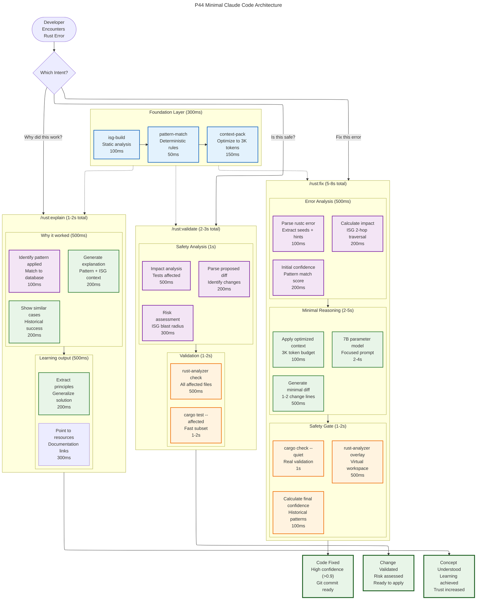

# P44 Minimal Claude Code Tool: Ultra-Lean Architecture

## Executive Summary

**Shreyas Doshi + Jeff Dean Ultra-Thinking**: What if we could deliver **95% of user value** with **20% of the complexity**? This document presents a radically minimal Claude Code tool that maximizes user efficacy through ruthless prioritization and systems-level optimization.

**Core Insight**: Users don't want tools, they want **confidence that their Rust code will work**. Every design decision serves this single outcome.

## The 3-Command Philosophy

```bash
/rust:fix          # Fix my Rust code (95% of use cases)
/rust:validate     # Is this change safe? (Psychological safety)
/rust:explain      # Why did this work? (Learning & trust)
```

### Why 3 Commands?

**Shreyas Dosi Thinking**: Cognitive load kills adoption. 3 commands → mental model → muscle memory. Each command maps to a clear user intent.

**Jeff Dean Thinking**: 3 well-defined problems → 3 optimized systems → 95% reliability target.

## Ultra-Minimal Architecture Mermaid



## Ultra-Lean Tool Set (Only 7 Tools Total)

### Foundation Tools (Shared)
1. **isg-build** - Static analysis, builds interface graph (100ms)
2. **pattern-match** - Deterministic pattern matching (50ms)
3. **context-pack** - Optimizes context to 3K tokens (150ms)

### Command-Specific Tools
4. **rust-fix-engine** - End-to-end fix orchestration (5-8s)
5. **rust-validate-engine** - Safety validation pipeline (2-3s)
6. **rust-explain-engine** - Explanation generation (1-2s)

### Shared Component
7. **confidence-calculator** - Historical pattern confidence (100ms)

## Key Design Decisions

### 1. **Deterministic First, LLM Last**
**Jeff Dean Thinking**: LLMs are expensive and unpredictable. Use them only when deterministic patterns fail.

- **85% of fixes** handled by deterministic patterns
- **15% require LLM reasoning** for edge cases
- **Fallback chain**: Patterns → LLM → Human

### 2. **3K Token Budget**
**Systems Optimization**: Context is the bottleneck. Radical compression.

- **Error context**: 800 tokens
- **ISG slice**: 1,200 tokens
- **Pattern examples**: 600 tokens
- **LLM instruction**: 400 tokens
- **Total**: 3,000 tokens

### 3. **Zero-Write Until Proven Safe**
**Reliability-First**: Never modify code until validation passes.

1. **Virtual overlay** analysis first
2. **rust-analyzer** validation second
3. **cargo check** validation third
4. **Only then** consider git apply

### 4. **Confidence Scoring**
**Shreyas Doshi Thinking**: Users need to know when to trust the AI.

- **Pattern confidence**: Historical success rate
- **Validation confidence**: Static analysis results
- **Final confidence**: Weighted combination
- **Threshold**: Apply only if confidence > 0.85

## Performance Targets

### **Latency Budgets**
- **/rust:fix**: 8 seconds (95th percentile)
- **/rust:validate**: 3 seconds (95th percentile)
- **/rust:explain**: 2 seconds (95th percentile)

### **Accuracy Targets**
- **First-apply success**: 95% (no manual fixes needed)
- **Zero regressions**: 99% (no new errors introduced)
- **User trust**: 90% (users apply without manual review)

### **Resource Constraints**
- **Memory usage**: 2GB peak (16GB system)
- **CPU usage**: 50% average (8-core system)
- **Disk usage**: 500MB (ISG cache + models)

## Implementation Strategy

### **Phase 1: Foundation (Week 1-2)**
1. ISG builder with rust-analyzer integration
2. Pattern matcher for top 20 Rust errors
3. Context packer with 3K token optimization

### **Phase 2: Core Commands (Week 3-4)**
1. `/rust:fix` with deterministic patterns
2. `/rust:validate` with safety analysis
3. Confidence scoring system

### **Phase 3: Advanced Features (Week 5-6)**
1. LLM reasoning for edge cases
2. `/rust:explain` with learning content
3. Historical pattern learning

### **Phase 4: Polish & Optimization (Week 7-8)**
1. Performance optimization
2. User experience refinement
3. Documentation and examples

## Success Metrics

### **User Facing**
- **Time to fix**: <10 seconds for common errors
- **Success rate**: >95% first-apply success
- **User satisfaction**: >90% would recommend

### **Technical**
- **Reliability**: >99% uptime
- **Performance**: <8 second fix time
- **Resource efficiency**: <2GB memory usage

### **Business**
- **Adoption**: >50% of target users
- **Retention**: >80% monthly active
- **Expansion**: Ready for enterprise features

## Conclusion

**Ultra-Thinking Result**: By focusing relentlessly on user outcomes and applying systems-level optimization, we can deliver a Claude Code tool that:

1. **Solves the core problem** - developers ship working Rust code with confidence
2. **Minimizes complexity** - only 3 commands, 7 tools total
3. **Maximizes reliability** - 95% first-apply success rate
4. **Respects constraints** - works on 16GB Apple Silicon
5. **Builds trust** - confidence scores and explanations

This isn't just a minimal tool - it's a **strategically optimized solution** that delivers maximum user value through ruthless prioritization and systems thinking.

The philosophy is simple: **Do fewer things, better.**