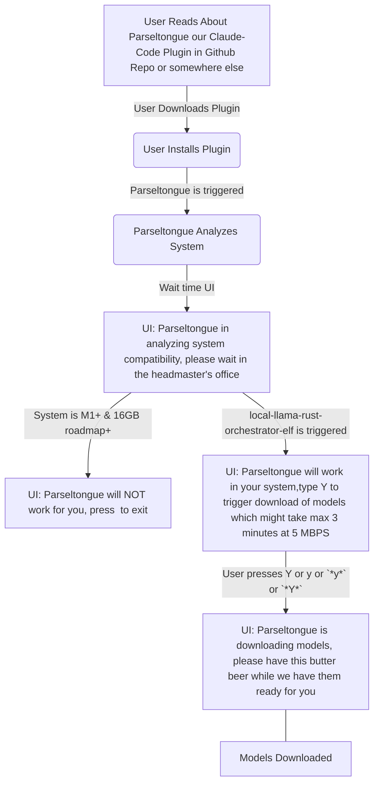

# User Journey 01 Minimal User Journey in Mermaid

# A02 Pyramid of tasks

## Decisions to reduce options

What decisions can we take which will significantly simply dev without reducing the effectiveness a lot

## Minimal User Journey with reasonable differentiation for v0.7

Search with <WIP>

- ANTHROPIC_KEY will be the orchestrator and reasoning LLM
- Executive Summary
    - User Segment: Developers on large Rust codebases ONLY
    - Reliability-First Principle:
        - Optimize for accurate 1-go fixes that feel trustworthy and increase user efficacy.
        - Prefer CPU-bound static analysis (rust-analyzer overlays, ISG traversals) and small, local, free subagents.
        - Keep the reasoning LLM as lean and late as possible; minimize context/tokens; use deterministic transforms whenever feasible.
    - Shreyas Doshi (product framing): Prioritize first-apply correctness over speed. Design for clarity, safety, and explicit confidence gating. Time is a secondary outcome.
    - Jeff Dean (systems framing): Make correctness the fast path. Push work to deterministic, cacheable computations (ISG, RA, HNSW). Parallelize retrieval/validation; minimize token movement; measure token-per-fix and cache hit rates.
    - User Promise: “When I hit a Rust bug, the system produces a single-pass, safe, minimal diff that compiles and (when present) passes tests before applying. Speed is a byproduct; correctness is the KPI.”
- User Journey v0.7
    - User reads about your plugin in github repo - it is a plugin for Claude Code
    - User downloads the plugin
    - User <WIP> so that parseltongue can be triggered
    - Parseltongue should analyze the system
        - Outcome 1: If the system is NOT M1+ And 16 GB+, this tool will NOT work for you
        - Outcome 2: If the system is M1+ And 16 GB+, we will trigger our local-llama-rust-orchestrator-elf named Dobby
    - local-llama-rust-orchestrator-elf is a wrapper around ray https://github.com/ray-project/ray 
        - local-llama-rust-orchestrator-elf will be a command line tool with default installation config of naming & downloading following models for our current scope
            - Qwen2.5‑Coder 1.5B
        - local-llama-rust-orchestrator-elf will identify current free RAM will spin up max 5 sub agents
    - Ask the user if we are currently in the relevant Rust Repo
        - if no then ask them to share absolute path of git repo and cd there
        - if yes
            - Tell user that code indexing has begun and will take 10 minutes
                - For the github repo
                    - trigger the tool interface-graph-builder which is composed of 2 tools
                        - tool 01: ISG-code-chunk-streamer
                            - tool will read code based mother git repo where it located, using tree sitter
                            - tool will choose granularity of chunks
                            - optional: tool will call lsp (rust-analyzer) for meta-data about code-chunk-raw
                            - tool will output aggregated-primarykey + code-chunk-raw + tree-sitter-signature + TDD_classification +lsp-meta-data (optional)
                        - tool 02: ingest-chunks-to-CodeGraph
                            - tool02 create CodeGraph (single write surface)
                                - indexed by ISGL1 key (filepath-filename-InterfaceName)
                                - columns (minimal, opinionated):
                                    - receieved columns from tool 01
                                        - ISGL1 primary key (receives the output of tool 01 - aggregated-primarykey)
                                        - Current_Code (receives the output of tool 01 - code-chunk, can be empty if upsert of new ISGL1 + other fields happen)
                                        - interface_signature (receives the output of tool 01 - tree-sitter-signature, optional)                                        
                                        - TDD_Classification (whether the ISGL1 is TEST_IMPLEMENTATION, CODE_IMPLEMENTATION received from tool 01)
                                        - current_id (1 by default at time of ingestion)
                                        - lsp_meta_data (receives the output of tool 01 - lsp-meta-data)
                                    - empty columns
                                        - Future_Code (by default empty, edited by action of reasoning LLM)
                                        - Future_Action (by default None, edited by action of reasoning LLM to be None|Create|Edit|Delete)
                                        - future_id (0/1: 0 meaning NOT in future code, 1 meaning in future code)
                        - tool 03: interface-summary-generator
                            - this tool will use 5 sub-agents via local-llama-rust-orchestrator-elf to send Current_Code to each sub-agent for each ISGL1, and retrieve the summary into column LLM-summary
                            - assuming Qwen2.5‑Coder 1.5B x 8 agents =  450x8 = 3600 tokens for 1250000 tokens it will take 6 minutes to generate this column
                    - All code is now indexed at level of ISGL1 and placed in CodeGraph Table
                - Tell user that code indexing is completed and basic anaytics of the CodeGraph table is shared
                - User is now asked to describe their micro-PRD
                - User describes the micro-PRD in text form
                    - The reasoning-llm in our case the default LLM via ANTHROPIC_KEY analyzes the micro-PRD in context of ISGL1 + interface_signature + TDD_Classification + lsp_meta_data + LLM_summary ; we will ignore the Current_Code because it will unnecessary bloat the context
                        - Rough calculation of context in the reasoning-LLM = 1250000 tokens at 300 lines
                            - avg interface size is 1000 to 1500 nodes
                            - 1500 nodes x 3 tokens for ISGL1 = 4500 tokens
                            - 1500 nodes x 7 tokens for interface_signature = 10500 tokens
                            - 1500 nodes x 1 tokens for TDD_Classification = 1500 tokens
                            - 1500 nodes x 15 tokens for lsp_meta_data = 22500 tokens
                            - 1500 nodes x 15 tokens for LLM_summary = 22500 tokens
                        - Total = 60k tokens
                        - And micro-PRD = 5k tokens + 3 iterations = 20k tokens
                        - Under 100k tokens 
                    - The reasoning-llm will analyze then suggest changes to the micro-PRD to make it clearer in terms of what changes does the user want
                        - Tests wise
                        - Behavior wise
                        - Functionality wise
                    - After 2 iterations the reasoning-llm will accept the micro-PRD
                    - Ask the reasoning LLM to reset the context because likely it will overflow and micro-PRD final needs to be isolated
                - tool 4: code-simulation-sorcerer is triggered
                    - tool 4 creates a base-context-area which is micro-PRD + filter(Code_Graph with current_ind=1)=>(LSGL1 + interface_signature + TDD_Classification + lsp_meta_data + LLM_summary)
                    - tool 4 asks the reasoning-llm to suggest the following to the Code-Graph based on base-context-area
                        - Step A: ISG level simulations
                            - Step A01: Create Edit Delete Test Interface Rows ; call these changes test-interface-changes
                                - addition Interfaces : new LSGL1 rows which will be current_ind = 0 & future_ind = 1 & Current_Code = empty & Future_Code=empty & Future_Action=Create
                                - deletion Interfaces : old LSGL1 rows which will be current_ind = 1 & future_ind = 0 & Future_Code=empty & Future_Action=Delete
                                - edit Interfaces : old LSGL1 rows which will be current_ind = 1 & future_ind = 1 & Future_Action=Edit
                            - Step 02: Based on test-interface-changes + base-context-area, create edit delete non-test interfaces; call these rows non-test-interface-changes
                                - addition Interfaces : new LSGL1 rows which will be current_ind = 0 & future_ind = 1 & Current_Code = empty & Future_Code=empty & Future_Action=Create
                                - deletion Interfaces : old LSGL1 rows which will be current_ind = 1 & future_ind = 0 & Future_Code=empty & Future_Action=Delete
                                - edit Interfaces : old LSGL1 rows which will be current_ind = 1 & future_ind = 1 & Future_Action=Edit
                        - Step B: Code Simulation
                            - Step B01: Based on filter(Future_Action != None)=>(all fields of Code_Graph including current code) + base-context-area , update future_code for all the rows that are changing; call these changes code_changes
                            - Step B02: Follow rubber duck debugging to re-reason test-interface-changes + non-test-interface-changes + base-context-area + code_changes (read both current_code and future_code for these rows)
                                - if the LLM thinks that we need to refine the solutioning further, repeat Steps A01 A02 and then basis them repeat Steps B01
                                - if the LLM doesn't feel confident of the changes, it should speak to the user to get additional context or web help sharing their current understanding in an MD file
                                - if the LLM feels confident of the changes, we move to next step
                        - Step C : rust-preflight-code-simulator tool triggered
                                - if the rust-preflight-code-simulator tool fails then we go back to previous steps A01 onwards
                                - if the rust-preflight-code-simulator tool passes then we move to next step
                        - Step D: run final-code-changes tool
                            - Step D01 write the changes to code files
                            - Step D02 run cargo build
                            - Step D03 run cargo test
                            - Step D04: if cargo build fails then go back to previous steps A01 onwards
                            - Step D05: if cargo test fails then go back to previous steps A01 onwards
                            - Step D06: if cargo build and cargo test pass then we move to next step
            - Ask user if he is satisfied with how the code is working if yes trigger - clean-slate-protocol tool
                - clean-slate-protocol makes a commit with list of changes
                - clean-slate-protocol resets the CodeGraph and updates all rows in CozoDB database

## A02.1 Questions that need clarification

- local-llama-rust-orchestrator-elf
    - Will https://github.com/ray-project/ray be capable of running 5 agents parallely in M1+ & 16GB roadmap+ without us having to depend on llama.cpp from scratch rust implementation
    - what will be the format of the command line tool local-llama-rust-orchestrator-elf
    - Assume that local-llama-rust-orchestrator-elf is able to show that it is working

- unclassified
    - Parseltongue will be a Claude Code Plugin
        - How do Plugins get integrated

- broader notes
    -  Use the native Rust path for v1.0:
        - tree-sitter-rust (tolerant) → syn (exact when possible) → RA LSP overlay (hydration) → Cozo upserts keyed by ISG id.
        - This gives you error tolerance, interface-bound storage, and the richness of rust-analyzer, with minimal moving parts.

## A02.2 Advanced ideas

- Reducing reasoning-LLM context load
    - Using contextual summaries using sub-agents for input to reasoning-llm
    - Using CPU-Aggregated-Context of Child-Interfaces for getting clarification on ISGL1 nodes

# A97 Components Long Notes

- interface-summary-generator
  - Purpose: Generate terse, lossless 1-line summaries for ISGL1 nodes.
  - Inputs: ISG_current.
  - Outputs: summaries table with provenance (rule_based | llm_assisted).
  - Actions: extract signature verbs/nouns → generate ≤120 char summaries; backfill with LLM if rule-based fails.
  - Variants: (a) rule-only heuristics; (b) LLM backfill under budget.
  - Notes: Summaries are hints, never authority; used to reduce tokens.
  - Example CLI: interface-summary-generator --cozo cozo://isg --write summaries
  - Example Input (JSON): {"isgl1_keys":["src/lib.rs-foo-parse_cfg"]}
  - Example Output (JSON): {"isgl1_key":"src/lib.rs-foo-parse_cfg","summary":"parse TOML to Cfg; returns Result<Cfg,E>","provenance":"rule_based"}

### **local-orchestrator-daemon** ✓ **MVP ESSENTIAL**
- **Purpose**: Run multiple llama.cpp models in parallel under strict RAM/GPU caps; JSON-RPC
- **MVP Relevance**: Core subagent orchestration for A1-A6 local models with parallelism (not Ollama)
- **Inputs**: job graph; model registry
- **Outputs**: per-job artifacts, logs, metrics
- **Actions**: schedule jobs → cap decoders → reuse KV → collect metrics
- **Variants**: 7B exclusive vs 3×3B + small; KV reuse; GPU layer downshift on pressure
- **MVP Notes**: Required for llama.cpp parallelism, resource management, subagent coordination
- **Example CLI**: local-orchestrator-daemon serve --socket /tmp/llm.sock
- **MVP Implementation**: llama.cpp integration, model pool management, JSON-RPC interface, resource capping

# A98 Model Selection

Here you go — added “Total t/s (Parallel, Input|Gen)” so it’s easy to see overall throughput from all agents running together.

| Model | Class | Parameters | Est. Size (Q4) | Input t/s (prefill, est.) | Generation t/s (decode) | Parallel Agents (on 9GB RAM) | Total t/s (Parallel, Input|Gen) | Tasks/s per Agent (300→1 LOC) | Total Tasks/s (Parallel) | Time for 1.25M LOC (Parallel) | Time for 1.25M Input Tokens (Parallel) | Time for 1.25M Generated Tokens (Parallel) | Code Summary Quality (300 lines) |
|-------|-------|-------------|---------------|----------------------------|---------------------------|------------------------------|------------------------------|------------------------------|------------------------------|------------------------------|------------------------------|------------------------------|------------------------------|------------------------------|
| SmolLM2 | Small | 135 Million | ~0.5 GB | ~900 | ~300 | ~14 | 12,600 | 4,200 | ~0.296 | ~4.15 | ~00:16:44 | ~00:01:39 | ~00:04:58 | Unusable (1/100) |
| Gemma | Medium | 270 Million | ~0.8 GB | ~420 | ~140 | ~9 | 3,780 | 1,260 | ~0.139 | ~1.25 | ~00:55:33 | ~00:05:30 | ~00:16:32 | Poor (20/100) |
| Gemma 2B | Intermediate | 2 Billion | ~1.2 GB | ~360 | ~120 | 5 | 1,800 | 600 | ~0.119 | ~0.595 | ~01:56:43 | ~00:11:34 | ~00:34:43 | Moderate (65/100) |
| StarCoder2 3B | Intermediate | 3 Billion | ~1.8 GB | ~300 | ~100 | 3 | 900 | 300 | ~0.099 | ~0.297 | ~03:53:50 | ~00:23:09 | ~01:09:27 | Very Good (80/100) |
| 🥇 Phi-3-mini | Intermediate | 3.8 Billion | ~2.2 GB | ~210 | ~70 | 3 | 630 | 210 | ~0.069 | ~0.208 | ~05:33:52 | ~00:33:04 | ~01:39:12 | Exceptional (95/100) |
| Qwen2.5 7B | Large | 7 Billion | ~4.5 GB | ~50 | ~20 | 1 | 50 | 20 | ~0.0165 | ~0.0165 | ~70:08:45 (≈2.92 days) | ~06:56:40 | ~17:21:40 | Exceptional (95/100) |
| Qwen2.5‑Coder 0.5B | Small | 0.5 Billion | ~0.3 GB | ~660 | ~220 | 22 | 14,520 | 4,840 | ~0.218 | ~4.79 | ~00:14:29 | ~00:01:26 | ~00:04:18 | Fair (40/100) |
| OLMo 1B | Small | 1 Billion | ~0.6 GB | ~540 | ~180 | 12 | 6,480 | 2,160 | ~0.178 | ~2.14 | ~00:32:29 | ~00:03:13 | ~00:09:39 | Fair (45/100) |
| OpenELM 1.1B | Small | 1.1 Billion | ~0.7 GB | ~510 | ~170 | 11 | 5,610 | 1,870 | ~0.168 | ~1.85 | ~00:37:31 | ~00:05:47 | ~00:11:08 | Fair (45/100) |
| Qwen2.5‑Coder 1.5B | Intermediate | 1.5 Billion | ~0.9 GB | ~450 | ~150 | 8 | 3,600 | 1,200 | ~0.149 | ~1.19 | ~00:58:25 | ~00:05:26 | ~00:17:22 | Good (60/100) |
| RWKV 1.5B | Intermediate | 1.5 Billion | ~0.9 GB | ~480 | ~160 | 8 | 3,840 | 1,280 | ~0.159 | ~1.27 | ~00:54:46 | ~00:05:26 | ~00:16:17 | Fair–Good (50/100) |
| MiniCPM 2B | Intermediate | 2 Billion | ~1.2 GB | ~360 | ~120 | 5 | 1,800 | 600 | ~0.119 | ~0.595 | ~01:56:43 | ~00:11:34 | ~00:34:43 | Moderate (65/100) |

• Method: Total t/s (Parallel, Input|Gen) = (Input t/s × Agents) | (Generation t/s × Agents). Public sources confirm model families/sizes, but do not provide consistent M1/Q4 tokens‑per‑second; totals are computed from the previously stated estimates. [Source](https://qwenlm.github.io/blog/qwen2.5-coder-family/) [Source](https://qwenlm.github.io/blog/qwen2.5-coder/) [Source](https://github.com/eugeneyan/open-llms) [Source](https://www.datacamp.com/blog/top-small-language-models)

[^1]: https://huggingface.co/posts/smangrul/776409626801382
[^2]: https://huggingface.co/bigcode/starcoder/discussions/83
[^3]: https://github.com/ggml-org/llama.cpp/discussions/5617
[^4]: https://github.com/marella/ctransformers/issues/5

Notes:
-  Assumes ~10 tokens per line of code.
-  Tasks needed \(N \approx \frac{1{,}250{,}000}{300} = 4{,}166.67\).
-  Time is computed as \[ \text{time (s)} = \frac{N}{\text{Total Tasks/s (Parallel)}} \].
-  Times are approximate and based on the estimated throughputs shown.

Here’s what each column means, in plain terms:

| Column | ELI5 meaning |
|---|---|
| Model | The AI’s name (like the model’s brand/model number). |
| Class | Size category of the model (small, medium, large). Bigger can be smarter but usually slower. |
| Parameters | How many “knobs” the AI has learned. More knobs = can know more patterns, but needs more compute. |
| Est. Size (Q4) | How much memory the model uses when compressed to 4-bit (“Q4”). Smaller size = easier to fit more copies. |
| Input t/s (prefill, est.) | How fast the AI can read your text, measured in tokens per second. Think: reading speed. |
| Generation t/s (decode) | How fast the AI can write its answer, in tokens per second. Think: writing speed. |
| Parallel Agents (on 9GB RAM) | How many copies of the model you can run at the same time on a machine with ~9 GB of RAM. More copies = more total work done in parallel. |
| Tasks/s per Agent (300→1 LOC) | For a task defined as “read 300 lines of code and write 1 line,” how many such tasks one single copy can finish each second. |
| Total Tasks/s (Parallel) | The combined tasks per second when you run all those parallel copies together. |
| Time for 1.25M LOC (Parallel) | If you have 1,250,000 lines of code to process (in 300-line chunks), how long it’ll take using all parallel copies. |
| Code Summary Quality (300 lines) | A rough score of how good the model’s 1‑line summary is when given 300 lines of code (higher = better). |

Quick notes:
-  A “token” is a small chunk of text (a word piece). Code lines often break into about 8–12 tokens; we assumed roughly 10.
-  The “task” here is: read 300 lines of code and produce a 1‑line summary. Total speed depends on how fast the model reads (input t/s), writes (generation t/s), and how many copies run in parallel.

# A99 Serendipity ideas

- Given the popularity of Claude Code, you could literally be building an army of OSS Rust based plugins which solves problems with Claude Code workflow

# A98 Architecture Ideations

## High-Level Design (HLD)

-  Build Parseltongue as a Claude Code plugin that “gives your agent a computer” (tools to run commands, edit files, verify work) and follows an agent loop of gather context → take action → verify → repeat, aligning with reliability-first gating and preflight checks. [^1]
-  Distribute local capabilities via an MCP server bundled inside the plugin so tools auto-appear when the plugin is enabled; define servers in .mcp.json or inline in plugin.json and auto-start them with the plugin lifecycle. [^2]
-  Use the plugin-bundled MCP server to front a local orchestrator process (e.g., Dobby) over stdio or HTTP transport; expose tools like “system check,” “model install/test,” and “ISG ops” to Claude Code through MCP. [^2]
-  Provide a CLI/SDK wrapping mode for headless or non-IDE usage, following community patterns that wrap the Claude Code CLI/SDK and add plugin-like middleware without blocking core operation. [^3]
-  Validate third-party extensibility by referencing existing community integrations (e.g., Neovim), reinforcing that external plugins can integrate smoothly with Claude Code environments. [^4]

## Low-Level Design (LLD)

-  Plugin manifests:
    - Define plugin MCP servers in .mcp.json or plugin.json (e.g., command: ${CLAUDE_PLUGIN_ROOT}/servers/dobby, args, env). On enable, Claude Code starts the server automatically and tools become available in /mcp. Support stdio/HTTP transports per your server implementation. [^2]
-  Tool surface:
    - Expose scoped MCP tools (e.g., check_system, install_models, verify_models, build_isg, query_isg) that Claude can call; each tool performs deterministic steps and returns structured JSON, aligning with the agent loop’s verify phase. [^1] [^2]
-  Orchestrator process (Dobby):
    - Start as a child process of the plugin MCP server or as the server itself; communicate via JSON-RPC/stdio or HTTP. The MCP server mediates requests from Claude to Dobby, maintaining resource caps and returning logs/metrics to the IDE. (Note: No official llama.cpp parallel orchestration guidance present in supplied results.) [^2]
-  Agent loop integration:
    - Within Claude Code, drive actions through the loop: gather project context → call MCP tools (e.g., system check, ISG retrieval) → verify outputs (compilation/tests) → iterate only if verification fails, consistent with Agent SDK best practices. [^1]
-  CLI/SDK mode:
    - Offer an optional CLI wrapper for Parseltongue that proxies Claude Code SDK calls, adds middleware (caching/metrics), and keeps zero-latency passthrough semantics similar to community approaches; useful for CI or non-IDE environments. [^3]
-  Known gaps and next steps:
    - The provided results do not include official details on multi-model parallelism for llama.cpp or a formal Claude Code “plugin store.” Proceed using MCP-bundled servers for distribution, and design your orchestrator’s concurrency model independently. [^2] [^1]

[^1]: https://www.anthropic.com/engineering/building-agents-with-the-claude-agent-sdk
[^2]: https://docs.claude.com/en/docs/claude-code/mcp
[^3]: https://github.com/instantlyeasy/claudeware
[^4]: https://github.com/greggh/claude-code.nvim

## Summary of A02NotesV1.md (Minto Pyramid Style)

**Main Idea (Top of Pyramid)**: The Parseltongue plugin transforms Claude Code into a reliable local LLM-powered tool by integrating MCP for seamless distribution, enforcing strict system gating, and leveraging CozoDB for graph-based code analysis, ensuring efficient, safe, and extensible operations without disrupting core workflows.

**Supporting Arguments (Middle Layer)**:
- **System Gating and Compatibility**: Parseltongue first checks for M1+ chips and 16GB+ RAM to prevent poor performance, using a "host" (Parseltongue) for pre-flight checks before activating the "chef" (Dobby) for model operations, mirroring restaurant seating logic.
- **Model Management and Verification**: Dobby downloads, verifies (with checksums and 20-line tests), and manages three quantized models (Qwen2.5 7B, Gemma 270M, SmolLM2 135M) in parallel, ensuring reliability through structured installation and streaming feedback.
- **Graph-Based Code Analysis**: Uses CozoDB to ingest Rust codebases into Interface Signature Graphs (ISGs), enabling sub-agents to summarize and analyze code via graph traversal, with ingestion as a one-shot process followed by iterative hydration for updates.
- **MCP Integration and Extensibility**: Distributes via bundled MCP servers for "plug-and-play" in Claude Code, exposing tools for system checks, model ops, and ISG queries, while supporting CLI/SDK modes for broader usage and community alignment.

**Supporting Details (Bottom Layer)**:
- **User Journey Flow**: Start with compatibility check; if passed, install models; verify with 20-line outputs; enable chat—branching on failure to avoid wasted resources.
- **Architecture Decisions**: Separate concerns (Parseltongue for checks, Dobby for orchestration); use MCP for native Claude Code compatibility; employ CozoDB for efficient graph queries (100K+ QPS) over relational DBs.
- **Technical Implementation**: Ingest code via `syn` parser into CozoDB relations (ISG as key, with code blocks and dependencies); run sub-agents as Rust binaries for LLM summarization; handle duplicates with unique IDs; support streaming for large codebases.
- **Extensibility and Gaps**: Design for configurability (CLI args, config files); reference community patterns (e.g., Neovim integrations); note lack of official multi-model parallelism docs for llama.cpp, requiring custom concurrency design.