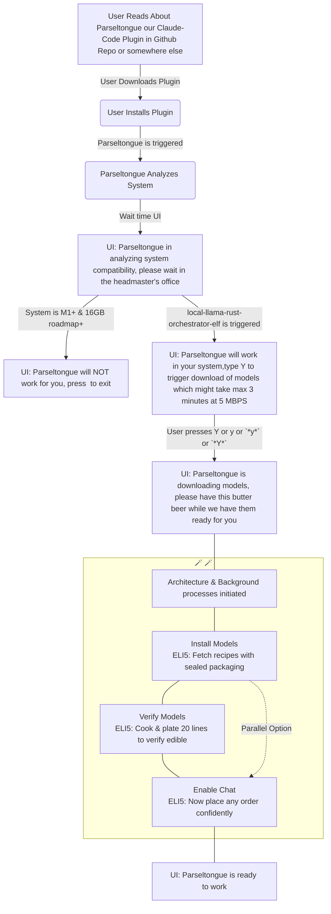

# User Journey 01 Minimal User Journey in Mermaid

Scope for Parseltongue v1.0

Use this as a filter for Rust Tools or Libraries you are ideating as part of building the Parseltongue plugin or skill or something for Claude Code

# A01 Initial Scope

- ANTHROPIC_KEY will be the orchestrator and reasoning LLM
- Executive Summary
    - User Segment: Developers on large Rust codebases ONLY
    - Reliability-First Principle:
        - Optimize for accurate 1-go fixes that feel trustworthy and increase user efficacy.
        - Prefer CPU-bound static analysis (rust-analyzer overlays, ISG traversals) and small, local, free subagents.
        - Keep the reasoning LLM as lean and late as possible; minimize context/tokens; use deterministic transforms whenever feasible.
    - Shreyas Doshi (product framing): Prioritize first-apply correctness over speed. Design for clarity, safety, and explicit confidence gating. Time is a secondary outcome.
    - Jeff Dean (systems framing): Make correctness the fast path. Push work to deterministic, cacheable computations (ISG, RA, HNSW). Parallelize retrieval/validation; minimize token movement; measure token-per-fix and cache hit rates.
    - User Promise: “When I hit a Rust bug, the system produces a single-pass, safe, minimal diff that compiles and (when present) passes tests before applying. Speed is a byproduct; correctness is the KPI.”

- Constraints of tech stack
    - llama.cpp because Ollama does not allow parallelism
    - CozoDB because it is a graph database
    - We will be based on Claude Code as a plugin or skill or something because we want to focus on the core differentiation which is ISG & similar Aggregated Code Context which can ensure reliable bug solving with high accuracy
        - Hence ideally whatever we want to be part of Parseltongue could be a Cargo Library or Tool, it ensures we can experminent with combination permutations
        - We need to FOCUS HARD on MVP 1.0 Scope and note down everything else as Backlog
    - Core Data Model: Interface Signature Graph (ISG)
        - Nodes: function signatures, impl blocks, trait items, types, public APIs, macro-expanded interfaces.
        - Edges: CALLS, IMPLEMENTS, USES, DEPENDS, REQUIRES_BOUND, FEATURE_GATED_BY.
        - Levels: ISGL1 (interface node keyed as filepath-filename-InterfaceName, 1 level below file/module), ISGL2/ISGL3 are constituents under ISGL1 used for understanding only.
        - Store: CozoDB (Datalog + HNSW) with columnar payloads for fast filters and range scans.
    - CodeGraph (single write surface)
        - indexed by ISGL1 key (filepath-filename-InterfaceName)
        - columns (minimal, opinionated):
            - Current_Code (canonical pre-edit slice),
            - Future_Code (candidate patch slice, ephemeral until approval),
            - Future_Action (None|Create|Edit|Delete),
            - TDD_Classification (TEST_IMPLEMENTATION, CODE_IMPLEMENTATION)
            - current_id (0/1: 0 meaning NOT in current code, 1 meaning in current code),
            - future_id (0/1: 0 meaning NOT in future code, 1 meaning in future code)
        - Rule: All code-iteration writes happen only in CodeGraph. All other CozoDB tables (ISG nodes/edges, embeddings, pattern KB indices) are read-only context stores and never mutate code.
        - Flow: PreFlight compiles Future_Code via RA overlay; on approval, flip Future→Current, clear future_* flags
    - Many types of ISGs can be created
        - ISGL1 (interface node keyed as filepath-filename-InterfaceName, 1 level below file/module)
        - ISGL2 is 1 extra distance below file / module for e.g. if a function is inside main function in main.rs that will be ISGL3
        - ISGL3 is 1 extra distance below ISGL2 for e.g. if a function is inside main function and then further inside another function in main.rs that will be ISGL3
        - ISGs are a proxy for what we called Aggregated Code Context
            - It is not just about interface signatures, it can be any pyramidal way to aggregate the codebase
            - for e.g. we can using sub-agents generically summarize all ISGL1 related code blobs to 1 liner summaries, and that will be significantly HQ code context and much lesser than the actual codebase
                - a variation of this can be running small agents with context of the PRD
            - for e.g. we can try to get HIR or other Rust analyzer meta-data for all ISGL1 related code blobs and that will be significantly HQ code context and much lesser than the actual codebase
- Local LLM Subagents Function Types (can be more)
    - A1 Seeder: error parsing → seeds + hints (no R1).
    - A2 ExactRetriever: ISG Datalog 2-hop traversal with filters; cap 30 nodes/hop.
    - A3 VectorRetriever
    - A4 AntiPatternDetector
    - A5 PatternRecognizer
    - A6 ConstraintEnforcer
    - R1 Reasoner
    - Can be more
- More ideas
    - rust-analyzer overlay: didOpen ephemeral buffers → publishDiagnostics; fail on Error severity.
    - Gate: No I/O writes until PreFlight passes and user approves.
    - llama.cpp + Metal for GGUF models; pinned CPU threads, tuned GPU layers for 2–7B.
    - Tokio runtime for orchestration; bounded task queues; cooperative yields to keep UI responsive.

- Appendix A: Local Model Matrix (indicative)
    - 22–50M encoder (Q4) — 50–150 MB.
    - MiniLM 22M (Q4) — ~40–80 MB.
    - SmolLM2 135M (Q4) — ~300–500 MB.
    - Gemma 270M (Q4) — ~600–800 MB.
    - Qwen2.5 7B (Q4_K_M) — ~4.5–6.5 GB VRAM-equivalent on Metal

# A02 Pyramid of tasks

## Decisions to reduce options

What decisions can we take which will significantly simply dev without reducing the effectiveness a lot

- Parseltongue will be a Claude Code Plugin
    - How do Plugins get integrated

## Minimal User Journey with reasonable differentiation

Search with <WIP>

- User reads about your plugin in github repo
- User downloads the plugin
- User <WIP> so that parseltongue can be triggered
- Parseltongue should analyze the system
    - Outcome 1: If the system is NOT M1+ And 16 GB+, this tool will NOT work for you
    - Outcome 2: If the system is M1+ And 16 GB+, we will trigger our local-llama-rust-orchestrator-elf named Dobby
- local-llama-rust-orchestrator-elf will be a command line tool with default installation config of naming & downloading following models
    - Large Model List: Qwen2.5 7B (Q4_K_M)
    - Medium Model List: Gemma 270M (Q4) — ~600–800 MB
    - Small Model List: SmolLM2 135M (Q4) — ~300–500 MB.
- local-llama-rust-orchestrator-elf will prove that all 3 models are working by automatically triggering a default prompt of 20 lines of output and showing the 3 of them to the user in chat

### Components identified

#### **local-orchestrator-daemon** ✓ **MVP ESSENTIAL**
- **Purpose**: Run multiple llama.cpp models in parallel under strict RAM/GPU caps; JSON-RPC
- **MVP Relevance**: Core subagent orchestration for A1-A6 local models with parallelism (not Ollama)
- **Inputs**: job graph; model registry
- **Outputs**: per-job artifacts, logs, metrics
- **Actions**: schedule jobs → cap decoders → reuse KV → collect metrics
- **Variants**: 7B exclusive vs 3×3B + small; KV reuse; GPU layer downshift on pressure
- **MVP Notes**: Required for llama.cpp parallelism, resource management, subagent coordination
- **Example CLI**: local-orchestrator-daemon serve --socket /tmp/llm.sock
- **MVP Implementation**: llama.cpp integration, model pool management, JSON-RPC interface, resource capping

# A99 Serendipity ideas

- Given the popularity of Claude Code, you could literally be building an army of OSS Rust based plugins which solves problems with Claude Code workflow