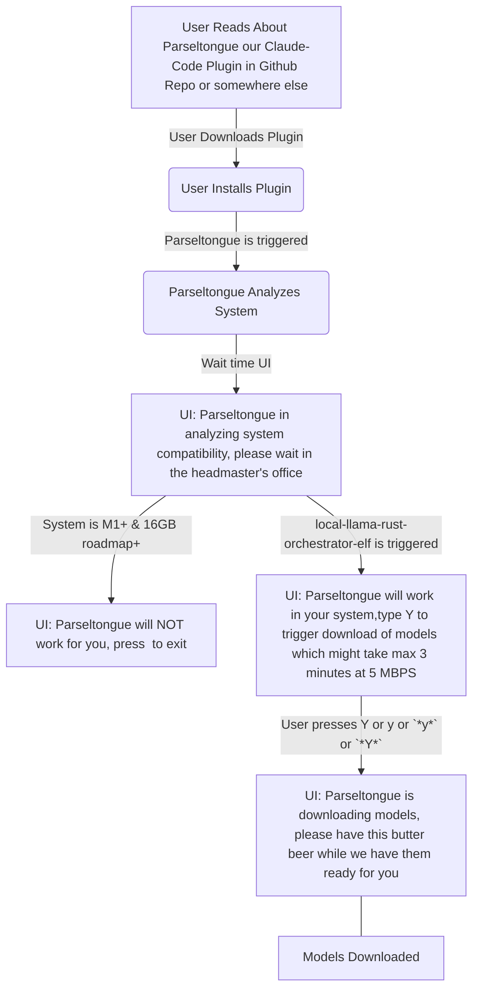

# User Journey 01 Minimal User Journey in Mermaid

# A02 Pyramid of tasks

## Decisions to reduce options

What decisions can we take which will significantly simply dev without reducing the effectiveness a lot

## Minimal User Journey with reasonable differentiation for v0.7

Search with <WIP>

- ANTHROPIC_KEY will be the orchestrator and reasoning LLM
- Executive Summary
    - User Segment: Developers on large Rust codebases ONLY
    - Reliability-First Principle:
        - Optimize for accurate 1-go fixes that feel trustworthy and increase user efficacy.
        - Prefer CPU-bound static analysis (rust-analyzer overlays, ISG traversals) and small, local, free subagents.
        - Keep the reasoning LLM as lean and late as possible; minimize context/tokens; use deterministic transforms whenever feasible.
    - Shreyas Doshi (product framing): Prioritize first-apply correctness over speed. Design for clarity, safety, and explicit confidence gating. Time is a secondary outcome.
    - Jeff Dean (systems framing): Make correctness the fast path. Push work to deterministic, cacheable computations (ISG, RA, HNSW). Parallelize retrieval/validation; minimize token movement; measure token-per-fix and cache hit rates.
    - User Promise: “When I hit a Rust bug, the system produces a single-pass, safe, minimal diff that compiles and (when present) passes tests before applying. Speed is a byproduct; correctness is the KPI.”
- User Journey v0.7
    - User reads about your plugin in github repo - it is a plugin for Claude Code
    - User downloads the plugin
    - User <WIP> so that parseltongue can be triggered
    - Parseltongue should analyze the system
        - Outcome 1: If the system is NOT M1+ And 16 GB+, this tool will NOT work for you
        - Outcome 2: If the system is M1+ And 16 GB+, we will trigger our local-llama-rust-orchestrator-elf named Dobby
    - local-llama-rust-orchestrator-elf is a wrapper around https://github.com/ray-project/ray 
        - local-llama-rust-orchestrator-elf will be a command line tool with default installation config of naming & downloading following models for our current scope
            - StarCoder2 3B
        - local-llama-rust-orchestrator-elf will identify current free RAM will spin up max 5 sub agents
    - Ask the user if we are currently in the relevant Rust Repo
        - if no then ask them to share absolute path of git repo and cd there
        - if yes
            - Tell user that code indexing has begun and will take 10 minutes
                - For the github repo
                    - trigger the tool interface-graph-builder which is composed of 2 tools
                        - tool 01: ISG-code-chunk-streamer
                            - tool will read code based mother git repo where it located, using tree sitter
                            - tool will choose granularity of chunks
                            - optional: tool will call lsp (rust-analyzer) for meta-data about code-chunk-raw
                            - tool will output aggregated-primarykey + code-chunk-raw + tree-sitter-signature + TDD_classification +lsp-meta-data (optional)
                        - tool 02: ingest-chunks-to-CodeGraph
                            - tool02 create CodeGraph (single write surface)
                                - indexed by ISGL1 key (filepath-filename-InterfaceName)
                                - columns (minimal, opinionated):
                                    - receieved columns from tool 01
                                        - ISGL1 primary key (receives the output of tool 01 - aggregated-primarykey)
                                        - Current_Code (receives the output of tool 01 - code-chunk, can be empty if upsert of new ISGL1 + other fields happen)
                                        - interface_signature (receives the output of tool 01 - tree-sitter-signature, optional)                                        
                                        - TDD_Classification (whether the ISGL1 is TEST_IMPLEMENTATION, CODE_IMPLEMENTATION received from tool 01)
                                        - current_id (1 by default at time of ingestion)
                                        - lsp_meta_data (receives the output of tool 01 - lsp-meta-data)
                                    - empty columns
                                        - Future_Code (by default empty, edited by action of reasoning LLM)
                                        - Future_Action (by default None, edited by action of reasoning LLM to be None|Create|Edit|Delete)
                                        - future_id (0/1: 0 meaning NOT in future code, 1 meaning in future code)
                    - All code is now indexed at level of ISGL1 and placed in CodeGraph Table
                - Tell user that code indexing is completed and basic anaytics of the CodeGraph table is shared
                - User is now asked to describe their micro-PRD
                - User describes the micro-PRD in text form
                    - The reasoning-llm in our case the default LLM via ANTHROPIC_KEY analyzes the micro-PRD in context of ISGL1 + interface_signature + TDD_Classification + lsp_meta_data ; we will ignore the Current_Code because it will unnecessary bloat the context
                    - The reasoning-llm will analyze then suggest changes to the micro-PRD to make it clearer in terms of what changes does the user want
                        - Tests wise
                        - Behavior wise
                        - Functionality wise
                    - After 2 iterations the reasoning-llm will accept the micro-PRD
                - tool 3: code-simulation-sorcerer is triggered
                    - tool 3 creates a base-context-area which is micro-PRD + filter(current_ind=1)>(LSGL1 + interface_signature + TDD_Classification + lsp_meta_data)
                    - tool 3 asks the reasoning-llm to suggest the following to the Code-Graph based on base-context-area
                        - Step 01: Create Edit Delete Test Interface Rows ; call these changes test-interface-changes
                            - addition Interfaces : new LSGL1 rows which will be current_ind = 0 & future_ind = 1 & Current_Code = empty & Future_Code=empty & Future_Action=Create
                            - deletion Interfaces : old LSGL1 rows which will be current_ind = 1 & future_ind = 0 & Future_Code=empty & Future_Action=Delete
                            - edit Interfaces : old LSGL1 rows which will be current_ind = 1 & future_ind = 1 & Future_Action=Edit
                        - Step 02: Based on test-interface-changes + base-context-area, create edit delete non-test interfaces; call these rows non-test-interface-changes
                            - addition Interfaces : new LSGL1 rows which will be current_ind = 0 & future_ind = 1 & Current_Code = empty & Future_Code=empty & Future_Action=Create
                            - deletion Interfaces : old LSGL1 rows which will be current_ind = 1 & future_ind = 0 & Future_Code=empty & Future_Action=Delete
                            - edit Interfaces : old LSGL1 rows which will be current_ind = 1 & future_ind = 1 & Future_Action=Edit
                        - Step 03: Based on test-interface-changes + non-test-interface-changes + base-context-area, update future_code for test-interface-changes
                            - update future_code for non-test-interface-changes
                        - Step 04: 

                - now reflect these ISG_future changes in the CozoDB database in ISG_current_ind, ISG_future_ind, Future_Code and Future_Action columns
                - now use the rubber duck debugging menthod to look at ISG_current + PRD + ISG_future + those rows in CozoDB database which have Future_Code and Future_Action columns as not null
                - if the LLM thinks that we need to refine the solutioning further, make changes to ISG_future and repeat the process
                - if the LLM thinks that we need to refine the PRD further then go back to previous step
                - if finally the LLM feels very confident of the changes, we reflect the changes in the CozoDB database in the codebase
                - now we run all the tests and compile the codebase
                - if the tests fail then we go back to previous step
                - if the tests pass then we show the visualization of changes in ISG to the user + results of compilation + tests + request behavorial confirmation
                - if user gives go ahead then we
                    - make a commit with list of changes
                    - recreate ISG_current from ISG_future; update the CozoDB database according to the current codebase from scratch

## A02.1 Questions that need clarification

- local-llama-rust-orchestrator-elf
    - Will https://github.com/ray-project/ray be capable of running 5 agents parallely in M1+ & 16GB roadmap+ without us having to depend on llama.cpp from scratch rust implementation
    - what will be the format of the command line tool local-llama-rust-orchestrator-elf
    - Assume that local-llama-rust-orchestrator-elf is able to show that it is working

- unclassified
    - Parseltongue will be a Claude Code Plugin
        - How do Plugins get integrated

- broader notes
    -  Use the native Rust path for v1.0:
        - tree-sitter-rust (tolerant) → syn (exact when possible) → RA LSP overlay (hydration) → Cozo upserts keyed by ISG id.
        - This gives you error tolerance, interface-bound storage, and the richness of rust-analyzer, with minimal moving parts.

# A03 Initial Scope

Scope for Parseltongue v1.0

Use this as a filter for Rust Tools or Libraries you are ideating as part of building the Parseltongue plugin or skill or something for Claude Code

- ANTHROPIC_KEY will be the orchestrator and reasoning LLM
- Executive Summary
    - User Segment: Developers on large Rust codebases ONLY
    - Reliability-First Principle:
        - Optimize for accurate 1-go fixes that feel trustworthy and increase user efficacy.
        - Prefer CPU-bound static analysis (rust-analyzer overlays, ISG traversals) and small, local, free subagents.
        - Keep the reasoning LLM as lean and late as possible; minimize context/tokens; use deterministic transforms whenever feasible.
    - Shreyas Doshi (product framing): Prioritize first-apply correctness over speed. Design for clarity, safety, and explicit confidence gating. Time is a secondary outcome.
    - Jeff Dean (systems framing): Make correctness the fast path. Push work to deterministic, cacheable computations (ISG, RA, HNSW). Parallelize retrieval/validation; minimize token movement; measure token-per-fix and cache hit rates.
    - User Promise: “When I hit a Rust bug, the system produces a single-pass, safe, minimal diff that compiles and (when present) passes tests before applying. Speed is a byproduct; correctness is the KPI.”

- Constraints of tech stack
    - llama.cpp because Ollama does not allow parallelism
    - CozoDB because it is a graph database
    - We will be based on Claude Code as a plugin or skill or something because we want to focus on the core differentiation which is ISG & similar Aggregated Code Context which can ensure reliable bug solving with high accuracy
        - Hence ideally whatever we want to be part of Parseltongue could be a Cargo Library or Tool, it ensures we can experminent with combination permutations
        - We need to FOCUS HARD on MVP 1.0 Scope and note down everything else as Backlog
    - Core Data Model: Interface Signature Graph (ISG)
        - Nodes: function signatures, impl blocks, trait items, types, public APIs, macro-expanded interfaces.
        - Edges: CALLS, IMPLEMENTS, USES, DEPENDS, REQUIRES_BOUND, FEATURE_GATED_BY.
        - Levels: ISGL1 (interface node keyed as filepath-filename-InterfaceName, 1 level below file/module), ISGL2/ISGL3 are constituents under ISGL1 used for understanding only.
        - Store: CozoDB (Datalog + HNSW) with columnar payloads for fast filters and range scans.
    - CodeGraph (single write surface)
        - indexed by ISGL1 key (filepath-filename-InterfaceName)
        - columns (minimal, opinionated):
            - Current_Code (canonical pre-edit slice),
            - Future_Code (candidate patch slice, ephemeral until approval),
            - Future_Action (None|Create|Edit|Delete),
            - TDD_Classification (TEST_IMPLEMENTATION, CODE_IMPLEMENTATION)
            - current_id (0/1: 0 meaning NOT in current code, 1 meaning in current code),
            - future_id (0/1: 0 meaning NOT in future code, 1 meaning in future code)
        - Rule: All code-iteration writes happen only in CodeGraph. All other CozoDB tables (ISG nodes/edges, embeddings, pattern KB indices) are read-only context stores and never mutate code.
        - Flow: PreFlight compiles Future_Code via RA overlay; on approval, flip Future→Current, clear future_* flags
    - Many types of ISGs can be created
        - ISGL1 (interface node keyed as filepath-filename-InterfaceName, 1 level below file/module)
        - ISGL2 is 1 extra distance below file / module for e.g. if a function is inside main function in main.rs that will be ISGL3
        - ISGL3 is 1 extra distance below ISGL2 for e.g. if a function is inside main function and then further inside another function in main.rs that will be ISGL3
        - ISGs are a proxy for what we called Aggregated Code Context
            - It is not just about interface signatures, it can be any pyramidal way to aggregate the codebase
            - for e.g. we can using sub-agents generically summarize all ISGL1 related code blobs to 1 liner summaries, and that will be significantly HQ code context and much lesser than the actual codebase
                - a variation of this can be running small agents with context of the PRD
            - for e.g. we can try to get HIR or other Rust analyzer meta-data for all ISGL1 related code blobs and that will be significantly HQ code context and much lesser than the actual codebase
- Local LLM Subagents Function Types (can be more)
    - A1 Seeder: error parsing → seeds + hints (no R1).
    - A2 ExactRetriever: ISG Datalog 2-hop traversal with filters; cap 30 nodes/hop.
    - A3 VectorRetriever
    - A4 AntiPatternDetector
    - A5 PatternRecognizer
    - A6 ConstraintEnforcer
    - R1 Reasoner
    - Can be more
- More ideas
    - rust-analyzer overlay: didOpen ephemeral buffers → publishDiagnostics; fail on Error severity.
    - Gate: No I/O writes until PreFlight passes and user approves.
    - llama.cpp + Metal for GGUF models; pinned CPU threads, tuned GPU layers for 2–7B.
    - Tokio runtime for orchestration; bounded task queues; cooperative yields to keep UI responsive.

- Appendix A: Local Model Matrix (indicative)
    - 22–50M encoder (Q4) — 50–150 MB.
    - MiniLM 22M (Q4) — ~40–80 MB.
    - SmolLM2 135M (Q4) — ~300–500 MB.
    - Gemma 270M (Q4) — ~600–800 MB.
    - Qwen2.5 7B (Q4_K_M) — ~4.5–6.5 GB VRAM-equivalent on Metal

# A97 Components Long Notes

- interface-summary-generator
  - Purpose: Generate terse, lossless 1-line summaries for ISGL1 nodes.
  - Inputs: ISG_current.
  - Outputs: summaries table with provenance (rule_based | llm_assisted).
  - Actions: extract signature verbs/nouns → generate ≤120 char summaries; backfill with LLM if rule-based fails.
  - Variants: (a) rule-only heuristics; (b) LLM backfill under budget.
  - Notes: Summaries are hints, never authority; used to reduce tokens.
  - Example CLI: interface-summary-generator --cozo cozo://isg --write summaries
  - Example Input (JSON): {"isgl1_keys":["src/lib.rs-foo-parse_cfg"]}
  - Example Output (JSON): {"isgl1_key":"src/lib.rs-foo-parse_cfg","summary":"parse TOML to Cfg; returns Result<Cfg,E>","provenance":"rule_based"}

### **local-orchestrator-daemon** ✓ **MVP ESSENTIAL**
- **Purpose**: Run multiple llama.cpp models in parallel under strict RAM/GPU caps; JSON-RPC
- **MVP Relevance**: Core subagent orchestration for A1-A6 local models with parallelism (not Ollama)
- **Inputs**: job graph; model registry
- **Outputs**: per-job artifacts, logs, metrics
- **Actions**: schedule jobs → cap decoders → reuse KV → collect metrics
- **Variants**: 7B exclusive vs 3×3B + small; KV reuse; GPU layer downshift on pressure
- **MVP Notes**: Required for llama.cpp parallelism, resource management, subagent coordination
- **Example CLI**: local-orchestrator-daemon serve --socket /tmp/llm.sock
- **MVP Implementation**: llama.cpp integration, model pool management, JSON-RPC interface, resource capping

# A98 Model Selection

| Model    | Class | Parameters   | Est. Size (Q4) | Single Agent Speed (t/s on M1) | Parallel Agents (on 9GB RAM) | Total Indexing Throughput | Code Summary Quality (300 lines) |
|----------|-------|--------------|----------------|--------------------------------|------------------------------|---------------------------|------------------------------|
| SmolLM2  | Small | 135 Million  | ~0.5 GB       | ~300 t/s                       | ~14 Agents                  | >4000 t/s                 | Unusable (1/100)             |
| Gemma     | Medium| 270 Million  | ~0.8 GB       | ~140 t/s                       | ~9 Agents                   | >1200 t/s                 | Poor (20/100)                |
| Gemma 2B  | Intermediate| 2 Billion| ~1.2 GB       | ~120 t/s                       | 5 Agents                    | ~600 t/s                  | Moderate (65/100)            |
| StarCoder2 3B| Intermediate| 3 Billion| ~1.8 GB       | ~100 t/s                       | 3 Agents                    | ~300 t/s                  | Very Good (80/100)          |
| 🥇 Phi-3-mini| Intermediate| 3.8 Billion| ~2.2 GB       | ~70 t/s                        | 3 Agents                    | ~210 t/s                  | Exceptional (95/100)         |
| Qwen2.5 7B | Large| 7 Billion    | ~4.5 GB       | ~20 t/s                        | 1 Agent                     | ~20 t/s                   | Exceptional (95/100)         |

# A99 Serendipity ideas

- Given the popularity of Claude Code, you could literally be building an army of OSS Rust based plugins which solves problems with Claude Code workflow

# A98 Architecture Ideations

## High-Level Design (HLD)

-  Build Parseltongue as a Claude Code plugin that “gives your agent a computer” (tools to run commands, edit files, verify work) and follows an agent loop of gather context → take action → verify → repeat, aligning with reliability-first gating and preflight checks. [^1]
-  Distribute local capabilities via an MCP server bundled inside the plugin so tools auto-appear when the plugin is enabled; define servers in .mcp.json or inline in plugin.json and auto-start them with the plugin lifecycle. [^2]
-  Use the plugin-bundled MCP server to front a local orchestrator process (e.g., Dobby) over stdio or HTTP transport; expose tools like “system check,” “model install/test,” and “ISG ops” to Claude Code through MCP. [^2]
-  Provide a CLI/SDK wrapping mode for headless or non-IDE usage, following community patterns that wrap the Claude Code CLI/SDK and add plugin-like middleware without blocking core operation. [^3]
-  Validate third-party extensibility by referencing existing community integrations (e.g., Neovim), reinforcing that external plugins can integrate smoothly with Claude Code environments. [^4]

## Low-Level Design (LLD)

-  Plugin manifests:
    - Define plugin MCP servers in .mcp.json or plugin.json (e.g., command: ${CLAUDE_PLUGIN_ROOT}/servers/dobby, args, env). On enable, Claude Code starts the server automatically and tools become available in /mcp. Support stdio/HTTP transports per your server implementation. [^2]
-  Tool surface:
    - Expose scoped MCP tools (e.g., check_system, install_models, verify_models, build_isg, query_isg) that Claude can call; each tool performs deterministic steps and returns structured JSON, aligning with the agent loop’s verify phase. [^1] [^2]
-  Orchestrator process (Dobby):
    - Start as a child process of the plugin MCP server or as the server itself; communicate via JSON-RPC/stdio or HTTP. The MCP server mediates requests from Claude to Dobby, maintaining resource caps and returning logs/metrics to the IDE. (Note: No official llama.cpp parallel orchestration guidance present in supplied results.) [^2]
-  Agent loop integration:
    - Within Claude Code, drive actions through the loop: gather project context → call MCP tools (e.g., system check, ISG retrieval) → verify outputs (compilation/tests) → iterate only if verification fails, consistent with Agent SDK best practices. [^1]
-  CLI/SDK mode:
    - Offer an optional CLI wrapper for Parseltongue that proxies Claude Code SDK calls, adds middleware (caching/metrics), and keeps zero-latency passthrough semantics similar to community approaches; useful for CI or non-IDE environments. [^3]
-  Known gaps and next steps:
    - The provided results do not include official details on multi-model parallelism for llama.cpp or a formal Claude Code “plugin store.” Proceed using MCP-bundled servers for distribution, and design your orchestrator’s concurrency model independently. [^2] [^1]

[^1]: https://www.anthropic.com/engineering/building-agents-with-the-claude-agent-sdk
[^2]: https://docs.claude.com/en/docs/claude-code/mcp
[^3]: https://github.com/instantlyeasy/claudeware
[^4]: https://github.com/greggh/claude-code.nvim

## Summary of A02NotesV1.md (Minto Pyramid Style)

**Main Idea (Top of Pyramid)**: The Parseltongue plugin transforms Claude Code into a reliable local LLM-powered tool by integrating MCP for seamless distribution, enforcing strict system gating, and leveraging CozoDB for graph-based code analysis, ensuring efficient, safe, and extensible operations without disrupting core workflows.

**Supporting Arguments (Middle Layer)**:
- **System Gating and Compatibility**: Parseltongue first checks for M1+ chips and 16GB+ RAM to prevent poor performance, using a "host" (Parseltongue) for pre-flight checks before activating the "chef" (Dobby) for model operations, mirroring restaurant seating logic.
- **Model Management and Verification**: Dobby downloads, verifies (with checksums and 20-line tests), and manages three quantized models (Qwen2.5 7B, Gemma 270M, SmolLM2 135M) in parallel, ensuring reliability through structured installation and streaming feedback.
- **Graph-Based Code Analysis**: Uses CozoDB to ingest Rust codebases into Interface Signature Graphs (ISGs), enabling sub-agents to summarize and analyze code via graph traversal, with ingestion as a one-shot process followed by iterative hydration for updates.
- **MCP Integration and Extensibility**: Distributes via bundled MCP servers for "plug-and-play" in Claude Code, exposing tools for system checks, model ops, and ISG queries, while supporting CLI/SDK modes for broader usage and community alignment.

**Supporting Details (Bottom Layer)**:
- **User Journey Flow**: Start with compatibility check; if passed, install models; verify with 20-line outputs; enable chat—branching on failure to avoid wasted resources.
- **Architecture Decisions**: Separate concerns (Parseltongue for checks, Dobby for orchestration); use MCP for native Claude Code compatibility; employ CozoDB for efficient graph queries (100K+ QPS) over relational DBs.
- **Technical Implementation**: Ingest code via `syn` parser into CozoDB relations (ISG as key, with code blocks and dependencies); run sub-agents as Rust binaries for LLM summarization; handle duplicates with unique IDs; support streaming for large codebases.
- **Extensibility and Gaps**: Design for configurability (CLI args, config files); reference community patterns (e.g., Neovim integrations); note lack of official multi-model parallelism docs for llama.cpp, requiring custom concurrency design.