# Rust Rover Deconstruction: TDD-First Reverse Engineering

## Executable Specifications for IDE Architecture Analysis

**Core Mission**: Systematically deconstruct JetBrains RustRover to extract architectural patterns, performance optimizations, and implementation strategies through test-driven reverse engineering.

**Target**: `/Users/amuldotexe/Projects/transfiguration/downloads-for-analysis/jetbrains-debs/rustrover.tar.gz` (2.7GB archive)

## TDD-First Deconstruction Workflow

### Complete System Overview

```mermaid
flowchart TB
    %% Phase 1: Test-First Specifications
    A[🎯 RustRover Archive<br/>2.7GB tar.gz] --> B[📋 TDD Test Specifications]
    B --> B1[🧪 Architecture Layer Tests]
    B --> B2[🧪 Component Discovery Tests]
    B --> B3[🧪 Performance Validation Tests]
    
    %% Phase 2: Extraction Pipeline
    B1 --> C[📦 Selective Extraction]
    B2 --> C
    B3 --> C
    
    C --> C1[🗂️ Binary Files]
    C --> C2[⚙️ Config Files]
    C --> C3[🔌 Plugin JARs]
    C --> C4[🎨 Resource Files]
    
    %% Phase 3: Parallel Analysis Streams
    C1 --> D1[🔍 Binary Analyzer<br/>goblin + symbols]
    C2 --> D2[📝 Config Analyzer<br/>XML/JSON parsing]
    C3 --> D3[🔌 Plugin Analyzer<br/>JAR decompilation]
    C4 --> D4[🎨 Resource Analyzer<br/>Asset mapping]
    
    %% Phase 4: Deep Analysis Components
    D1 --> E1[🔗 JNI Bridge Analysis]
    D1 --> E2[⚡ Performance Hotspots]
    D1 --> E3[📚 Dependency Graph]
    
    D2 --> E4[🔧 IntelliJ Platform Config]
    D2 --> E5[🦀 Rust LSP Settings]
    D2 --> E6[🎛️ IDE Feature Flags]
    
    D3 --> E7[📋 Plugin Manifest Parsing]
    D3 --> E8[🔄 Extension Point Mapping]
    D3 --> E9[💬 Inter-Plugin Communication]
    
    D4 --> E10[🖼️ UI Theme System]
    D4 --> E11[🌐 Localization Pipeline]
    D4 --> E12[📄 Documentation Assets]
    
    %% Phase 5: Knowledge Synthesis
    E1 --> F[🧠 Learning Synthesis Engine]
    E2 --> F
    E3 --> F
    E4 --> F
    E5 --> F
    E6 --> F
    E7 --> F
    E8 --> F
    E9 --> F
    E10 --> F
    E11 --> F
    E12 --> F
    
    %% Phase 6: Output Generation
    F --> G1[📊 Architecture Patterns<br/>Mermaid diagrams]
    F --> G2[⚡ Performance Insights<br/>Criterion benchmarks]
    F --> G3[🔌 Plugin Development Guide<br/>Extension patterns]
    F --> G4[🦀 Rust Integration Patterns<br/>LSP + Cargo + rustc]
    
    %% Phase 7: Test Validation
    G1 --> H[✅ Test-Driven Validation]
    G2 --> H
    G3 --> H
    G4 --> H
    
    H --> I[📋 Final Deconstruction Report<br/>JSON + Markdown]
    
    %% Test Feedback Loops
    H -.-> B1
    H -.-> B2
    H -.-> B3
    
    %% Styling
    classDef testNode fill:#e1f5fe,stroke:#01579b,stroke-width:2px
    classDef analysisNode fill:#f3e5f5,stroke:#4a148c,stroke-width:2px
    classDef outputNode fill:#e8f5e8,stroke:#1b5e20,stroke-width:2px
    classDef dataNode fill:#fff3e0,stroke:#e65100,stroke-width:2px
    
    class B,B1,B2,B3,H testNode
    class D1,D2,D3,D4,E1,E2,E3,E4,E5,E6,E7,E8,E9,E10,E11,E12,F analysisNode
    class G1,G2,G3,G4,I outputNode
    class A,C,C1,C2,C3,C4 dataNode
```



### TDD Cycle Integration

```mermaid
stateDiagram-v2
    [*] --> WriteTest: 🧪 STUB Phase
    WriteTest --> RunTest: Execute Test
    RunTest --> TestFails: ❌ RED Phase
    TestFails --> ImplementFeature: Write Implementation
    ImplementFeature --> RunTest2: Re-run Test
    RunTest2 --> TestPasses: ✅ GREEN Phase
    TestPasses --> RefactorCode: 🔄 REFACTOR Phase
    RefactorCode --> RunTest3: Validate Refactor
    RunTest3 --> NextFeature: All Tests Pass
    NextFeature --> [*]: Analysis Complete
    
    TestFails --> DebugTest: Test Logic Error?
    DebugTest --> WriteTest: Fix Test
    
    RunTest2 --> ImplementFeature: Still Failing
    RunTest3 --> RefactorCode: Refactor Broke Tests
```



### Component Interaction Flow

```mermaid
sequenceDiagram
    participant TDD as 🧪 TDD Engine
    participant Ext as 📦 Extractor
    participant Bin as 🔍 Binary Analyzer
    participant Plug as 🔌 Plugin Analyzer
    participant Perf as ⚡ Performance Profiler
    participant Synth as 🧠 Synthesizer
    
    TDD->>Ext: Define extraction tests
    Ext->>Ext: Extract selective components
    Ext->>Bin: Binary files ready
    Ext->>Plug: Plugin JARs ready
    
    par Binary Analysis
        Bin->>Bin: Analyze symbols
        Bin->>Bin: Map JNI bridges
        Bin->>Bin: Extract dependencies
    and Plugin Analysis
        Plug->>Plug: Decompile JARs
        Plug->>Plug: Parse manifests
        Plug->>Plug: Map extension points
    and Performance Analysis
        Perf->>Perf: Benchmark startup
        Perf->>Perf: Profile memory usage
        Perf->>Perf: Measure compilation
    end
    
    Bin->>Synth: Binary insights
    Plug->>Synth: Plugin architecture
    Perf->>Synth: Performance metrics
    
    Synth->>Synth: Generate learning insights
    Synth->>TDD: Validate against tests
    
    TDD->>TDD: All tests pass?
    alt Tests Pass
        TDD->>Synth: Generate final report
    else Tests Fail
        TDD->>Ext: Refine extraction
        TDD->>Bin: Enhance analysis
        TDD->>Plug: Deeper inspection
    end
```



### Implementation Architecture

```mermaid
classDiagram
    class RustRoverDeconstructor {
        -extractor: RustRoverExtractor
        -binary_analyzer: BinaryAnalyzer
        -plugin_analyzer: PluginArchitectureAnalyzer
        -performance_profiler: PerformanceProfiler
        +execute_full_analysis() Result~DeconstructionReport~
        +extract_rust_features() Result~RustFeatureSet~
        +generate_learning_insights() Result~Vec~LearningInsight~~
    }
    
    class RustRoverExtractor {
        -archive_path: PathBuf
        -extract_dir: PathBuf
        +new(archive_path) Self
        +extract_selective() Result~ExtractionReport~
        +filter_by_type(file_type) Vec~PathBuf~
    }
    
    class BinaryAnalyzer {
        -target_binaries: Vec~PathBuf~
        +analyze_symbol_patterns() Result~SymbolReport~
        +find_rust_language_server_integration() Result~LspIntegration~
        +map_jni_bridges() Result~JniBridgeMap~
        +extract_dependency_graph() Result~DependencyGraph~
    }
    
    class PluginArchitectureAnalyzer {
        -plugin_dirs: Vec~PathBuf~
        +analyze_plugin_loading() Result~PluginLoadingModel~
        +map_plugin_communication() Result~CommunicationGraph~
        +extract_extension_points() Result~ExtensionPointRegistry~
        +decompile_plugin_jars() Result~Vec~DecompiledPlugin~~
    }
    
    class PerformanceProfiler {
        -extracted_binaries: Vec~PathBuf~
        +benchmark_startup_time() Result~StartupMetrics~
        +analyze_rust_compilation_integration() Result~CompilationMetrics~
        +profile_memory_usage() Result~MemoryProfile~
        +measure_indexing_performance() Result~IndexingMetrics~
    }
    
    class DeconstructionReport {
        +architecture_layers: Vec~ArchitectureLayer~
        +plugin_system: PluginSystemAnalysis
        +performance_insights: PerformanceAnalysis
        +rust_specific_features: RustFeatureSet
        +learning_recommendations: Vec~LearningInsight~
        +to_json() String
        +to_markdown() String
    }
    
    class TestSuite {
        +test_architecture_extraction()
        +test_plugin_discovery()
        +test_performance_validation()
        +test_rust_feature_detection()
        +validate_learning_completeness()
    }
    
    RustRoverDeconstructor --> RustRoverExtractor
    RustRoverDeconstructor --> BinaryAnalyzer
    RustRoverDeconstructor --> PluginArchitectureAnalyzer
    RustRoverDeconstructor --> PerformanceProfiler
    RustRoverDeconstructor --> DeconstructionReport
    
    TestSuite -.-> RustRoverDeconstructor : validates
    TestSuite -.-> BinaryAnalyzer : validates
    TestSuite -.-> PluginArchitectureAnalyzer : validates
    TestSuite -.-> PerformanceProfiler : validates
```

### Data Flow Architecture

```mermaid
flowchart LR
    subgraph Input ["🎯 Input Layer"]
        A1[RustRover.tar.gz<br/>2.7GB Archive]
        A2[📋 Test Specifications<br/>TDD Requirements]
    end
    
    subgraph Processing ["⚙️ Processing Pipeline"]
        B1[📦 tar + gzip<br/>Selective Extraction]
        B2[🔍 goblin<br/>Binary Analysis]
        B3[📝 serde_json/xml<br/>Config Parsing]
        B4[☕ JAR Decompiler<br/>Plugin Analysis]
        B5[⚡ criterion<br/>Performance Testing]
    end
    
    subgraph Analysis ["🧠 Analysis Engines"]
        C1[🔗 JNI Bridge<br/>Mapper]
        C2[🦀 Rust LSP<br/>Integration Analyzer]
        C3[🔌 Plugin Architecture<br/>Reverse Engineer]
        C4[📊 Performance<br/>Profiler]
        C5[🎨 UI/Theme<br/>Pattern Extractor]
    end
    
    subgraph Output ["📤 Output Generation"]
        D1[📋 Mermaid Diagrams<br/>Architecture Views]
        D2[🦀 Rust Code Patterns<br/>Extractable Templates]
        D3[📊 Performance Reports<br/>Benchmark Results]
        D4[📘 Plugin Dev Guide<br/>Extension Patterns]
        D5[🔍 Learning Insights<br/>JSON + Markdown]
    end
    
    subgraph Validation ["✅ TDD Validation"]
        E1[🧪 Architecture Tests]
        E2[🧪 Performance Tests]
        E3[🧪 Feature Tests]
        E4[🧪 Integration Tests]
    end
    
    A1 --> B1
    A2 --> E1 & E2 & E3 & E4
    
    B1 --> B2 & B3 & B4
    B2 --> C1 & C2
    B3 --> C2 & C5
    B4 --> C3
    B1 --> B5
    B5 --> C4
    
    C1 --> D2 & D5
    C2 --> D2 & D4 & D5
    C3 --> D1 & D4 & D5
    C4 --> D3 & D5
    C5 --> D1 & D5
    
    D1 --> E1
    D2 --> E2
    D3 --> E3
    D4 --> E4
    D5 --> E1 & E2 & E3 & E4
    
    E1 -.-> C1 : feedback
    E2 -.-> C4 : feedback
    E3 -.-> C2 : feedback
    E4 -.-> C3 : feedback
    
    style Input fill:#e1f5fe
    style Processing fill:#f3e5f5
    style Analysis fill:#fff3e0
    style Output fill:#e8f5e8
    style Validation fill:#ffebee
```

### Error Handling Flow

```mermaid
flowchart TD
    A[🔄 Operation Start] --> B{Success?}
    
    B -->|✅ Success| C[Continue Pipeline]
    B -->|❌ Error| D[Capture Error Context]
    
    D --> E{Error Type}
    
    E -->|📦 ExtractionFailed| F[Log Archive Issues<br/>Suggest Manual Extraction]
    E -->|🔍 BinaryAnalysisError| G[Skip Binary<br/>Continue with Others]
    E -->|🔌 PluginAnalysisError| H[Fallback to Manifest<br/>Parse Only]
    E -->|⚡ PerformanceProfilingError| I[Use Static Analysis<br/>Skip Benchmarks]
    
    F --> J[📋 Error Report]
    G --> J
    H --> J
    I --> J
    
    J --> K{Recoverable?}
    K -->|Yes| L[Continue with Partial Data]
    K -->|No| M[Graceful Shutdown<br/>Preserve Partial Results]
    
    L --> C
    C --> N[✅ Pipeline Complete]
    M --> O[📄 Partial Report Generated]
    
    style A fill:#e8f5e8
    style N fill:#e8f5e8
    style O fill:#fff3e0
    style J fill:#ffebee
```



## Architecture Analysis Framework

### Phase 1: Structural Decomposition Tests

Following Design101 principles, we start with executable specifications that validate our understanding:

```rust
// Test-first specification for RustRover architecture analysis
#[cfg(test)]
mod rustrover_analysis_tests {
    use super::*;

    #[test]
    fn should_identify_core_architecture_layers() {
        let extractor = RustRoverExtractor::new("rustrover.tar.gz");
        let layers = extractor.analyze_architecture();
        
        assert!(layers.contains_layer("platform-core"));
        assert!(layers.contains_layer("language-services"));
        assert!(layers.contains_layer("ui-framework"));
        assert!(layers.contains_layer("plugin-system"));
    }

    #[test]
    fn should_extract_rust_specific_components() {
        let analyzer = ComponentAnalyzer::new();
        let rust_components = analyzer.find_rust_specific_modules();
        
        assert!(!rust_components.is_empty());
        assert!(rust_components.iter().any(|c| c.handles_cargo()));
        assert!(rust_components.iter().any(|c| c.handles_rustc()));
    }
}
```

### Phase 2: Rust Tools for Deconstruction

#### 2.1 Archive Extraction & Analysis Tool

```rust
use anyhow::Result;
use std::path::Path;
use tar::Archive;
use flate2::read::GzDecoder;

pub struct RustRoverExtractor {
    archive_path: PathBuf,
    extract_dir: PathBuf,
}

impl RustRoverExtractor {
    pub fn new<P: AsRef<Path>>(archive_path: P) -> Self {
        Self {
            archive_path: archive_path.as_ref().to_path_buf(),
            extract_dir: PathBuf::from("./rustrover-extracted"),
        }
    }

    pub fn extract_selective(&self) -> Result<ExtractionReport> {
        // Test-driven extraction focusing on:
        // 1. Binary analysis
        // 2. Configuration files
        // 3. Plugin architectures
        // 4. Resource mappings
    }
}
```

#### 2.2 Binary Analysis Components

```rust
use goblin::elf::Elf;
use goblin::pe::PE;
use goblin::mach::Mach;

pub struct BinaryAnalyzer {
    target_binaries: Vec<PathBuf>,
}

impl BinaryAnalyzer {
    // Test-first: What symbols reveal architecture?
    pub fn analyze_symbol_patterns(&self) -> Result<SymbolReport> {
        // Extract:
        // - JNI interfaces (Java-Rust bridges)
        // - Core library dependencies
        // - Performance-critical sections
        // - Memory management patterns
    }

    // Test-first: How is the Rust language server integrated?
    pub fn find_rust_language_server_integration(&self) -> Result<LspIntegration> {
        // Locate:
        // - rust-analyzer integration
        // - Custom LSP extensions
        // - Performance optimization layers
    }
}
```

### Phase 3: Configuration & Plugin Architecture

#### 3.1 Plugin System Reverse Engineering

```rust
pub struct PluginArchitectureAnalyzer {
    plugin_dirs: Vec<PathBuf>,
}

impl PluginArchitectureAnalyzer {
    // Test specification: Plugin loading mechanism
    pub fn analyze_plugin_loading(&self) -> Result<PluginLoadingModel> {
        // Discover:
        // - Plugin manifest formats
        // - Dependency injection patterns
        // - Extension point architecture
        // - Rust-specific plugin APIs
    }

    // Test specification: Inter-plugin communication
    pub fn map_plugin_communication(&self) -> Result<CommunicationGraph> {
        // Chart:
        // - Message passing systems
        // - Event bus architecture
        // - Shared state management
    }
}
```

#### 3.2 Performance Analysis Tools

```rust
use criterion::{criterion_group, criterion_main, Criterion};

pub struct PerformanceProfiler {
    extracted_binaries: Vec<PathBuf>,
}

impl PerformanceProfiler {
    // Validate performance claims through testing
    pub fn benchmark_startup_time(&self) -> Result<StartupMetrics> {
        // Measure:
        // - Cold start performance
        // - Plugin initialization overhead
        // - Memory usage patterns
    }

    pub fn analyze_rust_compilation_integration(&self) -> Result<CompilationMetrics> {
        // Profile:
        // - rustc integration efficiency
        // - Incremental compilation support
        // - Error reporting pipeline performance
    }
}
```

### Phase 4: Learning-Focused Extraction Strategy

#### 4.1 Architecture Pattern Identification


#### 4.2 Key Learning Targets

**Test-Driven Learning Objectives:**

1. **IntelliJ Platform Integration Patterns**
   ```rust
   #[test]
   fn should_understand_intellij_platform_bridge() {
       // How does RustRover extend IntelliJ Platform?
       // What Rust-specific customizations exist?
   }
   ```

2. **Rust Language Server Architecture**
   ```rust
   #[test]
   fn should_map_rust_analyzer_integration() {
       // How is rust-analyzer embedded/extended?
       // What custom language features are added?
   }
   ```

3. **Performance Optimization Strategies**
   ```rust
   #[test]
   fn should_identify_performance_patterns() {
       // What caching strategies are used?
       // How are large Rust projects handled?
       // What indexing optimizations exist?
   }
   ```

4. **UI/UX Innovation Patterns**
   ```rust
   #[test]
   fn should_extract_ui_innovations() {
       // What Rust-specific UI components exist?
       // How is code visualization enhanced?
       // What debugging UI patterns are used?
   }
   ```

### Phase 5: Implementation Tools

#### 5.1 Complete Extraction Pipeline

```rust
use tokio::fs;
use serde::{Deserialize, Serialize};

#[derive(Debug, Serialize, Deserialize)]
pub struct DeconstructionReport {
    pub architecture_layers: Vec<ArchitectureLayer>,
    pub plugin_system: PluginSystemAnalysis,
    pub performance_insights: PerformanceAnalysis,
    pub rust_specific_features: RustFeatureSet,
    pub learning_recommendations: Vec<LearningInsight>,
}

pub struct RustRoverDeconstructor {
    extractor: RustRoverExtractor,
    binary_analyzer: BinaryAnalyzer,
    plugin_analyzer: PluginArchitectureAnalyzer,
    performance_profiler: PerformanceProfiler,
}

impl RustRoverDeconstructor {
    pub async fn execute_full_analysis(&self) -> Result<DeconstructionReport> {
        // Orchestrate the complete analysis pipeline
        // Following TDD principles: test each component first
        
        let extraction = self.extractor.extract_selective().await?;
        let binary_analysis = self.binary_analyzer.analyze_all(&extraction).await?;
        let plugin_analysis = self.plugin_analyzer.analyze_architecture(&extraction).await?;
        let performance_analysis = self.performance_profiler.profile_system(&extraction).await?;

        Ok(DeconstructionReport {
            architecture_layers: binary_analysis.layers,
            plugin_system: plugin_analysis,
            performance_insights: performance_analysis,
            rust_specific_features: self.extract_rust_features(&extraction).await?,
            learning_recommendations: self.generate_learning_insights(&extraction).await?,
        })
    }
}
```

#### 5.2 Error Handling Strategy

Following Design101 principle #6 (Structured Error Handling):

```rust
use thiserror::Error;

#[derive(Error, Debug)]
pub enum DeconstructionError {
    #[error("Archive extraction failed: {source}")]
    ExtractionFailed { source: std::io::Error },
    
    #[error("Binary analysis failed for {binary_path}: {reason}")]
    BinaryAnalysisError { binary_path: String, reason: String },
    
    #[error("Plugin system analysis failed: {details}")]
    PluginAnalysisError { details: String },
    
    #[error("Performance profiling failed: {component}")]
    PerformanceProfilingError { component: String },
}
```

### Phase 6: Execution Strategy

#### 6.1 Immediate Actions

```bash
# Set up the analysis workspace
cargo new rustrover-deconstructor
cd rustrover-deconstructor

# Add required dependencies
cargo add anyhow thiserror tokio tar flate2 goblin serde criterion
```

#### 6.2 Priority Analysis Targets

1. **High Priority**: Plugin architecture and Rust language server integration
2. **Medium Priority**: Performance optimization patterns and UI framework analysis  
3. **Low Priority**: Asset pipeline and localization systems

#### 6.3 Learning Output Format

The deconstruction will produce:
- **Architectural Diagrams** (Mermaid format for GitHub compatibility)
- **Code Pattern Libraries** (Extractable Rust patterns)
- **Performance Benchmarks** (Validated performance claims)
- **Plugin Development Guide** (How to extend RustRover)

### Phase 7: Success Metrics

**Test-Validated Learning Outcomes:**

```rust
#[test]
fn analysis_completeness_test() {
    let report = execute_deconstruction().unwrap();
    
    // Validate architectural understanding
    assert!(report.architecture_layers.len() >= 4);
    
    // Validate practical insights
    assert!(!report.learning_recommendations.is_empty());
    
    // Validate performance understanding
    assert!(report.performance_insights.startup_time_ms < 5000);
}
```

## Conclusion

This TDD-first approach to RustRover deconstruction ensures we extract maximum learning value while following proven architectural principles. The systematic analysis will reveal production-grade patterns applicable to our own Rust IDE and development tool projects.

**Next Steps**: Execute Phase 1 extraction and begin architectural layer identification through the test-driven methodology outlined above.