I'll help you create an intuitive Mermaid diagram to understand the Claude Code codebase structure. Let me break this down using MCU (Marvel Cinematic Universe) analogies to make it accessible for a 15-year-old.

```mermaid
flowchart TD
    %% === MCU THEME: CLAUDE CODE AS THE AVENGERS INITIATIVE ===

    classDef hero fill:#ff6b6b,color:white,stroke:#ff5252,stroke-width:2px
    classDef tech fill:#4ecdc4,color:white,stroke:#45b7af,stroke-width:2px
    classDef weapon fill:#45b7d1,color:white,stroke:#3ca7c0,stroke-width:2px
    classDef base fill:#96ceb4,color:white,stroke:#85c0a0,stroke-width:2px
    classDef agent fill:#feca57,color:black,stroke:#e6b450,stroke-width:2px

    subgraph "🎬 CLAUDE CODE - The Avengers Initiative"
        CC[Claude Code Core<br/>Nick Fury's Command Center]:::hero

        subgraph "🛠️ Core Weapons & Tech"
            direction TB
            CLI[Terminal CLI<br/>Iron Man's Suit Interface]:::tech
            IDE[VS Code Extension<br/>War Machine's Armor]:::tech
            SDK[Agent SDK<br/>SHIELD Tech Development]:::weapon
        end

        subgraph "🔧 Mission Control"
            direction TB
            PLUGINS[Plugin System<br/>Avengers Roster Management]:::base
            HOOKS[Hooks System<br/>Mission Protocols]:::base
            MCP[MCP Servers<br/>External Allies Network]:::base
        end

        subgraph "🎯 Specialized Agents"
            direction TB
            ARCHITECT[Code Architect<br/>Tony Stark - Tech Design]:::agent
            EXPLORER[Code Explorer<br/>Black Widow - Intel Gathering]:::agent
            REVIEWER[Code Reviewer<br/>Captain America - Quality Check]:::agent
            TESTER[PR Test Analyzer<br/>Hawkeye - Precision Testing]:::agent
            SECURITY[Security Hunter<br/>Thor - Protection Duty]:::agent
        end
    end

    subgraph "🌐 External Operations"
        GITHUB[GitHub Integration<br/>World Security Council]:::base
        DISCORD[Discord Community<br/>Avengers Tower Social]:::base
        DOCS[Documentation<br/>SHIELD Files Database]:::base
    end

    %% === CONNECTIONS ===
    CC --> CLI
    CC --> IDE
    CC --> SDK
    CC --> PLUGINS
    CC --> HOOKS
    CC --> MCP

    PLUGINS --> ARCHITECT
    PLUGINS --> EXPLORER
    PLUGINS --> REVIEWER
    PLUGINS --> TESTER
    PLUGINS --> SECURITY

    CC --> GITHUB
    CC --> DISCORD
    CC --> DOCS

    HOOKS --> SECURITY

    %% === WORKFLOWS ===
    subgraph "🔄 Mission Workflows"
        FEATURE_DEV[Feature Development<br/>Assemble the Team!]:::tech
        PR_REVIEW[PR Review<br/>Mission Debrief]:::tech
        COMMIT_FLOW[Commit & Deploy<br/>Execute Mission]:::tech
    end

    ARCHITECT --> FEATURE_DEV
    EXPLORER --> FEATURE_DEV
    REVIEWER --> PR_REVIEW
    TESTER --> PR_REVIEW
    SECURITY --> PR_REVIEW
```

## ELI15 Breakdown - Claude Code as The Avengers:

### **🎬 The Core System (Nick Fury's Command Center)**

- **Claude Code** = The Avengers Initiative - it coordinates everything
- **Terminal CLI** = Iron Man's suit interface - where you talk to the AI
- **VS Code Extension** = War Machine's armor - same tech, different deployment

### **🛠️ Core Technology (SHIELD Equipment)**

- **Agent SDK** = Tools to build your own AI agents (like building new superhero tech)
- **Plugin System** = Avengers roster - you can add/remove specialized agents
- **MCP Servers** = External allies (like Wakanda or Asgard) that provide extra capabilities

### **🎯 Specialized Agents (The Avengers Team)**

- **Code Architect (Tony Stark)** - Designs complex systems and blueprints
- **Code Explorer (Black Widow)** - Investigates and understands existing codebases
- **Code Reviewer (Captain America)** - Ensures quality and follows standards
- **PR Test Analyzer (Hawkeye)** - Finds testing gaps with precision
- **Security Hunter (Thor)** - Protects against security threats

### **🔧 How Missions Work:**

1. **Feature Development** = "Assemble the team!" - multiple agents work together
2. **PR Review** = "Mission debrief" - specialized agents check different aspects
3. **Commit & Deploy** = "Execute mission" - automated workflows handle the heavy lifting

### **🌐 External Connections:**

- **GitHub** = World Security Council - handles coordination and issues
- **Discord** = Avengers Tower - community and support
- **Documentation** = SHIELD files - all the knowledge and protocols

### **⚡ Key Superpowers:**

- **Hooks** = Mission protocols that run automatically
- **Plugin Marketplace** = Recruiting new team members
- **Multi-agent coordination** = Avengers assemble! Different specialists work together

Think of Claude Code as your personal AI superhero team that lives in your terminal, ready to help with coding missions! Each agent has special powers, and they can work together on complex tasks just like the Avengers tackling big threats.
