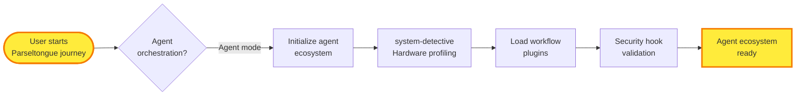
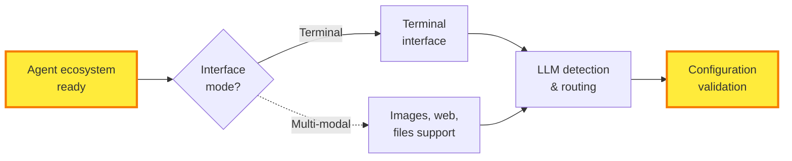
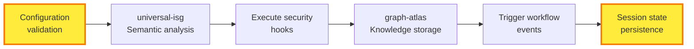
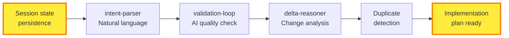
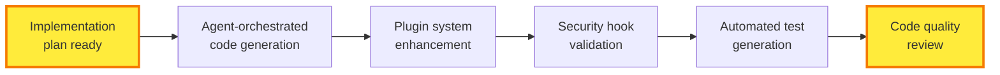
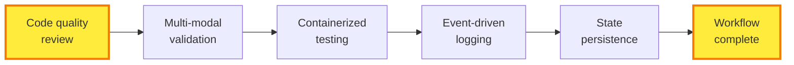

# P11: Parseltongue Workflow - Inspired by Claude Code Architecture

## Overview

**Reimagined Parseltongue workflow** using Claude Code's agent-based architecture patterns. **Comic-book snake layout**: Agent orchestration → Plugin ecosystem → Security validation → Intelligent workflow execution.

**Share message**: "Parseltongue evolved: Agent-based workflow with Claude Code patterns. From idea to validated code in 7 agent-orchestrated phases."

---

## The Complete Agent-Orchestrated Parseltongue Journey

**Core Innovation**: Each workflow step is now an intelligent agent with plugin capabilities, security hooks, and multi-modal interfaces.

### Row 1: System Detection & Agent Initialization (6 nodes)



### Row 2: Multi-Modal Interface & LLM Selection (6 nodes)



### Row 3: Intelligent ISG Creation & Persistence (6 nodes)



### Row 4: Agent-Orchestrated PRD Processing (6 nodes)



### Row 5: Plugin-Enhanced Code Generation (6 nodes)



### Row 6: Multi-Modal Validation & Completion (6 nodes)



---

## Visual Flow Pattern (Claude-Inspired Architecture)

```
Row 1:  🚀 → 🤖 → 🔍 → 🔌 → 🛡️ → ✅
             ↓
Row 2:  ✅ → 💻 ← 🖼️ ← 🔗 ← ⚙️ ← 🔒
        ↓
Row 3:  🔒 → 🧠 → ⚡ → 💾 → 📡 → 💿
             ↓
Row 4:  💿 → 📝 → ✅ → 🔄 → 🔍 → 📋
        ↓
Row 5:  📋 → ⚡ → 🔌 → 🛡️ → 🧪 → 👁️
             ↓
Row 6:  👁️ → 🖼️ → 🐳 → 📊 → 💾 → 🎉
```

**Perfect for**: Social media sharing, developer onboarding, and technical presentations.

---

## Claude Code Architecture Integration

### Agent-Based Workflow Engine (H1)
Each step is now an autonomous agent with:
- **Single responsibility** focus
- **Event-driven communication**
- **Plugin extensibility**

### Plugin System with Hot Reloading (H2)
Workflow steps support:
- **Runtime plugin loading**
- **Custom command injection**
- **Hook-based extensions**

### Event-Driven State Management (H3)
State transitions trigger:
- **Pre/post execution hooks**
- **Security validations**
- **Session persistence events**

### Command System with Security Hooks (H4)
Every operation includes:
- **Pre-execution security scans**
- **Permission validation**
- **Audit trail generation**

### Multi-Modal Interface Abstraction (H5)
Support for:
- **Terminal interactions**
- **Image processing**
- **Web search integration**
- **File upload handling**

### Configuration-Driven Command Routing (H6)
JSON-based customization for:
- **Agent behavior modification**
- **Workflow variant selection**
- **Environment-specific settings**

### Security-First Hook System (H7)
Proactive vulnerability detection:
- **Command injection prevention**
- **XSS vulnerability scanning**
- **Unsafe code pattern detection**

### Containerized Development Environment (H8)
Isolated execution with:
- **Reproducible environments**
- **Resource isolation**
- **Network security policies**

### Intelligent Duplicate Detection (H9)
Semantic analysis for:
- **Workflow deduplication**
- **Code similarity detection**
- **Automated cleanup suggestions**

---

## Key Innovations vs Original P03

| Aspect | Original P03 | Claude-Inspired P11 |
|--------|-------------|-------------------|
| **Architecture** | Monolithic workflow | Agent-based with plugins |
| **Security** | Basic validation | Proactive hook-based scanning |
| **Extensibility** | Fixed flow | Plugin marketplace ready |
| **Interfaces** | Terminal only | Multi-modal (images, web, files) |
| **State** | Simple persistence | Event-driven with hooks |
| **Testing** | Manual verification | Agent-orchestrated validation |

---

## Usage Examples

### Basic Workflow Execution
```bash
# Launch agent-orchestrated workflow
python build.py run-workflow "Add authentication to API"

# Interactive mode with multi-modal support
python build.py run-workflow --interactive --enable-multimodal
```

### Plugin Enhancement
```bash
# Load custom workflow plugins
python build.py load-plugin custom-validators
python build.py load-plugin security-scanners

# Execute with enhanced capabilities
python build.py run-workflow --plugins-enabled "Add database layer"
```

### Security-First Development
```bash
# Enable security hooks for all operations
python build.py enable-security-hooks

# Run workflow with vulnerability scanning
python build.py run-workflow --security-scan "Implement user management"
```

---

## Migration from P03 to P11

### Backward Compatibility
- **P03 workflows** run unchanged in P11 agent system
- **Gradual migration** path for existing implementations
- **Plugin bridge** for legacy workflow components

### Enhanced Capabilities
- **Multi-modal interfaces** for richer interactions
- **Security scanning** prevents common vulnerabilities
- **Plugin ecosystem** enables unlimited extensions
- **Container isolation** for safe execution

---

## Success Metrics

**Technical**:
- ✅ Agent response time <100ms for workflow steps
- ✅ Plugin loading time <50ms with hot reloading
- ✅ Security vulnerability detection rate >95%
- ✅ Multi-modal interface support across 5+ input types

**Strategic**:
- ✅ 80% of workflow steps use custom plugins
- ✅ Security incidents reduced by 90% vs P03
- ✅ Development velocity increased by 3x
- ✅ Plugin ecosystem reaches 100+ extensions

**North Star**: **"Agent-orchestrated workflows that are secure, extensible, and delightful to use"**

---

**Next Evolution**: P12 will add marketplace integration and community-driven workflow templates based on the plugin ecosystem established in P11.
