# P44 ISG-First Architecture: Grounded in Reality

## Executive Summary

**Shreyas Doshi + Jeff Dean Strategic Thinking**: The user's actual job is **"evolve codebase through structured PRD-driven development using ISG as the source of truth at every step"**. This presents a minimal Claude Code tool that maps the actual 9-step user journey from P00CoreUserflow20251014p1.md to actual tools from P42MECEtools.md.

**Core Insight**: **ISG (Interface Signature Graph) is fundamental to every step** - even PRD creation requires ISG context. The tool orchestrates existing P42 tools in the right combinations for each journey phase.

## The 6-Command Philosophy

```bash
/isg:init          # Initialize ISG and database
/prd:create        # Create PRD using ISG context
/isg:plan          # Plan ISG_future from ISG_current + PRD
/validate:loop     # Rubber duck debugging iteration
/apply:safe        # Update database, test, compile
/commit:sync       # Git commit + ISG recreation
```

### Why 6 Commands?

**Shreyas Doshi Thinking**: Each command maps to a distinct phase in the actual 9-step user journey. Clear mental model → focused execution → predictable outcomes.

**Jeff Dean Thinking**: 6 well-defined orchestration patterns → optimal tool combinations → reliable systems integration.

## ISG-First Architecture Mermaid

```mermaid
---
title: P44 ISG-First Architecture - Grounded in Reality
config:
  flowchart:
    defaultRenderer: "elk"
    nodeSpacing: 60
    rankSpacing: 60
    wrappingWidth: 140
    useMaxWidth: false
---
flowchart TD
    %% User Interface
    User([Developer<br/>Arrives at Codebase<br/>Parseltongue Fork]) --> ISGInit

    %% Step 1: ISG Initialization
    subgraph ISGInit["/isg:init - Initialize ISG System"]
        direction TB

        subgraph ISGCreation["ISG Creation"]
            ISGBuilder[interface-signature-graph-builder<br/>Build ISG_current in RAM<br/>filePath-fileName-InterfaceName]
            CozoInit[cozo-database-initializer<br/>Initialize Codebase table<br/>ISG_current_ind, Future_Code columns]
        end

        ISGBuilder --> CozoInit
    end

    ISGInit --> PRDCreate

    %% Step 2-3: PRD Creation (ISG-guided)
    subgraph PRDCreate["/prd:create - Create PRD with ISG Context"]
        direction TB

        subgraph ISGContext["ISG Context Analysis"]
            ISGQuery[interface-graph-query-exact<br/>Query ISG_current<br/>Extract interface context]
            HybridSearch[hybrid-graph-vector-search<br/>Find relevant patterns<br/>Semantic + exact matching]
            CodeSummary[code-summary-generation-engine<br/>Generate 1-line summaries<br/>For PRD context]
        end

        subgraph PRDGeneration["PRD Creation"]
            LLMPRD[LLM creates PRD<br/>Using ISG context<br/>Refine based on ISG_current]
        end

        ISGContext --> PRDGeneration
    end

    PRDCreate --> ISGPlan

    %% Step 4: ISG Future Planning
    subgraph ISGPlan["/isg:plan - Create ISG_future"]
        direction TB

        subgraph ImpactAnalysis["Impact Analysis"]
            ISGQuery2[interface-graph-query-exact<br/>Analyze ISG_current + PRD impact<br/>Calculate changes needed]
            BlastRadius[context-blast-radius-calc<br/>Calculate blast radius<br/>Around planned changes]
            VectorSearch[vector-similarity-search-engine<br/>Find similar implementations<br/>Validate approach]
        end

        subgraph FutureGeneration["ISG_future Generation"]
            LLMSFuture[LLM creates ISG_future<br/>Based on ISG_current + PRD<br/>Test + non-test interfaces]
        end

        ImpactAnalysis --> FutureGeneration
    end

    ISGPlan --> ValidateLoop

    %% Step 5: Rubber Duck Debugging
    subgraph ValidateLoop["/validate:loop - Rubber Duck Debugging"]
        direction TB

        subgraph ValidationChecks["Validation Checks"]
            ISGValidate[interface-graph-query-exact<br/>Validate ISG_current + PRD + ISG_future<br/>Check consistency]
            SimilarCheck[vector-similarity-search-engine<br/>Check for similar successful patterns<br/>Validate approach]
            ImpactRefine[context-blast-radius-calc<br/>Refine impact analysis<br/>Ensure completeness]
        end

        subgraph IterationDecision["Iteration Decision"]
            ConfidenceCheck[LLM confidence assessment<br/>Refine ISG_future or PRD?<br/>Rubber duck method]
        end

        ValidationChecks --> IterationDecision
        IterationDecision -.->|"Needs refinement"| ISGPlan
        IterationDecision -->|"Ready to apply"| ApplySafe
    end

    ApplySafe --> ISGUpdate

    %% Step 6: Database Updates
    subgraph ISGUpdate["/apply:safe - Update Database & Test"]
        direction TB

        subgraph DatabaseUpdate["Database Updates"]
            CozoUpdate[cozo-database-initializer<br/>Update Future_Code/Future_Action<br/>In CozoDB Codebase table]
        end

        subgraph ValidationTesting["Validation & Testing"]
            TestCompile[Run cargo test<br/>Compile codebase<br/>Test affected areas]
            CompileCheck[Run cargo check<br/>Ensure compilation<br/>No regressions]
        end

        DatabaseUpdate --> ValidationTesting

        ValidationTesting -.->|"Tests fail"| ValidateLoop
        ValidationTesting -->|"Tests pass"| UserConfirm
    end

    UserConfirm --> CommitSync

    %% Step 7-8: Git Commit & ISG Recreation
    subgraph CommitSync["/commit:sync - Git Commit & ISG Recreation"]
        direction TB

        subgraph UserApproval["User Confirmation"]
            ChangeSummary[code-summary-generation-engine<br/>Generate change summaries<br/>For user review]
            Visualization[ISG visualization<br/>Show ISG changes<br/>Control flow impact]
        end

        subgraph CommitAndRecreate["Commit & Recreate"]
            GitCommit[Make git commit<br/>With list of changes<br/>Preserve history]
            ISGRecreate[interface-signature-graph-builder<br/>Recreate ISG_current<br/>From ISG_future]
            CozoRecreate[cozo-database-initializer<br/>Update CozoDB<br/>Reflect new state]
        end

        UserApproval --> CommitAndRecreate
    end

    %% Styling
    classDef isgTools fill:#e1f5fe,stroke:#01579b,stroke-width:2px
    classDef searchTools fill:#e8f5e8,stroke:#1b5e20,stroke-width:2px
    classDef validationTools fill:#fff3e0,stroke:#ef6c00,stroke-width:2px
    classDef orchestrationTools fill:#f3e5f5,stroke:#7b1fa2,stroke-width:2px
    classDef userSteps fill:#fce4ec,stroke:#880e4f,stroke-width:2px

    class ISGBuilder,CozoInit,ISGQuery,ISGQuery2,ISGValidate,ISGRecreate,CozoUpdate,CozoRecreate isgTools
    class HybridSearch,VectorSearch,SimilarCheck searchTools
    class BlastRadius,ImpactRefine,TestCompile,CompileCheck validationTools
    class LLMPRD,LLMSFuture,ConfidenceCheck orchestrationTools
    class User,UserApproval,UserConfirm userSteps
```



## Tool Mapping to Actual P42MECEtools

### Foundation Tools (Core ISG System)
1. **interface-signature-graph-builder** - Creates and recreates ISG_current/ISG_future
2. **cozo-database-initializer** - Manages Codebase table with current/future states
3. **interface-graph-query-exact** - Queries ISG for context and validation

### Context & Search Tools
4. **hybrid-graph-vector-search** - Combines exact and semantic search for patterns
5. **vector-similarity-search-engine** - Finds similar implementations and validates approaches
6. **code-summary-generation-engine** - Generates summaries for PRD context and change communication

### Impact Analysis Tools
7. **context-blast-radius-calc** - Calculates impact of planned changes

## Key Design Decisions

### 1. **ISG-First Architecture**
**Strategic Thinking**: ISG is the source of truth for every step, not just initialization.

- **ISG context required** for PRD creation, planning, validation, and communication
- **ISG_future** represents target state, **ISG_current** represents current state
- **CozoDB** maintains both states with clear transition paths

### 2. **Orchestration Over New Tools**
**Systems Thinking**: Don't reinvent tools - orchestrate existing P42 tools effectively.

- **Each command** orchestrates specific tool combinations for that journey phase
- **Tool reuse** across commands reduces complexity and increases reliability
- **Clear separation** of concerns between journey phases

### 3. **Rubber Duck Debugging Integration**
**Product Thinking**: The iteration loop is built into the tool flow, not an afterthought.

- **Automatic confidence assessment** after each validation pass
- **Seamless iteration** back to planning when confidence is low
- **Clear exit criteria** when confidence is high enough to proceed

### 4. **State Synchronization**
**Database Thinking**: Keep ISG_current, ISG_future, and CozoDB synchronized throughout.

- **Single source of truth** in CozoDB Codebase table
- **Atomic updates** to Future_Code/Future_Action columns
- **Recreation workflow** for updating ISG_current after successful commits

## Real User Journey Alignment

### Phase 1: Foundation (/isg:init)
- **P00 Step 1-2**: ISG creation + database initialization
- **Tools**: interface-signature-graph-builder + cozo-database-initializer

### Phase 2: PRD Creation (/prd:create)
- **P00 Step 4**: PRD creation with ISG context
- **Tools**: interface-graph-query-exact + hybrid-graph-vector-search + code-summary-generation-engine

### Phase 3: Planning (/isg:plan)
- **P00 Step 5**: ISG_future creation from ISG_current + PRD
- **Tools**: interface-graph-query-exact + context-blast-radius-calc + vector-similarity-search-engine

### Phase 4: Validation (/validate:loop)
- **P00 Step 5**: Rubber duck debugging iteration
- **Tools**: interface-graph-query-exact + vector-similarity-search-engine + context-blast-radius-calc

### Phase 5: Application (/apply:safe)
- **P00 Step 6-7**: Database updates + testing + compilation
- **Tools**: cozo-database-initializer + testing infrastructure

### Phase 6: Commit (/commit:sync)
- **P00 Step 8**: Git commit + ISG recreation
- **Tools**: interface-signature-graph-builder + cozo-database-initializer + code-summary-generation-engine

## Success Metrics

### **Journey Completion**
- **Success rate**: 100% of 9-step journeys complete successfully
- **Iteration efficiency**: Average 1.2 validation loops per journey
- **User satisfaction**: Users complete journeys without manual intervention

### **Technical Reliability**
- **ISG consistency**: 100% synchronization between ISG_current and database state
- **Database integrity**: Zero corruption in CozoDB Codebase table
- **Tool orchestration**: 99.9% successful tool combinations

### **User Experience**
- **Mental model match**: Commands map exactly to user journey phases
- **Predictable outcomes**: Each command produces consistent, expected results
- **Error recovery**: Clear paths back when steps fail

## Implementation Strategy

### **Phase 1: Core Orchestration (Week 1-2)**
1. Command routing and tool orchestration framework
2. ISG initialization workflow (interface-signature-graph-builder + cozo-database-initializer)
3. Basic ISG query integration (interface-graph-query-exact)

### **Phase 2: Context Integration (Week 3-4)**
1. PRD creation workflow with ISG context
2. Search and pattern matching integration (hybrid-graph-vector-search + vector-similarity-search-engine)
3. Summary generation for communication (code-summary-generation-engine)

### **Phase 3: Planning & Validation (Week 5-6)**
1. ISG_future planning workflow
2. Impact analysis integration (context-blast-radius-calc)
3. Rubber duck debugging iteration logic

### **Phase 4: Application & Sync (Week 7-8)**
1. Database update workflows
2. Testing and compilation integration
3. Git commit and ISG recreation automation

## Conclusion

**Grounded Architecture Result**: By mapping the actual 9-step user journey to actual P42 tools, we deliver a Claude Code tool that:

1. **Follows the real user journey** - Each command maps to actual P00 workflow steps
2. **Uses real tools** - All functionality comes from existing P42MECEtools.md tools
3. **ISG-first by design** - ISG context is fundamental to every step, not an afterthought
4. **Orchestrates, doesn't reinvent** - Combines existing tools in optimal patterns
5. **Handles iteration naturally** - Rubber duck debugging is built into the flow

This isn't a theoretical architecture - it's a **practical orchestration layer** that makes the existing P42 tool ecosystem work seamlessly through the actual user journey defined in P00.

The philosophy is simple: **Map reality, don't reinvent it.**