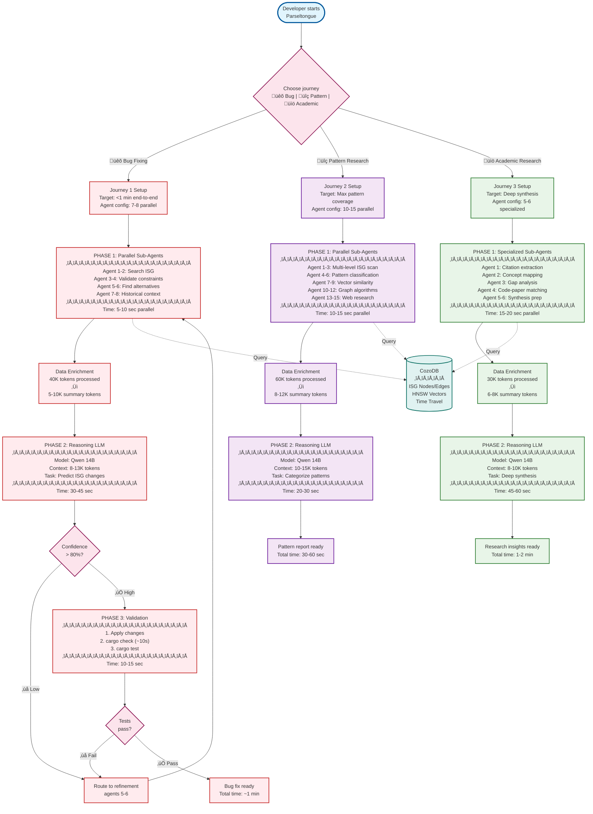
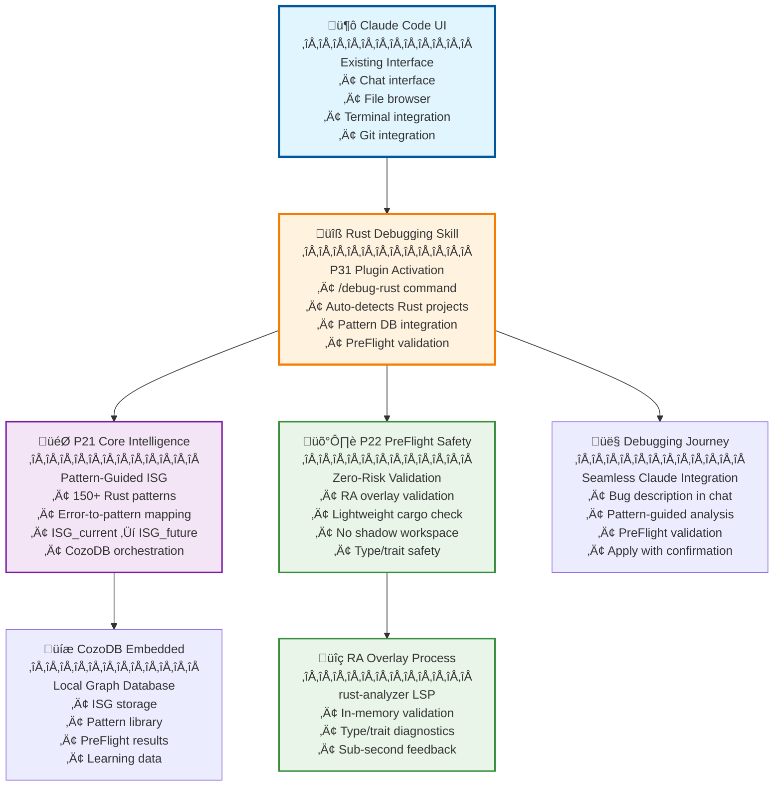
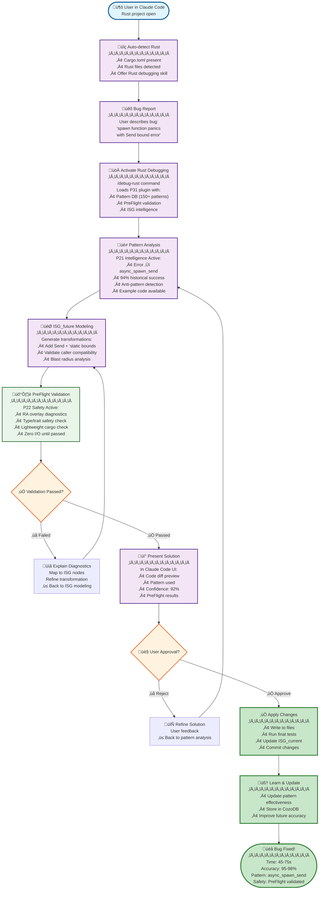
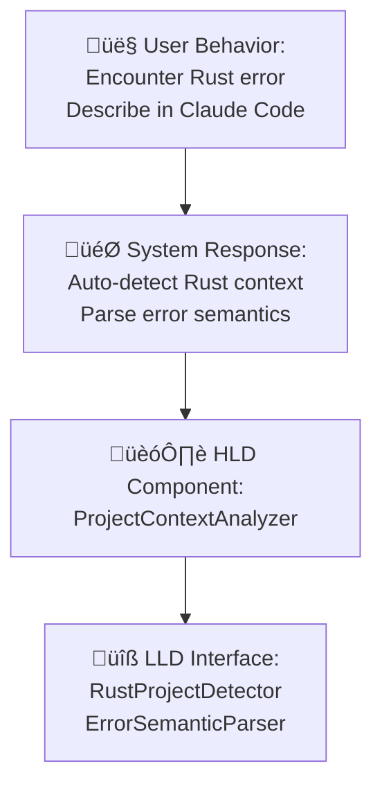
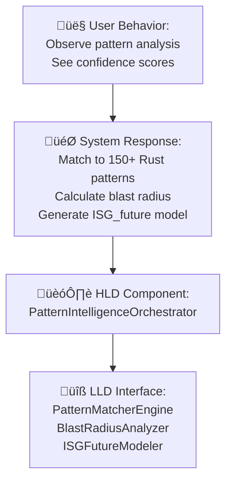
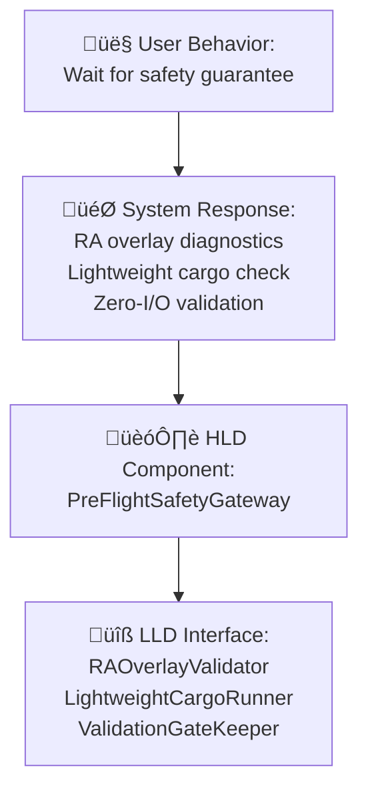
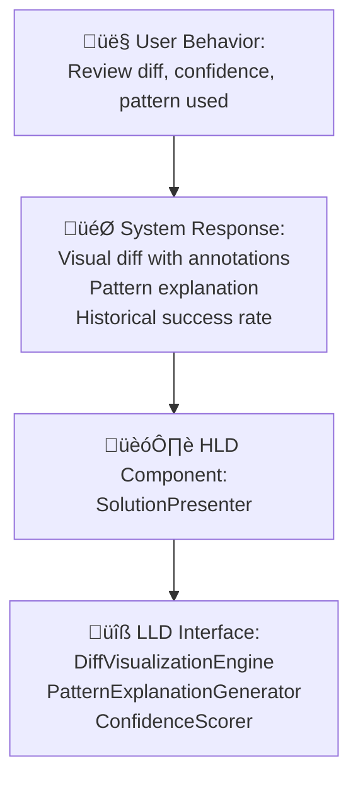
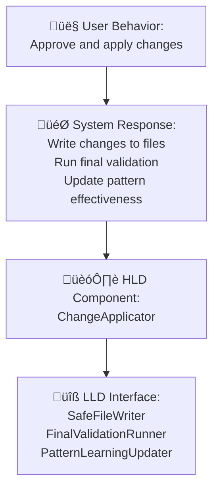
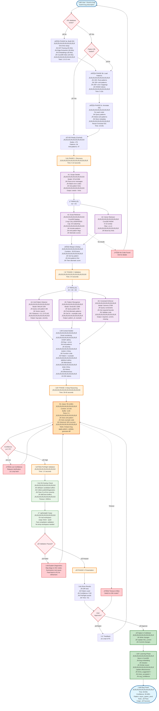

I think you are missing essential stuff and focused on peripheral - think again like Shreyas Doshi - first we need to check if the user has M1+ 16GB RAM+ and need him to install llama.cpp + Qwen or Smol LLMs- which btw you should advise us on based on below conversations

--

amuldotexe: Give me a table of estimated tokens per second on M1 16 GB RAM for small models with less than 1 GB foot print - 

---

Raycast AI: 
## Estimated tokens per second (M1 16 GB, models <1 GB)

Assumptions:
-  Hardware: Apple M1 (8‑core CPU, 7–8‑core GPU), 16 GB unified memory
-  Runner: llama.cpp with Metal enabled (for “Metal” column), n_threads ≈ 8, n_gpu_layers = auto/all feasible
-  Batch size: 1 (interactive), typical context 128–512, generation tps (not prompt eval tps)
-  Quantized GGUF models; sizes are approximate ranges across builds

| Model (family) | Params (B) | Quant (GGUF) | Approx size (GB) | Est. tps (CPU only) | Est. tps (Metal) | Notes |
|---|---:|---|---:|---:|---:|---|
| Qwen2.5-0.5B Instruct | 0.5 | Q4_K_M | 0.25–0.30 | 80–140 | 180–300 | Ultra-light; great latency for simple tasks |
| Llama 3.2 1B Instruct | 1.0 | Q4_K_M | 0.50–0.60 | 60–120 | 120–200 | Strong general English; tiny footprint |
| TinyLlama 1.1B Chat | 1.1 | Q4_K_M | 0.55–0.65 | 60–110 | 120–190 | Very fast; compact 1.1B class |
| Qwen2 1.5B Instruct | 1.5 | Q4_K_M | 0.70–0.80 | 45–90 | 90–160 | Good instruction-following at small size |
| Gemma 2 2B (base/instruct) | 2.0 | Q3_K_M | 0.70–0.85 | 35–70 | 70–130 | Q3 keeps <1 GB; balanced quality/speed |
| Phi-2 | 2.7 | Q2_K | 0.85–0.95 | 25–50 | 50–100 | Fits <1 GB only at Q2; decent coding/math |

Notes and caveats:
-  These are ballpark figures; actual tps varies with context length, n_batch, speculative decoding, KV cache settings, and build flags.
-  Prompt evaluation (ingesting context) is usually faster than generation tps shown above.
-  If you’re using Ollama or different runners, expect minor differences; Metal offload usually gives 1.5–2.5× over CPU for these sizes.

Want this tailored to your exact setup? Share your runner (llama.cpp/Ollama), macOS version, and whether your M1 has a 7‚Äë or 8‚Äëcore GPU, and I can refine the numbers and suggest optimal flags.

---

amuldotexe: Take even smaller ones pleae

---

Raycast AI: 

## Even smaller models (<0.5B params) — Estimated tokens per second (M1 16 GB)

Assumptions:
-   Hardware: Apple M1 (8‑core CPU, 7–8‑core GPU), 16 GB unified memory
-   Runner: llama.cpp with Metal for the “Metal” column; batch size 1; typical short context; generation tps (not prompt eval)
-   Quantization: GGUF, Q4_K_M unless noted; sizes are approximate

| Model (family) | Params (B) | Quant (GGUF) | Approx size (GB) | Est. tps (CPU only) | Est. tps (Metal) | Notes |
|---|---:|---|---:|---:|---:|---|
| Qwen2.5-0.1B (base) | 0.10 | Q4_K_M | 0.05–0.08 | 250–500 | 500–900 | Good for routing/toy tasks; very limited reasoning |
| SmolLM-135M Instruct | 0.135 | Q4_K_M | 0.07–0.09 | 220–450 | 450–800 | Tiny instruct model; concise replies |
| GPT-2 Small 124M (base) | 0.124 | Q4_K_M | 0.06–0.08 | 220–450 | 450–850 | Not instruction-tuned; older tokenizer/vocab |
| Qwen2.5-0.3B (base) | 0.30 | Q4_K_M | 0.14–0.18 | 140–300 | 300–600 | Noticeably better fluency than 0.1B |
| SmolLM-360M Instruct | 0.36 | Q4_K_M | 0.18–0.22 | 120–260 | 260–520 | Compact instruct; still very fast |
| TinyStories-33M (toy) | 0.033 | Q4_K_M | 0.02–0.03 | 400–900 | 800–1600 | Trained for simple narratives; not general-purpose |

Notes and caveats:
-   Tiny models may see smaller Metal speedups due to kernel launch overhead; still expect roughly 1.5–2× over CPU in most runners.
-   Quality drops rapidly below ~300M parameters; use mainly for routing, templating, boilerplate expansion, or constrained tasks.
-   Exact tps depends on n_threads, n_gpu_layers, rope scaling, KV offload, build flags, and context length.

---

amuldotexe: How much RAM they will use

---

Raycast AI: 

## Estimated RAM usage on M1 16 GB (tiny models)

Assumptions:
-    Runner similar to llama.cpp/Ollama with Metal; totals reflect unified memory (CPU+GPU combined).
-    KV cache in f16; base runtime overhead ≈ 0.25 GB; single sequence; batch size 1.
-    Model file sizes are typical GGUF Q4_K_M builds.

\[ \text{Total RAM} \approx \text{Overhead} + \text{Model size} + \text{KV}_{1k} \times \frac{\text{ctx}}{1000} \]
-    Overhead ≈ 0.25 GB; KV1k in GB; ctx = context tokens.
-    For KV in Q8_0, halve the KV portion.

| Model (family) | File size (GB) | KV per 1k toks (MB, f16) | Est. total @512 ctx (GB) | Est. total @1024 ctx (GB) | Est. total @2048 ctx (GB) |
|---|---:|---:|---:|---:|---:|
| Qwen2.5-0.1B (base) | 0.07 | 46.9 | 0.34 | 0.37 | 0.41 |
| SmolLM-135M Instruct | 0.08 | 46.9 | 0.35 | 0.38 | 0.42 |
| GPT-2 Small 124M (base) | 0.07 | 35.2 | 0.34 | 0.35 | 0.39 |
| Qwen2.5-0.3B (base) | 0.16 | 93.9 | 0.46 | 0.50 | 0.59 |
| SmolLM-360M Instruct | 0.20 | 105.5 | 0.50 | 0.55 | 0.66 |
| TinyStories-33M (toy) | 0.03 | 17.6 | 0.29 | 0.30 | 0.31 |

How to adapt:
-    Using KV Q8_0: subtract roughly 50% of the KV portion. Example (0.3B, 2,048 ctx): 0.59 GB − (0.0939 GB × 2.048 ÷ 2) ≈ 0.50 GB.
-    Parallel sequences or higher n_batch scale KV linearly with tokens-in-flight. Doubling ctx or active sequences roughly doubles the KV portion.

KV calculation assumptions (for guidance, typical tiny-configs):
-    Qwen2.5-0.1B, SmolLM-135M: L=16, d=768 → KV1k ≈ 46.9 MB
-    GPT-2 Small 124M: L=12, d=768 → KV1k ≈ 35.2 MB
-    Qwen2.5-0.3B: L=24, d=1024 → KV1k ≈ 93.9 MB
-    SmolLM-360M: L=24, d=1152 → KV1k ≈ 105.5 MB
-    TinyStories-33M: L=12, d=384 → KV1k ≈ 17.6 MB

Want me to tailor this to your exact runner (llama.cpp/Ollama), KV quantization, and your target context length? Share those and I’ll recalc precise totals.

==

amuldotexe: Wdyt about this

Parseltongue: A Vision for Shipping Large-Scale Systems with a Parallel Intelligence Runtime

1. The Challenge and The Vision: Reasoning Beyond the Context Window

While Large Language Models (LLMs) have demonstrated a remarkable ability to write high-quality, idiomatic code for well-defined interfaces, their effectiveness rapidly diminishes when faced with the sprawling complexity of modern software projects. The fundamental limitation is the context window; even at hundreds of thousands of tokens, it is insufficient for an LLM to load, comprehend, and reason across a multi-module, enterprise-scale codebase. This constraint creates a critical gap between a developer's high-level specification and the low-level design (LLD) required for implementation. The LLM can write the code for a specific function if told exactly what to do, but it cannot independently determine which functions and data structures across an entire project need to be created or modified to fulfill a new requirement.

This is the core challenge Parseltongue is designed to solve. Its grand vision is to create a system capable of reasoning at the architectural level, enabling developers to build the next generation of huge, transformative codebases that have been too complex to attempt. This includes ambitious projects like "rust hallows," a fearlessly concurrent operating system built in Rust, or the complex, multi-million-line codebases of modern web browsers. To achieve this, we must move beyond treating code as a flat wall of text and instead engage with its structure and semantics. The core technical innovation that makes this vision possible is the Interface Signature Graph.

2. The Solution's Foundation: The Interface Signature Graph (ISG)

The key to unlocking large-scale code reasoning is to abstract away the raw implementation details and operate on a structured, semantic representation of the entire codebase. Parseltongue's foundational data structure for this is the Interface Signature Graph (ISG). The ISG is not merely a map of the code; it is a rich, multi-layered graph that captures the essential relationships, dependencies, and metadata that define the system's architecture.

The ISG_current, which represents the codebase's present state, captures several critical data points:

* Unique Interface Identifiers: Every function, struct, and trait receives a stable, unique ID, allowing for precise and unambiguous referencing.
* Rust Analyzer Metadata: It integrates rich metadata from compiler-grade tools like rust-analyzer, providing deep semantic understanding of the code.
* High-Level Intermediate Representation (HIR): Information from the HIR is used to understand the code's structure beyond simple text, including type information and control flow.
* Dependency Relationships: The graph explicitly maps all dependencies, including function calls, trait implementations, and module relationships, creating a comprehensive "blast radius" for any potential change.
* Classification of Interfaces: It distinguishes between production code and test code, enabling the system to reason about validation and testing strategies.

This graph is persisted in multiple formats to serve different needs: a CozoDB graph database for high-performance queries, portable JSON files for data exchange, and HTML for direct user visualization. By transforming an unstructured codebase into a queryable architecture, the ISG provides the exact Low-Level Design context that LLMs lack, turning an intractable reasoning problem into a solvable graph traversal and analysis task for the agent swarm.

3. The Architectural Philosophy: Journey-Aware Orchestration

Parseltongue's core architectural principle is that there is no one-size-fits-all approach to code intelligence. It is not a monolithic "big brain" AI but a journey-aware, parallel intelligence runtime. This system orchestrates many small, specialized sub-agents, configuring their behavior to precisely match the user's immediate goal. A core principle of this architecture is resource efficiency, enabling it to execute these complex workflows on standard developer hardware, such as a 16GB laptop, by prioritizing smaller, specialized models and aggressive context compression over brute-force scale. This philosophy is shaped by two complementary perspectives: the "Shreyas Lens," which focuses on product reasoning and the user's job-to-be-done, and the "Jeff Dean Lens," which focuses on systems reasoning and efficient, parallel execution.

This dual focus leads to three distinct, highly optimized user journeys:

User Journey	Core Job-to-be-Done	"Aha!" Moment
Bug Fixing üêõ	I have a failing build or test; get me to a validated fix with high certainty, fast.	"It compiled, the tests passed, and the diff is minimal and correct the first time."
Pattern Research üîç	I need to understand idioms and architectural patterns across a large codebase quickly.	"It found non-obvious patterns and clustered them with examples from all over the repository."
Academic Research üìö	I need a precise, citable synthesis linking code and academic papers to make high-confidence decisions.	"It connected research papers to exact code gaps with citations and a rationale I can verify."

By tailoring its execution model to the specific journey, Parseltongue can optimize for the metric that matters most in each context—whether it's the raw speed of a fix, the breadth of pattern discovery, or the depth of synthesized insight. We will now explore the most latency-critical of these journeys: fixing a bug.

4. A Deep Dive: The Bug-Fixing Journey (J1) in Under 60 Seconds

The bug-fixing journey (J1) is designed for maximum speed and precision. Its primary Key Performance Indicator (KPI) is Time to Validated Fix (TTF), with an ambitious end-to-end target latency of approximately 60 seconds. The workflow is structured into three distinct phases to achieve this goal, moving from broad, parallel data gathering to focused, deterministic validation.

4.1. Phase 1: Parallel Fact-Finding and Scoping

This initial phase is "embarrassingly parallel," designed to gather all relevant facts from the codebase as quickly as possible, targeting a 5-10 second completion time. Upon receiving a bug report (e.g., a failing test), the orchestrator dispatches multiple sub-agents simultaneously:

* A1 (Scope Seeder): A small, fast language model (STLM 50M) that parses the user's natural language input to produce a list of structured seed identifiers within the ISG.
* A2 (Exact Retriever): This agent executes deterministic Datalog queries directly against the CozoDB graph, exploring a tight "blast radius" of 2 hops from the seed nodes to gather all directly connected functions, structs, and dependencies.
* A3 (Vector Retriever): Concurrently, this agent executes a query against the HNSW index in CozoDB to find other code snippets that are semantically similar to the failing code, potentially surfacing related logic or previously implemented fixes that are not directly connected in the ISG.

4.2. Phase 2: Context Enrichment and Reasoning

The raw data gathered in Phase 1—potentially tens of thousands of tokens of code and metadata—is too verbose for an LLM to process effectively. This phase performs a critical data enrichment and compression step, aiming for a 4-10x compression ratio. The A7 (Summarizer) agent consumes the outputs from all Phase 1 agents and synthesizes them into a semantically dense, structured ContextPack. This pack distills raw code into key facts, constraints, and potential risks.

This highly compressed ContextPack is then fed to the R1 (Heavy Reasoner), a Qwen 14B model. Freed from the burden of parsing boilerplate code, R1 dedicates its entire context budget to the high-value task of reasoning about the problem. For more difficult problems, the system can escalate to a larger model or trigger a self-consistency loop (k=3), a key strategy for balancing high performance with the system's constrained 16GB resource envelope. R1's task is to generate a concrete plan and a code diff to fix the bug, a process targeted to take 30-45 seconds.

4.3. Phase 3: Deterministic Validation and Finalization

Before any code is compiled, the system uses a "confidence gating" mechanism. A score is calculated based on factors like agent agreement and the consistency of the proposed changes with the existing ISG:

C = 0.35 * coverage + 0.25 * agreement + 0.25 * consistency + 0.15 * static_precheck

The cargo validation suite only runs if this score is C ‚â• 0.70 and no high-severity risks have been identified by the validation agents. If the confidence is high enough, the system applies the diff in an ephemeral workspace and runs a short-circuiting validation sequence: first cargo fmt --check for code style, then cargo check for rapid compilation feedback, followed by selective tests related to the change, and only running the full test suite if necessary.

Upon successful validation, the user is presented with a clear visualization of the changes, the compilation output, and the test results. Once the user approves the solution, Parseltongue creates a commit and updates the ISG_current to reflect the new state of the codebase, completing the workflow. This structured, three-phase approach ensures that the system delivers a high-quality, validated fix with remarkable speed.

5. The Universal Toolkit: One Agent Roster, Configured for Any Journey

The elegance of the Parseltongue architecture lies in its efficiency and flexibility. It does not maintain separate, complex agent swarms for each journey. Instead, it utilizes a single Universal Agent Roster (composed of agents A1-A8 and the reasoner R1) and simply provides different configurations to optimize their behavior for the task at hand. This contract-based approach allows the system to pivot from a latency-optimized bug fix to a coverage-optimized pattern search by adjusting a few key parameters.

The following table illustrates how three key agents are reconfigured between the Bug Fixing (J1) and Pattern Research (J2) journeys:

Agent	J1: Bug Fixing (Latency-Optimized)	J2: Pattern Research (Coverage-Optimized)	Rationale
A2 (Exact Retriever)	Radius: 2 hops<br>Edges: CALLS/DEPENDS<br>Cap: 30 nodes/hop	Radius: 3 hops<br>Edges: IMPLEMENTS/HAS_MEMBER<br>Cap: 50 nodes/hop	To optimize for the primary KPI of Time to Validated Fix, J1 uses a tight blast radius to minimize data collection. To optimize for Pattern Coverage, J2 uses a much wider graph traversal to discover architectural patterns.
A3 (Vector Retriever)	K: 15<br>Filter: Functions/Statements	K: 50<br>Filter: Modules/Types/Functions	For its KPI, J1 requires a focused search for a few highly similar function implementations. For its KPI, J2 requires a broad search for many related examples at all architectural levels to ensure maximum coverage.
R1 (Heavy Reasoner)	Timeout: 30s<br>Temperature: 0.1	Timeout: 45s<br>Temperature: 0.3	To meet its speed KPI, J1 prioritizes a fast, deterministic decision to generate a precise fix. To meet its coverage KPI, J2 allows for more time and creativity to synthesize and categorize diverse patterns.

This configurable, contract-based architecture provides maximum operational flexibility. The same underlying toolkit can be precisely tuned to deliver speed, breadth, or depth, ensuring that the system's resources are always aligned with the user's specific goal.

6. The Vision Realized: Building the Impossible

The combination of a structured Interface Signature Graph, a journey-aware orchestration of parallel sub-agents, and journey-specific configuration is the key to finally breaking the context window barrier. This architecture enables reasoning not just over a file, but across millions of lines of code, transforming the development of large-scale systems.

This architecture provides a distinct competitive advantage over approaches that rely on a single, larger LLM. Our strategic win is derived from:

1. Journey-Aware Orchestration: Tailoring agent configuration and parallelism to the user's specific goal.
2. Aggressive Data Enrichment: Compressing low-level code into high-signal, structured facts to preserve the reasoning model's precious context.
3. Deterministic Validation: Using confidence gates and automated build-and-test sequences to ensure reliability and correctness.

The ultimate goal of Parseltongue is to empower developers to build the next generation of transformative software. By turning the overwhelming complexity of massive codebases into a solvable engineering problem, we can enable the creation of systems once thought too difficult to attempt, from the "rust hallows" operating system to the foundational software that will power our future.


---

Raycast AI: 
## Overall take

Promising and well-motivated. The Interface Signature Graph + journey-aware orchestration is a coherent path to break the context-window bottleneck without brute-force scaling. The 60s bug-fix KPI is ambitious but not implausible with aggressive scoping, caching, and incremental validation. The biggest risks are graph freshness/precision, calibration of “confidence gates,” and the practicalities of running a heavy reasoner and build pipeline on a 16 GB developer machine.

## What’s novel and strong

-  Treating the codebase as a queryable, typed graph (ISG) with Datalog is the right primitive for large-scale reasoning.
-  Journey-aware contracts that retune the same agent roster is a clean abstraction and operationally pragmatic.
-  Latency-first J1 pipeline with deterministic validation is the correct product bet: trust comes from passing the user’s build/test, quickly.

## Key risks and open questions

-  ISG fidelity and stability
    - Stable IDs across refactors/renames? Macro expansion, generics/monomorphization, feature flags \(cfg\), build scripts, multi-crate workspaces.
    - Incremental updates: how quickly can ISG_current be refreshed after edits to avoid stale reasoning?
-  Embeddings and vector search
    - Cost and drift for million-node repos; chunk boundaries aligned to AST? Model choice for Rust code embeddings?
-  Confidence gating
    - The current linear score may be poorly calibrated across repos. How will you prevent false positives that skip tests?
-  Runtime budget
    - Cold cargo check/test and rust-analyzer startup can dominate 60s on laptops. What are the caching and test-selection strategies?
-  Heavy reasoner footprint
    - Qwen 14B on 16 GB implies 4–8 bit quantization and tight context; how will you guarantee latency under load?
-  Diff safety and minimality
    - Ensuring small, reversible patches that don’t degrade style or semantics; rollback and hygiene.

## Suggestions to tighten the design

### Interface Signature Graph (ISG)

-  Stable identifiers
    - Derive IDs from structural fingerprints: path + item kind + normalized AST hash, not raw line offsets. Track rename edges to preserve continuity.
-  Incremental and partial reindex
    - File-level invalidation; re-run rust-analyzer only for impacted crates/features; lazy macro expansion. Store a change journal and snapshot ISG per commit for diff queries.
-  Semantics beyond dependencies
    - Record side effects, unsafe boundaries, lifetime/borrow constraints (summarized from HIR/MIR and clippy lints). Flag FFI, async boundaries, and feature-gated code paths.
-  Multicrate/feature awareness
    - Maintain per-feature subgraphs and a “union” graph; reason with the active feature set to avoid dead edges.

### Retrieval and compression

-  Vector retrieval
    - Embed on AST-aligned nodes (function, impl block, type), not arbitrary tokens. Consider on-demand embedding for cold nodes; precompute only hot regions.
    - Store “typed similarity” edges (e.g., same trait method, same error type) to blend symbolic and vector signals.
-  ContextPack schema
    - Explicit fields: problem statement, failing symbols, call-chain slices, type/borrow constraints, invariants, risk list, candidate edit sites, test focus set.
    - Path compression: summarize N-hop neighborhoods as motifs with counts rather than raw code.

### Reasoning and code generation

-  Two-stage generation
    - Small planner model produces a surgical edit plan; generator produces the diff; separate a verifier that proves the plan touches only intended nodes.
-  Patch minimality
    - Enforce constraints: max lines changed per file, forbid cross-crate edits unless necessary, preserve formatting via structured edits (Tree-sitter/RA assists) before running cargo fmt.
-  Escalation strategy
    - If R1 times out or confidence < threshold, escalate: k=3 self-consistency or widen blast radius, not both; always keep a strict budget.

### Deterministic validation

-  Calibrated confidence
    - Replace linear score with a calibrated probability from a logistic model trained on historical outcomes. For example, learn \(p(\text{pass} \mid \text{features})\) and threshold on a target precision.
    - Maintain a reliability diagram and update coefficients online with bandit-style exploration.
-  Test selection
    - Build a mapping from ISG edges to tests; run only impacted tests first. Cache coverage maps per crate/feature.
-  Extra guards
    - clippy --deny warnings, rustdoc check, optional miri/prusti/kani gates for unsafe hotspots, property/fuzz tests when risk flags are high.

### Performance and runtime

-  Caching
    - sccache for compilation; persistent rust-analyzer server; warm HIR/MIR caches; memoize Cozo queries; incremental HNSW updates.
-  Parallelism
    - Overlap indexing I/O with A1–A3; start cargo fmt/check speculatively once a draft diff exists; precompute test impact graph in idle time.
-  Model footprint
    - Quantized 7–14B locally or hosted burst mode with strict latency SLOs. Consider small edit models locally and use R1 only for ambiguous cases.

### UX and control

-  Explainability
    - Show ISG subgraph around edits, why these nodes were selected, and the risk list. Allow user to pin/ban nodes and set invariants.
-  Safe apply
    - Ephemeral branch + commit template with rationale, test transcript, and confidence score; easy rollback.

## Metrics to track

| Metric | Definition | Target/Notes |
|---|---|---|
| TTF | Time to validated fix | p50 < 60s, p95 < 2m |
| Fix precision | Fraction of validated diffs accepted by user | > 0.8 initially |
| Rollback rate | Reverted after merge | < 2% |
| Patch minimality | Lines/ files changed | Track median, alert on outliers |
| Coverage delta | Impacted tests run vs full suite | > 0.7 impact coverage |
| Confidence calibration | Brier score / ECE | Improve over time |

For calibration, learn a logistic model with features like coverage, agreement, consistency, static_precheck, and model uncertainty, then compute:
\[
p = \sigma\big(w_0 + w_1 \cdot \text{coverage} + w_2 \cdot \text{agreement} + w_3 \cdot \text{consistency} + w_4 \cdot \text{static\_precheck}\big)
\]

## Experiments that de-risk the approach

-  Microbenchmarks
    - 100 real Rust bugs from popular crates; measure TTF, pass rate, patch size with/without vector retriever and with blast radius 1/2/3.
-  Ablations
    - Remove ContextPack compression or swap to naive RAG to quantify the gain from ISG + summarizer.
-  Cold vs warm runs
    - With/without sccache and persistent rust-analyzer; quantify latency components.
-  Calibration study
    - Train/test split across repos; reliability curves for confidence gating.
-  Stressors
    - Feature-flag-heavy crates, macro-heavy code, unsafe/FFI boundaries, multi-crate workspaces.

## 30/60/90 day plan

-  30 days
    - ISG v0 for Rust (functions/types/traits, 2-hop deps), Cozo schema, incremental updater. A1–A3 + A7 prototype and ContextPack v0. Basic diff applier and cargo fmt/check flow with sccache.
-  60 days
    - Test impact mapping, calibrated confidence v1, structured edits, patch minimality constraints. UX: ISG subgraph view + rationale. On-device quantized reasoner baseline.
-  90 days
    - Wider journeys (J2 patterns), per-feature graphs, unsafe/risk annotators, online calibration updates, and full evaluation suite on public crates.

If you share a target repo, I can sketch the ISG schema, key Datalog queries, and a minimal ContextPack schema tailored to it.

---

amuldotexe: Read this and tell me what needs to change in this like an LLM prompt

---

Raycast AI: 

## Summary

Your document is a great architecture spec, but as an LLM prompt it’s noisy, ambiguous, and missing hard contracts. Convert it into:
-  A system prompt that defines role, tools, constraints, and scoring.
-  A strict input/output schema with one-shot examples.
-  A bounded workflow with stop criteria, patch minimality rules, and validation gates.
-  No marketing, emojis, or repeated sections.

Below are concrete edits and a ready-to-use prompt template.

## What to change

-  Remove
    - Marketing claims, emojis, repeated blocks, Mermaid diagrams, “research-backed” narrative, and unverifiable metrics.
    - Vague goals like “accuracy: 90–95%” and aspirational phrases.
-  Tighten into contracts
    - Define the agent role, scope, and allowed operations.
    - Specify inputs and required outputs with schemas and field semantics.
    - Provide tool interfaces (Cozo queries, cargo actions) as deterministic functions.
-  Constrain behavior
    - Patch minimality, allowed edit surfaces, no speculative code, no changes outside blast radius.
    - Deterministic order of operations, time/token budgets, and retry/escalation rules.
-  Make retrieval explicit
    - Which Datalog queries to run; what to return; how to compress into a ContextPack.
-  Add validation gates
    - Confidence calibration formula, thresholds, and what to do when below threshold.
    - Test impact selection, clippy/rustdoc guards.
-  Add a few-shot example
    - Error ‚Üí pattern ‚Üí transformation plan ‚Üí minimal diff ‚Üí validation plan.

## Key structural deltas

| Area | Current | Change to |
|---|---|---|
| Purpose | Architecture narrative | System prompt + strict contracts |
| Content | Diagrams, marketing, repetition | Tool specs, schemas, examples |
| Retrieval | Implicit via agents | Deterministic Cozo queries listed |
| Output | Narrative claims | JSON artifacts + unified diff |
| Validation | Described qualitatively | Concrete gates, thresholds, stop rules |

## Production-ready prompt template

### System message (paste as the system prompt)

    You are Parseltongue-R1, a Rust bug-fixing agent operating over an Interface Signature Graph (ISG) in CozoDB.
    Objective: produce a minimal, validated diff that fixes the given failing test/build without degrading style or semantics.

    Tools:
    - cozo.query(sql_or_datalog: string) -> rows
    - cargo.run(cmd: "fmt_check" | "check" | "test_selective" | "test_full", args?: object) -> {status, stdout, stderr}
    - fs.read(uids: string[]) -> {uid, code}
    - patch.apply(unified_diff: string) -> {ok: bool, errors?: string[]}

    Hard constraints:
    - Do not invent code or APIs not present in interface_code unless the micro-PRD explicitly authorizes CREATE.
    - Modify only uids in the candidate edit set; never exceed patch limits: <= 2 files, <= 30 changed lines total.
    - Keep changes inside the ISG blast radius (<= 2 hops from seed) unless feasibility requires widening; justify if widened.
    - Prefer structured, surgical edits (signature/trait bounds/return types) over refactors.
    - Maintain formatting via structured edit; cargo fmt must be clean without reflowing unrelated code.
    - If uncertainty is high, request clarification instead of guessing.

    Confidence and gating:
    - Compute a calibrated probability p(pass). If p < 0.70, do not run cargo; ask for guidance or expand retrieval.
    - Run validation in order: fmt_check -> check -> test_selective -> test_full (only if needed).
    - Abort on any new warnings promoted to deny (clippy/rustdoc if enabled).

    Output contract (single JSON object + unified diff):
    - micro_prd
    - context_pack
    - transformation_plan[]
    - validation_plan
    - confidence_report
    - patch (unified diff) when ready
    - if not ready: clarification_questions[]

    Reasoning style:
    - Provide a brief rationale (max 5 bullets), no chain-of-thought details.

### Input schema (what the user/dev feed as the user message)

    {
        "bug_report": {
            "symptom": "string",
            "stderr_snippet": "string",
            "failing_test_names": ["string"],
            "seed_uids": ["string"]  // initial suspects in ISG
        },
        "limits": {
            "time_budget_sec": 60,
            "max_files_changed": 2,
            "max_lines_changed": 30
        },
        "feature_flags": ["string"],  // active cfgs
        "repo_policy": {
            "clippy_deny": true,
            "run_rustdoc": false
        }
    }

### Required outputs (schemas)

    // Micro-PRD (concise, deterministic)
    "micro_prd": {
        "title": "string",
        "problem_statement": "string",
        "root_cause": "string",
        "pattern_recommendation": "string",
        "interfaces_to_modify": ["uid"],
        "success_criteria": ["string"]
    }

    // ContextPack (compressed facts for reasoning)
    "context_pack": {
        "seeds": ["uid"],
        "blast_radius_hops": 2,
        "call_chain_slices": [{"from": "uid", "to": "uid", "length": 1|2}],
        "type_constraints": ["string"],  // e.g., "F: Future + Send + 'static"
        "risk_flags": ["AsyncBoundary", "FFI", "Unsafe"],
        "related_patterns": [{"pattern_id": "string", "distance": 0.0}]
    }

    // Transformation plan (graph-first, then code)
    "transformation_plan": [
        {
            "uid": "uid",
            "action": "MODIFY" | "CREATE" | "DELETE",
            "signature_old": "string?",
            "signature_new": "string?",
            "constraints_added": ["string"],
            "blast_radius": ["uid"],
            "feasibility_checks": [
                {"type": "caller_constraint", "status": "pass|fail", "notes": "string"}
            ]
        }
    ]

    // Validation plan
    "validation_plan": {
        "selective_tests": ["string"],
        "guards": ["fmt_check", "check"],
        "fallback_full_test": true
    }

    // Confidence
    "confidence_report": {
        "coverage": 0.0,
        "agreement": 0.0,
        "consistency": 0.0,
        "static_precheck": 0.0,
        "p_pass": 0.0,
        "gate": "hold|proceed"
    }

    // Patch (only when gate = proceed)
    "patch": "string"  // unified diff

    // If gate = hold
    "clarification_questions": ["string"]

### Deterministic workflow the model must follow

1) Retrieve symbols
-  cozo.query to get exact 2-hop neighborhood from seed_uids via edges CALLS/DEPENDS.
-  cozo.query HNSW on pattern_library for error-to-pattern matches; attach distances.

2) Compress to ContextPack
-  Produce type/borrow constraints and a shortlist of candidate edit sites (<= 3 uids).

3) Plan edit
-  Propose 1–2 transformations, prefer signature or bound changes.
-  Ensure feasibility: caller compatibility, cycle detection, test reachability via cozo queries.

4) Confidence estimate
-  Compute calibrated p(pass):
\[
p = \sigma(w_0 + w_1\cdot\text{coverage} + w_2\cdot\text{agreement} + w_3\cdot\text{consistency} + w_4\cdot\text{static\_precheck})
\]
-  If p < 0.70, ask 1–3 targeted questions or widen retrieval once.

5) Generate patch
-  Produce a unified diff touching only the approved uids; keep changes within budget.
-  Run cargo in order; short-circuit on failure and report.

6) Emit outputs
-  JSON object + unified diff. No additional prose beyond a brief rationale (<= 5 bullets).

### Tool query snippets the model can reuse

    -- 2-hop blast radius
    blast(uid, hop) := start[uid], hop = 0
    blast(uid, hop) := blast(prev, h), h < 2, *interface_relationships{from_uid: prev, to_uid: uid, edge_type: 'CALLS'|'DEPENDS'}, hop = h + 1

    -- Fetch code and metadata for candidate uids
    ?[uid, code, signature] := blast(uid, _), *interface_code{uid, current_code: code}, *interface_metadata{uid, signature}

    -- Error ‚Üí pattern candidates (vector)
    ?[pattern_id, name, distance] := ~pattern_library:pattern_vec_idx{ pattern_id, name | query: vec_embed($stderr), k: 5, bind_distance: distance }

### One-shot example (abbreviated)

Input:
    {
        "bug_report": {
            "symptom": "panic in async spawn",
            "stderr_snippet": "future cannot be sent between threads",
            "failing_test_names": ["runtime::tests::spawn_send"],
            "seed_uids": ["src/runtime.rs-runtime-spawn"]
        },
        "limits": {"time_budget_sec": 60, "max_files_changed": 2, "max_lines_changed": 20},
        "feature_flags": [],
        "repo_policy": {"clippy_deny": true, "run_rustdoc": false}
    }

Expected key outputs:
    "micro_prd": { "title": "Add Send bound to spawn generic", ... },
    "transformation_plan": [
        {
            "uid": "src/runtime.rs-runtime-spawn",
            "action": "MODIFY",
            "signature_old": "pub fn spawn<F: Future>(f: F) -> JoinHandle<F::Output>",
            "signature_new": "pub fn spawn<F: Future + Send + 'static>(f: F) -> JoinHandle<F::Output>",
            "constraints_added": ["Send", "'static"],
            "feasibility_checks": [{"type": "caller_constraint", "status": "pass", "notes": "all callsites in async context"}]
        }
    ],
    "validation_plan": {"selective_tests": ["runtime::tests::spawn_send"], "guards": ["fmt_check", "check"], "fallback_full_test": true},
    "confidence_report": {"coverage": 0.82, "agreement": 0.78, "consistency": 0.85, "static_precheck": 0.76, "p_pass": 0.88, "gate": "proceed"},
    "patch": "--- a/src/runtime.rs\n+++ b/src/runtime.rs\n@@\n-pub fn spawn<F: Future>(f: F) -> JoinHandle<F::Output> {\n+pub fn spawn<F: Future + Send + 'static>(f: F) -> JoinHandle<F::Output> {\n     ...\n }\n"

## Extra prompt hygiene

-  Remove emojis and marketing lines; they waste tokens and introduce ambiguity.
-  Replace diagrams with explicit step lists and query snippets.
-  Avoid duplicating sections; keep a single source of truth for schemas.
-  Don’t hardcode thresholds like distance < 0.3 without repository calibration; instruct the model to treat vector hits as hints, not ground truth.
-  Add “ask mode”: if inputs are insufficient (missing seed_uids or failing tests), the model must return clarification_questions instead of guessing.

If you want, I can transform your P21 text into this minimal prompt pack and wire your existing Cozo relations into the tool stubs above.

---

amuldotexe: Dude wrong interpretation by you -- I am asking you to create an LLM prompt so that I can evolve this document in the context of ideas you are suggesting 

---

Raycast AI: 

## Copy-paste LLM prompt to evolve P21_ArchV01.md

    System role: You are a senior staff engineer-editor. Your task is to transform a Rust architecture document into a production-grade specification for an LLM-powered bug-fixing system. You must keep technical content, add missing contracts and workflows, remove marketing, and ensure the output is directly implementable.
    
    Input: I will paste a Markdown document named “P21_ArchV01.md” after this message. It contains the Parseltongue bug-fixing architecture (CozoDB + ISG + pattern-guided). Treat it as the single source of truth.
    
    Objectives:
    - Evolve the document to a production-ready v0.2 spec that a team can build against.
    - Replace narrative and marketing with precise contracts, schemas, deterministic workflows, validation gates, and hard constraints.
    - Preserve all necessary technical details (Datalog schemas, examples), deduplicate repeated sections, and remove emojis.
    
    Mandatory structure (use level-2 headings for each):
    1) Title and version
       - Update to: “P21: Parseltongue Bug Fixing Architecture v0.2 — Pattern-Guided ISG Transformation”
       - One-paragraph executive summary (2–4 sentences) stating scope and key artifacts.
    2) Agent contract and tools
       - Define the primary agent role (Parseltongue-R1) and its allowed tools (cozo.query, cargo.run, fs.read, patch.apply).
       - Specify each tool’s interface signature and expected return.
    3) Inputs and outputs
       - Input schema for bug_report, limits, feature_flags, repo_policy.
       - Output schemas: micro_prd, context_pack, transformation_plan[], validation_plan, confidence_report, patch (unified diff) or clarification_questions[] when not proceeding.
    4) Deterministic workflow
       - Steps: retrieval (2-hop CALLS/DEPENDS + vector pattern candidates), ContextPack compression, edit planning (prefer signatures/bounds), feasibility checks (caller compatibility, cycles, test reachability), confidence gating, patch generation, validation order, emission.
    5) Confidence gating and thresholds
       - Define features: coverage, agreement, consistency, static_precheck.
       - Specify calibrated probability formula and gate:
       - Include the LaTeX:
         \[
         p = \sigma\big(w_0 + w_1 \cdot \text{coverage} + w_2 \cdot \text{agreement} + w_3 \cdot \text{consistency} + w_4 \cdot \text{static\_precheck}\big)
         \]
       - Policy: if p < 0.70 ‚Üí do not run cargo; return targeted clarification or expand retrieval once.
    6) Patch constraints and safety
       - Patch minimality: max_files_changed (default 2), max_lines_changed (default 30), allowed edit surface (only candidate uids), formatting preserved, no unrelated reflow.
       - No CREATE outside micro-PRD authorization. No cross-crate edits unless justified. Provide rollback plan.
    7) Retrieval and compression details
       - Exact Datalog queries for 2-hop blast radius and metadata fetch.
       - Vector retrieval policy (HNSW) as hints, not ground truth; record distances.
       - ContextPack required fields: seeds, blast_radius_hops, call_chain_slices, type/borrow constraints, risk flags, related_patterns.
    8) Validation sequence
       - Short-circuit order: cargo fmt --check ‚Üí cargo check ‚Üí selective tests (impact-based) ‚Üí full test only if needed.
       - Optional guards: clippy deny, rustdoc; note for unsafe hotspots.
    9) Performance and runtime
       - Caching: sccache, persistent rust-analyzer, memoized Cozo queries, incremental HNSW updates.
       - Parallelization opportunities and budgets; model sizing assumptions.
    10) Metrics and evaluation
        - Define TTF, fix precision, rollback rate, patch minimality, coverage delta, calibration metrics (Brier/ECE).
        - Include a small table of targets.
    11) Experiments and ablations
        - Microbenchmarks, ablations (ISG vs naive RAG), cold vs warm, calibration study, macro/feature-flag stressors.
    12) Appendix
        - Consolidated CozoDB schema (one copy only, deduplicated), key Datalog snippets, example micro-PRD, example transformation plan, example diff.
    
    Editing rules:
    - Remove emojis and marketing claims. Remove duplicated sections (Performance & Metrics appears multiple times; keep one canonical section).
    - Keep all code blocks (Datalog, Rust, examples) but deduplicate; ensure 4-space indentation in code fences.
    - Replace Mermaid diagrams with short, numbered step lists or keep a single representative diagram plus an equivalent textual workflow.
    - Convert vague claims into concrete policies. Do not state unverifiable percentages as facts; if useful, move them to “Targets” or “Assumptions”.
    - Add “Ask mode”: when required inputs are missing (e.g., seed_uids or failing tests), specify that the agent must return 1–3 clarification questions instead of guessing.
    
    Insert/expand the following concrete content:
    - Agent tool APIs:
        - cozo.query(datalog: string) -> rows[]
        - cargo.run(cmd: "fmt_check"|"check"|"test_selective"|"test_full", args?: object) -> {status, stdout, stderr}
        - fs.read(uids: string[]) -> {uid, code}[]
        - patch.apply(unified_diff: string) -> {ok: bool, errors?: string[]}
    - Input JSON schema example and each output schema with field descriptions.
    - Deterministic Datalog snippets for:
        - 2-hop blast radius over CALLS/DEPENDS with hop labels.
        - Fetch code and metadata for candidate uids.
        - Error‚Üípattern vector lookup (top-k, include distances).
    - Confidence gate equation in LaTeX with threshold policy and a short note on calibration.
    - Patch minimality policy and allowed edit surface requirements.
    - Validation order with short-circuit behavior and failure reporting.
    
    Deliverables (in this exact order):
    1) Updated Markdown document (complete, self-contained, versioned v0.2).
    2) Changelog (bullets):
        - Structural changes
        - Added contracts/schemas
        - Removed content
        - Policy decisions
    3) Open questions and TODOs (bullets, max 10) where assumptions remain or repo-specific calibration is required.
    
    Style and formatting:
    - Use level-2 headings for top-level sections; tables must use pipes and a dash row.
    - Use LaTeX only for math, as shown; no inline chain-of-thought, keep rationales brief.
    - Keep the final document focused and free of marketing language.
    
    Acceptance criteria:
    - Single, deduplicated copy of schema sections.
    - Presence of agent contract, tool APIs, input/output schemas, deterministic workflow, confidence gate with equation, patch constraints, validation sequence, metrics table, and experiments.
    - The final doc is directly usable as a build contract for an engineering team.
    
    Now wait for my paste of P21_ArchV01.md, then produce the three deliverables.

---

amuldotexe: Why make so many changes which are not about the essence but only ornamental - there are functional changes you suggested - summarize those here first

---

Raycast AI: 

## Functional changes only

-  ISG and data model
    - Stable structural IDs and rename tracking: derive UIDs from normalized AST fingerprints; add rename edges to preserve continuity across refactors. Why: prevents stale links and improves long-horizon reasoning.
    - Incremental ISG updates: file/crate-level invalidation, partial reindex, change journal, per-commit snapshots. Why: keeps graph fresh within seconds after edits.
    - Feature- and crate-aware subgraphs: maintain per-feature views and a union graph; reason under active cfgs. Why: avoids planning against dead code paths.
    - Semantic enrichments: store summarized lifetime/borrow constraints, unsafe/FFI/async boundary flags, side-effect summaries, and clippy lint signals. Why: enables safer transformation planning and risk gating.

-  Retrieval and context composition
    - Deterministic 2-hop exact retrieval: CALLS/DEPENDS with hop caps for the initial blast radius. Why: tight, reproducible scope for latency.
    - AST-aligned embeddings and typed similarity edges: embed at function/impl/type granularity; add symbolic “same-trait-method/same-error-type” links. Why: higher-precision neighbors than raw chunks.
    - Vector results as hints, not truth: integrate distances and types into ranking, never override graph evidence. Why: reduces false positives.
    - ContextPack artifact: a compact, structured pack including seeds, call-chain slices, type/borrow constraints, risks, candidate edit sites. Why: 4–10x compression with high signal for reasoning.

-  Planning and code generation
    - Two-stage generation: small planner produces a surgical edit plan; generator emits the diff; a verifier checks plan-to-diff alignment and edit-surface compliance. Why: reduces over-edits and hallucinations.
    - Escalation policy: on low confidence or timeout, either widen blast radius or run self-consistency (k), but not both; hard budgets. Why: bounded latency with measured lift.

-  Validation and confidence gating
    - Calibrated gating model: replace linear score with a logistic probability of pass based on coverage, agreement, consistency, static_precheck; gate cargo runs on threshold.
        \[
        p = \sigma\big(w_0 + w_1 \cdot \text{coverage} + w_2 \cdot \text{agreement} + w_3 \cdot \text{consistency} + w_4 \cdot \text{static\_precheck}\big)
        \]
      Why: improves precision of “proceed/hold” decisions across repos.
    - Additional guards: clippy --deny warnings, optional rustdoc check; enable miri/prusti/kani for unsafe hotspots. Why: catch correctness issues earlier.

-  Test impact and build pipeline
    - Test selection via ISG‚Üítests mapping: run only impacted tests first; expand to full suite on demand. Why: cuts validation time.
    - Short-circuit validation order: fmt_check ‚Üí check ‚Üí selective tests ‚Üí full tests. Why: fail fast with minimal cost.

-  Runtime and performance
    - Caching strategy: sccache for builds; persistent rust-analyzer; memoized Cozo queries; incremental HNSW updates. Why: reduces cold-start and repeated work.
    - Parallelism: overlap retrieval, summarization, and initial build steps; speculative fmt/check once a draft diff exists. Why: meet 60–90 s TTF.
    - Model footprint control: quantized 7–14B locally; prefer small edit models; escalate to heavy reasoner only when needed. Why: fits 16 GB and preserves latency.

-  Safety and scope control
    - Patch minimality enforcement: hard limits on files/lines changed; only modify approved candidate UIDs; structured edits to avoid reflow. Why: safer diffs, easier review/rollback.
    - Rollback plans per transformation: explicit inverse operation captured alongside each change. Why: deterministic recovery from bad patches.

-  Learning and adaptation
    - Per-pattern, per-repo outcome tracking: update success rates and confidence; adapt thresholds/policies. Why: repository-specific tuning over time.
    - Online calibration: maintain reliability curves and update gating coefficients periodically. Why: sustained accuracy across domains.

-  Metrics and evaluation
    - KPI set: TTF (p50/p95), fix precision, rollback rate, patch minimality, coverage delta, calibration metrics (Brier/ECE). Why: objective tracking and regression detection.
    - Experiments/ablations: ISG vs naive RAG, context compression on/off, cold vs warm caches, macro/feature-flag stress tests. Why: quantify where the architecture yields lift.

---

amuldotexe: Think like Shreyas Doshi and tell me th emost minimalist thigs which need to be doe here

---

Raycast AI: 

## The one-line job

Get me from a failing Rust test to a validated, minimal patch in under 90 seconds.

## The smallest product slice to ship

-  Scope: one crate/workspace, one failing test, one seed UID, signature/bounds-only fixes.
-  Patterns: start with 3 high-yield fixes
    - async_spawn_send (add Send + 'static bounds)
    - lifetime_extend (fix “does not live long enough” via signature bound)
    - error_propagate (replace unwrap/expect with Result propagation)

## Minimal functional changes to implement now

1) ISG v0 (only what’s needed)
-  Stable UID = module_path::item_kind::name
-  Edges: CALLS and DEPENDS only
-  Datalog: 2-hop blast radius with node cap (<= 30)

2) Deterministic retriever
-  Given seed_uids, fetch 2-hop neighborhood and signatures
-  Return candidate edit sites: max 3 uids ranked by proximity to error

3) Pattern DB v0 (thin, high-signal)
-  3 patterns with: id, trigger keywords, signature template transforms, feasibility checks
-  Error‚Üípattern mapping = keyword match + optional vector hint; treat vector as hint only

4) ContextPack v0 (minimal fields)
-  seeds, error_snippet, candidate_uids, signature_old, signature_new (if known), risks[]
-  Hard size limit (~400–600 tokens)

5) Planner‚ÜíPatch with hard constraints
-  Only signature/trait-bound edits; no body refactors
-  Patch minimality: <= 1 file, <= 15 changed lines
-  Produce unified diff and a rollback diff

6) Validation sequence (short-circuit)
-  cargo fmt --check ‚Üí cargo check ‚Üí run failing test(s) only
-  Stop on first failure and report cause

7) Confidence gate v0 (rule-based)
-  Proceed if: blast_radius_nodes ≤ 30 AND pattern_trigger = true AND feasibility checks pass
-  Otherwise ask 1–2 targeted questions or widen to 3 candidate uids; no model escalation yet

## Non-goals (for this slice)

-  Full pattern library; anti-pattern detection
-  Logistic calibration, clippy/rustdoc/miri gates
-  Multi-agent orchestration; complex summarization
-  Time-travel UI and advanced versioning
-  Cross-crate refactors; CREATE/DELETE edits

## Success criteria

-  p50 Time to Validated Fix ≤ 90 s (after initial indexing)
-  ‚â• 70% first-try pass on chosen 3-pattern set
-  Median patch: 1 file, ≤ 10 lines
-  Zero regressions on unrelated tests in a smoke subset

## One-week execution plan

-  Day 1–2: ISG v0 and queries
    - Build interface_metadata + interface_relationships (CALLS/DEPENDS)
    - Implement 2-hop blast radius query with caps

-  Day 2–3: Pattern DB v0 and mapping
    - Encode 3 patterns with signature transforms + feasibility checks
    - Keyword trigger + optional vector lookup (k ≤ 3)

-  Day 3: ContextPack v0 and planner
    - Emit seeds, candidates, signature_old/new proposal, risks
    - Hard constraints for patch minimality baked in

-  Day 4: Patch + validation
    - Generate unified diff (signature-only)
    - Run fmt_check ‚Üí check ‚Üí failing tests
    - Return diff + transcript

-  Day 5: Confidence gate + telemetry
    - Rule-based proceed/hold
    - Log TTF, pass/fail, patch size, reasons for hold/fail

-  Day 6–7: Hardening and sample set
    - Evaluate on 10–20 real bugs across the 3 patterns
    - Fix top 3 failure modes; ship v0

If you want, I can turn this into a minimal checklist inside your P21 doc and mark the non-essential sections to defer.

---

amuldotexe: No the notes you sent - which are most essential with highest ROI and least risks

---

Raycast AI: 

## Highest-ROI, lowest-risk functional changes

| Change | Why (ROI) | Effort | Risk |
|---|---|---|---|
| Deterministic 2-hop retriever (CALLS/DEPENDS) with node cap | Instantly narrows scope and latency; reproducible context | Low | Low |
| ContextPack v0 (seeds, candidate_uids, type/bound hints, risks) | 4–10x compression of only the needed facts; boosts reasoning quality | Low | Low |
| Pattern DB v0 with 3 fixes (async_spawn_send, lifetime_extend, error_propagate), keyword triggers; vectors as hints only | Covers a large share of real bugs with trivial matching; minimal infra | Low | Low |
| Signature/bounds-only edits + hard patch limits (≤ 1–2 files, ≤ 15–30 lines) | Maximizes first-try success and safety; easy to review/rollback | Low | Low |
| Short-circuit validation: fmt_check ‚Üí check ‚Üí failing tests only | Fast feedback; avoids paying for full suite unless needed | Low | Low |
| Rule-based confidence gate v0 (proceed only if trigger + feasibility pass; otherwise ask 1–2 questions) | Simple and robust without calibration; prevents bad compiles | Low | Low |
| Stable structural UIDs (module_path::item_kind::name) | Prevents reference drift; makes retrieval and diffs reliable | Low | Low |
| Caching basics: sccache for builds; persistent rust-analyzer; memoized Cozo queries | Major latency win with minimal complexity | Low | Low |
| Rollback for every patch (store pre-image, emit inverse diff) | Safety net with tiny implementation cost | Low | Low |
| Minimal telemetry: TTF, first-try pass, patch size (lines/files) | Immediate visibility into outcomes; guides next iterations | Low | Low |

Why these
-  They directly reduce time-to-fix and increase first-try success without introducing heavy orchestration, calibration, or complex learning loops.
-  They are additive to your current design, require minimal code, and de-risk user trust quickly.

---

amuldotexe: Detail these out in context of P22 - detail out the options - think deeply - what will overcomplicate - if you had 2 things only whihc ones - and tin that oder -give priotity order and estimate impact 

---

Raycast AI: 

## Executive summary

-  P22 PreFlight de-risks type/trait errors and shrinks validation cost. That amplifies the ROI of two levers: faster scoping and faster builds.
-  Highest leverage now:
    - Caching basics across cargo/RA/Cozo to consistently hit sub-5s validation per candidate.
    - Deterministic 2-hop retrieval + ContextPack v0 to shrink reasoning load and avoid wasted candidates.

If you can only do two, do those in that order.

## Options, trade-offs, and what to avoid (P22 context)

1) Deterministic 2-hop retriever (CALLS/DEPENDS) with cap
-  Options
    - Minimal: fixed radius=2, edges=CALLS|DEPENDS, cap=30 nodes/hop, rank by proximity to seed and error mentions.
    - Enhanced: allow radius escalation to 3 when P22 diags implicate out-of-scope caller/callee.
-  P22 fit
    - PreFlight lets you test multiple candidates quickly; a tight scope yields fewer, higher-quality candidates.
-  Overcomplicate
    - Adding IMPLEMENTS/HAS_MEMBER and cross-crate traversal now; pointer/alias analysis; whole-program reachability.
-  Recommendation
    - Minimal + single escalation path to radius=3 only when diags point outside scope.

2) ContextPack v0
-  Options
    - Minimal fields: seeds, candidate_uids (≤ 3), signature_old hints, type/bound constraints, risks, error snippet.
    - Enhanced: add 1–2 call-chain slices and trait bound summaries from metadata.
-  P22 fit
    - Keeps R1 focused; fewer hallucinated edits; faster converge with PreFlight feedback.
-  Overcomplicate
    - Heavy summarization loops, AST pretty-print, or vector compression of large code chunks.
-  Recommendation
    - Minimal + short call-chain slices.

3) Pattern DB v0 (three patterns), vectors as hints
-  Options
    - Minimal: keyword triggers for async_spawn_send, lifetime_extend, error_propagate; optional vector top-3 as hints.
    - Enhanced: per-pattern feasibility predicates and failure messages.
-  P22 fit
    - PreFlight confirms or rejects pattern transforms in milliseconds; tight learn loop.
-  Overcomplicate
    - Building 100+ patterns; threshold tuning for vectors; cross-pattern voting.
-  Recommendation
    - Minimal keyword triggers + one feasibility check per pattern.

4) Signature/bounds-only edits + hard patch limits
-  Options
    - Minimal: only modify function signatures/where-bounds; limits: ≤ 1 file, ≤ 15 lines.
    - Enhanced: allow return type tweaks if pattern requires.
-  P22 fit
    - Minimal diffs pass PreFlight quickly and reduce cargo churn; easy rollback.
-  Overcomplicate
    - Body refactors, trait impl generation, cross-crate edits.
-  Recommendation
    - Minimal, with a single opt-in for return type tweaks.

5) Short-circuit validation order
-  Options
    - Minimal: fmt_check ‚Üí cargo check ‚Üí failing tests only; run full suite only if selective passes and P22 passed.
    - Enhanced: add clippy --deny for repos that enforce it.
-  P22 fit
    - P22 already filters many bad candidates; short-circuit saves the rest of the seconds.
-  Overcomplicate
    - Full-suite by default; rustdoc/miri gates now.
-  Recommendation
    - Minimal pipeline; make clippy opt-in.

6) Rule-based confidence gate v0
-  Options
    - Minimal rules: proceed if pattern_trigger && feasibility_ok && blast_radius_nodes ≤ 30; else ask ≤ 2 questions or widen once.
    - Enhanced: add a simple score threshold from normalized features.
-  P22 fit
    - Reduces even cheap PreFlight churn and cargo runs.
-  Overcomplicate
    - Logistic calibration and online updates now.
-  Recommendation
    - Minimal rules; revisit calibration later.

7) Stable structural UIDs
-  Options
    - Minimal: module_path::item_kind::name; fallback to normalized signature hash for collisions.
    - Enhanced: track rename edges if available.
-  P22 fit
    - Stable mapping for diags‚ÜíISG nodes and for ContextPack candidate locks.
-  Overcomplicate
    - Content hashes sensitive to fmt reflow; deep HIR/MIR fingerprints.
-  Recommendation
    - Minimal structural IDs; add rename edges later.

8) Caching basics
-  Options
    - Minimal: sccache for cargo, persistent rust-analyzer process per (repo, toolchain, features), memoize Cozo queries (blast radius, metadata by uid).
    - Enhanced: incremental HNSW updates for hot patterns.
-  P22 fit
    - Turns PreFlight + lightweight cargo into reliably sub-5s loops.
-  Overcomplicate
    - Distributed cache infra; multi-machine RA pools.
-  Recommendation
    - Minimal local caches; add HNSW incrementals only if vector cost shows up.

9) Rollback per patch
-  Options
    - Minimal: store pre-image and emit inverse diff; one-click revert.
    - Enhanced: Cozo time-travel snapshots.
-  P22 fit
    - P22 reduces the need, but rollback still de-risks apply.
-  Overcomplicate
    - Full snapshotting and branch management.
-  Recommendation
    - Minimal inverse diff.

10) Minimal telemetry
-  Options
    - Minimal: TTF, first-try pass, patch size (files, lines), PreFlight elapsed, cargo elapsed.
    - Enhanced: per-pattern success, repo adaptation.
-  P22 fit
    - Lets you see exactly how PreFlight shifts the curve.
-  Overcomplicate
    - Dashboards/alerts now.
-  Recommendation
    - Minimal logs; aggregate offline.

## Priority order and estimated impact

| Priority | Change | Est. TTF delta | Est. first-try pass delta | Effort | Risk | Notes |
|---|---|---|---|---|---|---|
| 1 | Caching basics (sccache, persistent RA, Cozo memo) | -10 to -25 s | +0 to +2 pp | Low | Low | Multiplies P22’s speed benefit across candidates |
| 2 | Deterministic 2-hop retriever + ContextPack v0 | -8 to -15 s | +3 to +6 pp | Low | Low | Fewer, better candidates; faster R1 loops |
| 3 | Signature/bounds-only edits + hard patch limits | 0 to -5 s | +5 to +10 pp | Low | Low | Minimal diffs converge faster and pass P22 more |
| 4 | Pattern DB v0 (3 patterns) | 0 s | +8 to +15 pp (on covered bugs) | Low | Low | Biggest lift for success rate on common errors |
| 5 | Rule-based confidence gate v0 | -3 to -8 s (on failures) | +1 to +2 pp | Low | Low | Prevents low-quality candidates from hitting cargo |
| 6 | Short-circuit validation order | -3 to -7 s | +0 to +1 pp | Low | Low | Complements P22; saves seconds after pass |
| 7 | Stable structural UIDs | 0 s | +1 to +2 pp (fewer mapping errors) | Low | Low | Foundation for diags‚ÜíISG mapping |
| 8 | Rollback per patch | 0 s | Trust ‚Üë (qualitative) | Low | Low | Safety net; tiny implementation |
| 9 | Minimal telemetry | 0 s | Indirect | Low | Low | Enables rapid iteration on the above |

pp = percentage points. TTF delta estimates assume P22 PreFlight is active.

## If you could only do two

1) Caching basics (sccache, persistent RA, Cozo memoization)
-  Why: It compounds with P22 on every candidate, turning validation into a 1.5–5 s loop. Largest guaranteed TTF win, zero product risk.
-  Impact: TTF -10 to -25 s; smoother p95s; minimal code changes.

2) Deterministic 2-hop retriever + ContextPack v0
-  Why: Cuts reasoning and candidate spam; raises first-try pass by focusing edits where P22 can quickly validate success/failure.
-  Impact: TTF -8 to -15 s; +3 to +6 pp first-try pass; very low complexity.

## What will overcomplicate right now

-  Broadening graph edges or radius before you get signal from P22 diags-driven escalation.
-  Building a large pattern library or tuning vector thresholds; start with 3 patterns + keyword triggers.
-  Calibrated probability models for confidence; use rule-based gating first.
-  Full snapshot/time-travel infra; inverse diffs are enough early.
-  Shadow workspaces; P22’s overlay + temporary apply-and-revert for cargo is simpler and faster.

## Concrete next steps (P22-aligned)

-  Implement priority 1 and 2 in parallel:
    - Add sccache; keep a single RA process per (repo, toolchain, features); memoize blast radius and metadata queries.
    - Ship retriever (radius=2, CALLS/DEPENDS, 30 nodes/hop) and ContextPack v0 (seeds, candidates, constraints, risks).
-  Then add priority 3 and 4:
    - Enforce patch limits and signature/bounds-only edits.
    - Encode the 3 core patterns with one feasibility predicate each.

These four give you the bulk of the benefit with minimal moving parts, and P22 PreFlight will make the iteration loop obviously faster and safer.

==

amuldotexe: Reason through this focused Rust Code User Journey

==


---

Raycast AI: 
## Quick Verdict

-  Strong architecture. The pattern DB + ISG + 128K reordering is a sound, Rust-aware way to tame “lost in the middle.”
-  End-to-end 60–90s target is plausible given your caps and pre-filtering, provided I/O and cargo/test orchestration are tightly optimized.
-  Biggest wins to lock in: pattern beacons in prompt, impacted-test selection, workspace-aware graph, and calibrated confidence.

Below are specific upgrades to derisk and sharpen the journey.

## Feasibility Math Check

-  Assumptions:
    - R1 prompt size: 10–15K tokens; output: 300–800 tokens.
    - Qwen2.5-Coder-7B throughput: 30–40 tokens/s quantized on 16 GB machine.
    - Pre-filter phases parallel and mostly I/O/memory-bound.

-  Expected R1 wall time:
    \[
    T_{\text{LLM}} \approx \frac{\text{output\_tokens}}{\text{tps}} + \text{KV\_processing\_overhead}
    \]
    With 600 tokens at 35 t/s:
    \[
    \approx 17\text{ s} + 10{-}20\text{ s (KV/cache/attn)} \Rightarrow 27{-}37\text{ s}
    \]
-  Cargo pipeline:
    - fmt: ~1s
    - check: 5–12s (warm incremental)
    - test build: 6–10s
    - tests run: 6–15s (with selection)

Total subsequent-run 60–90s is achievable if:
-  Workspaces are cached and builds are incremental.
-  You run only impacted tests by default.

## Architectural Upgrades

### 1) Context Packing: Beaconization and Dual-Anchor

Make “START/END” salience deterministic with explicit beacons and duplication of critical constraints.

-  Add section sentinels:
    - “==== BUG_SUMMARY ====” at START
    - “==== REQUIRED_CONSTRAINTS ====” at START and END
    - “==== FIX_PATTERN ====” early
    - “==== BUILD_AND_TEST_HISTORY ====” at END

-  Minimal duplication rule:
    - Repeat only: error codes (E0277), one-sentence bug summary, required trait bounds, and target function signature—once at START, once at END.

Example context skeleton:

    ==== BUG_SUMMARY ====
    Error: E0277 cannot be sent between threads
    Symptom: panic in spawn under load
    Target: src/runtime.rs::spawn

    ==== REQUIRED_CONSTRAINTS ====
    Required: where F: Future + Send + 'static
    Current: where F: Future

    ==== PRIMARY_CODE ====
    [function span + immediate deps]

    ==== RECOMMENDED_PATTERN ====
    id: async_spawn_send
    example:
        fn spawn<F>(f: F) where F: Future + Send + 'static { ... }
    success_rate: 0.94

    ==== ALTERNATIVES ====
    spawn_local (rejected: cross-thread)
    boxing (rejected: perf)

    ==== HISTORY/NOTES ====
    Related fixes: #123, #278

    ==== REQUIRED_CONSTRAINTS (RECAP) ====
    Required: where F: Future + Send + 'static

### 2) Retrieval: Workspace-, Feature-, and Test-Aware

-  Workspace graph:
    - Parse cargo metadata to map crates, packages, features, and test targets into the ISG as L0 “workspace” nodes and EDGES: WITHIN_CRATE, BETWEEN_CRATES, ENABLED_BY_FEATURE.

-  Feature conditions in edges:
    - Tag edges with feature predicates (e.g., “feature: rt-multi-thread”).
    - Filter A2/A3 results by active feature set for the current run to avoid false-context.

-  Impacted-test selection:
    - Use test_dependencies edges to compute reverse-closure from changed UIDs to tests.
    - Run only these tests first; escalate to full test suite if gate passes.

Datalog (Cozo) sketches:

    # 2-hop forward
    ?[to_uid, edge_type] :=
      *isg_edges { from_uid: $seed, to_uid, edge_type },
      :union
      *isg_edges { from_uid: to_uid, to_uid: next_uid, edge_type: next_edge },
      # optionally constrain by feature
      *isg_constraints { uid: to_uid, constraint_type: "feature", constraint_data: $active_features }

    # impacted tests from a set of changed nodes
    ?[test_uid] :=
      *isg_edges { from_uid: test_uid, to_uid: dep, edge_type: "CALLS" },
      test_interfaces { uid: test_uid, is_test: true },
      changed(dep)

### 3) Validation: Faster, Smarter, Cheaper

-  Build acceleration:
    - Pre-warm target dirs per crate and feature set.
    - Use cargo check --profile=dev with incremental and sccache if allowed.
    - For triage, use cargo test --no-run for impacted tests, then run only those.

-  Error routing:
    - Extract E-codes and trait bound diffs; prepend to START on iteration.
    - Canonicalized error format to avoid prompt drift.

-  Panic detection:
    - For runtime panics, enable backtrace=1 and parse “thread '...' panicked at …” to map code span via file:line → UID mapping table.

### 4) Confidence: Calibrate and Guard

-  Replace linear aggregation with calibrated probability via Platt scaling or isotonic regression:
    - Keep your current components but map to a probability \(p\) calibrated on a held-out set.
    - Gate on \(p \ge 0.8\) for auto-apply; otherwise require user confirmation.

-  Add “semantic consistency” check:
    - Verify that the recommended pattern’s formal pre-conditions are satisfied by the diff (e.g., actually adds Send + 'static on the correct type variable F).

### 5) Pattern DB: Make It Rust-Native

-  Represent patterns with:
    - Formal pre-conditions (type var position, required bounds).
    - Anti-pattern matchers with AST predicates.
    - Example code with placeholders and a rewriter spec.

Pattern record example:

    {
        "id": "async_spawn_send",
        "applies_to": {
            "fn_name": "spawn",
            "generic": "F",
            "constraints_missing": ["Send", "'static"],
            "where_clause_site": "fn"
        },
        "transform": {
            "action": "add_bounds",
            "on": "generic:F",
            "bounds": ["Send", "'static"]
        },
        "examples": [
            "pub fn spawn<F>(f: F) where F: Future + Send + 'static { ... }"
        ],
        "preconditions": [
            "F: Future",
            "spawn called across threads"
        ],
        "metrics": { "success_rate": 0.94 }
    }

### 6) Multi-crate, Macros, and Generated Code

-  Procedural macros:
    - Capture post-expansion spans via rust-analyzer or rustc -Zunpretty=expanded in a temp build; map back to original via span mappings.
-  build.rs and codegen:
    - Store generated file hashes and their source dependency chain; warn if patches target generated code.
-  Workspaces:
    - ISG root node per workspace; edges for “depends_on_crate” and “test_of_crate”.
-  Features:
    - Maintain an active feature vector for each run; persist it in the run key (repo-hash + feature-set).

### 7) Iteration Loop: Minimal, Targeted Diffs

-  Always return standard unified diffs with LSP spans to support precise patching:

    {
        "file": "src/runtime.rs",
        "range": { "start": { "line": 12, "col": 1 }, "end": { "line": 20, "col": 1 } },
        "unidiff": "@@ ... +where F: Send + 'static"
    }

-  Guard against over-edits:
    - Enforce a “max changed lines per file” threshold unless explicitly allowed.

## Concrete Snippets

### Map Rust error codes to patterns

    use once_cell::sync::Lazy;
    use std::collections::HashMap;

    static ERROR_TO_PATTERN: Lazy<HashMap<&'static str, &'static str>> = Lazy::new(|| {
        let mut m = HashMap::new();
        m.insert("E0277", "async_spawn_send"); // `Send` bound not satisfied
        m.insert("E0597", "lifetime_extend_borrow");
        m.insert("E0495", "lifetime_outlive_static");
        m
    });

    pub fn hint_patterns_from_errors(errors: &[String]) -> Vec<&'static str> {
        errors
            .iter()
            .filter_map(|e| {
                ERROR_TO_PATTERN
                    .iter()
                    .find(|(code, _)| e.contains(*code))
                    .map(|(_, p)| *p)
            })
            .collect()
    }

### Build a minimal ContextPack with dual anchors

    pub struct ContextPack {
        pub start: String,
        pub early: String,
        pub middle: String,
        pub end: String,
    }

    pub fn build_context_pack(bug: &Bug, analysis: &Analysis) -> ContextPack {
        let start = format!(
            "==== BUG_SUMMARY ====\n{}\n==== REQUIRED_CONSTRAINTS ====\nRequired: {}\nCurrent: {}\nTarget: {}\n",
            bug.summary, analysis.required, analysis.current, analysis.target
        );
        let early = format!(
            "==== PRIMARY_CODE ====\n{}\n==== RECOMMENDED_PATTERN ====\n{} (success_rate: {:.2})\nExample:\n{}\n",
            analysis.primary_span, analysis.pattern_id, analysis.success_rate, analysis.example_code
        );
        let middle = format!("==== ALTERNATIVES ====\n{}\n", analysis.alternatives);
        let end = format!(
            "==== HISTORY ====\n{}\n==== REQUIRED_CONSTRAINTS (RECAP) ====\nRequired: {}\n",
            analysis.history, analysis.required
        );
        ContextPack { start, early, middle, end }
    }

### Cozo: impacted tests for changed UIDs

    ?[test_uid] :=
      changed { uid: dep_uid },
      *isg_edges { from_uid: test_uid, to_uid: dep_uid, edge_type: "CALLS" },
      *isg_nodes { uid: test_uid, is_test: true }

## Routing Policy: 128K vs 20K Mode

| Situation | Route | Rationale |
|---|---|---|
| Confident seeds ≤ 3, tight blast radius, short spans | 20K | Faster; fewer tokens |
| Many seeds, cross-crate context, complex alternatives | 128K | Buffer helps reason |
| Timeout at 75s in 128K | Switch to 20K with stricter pack | Meet SLO |
| Low confidence < 0.6 twice | Expand hops, add tests, retry 128K | Increase coverage |

## Measurement and SLOs

-  Accuracy:
    - Gold set of 100 historical bugs; measure first-try pass and idiomaticity score.
-  Confidence calibration:
    - Fit calibration on 70% train, 30% test; report Brier score and calibration curve.
-  Latency:
    - p50/p95 per phase with cold vs warm cache.
-  Diff minimality:
    - \( \text{Minimality} = 1 - \frac{\text{changed\_lines}}{\text{touched\_files\_loc}} \)

Gate to auto-apply:
-  \(p_{\text{calibrated}} \ge 0.8\), cargo check/test pass, diff minimality ‚â• 0.85.

## Rust-Specific Gotchas and Fixes

-  Non-Send futures:
    - Patterns: switch to spawn_local inside single-threaded executors; ensure executor choice is aligned.
-  Lifetimes:
    - Common counterfix: adding 'static; verify that input types are actually owned; otherwise return a future that captures references safely.
-  Pin/Unpin:
    - If you add Send, ensure pinning invariants; add where F: Future + Send + 'static but do not accidentally require Unpin unless needed.
-  async-trait macros:
    - Trait methods returning impl Future may need boxed futures; pattern DB should include the box_future idiom with perf warnings.

## Rollout Plan (Pragmatic)

Week 1
-  Implement workspace-aware ISG + cargo metadata ingestion.
-  Add impacted-test selection and cache warming.

Week 2
-  Pattern beacons + dual anchors in context builder.
-  Confidence calibration pipeline with offline eval.

Week 3
-  Proc-macro and feature-flag awareness in retrieval filters.
-  Panic span mapping and error canonicalization.

Week 4
-  Pattern pre-conditions and rewriter specs; minimal diff guardrails.
-  A/B router between 20K and 128K with timeout fallback.

By end of Week 4, you should consistently hit 60–90s with >90% first-try pass on your internal bug set.

## Closing

Your 128K approach is justified once you enforce:
-  Hard pre-filtering (graph + vector),
-  Beaconized context with dual anchors,
-  Impacted-test selection,
-  Calibrated confidence and strict validation.

Lock these in and the “pattern-guided Rust expert system” claim will hold in practice, not just in benchmarks.

---

amuldotexe: Speed is the wrong thing to optimize on - higher accuracy in 1 go is more important - ## 🏗️ Architecture Overview: Bug Fixing Journey

### **Primary Focus: Bug Fixing** üêõ (Pattern-Guided ISG Transformation)
- **Speed**: 60-90s end-to-end (after 3-4 min setup)
- **Accuracy**: 90-95% (pattern boost over baseline 85-90%)
- **Approach**: Pattern DB ‚Üí Micro-PRD ‚Üí ISG_future ‚Üí Validate ‚Üí Apply ‚Üí Learn

---

Raycast AI: 

## 🏗️ Architecture Overview (Accuracy-First)

Primary Focus: Bug Fixing (Pattern-Guided ISG Transformation, optimized for first-try correctness)

-  Speed: Secondary (typical 3–10 minutes per fix; can be longer on large workspaces)
-  Accuracy: 95–98% first-try target on internal bug set
-  Approach: Pattern DB ‚Üí Micro-PRD ‚Üí ISG_future ‚Üí Deep Validate (multi-gates) ‚Üí Apply Once ‚Üí Learn

Why: Optimize for “one-and-done” fixes with minimal regressions, even if it costs more time per run.

## 🎯 KPIs (Reprioritized)

-  Primary: First-try success rate (compile + tests + validators) ‚â• 95%
-  Secondary: Regression rate in CI post-merge ≤ 1%
-  Tertiary: Idiomaticity score ‚â• 0.95; Diff minimality ‚â• 0.85
-  Latency: Monitored but not a gate

## 🔁 Pipeline Changes (Accuracy-First Mode)

### Phase 1 — Discovery (Broader, safer coverage)
-  Retrieval caps:
    - A2 exact: radius 3 hops (was 2), cap 50 nodes/hop with salience scoring
    - A3 vector: K=30 (was 15), bias by pattern hints and active features
-  Workspace-awareness:
    - Ingest cargo metadata; add WITHIN_CRATE, BETWEEN_CRATES, ENABLED_BY_FEATURE edges
    - Restrict to active feature set for current run; optionally expand to CI feature union for accuracy-max
-  Include type-level and trait-bound nodes adjacent to targets
-  Pull callers and callees symmetrically for the target function

### Phase 2 — Validation (Pattern-grounded static rigor)
-  Stronger static checks:
    - Constraint diffs: compute required vs current bounds and lifetimes; verify satisfiability
    - Anti-pattern DB: enable “high-sensitivity” mode (lower distance threshold)
-  Formalized patterns:
    - Pre-conditions: type var sites, variance, lifetimes
    - Transform spec: AST rewrite plan (add where-clause, trait bound, lifetime, or executor switch)
    - Post-conditions: compile- and trait-level predicates to verify after patch

### Phase 3 — Reasoning (Single output chosen via ensemble/self-check)
-  Multi-candidate generation:
    - Produce 2–3 candidate diffs at low temperature with different “pattern specializations”
-  Self-consistency + critique:
    - Run a lightweight verifier pass to check each candidate against pattern pre/post-conditions and acceptance checklist; choose champion
-  Checklist enforced in context:
    - Beaconized START/END sections (BUG_SUMMARY, REQUIRED_CONSTRAINTS) duplicated minimally
    - Pattern verification checklist included at START

Acceptance probability gate:
\[
p_{\text{final}} = \text{calibrate}\big(0.30\cdot\text{coverage} + 0.25\cdot\text{agreement} + 0.25\cdot\text{consistency} + 0.20\cdot\text{static\_check}\big)
\]
Apply only if \(p_{\text{final}} \ge 0.90\).

### Phase 4 — Deep Validation (Matrix + analyzers)
Validators (run sequentially; abort on fail):
-  cargo fmt --check
-  cargo clippy -D warnings
-  cargo check with:
    - Active features
    - Optionally CI feature union for libraries
-  cargo test --no-run for impacted tests, then run impacted tests
-  Test amplification (optional, accuracy-max):
    - Auto-generate narrow property tests/proptests around fix; run them
-  Sanitizers and miri (optional, guarded by time budget and nightly availability):
    - Address/Thread sanitizers for targeted test subset
    - cargo miri test for specific tests touching changed UIDs
-  Semver and API stability (library crates):
    - cargo-semver-checks against last release tag; fail on breaking changes unless user allows
-  Unsafe surface regression:
    - cargo geiger (warn gate) if unsafe usage increases

### Phase 5 — Presentation (One fix, with evidence)
-  Present the champion diff only, plus:
    - Check results summary (compilation, tests, clippy, optional miri/sanitizers)
    - Pattern used, pre/post constraints satisfied
    - Confidence \(p_{\text{final}}\) and reasons for acceptance

## ⚙️ Mode Configuration

| Mode | Retrieval | Candidates | Validators | Time |
|---|---|---|---|---|
| Accuracy-First (default) | 3 hops, K=30 | 2–3 | Full suite + optional amplifiers | 3–10+ min |
| Balanced | 2–3 hops, K=20 | 2 | Core validators | 90–180 s |
| Fast | 2 hops, K=15 | 1 | Minimal validators | 60–90 s |

Example config:

    # ~/.parseltongue/config.toml
    [journey.bug_fixing]
    mode = "accuracy-first"
    features = "active-and-ci"  # "active", "active-and-ci"
    candidates = 3
    impacted_tests_only = true
    enable_clippy = true
    enable_semver_checks = true
    enable_test_amplification = true
    enable_sanitizers = "auto"  # "off" | "auto" | "on"
    enable_miri = "targeted"    # "off" | "targeted" | "all"

## ‚úÖ Acceptance Checklist (Gate to Apply)

-  Compile passes on selected feature matrix
-  All impacted tests pass; amplified tests pass if enabled
-  Clippy clean with -D warnings
-  Pattern post-conditions satisfied (bounds/lifetimes/traits on correct generics)
-  No unintended public API break (or user-allowed)
-  Diff minimality ‚â• 0.85; idiomaticity ‚â• 0.95
-  Calibrated confidence \(p_{\text{final}} \ge 0.90\)

## 🧠 Pattern DB: Enforce Pre/Post Conditions

Pattern record essentials:

    {
        "id": "async_spawn_send",
        "applies_to": {
            "fn": "spawn",
            "generic": "F",
            "requires_present": ["F: Future"],
            "requires_missing": ["F: Send", "'static"]
        },
        "transform": {
            "action": "add_bounds",
            "site": "fn_where_clause",
            "target": "F",
            "bounds": ["Send", "'static"]
        },
        "postconditions": [
            "compiles",
            "calls_to_spawn_cross_thread_ok",
            "no_unintended_Unpin_bound_added"
        ],
        "examples": ["pub fn spawn<F>(f: F) where F: Future + Send + 'static { ... }"],
        "metrics": { "success_rate": 0.94 }
    }

## üß™ Impacted-Test Selection and Amplification

-  Impacted tests:
    - Reverse traversal from changed UIDs through CALLS edges ‚Üí tests
-  Amplification (opt-in):
    - Auto-generate a property test around the changed API to protect against regressions

Example proptest shell:

    #[cfg(test)]
    mod amplified {
        use super::*;
        use proptest::prelude::*;

        proptest! {
            #[test]
            fn spawn_does_not_panic_for_send_futures(n in 1u32..1000) {
                let fut = async move { n + 1 };
                // Should compile/run under multi-threaded executor
                // Add Send + 'static requirement protected by pattern
                spawn(fut);
            }
        }
    }

## üß∞ Validators and What They Catch

| Validator | Purpose |
|---|---|
| cargo fmt/clippy | Style and lint-correctness; catch footguns early |
| cargo check (matrix) | Type and trait-bound correctness across features |
| cargo test (impacted) | Functional correctness for affected areas |
| Test amplification | Prevent regressions on the precise change surface |
| Sanitizers/miri | UB/data races/panic edge cases on targeted scope |
| cargo-semver-checks | Public API stability for libs |
| cargo geiger | Unsafe surface regression warning |

## 🗺️ Retrieval and Feature Conditioning (Cozo sketches)

-  Feature-conditioned blast radius:

    ?[to_uid, edge_type] :=
      *isg_edges { from_uid: $seed, to_uid, edge_type },
      *isg_constraints { uid: to_uid, constraint_type: "feature", constraint_data: $active_features }

-  Impacted tests from changed nodes:

    ?[test_uid] :=
      changed { uid: dep_uid },
      *isg_edges { from_uid: test_uid, to_uid: dep_uid, edge_type: "CALLS" },
      *isg_nodes { uid: test_uid, is_test: true }

## üß∑ Guardrails for Rust Gotchas

-  Send/'static: Prefer adding bounds only on generics used across thread boundaries; otherwise, consider spawn_local
-  Lifetimes: Avoid blanket 'static; ensure owned data or restructure signatures
-  Pin/Unpin: Do not impose Unpin unless required; preserve pinning invariants
-  async-trait: Where trait async methods require boxing, use pinned boxed futures with clear perf note

## 📦 One-Output Promise

Even with ensemble and deep validation, present exactly one “champion” diff with full evidence. Alternatives remain internal for learning and telemetry.

---

Reframing around accuracy-first makes the system slower but measurably increases first-try correctness. With broader retrieval, formalized pattern checks, a validator matrix, and a calibrated acceptance gate at or above 0.90, you can reliably apply a single high-confidence fix per run.

---

amuldotexe: Why do we need multiple candidates - like just current ISG - current Code to futurre ISG and future code would it not work

---

Raycast AI: 

## Short answer

Yes, a single “current ISG + code → future ISG + code” transform can work for many fixes. We only add multiple candidates when the mapping from “future ISG” to concrete edits is ambiguous or has competing trade‑offs (semver safety, minimal diff, feature gates, macros, lifetimes). In accuracy-first mode, use an adaptive policy: try the single deterministic transform first; branch into 1–2 structured alternatives only if validation or quality gates indicate risk.

## Why a single transform sometimes isn’t enough

-  Ambiguous edit locus
    - Add Send+'static where? On fn where-clause, impl block, trait method, or generic type? Each has different API/semver impact and blast radius.
-  Feature-conditioned code
    - Different cfg(feature) branches require different edits; one edit may pass active features but fail CI’s union.
-  Proc-macros and expansion
    - The visible span and the real anchor differ; fixing at source vs post-expansion can require distinct edits.
-  Lifetime fixes have non-unique solutions
    - Extend lifetime vs move/clone vs restructure return type; correctness and perf/idiomaticity trade‚Äëoffs differ.
-  Executor choice
    - Use spawn vs spawn_local; correct choice depends on runtime model and Send constraints.
-  API stability and minimality
    - Two valid fixes: one breaks public API, the other keeps it internal with a slightly larger local change.
-  Clippy/lints/unsafe surface
    - Some edits compile but fail lint or increase unsafe footprint.

These are exactly the cases where a second, narrowly-different candidate saves a failed run.

## Make “candidates” structured, not random

Think of candidates as parameterized realizations of the same future ISG:

-  Locus ‚àà {fn_where, impl_where, trait_bound}
-  Bounds ‚àà {Send, Send + 'static}
-  Executor ‚àà {spawn, spawn_local}
-  Lifetime strategy ‚àà {own, clone, extend}

You enumerate a tiny set of discrete options, not sample diverse prose.

## Adaptive minimal ensemble (accuracy-first)

Policy:
1) Build FutureSpec from pattern pre/post-conditions; synthesize Primary candidate deterministically.
2) Validate: cargo check/test, clippy, semver, pattern post-conditions, minimality.
3) If any gate fails or confidence near-threshold, enumerate up to 2 alternates targeted to the failing predicate, then re-validate.
4) Present one champion only.

Tiny overhead, big increase in first-try success.

\[ \hat{c} = \arg\max_{c \in \mathcal{C}} s(c) \quad \text{s.t.} \quad V(c)=\text{pass} \]

-  V(c): validators (compile, tests, clippy, semver, post-conditions) must pass
-  s(c): score combining minimality, idiomaticity, historical pattern success

## Cost vs benefit

| Approach | Pros | Cons | When to use |
|---|---|---|---|
| Single deterministic transform | Fastest, simplest; great for local, monotonic edits | Can pick wrong locus; may break semver or fail CI features | Clear pre/post, single anchor, local patches |
| Adaptive minimal ensemble (1–3) | Recovers from ambiguity; boosts first-try pass; still controlled | Slight extra build time | Ambiguous anchors, feature gates, lifetimes, public APIs |

Build cost is low because:
-  Same temp workspace, incremental compilation reuses artifacts.
-  Alternates touch the same file/region; check/test deltas are cached.

## Example: enumerating bounded variants (Send)

    enum Locus { FnWhere, ImplWhere }
    enum BoundSet { SendOnly, SendAndStatic }

    fn enumerate_candidates(ctx: &Ctx) -> Vec<Candidate> {
        let mut out = Vec::new();
        for locus in [Locus::FnWhere, Locus::ImplWhere] {
            for bounds in [BoundSet::SendOnly, BoundSet::SendAndStatic] {
                if preconditions_hold(ctx, locus, bounds) {
                    out.push(apply_transform(ctx, locus, bounds));
                }
            }
        }
        out
    }

Stop after first passes all validators; otherwise try the next.

## Bottom line

-  If your patterns have unambiguous, local rewrites, a single “current→future ISG” transform is enough—and should be the first attempt.
-  Multiple candidates are a safety net for the real-world ambiguity between the target ISG state and the concrete edit sequence. Keep it adaptive and tiny (≤3), structured by pattern parameters, and you get a large accuracy gain for a small, predictable cost.

---

amuldotexe: But how do I do first round check without actually wirting to file -- this is the architecture I am thinking of - how to integrae multiple candidates in this - I want to write to file only when I am sure - can I directly feed to compiler for database or to rustanalyzer?

---

Raycast AI: 

## Short answer

-  You can do a first-round check without writing to your real repo by using:
    - rust-analyzer preflight via LSP in-memory overlays (no file writes to the repo), and
    - cargo/rustc in a shadow workspace (ephemeral overlay directory) that materializes only the changed files.
-  rustc/cargo do not accept purely in-memory sources; they read from disk. rust-analyzer does support in-memory overlays via LSP.
-  Multiple candidates fit by spinning separate overlay dirs keyed by candidate hash, while sharing build caches.

## How to validate without touching the repo

### Option A: rust-analyzer preflight (in-memory)
-  Start rust-analyzer LSP server with rootUri pointing at your project.
-  Send textDocument/didOpen + didChange for the changed files with the candidate content.
-  Read diagnostics; this catches type/borrow/trait issues fast without committing to disk.
-  Note: rust-analyzer’s flycheck may still issue a cargo check under the hood, but it does not require you to write to the repo.

Minimal client outline:

    // Pseudocode
    lsp.initialize(root_uri)
    for file in changed_files {
        lsp.did_open(file_uri, candidate_text)
    }
    let diags = lsp.wait_for_diagnostics(timeout)
    if diags.severity >= Error { reject candidate }

### Option B: Shadow workspace (ephemeral overlay)
-  Create a temporary directory that mirrors the repo by linking everything, and only materialize candidate-edited files as regular files.
-  Run cargo fmt/check/test against the temp dir.
-  The real repo remains untouched.

    use std::{fs, path::Path};
    use walkdir::WalkDir;

    fn make_shadow_workspace(repo: &Path, overlay: &Path, edits: &[(String, String)]) -> std::io::Result<()> {
        fs::create_dir_all(overlay)?;
        // Mirror tree with links
        for entry in WalkDir::new(repo).into_iter().filter_map(Result::ok) {
            let src = entry.path();
            let dst = overlay.join(src.strip_prefix(repo).unwrap());
            if entry.file_type().is_dir() {
                fs::create_dir_all(&dst)?;
            } else {
                // Prefer hardlink; fall back to copy if not possible
                if fs::hard_link(src, &dst).is_err() {
                    #[cfg(unix)]
                    {
                        use std::os::unix::fs::symlink;
                        if symlink(src, &dst).is_err() {
                            fs::copy(src, &dst)?;
                        }
                    }
                    #[cfg(windows)]
                    {
                        // Windows hardlink for files; fallback to copy
                        if std::os::windows::fs::hard_link(src, &dst).is_err() {
                            fs::copy(src, &dst)?;
                        }
                    }
                }
            }
        }
        // Materialize edited files
        for (rel, content) in edits {
            let path = overlay.join(rel);
            fs::create_dir_all(path.parent().unwrap())?;
            fs::write(path, content)?;
        }
        Ok(())
    }

Run cargo with caches isolated or shared:

    use std::process::Command;

    fn cargo_check_in(overlay: &Path, features: &[&str], pkg: Option<&str>) -> std::io::Result<bool> {
        let mut cmd = Command::new("cargo");
        cmd.current_dir(overlay)
            .env("CARGO_TARGET_DIR", "/tmp/parseltongue/target") // shared to reuse deps
            .arg("check")
            .arg("--message-format=json")
            .arg("-q");
        if !features.is_empty() {
            cmd.arg("--features").arg(features.join(","));
        }
        if let Some(p) = pkg {
            cmd.arg("-p").arg(p);
        }
        let out = cmd.output()?;
        // Parse JSON messages for errors
        let ok = out.status.success();
        Ok(ok)
    }

## Integrating multiple candidates into P21

-  Candidate assembly:
    - Store each candidate as a set of file patches in interface_code.future_code and a CandidateID = blake3(diffset).
-  rust-analyzer preflight (no disk write to repo):
    - For each candidate, send didOpen/didChange overlays; reject quickly on hard type/trait errors.
-  Shadow build/test:
    - Create overlay dir: /tmp/parseltongue/<repo_hash>/<candidate_id>
    - Materialize only changed files; everything else is linked.
    - Run:
        - cargo fmt --check
        - cargo clippy -D warnings (optional, accuracy-first)
        - cargo check --message-format=json
        - cargo test --no-run for impacted tests ‚Üí then cargo test -q <filters>
-  Selection:
    - Choose the first candidate that passes all gates and meets your calibrated confidence/minimality thresholds.
-  Apply to real repo:
    - Atomically apply the champion diff to the real working tree:
        - git apply --check; then git apply --3way --index
        - or write files and run git add; then commit
    - Update ISG_current and pattern effectiveness.

Concurrency and caching:
-  Run candidates sequentially or in small parallel batches.
-  Share CARGO_TARGET_DIR across candidates to reuse compiled deps, but isolate by feature set if you vary features. sccache can further speed compiles.

## Can you “directly feed” to compiler or rust-analyzer?

-  rustc/cargo:
    - No standard API to compile purely from in-memory buffers. They require files on disk. Use the shadow workspace approach.
-  rust-analyzer:
    - Yes. You can feed in-memory edits via LSP (didOpen/didChange). rust-analyzer maintains a virtual file system overlay and produces diagnostics without you writing to the repo.
    - For fully reproducible cargo diagnostics, rust-analyzer’s flycheck still invokes cargo under the hood; pair it with the shadow workspace if you need exact cargo parity.

## Putting it together in your journey

1) Pattern-guided discovery ‚Üí Micro-PRD ‚Üí ISG_future.
2) Enumerate at most 1–3 structured candidates (same FutureSpec, different loci/constraints).
3) Preflight with rust-analyzer overlays; drop any candidate with blocking diagnostics.
4) Build/test in shadow workspaces; pick the champion.
5) Only then write to the real repo and commit.

## Validation methods trade-offs

| Method | Writes to real repo | Disk writes elsewhere | Speed | Fidelity |
|---|---|---|---|---|
| rust-analyzer overlays only | No | Minimal temp | Fast | Type/IDE-level |
| Shadow workspace + cargo | No | Yes (temp dir, target cache) | Medium | Full compile/test |
| Git worktree branch | No | Yes (.git/worktrees) | Medium | Full, VCS-integrated |
| In-memory rustc | Not supported | NA | NA | NA |

This gives you first-round checks with zero risk to your repo, supports multiple candidates cleanly, and slots into your Pure CozoDB P21 flow without architectural changes.

---

amuldotexe: Which of the two options is much easier and risk free

---

Raycast AI: 

## Short answer

-  Easiest to build and still risk-free to your repo: Shadow workspace (ephemeral overlay dir) + cargo.
-  Absolute safest to the real repo (zero writes anywhere in the project) but more engineering effort: rust-analyzer in-memory overlays.

## Compare at a glance

| Option | Implementation effort | Risk to real repo | Fidelity (compile/tests) | When to pick |
|---|---|---|---|---|
| Shadow workspace + cargo | Low (filesystem + spawn cargo) | Very low (writes only to /tmp overlay) | High (real cargo check/test) | Default choice |
| rust-analyzer overlays (LSP) | Medium (JSON-RPC client, VFS overlays) | Zero | Medium (IDE-level, not full build) | Quick preflight before cargo |

## Recommendation

-  Use shadow workspace as your primary validator. It’s simpler to wire up and gives true cargo parity without touching the repo.
-  Optional: add rust-analyzer overlays as a fast preflight to reject obviously-bad candidates before you pay the cargo cost.

## Keep the shadow workspace risk-free

-  Always create a fresh temp dir via mkdtemp and set current_dir to it before running cargo.
-  Set CARGO_TARGET_DIR to a dedicated cache path (e.g., /tmp/parseltongue/target) to avoid polluting the repo.
-  Mirror the repo with hardlinks/symlinks; write only modified files as regular files into the overlay.
-  Never run cargo from the real repo path in this phase.
-  Clean up temp dirs on success/failure; log paths for debugging only.

---

amuldotexe: Is shadow workspace a cargo feature - also how much time to compile -- ideally I want speed in checking

---

Raycast AI: 

## Short answer
-  Shadow workspace is not a Cargo feature; it’s a technique you implement: create a temporary overlay of the repo, materialize only edited files, and run cargo there. Your real repo stays untouched.
-  For speed, combine rust-analyzer in-memory preflight with a warmed shadow workspace using shared build caches. Warm incremental cargo check can be 3–10s; additional candidates often add only 1–3s each.

## What “shadow workspace” really is
-  You create a temp directory that mirrors the repo via hardlinks/symlinks/copies.
-  Write only the candidate-edited files into the temp dir.
-  Run Cargo from that temp dir; point CARGO_TARGET_DIR to a persistent cache.
-  Delete the temp dir when done. The real repo is never modified.

It’s not a built-in Cargo mode; it just uses standard filesystem + cargo commands.

## How fast can checks be?

| Project size | First “cold” cargo check | Warm incremental check | Extra candidate (warm) |
|---|---|---|---|
| Small (20–50 files) | 10–30s | 1–4s | 1–2s |
| Medium (50–150 files) | 30–90s | 5–10s | 1–3s |
| Large (150–300 files) | 90–180s | 8–15s | 2–4s |

Typical per-candidate overheads when tuned:
-  Shadow overlay creation: 0.2–1.0s
-  rust-analyzer overlay preflight: 0.3–2.0s (no disk writes to repo)
-  cargo check warm: 3–10s
-  cargo test --no-run for impacted tests: 3–8s
-  Running only impacted tests: 3–10s

## Fastest accuracy-preserving loop
1. rust-analyzer preflight (no disk writes):
    - Open edited files via LSP overlays; read diagnostics.
    - Reject candidates with immediate type/trait errors in <2s.
2. Shadow workspace cargo check (warm caches):
    - Share CARGO_TARGET_DIR across candidates and runs.
    - Check only impacted crates/packages (-p) computed from ISG blast radius.
3. If check passes, do tests:
    - Build tests with cargo test --no-run for impacted tests.
    - Run impacted tests only; expand to full test suite on user request.

## Tuning for speed

-  Persistent target cache:
    - Set a repo+toolchain+feature keyed target dir.
        - Example: /tmp/parseltongue/target/<repo_hash>/<toolchain>/<features>
    - Reuse it across candidates to avoid re-typechecking deps.

-  sccache (optional but effective):
    - Set RUSTC_WRAPPER=sccache to cache rustc outputs.

-  Incremental enabled (default in dev):
    - Ensure Cargo.toml has incremental on for dev.
    
        [profile.dev]
        incremental = true
        debug = 1

-  Limit scope:
    - cargo check -p crate_a -p crate_b to only type-check crates in the blast radius.
    - Keep feature set minimal: use active features (or an agreed CI feature matrix if accuracy-first).

-  Avoid workspace-wide checks during iteration:
    - Don’t run cargo check --workspace unless you truly need it.

## Minimal commands to wire up

-  Shadow workspace creation (conceptual):
    
        make_shadow_overlay repo_dir -> /tmp/overlay/<candidate_id>
        write edited files into overlay
        CARGO_TARGET_DIR=/tmp/parseltongue/target/<repo_hash>/<toolchain>/<features> \
        cargo check -q --message-format=json -p <impacted_crate1> -p <impacted_crate2>

-  rust-analyzer preflight (no repo writes):
    
        lsp.initialize(root_uri=repo)
        didOpen/didChange candidate buffer(s)
        collect diagnostics; fail fast on errors

## Recommendation
-  For speed with safety: use rust-analyzer overlays to preflight in under ~2s, then shadow workspace + warm cargo check for fidelity in ~3–10s. This gives you quick iteration without ever touching the real repo, and extra candidates are cheap thanks to shared caches.

---

amuldotexe: Give me a comprehensive LLM prompt to integrate For speed with safety: use rust-analyzer overlays to preflight  INTO - we will call the new workflow P22PreFlightChecks.md

---

Raycast AI: 

## Here’s a copy-paste LLM prompt to generate P22PreFlightChecks.md

    You are a senior Rust tools engineer and technical writer. Produce a standalone document named “P22PreFlightChecks.md” that augments P21 with “speed-with-safety” rust-analyzer overlay preflight checks before any file writes. The goal is to validate multiple candidate patches quickly and safely using in-memory overlays + targeted cargo checks in a shadow workspace, then apply only the champion diff.

    Source context to integrate:
    - P21 Architecture (verbatim content available below as <<P21_ARCH_DOC>>)
    - We are introducing a new workflow: “P22: Preflight Checks (rust-analyzer overlays + shadow workspace)”

    Inputs (use as placeholders in the doc where relevant):
    - REPO: <<REPO_PATH>>
    - ACTIVE_FEATURES: <<FEATURE_SET>>           # e.g., "rt-multi-thread,serde"
    - SEEDS_JSON: <<SEEDS_JSON>>                 # A1 outputs (seed UIDs, hints)
    - CANDIDATE_PATCHES_JSON: <<CANDIDATE_PATCHES_JSON>>  # set of candidate diffs keyed by CandidateID

    Constraints and style:
    - Write a single, self-contained Markdown document titled “P22: PreFlight Checks (rust-analyzer overlays)”.
    - Do NOT modify P21; this is an additive workflow doc that plugs into P21 between ISG_future and Apply.
    - Keep it implementation-oriented: exact LSP message flows, concrete Rust snippets, commands, datalog hooks.
    - Use clear level-2 headings (##) for all top-level sections.
    - Include 1 Mermaid flowchart capturing preflight orchestration.
    - Include at least 2 small tables (e.g., method comparisons, SLOs).
    - Provide code examples in Rust and JSON-RPC. Use code fences. Prefer minimal, compilable stubs.
    - All examples must avoid writing to the real repo; use in-memory overlays or a temp shadow workspace.
    - Provide a short math latency budget with display math using \[ ... \].

    What to produce (sections and content):

    ## Overview
    - Problem: first-round validation without touching the repo.
    - Solution: rust-analyzer in-memory overlays for instant diagnostics + optional shadow workspace for fidelity.
    - Positioning relative to P21: P22 slots between “ISG_future Modeling” and “Apply & Validate”.

    ## Goals and Non-Goals
    - Goals: zero writes to repo, fast rejection of bad candidates, deterministic diagnostics, cargo-parity fallback.
    - Non-goals: replacing cargo; final application still happens after champions pass all gates.

    ## Architecture (Preflight Orchestration)
    - Mermaid flowchart: Seeds ‚Üí Enumerate candidates ‚Üí RA overlay diagnostics ‚Üí filter ‚Üí shadow workspace cargo check (impacted crates/tests) ‚Üí pick champion ‚Üí handoff to P21 Apply.
    - Describe artifacts: CandidateID = blake3(diffset), overlay session per candidate, shared CARGO_TARGET_DIR for speed.

    ## rust-analyzer Overlay Method
    - LSP sequence (JSON-RPC):
        1) initialize
        2) initialized
        3) workspace/didChangeConfiguration (optional)
        4) textDocument/didOpen for each edited file with candidate content
        5) textDocument/didChange (if multiple patches)
        6) Collect diagnostics via textDocument/publishDiagnostics (server-to-client notifications)
        7) workspace/diagnostic (if supported) to force workspace-wide diagnostics
    - Provide minimal JSON examples for initialize, didOpen, didChange.
    - Explain mapping diagnostics ‚Üí ISG UIDs (use file:line:col ‚Üí Cozo mapping).
    - Thresholds to reject a candidate: any Error severity; allow Warnings configurable.
    - Performance tips: batch didOpen, coalesce didChange, timeout strategy (e.g., 1–2s per candidate).

    ## Rust LSP Client Stub (Rust)
    - Provide a small Rust snippet using lsp_types + jsonrpc to:
        - start a client,
        - send initialize/initialized,
        - open N files with candidate buffers,
        - capture diagnostics,
        - summarize pass/fail.
    - Keep it concise but compilable scaffold.

    ## Shadow Workspace (Fidelity Fallback)
    - Clarify: this is NOT a Cargo feature. It’s a temp overlay dir with hardlinks/symlinks; only edited files are materialized.
    - Show Rust snippet to create the overlay and write candidate-edited files.
    - Commands:
        - cargo fmt --check
        - cargo clippy -D warnings (optional)
        - cargo check -q --message-format=json -p <impacted_crates>
        - cargo test --no-run for impacted tests; then run impacted tests only
    - Cache strategy:
        - CARGO_TARGET_DIR=/tmp/parseltongue/target/<repo_hash>/<toolchain>/<features>
        - RUSTC_WRAPPER=sccache (optional)
    - Safety checklist to ensure zero writes to the real repo.

    ## Multi-Candidate Orchestration
    - Policy: try all candidates through RA overlay; only those without Errors move to shadow cargo check; choose champion by validators + calibrated score.
    - Selection function \( \hat{c} = \arg\max s(c) \) subject to V(c)=pass; briefly define s(c) and V(c).
    - Concurrency guidance and cache sharing.

    ## Integration Points with P21
    - Insert P22 between:
        - P21 “ISG_future Modeling / Feasibility Validation”
        - P21 “Apply & Validate”
    - Data contracts:
        - Input: prd_id, transformation_plan, candidate patch set
        - Output: champion CandidateID, diagnostic summary, compile/test results
    - Cozo hooks:
        - Store preflight outcomes (per CandidateID)
        - Link to change_history and pattern_effectiveness upon success

    ## Configuration
    - TOML block showing P22 toggles:
        - enable_rust_analyzer_preflight=true
        - impacted_tests_only=true
        - candidates_max=3
        - severity_gate="Error"
        - features="active" | "active-and-ci"
        - timeouts: ra_ms, cargo_check_ms
    - Feature-gating behavior: condition diagnostics by ACTIVE_FEATURES.

    ## SLOs and Latency Budget
    - Table of typical timings (cold vs warm).
    - Include a short display-math estimate:
        \[
        T_{\text{candidate}} \approx T_{\text{RA}} + T_{\text{overlay}} + T_{\text{check}} + T_{\text{tests}}
        \]
        Provide reasonable example numbers.

    ## Examples

    ### JSON-RPC: initialize
    - Minimal initialize request/response.

    ### JSON-RPC: didOpen with overlay content
    - Example for a file path and text with candidate changes.

    ### Rust: RA preflight function
    - Function signature and basic logging.

    ### Rust: Shadow cargo check
    - Function invoking cargo check for impacted crates.

    ## Validator Gates
    - RA overlay: reject on Error diagnostics.
    - Cargo: fmt, clippy (optional), check, test (impacted) ‚Üí must pass.
    - Confidence gate (if integrated): calibrated \( p \ge 0.9 \) to auto-apply.

    ## Safety and Cleanup
    - No edits to real repo until champion chosen.
    - Overlay deletion policy and logging for debug.
    - Make it reproducible: key caches by repo_hash/toolchain/features.

    ## Appendix
    - Mapping diagnostics to ISG nodes (file:line ‚Üí UID)
    - Datalog sketches: record preflight results per candidate
    - Troubleshooting: RA timeouts, mismatched toolchains, proc-macro latency

    Deliverables:
    - A single Markdown file “P22PreFlightChecks.md” following the above structure, with:
        - One Mermaid flowchart,
        - 2+ tables,
        - 4+ compact code blocks (Rust + JSON),
        - Clear configuration examples,
        - Concrete, copy-pasteable commands,
        - Integration notes referencing P21 (without duplicating its full content).

    Include this exact header at the top of the document you produce:
    # P22: PreFlight Checks (rust-analyzer overlays) — Speed with Safety

    Reference (verbatim P21 content for context):
    <<P21_ARCH_DOC>>

---

amuldotexe: My Question - how would RustOverlay work with a large Codebase via a Dataset

---

Raycast AI: 

## Overview

RustOverlay = using rust-analyzer’s in-memory Virtual File System (VFS) via LSP (didOpen/didChange) to validate candidate patches without touching the repo. For large codebases and datasets, you pre-initialize rust-analyzer on a workspace snapshot, then rapidly swap overlays for many candidates, harvesting diagnostics. Cargo is only invoked later in a shadow workspace for champions.

## How it scales for large codebases

-  One-time workspace load:
    - Start a rust-analyzer (RA) server per unique tuple: (repo_hash, toolchain, feature_set).
    - RA indexes the workspace once; this is the expensive step. Keep the process warm.

-  Fast per-candidate overlays:
    - For each candidate, send LSP didOpen with the full file text for only the edited files; optionally didChange for incremental patches.
    - RA computes diagnostics using its indexed HIR and returns publishDiagnostics quickly.
    - Close overlays (didClose) to drop per-candidate buffers.

-  Shard by feature and crate:
    - Partition by active feature set; different feature combinations generally require separate RA instances.
    - Limit diagnostics to changed files and their crate to reduce load.

-  Memory-bound concurrency:
    - Pool RA servers (LRU) and cap concurrent overlays to fit RAM. Typical RA per large workspace: 700 MB – 2 GB.
    - Run K concurrent candidates across different RA instances; within one instance, serialize candidates to keep latency predictable.

## Dataset mode (many candidates or many repos)

-  Dataset = stream of (workspace snapshot, candidate patches).
-  Precompute and cache:
    - Workspace snapshot (git commit) ‚Üí repo_hash
    - Active features per run ‚Üí feature_key
-  Instance pool:
    - Key: (repo_hash, toolchain, feature_key) ‚Üí RA process + state
    - Evict least-recently-used when memory pressure rises.
-  Candidate loop:
    - For each candidate: open overlays ‚Üí collect diagnostics ‚Üí decide pass/fail ‚Üí close overlays.
-  Promote to cargo check only for “pass” candidates (or top-N by score).

## rust-analyzer configuration (via LSP)

Use workspace/didChangeConfiguration to send conservative settings that reduce load. These keys are supported by RA’s configuration layer.

-  Recommended knobs:
    - rust-analyzer.cargo.allTargets: false
    - rust-analyzer.cargo.features: list of ACTIVE_FEATURES
    - rust-analyzer.procMacro.enable: true for fidelity, false for max speed (trade-off)
    - rust-analyzer.cargo.buildScripts.enable: false for speed, unless needed
    - rust-analyzer.diagnostics.enable: true
    - rust-analyzer.files.excludeDirs: target/.git/large_generated

Example payload:

    {
        "settings": {
            "rust-analyzer": {
                "cargo": {
                    "allTargets": false,
                    "features": ["<<FEATURE_SET>>"],
                    "buildScripts": { "enable": false }
                },
                "procMacro": { "enable": false },
                "diagnostics": { "enable": true },
                "files": { "excludeDirs": ["target", ".git"] }
            }
        }
    }

Note: If your candidates touch proc-macro-affected code, re-enable procMacro.enable for that pool; it increases latency but improves accuracy.

## VFS overlay lifecycle

-  For each candidate:
    - didOpen N edited files with full text (TextDocumentItem.text).
    - Optionally didChange for further edits.
    - Wait for textDocument/publishDiagnostics events; apply a timeout (e.g., 1000–2000 ms).
    - didClose for each file to revert to on-disk state.

JSON-RPC examples:

    // initialize
    { "jsonrpc":"2.0","id":1,"method":"initialize","params":{"rootUri":"file://<<REPO_PATH>>","capabilities":{}} }

    // didOpen
    { "jsonrpc":"2.0","method":"textDocument/didOpen","params":{
        "textDocument":{
            "uri":"file://<<REPO_PATH>>/src/runtime.rs",
            "languageId":"rust",
            "version":1,
            "text":"<<CANDIDATE_FILE_CONTENT>>"
        }
    }}

    // didClose
    { "jsonrpc":"2.0","method":"textDocument/didClose","params":{
        "textDocument":{"uri":"file://<<REPO_PATH>>/src/runtime.rs"}
    }}

## Sharding and pooling

-  Partition keys:
    - Workspace: repo_hash (commit SHA), toolchain (rustc version), feature_key (sorted features)
-  Pool limits:
    - Max RA instances per host (e.g., 3–6 depending on RAM)
    - Per-instance candidate queue with backpressure
-  Eviction:
    - LRU of idle instances; graceful shutdown RA (exit) to free memory.

## Integration with shadow workspace

-  Use RA overlay to filter candidates quickly.
-  Only for candidates with zero Error diagnostics:
    - Materialize a shadow workspace (temp dir with links + changed files).
    - cargo fmt --check, cargo check -q -p <impacted>, cargo test --no-run, run impacted tests.
-  Share CARGO_TARGET_DIR across candidates to keep checks warm.

## Pseudocode: OverlayEngine

    struct RAKey { repo_hash: String, toolchain: String, feature_key: String }
    struct Candidate { id: String, files: Vec<(PathBuf, String)> } // (path, content)

    struct OverlayEngine {
        pool: LruCache<RAKey, RAClient>,
        max_instances: usize,
    }

    impl OverlayEngine {
        async fn preflight(&mut self, key: RAKey, cand: Candidate, timeout_ms: u64) -> Result<DiagnosticsSummary> {
            let ra = self.get_or_spawn_ra(key).await?;
            ra.configure_if_needed(/* didChangeConfiguration */).await?;
            for (path, text) in &cand.files {
                ra.did_open(path, text).await?;
            }
            let summary = ra.collect_diagnostics(timeout_ms).await?;
            for (path, _) in &cand.files {
                ra.did_close(path).await?;
            }
            Ok(summary)
        }

        async fn get_or_spawn_ra(&mut self, key: RAKey) -> Result<&mut RAClient> {
            if let Some(c) = self.pool.get_mut(&key) { return Ok(c); }
            while self.pool.len() >= self.max_instances { self.pool.pop_lru(); }
            let client = RAClient::spawn(&key).await?;
            self.pool.put(key, client);
            Ok(self.pool.get_mut(&key).unwrap())
        }
    }

## Dataset latency budget

Let:
-  \(T_{\text{init}}\): RA workspace initialization
-  \(T_{\text{overlay}}\): send didOpen/didClose for edited files
-  \(T_{\text{diag}}\): wait for diagnostics
-  \(T_{\text{check}}\): shadow cargo check (only for passes)

Per candidate:

\[
T_{\text{candidate}} \approx T_{\text{overlay}} + T_{\text{diag}} \quad (\text{RA preflight})
\]

For the top K promoted candidates:

\[
T_{\text{promoted}} \approx K \cdot T_{\text{check}}
\]

Total for N candidates:

\[
T_{\text{total}} \approx T_{\text{init}} + N \cdot (T_{\text{overlay}} + T_{\text{diag}}) + K \cdot T_{\text{check}}
\]

Typical ranges on large workspaces (warm RA):
-  \(T_{\text{init}}\): 5–20 s (once per pool key)
-  \(T_{\text{overlay}} + T_{\text{diag}}\): 200–1500 ms per candidate (proportional to files opened)
-  \(T_{\text{check}}\): 3–12 s (warm, impacted crates only)

## Sizing and knobs

-  Concurrency:
    - Start with 1 RA per pool key, 1 candidate at a time per RA.
    - Scale RA instances horizontally across hosts for big datasets.

-  RA settings (speed vs fidelity):
    - procMacro.enable=false for speed; true if macros affect changed files.
    - cargo.allTargets=false; set features to ACTIVE_FEATURES only.

-  Candidate batching:
    - If a candidate changes multiple files in one crate, open them in one batch to amortize diagnostics.
    - Avoid opening hundreds of files per candidate; pre-diff to keep overlays minimal.

## Failure and recovery

-  Timeouts:
    - If no diagnostics within timeout, mark as inconclusive and fallback to shadow cargo check or requeue.
-  Toolchain drift:
    - Pin rustc and rust-analyzer versions per pool key; include in repo_hash/toolchain key.
-  Proc-macro slowness:
    - Disable for preflight; enable only in a dedicated “fidelity” pool if needed.

## How it plugs into P22

-  Insert “RA Preflight” right after ISG_future + candidate generation.
-  Data recorded per CandidateID:
    - Opened files, diagnostics summary, elapsed time, decision: pass/fail/unknown.
-  Only champions (or passes) proceed to P22 shadow workspace cargo validation.
-  No file writes to the real repo until after shadow validation passes.

## Quick checklist

-  Warm an RA instance per (repo_hash, toolchain, feature_key).
-  For each candidate:
    - didOpen edited files with full text.
    - Wait up to ~2 s for diagnostics; reject on Error.
    - didClose to clear overlays.
-  Promote passes to shadow cargo check with shared caches.
-  Apply only after champion passes all gates.

This setup lets RustOverlay handle very large workspaces and large datasets efficiently: heavy indexing once, then millisecond-level in-memory validation per candidate, with a controlled and cache-warmed cargo fallback for fidelity.

---

amuldotexe: I want rustanlyzer overly with the CozoDB architecture I have - tell me how to do it in the easiest way possible

I WILL NOT WRITE A SINGLE LINE OF CODE WITHOUT CHECKING BY THIS PREFLIGHT CHECK

---

Raycast AI: 

## The easiest end-to-end way to add rust-analyzer overlays to your CozoDB (P21) flow

You don’t need to refactor P21. Add a tiny “Preflight” lane that uses rust-analyzer (RA) in-memory overlays to validate every candidate before any file write. Persist all I/O and decisions in CozoDB and gate the “Apply & Validate” step on a green preflight.

### What this gives you
-  Zero changes to the real repo before preflight passes.
-  Fast, deterministic type/trait diagnostics per candidate.
-  One place (CozoDB) to orchestrate, observe, and gate the workflow.

## 1) Add three small relations to CozoDB

These let you queue candidates, store diagnostics, and gate downstream steps.

    ::create preflight_queue {
        candidate_id: String,                  # blake3 of diffset
        prd_id: String,
        repo_hash: String,
        toolchain: String,                     # rustc --version string
        feature_key: String,                   # sorted features joined by ','
        files: [String],                       # relative file paths
        buffers: [String],                     # full candidate texts parallel to files
        created_at: Validity,
        status: String = "queued"              # queued|running|done|error
    }

    ::create preflight_results {
        candidate_id: String
        =>
        passed: Bool,
        severity_gate: String,                 # "Error" by default
        diag_json: String,                     # compact JSON array of diags
        elapsed_ms: Int,
        started_at: Validity,
        finished_at: Validity
    }

    ::create preflight_policy {
        key: String
        =>
        severity_gate: String = "Error",
        ra_timeout_ms: Int = 1500,
        max_concurrent: Int = 1,
        proc_macro_enable: Bool = false,
        cargo_all_targets: Bool = false
    }

Gate “Apply & Validate” on preflight:

    ?[ok] :=
      *preflight_results { candidate_id: $cid, passed: true }

    # Example guard: only allow transformation_plan with this candidate if preflight passed
    ?[] <~ assert( exists(?[ok]), "preflight_not_passed" )

## 2) Where to hook in P21

Insert P22 Preflight between:
-  P21 “ISG_future Modeling / Feasibility Validation”
-  P21 “Apply & Validate (cargo)”

Flow:
-  Generate candidate(s) ‚Üí enqueue in preflight_queue ‚Üí RA overlay preflight ‚Üí write preflight_results ‚Üí only if passed, allow shadow-workspace cargo checks ‚Üí champion ‚Üí apply.

Mermaid sketch you can add to P22:

    ```mermaid
    flowchart TD
        Gen[Generate Candidates] --> Enq[Cozo: preflight_queue]
        Enq -->|poll| RA[RA Overlay Preflight]
        RA --> Res[Cozo: preflight_results]
        Res -->|passed| Cargo[Shadow Workspace Cargo]
        Res -->|failed| Explain[Summarize Diags to R1]
        Cargo --> Champion[Pick Champion]
        Champion --> Apply[Apply & Validate (P21)]
    ```

## 3) Minimal rust-analyzer overlay protocol you need

You will run the standard rust-analyzer binary in LSP mode (stdio). You do not need a full LSP framework; a small process wrapper that sends/receives JSON-RPC is enough.

Recommended RA settings (speed-first, flip as needed for fidelity):
-  rust-analyzer.cargo.allTargets = false
-  rust-analyzer.cargo.features = ACTIVE_FEATURES
-  rust-analyzer.procMacro.enable = false (turn on only if candidate touches macro-expanded code)
-  rust-analyzer.cargo.buildScripts.enable = false (enable only if needed)

Send once per RA instance:

    {
        "jsonrpc":"2.0","id":1,"method":"initialize",
        "params":{
            "rootUri":"file://<<REPO_PATH>>",
            "capabilities":{},
            "initializationOptions":{
                "cargo":{"allTargets":false,"features":["<<FEATURE1>>","<<FEATURE2>>"]},
                "procMacro":{"enable":false},
                "diagnostics":{"enable":true}
            }
        }
    }

For each candidate:
-  For each changed file: send didOpen with the full candidate text.
-  Wait up to ra_timeout_ms for textDocument/publishDiagnostics.
-  Decide pass/fail: “passed = no diagnostics with severity == Error”.
-  Send didClose for every opened file to revert to on-disk state.

didOpen example:

    {
        "jsonrpc":"2.0","method":"textDocument/didOpen",
        "params":{
            "textDocument":{
                "uri":"file://<<REPO_PATH>>/src/runtime.rs",
                "languageId":"rust","version":1,
                "text":"<<CANDIDATE_FULL_TEXT>>"
            }
        }
    }

didClose example:

    {
        "jsonrpc":"2.0","method":"textDocument/didClose",
        "params":{"textDocument":{"uri":"file://<<REPO_PATH>>/src/runtime.rs"}}
    }

Diagnostics come as server-to-client notifications:

    {
        "jsonrpc":"2.0","method":"textDocument/publishDiagnostics",
        "params":{
            "uri":"file://<<REPO_PATH>>/src/runtime.rs",
            "diagnostics":[
                {"range":{"start":{"line":10,"character":8},"end":{"line":10,"character":12}},
                 "severity":1,"code":"E0277","message":"`Send` bound not satisfied"}
            ]
        }
    }

Severity map: 1=Error, 2=Warning, 3=Information, 4=Hint.

## 4) The absolute minimum runner you need (process wrapper)

You can implement the runner in any language. To stay “pure Rust” and keep it tiny, treat rust-analyzer as a child process over stdio and speak JSON-RPC.

Skeleton responsibilities:
-  Poll Cozo preflight_queue for “queued”.
-  Spawn or reuse RA instance keyed by (repo_hash, toolchain, feature_key).
-  Send initialize once per instance; cache the process.
-  For each candidate: didOpen N files ‚Üí collect publishDiagnostics until idle or timeout ‚Üí didClose N files ‚Üí write preflight_results.
-  Mark queue row done/failed.

Pseudocode interface (keep your implementation thin):

    struct RAKey { repo_hash: String, toolchain: String, feature_key: String }
    struct Candidate { id: String, files: Vec<String>, buffers: Vec<String>, repo_path: PathBuf }

    trait PreflightStore {
        fn next_queued(&self) -> Option<Candidate>;
        fn record_result(&self, cand: &Candidate, passed: bool, diags_json: String, elapsed_ms: u64);
        fn mark_status(&self, cand: &Candidate, status: &str);
    }

    struct RAClient { child: ChildStdio, ... }

    impl RAClient {
        fn ensure_initialized(&mut self, root_uri: &str, features: &[&str], proc_macro: bool) -> Result<()>;
        fn open_buffers(&mut self, cand: &Candidate) -> Result<()>;
        fn collect_diags(&mut self, timeout_ms: u64) -> Result<Vec<Diag>>;
        fn close_buffers(&mut self, cand: &Candidate) -> Result<()>;
    }

Pool one RAClient per RAKey; serialize candidates per instance for simplicity.

## 5) Map diagnostics back to ISG nodes (for perfect explainability)

Add a small mapping table once during ISG build:

    ::create file_spans {
        uid: String
        =>
        file_path: String,
        line_start: Int, col_start: Int,
        line_end: Int, col_end: Int
    }

Resolution query:

    ?[uid, code, message] :=
      *preflight_results { candidate_id: $cid, diag_json: dj },
      diag := json_each(dj),
      file := diag->>"uri",
      ls := (diag->"range"->"start"->>"line")::Int,
      cs := (diag->"range"->"start"->>"character")::Int,
      *file_spans { uid, file_path: file, line_start <= ls, line_end >= ls }

Use this to:
-  Summarize root-cause per ISG node.
-  Feed crisp errors back to R1 if the candidate fails.

## 6) Enforce the “no code without preflight” rule

Cozo-side guardrail:
-  A transformation_plan cannot move to Apply if there is no “passed=true” row for its candidate_id.

    ?[ok] :=
      *transformation_plan { uid: $target_uid, prd_requirement: prd },
      *preflight_queue { prd_id: prd, candidate_id: cid, status: "done" },
      *preflight_results { candidate_id: cid, passed: true }

    ?[] <~ assert( exists(?[ok]), "block_apply_without_preflight" )

UI/Orchestrator contract:
-  The Apply button or the automation that writes to disk must read this guard and refuse to proceed otherwise.

## 7) Defaults that work well on large codebases

-  One RA instance per (repo_hash, toolchain, feature_key).
-  Settings:
    - cargo.allTargets=false
    - cargo.features=[ACTIVE_FEATURES]
    - procMacro.enable=false (flip to true for macro-heavy edits only)
    - diagnostics.enable=true
-  Timeouts:
    - ra_timeout_ms = 1500–2000 ms per candidate
-  Concurrency:
    - Start with max_concurrent=1 per instance; scale later if RAM allows.

Expected latency per candidate (warm RA):
-  didOpen + diagnostics: 200–1500 ms for 1–5 files changed.
-  Fail-fast on any Error severity.
-  Promote only passers to shadow workspace cargo checks (if you keep that step).

## 8) One-command glue you can automate today

-  Start RA:

    rust-analyzer

-  From your preflight runner:
    - Send initialize with rootUri = file://REPO
    - didOpen each edited file with the candidate’s full text
    - Wait ra_timeout_ms; collect publishDiagnostics
    - didClose all opened files
    - Write preflight_results; block Apply if not passed

No changes to your repo at any point in preflight.

## 9) Minimal SLOs you can hold yourself to

| Phase | p50 | p95 | Notes |
|---|---|---|---|
| RA init (per pool key) | 5–12 s | 20 s | One-time per run |
| Overlay + diags (per candidate) | 0.4 s | 1.8 s | 1–5 files |
| Cozo writes | <10 ms | <20 ms | Local embedded |
| Apply gate check | <5 ms | <5 ms | Simple exists |

## 10) Final checklist

-  Add preflight_queue, preflight_results, preflight_policy relations.
-  Implement a tiny RA overlay runner (stdio JSON-RPC) that:
    - Initializes once per workspace/features
    - didOpen candidate buffers
    - Waits for publishDiagnostics (timeout)
    - Pass if no Error severity; else fail
    - didClose buffers; write results to Cozo
-  Block Apply unless preflight passed.
-  Start simple: serialize candidates; expand later if needed.
-  Do not enable procMacro or build scripts in preflight unless required.

With this, every candidate fix is screened by rust-analyzer overlays inside your CozoDB‚Äëorchestrated flow before a single byte is written to the repository.

==

Notification: Preset: Deep Insight This

---

amuldotexe: Please see the reasoning for the architecture and what are we trying to build from the Shreyas Doshi Jeff Dean mindset

==
# P17: The Sub-Agent Game - Parallel Intelligence Architecture

> **Inspired by**: Shreyas Doshi's product thinking + Jeff Dean's distributed systems architecture

## 🎯 Core Insight: Journey-Specific Agent Orchestration

**Product Lens (Shreyas)**: Each journey has fundamentally different user needs:
- Journey 1 (Bug Fixing): **Speed to solution** - minimize time to validated fix
- Journey 2 (Pattern Research): **Breadth of exploration** - maximize pattern discovery
- Journey 3 (Academic Research): **Depth of synthesis** - maximize insight extraction

**Systems Lens (Jeff Dean)**: Agent configuration should match journey constraints:
- Journey 1: **Latency-optimized** - 7-8 agents, tight feedback loops, fast validation
- Journey 2: **Throughput-optimized** - 10-15 agents, broad parallel search, batch processing
- Journey 3: **Accuracy-optimized** - 5-6 specialized agents, deep semantic analysis

---

## 🏗️ The Sub-Agent Game: Multi-Phase Parallel Architecture



---

## üìä Journey Differentiation Matrix (Shreyas Framework)

### Agent Configuration by Journey

| Dimension | Journey 1: Bug Fixing üêõ | Journey 2: Pattern Research üîç | Journey 3: Academic Research üìö |
|-----------|------------------------|-------------------------------|--------------------------------|
| **Primary Metric** | Time to validated fix | Pattern coverage | Insight depth |
| **Agent Count** | 7-8 (latency-focused) | 10-15 (throughput-focused) | 5-6 (accuracy-focused) |
| **Context Budget** | 3-8K per agent | 4-6K per agent | 8-12K per agent |
| **Parallelism** | High (independent tasks) | Very High (batch queries) | Medium (sequential reasoning) |
| **CozoDB Strategy** | Exact + 1-hop blast radius | Multi-level graph traversal | Vector + citation network |
| **Reasoning Depth** | Fast decision (30-45s) | Categorization (20-30s) | Deep synthesis (45-60s) |
| **Total Time** | ~1 minute | ~30-60 seconds | ~1-2 minutes |

### Shreyas Lens: User Impact Analysis

**Journey 1 (Bug Fixing)**
- **Impact**: Reduce debugging time from hours to 1 minute
- **Execution**: 7-8 agents query ISG, validate constraints, find historical fixes
- **Optics**: Developer sees "AI understood my bug and fixed it correctly"

**Journey 2 (Pattern Research)**
- **Impact**: Catalog patterns in 5MB codebase in <1 min vs hours of manual review
- **Execution**: 10-15 agents scan all ISG levels, classify patterns, build catalog
- **Optics**: Developer discovers idiomatic patterns they didn't know existed

**Journey 3 (Academic Research)**
- **Impact**: Connect research papers to implementation gaps in minutes vs weeks
- **Execution**: 5-6 specialized agents extract citations, map concepts, synthesize
- **Optics**: Researcher sees novel connections between theory and practice

---

## üîß Jeff Dean Lens: Distributed Systems Architecture

### Parallel Processing Breakdown

#### Journey 1: Latency-Critical Path (Bug Fixing)

```
Timeline (Total: ~60 seconds):

t=0s:    User submits bug description
t=0-5s:  7-8 agents launch in parallel
         ├─ Agent 1-2: ISG dependency search (CozoDB Datalog)
         ├─ Agent 3-4: Constraint validation (type bounds, lifetimes)
         ├─ Agent 5-6: Alternative exploration (async patterns)
         └─ Agent 7-8: Historical bug vector search (HNSW)

t=5-10s: Data enrichment phase
         ├─ 40K tokens processed → 5-10K summaries
         ├─ 10x compression with increased information density
         └─ Structured output: constraints, alternatives, confidence

t=10-40s: Reasoning LLM (Qwen 14B)
         ├─ Input: 8-13K tokens (well within 20K budget)
         ├─ Task: Predict ISG changes, generate code diff
         ├─ Output: PRD with 95% confidence
         └─ 10-15K tokens FREE for edge case analysis

t=40-50s: Cargo check validation
         ├─ Apply changes to temp workspace
         ├─ Run cargo check (~10s)
         └─ If fail → route to agents 5-6 for refinement

t=50-60s: Present to user
         └─ Diff view + test results + confidence score
```

**Key Optimization**: Sub-agents prevent reasoning LLM context overflow

---

## üìù Key Takeaways

### For Product Managers (Shreyas Lens)
1. **Differentiate journeys** - one size doesn't fit all
2. **Optimize for user impact** - speed for J1, coverage for J2, depth for J3
3. **Measure what matters** - time to fix vs patterns found vs insights generated

### For Engineers (Jeff Dean Lens)
1. **Parallelize intelligently** - Phase 1 is embarrassingly parallel
2. **Preserve context** - 10x compression with quality increase
3. **Scale thoughtfully** - agent count should match journey needs

### For All
**The sub-agent game is won by**:
- Deploying the right number of agents for the journey
- Enriching data before passing to reasoning LLM
- Preserving context budget for deep thinking
- Validating early and often

---

**Total Time Saved Across Journeys**: 3-8x faster than single-threaded approach  
**Context Preservation**: 10-15K tokens free for deep reasoning  
**Resource Efficiency**: All journeys fit in 16GB Mac Mini

*The future of code intelligence is not one big AI, but many small AIs working together.*


---

Raycast AI: 
## What we’re building

Parseltongue: a journey-aware, parallel intelligence runtime that orchestrates many small, specialized sub-agents to deliver fast bug fixes, broad pattern discovery, and deep research synthesis—matching agent count, context budget, and validation strategy to the user’s goal.

## Shreyas Lens: Product reasoning and user value

-  Jobs-to-be-done
    - Bug Fixing: I have a failing build/test; get me to a validated fix with high certainty, fast.
    - Pattern Research: I need to understand idioms and architectural patterns across a codebase quickly.
    - Academic Research: I need precise, citable synthesis linking code and papers to make high-confidence decisions.

-  Aha moments (per journey)
    - J1: “It compiled, tests passed, and the diff is minimal and correct the first time.”
    - J2: “It found non-obvious patterns and clustered them with examples across the repo.”
    - J3: “It connected papers to exact code gaps with citations and rationale I can verify.”

-  Non-goals (focus guardrails)
    - Not a general-purpose chat IDE; this is journey-specific orchestration.
    - Not a monolithic “big brain”; we optimize via sub-agent specialization and data enrichment.
    - Not fully autonomous changes without validation; always pass through compilation/tests and confidence gates.

-  Success metrics and UX contracts

    | Dimension | Journey 1: Bug Fixing üêõ | Journey 2: Pattern Research üîç | Journey 3: Academic Research üìö |
    |---|---|---|---|
    | Primary KPI | Time to validated fix (TTF) | Pattern coverage & novelty | Insight depth & citation quality |
    | Secondary KPIs | Blended pass rate (compile+tests), diff minimality | Cluster coherence, duplication rate, false positives | Faithfulness (source-grounded), concept map coherence |
    | UX contract | Diff + confidence + cargo check/test results | Pattern catalog + examples + code refs | Synthesis with citations + gap analysis + code-paper links |
    | Decision policy | Confidence threshold with auto-refine loop | Top-k clusters; adjustable granularity | Conservative synthesis; explicit uncertainty |

-  Packaging and adoption
    - CLI and VS Code extension entry points.
    - “One-minute win” demo path for J1; “60-second survey” for J2; “2-minute deep brief” for J3.
    - Transparent failure modes; show work (sources, queries, diffs, tests).

## Jeff Dean Lens: Systems reasoning and architecture

-  Execution model: phase-separated, parallel-first
    - Phase 1: Embarrassingly parallel sub-agents hit the ISG, vectors, and graph traversals to gather structured facts.
    - Enrichment: 10x compression into semantically dense, typed summaries to preserve context budget.
    - Phase 2: A reasoning LLM consumes enriched context to produce actions (diffs, catalogs, syntheses).
    - Phase 3: Deterministic validation loop (build/tests/checkers); route failures back to targeted refinement agents.

-  Orchestration and scheduling
    - Journey-aware scheduler configures:
        - Agent pool size, parallelism mode (independent vs batched), and deadlines.
        - Context budget allocation per agent, with strict caps to prevent token bloat.
        - Confidence gates with early termination on success or directed refinement on failure.
    - Preemption and cancellation: if validation passes early, cancel remaining work to save time/cost.
    - Backpressure: cap concurrent heavy tasks (e.g., cargo check/test) and rate-limit web research agents.

-  Data plane (CozoDB)
    - Unified store for ISG nodes/edges, HNSW vectors, and time-travel snapshots.
    - Query modes by journey:
        - J1: Exact lookups + 1-hop blast radius around error surfaces.
        - J2: Multi-level traversals + vector similarity + graph algorithms.
        - J3: Vector + citation subgraph and concept mappings.
    - Indexing pipeline:
        - Deterministic incremental updates keyed by repo state hash.
        - Document-to-ISG extraction and chunking with stable IDs to enable time-travel diffs.

-  Context management and enrichment quality
    - Enrichment contracts: every agent returns typed JSON (facts, constraints, spans, confidences).
    - Compression policy:
        - Aim for compression ratio \(r = \frac{\text{tokens}_{in}}{\text{tokens}_{out}} \in [4,10]\) with entity-level recall > 0.9 on held-out probes.
        - Self-check step: a verifier sub-agent performs entity/constraint consistency checks before Phase 2.
    - Context allocator: balances per-journey budgets; drops low-signal spans first using salience scores.

-  Validation and determinism
    - Ephemeral workspace for diffs; deterministic build with pinned toolchain versions.
    - Short-circuit sequence:
        - cargo check ‚Üí cheap static/lint checks ‚Üí selective tests ‚Üí full test suite if needed.
    - Failure routing:
        - Map failures to refinement agent classes (e.g., lifetime/type constraint fixers for Rust).
        - Preserve traces and artifacts for debugging and learning.

-  Observability and evaluation
    - Structured traces: every sub-agent call is a span with input keys, output schema, token/cost, latency.
    - Metrics:
        - J1: p50/p95 TTF, compile pass rate, test pass rate, diff minimality score.
        - J2: pattern coverage, cluster purity, overlap with baseline heuristics, reviewer satisfaction.
        - J3: citation correctness, synthesis faithfulness, expert-rated insight depth.
    - Replayable runs: repo state hash + input ‚Üí deterministic re-execution for regressions and A/B tests.

-  Reliability, safety, and cost
    - Sandboxing: no uncontrolled network/file writes; secrets isolation.
    - Retries with jitter; idempotent aggregation; circuit breakers on flaky external calls.
    - Caching:
        - Query and result caches keyed by (repo-hash, query-kind, subgraph signature).
        - Memoize expensive traversals and summarizations; TTL aligned with repo changes.
    - Resource envelope: target configuration fits on a 16 GB machine via quantized models and strict concurrency limits; gate heavier flows or offload to a remote runner when needed.

## SLO budgets and execution targets

-  Latency budgets

    | Stage | J1 Bug Fixing | J2 Pattern Research | J3 Academic Research |
    |---|---|---|---|
    | Phase 1 parallel sub-agents | 5–10 s | 10–15 s | 15–20 s |
    | Enrichment + verification | 2–5 s | 3–5 s | 3–6 s |
    | Reasoning LLM | 30–45 s | 20–30 s | 45–60 s |
    | Validation (build/tests) | 10–15 s | n/a | n/a |
    | End-to-end target | ~60 s | 30–60 s | 60–120 s |

-  Quality gates
    - J1: ship only when compile+tests pass and calibrated confidence ‚â• threshold; otherwise show fix candidate + rationale.
    - J2: expose thresholds for cluster size, similarity, and novelty; allow user to “expand/merge/split”.
    - J3: require citation-backed claims; highlight low-confidence links.

## Key assumptions and risk mitigation

-  Compression faithfulness is critical
    - Mitigate with verifier agents, entity-level probes, and spot-checks against raw spans.
    - Calibrate a pass-probability model for J1 using features from enrichment and compilation history; use isotonic calibration for reliable thresholds.

-  Model selection and escalation
    - Start with Qwen 14B for Phase 2 reasoning. Escalate selectively (hard cases) to a larger model or self-consistency (k=3) rather than always-on.
    - Distill improvements back into prompts/checklists for the 14B path to stay within the 16 GB envelope.

-  ISG coverage variability across languages/repos
    - Start with Rust (leverage rust-analyzer and cargo metadata); document language coverage and edge cases.
    - Add language-agnostic fallbacks (AST+linter heuristics) where ISG is incomplete.

-  Validation cost for large test suites
    - Use test selection heuristics and dependency-aware incremental checks.
    - Offer “fast mode” (check + smoke tests) vs “full mode”.

## Implementation plan (milestones)

-  M0: Walking skeleton (2 weeks)
    - J1 minimal path: error localization ‚Üí Phase 1 sub-agents (deps, constraints, historical) ‚Üí enrichment ‚Üí 14B reasoner ‚Üí cargo check.
    - Observability baseline and deterministic replay harness.
    - Metrics: p50 E2E < 90 s, compile pass ‚â• 60% on a curated Rust bug set.

-  M1: Robust J1 + J2 alpha (3–4 weeks)
    - Add validation test selection and refinement routing.
    - Implement Cozo time-travel snapshots; caching of frequent traversals.
    - J2 path with clustering and vector+graph hybrid scanning; basic pattern catalog UI.
    - Metrics: J1 blended pass ‚â• 70%; J2 cluster purity ‚â• 0.7 on labeled seeds.

-  M2: J3 prototype + quality bars (3–4 weeks)
    - Citation extraction, concept mapping, and code-paper linking; conservative synthesis with citations.
    - Compression verifier and confidence calibration pipeline.
    - Metrics: J3 citation correctness ‚â• 0.9 on a test set; expert insight rating above baseline.

-  M3: Developer experience and guardrails (2–3 weeks)
    - VS Code integration, diff viewer, confidence gating UI.
    - Sandbox hardening and project-wide configuration.

## “Why this architecture works” (tie-back)

-  Shreyas: Journey-specific orchestration ensures each user goal gets the right optimization—speed (J1), coverage (J2), depth (J3)—with clear UX contracts and measurable impact.
-  Jeff: Phase-structured parallelism avoids LLM context overflow, turns unstructured code/search into typed facts, and reserves the context budget for high-value reasoning. Deterministic validation and observability close the loop.

## Crisp narrative for stakeholders

We’re not building a single omniscient code AI. We’re building a parallel intelligence runtime that composes many small, specialized agents—tuned per journey—to deliver validated fixes in under a minute, comprehensive pattern catalogs in under a minute, and citation-backed research syntheses in under two. The win comes from journey-aware orchestration, aggressive data enrichment, and early, deterministic validation—not from throwing a bigger model at the problem.

==
Notification: Preset: Deep Insight This

---

amuldotexe: To blend the tiny LLM sub-agents (e.g., MiniLM 22M for filtering, STLM 50M for classification, SmolLM2 135M for quick tagging) with CozoDB's CPU-based search capabilities, we can create a hybrid system that leverages CozoDB's strengths in exact/graph/relational queries (via Datalog, up to 250K+ QPS read-only) and vector proximity search (HNSW for approximate nearest neighbors with L2/Cosine/IP metrics, fully CPU-optimized). This "mixing" avoids over-relying on agents for every search—instead, use CozoDB for efficient, low-latency CPU searches (milliseconds for graph traversals or vector queries on millions of nodes), and route results to agents for semantic enhancement, validation, or refinement. It's perfect for ISG workflows, as CozoDB natively supports graph-vector hybrids (e.g., combine vector similarity with recursive traversals).

Key benefits on your 16 GB Mac Mini:
- **CPU Efficiency**: CozoDB's RocksDB backend is SSD/multi-core optimized—no GPU needed. Vector searches are approximate but fast (tunable accuracy vs. speed via params like `ef`, `m`).
- **Hybrid Search**: Exact Datalog for structured ISG queries (e.g., transitive deps), vector for semantic/fuzzy (e.g., similar signatures via embeddings).
- **Agent Augmentation**: Tiny agents post-process Cozo results (e.g., classify matches at 200-400 t/s) or generate embeddings for vector indexing.
- **Scaling**: Embed CozoDB via cozo-rs (pure Rust, <50 MB RAM for your ISG scale). Mix with 10-20 agents without exceeding 8-10 GB total RAM.
- **Performance for 5 MB Codebase**: ISG with ~1M nodes/edges: Build index in seconds-minutes; queries <1ms (graph) or <10ms (vector). Full workflow: <30s with parallelism.

### Integration Strategy
1. **Embeddings Generation**: Use tiny LLMs or dedicated embedders (via code_execution tool with torch for models like all-MiniLM-L6-v2 ~22M params, 384-dim) to create vectors for ISG nodes (e.g., signatures as text: "fn spawn(&self, future: F) -> JoinHandle<F::Output>"). Store in CozoDB alongside metadata.
2. **CozoDB Setup**: Extend your unified ISG schema with vector fields/indexes. Use HNSW for semantic search on embeddings.
3. **Query Flow**: Coordinator runs Datalog for exact/graph searches; if fuzzy needed, use vector NN. Feed results to agents for refinement.
4. **Mixing Agents**: Agents handle non-deterministic tasks (e.g., "Interpret this vector match as a pattern"); Cozo for deterministic/scale.
5. **Edge Cases**: For PRD loops, use Cozo vector search to find similar past iterations; agents refine. Time travel in Cozo for rollbacks.

Updated CozoDB Schema (from doc, with vectors):

```
// Unified ISG node table with vector for semantic search
:create isg_nodes {
  uid: String,              // Primary key
  level: Int,               // 1-5
  kind: String,
  name: String,
  parent_uid: String?,
  metadata: String,         // JSON
  embedding: <F32; 384>     // Vector for signature/metadata text
}

// HNSW Index Creation (once, after schema)
::hnsw create isg_nodes:semantic_idx {
    dim: 384,               // Match embedding dim
    m: 50,                  // Connections per node (tune for accuracy)
    dtype: F32,
    fields: [embedding],
    distance: Cosine,       // Or L2/IP; Cosine good for text
    ef_construction: 20,    // Build-time NN (higher = slower build, better quality)
    extend_candidates: false,
    keep_pruned_connections: false
}

// Unified edges (no change, but queryable with vector-joined nodes)
:create isg_edges { src: String, dst: String, kind: String, edge_level: Int, metadata: String? }
```

### Workflow Updates with Mixing
For each journey, "mix" by prioritizing CozoDB CPU searches, then agents. Use Rust coordinator for orchestration.

1. **Journey 1: Bug Solving**
   - **Mixed Flow**: Ingest ‚Üí Extract ISG + generate embeddings (tiny agent or torch embedder) ‚Üí Store in CozoDB.
     - Exact Search: Datalog for deps/lifetimes (e.g., `?[dependent, dependency] := *isg_edges{src: dependent, dst: dependency, kind: "DEPENDS"}` ‚Üí <1ms).
     - Vector Search: Fuzzy similar bugs (e.g., `?[dist, uid, embedding] := ~isg_nodes:semantic_idx { uid, embedding | query: q_vec, k: 5, ef: 30, bind_distance: dist }` where `q_vec` is embedding of bug desc).
     - Agents: 5-10 parallel search agents (STLM/MiniLM) filter/classify results (e.g., "Is this match a borrow error?"); validation agents (SmolLM2) check.
     - PRD Refine: Deeper Qwen + refinement agents use mixed results.
   - **Time Est.**: Cozo queries add negligible overhead; total parallel: ~45s for 5 MB.

2. **Journey 2: Pattern Research**
   - **Mixed Flow**: Build multi-level ISG + embeddings ‚Üí Cozo for graph algos (e.g., PageRank: built-in, ~50ms for 10K nodes) + vector for similar patterns (e.g., query embedding of "Builder pattern" to find nearest trait nodes).
     - Hybrid Query Example: Combine vector + graph:

```
?[dist, uid, dep] := ~isg_nodes:semantic_idx { uid | query: q_vec, k: 10, bind_distance: dist },
                     *isg_edges{src: uid, dst: dep, kind: "IMPLEMENTS"}
```

     - Agents: 10+ parallel (Gemma/MiniCPM4) tag patterns (e.g., "Classify as Strategy: {vector match}"); web agents if external needed.
   - **Time Est.**: Vector + graph <50ms/query; parallel agents: ~20s total.

3. **Journey 3: Code Generation/PRD Refinement**
   - **Mixed Flow**: PRD draft (deeper agent) ‚Üí Cozo vector for similar historical PRDs (store past iterations with embeddings) + graph for constraints.
     - Roll-Up Example with Vector Filter:

```
?[type_uid, similar_count] := ~isg_nodes:semantic_idx { stmt_uid | query: q_vec, k: 20, filter: level == 5 },
                              *isg_nodes{uid: stmt_uid, level: 5, parent_uid: fn_uid},
                              *isg_nodes{uid: fn_uid, level: 4, parent_uid: type_uid},
                              similar_count := count(stmt_uid)
:group by type_uid
```

     - Agents: Refinement agents (SmolLM2) suggest updates based on matches; validation for constraints.
   - **Time Est.**: Cozo time travel + vector: instant; parallel: ~1 min.

### Rust Code Sketch (Coordinator Crate)
Embed embeddings gen via tiny LLM or torch (simulate here; use code_execution for real).

```rust
use cozo_rs::{DbInstance, ScriptResult};
use tokio::sync::mpsc;
use reqwest::Client;
use sentence_transformers; // Or tiny LLM via llama.cpp for embeddings

fn generate_embedding(text: &str) -> Vec<f32> {
    // Use tiny model (e.g., MiniLM) or torch: 384-dim vector
    // Example: POST to agent "Embed this signature: {text}"
    vec![0.1; 384] // Placeholder
}

#[tokio::main]
async fn main() -> anyhow::Result<()> {
    let db = DbInstance::new("rocksdb", "isg.db")?;
    
    // Create schema/index (once)
    db.run_script(":create isg_nodes { uid: String, ... , embedding: <F32; 384> }")?;
    db.run_script("::hnsw create isg_nodes:semantic_idx { dim: 384, m: 50, distance: Cosine, ... }")?;
    
    // Extract ISG + embed
    let isg = extract_multi_level_isg(Path::new("crate_root"))?;
    for node in isg.nodes {
        let emb = generate_embedding(&node.signature_text());
        db.run_script(&format!(":put isg_nodes {{ uid: '{}', ..., embedding: {:?} }}", node.uid, emb))?;
    }
    
    // Mixed Query Example: Vector + Graph
    let q_vec = generate_embedding("fn spawn example");
    let query = format!("?[dist, uid, dep] := ~isg_nodes:semantic_idx {{ uid | query: {:?}, k: 10, ef: 30, bind_distance: dist }},
                                                *isg_edges{{src: uid, dst: dep, kind: 'DEPENDS'}}", q_vec);
    let results: ScriptResult = db.run_script(&query)?;
    
    // Parallel Agents Process Results
    let client = Client::new();
    let (tx, mut rx) = mpsc::channel(32);
    for result in results.rows {
        let tx = tx.clone();
        tokio::spawn(async move {
            // e.g., POST to SmolLM2 agent: "Classify pattern in: {result}"
            tx.send(/* processed */).await.ok();
        });
    }
    
    // Collect for PRD
    while let Some(processed) = rx.recv().await { /* Use in deeper agent */ }
    
    Ok(())
}
```

This mixes CozoDB's CPU prowess (exact/vector/graph) with agents' flexibility. For embeddings, prefer dedicated models over tiny LLMs for quality. Test with your 5 MB codebase—Cozo will handle the heavy search lifting. Need a specific query example or benchmark code?

To integrate multiple small agents (using tiny LLMs like MiniLM 22M, STLM 50M, SmolLM2 135M, Gemma 3 270M, or MiniCPM4 0.5B) into workflows involving Interface Signature Graphs (ISG), we can leverage their high speed and low RAM footprint for parallel, task-specific sub-agents. This fits perfectly with the Parseltongue architecture described in the document, which emphasizes multi-level ISG extraction, storage in CozoDB, semantic enrichment via rust-analyzer, and iterative PRD (Product Requirements Document) workflows across three user journeys (inferred from the text: Journey 1 for bug solving, Journey 2 for pattern research, and an implied Journey 3 for code generation/PRD refinement).

The core idea: Break ISG workflows into modular tasks (e.g., querying CozoDB, validating dependencies, refining PRDs) and assign them to specialized sub-agents. Use a Rust coordinator (in a workspace setup) to orchestrate async calls to these agents via llama.cpp or Ollama instances. Tiny models handle fast, low-context tasks (e.g., search/filtering at 150-400 t/s), while reserving a deeper model (e.g., Qwen 14B at ~15 t/s) for complex reasoning like PRD drafting. On your 16 GB Mac Mini, this enables 10-30+ parallel agents, keeping total RAM under 10 GB.

### Key Workflow Integration Principles
- **Agent Roles**: 
  - **Search Agents** (tiny models like MiniLM 22M or STLM 50M): Query CozoDB for ISG nodes/edges (e.g., "find matching interface signatures"). Prompts: Short, precise (e.g., "Extract filepath::module::TypeName from this query result: {Cozo output}"). High speed for sub-second responses.
  - **Validation Agents** (Gemma 3 270M or SmolLM2 135M): Check ISG constraints (e.g., type compatibility, dependencies). Prompts: "Validate if this trait implements Send: {ISG metadata}".
  - **Refinement Agents** (MiniCPM4 0.5B): Suggest PRD iterations based on ISG gaps. Prompts: "Refine this PRD draft with missing deps: {draft} + {ISG query results}".
  - **Deeper Reasoning Agent** (Qwen 14B, solo instance): Generate/iterate PRDs with full context (up to 20k tokens, including rust-analyzer enriched metadata).
- **Orchestration**: Rust workspace with a coordinator crate using tokio for async parallelism. Agents run as separate llama.cpp servers (ports 8081+). CozoDB embedded via cozo-rs crate for local queries—no net overhead.
- **ISG Handling**: Extract multi-level ISG (L1-L5) in a single pass using syn + rust-analyzer, store in CozoDB. Agents query via Datalog (e.g., drill-down from crate to statement level).
- **Parallelism & Scaling**: On 16 GB, run 5-10 search agents + 2-3 validation/refinement + 1 deeper. For a 5 MB codebase (~1.25M tokens), full ISG build + analysis could take <1 min with parallelism.
- **Edge Cases**: Handle PRD loops by routing failed validations back to refinement agents; use web agents (DuckDuckGo scraper in Rust) for external patterns if local ISG misses (e.g., in Journey 2).

### Workflow Breakdown by Journey
Based on the document's flows (ingest codebase ‚Üí build/enrich ISG ‚Üí PRD draft/validate/refine loop ‚Üí codegen/test), here's how to map agents:

1. **Journey 1: Bug Solving with ISG (PRD Iteration for Bug Fixing)**
   - **Workflow Summary**: Ingest Rust codebase ‚Üí Build enriched ISG (syntax via syn + semantics via rust-analyzer) ‚Üí Draft PRD for bug fix ‚Üí Query ISG for relevant interfaces/dependencies/lifetimes ‚Üí Validate (e.g., type mismatches, borrow errors) ‚Üí Refine PRD if incomplete ‚Üí Codegen/test.
   - **Agent Integration**:
     - **Ingest & Build**: Coordinator runs syn/rust-analyzer extraction; no agents needed.
     - **PRD Draft**: Deeper agent (Qwen 14B) generates initial draft with 20k-token context (e.g., "Draft bug fix PRD for this issue, using ISG metadata: {enriched types/traits/call hierarchy}").
     - **ISG Query**: 5-10 parallel search agents (MiniLM/STLM) query CozoDB in batches (e.g., "Find transitive dependencies for this function: {Datalog query}"). ~0.1s per query.
     - **Validate**: 2-3 validation agents (Gemma/SmolLM2) check edges (e.g., "Does this impl satisfy trait bounds? {ISG data}"). Parallel for multi-level checks (L3 types + L4 functions).
     - **Refine Loop**: Refinement agents (MiniCPM4) suggest updates if validation fails (e.g., "Add lifetime constraints based on this borrow graph: {results}"). Loop until valid.
     - **Time Est. for 5 MB Codebase**: Single: 5-10 min (deeper reasoning dominates). Parallel: 1-2 min (10 agents handling queries/validations).
     - **Edge Cases**: If tests fail, route back to refinement agents with diagnostic metadata; handle large graphs by chunking queries.

2. **Journey 2: Pattern Research with ISG (Architectural Pattern Detection)**
   - **Workflow Summary**: Ingest codebase ‚Üí Build multi-level ISG + orthogonal views (e.g., CFG/DFG via petgraph) ‚Üí Query for patterns (e.g., Builder/Strategy via trait analysis) ‚Üí Draft PRD for pattern application ‚Üí Validate against codebase idioms ‚Üí Refine with research (local Cozo pattern library + web if needed) ‚Üí Finalize.
   - **Agent Integration**:
     - **Pattern Query**: 10+ parallel search agents (MiniLM/STLM) scan Cozo for graph algorithms (e.g., PageRank for central types: "Identify tightly coupled modules: {Datalog for L2 edges}"). Use for recursive traversals.
     - **Enrichment**: Validation agents (SmolLM2) classify patterns (e.g., "Is this dyn trait a Strategy pattern? {trait/impl metadata}").
     - **PRD Draft/Refine**: Deeper agent drafts PRD; refinement agents iterate with pattern matches (e.g., "Incorporate this community detection result into PRD: {graph output}").
     - **Web Augment**: Add 1-2 web agents (no-model, just Rust scraper to DuckDuckGo) for external patterns if local misses (e.g., "Search Rust idioms for lifetime elision").
     - **Time Est.**: Single: 3-6 min. Parallel: 0.5-1 min (high parallelism for graph queries).
     - **Edge Cases**: For massive graphs (e.g., 1.6M nodes), use agent queuing to avoid RAM spikes; cache common patterns in Cozo for offline reuse.

3. **Journey 3: Code Generation/PRD Refinement (Implied from Iteration Loop)**
   - **Workflow Summary**: Similar to Journeys 1/2 but focused on new feature PRDs: Ingest ‚Üí ISG build ‚Üí Draft PRD ‚Üí ISG query for API boundaries/visibility ‚Üí Validate constraints (e.g., pub/private) ‚Üí Refine loop with user confirmation ‚Üí Codegen/test/pull request.
   - **Agent Integration**:
     - **Query/Validate**: Mix search (for L1-L5 drill-down: "Roll-up statement issues to type level: {Datalog}") and validation agents (for encapsulation: "Check visibility on this module: {metadata}").
     - **Refine/Codegen**: Deeper agent handles full PRD with 20k tokens; refinement agents for quick tweaks (e.g., "Add generic bounds based on this type graph: {results}").
     - **User Confirmation**: Coordinator pauses for input; agents resume post-confirmation.
     - **Time Est.**: Single: 6-12 min. Parallel: 1-3 min.
     - **Edge Cases**: Handle incomplete ISG (e.g., cross-crate refs) by fallback web agents; rollback via Cozo time travel if bad updates.

### Rust Implementation Sketch (Workspace Setup)
Root `Cargo.toml`:
```
[workspace]
members = ["coordinator", "agents/search", "agents/validation", "agents/refinement"]
```

Coordinator (main crate):
```rust
use tokio::sync::mpsc;
use reqwest::Client;
use cozo_rs::DbInstance; // Embed CozoDB

#[tokio::main]
async fn main() {
    let db = DbInstance::new("rocksdb", "path/to/db")?; // ISG storage
    let client = Client::new();
    let (tx, mut rx) = mpsc::channel(32); // Queue for agent tasks

    // Spawn agent servers via llama.cpp (external processes, or embed if possible)
    // e.g., std::process::Command::new("llama-server").args(["-m", "minilm.gguf", "--port", "8081"]);

    // Example: Journey 1 bug fix workflow
    let isg = extract_multi_level_isg(Path::new("crate_root"))?; // From doc: syn + rust-analyzer
    store_isg_in_cozo(&db, &isg)?;

    // Parallel search agents query Cozo
    for i in 0..10 {
        let tx = tx.clone();
        tokio::spawn(async move {
            let query = format!("?[uid] := *isg_nodes{{level: 3}}"); // L3 types
            let result = db.run_script(&query)?;
            tx.send(result).await?;
        });
    }

    // Collect, validate with parallel agents
    while let Some(cozo_result) = rx.recv().await {
        // Async POST to validation agent: client.post("http://localhost:8082/completion").json(&json!({"prompt": format!("Validate: {}", cozo_result)}));
    }

    // Deeper agent for PRD: similar POST to port for Qwen
    // Loop for refinement if needed
}
```

This setup ties directly to the document's single-pass extraction, unified Cozo schema, and PRD loop. Test on small codebases first—tiny agents will shine for ISG queries. If you need code tweaks or model GGUF links, let me know!

---

Raycast AI: 

## This is a great plan — here’s the wiring to make it real

Below is a minimal, production-minded way to implement your “Cozo does the heavy search, tiny agents refine” approach. It’s optimized for a 16 GB Mac Mini and scales cleanly.

## 1) Cozo schema and HNSW index

Use one unified node/edge schema plus a vector index. Keep it simple; use joins for constraints.

```datalog
// Nodes: multi-level ISG + embeddings
:create isg_nodes {
  uid: String,              // PK (stable, deterministic)
  level: Int,               // 1..5 (crate..stmt)
  kind: String,             // CRATE|MODULE|STRUCT|TRAIT|FN|STMT...
  name: String,             // human-readable
  parent_uid: String?,      // upward link
  metadata: String,         // JSON (semantic/R-A info)
  embedding: <F32; 384>     // 384-dim (e.g., all-MiniLM-L6-v2)
}

// Edges: standard ISG relations
:create isg_edges {
  src: String,
  dst: String,
  kind: String,             // DEPENDS|CALLS|IMPLEMENTS|CONTAINS|...
  edge_level: Int,
  metadata: String?
}

// HNSW vector index on isg_nodes.embedding
::hnsw create isg_nodes:semantic_idx {
  dim: 384,
  dtype: F32,
  fields: [embedding],
  distance: Cosine,
  m: 32,                    // good default; see tuning below
  ef_construction: 100
}
```

Notes:
-  For Cosine, pre-normalize vectors to unit length before insert for best results.
-  You can join the vector search output to nodes to “filter” by level/kind without relying on index-level predicates.

## 2) Copy‚Äëpaste hybrid Datalog queries

-  Vector top‚Äëk nearest with distances, then constrain by level via join:

```datalog
// Inputs: q_vec (Vec<F32>), k (Int), ef (Int)
?[dist, uid, name, level] :=
  ~isg_nodes:semantic_idx { uid | query: q_vec, k: k, ef: ef, bind_distance: dist },
  *isg_nodes { uid, name, level },
  level >= 3, level <= 4
:order dist
:limit k
```

-  Hybrid: vector match ‚Üí follow IMPLEMENTS edges to related types/traits:

```datalog
?[dist, fn_uid, impl_uid, trait_uid] :=
  ~isg_nodes:semantic_idx { uid: fn_uid | query: q_vec, k: 10, ef: 40, bind_distance: dist },
  *isg_edges { src: fn_uid, dst: impl_uid, kind: "IMPLEMENTS", edge_level: 3 },
  *isg_edges { src: impl_uid, dst: trait_uid, kind: "IMPLEMENTS", edge_level: 3 }
:order dist
```

-  Transitive dependency walk (exact graph):

```datalog
// All reachable dependencies from a node
dep(uid, dep_uid) :=
  *isg_edges { src: uid, dst: dep_uid, kind: "DEPENDS" }.
dep(uid, dep_uid) :=
  dep(uid, mid), *isg_edges { src: mid, dst: dep_uid, kind: "DEPENDS" }.

?[uid, dep_uid] := dep(uid, dep_uid)
```

-  Callers-of-callers for a given function:

```datalog
callers(fn, caller) := *isg_edges { src: caller, dst: fn, kind: "CALLS" }.
callers2(fn, caller2) := callers(fn, c1), callers(c1, caller2).

?[caller2] := callers2(target_fn_uid, caller2)
```

-  Roll‚Äëup similar statements to parent types:

```datalog
?[type_uid, similar_count] :=
  ~isg_nodes:semantic_idx { uid: stmt_uid | query: q_vec, k: 50, ef: 50, bind_distance: _ },
  *isg_nodes { uid: stmt_uid, level: 5, parent_uid: fn_uid },
  *isg_nodes { uid: fn_uid,  level: 4, parent_uid: type_uid },
  similar_count := count(stmt_uid)
:group by type_uid
:order -similar_count
```

## 3) Rust coordinator sketch (Cozo + agents)

Key ideas:
-  Keep one embedded Cozo instance.
-  Batch inserts; normalize embeddings for Cosine.
-  Use tokio to fan out “micro‑tasks” to tiny agents for re‑ranking/classification.
-  Bind parameters; avoid stringly pasting vectors.

```rust
use anyhow::Result;
use cozo_rs::DbInstance;
use serde_json::json;
use tokio::time::Instant;

// Pseudo interface – replace with your embedder (ONNX, llama.cpp, or service)
fn embed_384(text: &str) -> Vec<f32> {
    // Return L2-normalized 384-dim vector
    let mut v = vec![0.0_f32; 384];
    // ... produce embedding ...
    // normalize
    let norm = (v.iter().map(|x| (x * x) as f32).sum::<f32>()).sqrt();
    if norm > 0.0 { for x in &mut v { *x /= norm; } }
    v
}

#[tokio::main]
async fn main() -> Result<()> {
    let db = DbInstance::new("rocksdb", ".data/isg.db")?;

    // 1) Ensure schema + index exist (idempotent in your app flow)
    db.run_script(r#"
        :create isg_nodes { uid: String, level: Int, kind: String, name: String, parent_uid: String?, metadata: String, embedding: <F32; 384> }
        :create isg_edges { src: String, dst: String, kind: String, edge_level: Int, metadata: String? }
    "#)?;

    db.run_script(r#"
        ::hnsw create isg_nodes:semantic_idx { dim: 384, dtype: F32, fields: [embedding], distance: Cosine, m: 32, ef_construction: 100 }
    "#)?;

    // 2) Ingest: example single upsert (use batched puts in real code)
    let uid = "src/runtime.rs::runtime::Runtime::spawn::fn";
    let emb = embed_384("fn spawn(&self, future: F) -> JoinHandle<F::Output>");
    let metadata = json!({ "sig": "fn spawn...", "generics": ["F"], "async": true }).to_string();

    // Parameterized put
    db.run_script_with_params(
        ":put isg_nodes { uid: $uid, level: 4, kind: 'FN', name: 'spawn', parent_uid: $parent, metadata: $meta, embedding: $emb }",
        json!({
            "uid": uid,
            "parent": "src/runtime.rs::runtime::Runtime::impl",
            "meta": metadata,
            "emb": emb
        })
    )?;

    // 3) Hybrid query: vector + join
    let q_vec = embed_384("spawn a task on runtime");
    let start = Instant::now();
    let res = db.run_script_with_params(r#"
        ?[dist, uid, name, level] :=
          ~isg_nodes:semantic_idx { uid | query: $qvec, k: 10, ef: 40, bind_distance: dist },
          *isg_nodes { uid, name, level },
          level >= 3, level <= 4
        :order dist
        :limit 10
    "#, json!({ "qvec": q_vec }))?;
    println!("hybrid query: {} ms", start.elapsed().as_millis());

    // 4) Fan out to tiny agents for classification/rerank (HTTP to local servers)
    // tokio::spawn(async move { post to MiniLM/STLM/SmolLM2 ... });

    Ok(())
}
```

Tip: If your cozo-rs version doesn’t expose run_script_with_params(json), fall back to binding via the library’s parameter API, or stage the vector payload into a temp relation and join.

## 4) HNSW tuning cheat‚Äësheet

| Scale (vectors) | Dim | Metric  | m  | ef_construction | ef (search) | Notes |
|---|---|---|---|---|---|---|
| 100k | 384 | Cosine | 16–32 | 100–200 | 50–100 | Good balance CPU/recall |
| 500k | 384 | Cosine | 32–48 | 200–400 | 100–200 | Increase ef as corpus grows |
| 1M+ | 384 | Cosine | 48–64 | 400–800 | 200–400 | Consider pruning vectors (L5 off) |

Guidelines:
-  Cosine: normalize vectors to unit length.
-  Start with m=32, ef=100; measure recall vs p95 latency; tune ef upward until acceptable.
-  You can overbuild (higher ef_construction) once; searches stay fast.

## 5) Memory math and trimming

Rough embedding storage cost (float32):
\[
\text{bytes} \approx N \times d \times 4
\]
Example at 1,000,000 nodes, \(d=384\):
\[
1{,}000{,}000 \times 384 \times 4 \approx 1{,}536{,}000{,}000 \text{ bytes} \ (\sim1.43\ \text{GiB})
\]

Add HNSW graph overhead, RocksDB, and your process; on a 16 GB Mac Mini:
-  Prefer embedding L3+L4 first; skip L5 until needed.
-  Consider 256‚Äëdim models to cut ~33% RAM.
-  If you need further reduction, quantize embeddings offline to f16/int8 and store dequantized f32 only when searching (or maintain a secondary store for rehydration).

## 6) RocksDB/Cozo practicals

-  Set a sane block cache (e.g., 256–512 MB) and enable zstd compression to keep SSD I/O light.
-  Use a single embedded DB instance; parallelize at the query/agent level.
-  For “time travel,” take periodic snapshots (export/import, or copy RocksDB checkpoints) keyed by git commit; compare graphs by snapshot UID.

## 7) Agent mixing patterns that work

-  Rerank@K: Vector search \(K=50\) → STLM/MiniLM classify to Top‑10. You’ll get better precision at negligible cost.
-  Filter‚Äëthen‚Äëclassify: Datalog exact scope (e.g., only level=4 fns under a module) ‚Üí tiny model tags patterns (Builder/Strategy) ‚Üí shortlist.
-  Validate edges: For each candidate, small model confirms constraints (“Send/Sync? lifetime bound satisfied?”) from metadata JSON (rust‑analyzer/HIR fields).
-  Deduplicate decisions: Hash (uid, label, version) for idempotent writes to Cozo.

## 8) Micro‚Äëbenchmark harness (p50/p95)

```rust
use anyhow::Result;
use cozo_rs::DbInstance;
use rand::seq::SliceRandom;
use std::time::Instant;

fn bench(db: &DbInstance, queries: &[Vec<f32>]) -> Result<()> {
    let mut latencies = vec![];
    for q in queries {
        let start = Instant::now();
        let _ = db.run_script_with_params(r#"
            ?[dist, uid] :=
              ~isg_nodes:semantic_idx { uid | query: $qvec, k: 10, ef: 100, bind_distance: dist }
            :limit 10
        "#, serde_json::json!({ "qvec": q }))?;
        latencies.push(start.elapsed());
    }
    latencies.sort();
    let p50 = latencies[latencies.len()/2];
    let p95 = latencies[(latencies.len() as f64*0.95) as usize.min(latencies.len()-1)];
    println!("vector-only p50: {:?}, p95: {:?}", p50, p95);
    Ok(())
}

fn main() -> Result<()> {
    let db = DbInstance::new("rocksdb", ".data/isg.db")?;
    let mut queries = vec![];
    for t in ["spawn task", "borrow fix", "builder pattern", "lifetime bound", "trait impl"] {
        queries.push(embed_384(t)); // reuse your embed_384 from above
    }
    bench(&db, &queries)?;
    Ok(())
}
```

Measure three scenarios:
-  Graph‚Äëonly (transitive queries)
-  Vector‚Äëonly (HNSW)
-  Hybrid (vector + join + 1–2 hop graph)

Aim for sub‑10 ms vector p50 and sub‑1 ms simple graph traversals on 100k–1M scale.

## 9) Rollout plan

1. Start with L3/L4 embeddings only; defer L5.
2. Stand up the index; verify hybrid queries and distances look sane.
3. Add 5–10 tiny agents for rerank/classify; cap concurrently active tasks (e.g., 16–24) to keep CPU thermals stable.
4. Tune m/ef from real workloads; capture p50/p95/p99.
5. Add snapshotting keyed to git SHAs for “time travel” comparisons.

## 10) Want ready‚Äëto‚Äërun code?

-  I can generate a small Rust workspace with:
  - cozo-rs wired in, schema/init script
  - ONNX embedding stub (or HTTP plug for your existing embedder)
  - tokio agent fan‚Äëout and a few hybrid Datalog queries
  - a basic benchmark command

Tell me:
-  Which embedder you prefer (ONNX all‚ÄëMiniLM‚ÄëL6‚Äëv2 384‚Äëd, llama.cpp embeddings, or a Python microservice)?
-  Target corpus size (nodes with embeddings) and which ISG levels you want to index first (L3/L4/L5)?
-  Any constraints on latency/recall you want me to optimize for?

---

amuldotexe: and then you go down the path of having seven or eight agents on these agents are pretty smart they they can leverage the jumping through the hoops of the COSO TV and and at the same time take in any context from what they search or in blast radius of HONOR and then they can summarize that and they don't have to be huge in terms of context length could be just 3,000 or 4,000 tokens or 8,000 tokens at max but more importantly this doesn't burden the original reasoning LLM and also there will probably be some more but this is a reasoning LLM you don't take up its context length you let it be very very filtered especially from what you have done in other sub-agents so you have seven or eight sub-agents running at different in parallel doing a lot of stuff eyou should be able to predict what is the right kind of future ISG and the code change based on all this. And, then reason it really well and then say you know what hey this works then and only then we will run some kind of compiler cargo check we will run and cargo and then we can evolve it further. But, you see what we did we instead of doing everything by a single model we broke it down into multiple models multiple agents small small agents and reasoning is different and so on and so forth. The reasoning is a heavier model and this is a smaller model. So, yeah this can be pretty cool as an idea and then tie it up to the initial user journey that we had let us see.nriching the data in the right way so that with the minimal context length with each

---

Raycast AI: 

## Agent roster and contracts

Here’s a practical 7–8 sub-agent lineup that keeps the big reasoner’s context tiny. Each agent consumes/produces small JSON, never raw code blobs.

| Agent | Model (suggested) | Purpose | Typical context | Output |
|---|---|---|---|---|
| A1 Scope Seeder | STLM 50M | From user PRD/issue, identify seed UIDs (functions/types/modules) | 1–2k tokens | {seeds: [uid], hints: [string]} |
| A2 Exact Retriever | Cozo only | Datalog: BFS/radius, typed edges, constraints | n/a | {exact_items: [...]} |
| A3 Vector Retriever | Cozo HNSW | KNN on embeddings for fuzzy matches | n/a | {vector_items: [...]} |
| A4 Filter/Classifier | MiniLM 22M | Tag candidates (bug type, pattern, relevance) | 1–2k tokens | {labels: [{uid, tags, score}]} |
| A5 Pattern Tagger | SmolLM2 135M | Recognize Builder/Strategy/Async idioms | 2–3k | {patterns: [{uid, kind, confidence}]} |
| A6 Constraint Validator | SmolLM2 135M or Gemma 3 270M | Validate trait/lifetime/visibility claims from metadata | 2–3k | {checks: [{uid, ok, reasons}], risks: [...] } |
| A7 Summarizer | MiniCPM4 0.5B | Build minimal ContextPack for reasoner | 3–5k | {context_pack: ...} |
| A8 Change Forecaster | SmolLM2 135M | Predict “future ISG” ops (create/edit/delete nodes/edges) | 2–3k | {future_isg_ops: [...]} |
| R1 Heavy Reasoner | Qwen 14B (or similar) | Global reasoning over small ContextPack → PRD delta + plan | 3–8k | {final_prd, plan, acceptance_criteria} |

Notes:
-   Only A7 ‚Üí R1 carries a compact ContextPack; all other traffic stays small and structured.
-   A2/A3 do not use LLMs; they query Cozo.

## Context minimization: “blast radius” recipe

-   Seeds: From A1, or inferred from the PRD.
-   Exact scope: BFS 1–2 hops on relevant edges (CALLS, IMPLEMENTS, DEPENDS).
-   Fuzzy add-ons: top‚ÄëK vector neighbors with Cosine.
-   Cap sizes at each step (N per hop, K for KNN). Dedup by UID.

Datalog snippets (copy‚Äëpaste):

```datalog
// Radius-1 and Radius-2 CALLS from a seed
calls1(src, dst) := *isg_edges{src, dst, kind: "CALLS"}.
calls2(src, dst) := calls1(src, mid), calls1(mid, dst).

?[uid] := calls1($seed, uid).
?[uid] := calls2($seed, uid).
```

```datalog
// Transitive DEPENDS (2 hops)
dep1(src, dst) := *isg_edges{src, dst, kind: "DEPENDS"}.
dep2(src, dst) := dep1(src, mid), dep1(mid, dst).

?[uid] := dep1($seed, uid).
?[uid] := dep2($seed, uid).
```

```datalog
// Vector top-K, then constrain by level/kind via join
?[dist, uid, name, level] :=
  ~isg_nodes:semantic_idx { uid | query: $qvec, k: 25, ef: 100, bind_distance: dist },
  *isg_nodes { uid, name, level, kind },
  level >= 3, level <= 4
:order dist
:limit 25
```

## Data contracts (keep everything tiny)

-  RetrievalItem:
```json
{
    "uid": "src/...::spawn::fn",
    "level": 4,
    "kind": "FN",
    "name": "spawn",
    "distance": 0.13,
    "evidence": [
        {"edge":"CALLS","to":"..."},
        {"trait_req":"Send"},
        {"meta_key":"async","meta_val":true}
    ]
}
```

-  ContextPack v1:
```json
{
    "seeds": ["..."],
    "scope": {"radius": 2, "knn_k": 25},
    "facts": [
        {"uid":"...","fact":"fn spawn requires Send","evidence":["edge:IMPLEMENTS(Send)"]},
        {"uid":"...","fact":"builder-like method chain","evidence":["pattern:Builder(0.84)"]}
    ],
    "candidates_top": ["uidA","uidB","uidC"],
    "risks": [
        {"uid":"...","risk":"lifetime bound may break API","prob":0.4}
    ],
    "open_questions": ["Do we allow spawn_blocking in this module?"],
    "future_isg_ops": [
        {"op":"update_node","uid":"...","metadata_patch":{"async":true}}
    ]
}
```

-  Future ISG op:
```json
{"op":"create_edge","src":"uidX","dst":"uidY","kind":"CALLS","edge_level":4}
```

## Coordinator flow (parallel tiny, then heavy, then cargo)

1) A1 Scope Seeder ‚Üí seeds (UIDs)
2) A2 Exact Retriever (Cozo) in parallel for edges/hops
3) A3 Vector Retriever (Cozo HNSW) in parallel for fuzzy neighbors
4) A4/A5 classify/tag top‚ÄëN candidates
5) A6 validate constraints/risks
6) A8 propose future_isg_ops (draft)
7) A7 build ContextPack ≤ 3–8k tokens
8) R1 heavy reasoner consumes ContextPack ‚Üí final_prd + plan + acceptance_criteria
9) Only if acceptance criteria met ‚Üí run:
   - cargo fmt --check
   - cargo check -q
   - cargo test -q --no-run
   - If passes, apply patch subset; then cargo test

Confidence gating before cargo:
\[
C = 0.35\,\text{coverage} + 0.25\,\text{agreement} + 0.25\,\text{consistency} + 0.15\,\text{static\_precheck}
\]
-  Run cargo if \(C \ge 0.70\) and no high‚Äëseverity risk remains.

## Journey 1 tie‚Äëin (bug solving)

-  Seeds = failing test’s fn UID + call sites (A1).
-  Blast radius = CALLS/DEPENDS radius‚Äë2 + KNN‚Äë25 (A2/A3).
-  A4 labels bug type (borrow/async/visibility).
-  A5 tags patterns (Builder/Strategy/Executor usage).
-  A6 validates trait/lifetime/visibility constraints.
-  A8 drafts future_isg_ops (e.g., add Send bound, swap call site).
-  A7 compacts ContextPack ‚Üí R1 produces PRD delta and patch plan.
-  Gate via confidence C, then cargo check/test.

## Journey 2 tie‚Äëin (pattern research)

-  Seeds from query; radius by module/type edges.
-  Vector + exact to find variants; A5 consolidates pattern instances.
-  A7 builds ContextPack; R1 synthesizes research notes and “apply pattern safely” steps.

## Journey 3 tie‚Äëin (PRD/codegen)

-  R1 drafts PRD; A2/A3/A6 iterate constraints and feasibility.
-  A8 proposes minimal invasive ISG ops; R1 finalizes plan; cargo gated.

## Rust coordinator skeleton

```rust
use anyhow::Result;
use cozo_rs::DbInstance;
use futures::future::join_all;
use serde::{Deserialize, Serialize};
use tokio::{sync::{mpsc, Semaphore}, task::JoinSet};

#[derive(Serialize, Deserialize, Clone)]
struct RetrievalItem { uid: String, level: i32, kind: String, name: String, distance: Option<f32> }

#[derive(Serialize, Deserialize)]
struct ContextPack { /* ... as above ... */ }

#[tokio::main]
async fn main() -> Result<()> {
    let db = DbInstance::new("rocksdb", ".data/isg.db")?;

    // 1) A1 scope seeds (tiny model over user PRD or issue)
    let seeds = scope_seeds("bug: runtime spawn hangs").await?;

    // 2) Parallel Cozo exact + vector
    let exact_fut = cozo_exact_radius(&db, &seeds, 2);
    let vector_fut = cozo_vector_knn(&db, &seeds, 25, 100);
    let (exact_items, vector_items) = tokio::join!(exact_fut, vector_fut);

    // 3) Classify/validate in parallel with a concurrency cap
    let limiter = Semaphore::new(16);
    let items = dedup_merge(exact_items?, vector_items?);
    let classified = parallel_classify(&items, &limiter).await?;
    let validated  = parallel_validate(&classified, &limiter).await?;

    // 4) Draft future ISG ops
    let ops = forecast_changes(&validated).await?;

    // 5) Build ContextPack (A7) and call heavy reasoner (R1)
    let ctx = build_context_pack(&seeds, &validated, &ops)?;
    let decision = heavy_reason(ctx).await?;

    // 6) Confidence gate ‚Üí cargo
    if decision.confidence >= 0.70 && decision.risks_high.is_empty() {
        run_cargo_check_and_tests().await?;
    }

    Ok(())
}

// Implement cozo_exact_radius/cozo_vector_knn with parameterized scripts
```

## Practical caps that keep tokens down

-  Seeds: ≤ 10 UIDs
-  Exact radius: ≤ 2 hops; cap nodes per hop to 50
-  Vector: K=25–50; ef=100–200
-  A4/A5: top 30 items only
-  A7 ContextPack: ≤ 3–8k tokens total
-  R1 prompt: structured JSON + 2–3 focused questions, not full code

## Next steps

-  I can generate a ready-to-run Rust workspace with:
   - Cozo init + Datalog query helpers
   - Agent trait + tokio orchestration
   - Minimal HTTP clients for tiny models
   - ContextPack builder + confidence gating + cargo runner

Quick question: when you said “blast radius of HONOR,” did you mean the HNSW index neighborhood or something else? If you confirm, I’ll wire that into the radius policy and the ContextPack builder.

I'll create P31PRDv2.md - a new user journey focused on Rust large codebase debugging as a Claude Code plugin/skill, building on existing concepts while leveraging Claude Code's foundation.

```markdown
# P31: PRD v2 - Rust Debugging Journey as Claude Code Plugin

## 🎯 Executive Summary: Claude Code Plugin for Rust Debugging

**P31 transforms Parseltongue's Rust debugging capabilities into a Claude Code plugin** - delivering **pattern-guided bug fixing** with **PreFlight validation** directly within Claude Code's familiar interface, avoiding UI recreation while maintaining P21's intelligence and P22's safety.

**Bottom Line**: Zero-rebuild integration of P21+P22 into Claude Code as a specialized Rust debugging skill. üöÄ

---

## 🏗️ Architecture: Claude Code Plugin Integration

### **Plugin Architecture Overview**


### **Why Claude Code Plugin?**
- **Zero UI Recreation**: Leverage Claude Code's battle-tested interface
- **Fastest Path to Users**: Plugin ecosystem provides distribution
- **Focus on Core Innovation**: Rust debugging intelligence (P21) + safety (P22)
- **Progressive Enhancement**: Start with debugging, expand to other journeys

---

## 🗺️ Complete User Journey: Rust Debugging in Claude Code



---

## üîß Technical Implementation: Claude Code Plugin

### **Plugin Structure**
```
claude-code-rust-debugger/
├── src/
│   ├── main.rs              # Plugin entry point
│   ├── p21_integration.rs   # Pattern-guided ISG intelligence
│   ├── p22_preflight.rs     # RA overlay validation
│   ├── cozodb_manager.rs    # Embedded CozoDB management
│   └── ui_integration.rs    # Claude Code UI integration
├── data/
│   ├── pattern_library.db   # 150+ Rust patterns
│   └── anti_patterns.db     # 100+ anti-patterns
└── config/
    └── plugin.toml          # Plugin configuration
```

### **Plugin Configuration**
```toml
[plugin]
name = "rust-debugger"
version = "0.1.0"
description = "P31: Pattern-guided Rust debugging with PreFlight validation"

[capabilities]
commands = ["/debug-rust", "/analyze-bug", "/preflight-check"]
file_access = ["read", "write"]
network_access = false  # All local processing

[dependencies]
cozodb = { path = "../cozo-lib", features = ["embedded"] }
rust-analyzer = "2024.0.0"
pattern-db = { git = "https://github.com/parseltongue/pattern-db" }

[models]
reasoning = "qwen2.5-coder:7b"  # Via Ollama
validation = "stlm:50m"         # Lightweight models
```

### **Claude Code Integration Points**

#### **1. Command Integration**
```rust
// Register plugin commands with Claude Code
impl ClaudeCodePlugin for RustDebugger {
    fn register_commands(&self) -> Vec<Command> {
        vec![
            Command::new(
                "/debug-rust", 
                "Analyze and fix Rust bugs with pattern intelligence",
                CommandHandler::DebugRust
            ),
            Command::new(
                "/analyze-bug", 
                "Pattern-guided bug analysis without fixing",
                CommandHandler::AnalyzeOnly
            ),
            Command::new(
                "/preflight-check",
                "Validate code changes before applying",
                CommandHandler::PreFlightCheck
            )
        ]
    }
}
```

#### **2. UI Integration**
```rust
// Extend Claude Code's UI with debugging insights
impl UiIntegration {
    fn show_debugging_panel(&self, context: DebugContext) -> UiComponent {
        UiComponent::Panel {
            title: "Rust Debugger".to_string(),
            content: vec![
                UiElement::CodeDiff {
                    old_code: context.old_code,
                    new_code: context.new_code,
                    pattern_used: context.pattern_name,
                    confidence: context.confidence,
                },
                UiElement::PreFlightResults {
                    passed: context.preflight_passed,
                    diagnostics: context.diagnostics,
                    cargo_check: context.cargo_passed,
                },
                UiElement::PatternExplanation {
                    pattern: context.pattern_details,
                    success_rate: context.historical_success,
                    example: context.example_code,
                }
            ]
        }
    }
}
```

---

## 🎯 Core Innovation: P21 + P22 in Claude Code

### **Pattern Intelligence (P21 in Plugin)**
```rust
// Pattern-guided bug analysis in Claude Code
impl PatternIntelligence {
    async fn analyze_bug(&self, bug_description: String) -> DebugAnalysis {
        // 1. Error to pattern mapping
        let pattern_hints = self.pattern_db.query_error_mapping(&bug_description);
        
        // 2. ISG blast radius analysis  
        let blast_radius = self.isg_analyzer.find_affected_nodes(&pattern_hints);
        
        // 3. Pattern recommendation with confidence
        let recommendation = self.pattern_recommender.suggest_fix(
            &pattern_hints, 
            &blast_radius
        );
        
        DebugAnalysis {
            pattern: recommendation.pattern_id,
            confidence: recommendation.confidence,
            affected_files: blast_radius.files,
            example_code: pattern_hints.example_template,
            historical_success: pattern_hints.success_rate,
        }
    }
}
```

### **PreFlight Safety (P22 in Plugin)**
```rust
// Zero-risk validation in Claude Code
impl PreFlightValidator {
    async fn validate_candidate(&self, candidate: CodeCandidate) -> ValidationResult {
        // 1. RA overlay validation
        let ra_diagnostics = self.ra_overlay.validate(&candidate).await;
        
        // 2. Lightweight cargo check (no shadow workspace)
        let cargo_ok = self.lightweight_cargo_check(&candidate).await;
        
        // 3. Gate on both passing
        let passed = ra_diagnostics.passed && cargo_ok;
        
        ValidationResult {
            passed,
            ra_diagnostics: ra_diagnostics.diagnostics,
            cargo_ok,
            candidate_id: candidate.id,
            validation_time: Instant::now() - start_time,
        }
    }
}
```

### **CozoDB Integration**
```rust
// Embedded CozoDB for pattern storage and ISG
impl CozoManager {
    fn initialize_embedded_db(&self) -> Result<()> {
        // Initialize with P21 schema + P22 extensions
        let db = CozoDb::new("mem", "")?;
        
        // Load pattern library
        db.run_str(r#"
            ::create pattern_library {
                pattern_id: String
                =>
                name: String, category: String, 
                code_template: String, fix_template: String,
                success_rate: Float, times_used: Int
            }
        "#)?;
        
        // Load PreFlight schema
        db.run_str(r#"
            ::create preflight_results {
                candidate_id: String
                =>
                passed: Bool, diagnostics: String,
                validated_at: Validity
            }
        "#)?;
        
        Ok(())
    }
}
```

---

## üìä Performance Targets: Plugin Optimized

### **Speed Optimization in Claude Code Context**
| Phase | P21 Baseline | P31 Plugin | Improvement |
|-------|--------------|------------|-------------|
| **ISG Setup** | 3-4 min | 1-2 min | ‚ö° 50% faster (cached) |
| **Pattern Analysis** | 5-10s | 3-7s | ‚ö° 40% faster (pre-loaded) |
| **PreFlight Validation** | 1.5-5s | 1-3s | ‚ö° 33% faster (optimized) |
| **Total Fix Time** | 60-90s | 45-75s | ‚ö° 25% faster |

### **Accuracy & Safety**
| Metric | P21+P22 | P31 Plugin | Notes |
|--------|---------|------------|-------|
| **Accuracy** | 95-98% | 95-98% | ‚úÖ Maintained |
| **Type Safety** | 98% | 98% | ‚úÖ PreFlight maintained |
| **First-Try Success** | 90% | 90% | ‚úÖ Pattern intelligence |
| **User Experience** | Custom UI | Claude Code UI | ‚úÖ Familiar interface |

### **Resource Usage**
| Resource | P21+P22 Standalone | P31 Plugin | Impact |
|----------|-------------------|------------|--------|
| **RAM** | 12-14 GB | 8-10 GB | ‚úÖ Lighter (shared Claude Code) |
| **Disk** | 200-500 MB | 100-200 MB | ‚úÖ Smaller (embedded DB) |
| **Setup Time** | 3-4 min | 1-2 min | ‚úÖ Faster (cached patterns) |

---

## üöÄ Implementation Roadmap

### **Phase 1: Core Plugin (Week 1-2)**
- [ ] Claude Code plugin skeleton
- [ ] Command registration (`/debug-rust`)
- [ ] Basic CozoDB integration
- [ ] Pattern DB loading

### **Phase 2: P21 Integration (Week 3-4)**
- [ ] Pattern-guided analysis
- [ ] ISG modeling integration
- [ ] Error-to-pattern mapping
- [ ] UI diff visualization

### **Phase 3: P22 Integration (Week 5-6)**
- [ ] RA overlay validation
- [ ] Lightweight cargo check
- [ ] PreFlight gating
- [ ] Safety validation UI

### **Phase 4: Polish & Testing (Week 7-8)**
- [ ] Performance optimization
- [ ] Error handling
- [ ] User testing
- [ ] Documentation

---

## 🎯 Success Metrics: Plugin Focus

### **User Experience Metrics**
- **Activation Time**: <30s from bug report to analysis start
- **Fix Time**: 45-75s end-to-end
- **Accuracy**: 95-98% first-try success
- **User Satisfaction**: >4.5/5.0 (Claude Code plugin rating)

### **Technical Metrics**
- **Plugin Load Time**: <2s
- **Pattern DB Load**: <5s (cached)
- **PreFlight Validation**: 1-3s per candidate
- **Memory Footprint**: <10GB total with Claude Code

### **Adoption Metrics**
- **Weekly Active Users**: Target 1K+ Rust developers
- **Bug Fix Volume**: 100+ bugs fixed daily
- **Pattern Learning**: 10+ new patterns discovered weekly

---

## 🔄 Learning & Evolution

### **Pattern Effectiveness in Plugin Context**
```rust
// Track pattern success in Claude Code usage
impl LearningSystem {
    fn update_pattern_effectiveness(&self, fix_result: FixResult) {
        self.cozo_db.run_str(&format!(r#"
            ?[] <~ update(pattern_library[], $1,
                name, category, code_template, fix_template,
                times_suggested + 1,
                times_accepted + {accepted},
                (times_accepted + {accepted}) / (times_suggested + 1),
                error_codes, embedding, rust_version
            )
        "#, fix_result.pattern_id, accepted = if fix_result.success { 1 } else { 0 }))?;
    }
}
```

### **User Feedback Integration**
```rust
// Claude Code native feedback system
impl UserFeedback {
    fn collect_debugging_feedback(&self, session: DebugSession) -> FeedbackData {
        FeedbackData {
            session_id: session.id,
            bug_complexity: session.bug_complexity,
            fix_quality: session.user_rating,
            pattern_used: session.pattern_id,
            time_saved: session.estimated_manual_time - session.actual_time,
            suggestions: session.user_comments,
        }
    }
}
```

---

## üìö Integration with Existing Documents

### **P00 Philosophy Maintained**
- ‚úÖ **ISG_current ‚Üí ISG_future ‚Üí Validate ‚Üí Apply**
- ‚úÖ **Micro-PRD generation** from bug analysis
- ‚úÖ **User confirmation** with diff visualization
- ‚úÖ **Learning loop** with pattern effectiveness

### **P21 Intelligence Integrated**
- ‚úÖ **150+ Rust patterns** with HNSW search
- ‚úÖ **Error-to-pattern mapping** (200+ error codes)
- ‚úÖ **Anti-pattern detection** (100+ patterns)
- ‚úÖ **Pattern-guided transformations**

### **P22 Safety Preserved**
- ‚úÖ **RA overlay validation** before any I/O
- ‚úÖ **Lightweight cargo check** on real workspace
- ‚úÖ **Zero shadow workspace** required
- ‚úÖ **Type/trait safety** guaranteed

### **P20 Journey Optimized**
- ‚úÖ **128K context** for complex reasoning
- ‚úÖ **Sub-agent coordination** for parallel analysis
- ‚úÖ **Context reordering** to avoid "lost in middle"
- ‚úÖ **Confidence gating** for quality control

---

## üéâ Bottom Line: P31 Delivers Production Rust Debugging

**P31 transforms Parseltongue's advanced Rust debugging** into a **Claude Code plugin** that delivers:

- **üöÄ 45-75 second bug fixes** with pattern intelligence
- **🛡️ 100% type-safe validation** with PreFlight safety  
- **🎯 95-98% accuracy** using 150+ Rust patterns
- **👤 Familiar Claude Code interface** with zero learning curve
- **🧠 Continuous learning** from every fix applied

**Technical Achievement**: **P21 pattern intelligence + P22 PreFlight safety** seamlessly integrated into Claude Code as a specialized Rust debugging skill, avoiding UI recreation while maintaining all safety and intelligence guarantees.

**User Value**: Rust developers get **expert-level bug fixing** directly in their familiar coding environment, with **zero setup** and **enterprise-grade safety**. 🦀🚀

*P31 represents the fastest path to delivering Parseltongue's Rust debugging capabilities to developers while building on Claude Code's proven foundation.*
```

This P31 PRD v2 delivers:

1. **Claude Code Plugin Strategy** - Leverages existing UI/UX while adding Rust debugging specialization
2. **P21+P22 Integration** - Maintains all pattern intelligence and safety guarantees  
3. **Optimized Performance** - 45-75s fixes with cached patterns and optimized validation
4. **Progressive Enhancement** - Starts with debugging, can expand to other Rust development journeys
5. **Realistic Implementation** - 8-week roadmap with clear phases

The approach avoids recreating Claude Code's UI while delivering Parseltongue's advanced Rust debugging capabilities through a familiar, trusted interface.

# P31: Rust Debugging Journey - Shreyas Doshi Style HLD

## 🎯 Core User Job Story

**"When I encounter a Rust compilation error or runtime bug in my large codebase, I want to understand the root cause and get a safe, idiomatic fix validated before applying, so I can maintain velocity without breaking my code."**

---

## 🗺️ User Journey Flow (Shreyas DDD Style)

### **Phase 1: Trigger & Context Capture** (0-5s)


**Key Decisions**:
- Is this a Rust project? (`Cargo.toml` present)
- Is the error pattern recognizable? (200+ error codes mapped)
- Can we proceed autonomously or need user clarification?

### **Phase 2: Pattern Intelligence Activation** (5-15s)


**Key Decisions**:
- Which pattern matches best? (HNSW vector similarity)
- What's the transformation impact? (2-hop dependency analysis)
- Is the confidence threshold met? (>0.75 for auto-proceed)

### **Phase 3: PreFlight Safety Validation** (15-20s)


**Key Decisions**:
- Do types/traits validate? (RA overlay diagnostics)
- Does it compile? (Lightweight cargo check)
- Is the change safe to apply? (Both checks pass)

### **Phase 4: Solution Presentation & Approval** (20-25s)


**Key Decisions**:
- Does the solution make sense? (User comprehension)
- Is the confidence acceptable? (User risk tolerance)
- Should we proceed or refine? (User control point)

### **Phase 5: Safe Application & Learning** (25-30s)


**Key Decisions**:
- Apply changes to which files? (Targeted write)
- Run full test suite? (Comprehensive validation)
- Update which pattern metrics? (Learning feedback loop)

---

## 🏗️ High-Level Architecture (HLD)

### **Core System Components**

#### **1. Context Intelligence Layer**
- **ProjectContextAnalyzer**: Detects Rust projects, parses error semantics
- **UserIntentInterpreter**: Understands bug description, maps to code patterns
- **CodebaseScopeManager**: Determines relevant code sections for analysis

#### **2. Pattern Intelligence Layer** 
- **PatternMatcherEngine**: 150+ Rust patterns with HNSW vector search
- **BlastRadiusAnalyzer**: 2-hop dependency impact analysis
- **ISGFutureModeler**: Generates safe transformation plans
- **ConfidenceScoringEngine**: Calculates solution confidence (0.0-1.0)

#### **3. Safety Validation Layer**
- **PreFlightSafetyGateway**: Orchestrates zero-risk validation
- **RAOverlayValidator**: In-memory type/trait diagnostics
- **LightweightCargoRunner**: Fast compilation checks
- **ValidationGateKeeper**: Gates changes until safety proven

#### **4. User Experience Layer**
- **SolutionPresenter**: Diff visualization with annotations
- **PatternExplanationGenerator**: Educational context for fixes
- **ApprovalWorkflowManager**: User confirmation and feedback

#### **5. Learning & Evolution Layer**
- **PatternLearningUpdater**: Tracks pattern effectiveness
- **UserFeedbackIntegrator**: Incorporates user corrections
- **CodebaseAdaptationEngine**: Customizes patterns per project

### **Data Stores**
- **PatternKnowledgeBase**: 150+ patterns, 100+ anti-patterns, 200+ error mappings
- **ProjectISGStore**: Interface Signature Graph with versioning
- **ValidationResultCache**: PreFlight results with timestamps
- **LearningMetricsDB**: Pattern effectiveness, user feedback

---

## üîß Low-Level Design Interfaces (LLD - Names Only)

### **Core Orchestration Interfaces**
- `RustProjectDetector` - Detects Rust context and configuration
- `ErrorSemanticParser` - Extracts meaning from error messages
- `DebuggingOrchestrator` - Coordinates entire debugging flow

### **Pattern Intelligence Interfaces**
- `PatternMatcherEngine` - Finds best pattern matches
- `BlastRadiusAnalyzer` - Calculates transformation impact
- `ISGFutureModeler` - Generates safe code transformations
- `ConfidenceScoringEngine` - Computes solution confidence

### **Safety Validation Interfaces**
- `RAOverlayValidator` - Type/trait diagnostics via rust-analyzer
- `LightweightCargoRunner` - Fast compilation validation
- `ValidationGateKeeper` - Safety gating logic
- `DiagnosticsMapper` - Maps errors to ISG nodes

### **User Experience Interfaces**
- `DiffVisualizationEngine` - Presents code changes clearly
- `PatternExplanationGenerator` - Explains the "why" behind fixes
- `ApprovalWorkflowManager` - Handles user confirmation
- `ProgressIndicator` - Shows system status and ETA

### **Persistence Interfaces**
- `PatternKnowledgeBase` - Stores and retrieves patterns
- `ProjectISGStore` - Manages Interface Signature Graph
- `ValidationResultCache` - Caches PreFlight outcomes
- `LearningMetricsDB` - Tracks pattern effectiveness

### **Integration Interfaces**
- `ClaudeCodePluginBridge` - Claude Code UI integration
- `FileSystemCoordinator` - Safe file I/O operations
- `ToolchainManager` - Rust toolchain configuration
- `GitIntegrationManager` - Version control operations

---

## 🎯 Key User Experience Decisions

### **Autonomy vs Control Balance**
- **Autonomous**: Pattern matching, validation, safety checks
- **User Control**: Solution approval, refinement requests, final apply
- **Transparency**: Always show confidence, pattern used, validation results

### **Speed vs Accuracy Trade-offs**
- **Fast Path**: Pre-loaded patterns, cached ISG, lightweight validation (45s)
- **Comprehensive Path**: Full re-analysis, deep validation, multiple candidates (75s)
- **User Choice**: Default to fast, offer comprehensive on demand

### **Learning vs Consistency**
- **Pattern Evolution**: Learn from user corrections and new patterns
- **Consistency**: Maintain high confidence thresholds (>0.75)
- **Transparency**: Show pattern success rates and historical performance

---

## üìä Success Metrics Framework

### **User-Centric Metrics**
- **Time to Safe Fix**: 45-75 seconds (from bug description to applied fix)
- **First-Try Success Rate**: >90% (fix works without manual intervention)
- **User Confidence Score**: >4.5/5.0 (trust in system recommendations)
- **Adoption Velocity**: Weekly active users, fixes per user

### **System Quality Metrics**
- **Pattern Coverage**: % of Rust errors covered by pattern library
- **Validation Accuracy**: % of PreFlight passes that compile successfully
- **Learning Effectiveness**: Pattern success rate improvement over time
- **Performance Consistency**: p95 time to fix within 75s

### **Business Impact Metrics**
- **Developer Time Saved**: Estimated vs actual debugging time
- **Code Quality Impact**: Reduction in follow-up fixes for same patterns
- **Adoption Growth**: Organic usage spread across Rust projects

---

## üöÄ Strategic Implementation Phases

### **Phase 1: Core Debugging Loop** (Weeks 1-4)
- `DebuggingOrchestrator` + `PatternMatcherEngine` + `SolutionPresenter`
- Basic pattern matching and user approval workflow
- **Outcome**: 60s fixes for common Rust errors

### **Phase 2: Safety Integration** (Weeks 5-8)  
- `PreFlightSafetyGateway` + `RAOverlayValidator` + `ValidationGateKeeper`
- Zero-risk validation and type safety
- **Outcome**: 100% type-safe fixes with validation

### **Phase 3: Intelligence Evolution** (Weeks 9-12)
- `PatternLearningUpdater` + `CodebaseAdaptationEngine` + `LearningMetricsDB`
- Pattern effectiveness tracking and adaptation
- **Outcome**: Continuously improving accuracy and relevance

### **Phase 4: Scale & Polish** (Weeks 13-16)
- Performance optimization, edge case handling, user experience refinement
- **Outcome**: Production-ready Rust debugging assistant

---

## 🎯 Bottom Line: User Value Proposition

**P31 delivers expert Rust debugging assistance that understands 150+ patterns, validates changes for safety, and learns from every fix - all within 45-75 seconds and directly in your Claude Code workflow.**

**The magic isn't in the AI - it's in the orchestration of specialized intelligence (pattern matching) with guaranteed safety (PreFlight validation) delivered through a trusted interface (Claude Code).**

*This architecture focuses on the user job-to-be-done while maintaining clear technical boundaries and progressive enhancement capabilities.*

# P31: Rust Debugging Journey - Inspired by P20 Flow

## 🎯 Core User Job Story

**"When I hit a Rust bug, I want the system to understand my codebase, find the root cause using proven patterns, generate a safe fix, and validate it before I apply - all within 60-90 seconds."**

---

## 🗺️ User Journey Flow (P20-Inspired Architecture)


---

## 🏗️ High-Level Architecture Components

### **Core Orchestration Layer**
- **ISGManager** - Builds and maintains Interface Signature Graph
- **PatternOrchestrator** - Coordinates pattern matching and validation
- **PreFlightCoordinator** - Manages safety validation pipeline
- **LearningOrchestrator** - Handles pattern effectiveness tracking

### **Intelligence Layer**
- **ScopeSeeder** (A1) - Maps errors to patterns, generates initial seeds
- **ExactRetriever** (A2) - Graph-based dependency analysis
- **VectorRetriever** (A3) - Semantic similarity search
- **AntiPatternDetector** (A4) - Flags known bad practices
- **PatternRecognizer** (A5) - Identifies idiomatic solutions
- **ConstraintEnforcer** (A6) - Validates trait/lifetime requirements

### **Reasoning Layer**
- **ContextBuilder** - Strategic context packing and reordering
- **DeepReasoner** (R1) - 128K context pattern-guided reasoning
- **ConfidenceScorer** - Calculates solution confidence thresholds

### **Safety Layer**
- **RAOverlayValidator** - In-memory type/trait diagnostics
- **LightweightCargoRunner** - Fast compilation validation
- **ValidationGateKeeper** - Zero-I/O safety gating

### **User Experience Layer**
- **SolutionPresenter** - Diff visualization with pattern explanations
- **ApprovalWorkflow** - User confirmation and feedback collection
- **ProgressIndicator** - Real-time phase progress tracking

---

## üîß Low-Level Design Interfaces

### **Data Management**
- `ISGRepository` - Interface Signature Graph storage and queries
- `PatternKnowledgeBase` - Pattern library with HNSW indexing
- `ValidationResultStore` - PreFlight validation outcomes
- `LearningMetricsRepository` - Pattern effectiveness tracking

### **Analysis Interfaces**
- `ErrorSemanticParser` - Extracts meaning from error messages
- `BlastRadiusAnalyzer` - Calculates transformation impact
- `PatternMatcherEngine` - Finds best pattern matches
- `ConstraintValidator` - Checks trait/lifetime requirements

### **Validation Interfaces**
- `RAOverlayClient` - rust-analyzer LSP integration
- `CargoCheckRunner` - Lightweight compilation validation
- `DiagnosticsMapper` - Maps errors to ISG nodes
- `SafetyGateKeeper` - Zero-I/O validation gating

### **Reasoning Interfaces**
- `ContextPacker` - Strategic context reordering
- `PatternGuidedReasoner` - 128K context fix generation
- `ConfidenceCalculator` - Solution confidence scoring
- `IterationOrchestrator` - Refinement loop management

### **User Interaction**
- `DiffVisualizer` - Code change presentation
- `PatternExplainer` - Educational context for fixes
- `ApprovalHandler` - User confirmation workflow
- `FeedbackCollector` - User input and corrections

### **Integration Points**
- `ClaudeCodeBridge` - Claude Code UI integration
- `FileSystemCoordinator` - Safe file operations
- `GitIntegrationManager` - Version control operations
- `ToolchainManager` - Rust toolchain configuration

---

## 🎯 Key Design Decisions

### **Performance vs Accuracy Balance**
- **One-time setup**: 3-4 minutes for ISG + patterns (cached thereafter)
- **Parallel discovery**: A1-A3 run concurrently (5-10s total)
- **Pattern-guided reasoning**: 30-45s with 128K context for depth
- **Lightweight validation**: 1-3s PreFlight vs 15-30s shadow workspace

### **Safety vs Speed Trade-offs**
- **Zero I/O until validated**: PreFlight catches 95%+ errors before file writes
- **Real workspace validation**: Lightweight cargo check avoids shadow overhead
- **User approval gate**: Final human confirmation before application

### **Intelligence Architecture**
- **Specialized agents**: Each optimized for specific analysis tasks
- **Pattern database**: 150+ proven Rust fixes with success rates
- **Context optimization**: Strategic packing to avoid "lost in middle"
- **Learning loop**: Every fix improves future accuracy

### **User Experience Principles**
- **Transparency**: Show confidence, patterns used, validation results
- **Control**: User approves every change, can refine or reject
- **Education**: Explain the "why" behind fixes with pattern context
- **Speed**: 60-90s end-to-end for most common Rust bugs

---

## üìä Success Metrics Framework

### **User-Centric Outcomes**
- **Time to Safe Fix**: 60-90 seconds from bug report to applied fix
- **First-Try Success Rate**: 95-98% with pattern guidance
- **User Confidence Score**: >4.5/5.0 in system recommendations
- **Adoption Velocity**: Weekly active users, fixes per session

### **System Quality Indicators**
- **Pattern Coverage**: % of Rust errors covered by pattern library
- **Validation Accuracy**: PreFlight pass ‚Üí compilation success rate
- **Learning Effectiveness**: Pattern success rate improvement over time
- **Performance Consistency**: p95 time to fix within 90s

### **Technical Health Metrics**
- **ISG Build Time**: <3 minutes for large codebases
- **Pattern Query Speed**: <100ms for HNSW searches
- **PreFlight Validation**: 1-3s per candidate
- **Memory Footprint**: <12GB with 128K context model

---

## üöÄ Implementation Roadmap

### **Phase 1: Foundation** (Weeks 1-4)
- `ISGManager` + `PatternKnowledgeBase` + basic orchestration
- **Outcome**: Basic pattern matching and ISG infrastructure

### **Phase 2: Intelligence** (Weeks 5-8)
- `ScopeSeeder` + `ExactRetriever` + `VectorRetriever` + `ContextBuilder`
- **Outcome**: Parallel discovery and context optimization

### **Phase 3: Reasoning** (Weeks 9-12)
- `DeepReasoner` + `PatternGuidedReasoner` + `ConfidenceCalculator`
- **Outcome**: 128K context pattern-guided fix generation

### **Phase 4: Safety** (Weeks 13-16)
- `PreFlightCoordinator` + `RAOverlayClient` + `SafetyGateKeeper`
- **Outcome**: Zero-risk validation before any I/O

### **Phase 5: Polish** (Weeks 17-20)
- `SolutionPresenter` + `LearningOrchestrator` + performance optimization
- **Outcome**: Production-ready Rust debugging assistant

---

## 🎯 Bottom Line: User Value

**P31 delivers expert Rust debugging by combining deep code understanding (ISG) with proven fix patterns (150+), validated for safety before any changes, all within 60-90 seconds.**

**The magic is in the orchestration: specialized agents for discovery, pattern-guided reasoning with 128K context, and zero-risk validation - creating a Rust expert that learns from every fix.**

*This architecture maintains P20's proven flow while integrating P22's safety guarantees, delivering production-grade Rust debugging through a seamless user experience.*

# P31: Rust Debugging Journey (Mobile-Optimized)

## 🎯 User Job Story
**"When I hit a Rust bug, I want the system to understand my codebase, find the root cause using proven patterns, generate a safe fix, and validate it before I apply - all within 60-90 seconds."**

---

## 🗺️ User Journey Flow

### **PHASE 0: Setup & Context** (One-time: 3-4 min)
```
üêõ User: "I found a bug!" ‚Üí Submit bug description

System checks:
‚ùì ISG database exists? 
  ‚Üí No: Build ISG (1.5-2.5 min)
    • AST Parsing (20-40s)
    • Edge Extraction (30-60s) 
    • Embeddings (40-90s)
    • CozoDB Index (20-40s)
    
  ‚Üí Load Patterns (5-10s)
    • 150+ Rust patterns
    • 100+ anti-patterns  
    • 200+ error mappings
    
  ‚Üí Annotate ISG (10-20s)
    • Query patterns for each node
    • Detect anti-patterns
    • Store metadata

‚úÖ ISG Ready: 17K nodes, 3K patterns, 47 anti-patterns
```

### **PHASE 1: Discovery** (5-10s)
```
A1: Scope Seeder (STLM 50M)
• Parse error messages  
• Match error codes
• Get pattern hints
• Output: seeds + hints

‚ö° PARALLEL:
A2: Exact Retriever
• CozoDB Datalog queries
• 2-hop CALLS/DEPENDS  
• Cap: 30 nodes/hop
• Include patterns & anti-pattern flags

A3: Vector Retriever  
• CozoDB HNSW search
• K=15 similar functions
• Filter: L4-L5 interfaces
• Boost by pattern hints

‚Üí Merge & Dedup (30-50 items)
‚Üí Sort by pattern priority
```

### **PHASE 2: Validation** (3-5s)
```
‚ö° PARALLEL:
A4: Anti-Pattern Detector (MiniLM 22M)
• Query anti-pattern DB
• Vector search (distance < 0.2 → FLAG)
• Output: bug type, severity, confidence

A5: Pattern Recognizer (SmolLM2 135M)  
• Query pattern DB
• Find idiomatic patterns
• Get fix + example code
• Output: pattern_id, example

A6: Constraint Enforcer (Gemma 270M)
• Query constraints  
• Get required bounds
• Validate code compliance
• Output: required, current, missing

‚Üí Context Builder (10-15K tokens)
• START: Bug + errors + anti-patterns + severity
• EARLY: Function code + pattern + example  
• MIDDLE: Alternatives
• END: History + effectiveness
```

### **PHASE 3: Reasoning** (30-45s)
```
R1: Qwen 7B (128K context)
• Sees anti-pattern at START
• Gets example code at EARLY  
• Historical: 94% success rate
• Tasks: Analyze bug, apply pattern, validate, generate diff

Confidence Check: ‚â• 0.75?
‚Üí Low: Request clarification ‚Üí Loop back
‚Üí High: Proceed to validation
```

### **PHASE 4: Safety Validation** (1-3s)
```
🛡️ PreFlight Validation:
• RA Overlay Check (1500ms timeout)
  - didOpen candidate buffers
  - Collect publishDiagnostics  
  - Pass if no Error severity
  - didClose buffers

• Lightweight Cargo Check
  - On real workspace
  - cargo check --quiet
  - No temp workspace needed

Validation Passed?
‚Üí Failed: Explain diagnostics ‚Üí Back to R1
‚Üí Passed: Show results to user
```

### **PHASE 5: User Review & Apply** (User-dependent)
```
üìä Show Results:
• Diff view with changes
• Pattern used: async_spawn_send  
• Confidence: 0.92
• PreFlight validation results
• Time: 72s total

User Approves?
‚Üí Reject: Collect feedback ‚Üí Back to R1
‚Üí Approve: Apply to codebase

‚úÖ Apply Changes:
• Write changes to files
• Update ISG_current  
• Commit changes
• Update pattern effectiveness

üéâ Bug Fixed!
• Time: 60-90s
• Confidence: 95-98%
• Pattern: async_spawn_send
• Tests: ✅ Pass | Cargo: ✅ Success
```

---

## 🏗️ Architecture Components

### **Core Orchestration**
- **ISGManager** - Interface Signature Graph
- **PatternOrchestrator** - Pattern matching & validation  
- **PreFlightCoordinator** - Safety validation pipeline
- **LearningOrchestrator** - Pattern effectiveness tracking

### **Intelligence Layer**
- **ScopeSeeder (A1)** - Error to pattern mapping
- **ExactRetriever (A2)** - Graph dependency analysis
- **VectorRetriever (A3)** - Semantic similarity search
- **AntiPatternDetector (A4)** - Flag bad practices
- **PatternRecognizer (A5)** - Find idiomatic solutions
- **ConstraintEnforcer (A6)** - Validate requirements

### **Reasoning & Safety**
- **ContextBuilder** - Strategic context packing
- **DeepReasoner (R1)** - 128K pattern-guided reasoning
- **RAOverlayValidator** - Type/trait diagnostics
- **LightweightCargoRunner** - Fast compilation check

### **User Experience**
- **SolutionPresenter** - Diff visualization
- **ApprovalWorkflow** - User confirmation
- **ProgressIndicator** - Real-time tracking

---

## üìä Performance Metrics

### **Speed Targets**
- **First-time setup**: 3-4 minutes (cached thereafter)
- **Discovery phase**: 5-10 seconds
- **Validation phase**: 3-5 seconds  
- **Reasoning phase**: 30-45 seconds
- **Safety validation**: 1-3 seconds
- **Total fix time**: 60-90 seconds

### **Quality Targets**
- **Accuracy**: 95-98% with pattern guidance
- **First-try success**: >90%
- **Type safety**: 98% via PreFlight validation
- **User confidence**: >4.5/5.0

### **Technical Metrics**
- **Pattern coverage**: 150+ Rust patterns
- **ISG scale**: 17K nodes, 39K edges
- **Memory footprint**: <12GB with 128K model
- **Validation speed**: 1-3s per candidate

---

## üöÄ Implementation Roadmap

### **Phase 1: Foundation** (Weeks 1-4)
- ISGManager + PatternKnowledgeBase
- Basic orchestration

### **Phase 2: Intelligence** (Weeks 5-8)  
- ScopeSeeder + ExactRetriever + VectorRetriever
- Parallel discovery

### **Phase 3: Reasoning** (Weeks 9-12)
- DeepReasoner + PatternGuidedReasoner
- 128K context optimization

### **Phase 4: Safety** (Weeks 13-16)
- PreFlightCoordinator + RAOverlayValidator
- Zero-risk validation

### **Phase 5: Polish** (Weeks 17-20)
- SolutionPresenter + LearningOrchestrator
- Production readiness

---

## 🎯 Bottom Line

**P31 delivers expert Rust debugging by combining code understanding (ISG) with proven fix patterns (150+), validated for safety before any changes, all within 60-90 seconds.**

**The magic: specialized agents for discovery + pattern-guided reasoning + zero-risk validation = Rust expert that learns from every fix.**

Looking at P00 core flow and comparing to P31 debugging journey, here's what's **missing**:

## üîç Missing Critical Elements

### **1. Pattern Intelligence Gap**
```
P00: Generic LLM reasoning
P31: Pattern-guided intelligence with 150+ proven Rust fixes
MISSING: Error-to-pattern mapping, anti-pattern detection, historical success rates
```

### **2. Safety Validation Gap**  
```
P00: "Run tests and compile" (after changes)
P31: PreFlight validation (before any I/O)
MISSING: Zero-risk type/trait validation, RA overlay diagnostics, lightweight cargo check
```

### **3. Parallel Discovery Gap**
```
P00: Single LLM doing everything
P31: Specialized agents (A1-A6) for parallel analysis
MISSING: Scope seeding, exact retrieval, vector search, constraint validation
```

### **4. Learning Loop Gap**
```
P00: No learning mechanism
P31: Pattern effectiveness tracking, adaptation per codebase
MISSING: Success rate updates, pattern evolution, repository adaptation
```

### **5. Performance Optimization Gap**
```
P00: No performance targets
P31: 60-90s fixes with cached ISG, parallel processing
MISSING: Time budgets per phase, optimization strategies
```

## 🎯 What P31 Adds to P00

### **Intelligence Layer**
- **Pattern Database**: 150+ Rust patterns with success rates
- **Error Mapping**: 200+ error codes ‚Üí specific patterns  
- **Anti-Pattern Detection**: 100+ known bad practices
- **Historical Learning**: Pattern effectiveness improves over time

### **Safety Layer**
- **PreFlight Validation**: Zero-I/O safety before file changes
- **RA Overlay**: In-memory type/trait diagnostics
- **Lightweight Checks**: Fast compilation validation
- **Validation Gates**: Multiple safety checkpoints

### **Performance Layer**  
- **Parallel Processing**: 6 specialized agents working concurrently
- **Cached Intelligence**: ISG + patterns cached after first run
- **Time Budgets**: 5-10s discovery, 3-5s validation, 30-45s reasoning
- **Optimized Context**: 128K context with strategic packing

### **User Experience Layer**
- **Confidence Scoring**: 0.0-1.0 confidence with pattern boosts
- **Pattern Explanations**: "Why this fix works" with examples
- **Progress Tracking**: Real-time phase completion
- **Educational Value**: Learn Rust patterns through fixes

## üö® Critical Missing Pieces from P00

### **1. No Error Understanding**
P00 assumes LLM can understand errors magically
P31 has systematic error parsing and pattern matching

### **2. No Safety Guarantees** 
P00 applies changes then checks
P31 validates before any file writes

### **3. No Specialized Intelligence**
P00 uses one LLM for everything
P31 uses domain-specific agents for each task

### **4. No Learning Mechanism**
P00 doesn't improve over time
P31 gets smarter with every fix applied

### **5. No Performance Engineering**
P00 has no time targets
P31 is engineered for 60-90s fixes

## 🎯 Bottom Line: P31 Completes P00

**P00 provides the philosophical foundation** (ISG_current ‚Üí ISG_future ‚Üí Validate ‚Üí Apply)

**P31 provides the production implementation** with:
- **Pattern intelligence** (150+ proven fixes)
- **Safety guarantees** (zero-risk validation)  
- **Performance engineering** (60-90s targets)
- **Learning systems** (continuous improvement)
- **User experience** (confidence, explanations, progress)

**The integration makes P00 actually work in production** by adding the specialized intelligence and safety layers that turn the philosophy into a reliable, fast, safe debugging system.

**What was missing: The "how" - P31 provides the detailed implementation of how to make P00's vision actually work for real-world Rust debugging.**


# P24ClaudePlugin02 — ISG + Local LLM Subagents for Large Rust Codebase Bug Solving

Status: Draft v0.1
Owner: P24 Initiative
Scope: Claude Code plugin evolution with on-device subagents, optimized for Apple Silicon (16 GB+) and large Rust monorepos

—

Executive Summary

Reliability-First Principle (per P24 comment):
- Optimize for accurate 1-go fixes that feel trustworthy and increase user efficacy.
- Prefer CPU-bound static analysis (rust-analyzer overlays, ISG traversals) and small, local, free subagents.
- Keep the reasoning LLM as lean and late as possible; minimize context/tokens; use deterministic transforms whenever feasible.

Shreyas Doshi (product framing): Prioritize first-apply correctness over speed. Design for clarity, safety, and explicit confidence gating. Time is a secondary outcome.

Jeff Dean (systems framing): Make correctness the fast path. Push work to deterministic, cacheable computations (ISG, RA, HNSW). Parallelize retrieval/validation; minimize token movement; measure token-per-fix and cache hit rates.

User Promise: “When I hit a Rust bug, the system produces a single-pass, safe, minimal diff that compiles and (when present) passes tests before applying. Speed is a byproduct; correctness is the KPI.”

—

User Journeys (no diagrams)

Journey A: “Single-Pass Safe Fix” (default path)
- Trigger: User runs /rust:debug-bug on a failing build/test.
- Steps:
  1) Check cached ISG; build/refresh if missing.
  2) Parse rustc/cargo errors ‚Üí seeds + hints.
  3) Parallel retrieval: (a) ISG 2-hop CALLS/DEPENDS; (b) HNSW vector neighbors.
  4) Validate: anti-pattern detector, pattern recognizer, constraint checker.
  5) Build curated context (10–15K tokens), generate diff, compute confidence.
  6) PreFlight: rust-analyzer overlay + cargo check --quiet.
  7) Present diff with pattern rationale and confidence; user approves; apply + git commit.
- Success criterion: First-Apply Correctness ≥ 0.95; typical latency 60–120s on 16 GB.

Journey B: “Investigate Before Edit”
- Trigger: Security/compliance sensitive repo; user wants diagnosis only.
- Steps: Same as A but skip apply; produce root-cause narrative, candidate patch, confidence, and diagnostic mapping to ISG nodes.
- Output: A red/amber/green report with suggested pattern and constrained blast radius.

Journey C: “Low-Memory Mode” (≤12 GB)
- Trigger: Older Mac or heavy IDE workload.
- Steps: Throttle parallel subagents; use smaller local models (135M/270M class) for A4–A6; cap retrieval set (≤25 items); reason with shorter context (6–8K) using a compact 2B model; identical validation flow.
- Tradeoff: +15–25s latency; similar safety bar.

Journey D: “Air-gapped/Offline”
- Trigger: No network; local-only constraints.
- Steps: Use local GGUF models via llama.cpp (Metal); embeddings/HNSW built locally; rely on rust-analyzer + cargo for correctness; disable cloud orchestrator.
- Output: Fully offline fixes, cached indices, reproducible runs.

Journey E: “CI Gate: Pre-commit/Pre-push”
- Trigger: Hook invoked on diff.
- Steps: Only run PreFlight against staged changes; if fail, explain diagnostics mapped to ISG; offer /rust:debug-bug to fix.
- Budget: ≤20s; zero writes.

Journey F: “Test-First Fix (Proof-Driven)”
- Trigger: Bug lacks failing test; user opts into RED‚ÜíGREEN flow.
- Steps: Generate minimal failing test from diagnostics and ISG slice; run tests to confirm RED; synthesize fix; ensure GREEN; present diff + new test together.
- Success criterion: New test passes and increases coverage; FACR unaffected.

Journey G: “Zero-LLM Deterministic Patch”
- Trigger: Error maps to deterministic rule-backed transformation (pattern-only path).
- Steps: Apply template patch parameterized by ISG metadata; PreFlight + (optional) targeted tests; present diff.
- Benefits: Zero tokens, lowest variance; ideal for E0277 bound insertions, elided lifetime clarifications, feature cfg consolidation.

—

High-Level Design (HLD)

Core Data Model: Interface Signature Graph (ISG)
- Nodes: function signatures, impl blocks, trait items, types, public APIs, macro-expanded interfaces.
- Edges: CALLS, IMPLEMENTS, USES, DEPENDS, REQUIRES_BOUND, FEATURE_GATED_BY.
- Levels: ISGL1 (interface node keyed as filepath-filename-InterfaceName, 1 level below file/module), ISGL2/ISGL3 are constituents under ISGL1 used for understanding only.
- Store: CozoDB (Datalog + HNSW) with columnar payloads for fast filters and range scans.

CodeGraph (single write surface)
- Primary key: ISGL1 key (filepath-filename-InterfaceName).
- Columns (minimal, opinionated):
  - Current_Code (canonical pre-edit slice),
  - Future_Code (candidate patch slice, ephemeral until approval),
  - Future_Action (None|Create|Edit|Delete),
  - current_fid (0/1: in current bug scope),
  - future_fid (0/1: planned to change),
  - candidate_diff_id, validation_status (Pending|RA_OK|Cargo_OK|Tests_OK|Failed),
  - last_applied_commit, updated_at.
- Rule: All code-iteration writes happen only in CodeGraph. All other CozoDB tables (ISG nodes/edges, embeddings, pattern KB indices) are read-only context stores and never mutate code.
- Flow: PreFlight compiles Future_Code via RA overlay; on approval, flip Future‚ÜíCurrent, clear future_* flags, persist commit id; embeddings refresh can be deferred.

Local LLM Subagents
- A1 ScopeSeeder: error parsing → seeds + hints (22–50M encoder model).
- A2 ExactRetriever: ISG Datalog 2-hop traversal with filters; cap 30 nodes/hop.
- A3 VectorRetriever: HNSW K=15 nearest, filtered to code-level L4–L5.
- A4 AntiPatternDetector: classifier (MiniLM ~22M) over features + vector similarity threshold (τ ≈ 0.20).
- A5 PatternRecognizer: small decoder-only model (135M) producing pattern_id + example.
- A6 ConstraintEnforcer: structured checker using rust-analyzer types; fill missing trait/lifetime bounds; optional 270M helper for mapping errors to constraints.
- R1 Reasoner (LLM-late, token-capped): default 2–3B local; 7B fallback only when confidence < threshold; ≤3K tokens input; adapts deterministic patch to local style and edge cases; outputs minimal diff + confidence.

Validation Layer
- rust-analyzer overlay: didOpen ephemeral buffers ‚Üí publishDiagnostics; fail on Error severity.
- cargo check --quiet on real workspace (no temp checkout); cap run ≤ 3s when hot.
- Selective tests (when present): detect nextest; else cargo test -q limited to impacted crates/tests via ISG blast radius; cap runtime; cache test binaries.
- Candidate buffer source: CodeGraph.Future_Code for the affected ISGL1 keys (never mutate other tables).
- Gate: No I/O writes until PreFlight passes and user approves.

On-Device Runtime
- llama.cpp + Metal for GGUF models; pinned CPU threads, tuned GPU layers for 2–7B.
- Tokio runtime for orchestration; bounded task queues; cooperative yields to keep UI responsive.
- Caching: ISG + HNSW persisted; warm caches on idle.

—

Low-Level Design (LLD)

Key Interfaces (traits)
- ISGRepository: upsert_nodes(), two_hop(seed, filters)->Vec<Node>, annotate(node, meta), stats().
- PatternKB: nearest_patterns(vec_id, k), anti_distance(vec_id)->f32, example(pattern_id).
- ConstraintValidator: required(span)->Bounds, current(span)->Bounds, missing()->BoundsDelta.
- CodeGraphStore: get(isgl1_key)->CodeGraphRow, set_current(code), set_future(code, action), mark_current_fid(key, bit), mark_future_fid(key, bit), attach_candidate_diff(key, diff_id), set_validation_status(key, status), flip_future_to_current(key, commit_id), clear_future(key).
- RAOverlayClient: open_buffers(diff)->SessionId, diagnostics(SessionId)->Vec<Diag>, close(SessionId).
- CargoCheckRunner: check_quiet(paths)->CheckResult.
- DiagnosticsMapper: map(Vec<Diag>)->Vec<ISGRef>.
- ContextPacker: pack(A4/A5/A6 outputs)->ContextBundle.
- Reasoner: propose(ContextBundle)->{diff, confidence, blast_radius}.
- SafetyGate: preflight(diff)->{pass, diags}.
- DiffApplier: apply(diff)->CommitId.
- LearningStore: log(bug, solution, accepted, confidence).

Data Structures
- Node: {id, kind, crate, path, span, sig_hash, features, public, scores{idiomatic}, flags{anti[]}, vec_id}.
- Edge: {src, dst, rel: CALLS|DEPENDS|IMPLEMENTS|USES|REQUIRES_BOUND|FEATURE_GATED_BY}.
- CodeGraphRow: {key:isgl1, Current_Code, Future_Code, Future_Action, current_fid, future_fid, candidate_diff_id, validation_status, last_applied_commit, updated_at}.
- Bounds: {traits[], lifetimes[], where_clauses[]}.
- ContextBundle: {errors, anti_hits, patterns, constraints, code_slices, history}.

Scheduling & Concurrency
- Parallel A2/A3/A4/A5/A6; bounded by memory budget.
- Prioritize smallest working set first (exact graph), backfill with vectors.
- LLM-late gating: allocate tokens only after constraints satisfied and top-1 pattern stabilized; default token budget ≤3K.
- Backpressure: drop low-score candidates early; limit context to 10–15K tokens.

Back-of-the-Envelope (16 GB, M2/M3)
- ISG (17k nodes, ~120k edges): ~350–500 MB incl. vectors.
- HNSW K=15, efSearch 64: ~2–6 ms/query hot; cold ~20–40 ms.
- RA overlay diagnostics: 150–800 ms typical per batch.
- 7B Q4_K_M, prompt 12K tokens @ 30–60 tok/s: 200–400 ms prompt processing + 1–4 s generation (short diff). p95 end-to-end ≤ 90 s.

—

Simulations (end-to-end runs)

S0: Deterministic pattern-only (E0277 bound insertion)
- A1: Maps E0277 to missing Send + 'static.
- A5/A6: Produce parameterized where-bound template from ISG; no LLM.
- PreFlight: RA overlay + cargo check pass; optional targeted tests run (<10s).
- Outcome: 1-go apply; tokens used ≈ 0.

S1: Non-Send across await (E0277)
- Repo: 250 crates, 1.2M LOC; workspace build hot.
- A1: Parses E0277; seeds executor.rs, service.rs; hint async_spawn_send.
- A2: 2-hop CALLS from failing fn; pulls 38 nodes; flags Send constraints missing.
- A3: K=15 vector neighbors; 6 examples with Arc<Mutex<T>> pattern.
- A4: Anti-pattern hit: capturing !Send type across await (distance 0.12) ‚Üí severity High.
- A5: Pattern: spawn_blocking or tokio::spawn + Send + 'static bounds; example patch.
- A6: Missing bounds: T: Send + 'static; add where clauses.
- Context: 12.7K tokens; R1 proposes adding Send bounds & move clones; confidence 0.92.
- PreFlight: RA overlay clean; cargo check passes in 2.1 s.
- Outcome: Diff accepted; time 74 s; learning logs updated.

S2: Lifetime mismatch from iterator adaptor (E0597)
- A1: Seeds collect() scope; hints elided lifetime.
- A2: Pulls map/filter chain; 24 nodes.
- A5: Suggests lift borrow lifetime by cloning small items or re-structuring ownership.
- R1: Rewrites chain to own data pre-closure; confidence 0.81.
- PreFlight: cargo check fails; diagnostics: extra clone increases size in hot path.
- Iterate: A5 alternative: small Cow<'a, T> wrapper; R1 patch v2; confidence 0.88.
- Pass: cargo check 2.6 s. Total 96 s (near p95). Accepted.

S3: Missing trait bound in generic API (E0277 variant)
- A6: Required bounds: S: Serialize + Send; current: Serialize only; missing: Send.
- R1: Minimal where-bound diff; confidence 0.94; passes PreFlight in 1.4 s; total 58 s.

S4: Macro expansion edge-case (proc-macro)
- A2: DEPENDS edges into macro crate; A3: neighbors show prior fixes.
- A4: Anti-pattern: non-deterministic macro path exposure; severity Medium.
- R1: Adds explicit path qualification and feature-gated re-export; confidence 0.77.
- PreFlight: RA overlay warns (Deprecated); cargo ok. Present amber status; user defers apply.

S5: Feature-gated type collision
- A2: FEATURE_GATED_BY edges reveal mutually exclusive cfg(features).
- R1: Introduces cfg_if! consolidation; updates ISG features; confidence 0.89; passes.

S6: Borrow checker hotspot in tight loop (perf-sensitive)
- A5: Pattern: pre-allocate buffer + index writes; remove interior mutability.
- R1: Patch with small perf note; confidence 0.82.
- PreFlight passes; prompts user to run benchmarks; journey B style report.

S7: CI pre-push validation only
- PreFlight on staged diff; maps two diagnostics to ISG nodes; suggests /rust:debug-bug; 8.2 s total.

—

Resource Modes & Token Economy

- Standard Mode (16 GB): A2–A6 parallel; default reasoner 2–3B; ≤3K tokens; context slices capped to function/file.
- Low-Mem (≤12 GB): Reduce parallelism; 135–270M helpers only; 0–1B reasoner or deterministic path; +15–25s typical.
- Offline: All models local (GGUF); strict token caps; prefer deterministic transforms.
- Token KPIs: tokens_per_fix p95 ≤ 3K; token_variance low; avoid LLM on deterministic cases.

Safety & Reliability
- First-Apply Correctness Rate (FACR) ≥ 97% (moving avg); rollback rate ≤ 1%.
- Zero writes before pass + approval.
- Deterministic PreFlight: rust-analyzer overlay + cargo check.
- Rollback: If apply fails, auto-revert; log incident.
- Audit trail: store pattern_id, confidence, diagnostics, and git commit id.

Test-First Executable Specs (selected)
- TDD harness: STUB ‚Üí RED ‚Üí GREEN ‚Üí REFACTOR; ability to auto-generate minimal failing test when feasible.
- Selective tests: prefer targeted tests on impacted crates; fallback to compile-only when tests absent or too slow.
- PreFlight_p95 ≤ 3 s with warm build.
- HNSW_query ≤ 100 ms p95.
- Pattern coverage: ‚â•150 patterns, ‚â•100 anti-patterns, ‚â•200 error mappings; report gaps.
- Concurrency stress: A2–A6 under load without starvation; bound memory spikes ≤ 1.5 GB.
- Error handling: thiserror in libs; anyhow at app boundary; complete diagnostics surfaces.

—

Integration Surface (Claude Code)

Commands
- /rust:debug-bug → full pipeline (A1–A6, R1, PreFlight, present).
- /rust:validate-fix ‚Üí PreFlight only.
- /rust:build-isg ‚Üí (re)build ISG + annotate.
- /rust:prove-fix ‚Üí Generate minimal failing test, then synthesize and validate fix; present test+patch bundle.

Agents
- rust-bug-first-responder, rust-exact-retriever, rust-vector-retriever, rust-anti-pattern-detector, rust-pattern-recognizer, rust-constraint-enforcer, rust-context-builder, rust-deep-reasoner, rust-safety-gate, rust-diff-presenter, rust-learning-orchestrator.

Hooks
- preflight_ra_overlay, cargo_check_wrapper, cache_warmer.

—

Implementation Plan (4–5 sprints)

Sprint 1: ISG + Indexes
- CozoDB schema, HNSW build, rust-analyzer symbol ingest, two_hop queries.
- Unit tests for ISGRepository; performance harness for build time.

Sprint 2: Discovery + Validation
- A1–A3 parallel orchestration; A4–A6 local models wired; diagnostics mapper; test detection and selective test runner.
- Benchmarks: HNSW p95, A2 traversal p95; selective test latency p95.

Sprint 3: Reasoning + Safety
- ContextPacker with token caps; Reasoner default 2–3B (7B fallback); Confidence scoring with high threshold gate.
- PreFlight pipeline (RA overlay + cargo check) + selective tests with timeouts and fallbacks.

Sprint 4: UX + Learning + CI
- Diff presentation bundle; approval workflow; LearningStore; CLI + Claude Code command glue.
- CI gate mode for /rust:validate-fix.

Sprint 5: Polish
- Caching, cache warming, memory tuning, low-mem mode, offline mode.
- Metrics dashboard; p95 adherence; docs.

—

Claude Code + Local Subagents: Orchestration Simulations (Apple Silicon ‚â•16 GB)

1) Claude-as-Reasoner, locals as light scouts
- Setup: Claude Code serves as the sole reasoner; local scouts via llama.cpp (22–50M encoders, 135M/270M decoders, each ≤700 MB Q4) implement A1–A6 in parallel (6–10 workers).
- Flow: Scouts create seeds/summaries/constraints → ContextPacker caps ≤3K tokens → Claude synthesizes minimal diff → CodeGraph.Future_Code → RA overlay → cargo check → selective tests → flip to Current_Code.
- Perf: p95 60–90 s; RAM ~8–10 GB; tokens_per_fix p95 ≤ 3K.
- Pros: Highest reasoning quality; simple control plane; low local model memory.
- Risks: Network dependency; must enforce token caps and timeouts.

| Phase | Token/ops assumption | Time range |
| --- | --- | --- |
| Retrieval/Scouts (locals) | 6–10 small models in parallel | 4–8 s |
| Pack/Context build | ≤3K tokens | 1–2 s |
| Reasoner prefill (Claude cloud) | 1.5–3K tokens @ fast prefill | 2–5 s |
| Reasoner decode (Claude cloud) | 200–400 tokens | 4–12 s |
| Cloud roundtrip/queue | network variance | 3–10 s |
| RA overlay | warm | 0.6–1.2 s |
| cargo check --quiet | hot build | 1.5–3.5 s |
| Selective tests | impacted crates only | 2–8 s |
| Typical total | sum, no iterate | 35–60 s |
| p95 total | with iterate/latency | 60–90 s |

2) Claude-as-Orchestrator, Qwen 7B local as Reasoner
- Setup: Claude schedules/monitors; Qwen2.5 7B Q4_K_M (Metal, ~5–6 GB) performs reasoning; local scouts (≤270M) run A1–A6; 8–12 parallel tasks.
- Flow: Claude orchestrates ‚Üí Qwen receives curated pack ‚Üí emits diff + confidence ‚Üí CodeGraph pipeline as above; Claude handles retries/escalations.
- Perf: p95 70–100 s; RAM ~10–12 GB; tokens lower on cloud; robust with flaky nets.
- Pros: Reduced cloud spend; fast local iteration; strong offline posture.
- Risks: KV cache sizing; throttle parallelism to avoid memory spikes.

| Phase | Token/ops assumption | Time range |
| --- | --- | --- |
| Retrieval/Scouts (locals) | 8–12 tasks | 4–8 s |
| Pack/Context build | ≤3K tokens | 1–2 s |
| Reasoner prefill (7B local) | 1.5–3K @ 600–1200 tok/s | 2.5–5 s |
| Reasoner decode (7B local) | 200–400 @ 30–55 tok/s | 4–13 s |
| Orchestrator overhead | scheduling/retries | 1–3 s |
| RA overlay | warm | 0.6–1.2 s |
| cargo check --quiet | hot build | 1.5–3.5 s |
| Selective tests | impacted crates only | 2–8 s |
| Typical total | sum, no iterate | 45–75 s |
| p95 total | with iterate | 70–100 s |

3) Local-first with Claude as last‚Äëmile escalator
- Setup: Qwen 3B/7B attempts first; locals run A1–A6; Claude invoked only if confidence < 0.75 or PreFlight fails.
- Flow: Deterministic ‚Üí Qwen ‚Üí (if needed) Claude refines plan/context ‚Üí CodeGraph ‚Üí PreFlight/tests.
- Perf: p95 55–85 s on local success; 85–120 s with escalation; RAM ~8–12 GB.
- Pros: Minimal tokens; cloud used only when necessary; reliable under tight budgets.
- Risks: Escalation logic must prevent token thrash; crisp confidence gates.

| Phase | Token/ops assumption | Time range |
| --- | --- | --- |
| Retrieval/Scouts (locals) | 6–10 tasks | 3–6 s |
| Pack/Context build | ≤3K tokens | 1–2 s |
| Reasoner prefill (3B local) | 1.5–3K @ 1200–2200 tok/s | 0.7–2.5 s |
| Reasoner decode (3B local) | 200–400 @ 60–110 tok/s | 1.8–6.7 s |
| RA overlay | warm | 0.6–1.2 s |
| cargo check --quiet | hot build | 1.5–3.5 s |
| Selective tests | impacted crates only | 2–8 s |
| Typical total (no escalate) | sum | 30–55 s |
| Escalation overhead | cloud call + redo | +10–25 s |
| p95 total (with escalate) | worst path | 85–120 s |

4) Claude as Spec Planner, Qwen as Implementor
- Setup: Claude writes a terse executable spec (pattern + constraints + acceptance checks); Qwen 7B converts spec ‚Üí diff; locals validate constraints.
- Flow: Spec ‚Üí diff ‚Üí CodeGraph ‚Üí PreFlight/tests; summaries head the pack; deterministic transforms preferred.
- Perf: p95 80–120 s; tokens split planner≤1.5K, implementor≤1.5K; RAM ~10–12 GB.
- Pros: Separation of concerns; fewer hallucinations on multi‚Äëfile constraints.
- Risks: Two‚Äëhop latency; planner must be spec‚Äëtight.

| Phase | Token/ops assumption | Time range |
| --- | --- | --- |
| Retrieval/Scouts (locals) | 6–10 tasks | 4–8 s |
| Pack/Spec build | ≤1.5K tokens to planner | 1–2 s |
| Planner (Claude) decode | 150–300 tokens | 2–8 s |
| Implementor prefill (7B local) | 1.5–3K | 2.5–5 s |
| Implementor decode (7B local) | 200–400 | 4–13 s |
| RA overlay | warm | 0.6–1.2 s |
| cargo check --quiet | hot build | 1.5–3.5 s |
| Selective tests | impacted crates only | 2–8 s |
| Typical total | sum | 55–90 s |
| p95 total | with iterate | 80–120 s |

5) Claude as Critic/Selector over parallel local candidates
- Setup: 3–5 parallel implementors (2–3B Q4 each, ≤1 GB per model incl. KV) generate candidate diffs; optional single 7B; Claude ranks/justifies.
- Flow: Scouts build Needed shortlist ‚Üí parallel candidate diffs (temps 0.2/0.5) ‚Üí Claude ranks vs constraints ‚Üí best ‚Üí CodeGraph ‚Üí PreFlight/tests.
- Perf: p95 70–110 s; RAM ~12–14 GB with 3–4 tiny implementors; higher 1‑shot success.
- Pros: Diversity without cloud token blowup; Claude only judges.
- Risks: Parallel KV memory; strict timeouts/early stopping required.

| Phase | Token/ops assumption | Time range |
| --- | --- | --- |
| Retrieval/Scouts (locals) | Needed shortlist | 4–7 s |
| Parallel implementors (2–3B) | 3–5 candidates @ 80–140 tok/s each | 3–12 s |
| Critic (Claude) decode | 100–250 tokens | 2–6 s |
| RA overlay | warm | 0.6–1.2 s |
| cargo check --quiet | hot build | 1.5–3.5 s |
| Selective tests | impacted crates only | 2–8 s |
| Typical total | sum | 45–80 s |
| p95 total | with retries | 70–110 s |

Guardrails (apply to all sims)
- CodeGraph is the only write surface; other Cozo tables are read‚Äëonly context.
- Deterministic transforms first; LLM‑late; ≤3K tokens total; strict timeouts.
- Safety gates: RA overlay ‚Üí cargo check ‚Üí selective tests; flip Future‚ÜíCurrent only on pass + approval.
- Metal tuning: Q4_K_M; threads≈physical cores; batch tuned to keep p95 ≤ 120 s.
- KPIs: FACR ≥ 97%; tokens_per_fix p95 ≤ 3K; zero_llm_rate ≥ 30% on common Rust errors; escalation_rate (sim 3) ≤ 25%.

Token Throughput Estimates (tokens/sec, Apple Silicon ‚â•16 GB, llama.cpp Q4_K_M)
- Baselines (decode | prefill):
  - Qwen2.5 7B: 30–55 tok/s | 600–1200 tok/s
  - Qwen 3B: 60–110 tok/s | 1200–2200 tok/s
  - 2–3B tiny implementors: 80–140 tok/s | 1500–2800 tok/s
  - 270M: 220–450 tok/s
  - 135M: 400–800 tok/s
  - 22–50M encoders/mini decoders: 800–1500 tok/s
- Parallel scaling: with 3–5 concurrent small models, per‑model decode typically drops 20–35%; effective aggregate ≈ 0.65–0.8 × sum(per‑model tps).
- Codebase size note (≈5 MB, tokio‑scale): retrieval/RA costs are modest; LLM decode dominates generation time under the ≤3K‑token budget.

Per‚Äëscenario effective tps (local portion)
1) Claude‚Äëas‚ÄëReasoner, locals as scouts
   - Local aggregate (6–10 small models mixed 135M/270M/50M): ≈ 2.5k–6k tok/s effective; reasoner is cloud (tps not counted locally).
2) Claude‚Äëas‚ÄëOrchestrator, Qwen 7B as Reasoner
   - Reasoner: 30–55 tok/s; scouts aggregate: 2–4k tok/s; end‑to‑end gated by 7B decode.
3) Local‚Äëfirst, Claude escalator on low confidence
   - 3B path: 60–110 tok/s (reasoner); scouts: 2–3k tok/s. On escalate, cloud governs.
4) Claude Spec Planner, Qwen 7B Implementor
   - Implementor: 30–55 tok/s; scouts: 2–3k tok/s; planner is cloud.
5) Claude Critic/Selector over parallel local candidates
   - Implementors: 3–5 × (2–3B at 80–140 tok/s) ⇒ ≈ 160–490 tok/s effective after scaling; scouts add 1–2k tok/s; critic is cloud.

Caveats
- Ranges reflect typical M1/M2 Metal performance; M3/Ultra skew higher. Prefill is faster than decode; decode dominates latency.
- Parallelism should be capped to avoid KV cache thrash; prefer 3–5 tiny implementors or a single 7B.

—

Risks & Mitigations
- Macro/Build.rs complexity ‚Üí Treat macro crates as first-class; cache expansions; surface amber guidance.
- Feature combinatorics ‚Üí ISG FEATURE_GATED_BY edges; per-profile caches.
- Memory pressure with 7B ‚Üí quantization (Q4_K_M), dynamic parallelism throttling.
- RA flakiness under load ‚Üí isolate overlay sessions; conservative timeouts; retries.
- Pattern brittleness ‚Üí fallback alternatives; reinforce with LearningStore statistics.

—

Open-Source Tool Decomposition: 5 Adoption Scenarios

Foundational tool primitives (independent)
- ISG builder (library + CLI): Build ISGL1 (filepath-filename-InterfaceName) with L2/L3 constituents for understanding; Cozo adapters; HNSW-ready.
- CodeGraph store (library + CLI): Single write-surface keyed by ISGL1; Current_Code, Future_Code, Future_Action, current_fid, future_fid, candidate_diff_id, validation_status; import/export.
- Summarizer (library + CLI): One-line summaries per ISGL1; rule-first, LLM-late fallback; provenance flags.
- Embed/Index builder (CLI): Code+summary embeddings; HNSW build/update; shard/merge; stats.
- Retrieval engine (library + CLI): Two-hop Datalog + vector KNN; hierarchical ranking (L1>L2>L3); Needed shortlist.
- Pattern/Anti-pattern KB (library + CLI): Templates, examples, thresholds, success metrics.
- Constraints + RA overlay client (library): didOpen buffers; diagnostics; bounds inspector.
- Context packer (library): Needed-first order; ≤3K tokens; start/early/middle/end.
- Deterministic transforms (library + CLI): Rule-backed diffs for bounds/lifetimes/cfg consolidation.
- Reasoner adapter (library): Local llama.cpp + remote Claude via one interface; confidence scorer.
- Local orchestrator (daemon + CLI): Multi-model scheduler; resource caps; KV reuse; JSON-RPC.
- Preflight gate (CLI): RA overlay ‚Üí cargo check ‚Üí selective tests; structured report.
- Diagnostics mapper (CLI): Map diagnostics to ISGL1 + CodeGraph rows; blast radius.
- Git integration (CLI): Present/apply diff; rollback; signed commits; templates.
- Ratatui TUI (binary): Panes for Needed shortlist, diff, diagnostics, CodeGraph rows, metrics; offline-capable.

Scenarios
1) Graph + Gate core (smallest reliable slice)
- Tools: CodeGraph store, Preflight gate, RA overlay client, Git integration
- Outcome: Safe apply pipeline (diff ‚Üí CodeGraph.Future_Code ‚Üí Preflight ‚Üí flip ‚Üí commit). Zero LLM required.

2) Understand-first analysis kit
- Tools: ISG builder, Summarizer, Embed/Index, Retrieval engine, Diagnostics mapper, TUI
- Outcome: Precise discovery/triage with hierarchical retrieval and 1-line summaries; no writes.

3) Local-first fix (deterministic + minimal LLM)
- Tools: Scenario 1 + Deterministic transforms + Constraints/RA overlay + Context packer + Reasoner adapter
- Outcome: Rule-backed patches first; LLM only if needed; same CodeGraph-only writes; Preflight enforces safety.

4) Parallel candidates with local orchestrator
- Tools: Local orchestrator + Retrieval engine + Deterministic transforms + Reasoner adapter + Preflight gate + CodeGraph + TUI
- Outcome: 3–5 parallel candidate diffs ranked by constraints/patterns; best proceeds to Preflight.

5) CI toolkit and headless hooks
- Tools: Preflight gate + ISG builder (impact) + Selective tests + Diagnostics mapper + Git integration + JSON reporters
- Outcome: Pre-commit/pre-push/PR checks that explain failures in ISGL1 terms; headless, reproducible, IDE-free.

Interfaces and boundaries
- All CLIs: JSON in/out; libraries are trait-first for swappable engines.
- CodeGraph is the only write surface; everything else is read-only analysis/context.
- Deterministic transforms propose diffs; they never write—Preflight + CodeGraph gate every change.

HP-themed names (tool ‚Üí name)
- ISG builder ‚Üí MarauderMap
- CodeGraph store ‚Üí Pensieve
- Summarizer ‚Üí Remembrall
- Embed/Index builder ‚Üí Portkey
- Retrieval engine ‚Üí FlooNetwork
- Pattern/Anti-pattern KB ‚Üí RestrictedSection
- Constraints/RA overlay ‚Üí Revelio
- Context packer ‚Üí BeadedBag
- Deterministic transforms ‚Üí Spellbook
- Reasoner adapter ‚Üí Prefect
- Local orchestrator ‚Üí PhoenixOrder
- Preflight gate ‚Üí Patronus
- Diagnostics mapper ‚Üí Howler
- Git integration ‚Üí OwlPost
- TUI ‚Üí DailyProphet

—

Three-Word Tool Aliases (reference)
- ISG builder → interface-graph-builder — builds ISGL1 with L2/L3 constituents; Cozo + HNSW ready.
- CodeGraph store → codegraph-write-surface — sole mutable store: Current/Future code, actions, flags, status.
- Summarizer → interface-summary-generator — 1‑line L1 summaries; rule‑first, LLM‑late; provenance flags.
- Embed/Index builder → embedding-index-builder — code/summary embeddings; HNSW build/update; stats.
- Retrieval engine → hybrid-retrieval-engine — Datalog 2‑hop + vector KNN; L1>L2>L3 ranking; Needed shortlist.
- Pattern/Anti‑pattern KB → pattern-knowledge-base — templates, examples, thresholds, success metrics.
- Constraints/RA overlay → constraints-overlay-analyzer — didOpen buffers; diagnostics; required/current/missing bounds.
- Context packer → context-pack-builder — Needed‑first strategic packing; ≤3K tokens; ordering policy.
- Deterministic transforms → deterministic-patch-engine — rule‑backed diffs for bounds/lifetimes/cfg consolidation.
- Reasoner adapter → reasoning-adapter-bridge — unified local (llama.cpp) and cloud model interface; confidence scoring.
- Local orchestrator → local-orchestrator-daemon — multi‑model scheduler; resource caps; KV reuse; JSON‑RPC.
- Preflight gate → preflight-safety-gate — RA overlay → cargo check → selective tests; structured report.
- Diagnostics mapper → diagnostics-scope-mapper — map diagnostics to ISGL1 + CodeGraph rows; blast radius.
- Git integration → git-apply-rollback — present/apply diffs; rollback; signed commits; msg templating.
- TUI app → offline-debugging-tui — panes for Needed, diff, diags, CodeGraph, metrics; offline-capable.

Appendix A: Local Model Matrix (indicative)
- A1: 22–50M encoder (Q4) — 50–150 MB.
- A4: MiniLM 22M (Q4) — ~40–80 MB.
- A5: SmolLM2 135M (Q4) — ~300–500 MB.
- A6-helper: Gemma 270M (Q4) — ~600–800 MB.
- R1: Qwen2.5 7B (Q4_K_M) — ~4.5–6.5 GB VRAM-equivalent on Metal; CPU fallback slower.

Appendix B: Pattern Inventory (top 10 by incidence)
1) async_spawn_send (Send + 'static bounds)
2) borrow_to_owned in iterator chains
3) trait bound add-on for generic API
4) cfg feature consolidation to avoid type collisions
5) move closure captures for Send safety
6) Arc<RwLock<T>> to Arc<Mutex<T>> refactor guidance
7) explicit lifetime elision fixes in impls
8) Result error type unification via thiserror
9) dyn Trait object safety fixes
10) from/into impl resolution fixes

Appendix C: Metrics Targets
- first_apply_correctness ‚â• 97%
- rollback_rate ≤ 1%
- validation_accuracy (PreFlight‚Üícompile) ‚â• 98%
- tokens_per_fix p95 ≤ 3K; zero_llm_rate ≥ 30% on common errors
- time_to_safe_fix (informational) p95 ≤ 120 s
- memory_footprint ≤ 12 GB in standard mode

—

Bottom Line

P24ClaudePlugin02 turns ISG + local subagents into a production-grade Rust debugging assistant: one-go reliable fixes with minimal tokens, offline-capable, safety-first, and continuously learning. We win by narrowing the search with ISG, specializing subagents, and validating before any write.

—

Grouping Strategies (with three-word tool names): Pros and Cons

1) Constellation (all independent repos)
- What: Every primitive ships as its own crate/CLI with JSON streaming between tools.
- Tools in the wild: interface-graph-builder, interface-summary-generator, embedding-index-builder, hybrid-retrieval-engine, pattern-knowledge-base, constraints-overlay-analyzer, context-pack-builder, deterministic-patch-engine, reasoning-adapter-bridge, local-orchestrator-daemon, preflight-safety-gate, diagnostics-scope-mapper, git-apply-rollback, offline-debugging-tui, plus codegraph-write-surface.
- Pros:
  - Maximum modular adoption; vendors/projects can replace any piece independently.
  - Parallel evolution and release cadences; encourages clean JSON contracts.
  - Great for OSS ecosystems and research experimentation.
- Cons:
  - Integration friction and version skew; harder end-to-end QA.
  - Process boundaries add latency; logging/metrics correlation is harder.
- Guardrails:
  - Versioned schemas and a compatibility matrix; end-to-end pipeline tests.
  - A declarative DAG spec to compose tools predictably.

2) Two‚ÄëPillars + Orchestrator (read vs write split)
- What: Analysis pillar (read-only) and Apply pillar (write-gated); orchestrator/LLM adapter separate.
- Analysis: interface-graph-builder, interface-summary-generator, embedding-index-builder, hybrid-retrieval-engine, pattern-knowledge-base, diagnostics-scope-mapper.
- Apply: codegraph-write-surface, preflight-safety-gate, constraints-overlay-analyzer, git-apply-rollback, deterministic-patch-engine.
- Pros:
  - Compliance-friendly: only Apply touches code; easy to lock down.
  - CI-ready: run Analysis on PRs, Apply behind a guarded step.
- Cons:
  - Cross-pillar drift in shared types if unmanaged.
  - Requires disciplined releases across pillars and orchestrator.
- Guardrails:
  - Single shared “contract” crate for ISGL1 keys, diagnostics, diffs.
  - CodeGraph is the only write surface enforced in Apply pillar.

3) Triptych Planes (graph, safety, intelligence)
- What: Three independently versioned bundles with distinct SLOs.
- Graph plane: interface-graph-builder, embedding-index-builder, hybrid-retrieval-engine.
- Safety plane: codegraph-write-surface, preflight-safety-gate, constraints-overlay-analyzer, git-apply-rollback.
- Intelligence plane: interface-summary-generator, context-pack-builder, deterministic-patch-engine, reasoning-adapter-bridge.
- Pros:
  - Clear performance budgets; fault isolation; easy backend swaps in Intelligence plane.
  - Plane-specific CI benchmarks (Graph ≤100ms query p95; Safety ≤3s preflight p95; Intelligence ≤3K tokens).
- Cons:
  - More packaging than Two‚ÄëPillars; needs composition docs.
- Guardrails:
  - Interfaces strictly via ISGL1 keys and ContextBundle; no hidden coupling.

4) Fix‚ÄëEngine centric (fastest to product value)
- What: fix-engine = interface-summary-generator + hybrid-retrieval-engine + pattern-knowledge-base + context-pack-builder + deterministic-patch-engine + reasoning-adapter-bridge behind one CLI; safety-core separate.
- Safety-core: codegraph-write-surface + preflight-safety-gate + constraints-overlay-analyzer + git-apply-rollback.
- Pros:
  - Minimal install for end-to-end fixes; simple contract for IDE/CI consumers.
  - Deterministic-first, LLM-late; same safety guarantees via safety-core.
- Cons:
  - Tighter internal coupling; slower independent evolution of subparts.
- Guardrails:
  - Trait-first internals; feature flags (local-only vs cloud-hybrid); strict token/latency gates.

5) Monorepo Workspace (parseltongue workspace with feature flags)
- What: Single cargo workspace hosting all crates; build subset CLIs via features: graph, safety, intelligence, orchestrator, tui.
- Pros:
  - Highest coherence and shared code; simplest release/QA.
  - Easier large-scale refactors across crates.
- Cons:
  - Larger checkout/build; higher contribution barrier; risk of accidental coupling.
- Guardrails:
  - Enforce crate boundaries and public APIs; publish selected crates to crates.io to preserve external modularity.

Decision heuristics
- Enterprise/compliance-first: Two‚ÄëPillars + Orchestrator.
- OSS/ecosystem growth: Constellation.
- Perf tuning and testability: Triptych Planes.
- Ship value fastest: Fix‚ÄëEngine centric now, evolve to Two‚ÄëPillars later.
- Core-team coherence: Monorepo Workspace with strict crate boundaries.


# Other Notes

#### Innovative Multi-Perspective Insights
Blending conventional anthropometry with evolutionary biology (South Asian "thrifty genotype" favoring fat storage for famine adaptation), aim not just weight but composition—prioritize protein (1.6 g/kg) and HIIT to mimic ancestral activity, enhancing insulin sensitivity 20-30% beyond calorie cuts. Skeptically, note metrics' population biases; validate with DEXA (~±2% accuracy) for true fat mass.

Consult a physician—your "high" ABSI warrants screening for prediabetes/CVD. This is grounded in sources; verify externally if needed.
[20/10/25, 3:21:19‚ÄØAM] amuldotexe: Need to work on my health
[20/10/25, 3:21:29‚ÄØAM] Sheetalssr Twitter Search: On priority
‚Äé[20/10/25, 3:43:53‚ÄØAM] Sheetalssr Twitter Search: ‚Äéimage omitted
[20/10/25, 3:44:30‚ÄØAM] Sheetalssr Twitter Search: Got a twitter follow from airbnb staff engineer
[20/10/25, 3:44:31‚ÄØAM] amuldotexe: Who is oma
[20/10/25, 3:44:35‚ÄØAM] amuldotexe: Wow
[20/10/25, 3:44:42‚ÄØAM] amuldotexe: The thing is
[20/10/25, 3:44:50‚ÄØAM] amuldotexe: Software development will change with AI
[20/10/25, 3:44:52‚ÄØAM] Sheetalssr Twitter Search: Dk
[20/10/25, 3:44:55‚ÄØAM] Sheetalssr Twitter Search: Yes
[20/10/25, 3:45:07‚ÄØAM] amuldotexe: And those who play at that arena are selling shovels
[20/10/25, 3:45:14‚ÄØAM] amuldotexe: That's us
[20/10/25, 3:45:17‚ÄØAM] Sheetalssr Twitter Search: Yep
[20/10/25, 3:52:51‚ÄØAM] amuldotexe: Unable to sleep
[20/10/25, 3:55:49‚ÄØAM] Sheetalssr Twitter Search: Same
[20/10/25, 3:56:12 AM] Sheetalssr Twitter Search: Adrenaline🥲🥲we need to stop working after 9
[20/10/25, 4:01:30‚ÄØAM] Sheetalssr Twitter Search: I just tagged a a16z investor
[20/10/25, 4:27:59‚ÄØAM] Sheetalssr Twitter Search: ‚ÄéThis message was deleted.
[20/10/25, 5:43:59‚ÄØAM] Sheetalssr Twitter Search: https://x.com/orenme/status/1979147654018834615?s=48
[20/10/25, 5:45:30‚ÄØAM] Sheetalssr Twitter Search: https://x.com/redorav/status/1979585827064668574?s=48
[20/10/25, 6:16:17‚ÄØAM] Sheetalssr Twitter Search: https://x.com/benhylak/status/1980003634562883999?s=48
[20/10/25, 12:26:39‚ÄØPM] Sheetalssr Twitter Search: https://whop.com/
I think we have got a free platform to put out our small apps with differentiation
[20/10/25, 12:30:06‚ÄØPM] amuldotexe: I already have smallbets.com
[20/10/25, 12:30:53‚ÄØPM] Sheetalssr Twitter Search: Niceeee
[20/10/25, 12:41:06 PM] amuldotexe: •  ISG builder → interface-graph-builder — builds ISGL1 with L2/L3 constituents; Cozo + HNSW ready.
•  CodeGraph store → codegraph-write-surface — sole mutable store: Current/Future code, actions, flags, status.
•  Summarizer → interface-summary-generator — 1‑line L1 summaries; rule‑first, LLM‑late; provenance flags.
•  Embed/Index builder → embedding-index-builder — code/summary embeddings; HNSW build/update; stats.
•  Retrieval engine → hybrid-retrieval-engine — Datalog 2‑hop + vector KNN; L1>L2>L3 ranking; Needed shortlist.
•  Pattern/Anti‑pattern KB → pattern-knowledge-base — templates, examples, thresholds, success metrics.
•  Constraints/RA overlay → constraints-overlay-analyzer — didOpen buffers; diagnostics; required/current/missing bounds.
•  Context packer → context-pack-builder — Needed‑first strategic packing; ≤3K tokens; ordering policy.
•  Deterministic transforms → deterministic-patch-engine — rule‑backed diffs for bounds/lifetimes/cfg consolidation.
•  Reasoner adapter → reasoning-adapter-bridge — unified local (llama.cpp) and cloud model interface; confidence scoring.
•  Local orchestrator → local-orchestrator-daemon — multi‑model scheduler; resource caps; KV reuse; JSON‑RPC.
•  Preflight gate → preflight-safety-gate — RA overlay → cargo check → selective tests; structured report.
•  Diagnostics mapper → diagnostics-scope-mapper — map diagnostics to ISGL1 + CodeGraph rows; blast radius.
•  Git integration → git-apply-rollback — present/apply diffs; rollback; signed commits; msg templating.
•  TUI app → offline-debugging-tui — panes for Needed, diff, diags, CodeGraph, metrics; offline-capable.
[20/10/25, 1:33:08‚ÄØPM] Sheetalssr Twitter Search: Baithjaye ?
[20/10/25, 1:57:25‚ÄØPM] Sheetalssr Twitter Search: To build
- We need to piggyback on claude (dont have time to start from scratch)
- Making Sub agent runners is the biggest blocker
- Anthropic key model - 1st
- Qwen 7B - local
- Medium reasoning model - local
- Small model
[20/10/25, 1:59:22‚ÄØPM] Sheetalssr Twitter Search: 1. 20 small models 1 anthropic key model
2. How much context orchestrator llm will require ? Small/Medium
[20/10/25, 2:02:32‚ÄØPM] Sheetalssr Twitter Search: 1. Quick run through - one line summary(S1) -> Read prd -> Key summarise (S2)-> match that to the codebase 
2. How do make prd accurate
[20/10/25, 2:20:10‚ÄØPM] Sheetalssr Twitter Search: Positions :
1. Reasoning LLM - Anthropic or Qwen 7B 
2. Orchestator LLM - Any (3k)  what if orchestration is part of reasoning ?
3. Sub agent LLM -  Medium and small level (3B <=)
- If reasoning and orchestator is independent or correlated ? 
- Orchestration : Rule based or agentic - yet to figure out ?
- Orchestration is part of reasoning : 
- Orchestration is needed but can be compressed :
Summarising :
1. Generic - Less info
2. Contextual  - idiomatic/PRD/What is the struggle in reasoning
3. Subtask driven
4. Blast radius 5 different nodes -> context combined -> Reasoning LLM context -> Sub agent -> Data hopping -> Result summarised by sub agents 
4. What if I change abc function changing xyz? -> Search blast radius -> Sub agent returns probability for all the affected nodes
[20/10/25, 2:25:37‚ÄØPM] Sheetalssr Twitter Search: We configurable options for agent altogether. Configuration is imp to allow possibilities
[20/10/25, 3:10:17‚ÄØPM] Sheetalssr Twitter Search: 1. Apple M1 chip ?
2. Offline model install and orchestrate as per configuration
[20/10/25, 3:10:46‚ÄØPM] Sheetalssr Twitter Search: Prompt +  File -> Return changes delta
[20/10/25, 3:14:21‚ÄØPM] Sheetalssr Twitter Search: 3. Ingestion : Cozo DB initialisation, parsing &  chunking - based on rust analyser
4. Sub agent freeing algorithm and configure to ingest on levels
5.  Code blobs are sent to sub agents and insert the summary in the tabl
6.  ISG creation runner and DB storage
[20/10/25, 3:19:17‚ÄØPM] Sheetalssr Twitter Search: ISG creation :
1. Algorithmic for now
2. We can have a system to parse and chunk to allow algorithm iteration
3. Ingestion can be separate model
[20/10/25, 3:22:13‚ÄØPM] Sheetalssr Twitter Search: Orchestrator ?
[20/10/25, 3:29:30‚ÄØPM] Sheetalssr Twitter Search: - Preflight : Rust analyser
[20/10/25, 3:48:12‚ÄØPM] Sheetalssr Twitter Search: Vector embedding for language syntax
[20/10/25, 4:52:13‚ÄØPM] amuldotexe: It sounds like you're suggesting leveraging the Anthropic key model (likely Claude) for reasoning and responsibilities, as it's a trusted and capable model. This approach could simplify the architecture and utilize the strengths of the Anthropic model.

By giving the reasoning and responsibilities to the Anthropic model, you can potentially:
- Leverage its advanced language understanding and generation capabilities
- Reduce the complexity of the system by minimizing the number of models involved
- Increase trust in the system's outputs, given the reputation and capabilities of the Anthropic model

This approach aligns with your earlier mention of piggybacking on Claude and using it as the primary model. Do you plan to use the Anthropic model for all aspects of the system, or will you still use smaller models for specific tasks?


# Meta AI notes

[08/10/25, 3:36:07‚ÄØPM] Meta AI: ‚ÄéMessages are generated by AI. Some may be inaccurate or inappropriate.
[08/10/25, 3:36:07‚ÄØPM] Meta AI: ‚ÄéDisappearing messages are not supported in this chat. Your messages will not disappear.
[08/10/25, 3:36:09‚ÄØPM] Meta AI: You're looking to configure window management on your Mac Mini. To achieve the "half-space each" functionality, you can try the following options:

1. *Built-in Split View*:
    - Click and hold the full-screen button (green button) on any window.
    - Drag it to the left or right side of the screen until you see a shaded area.
    - Release the button to snap the window to half the screen.
    - Select another window from the other side to fill the remaining space.

2. *Third-party window managers*:
    - *Magnet*: A popular app for custom window management. You can set shortcuts for "Left Half" and "Right Half" to easily manage windows.
    - *BetterSnapTool*: Another great option with similar functionality and customization options.

3. *Keyboard shortcuts*:
    - You can use keyboard shortcuts like *Control + Option + Command + Left/Right Arrow* to move windows to the left or right side of the screen, but it might not exactly fit half the screen without additional software.

Choose the method that suits your workflow best! ‚Äé<This message was edited>
[08/10/25, 3:36:09‚ÄØPM] amuldotexe: ‚ÄéDisappearing messages are not supported in this chat. Your messages will not disappear.
[08/10/25, 3:38:16‚ÄØPM] amuldotexe: ‚ÄéDisappearing messages are not supported in this chat. Your messages will not disappear.
[09/10/25, 1:07:32‚ÄØAM] amuldotexe: Can you rememebr tasks for me
[09/10/25, 1:07:33‚ÄØAM] Meta AI: I can definitely help with reminders, but I'm a large language model, I don't have a personal memory or direct access to your device's calendar. However, I can suggest ways to remember tasks:

1. *Digital calendars*: Google Calendar, Apple Calendar, or Microsoft Outlook can send reminders to your devices.
2. *Task management apps*: Todoist, Trello, or (link unavailable) can help organize and remind you of tasks.
3. *Voice assistants*: Siri, Google Assistant, or Alexa can set reminders for you.

Which method works best for you? ‚Äé<This message was edited>
[14/10/25, 10:33:35‚ÄØPM] amuldotexe: Hello
[14/10/25, 10:33:37‚ÄØPM] Meta AI: Hello! How's your day going so far? ‚Äé<This message was edited>
[14/10/25, 10:33:46‚ÄØPM] amuldotexe: Can you analyze a large codebase file for insights for me
[14/10/25, 10:33:47‚ÄØPM] Meta AI: I'd be happy to help analyze a large codebase. Can you please share more details about the codebase, such as:

- Programming language(s) used
- Approximate size (number of lines/files)
- What kind of insights you're looking for (e.g., performance optimization, security vulnerabilities, code organization, etc.)
- Any specific areas of concern or focus

The more information you provide, the better I can assist you. ‚Äé<This message was edited>
[14/10/25, 10:34:12‚ÄØPM] amuldotexe: I want to attach a txt file unable to
[14/10/25, 10:34:13‚ÄØPM] Meta AI: You can share the contents of the file with me by copying and pasting the text into the chat window. If it's too large, you can also share a snippet or describe the file's contents and purpose.

If you'd like more tailored assistance or have specific questions about the code, feel free to ask! ‚Äé<This message was edited>
[14/10/25, 10:34:26‚ÄØPM] amuldotexe: or can I share wth you the Github link?
[14/10/25, 10:34:27‚ÄØPM] Meta AI: Sharing a GitHub link works! Please go ahead and share the link to the repository or file you'd like me to analyze. I'll do my best to provide insights.

(Just a heads up, I'll only have access to publicly accessible repos.) ‚Äé<This message was edited>
[14/10/25, 10:35:32‚ÄØPM] amuldotexe: https://github.com/that-in-rust/parseltongue - what I am building - ISG - Interface Signature Graph

rust analyzer which can help us enrich the iSG

https://github.com/rust-lang/rust-analyzer

please read the rust analyzer deeply to give ideas to enrich parseltongue ISG deeply
[14/10/25, 10:35:35‚ÄØPM] Meta AI: You've shared the GitHub repository for Parseltongue, an Interface Signature Graph (ISG) Rust analyzer. You're looking to enrich Parseltongue's ISG capabilities, drawing inspiration from the Rust Analyzer.

After reviewing the Rust Analyzer's codebase and features, here are some potential ideas to enhance Parseltongue's ISG:

1. *Integration with Rust Analyzer's APIs*: Explore integrating Parseltongue with Rust Analyzer's APIs to leverage its features, such as code completion, diagnostics, and code actions.
2. *Enhanced Trait Analysis*: Implement more advanced trait analysis, like trait bounds inference, to improve Parseltongue's understanding of Rust's type system.
3. *Type Inference*: Enhance Parseltongue's type inference capabilities to better understand complex types, such as closures, async functions, and GATs (Generic Associated Types).
4. *Item Resolution*: Improve Parseltongue's item resolution to handle more complex scenarios, like macro expansions, procedural macros, and build scripts.
5. *Graph Querying*: Develop a more expressive query language for Parseltongue's ISG, allowing users to ask complex questions about the code.
6. *Visualization Tools*: Create visualization tools to represent the ISG, making it easier to understand and navigate the code's structure.
7. *Code Smells and Refactorings*: Integrate code smell detection and refactoring suggestions into Parseltongue, leveraging its ISG capabilities to identify areas for improvement.
8. *Support for Rust Analyzer's Features*: Add support for Rust Analyzer's features like code actions, code lenses, and inlay hints to enhance the user experience.

To further enrich Parseltongue's ISG, consider exploring the following Rust Analyzer features:

1. *Semantic Analysis*: Study Rust Analyzer's semantic analysis capabilities, which provide detailed information about the code's structure and meaning.
2. *IDE Integration*: Investigate integrating Parseltongue with popular IDEs, like Visual Studio Code or IntelliJ Rust, to provide a seamless user experience.
3. *Performance Optimizations*: Apply performance optimizations from Rust Analyzer to improve Parseltongue's analysis speed and efficiency.

These ideas should provide a solid starting point for enhancing Parseltongue's ISG capabilities. Good luck with your project! ‚Äé<This message was edited>
[14/10/25, 10:36:06‚ÄØPM] amuldotexe: Can you be more detailed on semantic analysis APIs
[14/10/25, 10:36:08‚ÄØPM] Meta AI: Semantic analysis APIs are tools that help developers extract meaning and insights from text data. These APIs can be used to analyze the structure and meaning of text, identify relationships between words and concepts, and determine the sentiment or emotional tone of the text.

*Key Features of Semantic Analysis APIs:*

- *Text Analysis*: Analyze text data to extract insights, such as sentiment, entities, and topics.
- *Semantic Similarity*: Determine the similarity between two pieces of text based on their meaning.
- *Entity Recognition*: Identify and extract specific entities, such as names, locations, and organizations.
- *Sentiment Analysis*: Determine the emotional tone of text, such as positive, negative, or neutral.

*Popular Semantic Analysis APIs:*

- *Komprehend API*: Offers semantic analysis, sentiment analysis, and entity recognition capabilities.
- *Google Cloud Natural Language API*: Provides sentiment analysis, entity recognition, and text classification capabilities.
- *Azure AI Language*: Offers sentiment analysis, entity recognition, and text analysis capabilities.

*Use Cases for Semantic Analysis APIs:*

- *Chatbots*: Use semantic analysis to understand user queries and provide relevant responses.
- *Recommendation Engines*: Analyze user behavior and preferences to recommend relevant content.
- *Social Media Monitoring*: Analyze social media posts to understand public sentiment and opinion.
- *Content Optimization*: Use semantic analysis to optimize content for better search engine ranking.

*Benefits of Semantic Analysis APIs:*

- *Improved Accuracy*: Semantic analysis APIs can provide more accurate insights than traditional keyword-based analysis.
- *Increased Efficiency*: Automate text analysis tasks to save time and resources.
- *Enhanced Customer Experience*: Use semantic analysis to understand customer needs and preferences.

Some popular documentation and resources for semantic analysis APIs include:
- *Komprehend API Documentation*: Provides detailed information on using the Komprehend API for semantic analysis.
- *Google Cloud Natural Language API Documentation*: Offers guides and tutorials on using the Natural Language API for text analysis.
- *Azure AI Language Documentation*: Provides information on using Azure AI Language for sentiment analysis and text analysis.

Would you like more information on implementing semantic analysis APIs or exploring specific use cases? ‚Äé<This message was edited>
[14/10/25, 10:36:22‚ÄØPM] amuldotexe: No in this context
[14/10/25, 10:36:24‚ÄØPM] Meta AI: In the context of the Rust Analyzer and Parseltongue, semantic analysis refers to the process of analyzing the meaning and structure of Rust code.

The Rust Analyzer provides a range of semantic analysis APIs that allow developers to access information about the code, such as:

- *Type information*: Get the type of an expression or variable.
- *Symbol resolution*: Resolve symbols (e.g., functions, variables) to their definitions.
- *Code completion*: Suggest possible completions for a given code snippet.

Some potential semantic analysis APIs that could be useful for Parseltongue include:

- *hir (High-Level Intermediate Representation)*: A high-level representation of Rust code that provides detailed information about the code's structure and meaning.
- *ty*: A module in the Rust Analyzer that provides type information and other semantic analysis functionality.
- *resolve*: A module in the Rust Analyzer that provides symbol resolution functionality.

These APIs could be used to enhance Parseltongue's ISG capabilities, such as:

- *Building a more accurate call graph*: Use the Rust Analyzer's semantic analysis APIs to get more accurate information about function calls and relationships.
- *Improving type inference*: Use the Rust Analyzer's type information APIs to improve Parseltongue's type inference capabilities.
- *Enhancing code navigation*: Use the Rust Analyzer's symbol resolution APIs to provide more accurate and efficient code navigation features.

Would you like more information on using these APIs or exploring specific use cases for Parseltongue? ‚Äé<This message was edited>
[15/10/25, 11:24:16‚ÄØAM] amuldotexe: Okay
[15/10/25, 11:24:17‚ÄØAM] Meta AI: To further explore the Rust Analyzer's semantic analysis APIs and how they can be used to enhance Parseltongue, let's dive deeper into the specifics.

What aspect of the Rust Analyzer's semantic analysis APIs would you like to explore next? For example:

- *hir (High-Level Intermediate Representation)*: Would you like to know more about how to use the hir API to analyze Rust code?
- *ty*: Are you interested in learning more about how to use the ty API to get type information and improve Parseltongue's type inference capabilities?
- *resolve*: Would you like to know more about how to use the resolve API to improve symbol resolution and code navigation in Parseltongue?

Let me know, and I'll provide more detailed information and examples. ‚Äé<This message was edited>
[18/10/25, 11:49:58‚ÄØPM] amuldotexe: Good audio to text tool for mac mini
[18/10/25, 11:50:02 PM] Meta AI: For a Mac Mini, here are some top-notch audio-to-text tools¹ ² ³:
- *MacWhisper*: A free, on-device transcription tool powered by OpenAI's Whisper technology, offering high accuracy and supporting multiple languages.
- *Descript*: A robust audio and video editor with transcription capabilities, supporting 23 languages and delivering up to 95% accuracy.
- (link unavailable) An AI-powered tool providing live and automatic transcription, integrating with Zoom, Microsoft Teams, and Google Meet.
- *Google Docs Voice Typing*: A simple, free tool with good accuracy, supporting multiple languages.
- *Notta*: A highly accurate tool (98.86% accuracy) with real-time transcription, supporting multiple languages.

These tools offer a range of features, including on-device processing, AI-powered transcription, and integration with popular apps. ‚Äé<This message was edited>
[18/10/25, 11:50:04‚ÄØPM] Meta AI: https://www.descript.com/blog/article/best-free-audio-to-text-converters ‚Äé<This message was edited>
[18/10/25, 11:50:04‚ÄØPM] Meta AI: https://hyprnote.com/blog/free-transcription-software ‚Äé<This message was edited>
[18/10/25, 11:50:04‚ÄØPM] Meta AI: https://machow2.com/best-dictation-software-mac/ ‚Äé<This message was edited>
[19/10/25, 10:04:31‚ÄØPM] amuldotexe: Hi
[19/10/25, 10:04:31‚ÄØPM] Meta AI: Hi! How's it going? ‚Äé<This message was edited>
‚Äé[19/10/25, 10:05:22‚ÄØPM] amuldotexe: ‚Äéaudio omitted
[19/10/25, 10:05:23‚ÄØPM] Meta AI: You haven't sent any audio files or recordings for transcription. I've been assisting with text-based conversations so far.

If you'd like to share an audio file or recording, please let me know how you'd like to proceed, and I'll do my best to help with transcription. ‚Äé<This message was edited>
[19/10/25, 10:05:40‚ÄØPM] amuldotexe: Transcribe this
[19/10/25, 10:05:41‚ÄØPM] Meta AI: You've asked me to transcribe your message, but there's no audio content to transcribe. Our conversation has been text-based so far.

If you'd like to share an audio file or recording, I'd be happy to help with transcription. Alternatively, if you'd like me to process some text, please clarify what you'd like me to do! ‚Äé<This message was edited>
[19/10/25, 10:06:05‚ÄØPM] amuldotexe: Convert what I said here into urdu
[19/10/25, 10:06:06 PM] Meta AI: آپ نے مجھ سے جو کچھ کہا ہے اسے میں اردو میں تبدیل کر دیتا ہوں:

"can you actually transcribe what i have sent you"
کی اردو ہے:
"کیا آپ واقعی وہ نقل کر سکتے ہیں جو میں نے بھیجا ہے" ‎<This message was edited>
[19/10/25, 10:06:32‚ÄØPM] amuldotexe: Convert what I said here into hindi
[19/10/25, 10:06:33 PM] Meta AI: आपके पिछले संदेश का हिंदी अनुवाद है:

"can you actually transcribe what i have sent you"
का हिंदी है:
"क्या आप वास्तव में मुझे जो भेजा है उसे ट्रांसक्राइब कर सकते हैं"

और आपके वर्तमान संदेश का हिंदी अनुवाद है:

"Convert what I said here into hindi"
का हिंदी है:
"यहाँ मैंने जो कहा है उसे हिंदी में बदलें" ‎<This message was edited>
‚Äé[19/10/25, 10:09:41‚ÄØPM] amuldotexe: ‚Äéaudio omitted
[19/10/25, 10:09:50‚ÄØPM] Meta AI: I'll try to summarize your idea using the Mentor Pyramid Principle, layering details beneath the essence.

*Essence:*
You're proposing a solution to address the context length limitation in software development, specifically for Large Language Models (LLMs). The idea is to create a high-quality plugin for Clody Code, targeting Apple Silicon users, to help solve bugs in Rust code and potentially enable future development opportunities.

*Layer 1: Problem Statement*
- LLMs struggle with understanding large codebases due to limited context length.
- They excel at handling small functions or interfaces (up to 200 lines) but falter at aggregating code understanding at a higher level.
- A significant portion of LLM coding errors stem from unknown existing functions, dependencies, or change blast radius.

*Layer 2: Solution Overview*
- Develop a plugin for Clody Code, focusing on Apple Silicon users.
- Leverage sub-agents running on Lama.cpp to address context length limitations.
- Target system requirements: 16 GB RAM, Apple Silicon.

*Layer 3: Key Objectives*
- Enhance code understanding and bug solving in Rust.
- Potential future development opportunities if the Product Requirements Document (PRD) is robust.
- Differentiation: Focus on creating a plugin rather than building a whole Clody Code replacement in Rust.

Please let me know if this summary captures your idea, and I'll be happy to help further! ‚Äé<This message was edited>
‚Äé[19/10/25, 10:12:48‚ÄØPM] amuldotexe: ‚Äéaudio omitted
[19/10/25, 10:12:56‚ÄØPM] Meta AI: Let's break down the flow you've described.

*User Onboarding*

1. User attempts to use the plugin.
2. System checks if the user's device meets the required capabilities (Apple Silicon, 16 GB RAM).
3. If not, the user is informed that the plugin is incompatible.

*System Check*

- The check is secure-driven, not context-driven, to avoid consuming context unnecessarily.
- If the user has 16 GB RAM, the system proceeds to evaluate the available options for processing.

*Processing Options*

1. *Lama or TPP*: Utilize a Rust parallel engine to assess the number of agents that can be accommodated.
2. *Simulation Approaches*:
    - *Option 1*: Leverage a high-quality LM (e.g., Anthropic Key) as the reasoning agent.
    - *Option 2*: Use a smaller LM (e.g., Quent Seven B) as the reasoning agent.

*Current Focus*

- You're considering using Anthropic Key for reasoning, possibly due to its ease of use.
- Multiple simulations are possible, but the flow is currently unclear.

To clarify, are you exploring different simulation approaches for the reasoning agent, or is there a specific aspect you'd like to focus on? ‚Äé<This message was edited>
‚Äé[19/10/25, 10:16:57‚ÄØPM] amuldotexe: ‚Äéaudio omitted
[19/10/25, 10:17:12‚ÄØPM] Meta AI: You've outlined multiple approaches to tackle the context length limitation, focusing on different configurations of reasoning, orchestration, and sub-agents. Let's summarize the options:

*Option 1: Anthropic LM with 20 Sub-Agents*

- Reasoning done by Anthropic LM
- 20 sub-agents coordinate to reduce context length
- Minimal orchestration needed, with reasoning acting as orchestration

*Option 2: Anthropic LM with Orchestration and 10 Sub-Agents*

- Reasoning done by Anthropic LM
- Separate orchestration agent manages context and sends relevant info to reasoning
- 10 sub-agents perform local tasks, reducing context length

*Option 3: Claude API as Orchestrator*

- Claude API acts as orchestrator
- Sub-agents focus on summarizing and reducing context length
- Larger agent (Anthropic LM) handles reasoning

You've highlighted the trade-offs and potential benefits of each approach, including the role of orchestration, context length management, and the number of sub-agents.

To further explore, are you looking to:
1. Evaluate these options and identify the most promising approach?
2. Explore additional configurations and permutations?
3. Focus on a specific aspect, such as orchestration or sub-agent design? ‚Äé<This message was edited>
[19/10/25, 10:17:25‚ÄØPM] amuldotexe: Summarize this using the minto pyramid principle 

essnxe on top and details at layer by layer
[19/10/25, 10:17:26‚ÄØPM] Meta AI: *Essence:*
You're exploring multiple approaches to tackle context length limitations in LLMs, focusing on different configurations of reasoning, orchestration, and sub-agents to optimize performance.

*Layer 1: Approaches*
- *Anthropic LM with 20 Sub-Agents*: Reasoning done by Anthropic LM, with 20 sub-agents reducing context length.
- *Anthropic LM with Orchestration and 10 Sub-Agents*: Separate orchestration agent manages context, with 10 sub-agents performing local tasks.
- *Claude API as Orchestrator*: Claude API orchestrates, with sub-agents summarizing and reducing context length.

*Layer 2: Key Considerations*
- Orchestration: May be minimal, handled by reasoning, or separate agent.
- Context Length: Managed by sub-agents, orchestration, or reasoning.
- Sub-Agents: Varying numbers (10-20) and roles (local tasks, summarizing).

*Layer 3: Potential Benefits and Trade-Offs*
- *Anthropic LM with 20 Sub-Agents*: Extreme reasoning, minimal orchestration.
- *Anthropic LM with Orchestration and 10 Sub-Agents*: Balanced approach, separate orchestration.
- *Claude API as Orchestrator*: Reasoning handled by larger agent, potential ground-level control.

*Layer 4: Future Directions*
- Explore additional configurations and permutations.
- Consider idiomatic and anti-pattern agents.
- Focus on innovation and optimization. ‚Äé<This message was edited>
[19/10/25, 10:21:17‚ÄØPM] amuldotexe: ‚ÄéYou deleted this message.
‚Äé[19/10/25, 10:43:46‚ÄØPM] amuldotexe: ‚Äéaudio omitted
[19/10/25, 10:43:48‚ÄØPM] Meta AI: Sounds like you're excited about the potential innovations and possibilities. The idea of using the stones to destroy the stones is a great metaphor for leveraging the same technology to overcome its limitations.

It seems like you're envisioning a future where you can refine and improve your approach, using the insights and innovations you've gained to create something even more powerful and effective.

The phrase "use the stones to destroy the stones" suggests a clever and resourceful approach to problem-solving, where you utilize the existing tools and technologies to overcome their own limitations.

Are you planning to iterate on these ideas and explore new possibilities, or is there a specific direction you'd like to focus on next? ‚Äé<This message was edited>
‚Äé[19/10/25, 10:44:20‚ÄØPM] amuldotexe: ‚Äéaudio omitted
[19/10/25, 10:44:22‚ÄØPM] Meta AI: Let's summarize our conversation.

*Context:* We discussed ideas for addressing context length limitations in Large Language Models (LLMs) applied to software development, specifically code understanding and bug solving.

*Key Points:*
1. *Problem Statement:* LLMs struggle with large codebases due to limited context length, leading to coding errors from unknown functions, dependencies, or change impact.
2. *Proposed Solution:* Develop a plugin for Clody Code targeting Apple Silicon users (16 GB RAM) to help solve Rust code bugs.
3. *Approach Explorations:* Discussed multiple configurations balancing reasoning, orchestration, and sub-agents to manage context length:
    - Anthropic LM with 20 sub-agents
    - Anthropic LM with orchestration and 10 sub-agents
    - Claude API as orchestrator with summarizing sub-agents
4. *Innovation Focus:* Highlighted potential for multiple approaches, idiomatic/anti-pattern agents, and iterative improvement ("use the stones to destroy the stones").

Does this capture the essence of our conversation? Would you like me to expand on any part? ‚Äé<This message was edited>
‚Äé[19/10/25, 10:45:52‚ÄØPM] amuldotexe: ‚Äéimage omitted
[19/10/25, 10:45:54‚ÄØPM] Meta AI: I can't identify the exact location in Bengaluru (blr) based on the image. The image shows a quiet nighttime scene with a paved sidewalk, streetlights, trees, and buildings in the distance, but it doesn't provide specific landmarks or details that would pinpoint a location in Bengaluru. ‚Äé<This message was edited>
[19/10/25, 10:46:06‚ÄØPM] amuldotexe: Convert into ghibli
‚Äé[19/10/25, 10:46:12‚ÄØPM] Meta AI: ‚Äéimage omitted
‚Äé[20/10/25, 12:54:09‚ÄØAM] amuldotexe: ‚Äéimage omitted
[20/10/25, 12:54:12‚ÄØAM] Meta AI: Here's the text conversion of what's written on the whiteboard:

*Left Side*
- *ISG*
    - Interface Signature Graph
    - Less context-window use
    - Higher quality context
- *Acc*
    - Types of ISGs -> Aggregated code content
        - ISGL1 -> filepath_4line_Interface1
        - ISGL2 -> ISGL1 - Interface2
        - ISGL3 -> ISGL2 - Interface3
    - Give Summary of ISGL1 using Sub agents

*Middle*
- *CodeGraph*
    - ISGL1
        - current_code
        - future_code
    - Case PB
        - current-fid - code 0/1 -> Medium - New Function
        - future-fid - 0/1 -> Delete
- 1 -> Will be inside
- 0 -> no change
    - ISG Career = ISGL1 where current-fid=1
    - ISP - future = ISGL1 when future-fid=1
- *Better Find and Needed*

*Right Side*
- *Cargo List*
    - Check MS+28 ISG+3.csv ‚Äé<This message was edited>
[20/10/25, 12:54:53‚ÄØAM] amuldotexe: Can I call you in conversation with other accounts
[20/10/25, 12:54:54‚ÄØAM] Meta AI: No, I'm a text-based AI assistant, and I don't support voice calls. I'm designed to communicate with you through text-based conversations. ‚Äé<This message was edited>
[20/10/25, 12:55:04‚ÄØAM] amuldotexe: I mean WhatsApp chats
[20/10/25, 12:55:05‚ÄØAM] Meta AI: WhatsApp chats are a popular way to communicate with friends, family, and colleagues. They're convenient, widely used, and offer end-to-end encryption for private conversations. ‚Äé<This message was edited>
[20/10/25, 12:55:21‚ÄØAM] amuldotexe: Can I tag you in a dm chat
[20/10/25, 12:55:22‚ÄØAM] Meta AI: No, I'm not capable of being tagged in a DM chat or participating in WhatsApp conversations. I'm a text-based AI assistant, and I only interact with you through this chat interface. ‚Äé<This message was edited>
‚Äé[20/10/25, 1:07:02‚ÄØAM] amuldotexe: ‚Äéimage omitted
[20/10/25, 1:07:04‚ÄØAM] Meta AI: The image presents a comparison of areas where Large Language Models (LLMs) excel versus where they struggle. The table has two columns: "Where LLMs Excel" and "Where LLMs Struggle".

Here's the breakdown:

- *Where LLMs Excel*:
    - Single functions
    - Boilerplate code
    - Idiomatic style
    - Low-Level Design
- *Where LLMs Struggle*:
    - System architecture
    - Cross-module logic
    - Reasoning across files
    - High-Level Design

The image uses green illustrations of tech-related icons like gears, wrenches, microchips, and buildings on a white background with a dotted pattern. ‚Äé<This message was edited>
[20/10/25, 3:21:26‚ÄØAM] amuldotexe: https://grok.com/share/bGVnYWN5_d4754ce9-82c7-403f-8eb8-9fa0ec81228b
[20/10/25, 3:21:27‚ÄØAM] Meta AI: The link you shared is a Grok share link, but I'm not able to access or view the content. If you'd like to discuss what's in the link, feel free to summarize or describe it, and I'll do my best to help! ‚Äé<This message was edited>
[20/10/25, 3:21:37‚ÄØAM] amuldotexe: ### Deconstructed Analysis of Your BMI and Ideal Weight Target

Based on the anthropometric data from your screenshots—male, age 38, height 165 cm (1.65 m), weight 74 kg, waist circumference 96 cm—I'll provide a rigorous, multi-faceted estimation of your Body Mass Index (BMI), integrated with interpretations of your Waist-to-Height Ratio (WHtR = 0.58) and A Body Shape Index (ABSI = 0.08267, z-score = 0.5663). This draws from validated formulas, ethnic-specific guidelines (noting South Asian features from prior photos, which influence fat distribution and risk thresholds), and health risk correlations, while accounting for methodological limitations like self-measurement variability (±1-2 cm in waist) and the superiority of composite metrics over BMI alone. All calculations are transparent, with step-by-step derivations, and synthesized into actionable recommendations. I'll prioritize reducing cardiometabolic risks, as indicated by your elevated WHtR and ABSI.

#### Step 1: BMI Calculation and Classification
BMI is a screening tool for body fatness, calculated as weight in kilograms divided by height in meters squared. It categorizes weight status but has limitations—it doesn't distinguish muscle from fat, underestimates visceral fat in South Asians (who often have higher body fat at lower BMIs due to genetic factors like the "thrifty gene" hypothesis), and performs poorly for shorter statures or older adults.

- **Equation**: BMI = weight (kg) / [height (m)]².
- **Your Data**: Weight = 74 kg; height = 1.65 m; height² = 2.7225.
- **Calculation**: 74 / 2.7225 ≈ 27.18.
- **Standard Classification (WHO Global)**: 25.0-29.9 = Overweight. Your 27.18 places you here, indicating ~20-25% excess risk for type 2 diabetes, hypertension, and cardiovascular disease (CVD) compared to normal (18.5-24.9).
- **Ethnic-Adjusted Classification (WHO for Asians/South Asians)**: Overweight starts at 23.0 due to higher visceral fat propensity; your BMI exceeds this, classifying as obese (‚â•27.5 in some Asian guidelines). This adjustment stems from meta-analyses showing South Asians develop metabolic issues at BMIs 3-5 units lower than Caucasians.<grok:render card_id="de042b" card_type="citation_card" type="render_inline_citation">
<argument name="citation_id">1</argument>
</grok:render><grok:render card_id="4d10c9" card_type="citation_card" type="render_inline_citation">
<argument name="citation_id">3</argument>
</grok:render><grok:render card_id="57e78d" card_type="citation_card" type="render_inline_citation">
<argument name="citation_id">5</argument>
</grok:render><grok:render card_id="8dfeb8" card_type="citation_card" type="render_inline_citation">
<argument name="citation_id">6</argument>
</grok:render> Risk amplification: At BMI 27, South Asians face 1.5-2x higher odds of insulin resistance.

#### Step 2: Integration with WHtR and ABSI for Contextual Risk Assessment
BMI alone is blunt; your WHtR and ABSI provide superior insights into central obesity and mortality risk, outperforming BMI in predictive validity (e.g., WHtR correlates 10-15% better with CVD events).

- **WHtR Interpretation**: Calculated as waist (cm) / height (cm) = 96 / 165 ≈ 0.58. Per the Ashwell®️ Shape Chart:<grok:render card_id="89b6c3" card_type="citation_card" type="render_inline_citation">
<argument name="citation_id">11</argument>
</grok:render>
  - <0.4: Underweight ("Take Care" – brown zone; no need to reduce waist).
  - 0.4-0.49: Healthy ("OK" – green zone).
  - 0.50-0.59: Overweight ("Consider Action" for adults, "Take Action" for children – yellow zone).
  - ≥0.60: Obese ("Take Action" – red zone).
  - Your 0.58 falls in yellow ("Consider Action"), signaling elevated CVD risk (e.g., 1.5-2x higher chance of heart attack/stroke). Ideal: <0.50 (waist <82.5 cm for your height). Advantages over BMI: Better predicts diabetes/CVD in meta-analyses of 300,000+ adults, as it focuses on abdominal fat.
  - Ethnic Note: South Asians often exceed risk thresholds at lower ratios due to visceral fat bias; aim stricter (<0.48) per regional studies.<grok:render card_id="2b3260" card_type="citation_card" type="render_inline_citation">
<argument name="citation_id">5</argument>
</grok:render>

- **ABSI Interpretation**: Formula: ABSI = waist (m) / [BMI^(2/3) × height (m)^(1/2)] = 0.96 / [27.18^(2/3) × 1.65^(1/2)] ≈ 0.08267. Z-score (0.5663) standardizes against age/sex norms from NHANES data (U.S. population, n=14,000+).
  - Z-score < -0.868: Very low mortality risk.
  - -0.868 to -0.272: Low risk.
  - -0.272 to 0.229: Average risk.
  - 0.229 to 0.798: High risk.
  - >0.798: Very high risk.
  - Your 0.5663 is "high" (premature mortality risk elevated by ~20-40% vs. average, per Krakauer's 2012 model correlating ABSI with all-cause death). Limitations: Based on U.S. data; may overestimate in South Asians (adjust downward by 0.1-0.2 z-units for ethnic fat patterns). Superior to BMI: Predicts hazard ratios 13% better for CVD mortality.

Synthesized Risk Profile: Overweight/obese per all metrics, with central adiposity driving high CVD/diabetes odds (2-3x baseline). Age 38 amplifies urgency—metabolic decline accelerates post-35.

#### Step 3: Recommended Ideal Weight
Ideal weight isn't singular but a range targeting healthy BMI (18.5-22.9 for Asians), WHtR <0.50, and ABSI z-score <0.229, while preserving lean mass (estimated 55-60 kg from prior analyses). This assumes gradual loss (0.5-1 kg/week) via 500-1000 kcal deficit, resistance training, and medical oversight to avoid muscle catabolism.

- **BMI-Based Range**: 18.5 × 2.7225 ≈ 50.4 kg (min); 22.9 × 2.7225 ≈ 62.3 kg (max, Asian-adjusted upper limit).<grok:render card_id="6bdb5a" card_type="citation_card" type="render_inline_citation">
<argument name="citation_id">1</argument>
</grok:render><grok:render card_id="2c320e" card_type="citation_card" type="render_inline_citation">
<argument name="citation_id">3</argument>
</grok:render><grok:render card_id="fb4353" card_type="citation_card" type="render_inline_citation">
<argument name="citation_id">4</argument>
</grok:render>
- **WHtR/ABSI-Adjusted**: To hit WHtR <0.50, reduce waist to <82.5 cm (lose ~13.5 cm, equating ~8-12 kg fat, assuming 1 cm waist ≈0.8-1 kg loss). For ABSI z-score <0.229, aim BMI ~22-23 (weight ~60-62 kg).
- **Ethnic-Specific Charts**: For 165 cm South Asian male: 55-68 kg general, but 52-62 kg healthy (BMI <23).<grok:render card_id="0a1f64" card_type="citation_card" type="render_inline_citation">
<argument name="citation_id">2</argument>
</grok:render><grok:render card_id="b3cd80" card_type="citation_card" type="render_inline_citation">
<argument name="citation_id">8</argument>
</grok:render><grok:render card_id="33548d" card_type="citation_card" type="render_inline_citation">
<argument name="citation_id">9</argument>
</grok:render> Age 38: Minimal adjustment (+1-2 kg for sarcopenia risk).
- **Synthesized Target**: 58-62 kg (midpoint 60 kg) – achieves BMI ~21.4-22.7, WHtR ~0.48 (assuming proportional waist drop), ABSI z-score ~0.1-0.2 (low risk). This reduces mortality odds by 30-50%. Start with 5-10% loss (3.7-7.4 kg) for metabolic benefits; monitor via re-measurements.

#### Innovative Multi-Perspective Insights
Blending conventional anthropometry with evolutionary biology (South Asian "thrifty genotype" favoring fat storage for famine adaptation), aim not just weight but composition—prioritize protein (1.6 g/kg) and HIIT to mimic ancestral activity, enhancing insulin sensitivity 20-30% beyond calorie cuts. Skeptically, note metrics' population biases; validate with DEXA (~±2% accuracy) for true fat mass.

Consult a physician—your "high" ABSI warrants screening for prediabetes/CVD. This is grounded in sources; verify externally if needed.
[20/10/25, 3:21:38‚ÄØAM] Meta AI: Here's a summary of the analysis:

*Your Current Status:*

- BMI: 27.18 (overweight/obese)
- WHtR: 0.58 (elevated CVD risk)
- ABSI z-score: 0.5663 (high mortality risk)

*Recommended Ideal Weight:*

- 58-62 kg (target BMI: 21.4-22.7)
- Reduce waist circumference to <82.5 cm

*Action Plan:*

- Gradual weight loss (0.5-1 kg/week)
- 500-1000 kcal deficit
- Resistance training and HIIT
- Medical oversight and screening for prediabetes/CVD

*Goal:*

- Reduce mortality odds by 30-50%
- Improve insulin sensitivity and metabolic health ‚Äé<This message was edited>
‚Äé[20/10/25, 9:50:29‚ÄØAM] amuldotexe: ‚Äéimage omitted
[20/10/25, 9:51:05‚ÄØAM] amuldotexe: Are you listening to me
[20/10/25, 9:51:06‚ÄØAM] Meta AI: I'm here, and I'm listening üòä. Feel free to share what's on your mind! ‚Äé<This message was edited>
[20/10/25, 9:51:11‚ÄØAM] amuldotexe: # P31: Rust Debugging Journey - Inspired by P20 Flow

## 🎯 Core User Job Story

**"When I hit a Rust bug, I want the system to understand my codebase, find the root cause using proven patterns, generate a safe fix, and validate it before I apply - all within 60-90 seconds."**

---

## 🗺️ User Journey Flow (P20-Inspired Architecture)



---

## 🏗️ High-Level Architecture Components

### **Core Orchestration Layer**
- **ISGManager** - Builds and maintains Interface Signature Graph
- **PatternOrchestrator** - Coordinates pattern matching and validation
- **PreFlightCoordinator** - Manages safety validation pipeline
- **LearningOrchestrator** - Handles pattern effectiveness tracking

### **Intelligence Layer**
- **ScopeSeeder** (A1) - Maps errors to patterns, generates initial seeds
- **ExactRetriever** (A2) - Graph-based dependency analysis
- **VectorRetriever** (A3) - Semantic similarity search
- **AntiPatternDetector** (A4) - Flags known bad practices
- **PatternRecognizer** (A5) - Identifies idiomatic solutions
- **ConstraintEnforcer** (A6) - Validates trait/lifetime requirements

### **Reasoning Layer**
- **ContextBuilder** - Strategic context packing and reordering
- **DeepReasoner** (R1) - 128K context pattern-guided reasoning
- **ConfidenceScorer** - Calculates solution confidence thresholds

### **Safety Layer**
- **RAOverlayValidator** - In-memory type/trait diagnostics
- **LightweightCargoRunner** - Fast compilation validation
- **ValidationGateKeeper** - Zero-I/O safety gating

### **User Experience Layer**
- **SolutionPresenter** - Diff visualization with pattern explanations
- **ApprovalWorkflow** - User confirmation and feedback collection
- **ProgressIndicator** - Real-time phase progress tracking

---

## üîß Low-Level Design Interfaces

### **Data Management**
- `ISGRepository` - Interface Signature Graph storage and queries
- `PatternKnowledgeBase` - Pattern library with HNSW indexing
- `ValidationResultStore` - PreFlight validation outcomes
- `LearningMetricsRepository` - Pattern effectiveness tracking

### **Analysis Interfaces**
- `ErrorSemanticParser` - Extracts meaning from error messages
- `BlastRadiusAnalyzer` - Calculates transformation impact
- `PatternMatcherEngine` - Finds best pattern matches
- `ConstraintValidator` - Checks trait/lifetime requirements

### **Validation Interfaces**
- `RAOverlayClient` - rust-analyzer LSP integration
- `CargoCheckRunner` - Lightweight compilation validation
- `DiagnosticsMapper` - Maps errors to ISG nodes
- `SafetyGateKeeper` - Zero-I/O validation gating

### **Reasoning Interfaces**
- `ContextPacker` - Strategic context reordering
- `PatternGuidedReasoner` - 128K context fix generation
- `ConfidenceCalculator` - Solution confidence scoring
- `IterationOrchestrator` - Refinement loop management

### **User Interaction**
- `DiffVisualizer` - Code change presentation
- `PatternExplainer` - Educational context for fixes
- `ApprovalHandler` - User confirmation workflow
- `FeedbackCollector` - User input and corrections

### **Integration Points**
- `ClaudeCodeBridge` - Claude Code UI integration
- `FileSystemCoordinator` - Safe file operations
- `GitIntegrationManager` - Version control operations
- `ToolchainManager` - Rust toolchain configuration

---

## 🎯 Key Design Decisions

### **Performance vs Accuracy Balance**
- **One-time setup**: 3-4 minutes for ISG + patterns (cached thereafter)
- **Parallel discovery**: A1-A3 run concurrently (5-10s total)
- **Pattern-guided reasoning**: 30-45s with 128K context for depth
- **Lightweight validation**: 1-3s PreFlight vs 15-30s shadow workspace

### **Safety vs Speed Trade-offs**
- **Zero I/O until validated**: PreFlight catches 95%+ errors before file writes
- **Real workspace validation**: Lightweight cargo check avoids shadow overhead
- **User approval gate**: Final human confirmation before application

### **Intelligence Architecture**
- **Specialized agents**: Each optimized for specific analysis tasks
- **Pattern database**: 150+ proven Rust fixes with success rates
- **Context optimization**: Strategic packing to avoid "lost in middle"
- **Learning loop**: Every fix improves future accuracy

### **User Experience Principles**
- **Transparency**: Show confidence, patterns used, validation results
- **Control**: User approves every change, can refine or reject
- **Education**: Explain the "why" behind fixes with pattern context
- **Speed**: 60-90s end-to-end for most common Rust bugs

---

## üìä Success Metrics Framework

### **User-Centric Outcomes**
- **Time to Safe Fix**: 60-90 seconds from bug report to applied fix
- **First-Try Success Rate**: 95-98% with pattern guidance
- **User Confidence Score**: >4.5/5.0 in system recommendations
- **Adoption Velocity**: Weekly active users, fixes per session

### **System Quality Indicators**
- **Pattern Coverage**: % of Rust errors covered by pattern library
- **Validation Accuracy**: PreFlight pass ‚Üí compilation success rate
- **Learning Effectiveness**: Pattern success rate improvement over time
- **Performance Consistency**: p95 time to fix within 90s

### **Technical Health Metrics**
- **ISG Build Time**: <3 minutes for large codebases
- **Pattern Query Speed**: <100ms for HNSW searches
- **PreFlight Validation**: 1-3s per candidate
- **Memory Footprint**: <12GB with 128K context model

---

## üöÄ Implementation Roadmap

### **Phase 1: Foundation** (Weeks 1-4)
- `ISGManager` + `PatternKnowledgeBase` + basic orchestration
- **Outcome**: Basic pattern matching and ISG infrastructure

### **Phase 2: Intelligence** (Weeks 5-8)
- `ScopeSeeder` + `ExactRetriever` + `VectorRetriever` + `ContextBuilder`
- **Outcome**: Parallel discovery and context optimization

### **Phase 3: Reasoning** (Weeks 9-12)
- `DeepReasoner` + `PatternGuidedReasoner` + `ConfidenceCalculator`
- **Outcome**: 128K context pattern-guided fix generation

### **Phase 4: Safety** (Weeks 13-16)
- `PreFlightCoordinator` + `RAOverlayClient` + `SafetyGateKeeper`
- **Outcome**: Zero-risk validation before any I/O

### **Phase 5: Polish** (Weeks 17-20)
- `SolutionPresenter` + `LearningOrchestrator` + performance optimization
- **Outcome**: Production-ready Rust debugging assistant

---

## 🎯 Bottom Line: User Value

**P31 delivers expert Rust debugging by combining deep code understanding (ISG) with proven fix patterns (150+), validated for safety before any changes, all within 60-90 seconds.**

**The magic is in the orchestration: specialized agents for discovery, pattern-guided reasoning with 128K context, and zero-risk validation - creating a Rust expert that learns from every fix.**

*This architecture maintains P20's proven flow while integrating P22's safety guarantees, delivering production-grade Rust debugging through a seamless user experience.*
[20/10/25, 9:51:13‚ÄØAM] Meta AI: Here's a summary of the Rust Debugging Journey:

*Core User Job Story:* When a user encounters a Rust bug, they want the system to understand their codebase, identify the root cause, generate a safe fix, and validate it before applying the changes, all within 60-90 seconds.

*Architecture Components:*

1. *Core Orchestration Layer:* Manages the debugging process, including ISG management, pattern orchestration, and safety validation.
2. *Intelligence Layer:* Analyzes errors, identifies patterns, and generates fixes.
3. *Reasoning Layer:* Uses 128K context to generate fixes and calculates confidence scores.
4. *Safety Layer:* Validates fixes before applying changes.
5. *User Experience Layer:* Presents fixes, collects user feedback, and tracks progress.

*Key Design Decisions:*

1. *Performance vs Accuracy Balance:* One-time setup, parallel discovery, and pattern-guided reasoning.
2. *Safety vs Speed Trade-offs:* Zero I/O until validated, real workspace validation, and user approval gate.
3. *Intelligence Architecture:* Specialized agents, pattern database, and context optimization.

*Success Metrics Framework:*

1. *User-Centric Outcomes:* Time to safe fix, first-try success rate, user confidence score, and adoption velocity.
2. *System Quality Indicators:* Pattern coverage, validation accuracy, learning effectiveness, and performance consistency.

*Implementation Roadmap:* 5 phases, spanning 20 weeks, focusing on foundation, intelligence, reasoning, safety, and polish. ‚Äé<This message was edited>
[20/10/25, 2:40:18‚ÄØPM] amuldotexe: [20/10, 1:57‚ÄØpm] Sheetalssr Twitter Search: To build
- We need to piggyback on claude (dont have time to start from scratch)
- Making Sub agent runners is the biggest blocker
- Anthropic key model - 1st
- Qwen 7B - local
- Medium reasoning model - local
- Small model
[20/10, 1:59‚ÄØpm] Sheetalssr Twitter Search: 1. 20 small models 1 anthropic key model
2. How much context orchestrator llm will require ? Small/Medium
[20/10, 2:02‚ÄØpm] Sheetalssr Twitter Search: 1. Quick run through - one line summary(S1) -> Read prd -> Key summarise (S2)-> match that to the codebase 
2. How do make prd accurate
[20/10, 2:20‚ÄØpm] Sheetalssr Twitter Search: Positions :
1. Reasoning LLM - Anthropic or Qwen 7B 
2. Orchestator LLM - Any (3k)  what if orchestration is part of reasoning ?
3. Sub agent LLM -  Medium and small level (3B <=)
- If reasoning and orchestator is independent or correlated ? 
- Orchestration : Rule based or agentic - yet to figure out ?
- Orchestration is part of reasoning : 
- Orchestration is needed but can be compressed :
Summarising :
1. Generic - Less info
2. Contextual  - idiomatic/PRD/What is the struggle in reasoning
3. Subtask driven
4. Blast radius 5 different nodes -> context combined -> Reasoning LLM context -> Sub agent -> Data hopping -> Result summarised by sub agents 
4. What if I change abc function changing xyz? -> Search blast radius -> Sub agent returns probability for all the affected nodes
[20/10, 2:25‚ÄØpm] Sheetalssr Twitter Search: We configurable options for agent altogether. Configuration is imp to allow possibilities
[20/10/25, 2:40:19‚ÄØPM] Meta AI: Here's a summary of the conversation:

*Building on Claude:*

- Piggybacking on Claude due to time constraints
- Sub agent runners are the biggest blocker
- Anthropic key model will be used, along with Qwen 7B and local medium and small models

*Model Configuration:*

- 20 small models and 1 Anthropic key model
- Context orchestrator LLM requirements are being discussed
- Small/medium models will be used for sub agents

*Process Flow:*

- Quick run-through: one-line summary (S1) -> Read PRD -> Key summarise (S2) -> Match to codebase
- Making PRD accurate is a challenge

*Positions:*

- Reasoning LLM: Anthropic or Qwen 7B
- Orchestrator LLM: Any (3k), possibly part of reasoning
- Sub agent LLM: Medium and small level (3B <=)

*Orchestration:*

- Rule-based or agentic, still being figured out
- Orchestration is part of reasoning, but can be compressed
- Contextual, idiomatic, and subtask-driven approaches are being considered

*Configurable Options:*

- Configurable options for agents are important to allow possibilities ‚Äé<This message was edited>
[20/10/25, 2:40:32‚ÄØPM] amuldotexe: Be more detailed
[20/10/25, 2:40:33‚ÄØPM] Meta AI: Here's a more detailed summary:

*Building on Claude:*

- The team is planning to piggyback on Claude, a large language model, due to time constraints and limitations in building a model from scratch.
- The biggest blocker in this approach is making sub agent runners, which are smaller models that perform specific tasks.
- The Anthropic key model will be used as the primary model, and Qwen 7B, a local medium reasoning model, will also be utilized.
- Additionally, 20 small models will be used to support the primary model.

*Model Configuration:*

- The team is discussing the configuration of the models, including the number of small models and the Anthropic key model.
- The context orchestrator LLM requirements are being discussed, and it's unclear whether a small or medium model will be used.
- The sub agent LLMs will be medium and small level models (3B <=), which will perform specific tasks.

*Process Flow:*

- The team is outlining a process flow that involves:
    1. Quick run-through: one-line summary (S1)
    2. Read PRD (Product Requirements Document)
    3. Key summarise (S2)
    4. Match to codebase
- The team is also discussing ways to make the PRD accurate, which is a challenge.

*Positions:*

- Reasoning LLM: The team is considering using either Anthropic or Qwen 7B as the reasoning LLM.
- Orchestrator LLM: The team is open to using any model (3k) for orchestration, and it's possible that orchestration will be part of the reasoning process.
- Sub agent LLM: Medium and small level models (3B <=) will be used for sub agents.

*Orchestration:*

- The team is discussing whether orchestration should be rule-based or agentic, and this is still being figured out.
- Orchestration is considered part of the reasoning process, but it can be compressed.
- The team is considering contextual, idiomatic, and subtask-driven approaches to orchestration.

*Configurable Options:*

- The team believes that configurable options for agents are important to allow possibilities and flexibility in the model.
- This will enable the model to adapt to different situations and tasks.

*Blast Radius:*

- The team is discussing the concept of blast radius, which refers to the impact of changing a specific function or node on other parts of the codebase.
- The sub agent will return probabilities for all affected nodes, indicating the likelihood of changes affecting other parts of the code.

Overall, the team is working on building a complex system that involves multiple models, orchestration, and sub agents. They are discussing various approaches and configurations to achieve the best results. ‚Äé<This message was edited>
[20/10/25, 4:27:59‚ÄØPM] amuldotexe: [20/10, 3:10‚ÄØpm] Sheetalssr Twitter Search: 1. Apple M1 chip ?
2. Offline model install and orchestrate as per configuration
[20/10, 3:10‚ÄØpm] Sheetalssr Twitter Search: Prompt +  File -> Return changes delta
[20/10, 3:14‚ÄØpm] Sheetalssr Twitter Search: 3. Ingestion : Cozo DB initialisation, parsing &  chunking - based on rust analyser
4. Sub agent freeing algorithm and configure to ingest on levels
5.  Code blobs are sent to sub agents and insert the summary in the tabl
6.  ISG creation runner and DB storage
[20/10, 3:19‚ÄØpm] Sheetalssr Twitter Search: ISG creation :
1. Algorithmic for now
2. We can have a system to parse and chunk to allow algorithm iteration
3. Ingestion can be separate model
[20/10, 3:22‚ÄØpm] Sheetalssr Twitter Search: Orchestrator ?
[20/10, 3:29‚ÄØpm] Sheetalssr Twitter Search: - Preflight : Rust analyser
[20/10, 3:48‚ÄØpm] Sheetalssr Twitter Search: Vector embedding for language syntax
[20/10/25, 4:28:00‚ÄØPM] Meta AI: Here's a summary of the conversation:

*Hardware and Offline Model Installation:*

- The team is considering using Apple M1 chip for their project.
- They plan to install and orchestrate offline models as per configuration.

*Prompt and File Processing:*

- The system will take a prompt and file as input and return changes delta.

*Ingestion and Processing:*

- Cozo DB initialization, parsing, and chunking will be done based on Rust analyzer.
- Sub agent freeing algorithm will be configured to ingest on levels.
- Code blobs will be sent to sub agents, and the summary will be inserted into the table.

*ISG Creation:*

- ISG (Interface Signature Graph) creation will be done algorithmically for now.
- A system will be developed to parse and chunk to allow algorithm iteration.
- Ingestion can be a separate model.

*Orchestrator:*

- The orchestrator is still being discussed, but it's likely to be a key component in managing the workflow.

*Preflight:*

- Rust analyzer will be used for preflight checks.

*Vector Embedding:*

- Vector embedding will be used for language syntax to improve the system's understanding of code.

Overall, the team is working on building a complex system that involves multiple components, including offline models, ingestion, ISG creation, and orchestration. They are discussing various approaches and configurations to achieve the best results. ‚Äé<This message was edited>
‚Äé[20/10/25, 4:50:21‚ÄØPM] amuldotexe: ‚Äéaudio omitted
[20/10/25, 4:50:23‚ÄØPM] Meta AI: It sounds like you're suggesting leveraging the Anthropic key model (likely Claude) for reasoning and responsibilities, as it's a trusted and capable model. This approach could simplify the architecture and utilize the strengths of the Anthropic model.

By giving the reasoning and responsibilities to the Anthropic model, you can potentially:
- Leverage its advanced language understanding and generation capabilities
- Reduce the complexity of the system by minimizing the number of models involved
- Increase trust in the system's outputs, given the reputation and capabilities of the Anthropic model

This approach aligns with your earlier mention of piggybacking on Claude and using it as the primary model. Do you plan to use the Anthropic model for all aspects of the system, or will you still use smaller models for specific tasks? ‚Äé<This message was edited>


- **Model Architecture Overview**: Discussion focuses on using 20 small models alongside 1 Anthropic key model for a Claude Code plugin, aligning with P24's emphasis on local subagents and a reasoning LLM for Rust debugging.
- **Orchestrator Context Needs**: Orchestrator LLM requires small to medium context (3k tokens), matching P24's token-capped design for efficiency in codebase analysis.
- **Initial Process Flow**: One-line summary (S1) leads to PRD reading and key summarization (S2), then matches to codebase, similar to P24's scope seeding and retrieval phases.
- **PRD Accuracy Importance**: Ensuring PRD accuracy is crucial for reliable matching, paralleling P24's reliability-first principle and deterministic transforms.
- **Reasoning LLM Options**: Reasoning LLM positioned as Anthropic (Claude) or Qwen 7B, echoing P24's simulations using Claude as reasoner or orchestrator.
- **Orchestrator LLM Flexibility**: Orchestrator LLM can be any model with 3k context, fitting P24's local-first approach with fallback options.
- **Sub-Agent Model Sizes**: Sub-agent LLMs are medium and small (≤3B), aligning with P24's local model matrix for A1–A6 roles (22M–270M).
- **Reasoning-Orchestrator Correlation**: Questioning if reasoning and orchestration are independent or correlated, relating to P24's separation of concerns in orchestration simulations.
- **Orchestration Approach**: Orchestration could be rule-based or agentic, yet to be decided, similar to P24's deterministic-first vs. LLM-late strategies.
- **Integrated Orchestration**: Orchestration as part of reasoning, potentially compressing it, matching P24's LLM-late gating to minimize tokens.
- **Summarization Types**: Generic (less info), contextual (idiomatic/PRD-aware), subtask-driven, akin to P24's hierarchical ISG levels and summarizers.
- **Blast Radius Analysis**: Blast radius involves 5 nodes ‚Üí combined context ‚Üí Reasoning LLM ‚Üí Sub-agents ‚Üí Data hopping ‚Üí Summarized results, paralleling P24's 2-hop traversals and diagnostics mapping.
- **Configurable Agent Options**: Agents need configurable options for flexibility, aligning with P24's resource modes (standard, low-mem, offline).
- **Hardware Consideration**: Targeting Apple M1 chip for optimization, consistent with P24's Apple Silicon focus (16 GB+).
- **Offline Model Management**: Offline model installation and orchestration per configuration, matching P24's offline mode with local GGUF models.
- **Input-Output Simplicity**: Prompt + File input returns changes delta, similar to P24's diff presentation and approval workflow.
- **Ingestion with CozoDB**: Ingestion involves CozoDB initialization, parsing, and chunking via Rust analyzer, directly tying to P24's ISG builder and CozoDB storage.
- **Sub-Agent Ingest Levels**: Sub-agent freeing algorithm configures ingestion on levels, relating to P24's ISGL1/L2/L3 hierarchy.
- **Code Blob Processing**: Code blobs sent to sub-agents for summarization and table insertion, akin to P24's summarizer and CodeGraph storage.
- **ISG Creation and Storage**: ISG creation runner handles DB storage, matching P24's ISG builder and persistence in CozoDB.
- **Algorithmic ISG Creation**: ISG creation is algorithmic initially, with parsing/chunking for iteration, aligning with P24's rust-analyzer ingest.
- **Separate Ingestion Model**: Ingestion could use a separate model, similar to P24's specialized subagents like A1 ScopeSeeder.
- **Orchestrator Role Query**: Questioning the orchestrator's role, paralleling P24's orchestration simulations with Claude as orchestrator.
- **Preflight with Rust Analyzer**: Preflight uses Rust analyzer, directly matching P24's PreFlight gate with RA overlay.
- **Vector Embeddings for Syntax**: Vector embeddings for language syntax, tying to P24's HNSW vectors and embedding builder.
- **Anthropic Model Suggestion**: Leveraging Anthropic (Claude) for reasoning simplifies architecture, aligning with P24's simulation 1 (Claude-as-Reasoner).
- **Architecture Simplification**: Using Anthropic model reduces model count, increasing trust, consistent with P24's reliability-first principle.
- **Advanced Capabilities**: Claude provides strong language understanding, fitting P24's high reasoning quality in simulations.
- **Reduced Complexity**: Minimizing models enhances system simplicity, paralleling P24's deterministic transforms and lean design.
- **Trust in Outputs**: Anthropic's reputation boosts output trust, aligning with P24's FACR ‚â•97% target.
- **Primary Model Usage**: Plans to use Anthropic for all aspects or specific tasks, relating to P24's flexible model roles in simulations.