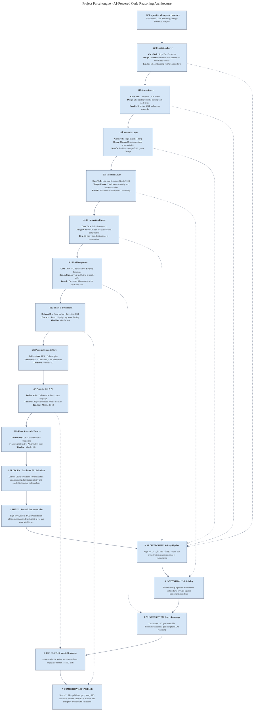

```mermaid
---
title: "Project Parseltongue - AI-Powered Code Reasoning Architecture"
config:
  flowchart:
    direction: TB
    nodeSpacing: 75
    rankSpacing: 75
    useMaxWidth: false
  theme: base
  themeVariables:
    primaryColor: '#D5E6F7'
    primaryBorderColor: '#6B778D'
    primaryTextColor: '#333'
    secondaryColor: '#C7E7F2'
    tertiaryColor: '#FEF3EA'
    lineColor: '#6B778D'
    noteBkgColor: '#FBFBFB'
    clusterBkg: '#FFFFFF'
    background: '#FFFFFF'
    fontFamily: 'Arial, sans-serif'
    fontSize: '11px'
---
flowchart TB
    Start["<b>🎬 Project Parseltongue Architecture</b><br/>AI-Powered Code Reasoning through Semantic Analysis"] --> 
    
    A1["<b>üíé Foundation Layer</b><br/><br/><b>Core Tech:</b> Rope Data Structure<br/><b>Design Choice:</b> Immutable text updates via tree-based chunks<br/><b>Benefit:</b> O(log n) editing vs O(n) array shifts"]
    
    A1 --> A2["<b>üîß Syntax Layer</b><br/><br/><b>Core Tech:</b> Tree-sitter GLR Parser<br/><b>Design Choice:</b> Incremental parsing with node reuse<br/><b>Benefit:</b> Real-time CST updates on keystroke"] 
    
    A2 --> A3["<b>🔄 Semantic Layer</b><br/><br/><b>Core Tech:</b> High-level IR (HIR)<br/><b>Design Choice:</b> Desugared, stable representation<br/><b>Benefit:</b> Resilient to superficial syntax changes"]
    
    A3 --> B1

    B1["<b>üåç Interface Layer</b><br/><br/><b>Core Tech:</b> Interface Signature Graph (ISG)<br/><b>Design Choice:</b> Public contracts only, no implementation<br/><b>Benefit:</b> Maximum stability for AI reasoning"] --> 
    
    B2["<b>‚è≥ Orchestration Engine</b><br/><br/><b>Core Tech:</b> Salsa Framework<br/><b>Design Choice:</b> On-demand query-based computation<br/><b>Benefit:</b> Early cutoff minimizes re-computation"]
    
    B2 --> B3["<b>📦 LLM Integration</b><br/><br/><b>Core Tech:</b> ISG Serialization & Query Language<br/><b>Design Choice:</b> Token-efficient semantic diffs<br/><b>Benefit:</b> Grounded AI reasoning with verifiable facts"]
    
    B3 --> C1

    C1["<b>🎯 Phase 1: Foundation</b><br/><br/><b>Deliverables:</b> Rope buffer + Tree-sitter CST<br/><b>Features:</b> Syntax highlighting, code folding<br/><b>Timeline:</b> Months 1-4"] --> 
    
    C2["<b>🔄 Phase 2: Semantic Core</b><br/><br/><b>Deliverables:</b> HIR + Salsa engine<br/><b>Features:</b> Go to Definition, Find References<br/><b>Timeline:</b> Months 5-12"] --> C3["<b>⚡ Phase 3: ISG & AI</b><br/><br/><b>Deliverables:</b> ISG construction + query language<br/><b>Features:</b> AI-powered code review assistant<br/><b>Timeline:</b> Months 13-18"] --> C4["<b>🚀 Phase 4: Agentic Futures</b><br/><br/><b>Deliverables:</b> LLM orchestrator + refactoring<br/><b>Features:</b> Interactive AI Architect panel<br/><b>Timeline:</b> Months 19+"]
    
    C4 --> D1

    D1["<b>1. PROBLEM: Text-based AI Limitations</b><br/><br/>Current LLMs operate on superficial text understanding, limiting reliability and capability for deep code analysis"] --> 
    
    D2["<b>2. THESIS: Semantic Representation</b><br/><br/>High-level, stable ISG provides token-efficient, semantically rich context for true code intelligence"] --> D3["<b>3. ARCHITECTURE: 4-Stage Pipeline</b><br/><br/>Rope ‚Üí CST ‚Üí HIR ‚Üí ISG with Salsa orchestration ensures minimal re-computation"] --> D4["<b>4. INNOVATION: ISG Stability</b><br/><br/>Interface-only representation creates architectural firewall against implementation churn"] --> D5["<b>5. AI INTEGRATION: Query Language</b><br/><br/>Declarative ISG queries enable deterministic context gathering for LLM reasoning"] --> D6["<b>6. USE CASES: Semantic Reasoning</b><br/><br/>Automated code review, security analysis, impact assessment via ISG diffs"] --> 
    
    D7["<b>7. COMPETITIVE ADVANTAGE</b><br/><br/>Beyond LSP capabilities, proprietary ISG data asset enables 'super-LSP' features and enterprise architectural validation"]

    %% Strategic connections between technical layers and decision flow
    A1 -.-> D3
    A2 -.-> D3
    A3 -.-> D3
    B1 -.-> D4
    B2 -.-> D3
    B3 -.-> D5
    C1 -.-> D7
    C3 -.-> D6

    classDef header fill:'#6B778D',color:'white',stroke:'#4A5568',stroke-width:2px
    classDef col1 fill:'#D5E6F7',color:'#333',stroke:'#6B778D',stroke-width:1px
    classDef col2 fill:'#C7E7F2',color:'#333',stroke:'#6B778D',stroke-width:1px
    classDef col3 fill:'#FEF3EA',color:'#333',stroke:'#6B778D',stroke-width:1px
    classDef col4 fill:'#E2E8F0',color:'#333',stroke:'#6B778D',stroke-width:1px
    
    class Start header
    class A1,A2,A3 col1
    class B1,B2,B3 col2
    class C1,C2,C3,C4 col3
    class D1,D2,D3,D4,D5,D6,D7 col4
```
