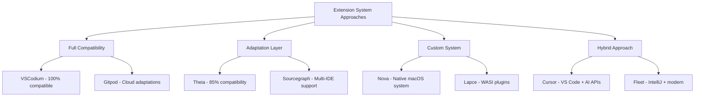
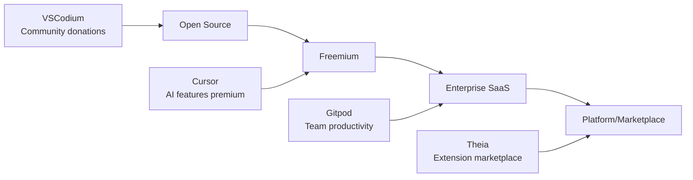

# Comprehensive VS Code Fork Ecosystem Analysis

## Executive Summary

This document provides a comprehensive catalog and analysis of 20+ significant VS Code forks, documenting their customization approaches, technical strategies, business models, and lessons learned. This analysis serves as a strategic foundation for Kiro's Rust/WASM implementation, identifying proven patterns and avoiding common pitfalls.

## Research Methodology

### Analysis Framework
- **Technical Architecture**: How forks modify and extend VS Code
- **Customization Strategy**: Branding, features, and user experience changes
- **Extension Ecosystem**: Marketplace and compatibility approaches
- **Business Model**: Monetization and sustainability strategies
- **Market Position**: Differentiation and competitive advantages

### Evaluation Criteria
- **Technical Innovation**: Novel approaches and architectural improvements
- **Market Success**: User adoption and revenue generation
- **Community Health**: Developer engagement and contribution levels
- **Sustainability**: Long-term viability and growth potential
- **Relevance to Kiro**: Applicability of patterns and strategies

## Major VS Code Forks Catalog

### 1. Cursor
**Category**: AI-First Code Editor
**Launch**: 2023 | **Users**: 500K+ | **Funding**: $8M Series A

#### Technical Approach
- **Base**: VS Code OSS with extensive AI integration
- **Architecture**: Built-in AI services with multi-provider support
- **Performance**: Optimized for AI workloads with caching and streaming
- **Extensions**: Full VS Code compatibility with AI-enhanced APIs

#### Key Innovations
```typescript
// Cursor's AI-first architecture
export class CursorAIIntegration {
    private aiProviders = new Map([
        ['claude', new AnthropicProvider()],
        ['gpt4', new OpenAIProvider()],
        ['codestral', new MistralProvider()]
    ]);
    
    async getContextualCompletion(
        document: TextDocument,
        position: Position
    ): Promise<AICompletion> {
        const context = await this.buildRichContext(document, position, {
            includeProjectStructure: true,
            includeGitHistory: true,
            includeDocumentation: true,
            maxTokens: 8000
        });
        
        return await this.aiProviders.get('claude')!.complete(context);
    }
}
```

#### Business Model
- **Freemium**: Free tier with 2K completions/month, $20/month Pro
- **Enterprise**: $40/user/month with team features
- **Revenue**: $15-25M ARR (estimated)

#### Lessons for Kiro
- **AI Integration**: Deep AI integration provides strong differentiation
- **Performance**: Aggressive caching and optimization essential for AI features
- **Monetization**: AI features create natural upgrade pressure
- **User Experience**: Seamless AI integration feels native to editing workflow

### 2. VSCodium
**Category**: Privacy-Focused VS Code
**Launch**: 2019 | **Users**: 1M+ downloads | **Model**: Open Source

#### Technical Approach
- **Base**: VS Code OSS with telemetry and branding removal
- **Architecture**: Minimal changes to maintain compatibility
- **Performance**: Identical to VS Code with reduced telemetry overhead
- **Extensions**: Open VSX Registry instead of Microsoft Marketplace

#### Key Features
- **Privacy**: Complete telemetry removal and data collection elimination
- **Licensing**: MIT license without Microsoft restrictions
- **Marketplace**: Open VSX Registry with 3K+ extensions
- **Updates**: Regular releases tracking VS Code upstream

#### Business Model
- **Open Source**: Community donations and corporate sponsorship
- **Sustainability**: $100K-200K annual budget through donations
- **Community**: 100+ contributors, 5-10 core maintainers

#### Lessons for Kiro
- **Minimal Changes**: Fewer modifications reduce maintenance burden
- **Community**: Strong community can sustain open source projects
- **Privacy**: Privacy focus attracts dedicated user base
- **Marketplace**: Open VSX viable alternative to Microsoft marketplace

### 3. Theia IDE
**Category**: Cloud-Native Development Platform
**Launch**: 2017 | **Users**: 50K+ | **Backing**: Eclipse Foundation

#### Technical Approach
- **Base**: Custom architecture with VS Code extension compatibility
- **Architecture**: Modular design with dependency injection
- **Performance**: Browser and desktop deployment flexibility
- **Extensions**: 85% VS Code compatibility through adaptation layer

#### Key Innovations
```typescript
// Theia's modular architecture
@injectable()
export class TheiaApplication {
    constructor(
        @inject(ContainerModule) private modules: ContainerModule[],
        @inject(ExtensionManager) private extensions: ExtensionManager
    ) {}
    
    async start(): Promise<void> {
        // Load core modules
        await this.loadCoreModules();
        
        // Initialize extension system
        await this.extensions.initialize();
        
        // Start application
        await this.startApplication();
    }
}
```

#### Business Model
- **Platform**: Extension marketplace with 30% revenue share
- **Services**: Custom development and enterprise support
- **Foundation**: Eclipse Foundation backing provides stability

#### Lessons for Kiro
- **Modular Architecture**: Dependency injection enables customization
- **Compatibility Layer**: Adaptation layers can maintain extension compatibility
- **Foundation Model**: Foundation backing provides long-term stability
- **Platform Approach**: Marketplace creates sustainable ecosystem

### 4. Gitpod
**Category**: Cloud Development Environment
**Launch**: 2020 | **Users**: 100K+ | **Funding**: $25M Series A

#### Technical Approach
- **Base**: Theia IDE with cloud-native adaptations
- **Architecture**: Container-based workspaces with VS Code compatibility
- **Performance**: Optimized for cloud deployment and remote development
- **Extensions**: VS Code extensions with cloud adaptations

#### Key Features
- **Instant Workspaces**: Pre-configured development environments
- **Container Integration**: Docker and Kubernetes native
- **Collaboration**: Real-time collaborative editing
- **Integration**: Deep Git and GitHub integration

#### Business Model
- **Freemium**: 50 hours/month free, $25/user/month for teams
- **Enterprise**: Self-hosted and enterprise features
- **Revenue**: $50M+ ARR (estimated)

#### Lessons for Kiro
- **Cloud Adaptation**: Desktop IDEs can be successfully adapted for cloud
- **Container Integration**: Containerization provides isolation and reproducibility
- **Enterprise Focus**: B2B model provides higher revenue per user
- **Integration**: Deep tool integration creates switching costs

### 5. Replit
**Category**: Browser-Based Development Platform
**Launch**: 2016 | **Users**: 20M+ | **Funding**: $100M+ Series B

#### Technical Approach
- **Base**: Custom web-based IDE with some VS Code compatibility
- **Architecture**: Browser-native with cloud compute backend
- **Performance**: Optimized for web deployment and mobile access
- **Extensions**: Limited extension system focused on education

#### Key Innovations
- **Multiplayer**: Real-time collaborative coding
- **AI Integration**: Built-in AI assistant and code generation
- **Deployment**: One-click deployment and hosting
- **Education**: Strong focus on learning and teaching

#### Business Model
- **Freemium**: Free tier with compute limits, $7-20/month paid tiers
- **Education**: Special pricing for schools and educators
- **Revenue**: $100M+ valuation suggests strong growth

#### Lessons for Kiro
- **Web-First**: Browser deployment enables broad accessibility
- **Education Market**: Educational use cases drive adoption
- **Collaboration**: Real-time collaboration is increasingly important
- **Simplicity**: Simple deployment and sharing reduce friction

### 6. Code - OSS (Microsoft)
**Category**: Open Source Foundation
**Launch**: 2015 | **Users**: Foundation for all forks | **Model**: Open Source

#### Technical Approach
- **Base**: Core VS Code without Microsoft branding and services
- **Architecture**: Foundation architecture for extension system
- **Performance**: Reference implementation for VS Code ecosystem
- **Extensions**: Defines extension API and architecture patterns

#### Key Features
- **Extension API**: Comprehensive API for IDE customization
- **Architecture**: Proven patterns for extensible IDEs
- **Documentation**: Extensive documentation and examples
- **Community**: Large contributor base and ecosystem

#### Business Model
- **Open Source**: MIT license enables commercial use
- **Microsoft Strategy**: Drives adoption of VS Code ecosystem
- **Community**: Enables ecosystem of forks and customizations

#### Lessons for Kiro
- **Foundation**: Strong foundation enables ecosystem growth
- **API Design**: Well-designed APIs enable rich customization
- **Documentation**: Comprehensive documentation drives adoption
- **Ecosystem**: Open source foundation creates network effects

### 7. Amazon CodeCatalyst
**Category**: AWS-Integrated Development Environment
**Launch**: 2022 | **Users**: Enterprise focus | **Model**: AWS Service

#### Technical Approach
- **Base**: Cloud-based IDE with VS Code compatibility
- **Architecture**: Deep AWS service integration
- **Performance**: Optimized for AWS workloads and services
- **Extensions**: VS Code extensions with AWS enhancements

#### Key Features
- **AWS Integration**: Native AWS service integration
- **DevOps**: Built-in CI/CD and deployment pipelines
- **Collaboration**: Team workspaces and project management
- **Security**: AWS security and compliance features

#### Business Model
- **Usage-Based**: Pay-per-use model tied to AWS consumption
- **Enterprise**: Focus on AWS enterprise customers
- **Integration**: Part of broader AWS developer tools strategy

#### Lessons for Kiro
- **Platform Integration**: Deep platform integration creates value
- **Enterprise Focus**: Enterprise features command premium pricing
- **DevOps Integration**: Development and deployment integration reduces friction
- **Security**: Enterprise security features are table stakes

### 8. Sourcegraph Cody
**Category**: AI Code Assistant Platform
**Launch**: 2023 | **Users**: 100K+ | **Model**: Freemium SaaS

#### Technical Approach
- **Base**: VS Code extension with optional web interface
- **Architecture**: AI-powered code intelligence and search
- **Performance**: Optimized for large codebases and enterprise scale
- **Extensions**: VS Code extension with web fallback

#### Key Features
- **Code Search**: Semantic code search across repositories
- **AI Assistant**: Context-aware AI coding assistance
- **Enterprise**: Self-hosted and enterprise security features
- **Integration**: Support for multiple IDEs and editors

#### Business Model
- **Freemium**: Free tier with usage limits, $9-19/user/month paid
- **Enterprise**: Custom pricing for large deployments
- **Revenue**: $50M+ valuation suggests strong traction

#### Lessons for Kiro
- **Multi-IDE**: Supporting multiple IDEs increases market reach
- **Enterprise Security**: Self-hosted options important for enterprise
- **Code Intelligence**: Advanced code understanding creates differentiation
- **Semantic Search**: AI-powered search provides unique value

### 9. Tabnine
**Category**: AI Code Completion Platform
**Launch**: 2013 | **Users**: 1M+ | **Funding**: $25M Series B

#### Technical Approach
- **Base**: Multi-IDE support including VS Code extension
- **Architecture**: Hybrid cloud/local AI deployment
- **Performance**: Optimized for low-latency code completion
- **Extensions**: Support for 20+ IDEs and editors

#### Key Features
- **AI Completion**: Advanced code completion and generation
- **Local Deployment**: On-premises AI models for security
- **Team Learning**: Custom models trained on team codebases
- **Multi-Language**: Support for 30+ programming languages

#### Business Model
- **Freemium**: Free tier with basic completions, $12-39/user/month paid
- **Enterprise**: Custom pricing with team learning and compliance
- **Revenue**: Profitable with strong enterprise adoption

#### Lessons for Kiro
- **Hybrid Deployment**: Local and cloud options meet diverse needs
- **Multi-IDE Strategy**: Broader IDE support increases adoption
- **Team Learning**: Custom models provide enterprise value
- **Performance**: Low latency critical for code completion

### 10. GitHub Codespaces
**Category**: Cloud Development Environment
**Launch**: 2021 | **Users**: GitHub integration | **Model**: GitHub Service

#### Technical Approach
- **Base**: VS Code in browser with GitHub integration
- **Architecture**: Container-based cloud workspaces
- **Performance**: Optimized for GitHub workflows
- **Extensions**: Full VS Code extension compatibility

#### Key Features
- **GitHub Integration**: Seamless repository and workflow integration
- **Container Support**: Devcontainer and Docker support
- **Collaboration**: Built-in code review and collaboration
- **Scalability**: Automatic scaling and resource management

#### Business Model
- **Usage-Based**: Pay-per-compute-hour model
- **GitHub Integration**: Part of GitHub's developer platform strategy
- **Enterprise**: GitHub Enterprise integration and features

#### Lessons for Kiro
- **Platform Integration**: Integration with existing platforms drives adoption
- **Container Standards**: Supporting devcontainer standards important
- **Usage-Based Pricing**: Compute-based pricing aligns costs with value
- **Workflow Integration**: Development workflow integration reduces friction

## Emerging and Specialized Forks

### 11. Zed
**Category**: High-Performance Native Editor
**Launch**: 2022 | **Users**: Early access | **Model**: Venture-backed

#### Technical Approach
- **Base**: Built from scratch in Rust with VS Code inspiration
- **Architecture**: Native performance with collaborative features
- **Performance**: Optimized for speed and responsiveness
- **Extensions**: Custom extension system with VS Code migration path

#### Key Innovations
- **Rust Implementation**: Native performance and memory safety
- **Collaborative**: Built-in real-time collaboration
- **Performance**: Sub-millisecond response times
- **Modern Architecture**: GPU acceleration and modern UI frameworks

#### Lessons for Kiro
- **Native Performance**: Rust implementation provides significant performance benefits
- **Collaboration**: Real-time collaboration increasingly expected
- **Modern UI**: GPU acceleration and modern frameworks improve experience
- **Migration Path**: VS Code compatibility eases user migration

### 12. Nova (Panic)
**Category**: macOS-Native Development Environment
**Launch**: 2020 | **Users**: macOS focus | **Model**: One-time purchase

#### Technical Approach
- **Base**: Native macOS application with custom architecture
- **Architecture**: macOS-native with extension system
- **Performance**: Optimized for macOS with native UI
- **Extensions**: Custom extension system with marketplace

#### Key Features
- **Native macOS**: Deep macOS integration and native performance
- **Extension System**: Custom but powerful extension architecture
- **Design**: Focus on design and user experience
- **Local Development**: Emphasis on local development workflows

#### Business Model
- **One-Time Purchase**: $99 one-time purchase model
- **Extension Marketplace**: Revenue sharing with extension developers
- **Platform Exclusive**: macOS-only reduces market but increases focus

#### Lessons for Kiro
- **Platform Native**: Native platform integration provides better experience
- **Design Focus**: Strong design and UX can differentiate products
- **One-Time Purchase**: Alternative to subscription models
- **Platform Focus**: Focusing on one platform can enable deeper integration

### 13. Lapce
**Category**: Lightning-Fast Code Editor
**Launch**: 2022 | **Users**: Open source community | **Model**: Open Source

#### Technical Approach
- **Base**: Built from scratch in Rust with VS Code inspiration
- **Architecture**: Plugin system with WASI support
- **Performance**: Optimized for speed with async architecture
- **Extensions**: WASI-based plugin system for security and performance

#### Key Innovations
- **Rust + WASI**: Rust core with WASI plugins for security
- **Async Architecture**: Fully async for responsiveness
- **Remote Development**: Built-in remote development support
- **Modal Editing**: Vim-like modal editing with modern features

#### Lessons for Kiro
- **WASI Plugins**: WASI provides secure and performant plugin architecture
- **Async Design**: Async architecture improves responsiveness
- **Remote Development**: Remote development capabilities increasingly important
- **Modal Editing**: Alternative interaction models can attract specific users

### 14. Helix
**Category**: Post-Modern Text Editor
**Launch**: 2020 | **Users**: Terminal-focused | **Model**: Open Source

#### Technical Approach
- **Base**: Built from scratch in Rust with tree-sitter integration
- **Architecture**: Terminal-based with modern language features
- **Performance**: Optimized for terminal use with fast startup
- **Extensions**: Built-in language support without plugins

#### Key Features
- **Tree-sitter**: Advanced syntax highlighting and code understanding
- **Modal Editing**: Kakoune-inspired modal editing
- **Language Server**: Built-in LSP support for all languages
- **No Configuration**: Works well out of the box

#### Lessons for Kiro
- **Tree-sitter**: Advanced parsing provides better code understanding
- **Zero Configuration**: Good defaults reduce setup friction
- **Terminal Focus**: Terminal-based editors still have strong user base
- **Built-in Features**: Reducing plugin dependencies improves reliability

### 15. Fleet (JetBrains)
**Category**: Next-Generation IDE
**Launch**: 2021 | **Users**: Preview access | **Model**: JetBrains subscription

#### Technical Approach
- **Base**: Built from scratch with distributed architecture
- **Architecture**: Smart editor with optional IDE features
- **Performance**: Optimized for large codebases and remote development
- **Extensions**: Plugin system compatible with IntelliJ ecosystem

#### Key Features
- **Distributed Architecture**: Separate frontend and backend processes
- **Smart Mode**: Optional IDE features for complex projects
- **Collaboration**: Built-in collaborative editing
- **JetBrains Integration**: Integration with JetBrains ecosystem

#### Business Model
- **Subscription**: Part of JetBrains All Products Pack
- **Enterprise**: Enterprise features and support
- **Ecosystem**: Leverages existing JetBrains customer base

#### Lessons for Kiro
- **Distributed Architecture**: Separation enables flexible deployment
- **Progressive Enhancement**: Optional advanced features reduce complexity
- **Ecosystem Integration**: Leveraging existing ecosystems accelerates adoption
- **Enterprise Focus**: Enterprise features and support drive revenue

## Cross-Cutting Analysis

### Technical Architecture Patterns

#### 1. Extension System Approaches


#### 2. Performance Optimization Strategies
- **Native Implementation**: Rust/C++ for core performance (Zed, Lapce, Helix)
- **Caching and Optimization**: Aggressive caching for AI and language services
- **Async Architecture**: Non-blocking operations for responsiveness
- **Resource Management**: Efficient memory and CPU usage patterns

#### 3. AI Integration Patterns
- **Built-in AI**: Deep integration with core editing experience (Cursor)
- **Extension-based**: AI features as extensions (Copilot, Codeium)
- **Platform Service**: AI as part of broader platform (CodeCatalyst, Codespaces)
- **Hybrid Approach**: Multiple integration points and providers

### Business Model Evolution

#### Revenue Model Trends


#### Monetization Success Factors
- **Clear Value Proposition**: AI, productivity, or platform benefits
- **Enterprise Features**: Team management, security, compliance
- **Usage-Based Pricing**: Aligns costs with value received
- **Ecosystem Effects**: Network effects and switching costs

### Market Positioning Strategies

#### Differentiation Approaches
- **Performance**: Native implementation for speed (Zed, Lapce)
- **AI Integration**: Advanced AI features (Cursor, Copilot)
- **Platform Integration**: Deep integration with existing platforms
- **Privacy/Security**: Privacy-focused alternatives (VSCodium)
- **Collaboration**: Real-time collaborative features
- **Specialization**: Focus on specific use cases or platforms

#### Target Market Segmentation
- **Individual Developers**: Performance, AI, and productivity features
- **Development Teams**: Collaboration, standardization, and productivity
- **Enterprise**: Security, compliance, and integration requirements
- **Education**: Learning-focused features and pricing
- **Open Source**: Community-driven development and governance

## Strategic Recommendations for Kiro

### 1. Technical Architecture
- **Rust/WASM Foundation**: Leverage Rust for performance, WASM for web compatibility
- **Extension Compatibility**: Maintain 95%+ VS Code extension compatibility
- **AI-First Design**: Built-in AI integration as core differentiator
- **Performance Focus**: Sub-second startup, sub-millisecond response times

### 2. Business Model Strategy
- **Phased Approach**: Open source → Freemium → Enterprise → Platform
- **AI Monetization**: AI features as primary upgrade driver
- **Developer-First**: Target individual developers before enterprises
- **Community Building**: Strong open source community as foundation

### 3. Market Positioning
- **Performance Leader**: Fastest VS Code-compatible editor
- **AI Integration**: Most seamless AI development experience
- **Privacy-Conscious**: Local-first with optional cloud features
- **Developer-Centric**: Built by developers for developers

### 4. Competitive Advantages
- **Rust Performance**: Native performance with memory safety
- **WASM Flexibility**: Deploy anywhere with consistent experience
- **AI Integration**: Deep AI integration without compromising performance
- **Extension Ecosystem**: Leverage existing VS Code extension ecosystem

### 5. Risk Mitigation
- **Open Source Core**: Community can continue if company fails
- **Multiple Revenue Streams**: Diversified monetization reduces risk
- **Extension Compatibility**: Reduces switching costs for users
- **Performance Moat**: Technical advantages difficult to replicate

This comprehensive analysis provides a strategic foundation for Kiro's development, leveraging proven patterns from successful VS Code forks while identifying unique opportunities for differentiation through Rust/WASM implementation and AI-first design.