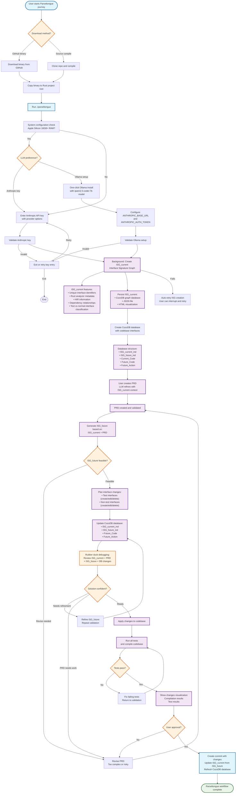

# Parseltongue User Flows Summary

```mermaid
---
config:
  flowchart:
    nodeSpacing: 75
    rankSpacing: 75
    curve: basis
---
flowchart TD
    %% User Onboarding Flow
    Start(["User starts Parseltongue journey"])
    Start --> SetupChoice{"Download method?"}
    SetupChoice -->|GitHub binary| DownloadBin["Download binary from GitHub"]
    SetupChoice -->|Source compile| CloneSource["Clone repo and compile"]
    DownloadBin --> CopyToProject["Copy binary to Rust project root"]
    CloneSource --> CopyToProject
    CopyToProject --> RunParseltongue["Run ./parseltongue"]

    %% System Configuration Flow
    RunParseltongue --> SystemCheck["System configuration check<br/>Apple Silicon 16GB+ RAM?"]
    SystemCheck -->|Yes| LLMChoice{"LLM preference?"}
    SystemCheck -->|No| EnterAnthropicKey["Enter Anthropic API key<br/>with provider options"]

    LLMChoice -->|Anthropic key| EnterAnthropicKey
    LLMChoice -->|Ollama setup| OllamaSetup["One-click Ollama install<br/>with qwen2.5-coder:7b model"]
    OllamaSetup --> ConfigureOllama["Configure ANTHROPIC_BASE_URL<br/>and ANTHROPIC_AUTH_TOKEN"]

    EnterAnthropicKey --> ValidateKey["Validate Anthropic key"]
    ConfigureOllama --> ValidateOllama["Validate Ollama setup"]
    ValidateKey -->|Invalid| ExitOrRetry["Exit or retry key entry"]
    ValidateOllama -->|Invalid| ExitOrRetry

    %% ISG Creation Flow
    ValidateKey --> ISGCreation["Background: Create ISG_current<br/>Interface Signature Graph"]
    ValidateOllama --> ISGCreation
    ExitOrRetry -->|Retry| EnterAnthropicKey
    ExitOrRetry -->|Exit| EndFlow(["End"])

    ISGCreation --> ISGDetails["ISG_current features:<br/>• Unique interface identifiers<br/>• Rust analyzer metadata<br/>• HIR information<br/>• Dependency relationships<br/>• Test vs normal interface classification"]
    ISGCreation --> PersistISG["Persist ISG_current:<br/>• CozoDB graph database<br/>• JSON file<br/>• HTML visualization"]

    %% Codebase Processing
    PersistISG --> CozoDB["Create CozoDB database<br/>with codebase interfaces"]
    CozoDB --> DBStructure["Database structure:<br/>• ISG_current_ind<br/>• ISG_future_ind<br/>• Current_Code<br/>• Future_Code<br/>• Future_Action"]

    %% PRD Workflow
    DBStructure --> AskPRD["User creates PRD<br/>LLM refines with ISG_current context"]
    AskPRD --> CreatePRD["PRD created and validated"]

    CreatePRD --> GenerateISGFuture["Generate ISG_future based on:<br/>ISG_current + PRD"]
    GenerateISGFuture --> ValidateISGFuture{"ISG_future feasible?"}

    ValidateISGFuture -->|Revise needed| RevisePRD["Revise PRD<br/>Too complex or risky"]
    ValidateISGFuture -->|Feasible| PlanChanges["Plan interface changes:<br/>• Test interfaces (create/edit/delete)<br/>• Non-test interfaces (create/edit/delete)"]

    RevisePRD --> CreatePRD
    PlanChanges --> UpdateDB["Update CozoDB database:<br/>• ISG_current_ind<br/>• ISG_future_ind<br/>• Future_Code<br/>• Future_Action"]

    %% Rubber Duck Validation
    UpdateDB --> RubberDuck["Rubber duck debugging:<br/>Review ISG_current + PRD + ISG_future + DB changes"]
    RubberDuck --> ValidateSolution{"Solution confident?"}

    ValidateSolution -->|Needs refinement| RefineSolution["Refine ISG_future<br/>Repeat validation"]
    ValidateSolution -->|PRD needs work| RevisePRD
    ValidateSolution -->|Ready| ApplyChanges["Apply changes to codebase"]

    RefineSolution --> UpdateDB

    %% Testing and Finalization
    ApplyChanges --> RunTests["Run all tests<br/>and compile codebase"]
    RunTests --> TestsPass{"Tests pass?"}

    TestsPass -->|No| FixIssues["Fix failing tests<br/>Return to validation"]
    TestsPass -->|Yes| ShowResults["Show changes visualization<br/>Compilation results<br/>Test results"]

    FixIssues --> RunTests
    ShowResults --> UserConfirm{"User approval?"}

    UserConfirm -->|No| RevisePRD
    UserConfirm -->|Yes| FinalCommit["Create commit with changes<br/>Update ISG_current from ISG_future<br/>Refresh CozoDB database"]

    FinalCommit --> Complete(["Parseltongue workflow complete"])

    %% Error handling
    ISGCreation -->|Fails| RetryISG["Auto-retry ISG creation<br/>User can interrupt and retry"]

    %% Styling
    classDef startClass fill:#e1f5fe,stroke:#01579b,stroke-width:2px
    classDef processClass fill:#f3e5f5,stroke:#4a148c,stroke-width:2px
    classDef decisionClass fill:#fff3e0,stroke:#e65100,stroke-width:2px
    classDef endClass fill:#e8f5e8,stroke:#1b5e20,stroke-width:2px

    class Start,RunParseltongue,FinalCommit startClass
    class SetupChoice,LLMChoice,ValidateISGFuture,RubberDuck,ValidateSolution,TestsPass,UserConfirm decisionClass
    class ISGCreation,ISGDetails,PersistISG,SQLiteDB,DBStructure,AskPRD,CreatePRD,GenerateISGFuture,PlanChanges,UpdateDB,ApplyChanges,RunTests,ShowResults processClass
    class Complete endClass
```