# L1 Technical Architecture

```mermaid
---
config:
  flowchart:
    nodeSpacing: 75
    rankSpacing: 75
    curve: basis
---
flowchart TD
    %% L1 - High Level System Architecture (Updated with Batch 2 insights)
    CC["Claude Code<br/>Agentic Terminal Coding Tool"]

    %% Core Interfaces (Enhanced)
    CC --> Terminal["Terminal Interface<br/>Natural Language Commands"]
    CC --> IDE["VS Code Extension<br/>Native Integration"]
    CC --> GitHub["GitHub Integration<br/>@claude mentions & PRs"]
    CC --> PluginSystem["Plugin Ecosystem<br/>Extensible Command System"]

    %% Core Capabilities (Enhanced)
    Terminal --> Tasks["Routine Task Execution<br/>Code explanations, git workflows"]
    IDE --> Editing["Advanced Editing<br/>Real-time collaboration"]
    GitHub --> Collaboration["Team Collaboration<br/>Code reviews & PR management"]
    PluginSystem --> Extensions["Custom Extensions<br/>Agents, hooks, MCP servers"]

    %% Key Features (Enhanced)
    Tasks --> MultiModal["Multi-modal Input<br/>Text, images, files"]
    Editing --> LiveEdit["Live Code Editing<br/>Real-time diff application"]
    Collaboration --> Social["Social Coding<br/>@mentions & discussions"]
    Extensions --> Customization["Deep Customization<br/>Custom agents & workflows"]

    %% Data Flow (Enhanced)
    MultiModal --> LLM["Claude LLM Integration<br/>Context understanding"]
    LiveEdit --> Tools["Tool Execution Engine<br/>Bash, grep, edit, todo"]
    Social --> MCP["MCP Protocol Support<br/>External service integration"]
    Customization --> SDK["Multi-Language SDK<br/>TypeScript & Python support"]

    %% Architecture Benefits (Enhanced)
    LLM --> Benefits["Benefits:<br/>• Natural language programming<br/>• Context-aware assistance<br/>• Multi-platform support<br/>• Plugin extensibility"]
    Tools --> Reliability["Reliability:<br/>• Plugin ecosystem<br/>• Extensible architecture<br/>• Enterprise-grade security<br/>• Permission management"]
    MCP --> Scalability["Scalability:<br/>• Cloud & local deployment<br/>• Team collaboration<br/>• Custom integrations<br/>• Multi-language SDKs"]
    SDK --> Ecosystem["Ecosystem:<br/>• Hook system<br/>• Agent framework<br/>• Security validation<br/>• Development tooling"]

    %% Styling
    classDef primary fill:#e3f2fd,stroke:#1976d2,stroke-width:3px
    classDef secondary fill:#f3e5f5,stroke:#7b1fa2,stroke-width:2px
    classDef feature fill:#e8f5e8,stroke:#388e3c,stroke-width:2px
    classDef benefit fill:#fff3e0,stroke:#f57c00,stroke-width:2px

    class CC primary
    class Terminal,IDE,GitHub,PluginSystem secondary
    class Tasks,Editing,Collaboration,Extensions,MultiModal,LiveEdit,Social,Customization feature
    class LLM,Tools,MCP,SDK,Benefits,Reliability,Scalability,Ecosystem benefit
```

# L2 Technical Architecture

# L3 Technical Architecture

# Comprehensive Architecture Analysis Summary (All 9 Batches - Lines 1-5632)

## **Claude Code - Enterprise-Grade AI Development Platform**

### **Final Architecture Assessment:**

**🏗️ Architecture Maturity: Production-Ready Enterprise Platform**
- **Plugin Ecosystem**: 5 specialized plugins with comprehensive functionality
- **Multi-Language SDK**: Full TypeScript & Python SDK implementations with verification agents
- **Security Framework**: Enterprise-grade security with hook-based validation, permission management, and input sanitization
- **Development Infrastructure**: Complete Docker containerization, CI/CD pipelines, comprehensive testing frameworks
- **Extensibility Model**: Hook system, custom agents, MCP protocol integration, slash command framework

### **Key Architectural Strengths:**

**🔧 Technical Excellence:**
- **Modular Plugin Architecture**: Clean separation of concerns with extensible command system
- **Security-First Design**: Comprehensive validation, permission management, secure defaults
- **Multi-Platform Support**: Terminal, VS Code extension, GitHub integration
- **Performance Optimized**: Efficient session management, context caching, lazy loading
- **Enterprise Scalability**: Docker containerization, CI/CD automation, comprehensive testing

**🎯 Developer Experience:**
- **Natural Language Interface**: Conversational programming with context awareness
- **Agent Ecosystem**: Specialized agents for different development workflows
- **Hook System**: Lifecycle management for deep customization
- **Verification Framework**: Automated SDK compliance checking and validation
- **Rich Command Set**: 50+ built-in commands with custom slash command support

**🔒 Security & Reliability:**
- **Permission Management**: Granular tool access control with validation hooks
- **Input Validation**: Command pattern matching and security scanning
- **Secure Defaults**: Principle of least privilege with explicit permission requests
- **Audit Trail**: Comprehensive logging and session state management
- **Error Handling**: Robust error recovery and user-friendly error messages

### **Architecture Comparison:**
- **Plugin System**: Similar to VS Code extensions but focused on AI development workflows
- **Agent Framework**: Custom agent development with specialized domain expertise
- **Hook System**: Advanced lifecycle management for deep customization
- **Security Model**: More sophisticated than typical CLI tools with comprehensive validation
- **Development Experience**: Combines IDE features with AI assistance in terminal environment

### **Technology Stack Summary:**
- **Runtime**: Node.js 20+ with TypeScript
- **Containerization**: Docker with DevContainer support
- **CI/CD**: GitHub Actions with comprehensive workflows
- **Databases**: SQLite for session management
- **Security**: iptables-based firewall, OAuth, API key management
- **External Integrations**: MCP protocol, GitHub API, web search capabilities

**📊 Final Assessment: Claude Code represents a mature, enterprise-grade AI development platform with sophisticated plugin architecture, comprehensive security framework, and extensive developer tooling - positioning it as a leading solution in the AI-assisted development space.**

---

## Reliability-First Alignment and ISG/CodeGraph Mapping (P24 coherence)

- ISG Levels
  - ISGL1: interface nodes (filepath-filename-InterfaceName) as the persistent key.
  - ISGL2/ISGL3: constituents under L1 for understanding only; no direct writes.
- CodeGraph Discipline
  - codegraph-write-surface is the sole write surface (Current_Code, Future_Code, Future_Action, flags, status).
  - All diffs flow: Reason/Rule → CodeGraph.Future_Code → preflight-safety-gate → flip to Current_Code.
- Deterministic-First
  - deterministic-patch-engine proposes bounds/lifetime/cfg templates before any LLM.
  - reasoning-adapter-bridge invoked only if confidence < threshold; ≤3K tokens.
- Safety Gates
  - constraints-overlay-analyzer (didOpen buffers) + cargo check --quiet + selective-test-runner.
  - SLOs: RA overlay 0.6–1.2s; cargo check 1.5–3.5s; tests 2–8s (impacted set).
- Retrieval and Packing
  - hybrid-retrieval-engine: Datalog two-hop + vector KNN; L1>L2>L3 rank; Needed shortlist ≤50.
  - context-pack-builder: start/early/middle/end; summaries first; ≤3K tokens.
- TDD Hooks (example)
  - Check recall@15 ≥ 0.9 for summary vectors; FACR ≥ 97%; tokens_per_fix p95 ≤ 3K; rollback ≤ 1%.

---

## Tool Surface Mapping (from these diagrams)

- interface-graph-builder → derive ISGL1 from agent files, commands, hooks.
- interface-summary-generator → 1-liners for agents/commands to steer packing.
- embedding-index-builder → vectors for summaries + code; HNSW indices.
- hybrid-retrieval-engine → shortlist interfaces per error/task.
- deterministic-patch-engine → rule diffs for known Rust fixes.
- reasoning-adapter-bridge → local Qwen 3B/7B or cloud critic/planner.
- preflight-safety-gate → RA overlay, cargo check, selective tests.
- git-apply-rollback → apply/commit after pass; rollback otherwise.

---

## Minimal KPI Sheet (to monitor in CI)
- FACR (first-apply correctness) ≥ 97%
- tokens_per_fix p95 ≤ 3K; zero_llm_rate ≥ 30%
- preflight_p95 ≤ 3s; selective_tests_p95 ≤ 8s
- retrieval_precision@K ≥ 0.85; summary_coverage ≥ 95%
