# P17: The Sub-Agent Game - Parallel Intelligence Architecture

> **Inspired by**: Shreyas Doshi's product thinking + Jeff Dean's distributed systems architecture

**⚡ Context Window Decision**: This architecture uses **20K context with sub-agents** instead of 128K context. See [P19_128K_Context_Analysis.md](./P19_128K_Context_Analysis.md) for detailed trade-offs.

**TL;DR**: 128K context = slower (75-120s), less accurate (62% vs 88% for bugs), but simpler. Sub-agents = faster (45-60s), more precise, better for latency-critical tasks.

## 🎯 Core Insight: Journey-Specific Agent Orchestration

**Product Lens (Shreyas)**: Each journey has fundamentally different user needs:
- Journey 1 (Bug Fixing): **Speed to solution** - minimize time to validated fix
- Journey 2 (Pattern Research): **Breadth of exploration** - maximize pattern discovery
- Journey 3 (Academic Research): **Depth of synthesis** - maximize insight extraction

**Systems Lens (Jeff Dean)**: Agent configuration should match journey constraints:
- Journey 1: **Latency-optimized** - 7-8 agents, tight feedback loops, fast validation (20K context)
- Journey 2: **Throughput-optimized** - 10-15 agents OR 128K hybrid, broad parallel search
- Journey 3: **Accuracy-optimized** - 5-6 specialized agents OR pure 128K context, deep semantic analysis

**💡 Why Not Just Use 128K Context?**

**The "Lost in Middle" Problem**:
- Research shows models ignore **middle 60%** of long contexts (30-40% accuracy vs 80% at start/end)
- 5MB codebase = 1.25M tokens → **99.6% irrelevant** to specific bug
- 128K context = 2-3x slower inference (75-120s vs 45-60s)
- Higher RAM usage (14-18 GB vs 8-10 GB)

**When 128K Makes Sense**:
- ✅ Journey 3 (Academic Research): Full paper visibility needed, speed less critical
- ✅ Hybrid Journey 2: Scan full codebase for patterns, then validate with agents
- ❌ Journey 1 (Bug Fixing): Too slow, loses precision in middle sections

**Default Choice**: Sub-agents with 20K context for speed + precision. Optional 128K mode for research tasks.

---

## 🏗️ The Sub-Agent Game: Multi-Phase Parallel Architecture

```mermaid
---
config:
  flowchart:
    nodeSpacing: 80
    rankSpacing: 80
    curve: basis
---
flowchart TD
    %% User Entry Point
    Start(["Developer starts<br/>Parseltongue"]) --> JourneyChoice{"Choose journey<br/>🐛 Bug | 🔍 Pattern | 📚 Academic"}
    
    %% Journey 1: Bug Fixing - Latency Optimized (7-8 agents)
    JourneyChoice -->|🐛 Bug Fixing| J1_Setup["Journey 1 Setup<br/>Target: <1 min end-to-end<br/>Agent config: 7-8 parallel"]
    
    J1_Setup --> J1_Phase1["PHASE 1: Parallel Sub-Agents<br/>━━━━━━━━━━━━━━━━━━━━━<br/>Agent 1-2: Search ISG<br/>Agent 3-4: Validate constraints<br/>Agent 5-6: Find alternatives<br/>Agent 7-8: Historical context<br/>━━━━━━━━━━━━━━━━━━━━━<br/>Time: 5-10 sec parallel"]
    
    J1_Phase1 --> J1_Enrich["Data Enrichment<br/>40K tokens processed<br/>↓<br/>5-10K summary tokens"]
    
    J1_Enrich --> J1_Phase2["PHASE 2: Reasoning LLM<br/>━━━━━━━━━━━━━━━━━━━━━<br/>Model: Qwen 14B (20K context)<br/>Context: 8-13K tokens used<br/>Task: Predict ISG changes<br/>━━━━━━━━━━━━━━━━━━━━━<br/>Time: 30-45 sec<br/><br/>⚠️ 128K option: 75-120s, 62% accuracy"]
    
    J1_Phase2 --> J1_Confidence{Confidence<br/>> 80%?}
    
    J1_Confidence -->|❌ Low| J1_Refine["Route to refinement<br/>agents 5-6"]
    J1_Refine --> J1_Phase1
    
    J1_Confidence -->|✅ High| J1_Phase3["PHASE 3: Validation<br/>━━━━━━━━━━━━━━━━━━━━━<br/>1. Apply changes<br/>2. cargo check (~10s)<br/>3. cargo test<br/>━━━━━━━━━━━━━━━━━━━━━<br/>Time: 10-15 sec"]
    
    J1_Phase3 --> J1_TestPass{Tests<br/>pass?}
    J1_TestPass -->|❌ Fail| J1_Refine
    J1_TestPass -->|✅ Pass| J1_Output["Bug fix ready<br/>Total time: ~1 min"]
    
    %% Journey 2: Pattern Research - Throughput Optimized (10-15 agents)
    JourneyChoice -->|🔍 Pattern Research| J2_Setup["Journey 2 Setup<br/>Target: Max pattern coverage<br/>Agent config: 10-15 parallel"]
    
    J2_Setup --> J2_Phase1["PHASE 1: Parallel Sub-Agents<br/>━━━━━━━━━━━━━━━━━━━━━<br/>Agent 1-3: Multi-level ISG scan<br/>Agent 4-6: Pattern classification<br/>Agent 7-9: Vector similarity<br/>Agent 10-12: Graph algorithms<br/>Agent 13-15: Web research<br/>━━━━━━━━━━━━━━━━━━━━━<br/>Time: 10-15 sec parallel"]
    
    J2_Phase1 --> J2_Enrich["Data Enrichment<br/>60K tokens processed<br/>↓<br/>8-12K summary tokens"]
    
    J2_Enrich --> J2_Phase2["PHASE 2: Reasoning LLM<br/>━━━━━━━━━━━━━━━━━━━━━<br/>Model: Qwen 14B (20K OR 128K)<br/>Context: 10-15K OR full codebase<br/>Task: Categorize patterns<br/>━━━━━━━━━━━━━━━━━━━━━<br/>Time: 20-30s (20K) / 60-90s (128K)<br/><br/>💡 Hybrid mode available"]
    
    J2_Phase2 --> J2_Output["Pattern report ready<br/>Total time: 30-60 sec"]
    
    %% Journey 3: Academic Research - Accuracy Optimized (5-6 agents)
    JourneyChoice -->|📚 Academic Research| J3_Setup["Journey 3 Setup<br/>Target: Deep synthesis<br/>Agent config: 5-6 specialized"]
    
    J3_Setup --> J3_Phase1["PHASE 1: Specialized Sub-Agents<br/>━━━━━━━━━━━━━━━━━━━━━<br/>Agent 1: Citation extraction<br/>Agent 2: Concept mapping<br/>Agent 3: Gap analysis<br/>Agent 4: Code-paper matching<br/>Agent 5-6: Synthesis prep<br/>━━━━━━━━━━━━━━━━━━━━━<br/>Time: 15-20 sec parallel"]
    
    J3_Phase1 --> J3_Enrich["Data Enrichment<br/>30K tokens processed<br/>↓<br/>6-8K summary tokens"]
    
    J3_Enrich --> J3_Phase2["PHASE 2: Reasoning LLM<br/>━━━━━━━━━━━━━━━━━━━━━<br/>Model: Qwen 14B (128K context)<br/>Context: 60-80K tokens (full papers)<br/>Task: Deep synthesis<br/>━━━━━━━━━━━━━━━━━━━━━<br/>Time: 90-120 sec<br/><br/>✅ Best use case for 128K"]
    
    J3_Phase2 --> J3_Output["Research insights ready<br/>Total time: 1-2 min"]
    
    %% Shared Infrastructure
    J1_Phase1 -.->|Query| CozoDB[("CozoDB<br/>━━━━━<br/>ISG Nodes/Edges<br/>HNSW Vectors<br/>Time Travel")]
    J2_Phase1 -.->|Query| CozoDB
    J3_Phase1 -.->|Query| CozoDB
    
    %% Styling
    classDef startClass fill:#e1f5fe,stroke:#01579b,stroke-width:3px
    classDef j1Class fill:#ffebee,stroke:#c62828,stroke-width:2px
    classDef j2Class fill:#f3e5f5,stroke:#6a1b9a,stroke-width:2px
    classDef j3Class fill:#e8f5e8,stroke:#2e7d32,stroke-width:2px
    classDef phaseClass fill:#fff3e0,stroke:#ef6c00,stroke-width:2px
    classDef dbClass fill:#e0f2f1,stroke:#00695c,stroke-width:2px
    classDef decisionClass fill:#fce4ec,stroke:#880e4f,stroke-width:2px
    
    class Start startClass
    class J1_Setup,J1_Phase1,J1_Phase2,J1_Phase3,J1_Enrich,J1_Refine,J1_Output j1Class
    class J2_Setup,J2_Phase1,J2_Phase2,J2_Enrich,J2_Output j2Class
    class J3_Setup,J3_Phase1,J3_Phase2,J3_Enrich,J3_Output j3Class
    class CozoDB dbClass
    class JourneyChoice,J1_Confidence,J1_TestPass decisionClass
```



---

## 📊 Journey Differentiation Matrix (Shreyas Framework)

### Agent Configuration by Journey

| Dimension | Journey 1: Bug Fixing 🐛 | Journey 2: Pattern Research 🔍 | Journey 3: Academic Research 📚 |
|-----------|------------------------|-------------------------------|--------------------------------|
| **Primary Metric** | Time to validated fix | Pattern coverage | Insight depth |
| **Agent Count** | 7-8 (latency-focused) | 10-15 (throughput-focused) | 5-6 (accuracy-focused) |
| **Context Budget** | 3-8K per agent | 4-6K per agent | 8-12K per agent |
| **Parallelism** | High (independent tasks) | Very High (batch queries) | Medium (sequential reasoning) |
| **CozoDB Strategy** | Exact + 1-hop blast radius | Multi-level graph traversal | Vector + citation network |
| **Reasoning Context** | 20K (sub-agents) | 20K or 128K (hybrid) | 128K (full papers) |
| **Reasoning Depth** | Fast decision (30-45s) | Categorization (20-30s) | Deep synthesis (90-120s) |
| **Total Time** | ~1 minute | ~30-90 seconds | ~1.5-2 minutes |
| **Accuracy** | 88% (sub-agents) | 91% (hybrid) | 95% (128K) |

### Shreyas Lens: User Impact Analysis

**Journey 1 (Bug Fixing)**
- **Impact**: Reduce debugging time from hours to 1 minute
- **Execution**: 7-8 agents query ISG, validate constraints, find historical fixes
- **Optics**: Developer sees "AI understood my bug and fixed it correctly"

**Journey 2 (Pattern Research)**
- **Impact**: Catalog patterns in 5MB codebase in <1 min vs hours of manual review
- **Execution**: 10-15 agents scan all ISG levels, classify patterns, build catalog
- **Optics**: Developer discovers idiomatic patterns they didn't know existed

**Journey 3 (Academic Research)**
- **Impact**: Connect research papers to implementation gaps in minutes vs weeks
- **Execution**: 5-6 specialized agents extract citations, map concepts, synthesize
- **Optics**: Researcher sees novel connections between theory and practice

---

## 🔧 Jeff Dean Lens: Distributed Systems Architecture

### Parallel Processing Breakdown

#### Journey 1: Latency-Critical Path (Bug Fixing)

```
Timeline (Total: ~60 seconds):

t=0s:    User submits bug description
t=0-5s:  7-8 agents launch in parallel
         ├─ Agent 1-2: ISG dependency search (CozoDB Datalog)
         ├─ Agent 3-4: Constraint validation (type bounds, lifetimes)
         ├─ Agent 5-6: Alternative exploration (async patterns)
         └─ Agent 7-8: Historical bug vector search (HNSW)

t=5-10s: Data enrichment phase
         ├─ 40K tokens processed → 5-10K summaries
         ├─ 10x compression with increased information density
         └─ Structured output: constraints, alternatives, confidence

t=10-40s: Reasoning LLM (Qwen 14B)
         ├─ Input: 8-13K tokens (well within 20K budget)
         ├─ Task: Predict ISG changes, generate code diff
         ├─ Output: PRD with 95% confidence
         └─ 10-15K tokens FREE for edge case analysis

t=40-50s: Cargo check validation
         ├─ Apply changes to temp workspace
         ├─ Run cargo check (~10s)
         └─ If fail → route to agents 5-6 for refinement

t=50-60s: Present to user
         └─ Diff view + test results + confidence score
```

**Key Optimization**: Sub-agents prevent reasoning LLM context overflow

---

## 📝 Key Takeaways

### For Product Managers (Shreyas Lens)
1. **Differentiate journeys** - one size doesn't fit all
2. **Optimize for user impact** - speed for J1, coverage for J2, depth for J3
3. **Measure what matters** - time to fix vs patterns found vs insights generated

### For Engineers (Jeff Dean Lens)
1. **Parallelize intelligently** - Phase 1 is embarrassingly parallel
2. **Preserve context** - 10x compression with quality increase
3. **Scale thoughtfully** - agent count should match journey needs

### For All
**The sub-agent game is won by**:
- Deploying the right number of agents for the journey
- Enriching data before passing to reasoning LLM
- Preserving context budget for deep thinking
- Validating early and often

---

**Total Time Saved Across Journeys**: 3-8x faster than single-threaded approach  
**Context Preservation**: 10-15K tokens free for deep reasoning (20K context) OR 40-60K tokens available (128K context)  
**Resource Efficiency**: All journeys fit in 16GB Mac Mini (sub-agents mode; 128K mode may require 18GB)

**Context Window Strategy**:
- **Journey 1**: 20K context + sub-agents (speed + precision) ✅ Default
- **Journey 2**: Hybrid (128K scan → sub-agent validation) ⚡ Best accuracy
- **Journey 3**: 128K context (full visibility) 🎓 Deep synthesis

*The future of code intelligence is not the biggest context window, but the right context delivered at the right time.*

---

## 📎 Related Documents

- **[P19: 128K Context Analysis](./P19_128K_Context_Analysis.md)** - Detailed pros/cons of 128K vs sub-agents
- **[P18: Alternative Ways](./P18AltWays.md)** - Implementation contracts and coordination
- **[P16: Sub-Agent Architecture](./P16NotesOnSubAgents.md)** - Technical deep-dive on agent coordination

