# P23ClaudePlugin — Rust Large Codebase Bug Solving Journey (P31-inspired)

Status: Draft v1.0
Owner: P23 Initiative

## 🎯 Core User Job Story

"When I hit a Rust bug, I want the system to understand my codebase, find the root cause using proven patterns, generate a safe fix, and validate it before I apply — all within 60–90 seconds."

---

## 📚 Inspirations

- Anthropic Claude Code Plugins: anthropics-claude-code (agents, commands, hooks, plugin.json, workflows)
- P31: Rust Debugging Journey — Inspired by P20 Flow (pattern-guided orchestration + safety)

---

## 🗺️ User Journey Flow (P31 Architecture Realized as a Claude Code Plugin)

```mermaid
---
config:
  flowchart:
    nodeSpacing: 60
    rankSpacing: 60
    curve: basis
---
flowchart TB
    %% SETUP
    start([🐛 User reports bug]) --> checkISG{ISG exists?}
    checkISG -- No --> buildISG[[PHASE 0a: Build ISG<br/>AST→Edges→Embeddings→Index]]
    buildISG --> loadPatterns[[PHASE 0b: Load Patterns<br/>150+ patterns • 100+ anti • 200+ errors]]
    loadPatterns --> annotate[[PHASE 0c: Annotate ISG<br/>pattern/anti metadata]]
    checkISG -- Yes --> loadPatterns
    annotate --> isgReady([ISG Ready])
    loadPatterns --> isgReady

    %% PHASE 1: Discovery
    subgraph Phase1["PHASE 1: Discovery (5–10s)"]
      direction TB
      a1[[A1 Scope Seeder<br/>error→seeds+hints]]
      par1{{Parallel}}
      a2[[A2 Exact Retriever<br/>2-hop CALLS/DEPENDS]]
      a3[[A3 Vector Retriever<br/>HNSW K=15 (L4–L5)]]
      merge[[Merge & Dedup<br/>30–50 items]]
      a1 --> par1
      par1 --> a2
      par1 --> a3
      a2 --> merge
      a3 --> merge
    end

    isgReady --> a1

    %% PHASE 2: Validation
    subgraph Phase2["PHASE 2: Pattern Validation (3–5s)"]
      direction TB
      par2{{Parallel}}
      a4[[A4 Anti‑Pattern Detector]]
      a5[[A5 Pattern Recognizer]]
      a6[[A6 Constraint Enforcer]]
      context[[Context Builder<br/>10–15K packed]]
      par2 --> a4
      par2 --> a5
      par2 --> a6
      a4 --> context
      a5 --> context
      a6 --> context
    end

    merge --> par2

    %% PHASE 3: Reasoning
    subgraph Phase3["PHASE 3: Deep Reasoning (30–45s)"]
      direction TB
      r1[[R1 Pattern‑Guided Reasoner<br/>generate diff + score]]
      conf{Confidence ≥ 0.75?}
      low[[Ask clarification]]
      r1 --> conf
      conf -- No --> low --> r1
    end

    context --> r1

    %% PHASE 4: Safety
    subgraph Phase4["PHASE 4: Safety Validation (1–3s)"]
      direction TB
      ra[[RA Overlay Check<br/>no Error diagnostics]]
      cargo[[cargo check --quiet]]
      pass{Validation passed?}
      diags[[Explain diagnostics<br/>map to ISG]]
      ra --> cargo --> pass
      pass -- No --> diags --> r1
    end

    conf -- Yes --> ra

    %% PHASE 5: Presentation
    subgraph Phase5["PHASE 5: User Review & Apply"]
      direction TB
      show[[Show diff + pattern + confidence + results]]
      approve{User approves?}
      apply[[Apply changes<br/>update ISG + git commit]]
      learn[[Learning: store bug/solution stats]]
      show --> approve
      approve -- Yes --> apply --> learn --> complete([🎉 Bug fixed])
      approve -- No --> low
    end

    pass -- Yes --> show

    %% Styles
    classDef start fill:#e1f5fe,stroke:#01579b,stroke-width:2px
    classDef agent fill:#f3e5f5,stroke:#7b1fa2
    classDef decision fill:#ffebee,stroke:#c62828
    classDef safety fill:#e8f5e8,stroke:#388e3c
    classDef success fill:#c8e6c9,stroke:#2e7d32,stroke-width:2px

    class start start
    class a1,a2,a3,a4,a5,a6,merge,context,par1,par2,r1,show,apply,learn agent
    class conf,pass,approve decision
    class ra,cargo safety
    class complete success
```

---

## 🔌 Claude Code Plugin Shape (P23)

- Name: rust-debug-journey
- Type: Multi-agent plugin with commands, agents, hooks
- Files (suggested):
  - .claude-plugin/plugin.json
  - agents/
    - rust-bug-first-responder.md
    - rust-pattern-recognizer.md
    - rust-constraint-enforcer.md
    - rust-context-builder.md
    - rust-deep-reasoner.md
    - rust-safety-gate.md
    - rust-diff-presenter.md
    - rust-learning-orchestrator.md
  - commands/
    - rust-debug-bug.md
    - rust-validate-fix.md
    - rust-build-isg.md
  - hooks/
    - preflight_ra_overlay.py
    - cargo_check_wrapper.sh

### Example plugin.json (concept)

```json
{
  "name": "rust-debug-journey",
  "version": "1.0.0",
  "description": "Pattern-guided Rust debugging with safety validation and learning loop",
  "author": { "name": "P23" }
}
```

---

## 🧠 Agents (Claude Code style)

Each agent mirrors a P31 component and uses Claude Code capabilities (tools, parallelization) while adhering to P23’s safety and test-first requirements.

### 1) rust-bug-first-responder (A1 ScopeSeeder)
- Role: Parse user bug report, rustc/cargo errors, map to error codes, produce seeds and pattern hints
- Tools: Grep, Read, Glob, WebFetch (Rust error index), TodoWrite
- Output: affected files, spans, seeds, top error codes, likely patterns

### 2) rust-exact-retriever (A2)
- Role: CozoDB Datalog traversal (2-hop CALLS/DEPENDS), enrich with anti-pattern flags
- Tools: Grep, Read, custom Cozo query runner (MCP)
- Output: candidate set (30–50 items) with pattern/idiomatic scores

### 3) rust-vector-retriever (A3)
- Role: HNSW vector KNN, filtered by code levels (L4–L5), boosted by hints
- Tools: MCP HNSW index, Read
- Output: semantically similar code slices

### 4) rust-anti-pattern-detector (A4)
- Role: Match against anti-pattern DB; MiniLM classifier; distance thresholding
- Output: bug type, severity, justification

### 5) rust-pattern-recognizer (A5)
- Role: Identify applicable idiomatic Rust patterns; provide example patches and code snippets
- Output: pattern_id, example, rationale

### 6) rust-constraint-enforcer (A6)
- Role: Compute required trait/lifetime bounds vs current; report deltas
- Output: required vs current vs missing, suggested bounds

### 7) rust-context-builder
- Role: Strategic packing (start/early/middle/end ordering) to prevent lost-in-the-middle
- Output: 10–15K curated context buffer for R1

### 8) rust-deep-reasoner (R1)
- Role: Pattern-guided fix synthesis; generate minimal diffs; compute confidence
- Output: unified diff + confidence + blast radius

### 9) rust-safety-gate (PreFlight)
- Role: Run RA overlay and `cargo check --quiet` against candidate buffers; zero I/O until pass
- Output: diagnostics summary, pass/fail, mapping back to ISG nodes

### 10) rust-diff-presenter
- Role: Human-friendly diff + pattern explanation + confidence + PreFlight results
- Output: presentation bundle for UX layer

### 11) rust-learning-orchestrator
- Role: Log outcomes to CozoDB; update pattern effectiveness; cache embeddings
- Output: updated metrics; feedback vectors for next iteration

---

## 🧩 Commands (Claude Code slash-commands)

### /rust:debug-bug
- Description: End-to-end P31 pipeline from bug → validated fix → diff presentation
- Allowed tools: Bash(cargo check:*), Grep, Read, Glob, WebFetch, Task
- Behavior: Orchestrates A1–A6, R1, PreFlight, presentation; asks for approval before applying

### /rust:validate-fix
- Description: Only safety validation (RA overlay + cargo check) on an existing diff or branch
- Allowed tools: Bash(cargo check:*), Read, Task

### /rust:build-isg
- Description: One-time ISG build/refresh and pattern annotation
- Allowed tools: Bash(cargo metadata:*), Bash(rust-analyzer:*), Read, Task

---

## 🧪 Test-First Executable Specifications

- Contract format per component: preconditions, postconditions, error conditions
- Unit tests: DI via traits (L1→L2→L3 layering). Mocks for Cozo, HNSW, RA overlay, cargo
- Performance tests: ISG build time, HNSW query latency, PreFlight p95 ≤ 3s
- Concurrency tests: Stress workers for parallel A2/A3/A4/A5/A6
- Error handling: thiserror for libraries, anyhow for app boundary

---

## 🧱 Layered Architecture (L1→L2→L3)

- L1 Core: traits only (ISGRepository, PatternKB, ConstraintValidator, DiagnosticsMapper, ConfidenceCalculator)
- L2 Std: concrete in-memory impls, RA overlay client, cargo checker wrapper
- L3 External: CozoDB, HNSW index, rust-analyzer LSP, filesystem, Git
- DI: Components depend on traits, injected at runtime for testability

---

## 🔧 Key Interfaces (traits, language-agnostic spec)

- ISGRepository: upsert_nodes(), two_hop(query), annotate_patterns(), stats()
- PatternKnowledgeBase: nearest_patterns(), anti_pattern_distance(), examples_for(pattern_id)
- ConstraintValidator: required_bounds(ast_span), current_bounds(ast_span), missing_bounds()
- RAOverlayClient: open_buffers(diff), collect_diagnostics(), close_buffers()
- CargoCheckRunner: check_quiet(paths), parse_output()
- DiagnosticsMapper: map(diags)->ISG nodes
- ConfidenceCalculator: score(context, diff, history)->[0..1]
- DiffVisualizer: present(diff, pattern, confidence, validation)

---

## 🔐 Safety & Speed Trade-offs

- Zero I/O until PreFlight passes (apply diffs only after RA + cargo check success)
- Real workspace validation (no shadow checkout) with didOpen buffers
- Human approval gate for final application; GitIntegrationManager handles commit

---

## 📊 Metrics

- User: time_to_safe_fix (target 60–90s), first_try_success (≥95%), confidence_avg (≥0.9)
- System: pattern_coverage, validation_accuracy (PreFlight→compile), learning_gain over time
- Technical: ISG_build_time (<3m), HNSW_query (<100ms), PreFlight_p95 (≤3s), memory (<12GB)

---

## 🔁 Sequence (Claude Plugin Runtime)

```mermaid
sequenceDiagram
  participant U as User
  participant CMD as /rust:debug-bug
  participant A1 as ScopeSeeder
  participant A2 as ExactRetriever
  participant A3 as VectorRetriever
  participant VAL as A4/A5/A6
  participant R1 as DeepReasoner
  participant SAFE as PreFlight (RA + cargo)
  participant UX as DiffPresenter
  participant LRN as Learning

  U->>CMD: bug description + logs
  CMD->>A1: parse errors → seeds+hints
  par Parallel retrieval
    CMD->>A2: Datalog 2-hop
    CMD->>A3: HNSW KNN
  end
  A2-->>CMD: exact candidates
  A3-->>CMD: semantic candidates
  CMD->>VAL: validate patterns/constraints
  VAL-->>CMD: anti-patterns + fixes + bounds
  CMD->>R1: build context → generate diff
  R1-->>CMD: diff + confidence
  CMD->>SAFE: validate in-memory + cargo check
  SAFE-->>CMD: pass/fail + diags
  CMD->>UX: present diff + confidence + validation
  UX-->>U: approval?
  alt approved
    CMD->>CMD: apply diff + git commit
    CMD->>LRN: log outcomes
  else rejected
    CMD->>R1: refine with feedback
  end
```



---

## 🚀 Implementation Roadmap

- Phase 1: ISGManager + PatternKB + Cozo/HNSW adapters; skeleton commands and agents
- Phase 2: Parallel discovery (A1–A3) + ContextBuilder + DI scaffolding
- Phase 3: DeepReasoner + ConfidenceScorer + minimal diff synthesis
- Phase 4: PreFlight (RA overlay + cargo check) + SafetyGateKeeper
- Phase 5: DiffPresenter + LearningOrchestrator + metrics + polish

---

## 🧭 Developer Notes

- Prefer minimal diffs and high-confidence changes; auto-rollback on PreFlight fail
- Blast radius analyzer computes impacted modules before proposing edits
- All changes gated via GitIntegrationManager; never write without approval
- Cache ISG and pattern indices; warm caches on idle

---

## ✅ Bottom Line

P23ClaudePlugin operationalizes the P31 Rust Debugging Journey as a Claude Code plugin: pattern-guided reasoning, parallel discovery, zero-risk validation, and a learning loop — delivering a safe fix within 60–90 seconds for large Rust codebases.
