# P43 Tools Architecture: Mermaid Flow Diagram

## Executive Summary

This document presents a comprehensive Mermaid diagram showing how the 47 MECE tools from P42MECEtools.md are arranged according to the core user flow defined in P00CoreUserflow20251014p1.md. The diagram illustrates the complete journey from initial codebase analysis through PRD creation, tool orchestration, validation, and final deployment.

## Core User Flow Alignment

The tool arrangement follows the **9-phase user journey** from P00CoreUserflow20251014p1.md:

1. **Codebase Ingestion & ISG Creation**
2. **Data Persistence & Visualization**
3. **PRD Creation & Refinement**
4. **ISG Future Planning**
5. **Rubber Duck Debugging Iteration**
6. **Database Updates & Validation**
7. **Testing & Compilation**
8. **User Confirmation & Git Operations**
9. **ISG Recreation & Cleanup**

## Mermaid Architecture Diagram

```mermaid
---
title: P42MECEtools Architecture Flow
config:
  flowchart:
    defaultRenderer: "elk"
    nodeSpacing: 75
    rankSpacing: 75
    wrappingWidth: 150
    useMaxWidth: false
---
flowchart TD
    %% User Journey Phases
    Start([User Arrives<br/>via Claude-Code Fork<br/>Parseltongue]) --> Phase1

    %% Phase 1: Codebase Ingestion & ISG Creation
    subgraph Phase1[Phase 1: Codebase Ingestion & ISG Creation]
        direction TB

        subgraph DataLayer1[Data Layer Tools]
            ISG[interface-signature-graph-builder<br/>Build ISG_current in RAM<br/>Unique identifiers: filePath-fileName-InterfaceName]
            ISG --> CozoDB[cozo-database-initializer<br/>Initialize CozoDB with<br/>ISG schema and config]
            CozoDB --> EmbedGen[code-embedding-generator-hnsw<br/>Generate vector embeddings<br/>with HNSW index]
        end

        subgraph PatternIntel1[Pattern Intelligence Tools]
            SumGen[code-summary-generation-engine<br/>Generate 1-line summaries<br/>for ISG nodes]
        end

        DataLayer1 --> PatternIntel1
    end

    Phase1 --> Phase2

    %% Phase 2: Data Persistence & Visualization
    subgraph Phase2[Phase 2: Data Persistence & Visualization]
        direction TB

        subgraph DataLayer2["Data Layer Tools (Cont.)"]
            VectorSearch[vector-similarity-search-engine<br/>High-performance vector<br/>similarity search]
            HybridSearch[hybrid-graph-vector-search<br/>Combine exact graph queries<br/>with vector similarity]
            BlastCalc[context-blast-radius-calc<br/>Calculate context blast<br/>radius around changes]
        end

        subgraph Utility1[Utility Tools]
            TextProc[text-process<br/>Process and normalize<br/>text content]
            JSONTrans[json-transform<br/>Transform JSON data<br/>between formats]
        end

        DataLayer2 --> Utility1
    end

    Phase2 --> Phase3

    %% Phase 3: PRD Creation & Refinement
    subgraph Phase3[Phase 3: PRD Creation & Refinement]
        direction TB

        subgraph AgentRuntime1[Agent Runtime Tools]
            MultiAgent[multi-agent-task-orchestrator<br/>Coordinate multiple agents<br/>with task distribution]
            ModelMgr[model-manager<br/>Manage LLM model<br/>loading/unloading]
        end

        subgraph PatternIntel2[Pattern Intelligence Tools]
            PatternMatch[pattern-match-discoverer<br/>Discover patterns in<br/>code and data]
            EmbedSearch[embedding-similarity-searcher<br/>Search for similar<br/>code patterns]
        end

        AgentRuntime1 --> PatternIntel2
    end

    Phase3 --> Phase4

    %% Phase 4: ISG Future Planning
    subgraph Phase4[Phase 4: ISG Future Planning]
        direction TB

        subgraph AgentRuntime2["Agent Runtime Tools (Cont.)"]
            SubAgent[sub-agent-orchestrator<br/>Orchestrate specialized<br/>sub-agents]
            ContextMgr[context-manager<br/>Manage context across<br/>tool operations]
        end

        subgraph Orchestration1[Orchestration Tools]
            JourneyMgr[journey-config-manager<br/>Manage journey<br/>configurations]
            WorkflowComp[workflow-composition-engine<br/>Compose tools into<br/>workflow pipelines]
        end

        AgentRuntime2 --> Orchestration1
    end

    Phase4 --> Phase5

    %% Phase 5: Rubber Duck Debugging Iteration
    subgraph Phase5[Phase 5: Rubber Duck Debugging Iteration]
        direction TB

        subgraph Validation1[Validation Tools]
            RustAnalyzer[rust-analyzer-check<br/>Static analysis with<br/>rust-analyzer overlay]
            ShadowVal[shadow-workspace-validator<br/>Validate in isolated<br/>shadow workspace]
        end

        subgraph AgentRuntime3["Agent Runtime Tools (Cont.)"]
            ResourceMgr[resource-manager<br/>Manage system resources<br/>and allocation]
            ParallelExec[parallel-agent-executor<br/>Execute agents in<br/>parallel]
        end

        Validation1 --> AgentRuntime3
    end

    Phase5 --> Phase6

    %% Phase 6: Database Updates & Validation
    subgraph Phase6[Phase 6: Database Updates & Validation]
        direction TB

        subgraph Validation2["Validation Tools (Cont.)"]
            CargoValidate[cargo-validation-gate<br/>Cargo-based validation<br/>with test execution]
            SafetyGate[safety-gate-validator<br/>Final safety validation<br/>before application]
        end

        subgraph DataLayer3["Data Layer Tools (Final)"]
            ISGQuery[interface-graph-query-exact<br/>Query ISG data with<br/>exact graph traversals]
        end

        Validation2 --> DataLayer3
    end

    Phase6 --> Phase7

    %% Phase 7: Testing & Compilation
    subgraph Phase7[Phase 7: Testing & Compilation]
        direction TB

        subgraph Validation3["Validation Tools (Final)"]
            TestRunner[test-runner-orchestrator<br/>Orchestrate test<br/>execution]
            DiffApply[safe-diff-applier<br/>Apply diffs safely<br/>with rollback]
        end

        subgraph Configuration1[Configuration & Monitoring Tools]
            ConfigBuilder[configuration-template-builder<br/>Build configuration from<br/>templates and defaults]
            MetricsCollector[performance-metrics-collector<br/>Collect performance<br/>and success metrics]
        end

        Validation3 --> Configuration1
    end

    Phase7 --> Phase8

    %% Phase 8: User Confirmation & Git Operations
    subgraph Phase8[Phase 8: User Confirmation & Git Operations]
        direction TB

        subgraph Integration1[Integration Tools]
            PluginMgr[claude-code-plugin-manager<br/>Register and manage<br/>Claude Code plugin]
            APIConnector[api-gateway-connector<br/>Connect to external<br/>API services]
        end

        subgraph Configuration2["Configuration & Monitoring Tools (Cont.)"]
            PerfProfile[perf-profile<br/>Profile tool performance<br/>and identify bottlenecks]
            HealthCheck[health-check<br/>System health monitoring<br/>for all tools]
        end

        Integration1 --> Configuration2
    end

    Phase8 --> Phase9

    %% Phase 9: ISG Recreation & Cleanup
    subgraph Phase9[Phase 9: ISG Recreation & Cleanup]
        direction TB

        subgraph Utility2["Utility Tools (Cont.)"]
            FileHash[file-hash<br/>Generate content hashes<br/>for files and directories]
            CacheManage[cache-manage<br/>Manage various caches<br/>across tools]
        end

        subgraph Integration2["Integration Tools (Cont.)"]
            ExportTool[export-data-pipeline<br/>Export data in various<br/>formats]
            WebhookMgr[webhook-event-manager<br/>Manage webhook events<br/>and notifications]
        end

        Utility2 --> Integration2
    end

    Phase9 --> End([Journey Complete<br/>ISG_current recreated<br/>from ISG_future])

    %% Styling for clarity
    classDef dataLayer fill:#e1f5fe,stroke:#01579b,stroke-width:2px
    classDef agentRuntime fill:#f3e5f5,stroke:#4a148c,stroke-width:2px
    classDef patternIntel fill:#e8f5e8,stroke:#1b5e20,stroke-width:2px
    classDef validation fill:#fff3e0,stroke:#e65100,stroke-width:2px
    classDef orchestration fill:#fce4ec,stroke:#880e4f,stroke-width:2px
    classDef integration fill:#f1f8e9,stroke:#33691e,stroke-width:2px
    classDef configuration fill:#e0f2f1,stroke:#004d40,stroke-width:2px
    classDef utility fill:#fafafa,stroke:#212121,stroke-width:2px

    class ISG,CozoDB,EmbedGen,VectorSearch,HybridSearch,BlastCalc,ISGQuery dataLayer
    class MultiAgent,ModelMgr,SubAgent,ContextMgr,ResourceMgr,ParallelExec agentRuntime
    class SumGen,PatternMatch,EmbedSearch patternIntel
    class RustAnalyzer,ShadowVal,CargoValidate,SafetyGate,TestRunner,DiffApply validation
    class JourneyMgr,WorkflowComp orchestration
    class PluginMgr,APIConnector,ExportTool,WebhookMgr integration
    class ConfigBuilder,MetricsCollector,PerfProfile,HealthCheck configuration
    class TextProc,JSONTrans,FileHash,CacheManage utility

    %% Cross-cutting concerns
    subgraph Monitoring[Cross-Cutting Monitoring & Analytics]
        direction LR
        ContextPack[context-packing-optimizer<br/>Pack context data with<br/>size optimization]
        ConfidenceCalc[solution-confidence-calculator<br/>Calculate confidence scores<br/>for solutions]
        ResultSynth[result-synthesizer<br/>Synthesize results from<br/>multiple sources]
    end

    Monitoring -.-> Phase1
    Monitoring -.-> Phase2
    Monitoring -.-> Phase3
    Monitoring -.-> Phase4
    Monitoring -.-> Phase5
    Monitoring -.-> Phase6
    Monitoring -.-> Phase7
    Monitoring -.-> Phase8
    Monitoring -.-> Phase9
```

## Tool Category Mapping

### Data Layer Tools (8)
- **interface-signature-graph-builder**: Creates ISG_current with unique identifiers
- **cozo-database-initializer**: Sets up CozoDB with ISG schema
- **code-embedding-generator-hnsw**: Generates vector embeddings for similarity search
- **vector-similarity-search-engine**: High-performance semantic search
- **hybrid-graph-vector-search**: Combines exact graph queries with semantic search
- **code-summary-generation-engine**: Generates concise summaries for ISG nodes
- **context-blast-radius-calc**: Calculates impact radius around changes
- **interface-graph-query-exact**: Precise graph traversal queries

### Agent Runtime Tools (6)
- **multi-agent-task-orchestrator**: Coordinates multiple specialized agents
- **model-manager**: Manages LLM model loading and resource allocation
- **sub-agent-orchestrator**: Manages specialized sub-agents for specific tasks
- **context-manager**: Manages context across tool operations
- **resource-manager**: Handles system resource allocation and optimization
- **parallel-agent-executor**: Executes agents in parallel with coordination

### Pattern Intelligence Tools (6)
- **pattern-match-discoverer**: Discovers patterns in code and data
- **embedding-similarity-searcher**: Searches for similar code patterns
- **semantic-analyzer**: Analyzes semantic relationships in code
- **pattern-learning-engine**: Learns from successful patterns
- **pattern-validator**: Validates pattern applications
- **pattern-evolution-tracker**: Tracks pattern evolution over time

### Validation Tools (6)
- **rust-analyzer-check**: Static analysis with rust-analyzer overlays
- **shadow-workspace-validator**: Validates in isolated shadow workspace
- **cargo-validation-gate**: Cargo-based validation with test execution
- **safety-gate-validator**: Final safety validation before application
- **test-runner-orchestrator**: Orchestrates test execution and reporting
- **safe-diff-applier**: Applies diffs safely with rollback capability

### Orchestration Tools (6)
- **journey-config-manager**: Manages journey configurations and state
- **workflow-composition-engine**: Composes tools into workflow pipelines
- **task-scheduler**: Schedules and prioritizes tasks
- **pipeline-optimizer**: Optimizes pipeline execution
- **dependency-resolver**: Resolves tool dependencies
- **execution-monitor**: Monitors execution progress

### Integration Tools (4)
- **claude-code-plugin-manager**: Manages Claude Code plugin lifecycle
- **api-gateway-connector**: Connects to external API services
- **export-data-pipeline**: Exports data in various formats
- **webhook-event-manager**: Manages webhook events and notifications

### Configuration & Monitoring Tools (4)
- **configuration-template-builder**: Builds configuration from templates
- **performance-metrics-collector**: Collects performance and success metrics
- **perf-profile**: Profiles tool performance and identifies bottlenecks
- **health-check**: System health monitoring for all tools

### Utility Tools (4)
- **text-process**: Processes and normalizes text content
- **json-transform**: Transforms JSON data between formats
- **file-hash**: Generates content hashes for files and directories
- **cache-manage**: Manages various caches across tools

### Cross-Cutting Tools (3)
- **context-packing-optimizer**: Optimizes context data for LLM processing
- **solution-confidence-calculator**: Calculates confidence scores for solutions
- **result-synthesizer**: Synthesizes results from multiple sources

## Key Design Principles

### 1. **MECE Framework Compliance**
- **Mutually Exclusive**: Each tool has a single, focused purpose
- **Collectively Exhaustive**: All 47 tools cover 100% of P41 functionality
- **Zero Overlap**: Tools work together without functional duplication

### 2. **User Journey Alignment**
- Tools are organized according to the 9-phase user flow
- Each phase has appropriate tool categories
- Smooth transitions between phases

### 3. **UNIX Philosophy**
- CLI-first design for all tools
- Composable via pipes and scripts
- Silent unless there's an error
- Independent operation possible

### 4. **P40 MVP Requirements**
- ANTHROPIC_KEY orchestrator support
- ISG + CodeGraph core functionality
- llama.cpp + CozoDB integration
- Reliability-first principle

## Implementation Notes

### Phase Dependencies
- **Phase 1-2**: Foundation - ISG creation and data persistence
- **Phase 3-4**: Planning - PRD creation and ISG future design
- **Phase 5-6**: Validation - Rubber duck debugging and safety checks
- **Phase 7-8**: Execution - Testing, compilation, and deployment
- **Phase 9**: Cleanup - Finalization and cache management

### Cross-Cutting Concerns
- **Monitoring**: Performance metrics and health checks throughout
- **Context Management**: Optimized context packing for LLM efficiency
- **Confidence Scoring**: Continuous confidence calculation for all solutions
- **Result Synthesis**: Unified result presentation from multiple sources

### Error Handling & Recovery
- Each phase includes validation tools for error detection
- Rollback capabilities for critical operations
- Health monitoring for early problem detection
- Graceful degradation for non-critical failures

## Conclusion

This Mermaid diagram provides a comprehensive visual representation of how the 47 MECE tools from P42MECEtools.md are arranged according to the core user flow. The architecture ensures:

1. **Complete Coverage**: All P41 functionality is preserved across 47 focused tools
2. **Logical Flow**: Tools are organized according to natural user journey phases
3. **Optimal Performance**: Tools are grouped for efficient resource utilization
4. **Maintainability**: Clear separation of concerns and modular design
5. **Scalability**: Architecture supports future expansion and optimization

The diagram serves as both a planning tool for implementation and a communication artifact for stakeholders, ensuring everyone understands how the comprehensive tool ecosystem works together to deliver the promised functionality.