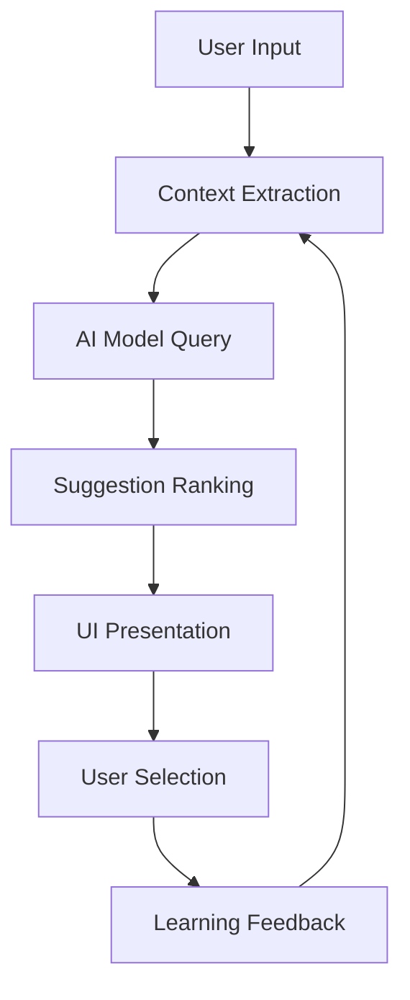

# AI Integration Architecture Analysis

## 🤖 Mission: Understand AI-Native IDE Design

**Goal**: Extract architectural patterns from AI-powered development tools to design seamless AI integration that enhances rather than interrupts developer flow.

## 🔍 Tools Under Analysis

### Primary AI-Powered IDEs
1. **Cursor** (VS Code fork with AI)
2. **Windsurf** (Codeium AI IDE)  
3. **Claude Code** (Terminal-based AI coding)
4. **SlateCLI** (RandomLabs AI CLI)
5. **Zed** (Rust editor with Claude integration)
6. **Warp** (AI-powered terminal)

## 📊 Analysis Framework

### 1. Context Awareness Architecture

#### Cursor Analysis
- **Codebase Understanding**: Full repository context for suggestions
- **Context Window Management**: Efficient handling of large codebases
- **File Relationship Mapping**: Understanding imports and dependencies
- **Project State Tracking**: Awareness of recent changes and patterns

#### Windsurf (Codeium) Analysis  
- **Multi-language Context**: Cross-language understanding
- **Repository-wide Intelligence**: Global codebase comprehension
- **Comment-to-Code Mapping**: Understanding developer intent
- **Workflow Pattern Recognition**: Learning from user behavior

### 2. AI Completion Architecture

#### Real-time Suggestion Systems

#### Performance Optimization Patterns
- **Prefetching**: Anticipating likely completions
- **Caching Strategies**: Storing frequent patterns
- **Incremental Updates**: Delta processing for efficiency
- **Background Processing**: Non-blocking AI computation

### 3. Natural Language Interface Design

#### Command Interpretation Architectures
1. **Intent Recognition**: Understanding developer goals
2. **Context Injection**: Adding relevant code context
3. **Action Planning**: Breaking complex requests into steps
4. **Execution Feedback**: Real-time progress indication

#### Examples from Analysis:
- **Claude Code**: Natural language commands for code modification
- **Cursor**: Chat-based code generation and refactoring
- **Warp**: Natural language terminal commands

### 4. Learning & Adaptation Systems

#### User Behavior Adaptation
- **Pattern Recognition**: Learning coding styles and preferences
- **Suggestion Ranking**: Personalizing completion priorities
- **Error Pattern Analysis**: Learning from rejected suggestions
- **Workflow Optimization**: Adapting to individual developer patterns

## 🏗️ Architectural Insights

### Best Practices Identified

#### 1. Non-Intrusive Integration
- **Opt-in Suggestions**: AI help when requested, not forced
- **Contextual Timing**: Suggestions at natural pause points
- **Dismissal Patterns**: Easy to ignore without interruption
- **Manual Override**: Always preserve developer control

#### 2. Performance-First Design
- **Lazy Loading**: AI features loaded on demand
- **Resource Management**: CPU/memory usage optimization
- **Network Efficiency**: Minimal API calls and smart caching
- **Offline Capabilities**: Core functionality without internet

#### 3. Privacy & Security Architecture
- **Local Processing**: On-device AI where possible  
- **Code Privacy**: Secure handling of proprietary code
- **Selective Sharing**: Fine-grained control over context sharing
- **Compliance Ready**: Enterprise security requirements

### Innovation Opportunities

#### 1. Multi-Modal AI Integration
- **Voice Commands**: Spoken code modification
- **Visual Recognition**: Screenshot-to-code conversion
- **Gesture Control**: Touch/trackpad code manipulation
- **Brain-Computer Interface**: Future neural control

#### 2. Collaborative AI Architecture  
- **Team Learning**: Shared knowledge across team members
- **Code Review AI**: Automated quality and style checking
- **Documentation Generation**: Auto-generated API docs
- **Testing Assistance**: Automated test case generation

## 🚀 Next-Generation AI IDE Concepts

### 1. Predictive Development Environment
- **Intent Prediction**: Understanding developer goals before expression
- **Proactive Suggestions**: Anticipating needed code changes
- **Workflow Acceleration**: Automating routine development tasks
- **Smart Project Setup**: Automated boilerplate and configuration

### 2. AI-Native Architecture
- **AI-First Design**: Built around AI capabilities from ground up
- **Seamless Integration**: AI as natural part of development flow
- **Intelligent Defaults**: AI-powered configuration and setup
- **Adaptive Interface**: UI that evolves with AI capabilities

### 3. Revolutionary Features

#### Code Understanding at Scale
- **Repository Intelligence**: Understanding entire codebase relationships
- **Cross-Project Learning**: Insights from open source patterns  
- **Historical Analysis**: Learning from code evolution over time
- **Impact Prediction**: Understanding consequences of changes

#### Natural Programming Interface
- **Conversation-Driven Development**: Code through dialogue
- **Specification to Implementation**: Direct requirement translation
- **Visual Programming**: Diagram-to-code generation
- **Example-Based Learning**: Learning from code examples

## 📈 Implementation Roadmap

### Phase 1: Foundation (Months 1-3)
- Core AI integration framework
- Context awareness system
- Basic completion engine
- Privacy-first architecture

### Phase 2: Intelligence (Months 4-6)  
- Advanced suggestion ranking
- Multi-language support
- Learning and adaptation
- Natural language interface

### Phase 3: Evolution (Months 7-12)
- Predictive capabilities
- Collaborative features
- Multi-modal integration
- Revolutionary UX concepts

---

*This analysis forms the foundation for designing AI-native development environments that truly enhance developer productivity while preserving the joy of coding.*