# HQ Understanding: Mermaid Diagrams for Parseltongue

## Overview

Mermaid is a powerful diagramming tool that can visualize the complex graphs and analytics produced by Parseltongue. This guide provides high-quality understanding of how to use Mermaid to represent:

- Multi-level Interface Signature Graphs (ISGL4 → ISGL0)
- Semantic clustering results (ISGL0.5 - natural code boundaries)
- Dependency graphs with flow-aware analytics (control, data, temporal)
- Complexity and analytics visualizations
- Architectural patterns and layer violations
- LLM context optimization and blast radius analysis

Based on the concepts from `parseltongue20251105.md`, `RAW20251105.md`, and `RAW20251105p2.md`, we'll show how to translate Parseltongue's graph projections into clear, interactive Mermaid diagrams that reveal the "physics" of code - how changes propagate, where complexity accumulates, and what patterns emerge.

## Revolutionary Multi-Level Graph Abstraction

### The Six Levels of Code Understanding

Code is a **fractal structure** - different zoom levels reveal completely different patterns. We create graph projections by mathematically collapsing nodes based on their properties.


### Cross-Level Data Flow Analysis


### Hierarchical Zoom View with Context


## Representing ISGL Levels in Mermaid

### ISGL4: Package/Folder Graph


### ISGL2: Function Call Graph


## Semantic Clustering (ISGL0.5) - Natural Code Boundaries

### The Goldilocks Level: Finding Natural Semantic Units

**Problem**: Files are arbitrary boundaries, functions are too granular.
**Solution**: ISGL0.5 automatically discovers semantic clusters of 3-20 functions that work together naturally.


### Four Affinity Signals for Clustering


### Clustering Algorithm Comparison

```mermaid
flowchart TD
    subgraph INPUT["Input: Function Graph"]
        GRAPH["Weighted Graph<br/>Nodes: Functions<br/>Edges: Affinity scores"]
    end
    
    subgraph ALGORITHMS["Clustering Algorithms"]
        subgraph SPECTRAL["Spectral Clustering"]
            S_DESC["Find natural modes<br/>Eigendecomposition<br/>O(n² log n)"]
        end
        
        subgraph LOUVAIN["Louvain Method"]
            L_DESC["Optimize modularity<br/>Hierarchical<br/>O(n log n)"]
        end
        
        subgraph INFOMAP["InfoMap"]
            I_DESC["Random walker<br/>Information theory<br/>O(n log n)"]
        end
        
        subgraph HIERARCHICAL["Agglomerative"]
            H_DESC["Bottom-up merge<br/>Dendrogram<br/>O(n² log n)"]
        end
    end
    
    subgraph OUTPUT["Output: ISGL0.5 Clusters"]
        CLUSTERS["Semantic Clusters<br/>3-20 functions each<br/>500-4000 tokens"]
    end
    
    INPUT --> ALGORITHMS
    ALGORITHMS --> OUTPUT
    
    style INPUT fill:#e1f5fe
    style OUTPUT fill:#e8f5e8
    style SPECTRAL fill:#f3e5f5
    style LOUVAIN fill:#fff3e0
    style INFOMAP fill:#fce4ec
    style HIERARCHICAL fill:#f1f8e9
```



### Cluster Quality Metrics


### Real-World Cluster Discovery Example


## Flow-Aware Analytics - Three Types of Code Connections

### Control Flow: Who Calls Whom


### Data Flow: Information Movement Through System

```mermaid
flowchart TD
    subgraph "Data Flow Analysis"
        SOURCE["user_input: String<br/>⚠️ TAINTED SOURCE"]
        SANITIZE["sanitize(input: String) -> String<br/>✅ SANITIZER"]
        VALIDATE["validate(clean: String) -> Result<br/>✅ VALIDATOR"]
        TRANSFORM["transform(valid: Data) -> Query<br/>✅ TRANSFORMER"]
        SINK["db.execute(query: Query) -> Result<br/>✅ SAFE SINK"]
        
        SOURCE -->|"data flows"| SANITIZE
        SANITIZE -->|"data flows"| VALIDATE
        VALIDATE -->|"data flows"| TRANSFORM
        TRANSFORM -->|"data flows"| SINK
        
        subgraph SECURITY["Security Analysis"]
            PATH_SAFE["✅ Path is safe<br/>taint removed before sink"]
        end
        
        SINK -.->|"security check"| PATH_SAFE
    end
    
    classDef tainted fill:#ffcdd2,stroke:#d32f2f,color:#d32f2f
    classDef safe fill:#c8e6c9,stroke:#388e3c,color:#388e3c
    classDef process fill:#e3f2fd,stroke:#1976d2
    
    class SOURCE tainted
    class SANITIZE,VALIDATE,TRANSFORM process
    class SINK,PATH_SAFE safe
    
    linkStyle 0,1,2,3 stroke:#1976d2,stroke-width:2px
    linkStyle 4 stroke:#4caf50,stroke-width:3px,stroke-dasharray:5 5
```



### Temporal Flow: Hidden Dependencies via Change Patterns


### Cross-Level Flow Tracking


### Flow-Aware Security Analysis

```mermaid
flowchart TD
    subgraph SECURITY_ANALYSIS["Security: Taint Analysis"]
        subgraph SOURCES["Taint Sources"]
            HTTP["http_request.body()"]
            USER_INPUT["user_input field"]
            FILE_READ["file.read()"]
        end
        
        subgraph SANITIZERS["Sanitizers"]
            VALIDATE["validate_input()"]
            SANITIZE["sanitize_string()"]
            ESCAPE["escape_html()"]
        end
        
        subgraph SINKS["Sensitive Sinks"]
            DB_QUERY["db.execute()"]
            EVAL["eval()"]
            REDIRECT["redirect()"]
        end
        
        HTTP -->|"tainted data"| VALIDATE
        VALIDATE -->|"potentially safe"| SANITIZE
        SANITIZE -->|"clean data"| DB_QUERY
        
        HTTP -.->|"⚠️ DIRECT PATH"| EVAL
        USER_INPUT -.->|"⚠️ MISSING SANITIZER"| REDIRECT
    end
    
    classDef source fill:#ffcdd2,stroke:#d32f2f
    classDef sanitizer fill:#fff3e0,stroke:#f57c00
    classDef sink fill:#ffebee,stroke:#c62828
    classDef safe fill:#c8e6c9,stroke:#388e3c
    classDef danger fill:#ffcdd2,stroke:#d32f2f,stroke-width:3px
    
    class HTTP,USER_INPUT,FILE_READ source
    class VALIDATE,SANITIZE,ESCAPE sanitizer
    class DB_QUERY,EVAL,REDIRECT sink
    
    linkStyle 0,1,2 stroke:#4caf50,stroke-width:2px
    linkStyle 3,4 stroke:#d32f2f,stroke-width:3px,stroke-dasharray:3 3
```



## LLM Context Optimization - Surgical Context Selection

### The Context Window Problem

**Problem**: LLMs have fixed context windows. What code do you include?

```mermaid
flowchart TD
    subgraph INEFFICIENT["Current Approach (Inefficient)"]
        AUTH_WHOLE["auth.rs: 2,400 tokens"]
        USER_WHOLE["user.rs: 3,100 tokens"]
        SESSION_WHOLE["session.rs: 1,800 tokens"]
        
        TOTAL_WASTE["Total: 7,300 tokens<br/>Waste: ~60% irrelevant code ❌"]
        
        AUTH_WHOLE --> TOTAL_WASTE
        USER_WHOLE --> TOTAL_WASTE
        SESSION_WHOLE --> TOTAL_WASTE
    end
    
    subgraph OPTIMAL["ISGL0.5 Approach (Optimal)"]
        TASK["Task: Fix email validation bug"]
        
        PRIMARY["Primary cluster:<br/>input_validation_cluster<br/>820 tokens ✅"]
        DEPENDENCIES["Dependencies:<br/>error_handling_cluster<br/>340 tokens ✅"]
        RELATED["Related:<br/>logging_cluster<br/>220 tokens ✅"]
        TEMPORAL["Temporal coupling:<br/>user_model_cluster<br/>560 tokens ✅"]
        
        TOTAL_OPTIMAL["Total: 1,940 tokens<br/>Efficiency: 4× better<br/>Relevance: 95% ✅"]
        
        TASK --> PRIMARY
        PRIMARY --> DEPENDENCIES
        DEPENDENCIES --> RELATED
        RELATED --> TEMPORAL
        TEMPORAL --> TOTAL_OPTIMAL
    end
    
    INEFFICIENT -.->|"vs"| OPTIMAL
    
    style INEFFICIENT fill:#ffcdd2
    style OPTIMAL fill:#c8e6c9
    style TOTAL_WASTE fill:#f44336,color:#fff
    style TOTAL_OPTIMAL fill:#4caf50,color:#fff
    
    linkStyle 4 stroke:#2196f3,stroke-width:3px
```



### Blast Radius Context Selection


### Context Pack for Different Tasks


### Semantic vs Syntactic Context

```mermaid
flowchart TD
    subgraph SYNTACTIC["Syntactic Context (Traditional)"]
        FILE_BASED["File-based inclusion"]
        LINE_RANGE["Line ranges: ±50 lines"]
        IMPORTS["Include all imports"]
        
        WASTE["❌ 60% irrelevant code<br/>❌ Missing semantic relationships<br/>❌ No temporal awareness"]
        
        FILE_BASED --> WASTE
        LINE_RANGE --> WASTE
        IMPORTS --> WASTE
    end
    
    subgraph SEMANTIC["Semantic Context (ISGL0.5)"]
        CLUSTER_BASED["Cluster-based inclusion"]
        FLOW_AWARE["Flow-aware relationships"]
        TEMPORAL_AWARE["Temporal coupling awareness"]
        
        BENEFITS["✅ 95% relevant code<br/>✅ Natural semantic boundaries<br/>✅ Hidden dependency detection"]
        
        CLUSTER_BASED --> BENEFITS
        FLOW_AWARE --> BENEFITS
        TEMPORAL_AWARE --> BENEFITS
    end
    
    SYNTACTIC -.->|"evolves to"| SEMANTIC
    
    style SYNTACTIC fill:#ffcdd2
    style SEMANTIC fill:#c8e6c9
    style WASTE fill:#f44336,color:#fff
    style BENEFITS fill:#4caf50,color:#fff
    
    linkStyle 3 stroke:#2196f3,stroke-width:3px
```



### Context Quality Metrics


## Architectural Violation Detection - X-Ray Vision for Code Structure

### Cross-Level Layer Violations

```mermaid
flowchart TD
    subgraph EXPECTED["Expected Architecture"]
        UI["UI Layer"]
        API["API Layer"]
        BUSINESS["Business Layer"]
        DATA["Data Layer"]
        
        UI -->|"calls"| API
        API -->|"calls"| BUSINESS
        BUSINESS -->|"calls"| DATA
    end
    
    subgraph VIOLATION["Detected Violation"]
        UI_VIOLATION["ui/button.rs::onClick()"]
        DB_VIOLATION["database/connection.rs::execute()"]
        
        UI_VIOLATION -.->|"⚠️ SKIPS 2 LAYERS"| DB_VIOLATION
    end
    
    subgraph ANALYSIS["Violation Analysis"]
        RULE["Rule Broken:<br/>Data layer should not know about UI"]
        SUGGESTION["Suggestion:<br/>Route through src/api/handler.rs"]
        IMPACT["Impact:<br/>Tight coupling, testing issues"]
    end
    
    VIOLATION -->|"analyzed by"| ANALYSIS
    
    classDef expected fill:#e8f5e8,stroke:#388e3c
    classDef violation fill:#ffcdd2,stroke:#d32f2f
    classDef analysis fill:#fff3e0,stroke:#f57c00
    
    class UI,API,BUSINESS,DATA expected
    class UI_VIOLATION,DB_VIOLATION violation
    class RULE,SUGGESTION,IMPACT analysis
    
    linkStyle 0,1,2 stroke:#4caf50,stroke-width:2px
    linkStyle 3 stroke:#d32f2f,stroke-width:3px,stroke-dasharray:5 5
```

### Package-Level Architecture Analysis

```mermaid
flowchart TD
    subgraph ARCHITECTURE["Package Architecture Map"]
        subgraph PRESENTATION["Presentation Layer"]
            UI_PKG["src/ui"]
            WEB_PKG["src/web"]
        end
        
        subgraph APPLICATION["Application Layer"]
            API_PKG["src/api"]
            HANDLER_PKG["src/handlers"]
        end
        
        subgraph DOMAIN["Domain Layer"]
            CORE_PKG["src/core"]
            BUSINESS_PKG["src/business"]
        end
        
        subgraph INFRASTRUCTURE["Infrastructure Layer"]
            DB_PKG["src/database"]
            CACHE_PKG["src/cache"]
        end
    end
    
    subgraph VIOLATIONS["Detected Violations"]
        V1["UI → Database (skips 3 layers)"]
        V2["Web → Cache (bypasses API)"]
        V3["Database → Core (upward dependency)"]
    end
    
    UI_PKG -.->|"❌ VIOLATION"| DB_PKG
    WEB_PKG -.->|"❌ VIOLATION"| CACHE_PKG
    DB_PKG -.->|"❌ VIOLATION"| CORE_PKG
    
    classDef layer fill:#e3f2fd,stroke:#1976d2
    classDef violation fill:#ffcdd2,stroke:#d32f2f
    
    class UI_PKG,WEB_PKG,API_PKG,HANDLER_PKG,CORE_PKG,BUSINESS_PKG,DB_PKG,CACHE_PKG layer
    class V1,V2,V3 violation
    
    linkStyle 0,1,2 stroke:#d32f2f,stroke-width:3px,stroke-dasharray:5 5
```

### Dependency Rule Violations

```mermaid
flowchart TD
    subgraph RULES["Architectural Rules"]
        RULE1["Rule 1: UI cannot import Database"]
        RULE2["Rule 2: Infrastructure cannot depend on Domain"]
        RULE3["Rule 3: No circular dependencies"]
        RULE4["Rule 4: Test code separate from production"]
    end
    
    subgraph VIOLATIONS_DETECTED["Violations Found"]
        V1["ui/button.rs imports database/connection"]
        V2["cache/redis.rs imports core/business"]
        V3["auth.rs ↔ session.rs (circular)"]
        V4["test_utils.rs imported by main.rs"]
    end
    
    subgraph REMEDIATION["Remediation Suggestions"]
        R1["Priority 1: Break circular deps"]
        R2["Priority 2: Extract God classes"]
        R3["Priority 3: Fix layer violations"]
        R4["Priority 4: Reduce complexity"]
    end
    
    RULES -->|"validate against"| VIOLATIONS_DETECTED
    VIOLATIONS_DETECTED -->|"suggest"| REMEDIATION
    
    classDef rules fill:#e3f2fd,stroke:#1976d2
    classDef violations fill:#ffcdd2,stroke:#d32f2f
    classDef remediation fill:#e8f5e8,stroke:#388e3c
    
    class RULE1,RULE2,RULE3,RULE4 rules
    class V1,V2,V3,V4 violations
    class R1,R2,R3,R4 remediation
```

### Architectural Smell Detection

```mermaid
flowchart TD
    subgraph SMELLS["Architectural Smells"]
        subgraph GOD_CLASS["God Class Detection"]
            GC["user_service.rs<br/>❌ 67 functions<br/>❌ 2,340 lines<br/>❌ Called by 45 modules"]
        end
        
        subgraph FEATURE_ENVY["Feature Envy Detection"]
            FE["auth_validator.rs<br/>❌ 80% calls to user_model.rs<br/>❌ Should be in User class"]
        end
        
        subgraph SHOTGUN_SURGERY["Shotgun Surgery Detection"]
            SS["Price change affects:<br/>❌ 12 files<br/>❌ 34 functions<br/>❌ 3 different layers"]
        end
    end
    
    subgraph METRICS["Supporting Metrics"]
        FAN_IN["High fan-in: 45 dependencies"]
        FAN_OUT["High fan-out: 23 outward calls"]
        COUPLING["Tight coupling: 0.87"]
        COHESION["Low cohesion: 0.23"]
    end
    
    SMELLS -->|"quantified by"| METRICS
    
    classDef smell fill:#ffcdd2,stroke:#d32f2f
    classDef metric fill:#fff3e0,stroke:#f57c00
    
    class GC,FE,SS smell
    class FAN_IN,FAN_OUT,COUPLING,COHESION metric
```

### Architectural Debt Visualization

```mermaid
flowchart TD
    subgraph DEBT_MAP["Architectural Debt Heatmap"]
        subgraph HIGH_DEBT["High Debt Areas 🔴"]
            HD1["user_service.rs<br/>God class: 67 functions"]
            HD2["auth.rs ↔ session.rs<br/>Circular dependency"]
            HD3["ui/ → database/<br/>Layer violations"]
        end
        
        subgraph MEDIUM_DEBT["Medium Debt Areas 🟡"]
            MD1["pricing.rs<br/>High complexity: 89"]
            MD2["cache/redis.rs<br/>Feature envy"]
        end
        
        subgraph LOW_DEBT["Low Debt Areas 🟢"]
            LD1["utils.rs<br/>Well structured"]
            LD2["config.rs<br/>Single responsibility"]
        end
    end
    
    subgraph PRIORITIZATION["Remediation Priority"]
        P1["Priority 1: Break circular deps"]
        P2["Priority 2: Extract God classes"]
        P3["Priority 3: Fix layer violations"]
        P4["Priority 4: Reduce complexity"]
    end
    
    DEBT_MAP -->|"informs"| PRIORITIZATION
    
    classDef high fill:#ffcdd2,stroke:#d32f2f
    classDef medium fill:#fff3e0,stroke:#f57c00
    classDef low fill:#c8e6c9,stroke:#388e3c
    classDef priority fill:#e3f2fd,stroke:#1976d2
    
    class HD1,HD2,HD3 high
    class MD1,MD2 medium
    class LD1,LD2 low
    class P1,P2,P3,P4 priority
```

## Layer Violation Detection
```mermaid
flowchart TD
    subgraph "UI Layer"
        UI["ui/button.rs"]
    end

    subgraph "Business Layer"
        BL["business/user_service.rs"]
    end

    subgraph "Data Layer"
        DL["data/connection.rs"]
    end

    UI -.->|VIOLATION: Skips business layer| DL
    UI --> BL
    BL --> DL

    linkStyle 0 stroke:#ff0000,stroke-width:3px,stroke-dasharray: 5 5
    linkStyle 1 stroke:#00ff00,stroke-width:2px
    linkStyle 2 stroke:#00ff00,stroke-width:2px
```

## Comprehensive Real-World Scenarios

### Scenario 1: Production Bug Investigation

**Problem**: NullPointer exception in `process_order()` function

```mermaid
flowchart TD
    subgraph FAILURE["Failure Analysis"]
        ERROR["NullPointer in process_order()"]
        
        subgraph ROOT_CAUSES["Root Cause Candidates"]
            RC1["validate_input() - 67% probability<br/>upstream data source"]
            RC2["fetch_user() - 23% probability<br/>data provider"]
            RC3["cache_miss() - 10% probability<br/>side effect"]
        end
        
        subgraph TEMPORAL["Temporal Correlation"]
            TIME1["fetch_user() modified 3 hours before failure"]
            TIME2["Commit a3f2b1 suspected"]
        end
        
        subgraph TEST_GAP["Test Gap Analysis"]
            GAP["No test covers:<br/>validate_input() → process_order() path"]
        end
    end
    
    ERROR -->|"analyzed by"| ROOT_CAUSES
    ROOT_CAUSES -->|"correlated with"| TEMPORAL
    ROOT_CAUSES -->|"reveals"| TEST_GAP
    
    classDef error fill:#ffcdd2,stroke:#d32f2f
    classDef cause fill:#fff3e0,stroke:#f57c00
    classDef temporal fill:#e3f2fd,stroke:#1976d2
    classDef gap fill:#f3e5f5,stroke:#7b1fa2
    
    class ERROR error
    class RC1,RC2,RC3 cause
    class TIME1,TIME2 temporal
    class GAP gap
```

### Scenario 2: LLM Feature Development

**Task**: Add bulk discount functionality to checkout system

```mermaid
flowchart TD
    subgraph LLM_CONTEXT["LLM Context Preparation"]
        TASK["Add bulk discount to checkout"]
        
        subgraph ENTITIES["Core Entities (PageRank centrality)"]
            E1["checkout.rs (0.89 importance)"]
            E2["pricing.rs (0.76 importance)"]
        end
        
        subgraph PATTERNS["Similar Patterns (embedding + graph)"]
            P1["coupon_discount() implementation"]
            P2["wholesale_pricing() logic"]
        end
        
        subgraph EXAMPLES["Test Examples"]
            T1["test_single_discount()"]
            T2["test_stacked_discounts()"]
        end
        
        subgraph CONSTRAINTS["Architectural Constraints"]
            C1["Discounts must be immutable"]
            C2["Price calculations must be deterministic"]
        end
    end
    
    TASK --> ENTITIES
    ENTITIES --> PATTERNS
    PATTERNS --> EXAMPLES
    EXAMPLES --> CONSTRAINTS
    
    classDef task fill:#e3f2fd,stroke:#1976d2
    classDef entities fill:#f3e5f5,stroke:#7b1fa2
    classDef patterns fill:#e8f5e8,stroke:#388e3c
    classDef examples fill:#fff3e0,stroke:#f57c00
    classDef constraints fill:#fce4ec,stroke:#c2185b
    
    class TASK task
    class E1,E2 entities
    class P1,P2 patterns
    class T1,T2 examples
    class C1,C2 constraints
```

### Scenario 3: Safe Refactoring Analysis

**Question**: Can I safely refactor `user_service.rs`?

```mermaid
flowchart TD
    subgraph REFACTOR_ANALYSIS["Refactoring Safety Analysis"]
        TARGET["user_service.rs"]
        
        subgraph SAFE["✅ SAFE Indicators"]
            S1["High test coverage (87%)"]
            S2["Low temporal coupling (changes alone)"]
            S3["Clear interface boundary"]
        end
        
        subgraph WARNINGS["⚠️ WARNINGS"]
            W1["3 functions have complexity > 50"]
            W2["Hidden dependency with session.rs<br/>(temporal coupling)"]
        end
        
        subgraph APPROACH["SUGGESTED APPROACH"]
            A1["1. Extract complex functions first"]
            A2["2. Add integration test for session interaction"]
            A3["3. Then proceed with main refactor"]
        end
        
        subgraph RISK["RISK ASSESSMENT"]
            RISK_SCORE["Estimated risk: LOW (2/10)"]
        end
    end
    
    TARGET --> SAFE
    TARGET --> WARNINGS
    SAFE --> APPROACH
    WARNINGS --> APPROACH
    APPROACH --> RISK
    
    classDef target fill:#e3f2fd,stroke:#1976d2
    classDef safe fill:#c8e6c9,stroke:#388e3c
    classDef warning fill:#fff3e0,stroke:#f57c00
    classDef approach fill:#f3e5f5,stroke:#7b1fa2
    classDef risk fill:#e8f5e8,stroke:#2e7d32
    
    class TARGET target
    class S1,S2,S3 safe
    class W1,W2 warning
    class A1,A2,A3 approach
    class RISK_SCORE risk
```

### Scenario 4: Performance Bottleneck Investigation

**Issue**: Slow response times in user authentication flow

```mermaid
flowchart TD
    subgraph PERFORMANCE["Performance Investigation"]
        subgraph HOT_PATHS["Hot Path Analysis"]
            HP1["authenticate() - 89% CPU time"]
            HP2["validate_token() - 67% CPU time"]
            HP3["fetch_user() - 45% CPU time"]
        end
        
        subgraph BOTTLENECKS["Bottleneck Detection"]
            B1["Database query in fetch_user()<br/>2.3s average"]
            B2["Synchronous token validation<br/>blocking I/O"]
            B3["No caching of user data<br/>repeated queries"]
        end
        
        subgraph OPTIMIZATIONS["Optimization Opportunities"]
            O1["Add Redis cache for user data"]
            O2["Async token validation"]
            O3["Database query optimization"]
            O4["Parallel validation steps"]
        end
        
        subgraph IMPACT["Expected Impact"]
            I1["70% reduction in response time"]
            I2["10× improvement in throughput"]
        end
    end
    
    HOT_PATHS --> BOTTLENECKS
    BOTTLENECKS --> OPTIMIZATIONS
    OPTIMIZATIONS --> IMPACT
    
    classDef hot fill:#ffcdd2,stroke:#d32f2f
    classDef bottleneck fill:#fff3e0,stroke:#f57c00
    classDef optimization fill:#e8f5e8,stroke:#388e3c
    classDef impact fill:#e3f2fd,stroke:#1976d2
    
    class HP1,HP2,HP3 hot
    class B1,B2,B3 bottleneck
    class O1,O2,O3,O4 optimization
    class I1,I2 impact
```

### Scenario 5: Security Vulnerability Assessment

**Concern**: Potential SQL injection in user input handling

```mermaid
flowchart TD
    subgraph SECURITY["Security Assessment"]
        subgraph ATTACK_VECTORS["Attack Vectors"]
            AV1["User input via HTTP form"]
            AV2["Direct string concatenation in query"]
            AV3["Missing input sanitization"]
        end
        
        subgraph VULNERABILITIES["Vulnerabilities Found"]
            V1["SQL injection in search_user()<br/>⚠️ CRITICAL"]
            V2["XSS in user profile display<br/>⚠️ HIGH"]
            V3["Path traversal in file upload<br/>⚠️ MEDIUM"]
        end
        
        subgraph REMEDIATION["Remediation Steps"]
            R1["Use parameterized queries"]
            R2["Implement input validation"]
            R3["Add output encoding"]
            R4["File upload restrictions"]
        end
        
        subgraph PREVENTION["Prevention Measures"]
            P1["Static analysis in CI/CD"]
            P2["Security testing automation"]
            P3["Developer security training"]
        end
    end
    
    ATTACK_VECTORS --> VULNERABILITIES
    VULNERABILITIES --> REMEDIATION
    REMEDIATION --> PREVENTION
    
    classDef attack fill:#ffcdd2,stroke:#d32f2f
    classDef vuln fill:#b71c1c,stroke:#b71c1c,color:#fff
    classDef remediation fill:#fff3e0,stroke:#f57c00
    classDef prevention fill:#e8f5e8,stroke:#388e3c
    
    class AV1,AV2,AV3 attack
    class V1,V2,V3 vuln
    class R1,R2,R3,R4 remediation
    class P1,P2,P3 prevention
```

### Hot Paths Analysis
```mermaid
flowchart LR
    Start([Request]) --> A["parse_input"]
    A --> B{is_valid?}
    B -->|Yes| C["process_data"]
    B -->|No| D["return_error"]
    C --> E["validate_output"]
    E --> F["save_to_db"]
    F --> G["return_success"]

    classDef hot fill:#ff6b6b,color:#fff
    classDef cold fill:#e0e0e0

    class A,C,F hot
    class B,D,E,G cold
```

## Best Practices

1. **Color Coding**: Use consistent colors for different entity types and risk levels
2. **Edge Styling**: Use stroke width and dash patterns to indicate relationship strength
3. **Subgraphs**: Group related entities to show natural boundaries
4. **Interactive Elements**: Use clickable nodes to drill down into details
5. **Scalability**: For large graphs, use pagination or collapsible sections
6. **Multi-Level Views**: Always show context at multiple zoom levels
7. **Flow Awareness**: Differentiate between control, data, and temporal flows
8. **Semantic Clustering**: Group functions by natural boundaries, not file structure

## Integration with Parseltongue CLI

```bash
# Export cluster data as Mermaid
parseltongue pt02-cluster-edges --output cluster_flow.mmd --format mermaid

# Generate complexity heatmap
parseltongue pt07-analytics complexity --format mermaid > complexity_diagram.mmd

# Multi-level graph projection
parseltongue pt02-multilevel --levels ISGL4,ISGL3,ISGL2,ISGL0.5 --output multilevel.mmd

# ISGL0.5 semantic clusters
parseltongue pt02-level05 --output semantic_clusters.mmd --format mermaid

# Flow-aware analytics
parseltongue pt07-analytics flow --type control,data,temporal --format mermaid
```

### CLI Output Examples

```mermaid
flowchart TB
    subgraph L4["ISGL4 · Packages"]
        API["api/"] --> CORE["core/"]
    end
    subgraph L3["ISGL3 · Files"]
        ROUTES["api/routes.rs"] --> HANDLERS["api/handlers.rs"]
    end
    subgraph L2["ISGL2 · Functions"]
        CREATE_USER["create_user()"] --> VALIDATE_INPUT["validate_input()"]
        VALIDATE_INPUT --> SAVE_TO_DB["save_to_db()"]
    end
    subgraph L05["ISGL0.5 · Semantic Clusters"]
        AUTH_CLUSTER["auth_flow_cluster"]
        VALIDATION_CLUSTER["validation_cluster"]
    end

    API -.->|"projects to"| ROUTES
    HANDLERS -.->|"projects to"| CREATE_USER
    VALIDATE_INPUT -.->|"clusters into"| VALIDATION_CLUSTER
    CREATE_USER -.->|"clusters into"| AUTH_CLUSTER
    
    style L4 fill:#e1f5fe
    style L3 fill:#f3e5f5
    style L2 fill:#e8f5e8
    style L05 fill:#fff3e0
    
    linkStyle 3,4,5,6 stroke:#666,stroke-dasharray:3 3
```

### Risk and Coverage Visualization

```mermaid
flowchart TD
    classDef highRisk fill:#ffccbc,stroke:#d84315
    classDef mediumRisk fill:#fff3e0,stroke:#f57c00
    classDef lowRisk fill:#e8f5e8,stroke:#388e3c
    classDef covered stroke-dasharray:3 2
    classDef critical stroke:#ff5252,stroke-width:3px

    delete_user:::highRisk --> manage_sessions:::highRisk
    manage_sessions --> invalidate_tokens
    manage_sessions -.-> audit_log:::covered
    
    validate_input:::mediumRisk --> process_data:::lowRisk
    process_data --> save_result:::lowRisk
    
    critical_function:::critical --> backup_system
    
    click delete_user "pt url:entity/delete_user" "Open entity"
    click audit_log "pt url:test/test_audit" "Open test"
    click critical_function "pt url:entity/critical_function" "Critical component"
```

## Advanced Configuration

### Custom Styling Themes

```mermaid
%%{init: {'theme': 'base', 'themeVariables': { 'primaryColor': '#e3f2fd', 'primaryTextColor': '#0d47a1', 'primaryBorderColor': '#1976d2', 'lineColor': '#42a5f5', 'sectionBkgColor': '#f3e5f5', 'altSectionBkgColor': '#e8f5e8' }}}%%
flowchart TD
    A["Custom Theme"] --> B[Enhanced Visualization]
    B --> C[Better Readability]
```

### Interactive Features

```mermaid
flowchart TD
    A["Click to expand"] --> B{"Interactive Node"}
    B -->|"Click me"| C["Detailed View"]
    B -->|"Or click me"| D["Alternative View"]
    
    click A "callback('Expand details for node A')" "Expand A"
    click C "callback('Show implementation')" "View code"
    click D "callback('Show tests')" "View tests"
```

---

## Summary

This comprehensive guide demonstrates how Mermaid diagrams can visualize the revolutionary concepts from Parseltongue's multi-level graph analysis:

- **Multi-Level Abstraction**: View code at 6 different zoom levels from system to line
- **Semantic Clustering (ISGL0.5)**: Discover natural code boundaries that optimize LLM context
- **Flow-Aware Analytics**: Separate analysis of control, data, and temporal flows
- **Context Optimization**: Surgical context selection for LLMs with 4× efficiency improvement
- **Architectural Intelligence**: X-ray vision for detecting violations and technical debt
- **Real-World Scenarios**: Practical applications for debugging, feature development, and refactoring

The combination of Parseltongue's graph analytics and Mermaid's visualization capabilities provides developers and LLMs with unprecedented insight into codebase structure, dependencies, and evolution patterns.