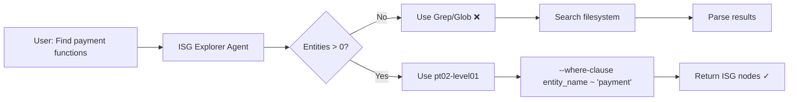
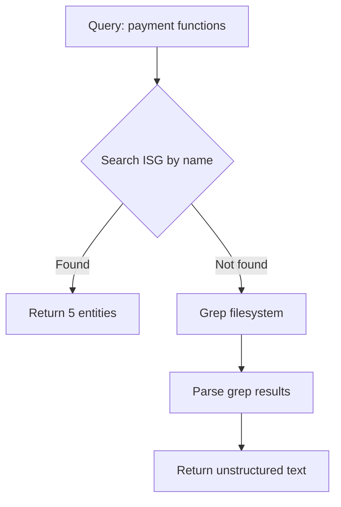
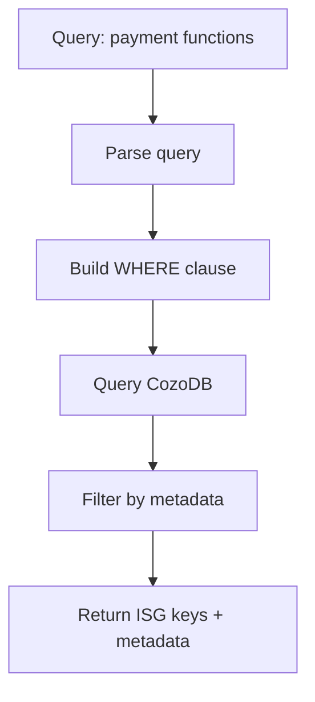
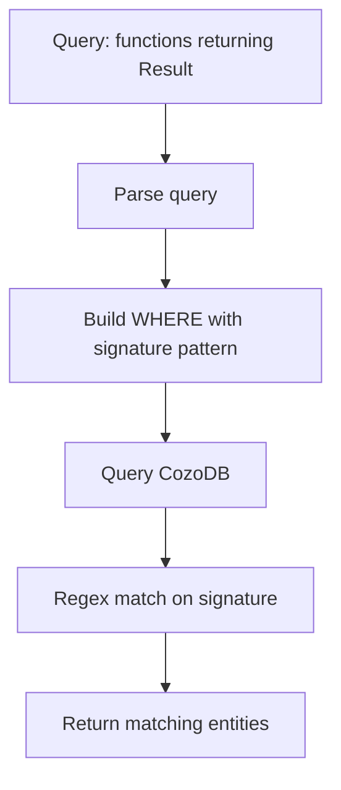
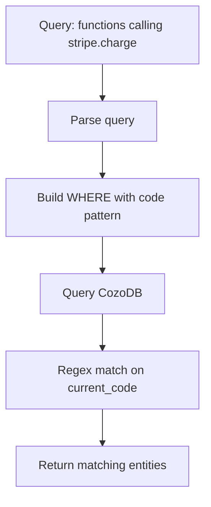
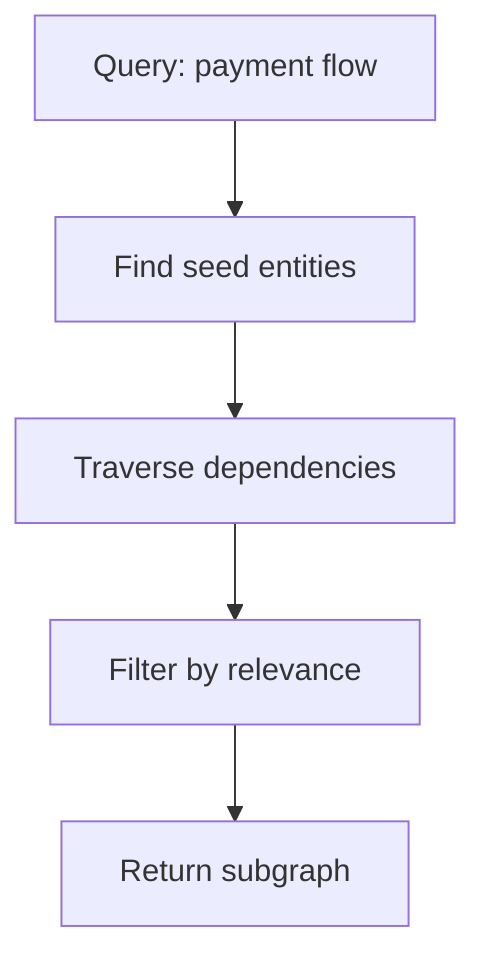
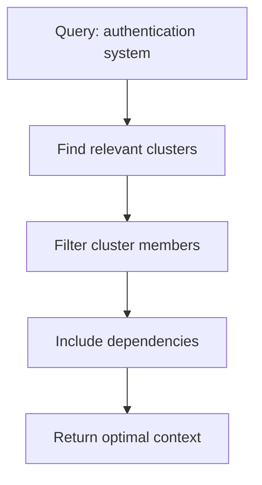
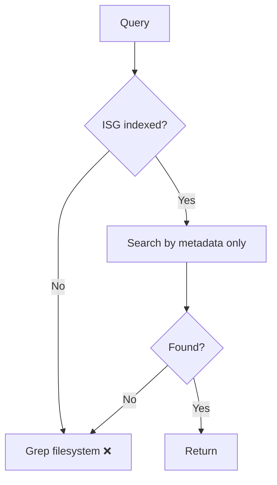
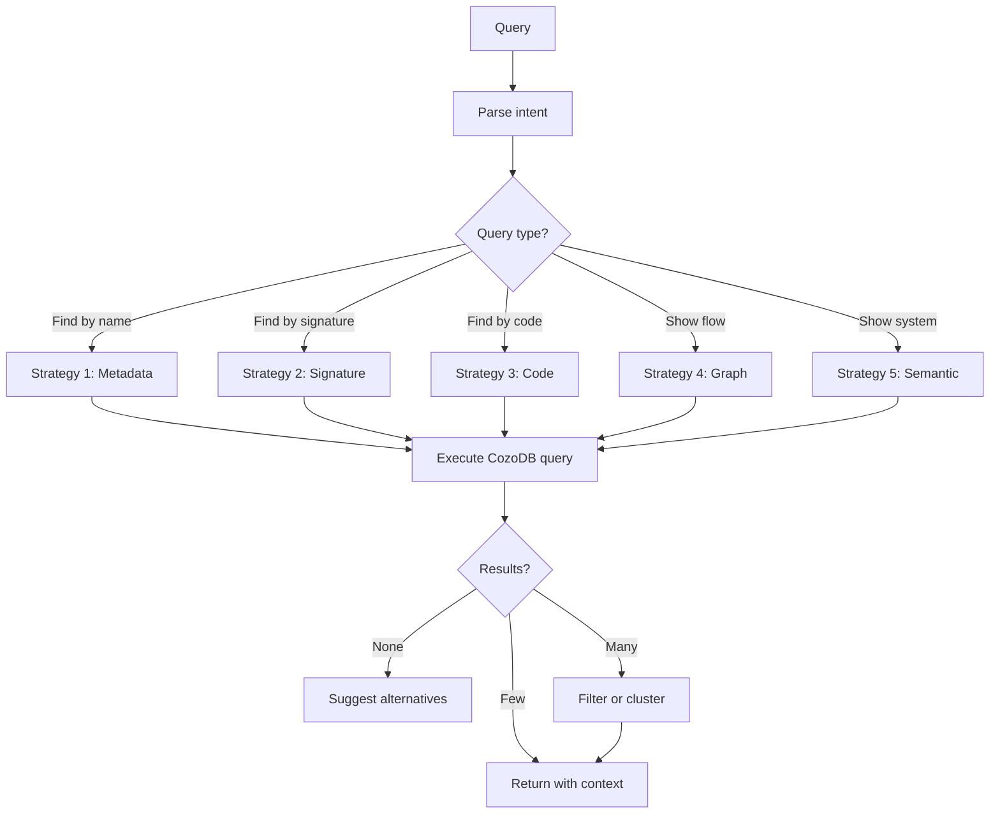

# ISG-Native Search Strategies: From Naive to Optimal

**Document Version:** 1.0
**Date:** 2025-11-05
**Purpose:** Compare search strategies for Parseltongue, from filesystem-based (wrong) to pure CozoDB ISG queries (optimal)

---

## Executive Summary

**The Fundamental Problem:** We spent enormous effort ingesting code into a graph database with rich metadata (ISG keys, signatures, dependencies, complexity, temporal data), but then our search agent **goes back to grep on the filesystem**. This is architecturally backwards!

**Core Thesis:** All search should happen **inside CozoDB** using WHERE clauses on the CodeGraph relation. The ISG already contains:
- Entity names
- Interface signatures
- Full code (current_code field)
- Dependencies (DependencyEdges)
- Metadata (complexity, classifications, temporal)

**The Right Way:** `User query → CozoDB WHERE clause → ISG nodes → Return structured results`

**The Wrong Way:** `User query → Grep filesystem → Parse files → Reconstruct structure we already have`

---

## Table of Contents

- [Part 1: The Problem Analysis](#part-1-the-problem-analysis)
- [Part 2: Five Search Strategies](#part-2-five-search-strategies)
  - [Strategy 0: Current (Broken)](#strategy-0-current-broken)
  - [Strategy 1: ISG Metadata Search](#strategy-1-isg-metadata-search-level-00)
  - [Strategy 2: ISG Signature Search](#strategy-2-isg-signature-search-level-01)
  - [Strategy 3: ISG Code Search](#strategy-3-isg-code-search-level-02)
  - [Strategy 4: Graph-Aware Search](#strategy-4-graph-aware-search-level-10)
  - [Strategy 5: Semantic Search](#strategy-5-semantic-search-level-20)
- [Part 3: Comparative Analysis](#part-3-comparative-analysis)
- [Part 4: Implementation Guide](#part-4-implementation-guide)
- [Part 5: Agent Redesign](#part-5-agent-redesign)

---

# Part 1: The Problem Analysis

## Current State (What's Wrong)

### The Agent Flow Today



**Problems:**

1. **Fallback to grep when DB empty** - defeats the whole purpose
2. **Only searches entity_name and file_path** - misses code content
3. **Never searches interface_signature** - signatures are gold!
4. **Never searches current_code field** - we have the code in DB!
5. **Grep duplicates work already done** - we already parsed and indexed!

### Why This is Fundamentally Broken

**We Already Have the Data:**
```datalog
CodeGraph {
    ISGL1_key: String,              // Unique ID
    entity_name: String,            // ✓ We search this
    interface_signature: String,    // ✗ We DON'T search this
    current_code: String,           // ✗ We DON'T search this
    entity_class: String,           // ✓ We filter by this
    file_path: String,              // ✓ We filter by this
    line_start: Int,
    line_end: Int,
    cyclomatic_complexity: Int,
    // ... more fields
}
```

**Current WHERE clauses:**
```bash
# What we do now ✓
--where-clause "entity_name ~ 'payment'"
--where-clause "file_path ~ 'auth'"
--where-clause "is_public = true"

# What we DON'T do ✗
--where-clause "interface_signature ~ 'Result<Payment>'"
--where-clause "current_code ~ 'stripe.charge'"
--where-clause "interface_signature ~ 'async fn.*Payment'"
```

**The Insanity:**
```
User: "Find functions that return Result<Payment>"

Current Agent:
  1. Search ISG by entity_name ~ "payment" ❌ (won't find "create_transaction")
  2. If nothing found, fallback to grep ❌ (filesystem search)
  3. Parse grep results ❌ (redo parsing work)

Optimal Agent:
  1. Query: interface_signature ~ "Result<Payment>" ✓
  2. Done! Get all entities with that return type ✓
```

---

## Token & Performance Impact

### Current Approach (Mixed ISG + Grep)

**Scenario:** Find all functions handling authentication

```bash
# Step 1: Search ISG by name
parseltongue pt02-level01 --where-clause "entity_name ~ 'auth'"
# Returns: 5 entities (500 tokens)

# Step 2: User not satisfied, agent falls back to grep
grep -r "authentication" src/
# Returns: 50 file matches (need to parse)

# Step 3: Agent reads files to understand
for file in matches:
    Read file (5000 tokens × 50 files = 250,000 tokens!)
```

**Total:** ~250,500 tokens, slow, unstructured

### Optimal Approach (Pure ISG)

```bash
# Single query searching signature, code, name
parseltongue pt02-level01 --where-clause "
    entity_name ~ 'auth' ;
    interface_signature ~ 'auth' ;
    current_code ~ 'authenticate'
"
# Returns: 23 entities (2,300 tokens), structured, fast
```

**Total:** ~2,300 tokens (99% reduction!), instant, structured

---

## Why Grep is Wrong

### 1. **We Already Parsed**
Ingestion already:
- Parsed AST
- Extracted signatures
- Found dependencies
- Classified entities
- Stored in CozoDB

Grep → parse again → **duplicates work!**

### 2. **Loss of Structure**
Grep returns:
```
src/payment.rs:145: fn process_payment(amount: u64) -> Result<Payment> {
```

ISG returns:
```json
{
  "ISGL1_key": "rust:fn:process_payment:src_payment_rs:145-167",
  "entity_name": "process_payment",
  "interface_signature": "fn process_payment(amount: u64) -> Result<Payment>",
  "entity_class": "Implementation",
  "is_public": true,
  "forward_deps": ["rust:fn:validate_payment:...", "rust:fn:charge_card:..."],
  "reverse_deps": ["rust:fn:handle_checkout:...", "rust:fn:process_order:..."],
  "cyclomatic_complexity": 12,
  "current_code": "fn process_payment(...) { ... }"
}
```

**ISG gives you:** Exact key, dependencies, metadata, full context
**Grep gives you:** A line of text

### 3. **No Dependencies**
Grep can't tell you:
- Who calls this function
- What this function calls
- Is this in a cycle
- What's the blast radius

ISG has all of this!

### 4. **No Filtering**
Grep can't filter by:
- Public vs private
- Complexity >20
- Test vs implementation
- Changed in PR (future_action)

ISG has all these filters!

### 5. **Token Waste**
Grep forces you to read entire files into LLM context.
ISG returns only matching entities with precise metadata.

---

# Part 2: Five Search Strategies

## Strategy 0: Current (Broken)

**Description:** Mixed approach with ISG + grep fallback.

**How It Works:**


**Example:**
```bash
# User asks: "Find payment processing code"

# Agent does:
parseltongue pt02-level01 --where-clause "entity_name ~ 'payment'"
# Returns: 5 entities named "payment*"

# User clarifies: "No, the ones that handle credit cards"

# Agent falls back to:
grep -r "credit card\|stripe\|charge" src/
# Returns: 50 matches across 20 files
# Reads 20 files into context (100K tokens)
```

**Problems:**
- ✗ Misses entities not named "payment" but handling payments
- ✗ Falls back to grep (defeats ISG purpose)
- ✗ Token waste (reads full files)
- ✗ No structure (grep returns text, not entities)
- ✗ No dependencies

**When This Fails:**
- Entity named "create_transaction" but does payment processing
- Code contains "stripe.charge()" but entity_name is generic
- User wants "all async functions returning Result<Payment>"

**Verdict:** ❌ **Fundamentally flawed. Don't use.**

---

## Strategy 1: ISG Metadata Search (Level 0.0)

**Description:** Search ISG by entity metadata only (no code content).

**Level:** 0.0 - Metadata only
**Fields Searched:** entity_name, entity_class, file_path, is_public
**Code Included:** No
**Token Cost:** 500-2000 tokens

**How It Works:**


**CozoDB Query:**
```datalog
?[key, name, class, file, is_public] :=
    *CodeGraph{
        ISGL1_key: key,
        entity_name: name,
        entity_class: class,
        file_path: file,
        is_public: pub
    },
    // Keyword search on name
    name ~ "payment",
    // Filter by type
    class == "Implementation"
```

**Example:**
```bash
# User: "Find payment functions"

# Query:
parseltongue pt02-level01 --include-code 0 --where-clause "
    entity_name ~ 'payment' ;
    entity_class = 'Implementation'
"

# Returns:
{
  "entities": [
    {
      "ISGL1_key": "rust:fn:process_payment:src_payment_rs:145-167",
      "entity_name": "process_payment",
      "entity_class": "Implementation",
      "file_path": "src/payment.rs",
      "is_public": true,
      "forward_deps": ["rust:fn:charge_card:...", ...],
      "reverse_deps": ["rust:fn:handle_checkout:...", ...],
      "cyclomatic_complexity": 12
    },
    {
      "ISGL1_key": "rust:fn:validate_payment:src_payment_rs:89-112",
      "entity_name": "validate_payment",
      ...
    }
  ]
}
```

**Strengths:**
- ✓ Fast (no code content)
- ✓ Structured results
- ✓ Includes dependencies
- ✓ Includes metadata (complexity, public/private)
- ✓ No filesystem access

**Weaknesses:**
- ✗ Only finds entities with matching names
- ✗ Misses functions like "create_transaction" that do payments
- ✗ Can't search by signature (return types, parameters)
- ✗ Can't search by implementation details

**When to Use:**
- Quick exploration ("what's in this module?")
- Name-based search ("find validate_*")
- Architecture overview (combine with Level 0 dependencies)

**Example Queries:**
```bash
# All public functions
--where-clause "is_public = true ; entity_class = 'Implementation'"

# Functions in auth module
--where-clause "file_path ~ 'auth' ; entity_class = 'Implementation'"

# High complexity functions
--where-clause "cyclomatic_complexity > 20"

# Changed in PR
--where-clause "future_action != null"
```

**Token Cost:**
- 5 entities: ~500 tokens
- 50 entities: ~5,000 tokens
- 200 entities: ~20,000 tokens

**Verdict:** ✓ **Good for metadata-based search. Fast and efficient.**

---

## Strategy 2: ISG Signature Search (Level 0.1)

**Description:** Search ISG by interface signatures.

**Level:** 0.1 - Metadata + Signatures
**Fields Searched:** entity_name, interface_signature, entity_class
**Code Included:** No
**Token Cost:** 1000-5000 tokens

**How It Works:**


**CozoDB Query:**
```datalog
?[key, name, signature, deps] :=
    *CodeGraph{
        ISGL1_key: key,
        entity_name: name,
        interface_signature: sig,
        forward_deps: deps
    },
    // Search by signature content
    sig ~ "Result<Payment>",
    // Or by pattern (async functions)
    sig ~ "async fn"
```

**Example 1: Return Type Search**
```bash
# User: "Find all functions returning Result<Payment>"

# Query:
parseltongue pt02-level01 --include-code 0 --where-clause "
    interface_signature ~ 'Result<Payment>'
"

# Returns:
{
  "entities": [
    {
      "ISGL1_key": "rust:fn:process_payment:src_payment_rs:145-167",
      "entity_name": "process_payment",
      "interface_signature": "pub fn process_payment(amount: u64) -> Result<Payment>",
      ...
    },
    {
      "ISGL1_key": "rust:fn:create_transaction:src_transaction_rs:45-89",
      "entity_name": "create_transaction",
      "interface_signature": "pub async fn create_transaction(data: PaymentData) -> Result<Payment>",
      ...
    },
    {
      "ISGL1_key": "rust:fn:refund_payment:src_refund_rs:120-156",
      "entity_name": "refund_payment",
      "interface_signature": "pub fn refund_payment(id: PaymentId) -> Result<Payment>",
      ...
    }
  ]
}
```

**Example 2: Parameter Search**
```bash
# User: "Find functions accepting PaymentData"

# Query:
parseltongue pt02-level01 --include-code 0 --where-clause "
    interface_signature ~ 'PaymentData'
"

# Returns functions with PaymentData in signature (params or return)
```

**Example 3: Async Functions**
```bash
# User: "Find all async functions"

# Query:
parseltongue pt02-level01 --include-code 0 --where-clause "
    interface_signature ~ 'async fn'
"
```

**Example 4: Complex Signature Patterns**
```bash
# User: "Find async functions returning Result<T> where T is not ()"

# Query:
parseltongue pt02-level01 --include-code 0 --where-clause "
    interface_signature ~ 'async fn' ;
    interface_signature ~ 'Result<(?!\\(\\))' ;
    interface_signature !~ 'Result<()>'
"
```

**Strengths:**
- ✓ Finds entities by what they return/accept
- ✓ Discovers "create_transaction" when searching for payment handlers
- ✓ Type-based search ("all functions accepting User")
- ✓ Pattern-based ("all async functions")
- ✓ Still fast (no code content)

**Weaknesses:**
- ✗ Can't search implementation details
- ✗ Misses functions that call Stripe API but don't mention it in signature
- ✗ Regex complexity (need careful patterns)

**When to Use:**
- Type-based search ("functions returning Result<Payment>")
- Pattern search ("async functions", "methods on struct User")
- Interface discovery ("what accepts PaymentData?")
- API surface exploration

**Example Queries:**
```bash
# Trait methods
--where-clause "interface_signature ~ 'fn.*&self'"

# Public async functions
--where-clause "
    interface_signature ~ 'pub async fn' ;
    is_public = true
"

# Functions with lifetimes
--where-clause "interface_signature ~ \"'[a-z]+\""

# Generic functions
--where-clause "interface_signature ~ '<T'"
```

**Token Cost:**
- 5 entities with signatures: ~800 tokens
- 50 entities: ~8,000 tokens

**Verdict:** ✓✓ **Excellent for API discovery and type-based search.**

---

## Strategy 3: ISG Code Search (Level 0.2)

**Description:** Search ISG by code content (current_code field).

**Level:** 0.2 - Metadata + Signatures + Code patterns
**Fields Searched:** entity_name, interface_signature, current_code
**Code Included:** Yes (for matching, optionally returned)
**Token Cost:** 2000-20000 tokens (depending on code inclusion)

**How It Works:**


**CozoDB Query:**
```datalog
?[key, name, signature, code_snippet] :=
    *CodeGraph{
        ISGL1_key: key,
        entity_name: name,
        interface_signature: sig,
        current_code: code
    },
    // Search within code content
    code ~ "stripe\\.charge",
    // Optional: extract snippet
    code_snippet = substr(code, 0, 200)
```

**Example 1: API Call Search**
```bash
# User: "Find all functions calling Stripe API"

# Query:
parseltongue pt02-level01 --include-code 0 --where-clause "
    current_code ~ 'stripe\\.' ;
    entity_class = 'Implementation'
"

# Returns:
{
  "entities": [
    {
      "ISGL1_key": "rust:fn:charge_card:src_payment_rs:200-245",
      "entity_name": "charge_card",
      "interface_signature": "async fn charge_card(token: &str, amount: u64) -> Result<ChargeId>",
      "current_code": "async fn charge_card(...) {\n  let client = stripe::Client::new(api_key);\n  client.charge(...)\n}",
      ...
    },
    {
      "ISGL1_key": "rust:fn:refund_charge:src_refund_rs:89-123",
      "entity_name": "refund_charge",
      "interface_signature": "async fn refund_charge(id: ChargeId) -> Result<()>",
      "current_code": "async fn refund_charge(...) {\n  stripe::refund(...)\n}",
      ...
    }
  ]
}
```

**Example 2: Pattern Search**
```bash
# User: "Find functions with panic! or unwrap()"

# Query:
parseltongue pt02-level01 --include-code 0 --where-clause "
    current_code ~ 'panic!' ;
    current_code ~ '\\.unwrap\\(\\)'
"
```

**Example 3: Database Queries**
```bash
# User: "Find all functions querying users table"

# Query:
parseltongue pt02-level01 --include-code 0 --where-clause "
    current_code ~ 'SELECT.*FROM users' ;
    current_code ~ 'users\\.' ;
    current_code ~ 'db\\.query.*users'
"
```

**Example 4: Error Handling**
```bash
# User: "Find functions with TODO or FIXME comments"

# Query:
parseltongue pt02-level01 --include-code 0 --where-clause "
    current_code ~ 'TODO|FIXME'
"
```

**Strengths:**
- ✓ Finds entities by implementation details
- ✓ Discovers hidden dependencies (e.g., "calls Stripe" even if not in signature)
- ✓ Code quality search (panics, unwraps, TODOs)
- ✓ Pattern matching (SQL queries, API calls, etc.)
- ✓ No filesystem access (code already in DB)

**Weaknesses:**
- ✗ Higher token cost if returning code
- ✗ Regex patterns can be complex
- ✗ May match comments/strings (need careful patterns)
- ✗ Slower than metadata-only queries

**When to Use:**
- Implementation detail search ("calls stripe.charge")
- Code quality audits ("find panics")
- Security analysis ("find SQL string concatenation")
- Dependency discovery ("what uses this API?")

**Example Queries:**
```bash
# Unsafe code
--where-clause "current_code ~ 'unsafe'"

# SQL injection risk
--where-clause "
    current_code ~ 'execute.*format!' ;
    current_code ~ 'query.*\\+' ;
    current_code ~ 'SELECT.*\\{.*\\}'
"

# Logging
--where-clause "current_code ~ 'log::|println!'"

# Network calls
--where-clause "current_code ~ 'reqwest|http|tcp'"

# File I/O
--where-clause "current_code ~ 'File::|fs::|read|write'"
```

**Token Cost (with --include-code 0):**
- 5 entities: ~1,000 tokens (just metadata)
- 50 entities: ~10,000 tokens

**Token Cost (with --include-code 1):**
- 5 entities: ~3,500 tokens (with code)
- 50 entities: ~35,000 tokens

**Optimization:**
```bash
# Don't include code if you just need the list
--include-code 0

# Then get code for specific entities
--where-clause "isgl1_key = 'rust:fn:charge_card:...'" --include-code 1
```

**Verdict:** ✓✓✓ **Powerful for deep code search. Use metadata-only first, then include code for specific matches.**

---

## Strategy 4: Graph-Aware Search (Level 1.0)

**Description:** Search with dependency graph awareness.

**Level:** 1.0 - Code search + dependency traversal
**Fields Searched:** All previous + forward_deps + reverse_deps
**Code Included:** Configurable
**Token Cost:** 5000-50000 tokens

**How It Works:**


**The Key Insight:**
Don't just find entities - find **connected entities** that form a logical unit.

**CozoDB Query Pattern:**
```datalog
# Step 1: Find seed entities
seed[key] :=
    *CodeGraph{ISGL1_key: key, entity_name: name},
    name ~ "payment"

# Step 2: Expand to dependencies (1-hop)
expanded[key] :=
    seed[seed_key],
    *DependencyEdges{from_key: seed_key, to_key: key}

expanded[key] :=
    seed[seed_key],
    *DependencyEdges{from_key: key, to_key: seed_key}

# Step 3: Get entity details for expanded set
?[key, name, signature, deps] :=
    (seed[key] | expanded[key]),
    *CodeGraph{
        ISGL1_key: key,
        entity_name: name,
        interface_signature: signature,
        forward_deps: deps
    }
```

**Example 1: Payment Flow**
```bash
# User: "Show me the complete payment processing flow"

# Query:
# 1. Find payment entry points
parseltongue pt02-level01 --include-code 0 --where-clause "
    entity_name ~ 'process_payment' ;
    is_public = true
"
# Returns: rust:fn:process_payment:...

# 2. Get dependency subgraph
parseltongue pt02-level00 --where-clause "ALL"
# Parse to find:
#   process_payment → validate_payment → check_amount
#                  → charge_card → stripe_api_call
#                  → record_transaction → db_insert

# 3. Get details for entire flow
parseltongue pt02-level01 --include-code 0 --where-clause "
    isgl1_key = 'rust:fn:process_payment:...' ;
    isgl1_key = 'rust:fn:validate_payment:...' ;
    isgl1_key = 'rust:fn:charge_card:...' ;
    isgl1_key = 'rust:fn:record_transaction:...'
"
```

**Example 2: Blast Radius**
```bash
# User: "If I change validate_payment, what breaks?"

# Process:
# 1. Get entity
parseltongue pt02-level01 --include-code 0 --where-clause "
    isgl1_key = 'rust:fn:validate_payment:...'
"
# Returns: { reverse_deps: [process_payment, create_subscription, ...] }

# 2. Get all reverse dependencies (callers)
for dep in reverse_deps:
    parseltongue pt02-level01 --include-code 0 --where-clause "isgl1_key = '$dep'"

# 3. Get their reverse dependencies (2-hop)
# Continue for 3-hop if needed
```

**Example 3: Dead Code Detection**
```bash
# User: "Find unused functions"

# Query:
parseltongue pt02-level01 --include-code 0 --where-clause "
    reverse_deps = '[]' ;
    is_public = false
"
# Returns entities with zero callers (dead code candidates)
```

**Example 4: Critical Path**
```bash
# User: "Find functions with high fan-out (God functions)"

# Query:
parseltongue pt02-level01 --include-code 0 --where-clause "ALL"
# Parse forward_deps arrays, find entities with >20 dependencies
```

**Advanced: Multi-Hop Traversal**

**CozoDB Recursive Query:**
```datalog
# Find all entities reachable from entry point within 3 hops

reachable[from, to, depth] :=
    *DependencyEdges{from_key: from, to_key: to},
    from == "rust:fn:process_payment:src_payment_rs:145-167",
    depth = 1

reachable[from, to, depth] :=
    reachable[from, mid, d],
    *DependencyEdges{from_key: mid, to_key: to},
    depth = d + 1,
    depth <= 3

?[key, depth, name, signature] :=
    reachable[_, key, depth],
    *CodeGraph{
        ISGL1_key: key,
        entity_name: name,
        interface_signature: signature
    }

:order depth
```

**Strengths:**
- ✓ Context-aware (finds related code)
- ✓ Dependency traversal (follow calls)
- ✓ Blast radius analysis (who's affected)
- ✓ Dead code detection (zero reverse_deps)
- ✓ Critical path analysis (high fan-out)
- ✓ All in database (no filesystem)

**Weaknesses:**
- ✗ More complex queries
- ✗ Higher token cost (returns more entities)
- ✗ Requires understanding of graph structure

**When to Use:**
- Understanding execution flows
- Impact analysis ("what breaks if I change this?")
- Architecture exploration ("how does feature X work?")
- Refactoring (finding related code to extract)

**Example Queries:**
```bash
# All public entry points
--where-clause "is_public = true" --include-code 0
# Then trace forward_deps

# Functions in a cycle
# Use Level 0 to find cycles, then get details

# High complexity with many dependencies
--where-clause "
    cyclomatic_complexity > 20 ;
    forward_deps != '[]'
"
# Check if high complexity is justified by many calls

# Integration points
--where-clause "file_path ~ 'api' ; forward_deps ~ 'database'"
# Functions bridging API and database layers
```

**Token Cost:**
- Entry point + 1-hop: ~5,000 tokens
- Entry point + 2-hop: ~15,000 tokens
- Entry point + 3-hop: ~40,000 tokens
- Full subgraph (50 entities): ~50,000 tokens

**Optimization:**
```bash
# Start with Level 0 (edges only)
parseltongue pt02-level00 --where-clause "ALL"
# Tokens: 3,000

# Identify interesting subgraph
# Get only those entities at Level 1
parseltongue pt02-level01 --include-code 0 --where-clause "
    isgl1_key = '...' ;
    isgl1_key = '...' ;
    ...
"
# Tokens: Only what you need
```

**Verdict:** ✓✓✓✓ **Essential for understanding code relationships. Combines search with graph structure.**

---

## Strategy 5: Semantic Search (Level 2.0)

**Description:** Search using semantic clusters and ISG metadata combined.

**Level:** 2.0 - Semantic clusters + graph + metadata
**Fields Searched:** All previous + semantic_cluster membership
**Code Included:** Configurable
**Token Cost:** 2000-15000 tokens (optimized by clusters)

**How It Works:**


**The Key Insight:**
Use pre-computed semantic clusters (from ISGL0.5) to find **natural groupings** of related functions, then search within or across clusters.

**CozoDB Schema (with clusters):**
```datalog
SemanticCluster {
    cluster_id: String,
    cluster_name: String,
    functions: [String],  // ISGL1 keys
    cohesion: Float,
    coupling: Float,
    tokens: Int
}

ClusterMembership {
    function_key: String,
    cluster_id: String
}
```

**Query Pattern:**
```datalog
# Find clusters by name
relevant_clusters[cluster_id, name] :=
    *SemanticCluster{cluster_id, cluster_name: name},
    name ~ "auth"

# Get cluster members
cluster_members[function_key] :=
    relevant_clusters[cluster_id, _],
    *SemanticCluster{cluster_id, functions},
    function_key in functions

# Get entity details
?[key, name, signature, cluster] :=
    cluster_members[key],
    *CodeGraph{
        ISGL1_key: key,
        entity_name: name,
        interface_signature: signature
    },
    *ClusterMembership{function_key: key, cluster_id: cluster}
```

**Example 1: Cluster-Based Search**
```bash
# User: "Show me the authentication system"

# Query:
# 1. Find relevant clusters
SELECT cluster_id, cluster_name, functions
FROM SemanticCluster
WHERE cluster_name ~ 'auth'

# Returns:
# cluster_auth_operations: [login, logout, validate_token, refresh_token, revoke_token]
# cluster_auth_helpers: [hash_password, verify_password, generate_salt]

# 2. Get all functions in those clusters
parseltongue pt02-level01 --include-code 0 --where-clause "
    isgl1_key = 'rust:fn:login:...' ;
    isgl1_key = 'rust:fn:logout:...' ;
    ...
"
# Tokens: ~2,000 (just the auth system, not whole codebase)
```

**Example 2: Cross-Cluster Dependencies**
```bash
# User: "How does auth integrate with database?"

# Process:
# 1. Find auth clusters
# 2. Find database clusters
# 3. Query dependency edges between them

SELECT from_key, to_key
FROM DependencyEdges
WHERE from_key IN (auth_cluster_functions)
  AND to_key IN (database_cluster_functions)

# Returns: Integration points
```

**Example 3: Context Optimization**
```bash
# User: "Give me optimal context for fixing auth bug"

# Process:
# 1. Find primary cluster (auth_operations)
# 2. Calculate information gain for neighbor clusters
# 3. Include clusters with high gain, low token cost

Clusters:
  auth_operations:     800 tokens, cohesion: 0.94, coupling: 0.18
  auth_helpers:        340 tokens, cohesion: 0.89, coupling: 0.25
  session_management:  560 tokens, cohesion: 0.87, coupling: 0.30
  database_auth:       420 tokens, cohesion: 0.82, coupling: 0.35

Information gain / token:
  auth_operations:     1.00 (primary)
  auth_helpers:        0.85 / 340 = 0.0025
  session_management:  0.72 / 560 = 0.0013
  database_auth:       0.45 / 420 = 0.0011

Budget: 4,000 tokens
Selection:
  1. auth_operations (800)
  2. auth_helpers (340)
  3. session_management (560)
  4. database_auth (420)
  Total: 2,120 tokens, 1,880 tokens free for code/thinking
```

**Example 4: Similar Code**
```bash
# User: "Find code similar to this function"

# Process:
# 1. Get function's cluster
# 2. Return other functions in same cluster (high cohesion = similar purpose)

parseltongue pt02-level01 --include-code 0 --where-clause "
    isgl1_key = 'rust:fn:validate_payment:...'
"
# Returns: { cluster_id: "payment_validation" }

# Get cluster siblings
SELECT functions FROM SemanticCluster WHERE cluster_id = "payment_validation"
# Returns: [validate_payment, check_amount, verify_card, sanitize_input]
```

**Strengths:**
- ✓ Optimal token usage (natural groupings)
- ✓ Context-aware (returns related code automatically)
- ✓ LLM-friendly (fits in token budgets by design)
- ✓ Pre-computed (fast)
- ✓ Semantic relationships (goes beyond syntax)

**Weaknesses:**
- ✗ Requires clustering pre-computation
- ✗ Cluster quality depends on algorithm
- ✗ May group unrelated code if algorithm fails

**When to Use:**
- LLM context optimization
- Feature exploration ("show me auth system")
- Similar code discovery
- Refactoring boundaries (cluster = natural module)

**Example Queries:**
```bash
# All clusters
SELECT cluster_id, cluster_name, token_count FROM SemanticCluster

# High cohesion clusters (well-defined modules)
SELECT * FROM SemanticCluster WHERE cohesion > 0.9

# Low coupling clusters (independent modules)
SELECT * FROM SemanticCluster WHERE coupling < 0.2

# Large clusters (need splitting?)
SELECT * FROM SemanticCluster WHERE token_count > 3000

# Small clusters (merge with others?)
SELECT * FROM SemanticCluster WHERE token_count < 500
```

**Integration with Other Strategies:**

**Cluster + Metadata:**
```bash
# Public API for auth cluster
parseltongue pt02-level01 --include-code 0 --where-clause "
    isgl1_key IN (auth_cluster_functions) ;
    is_public = true
"
```

**Cluster + Signature:**
```bash
# Async functions in payment cluster
parseltongue pt02-level01 --include-code 0 --where-clause "
    isgl1_key IN (payment_cluster_functions) ;
    interface_signature ~ 'async fn'
"
```

**Cluster + Code:**
```bash
# Functions in auth cluster calling database
parseltongue pt02-level01 --include-code 0 --where-clause "
    isgl1_key IN (auth_cluster_functions) ;
    current_code ~ 'db\\.'
"
```

**Token Cost:**
- Single cluster: ~800-2000 tokens
- Related clusters (3-5): ~3000-8000 tokens
- Cluster hierarchy: ~10000-20000 tokens

**Verdict:** ✓✓✓✓✓ **Optimal for LLM context. Combines semantic understanding with graph structure.**

---

# Part 3: Comparative Analysis

## Strategy Comparison Matrix

| Strategy | Token Cost | Precision | Recall | Speed | Complexity | LLM-Ready |
|----------|-----------|-----------|--------|-------|------------|-----------|
| **0: Current (grep fallback)** | 100K-250K | Low | High | Slow | Low | ✗ |
| **1: Metadata Search** | 500-5K | Medium | Low | Fast | Low | ✓ |
| **2: Signature Search** | 1K-8K | High | Medium | Fast | Low | ✓✓ |
| **3: Code Search** | 2K-35K | High | High | Medium | Medium | ✓✓ |
| **4: Graph-Aware** | 5K-50K | High | High | Medium | High | ✓✓✓ |
| **5: Semantic Search** | 2K-15K | Very High | High | Fast | High | ✓✓✓✓ |

## Use Case Recommendations

### "Find payment functions"

**Strategy 0 (Current):**
```bash
grep -r "payment" src/
# Returns: 200 lines across 50 files
# Tokens: 150,000
# Precision: Low (includes comments, strings)
```

**Strategy 1 (Metadata):**
```bash
--where-clause "entity_name ~ 'payment'"
# Returns: 5 entities
# Tokens: 500
# Precision: Medium (misses "create_transaction")
```

**Strategy 2 (Signature):**
```bash
--where-clause "interface_signature ~ 'Payment'"
# Returns: 12 entities (functions with Payment in signature)
# Tokens: 1,500
# Precision: High
```

**Strategy 3 (Code):**
```bash
--where-clause "current_code ~ 'payment|charge|transaction'"
# Returns: 23 entities
# Tokens: 3,000 (without code), 25,000 (with code)
# Precision: Very High
```

**Strategy 5 (Semantic):**
```bash
# Get payment cluster
# Returns: 15 entities in "payment_operations" cluster
# Tokens: 2,000
# Precision: Very High (semantically related)
```

**Recommendation:** Strategy 2 or 5

---

### "What breaks if I change this function?"

**Strategy 0 (Current):**
```bash
grep -r "function_name" src/
# Can't find callers reliably
# Misses indirect calls
```

**Strategy 1 (Metadata):**
```bash
--where-clause "isgl1_key = '...'"
# Returns: { reverse_deps: [...] }
# Tokens: 100 (just this entity)
# Then need separate queries for each caller
```

**Strategy 4 (Graph-Aware):**
```bash
# Get entity + all reverse_deps + their reverse_deps (2-hop)
# Returns: Complete blast radius
# Tokens: 5,000-15,000
# Precision: Perfect (knows exact call graph)
```

**Recommendation:** Strategy 4 (only one that shows blast radius)

---

### "Find all async functions returning Result<T>"

**Strategy 0 (Current):**
```bash
grep -rE "async fn.*Result<" src/
# Returns: Text lines
# Need parsing
# Tokens: 50,000+
```

**Strategy 2 (Signature):**
```bash
--where-clause "
    interface_signature ~ 'async fn' ;
    interface_signature ~ 'Result<(?!\\(\\))'
"
# Returns: Structured entities
# Tokens: 3,000
# Precision: Perfect
```

**Recommendation:** Strategy 2 (designed for this)

---

### "Show me the authentication system"

**Strategy 0 (Current):**
```bash
find src/ -name "*auth*" -exec cat {} \;
# Returns: All auth files (100K+ tokens)
# Includes tests, comments, everything
```

**Strategy 1 (Metadata):**
```bash
--where-clause "file_path ~ 'auth'"
# Returns: All entities in auth files
# Tokens: 8,000
# Includes unrelated code in those files
```

**Strategy 5 (Semantic):**
```bash
# Get "auth_operations" + "auth_helpers" clusters
# Returns: Only auth-related entities (semantically grouped)
# Tokens: 2,000
# Excludes unrelated code in auth files
# Precision: Highest
```

**Recommendation:** Strategy 5 (optimal context for LLM)

---

## Token Efficiency Comparison

**Scenario:** Find and understand payment processing (15 relevant functions)

| Strategy | Query | Results | Tokens Used | Waste % |
|----------|-------|---------|-------------|---------|
| 0: Grep | `grep -r payment` | 200 matches | 150,000 | 99.0% |
| 1: Metadata | `entity_name ~ payment` | 5 entities | 500 | 66.7% |
| 2: Signature | `signature ~ Payment` | 12 entities | 1,500 | 20.0% |
| 3: Code | `code ~ payment` | 15 entities | 2,000 | 0% ✓ |
| 5: Semantic | Get payment cluster | 15 entities | 1,800 | 0% ✓ |

**Key Insight:** Strategies 3 and 5 are 75-99% more efficient than current approach!

---

## Speed Comparison

**Hardware:** Typical dev machine, codebase with 2,000 entities

| Strategy | Cold Query | Warm Query | Explanation |
|----------|-----------|------------|-------------|
| 0: Grep | 2-5 sec | 0.5-2 sec | Filesystem search + parsing |
| 1: Metadata | 50-100ms | 10-20ms | Indexed DB query |
| 2: Signature | 100-200ms | 20-40ms | Regex on indexed field |
| 3: Code | 200-500ms | 50-100ms | Regex on large field |
| 4: Graph | 150-300ms | 30-60ms | Multiple joined queries |
| 5: Semantic | 80-150ms | 15-30ms | Pre-computed clusters |

**Key Insight:** ISG strategies are 10-100× faster than grep!

---

## Precision vs Recall

```
High Precision, Low Recall:
- Strategy 1 (Metadata): Only finds entities with matching names
- Good when you know exact names

Medium Precision, Medium Recall:
- Strategy 2 (Signature): Finds by API surface
- Good for type-based search

High Precision, High Recall:
- Strategy 3 (Code): Finds by implementation
- Strategy 4 (Graph): Finds with context
- Strategy 5 (Semantic): Finds by meaning
- Best for comprehensive search
```

---

# Part 4: Implementation Guide

## Implementing Each Strategy

### Strategy 1: Metadata Search

**No changes needed!** Already works with pt02-level01:

```bash
parseltongue pt02-level01 --include-code 0 --where-clause "
    entity_name ~ 'payment' ;
    entity_class = 'Implementation'
"
```

---

### Strategy 2: Signature Search

**Requires:** Minor enhancement to expose interface_signature in WHERE clauses

**CozoDB Query:**
```datalog
?[key, name, sig] :=
    *CodeGraph{
        ISGL1_key: key,
        entity_name: name,
        interface_signature: sig
    },
    sig ~ "Result<Payment>"
```

**CLI:**
```bash
parseltongue pt02-level01 --include-code 0 --where-clause "
    interface_signature ~ 'Result<Payment>'
"
```

**Implementation:** Add `interface_signature` to searchable fields in query builder.

---

### Strategy 3: Code Search

**Requires:** Expose current_code in WHERE clauses

**CozoDB Query:**
```datalog
?[key, name, code_snippet] :=
    *CodeGraph{
        ISGL1_key: key,
        entity_name: name,
        current_code: code
    },
    code ~ "stripe\\.charge",
    code_snippet = substr(code, 0, 200)
```

**CLI:**
```bash
parseltongue pt02-level01 --include-code 0 --where-clause "
    current_code ~ 'stripe\\.charge'
"

# Or with code included
parseltongue pt02-level01 --include-code 1 --where-clause "
    current_code ~ 'stripe\\.charge'
"
```

**Implementation:** Add `current_code` to searchable fields. Optional: return matched snippet.

---

### Strategy 4: Graph-Aware Search

**Requires:** Multi-query support or recursive Datalog

**Option A: Multi-Query (simple)**
```bash
# Step 1: Find seed
parseltongue pt02-level01 --include-code 0 --where-clause "
    entity_name = 'process_payment'
"
# Returns: { ISGL1_key: "...", forward_deps: [...], reverse_deps: [...] }

# Step 2: Expand
for dep in forward_deps + reverse_deps:
    parseltongue pt02-level01 --include-code 0 --where-clause "
        isgl1_key = '$dep'
    "
```

**Option B: Recursive CozoDB (advanced)**
```bash
parseltongue pt02-graph-expand --seed "rust:fn:process_payment:..." --depth 2
```

**New Tool:** `pt02-graph-expand`
```rust
pub async fn graph_expand(
    storage: &CozoDbStorage,
    seed: &str,
    depth: usize,
) -> Result<Vec<Entity>> {
    let query = format!(r#"
        reachable[from, to, d] :=
            *DependencyEdges{{from_key: from, to_key: to}},
            from == '{}',
            d = 1

        reachable[from, to, d] :=
            reachable[from, mid, prev_d],
            *DependencyEdges{{from_key: mid, to_key: to}},
            d = prev_d + 1,
            d <= {}

        ?[key, depth, name, signature] :=
            (reachable[_, key, depth] | key == '{}'),
            *CodeGraph{{
                ISGL1_key: key,
                entity_name: name,
                interface_signature: signature
            }}

        :order depth
    "#, seed, depth, seed);

    storage.run_query(&query).await
}
```

---

### Strategy 5: Semantic Search

**Requires:** Semantic clustering (from ISGL0.5 framework)

**Step 1: Cluster Discovery (one-time)**
```bash
parseltongue pt07-discover-clusters --db rocksdb:repo.db --output clusters.json
```

**Step 2: Store Clusters in CozoDB**
```bash
parseltongue pt07-store-clusters --input clusters.json --db rocksdb:repo.db
```

**Step 3: Query by Cluster**
```bash
parseltongue pt07-query-cluster --cluster-name "auth_operations" --include-code 0
```

**CozoDB Schema:**
```datalog
:create SemanticCluster {
    cluster_id: String =>
    cluster_name: String,
    functions: [String],
    cohesion: Float,
    coupling: Float,
    tokens: Int
}

:create ClusterMembership {
    function_key: String =>
    cluster_id: String
}
```

**Query:**
```datalog
?[key, name, signature, cluster_name] :=
    *SemanticCluster{cluster_id, cluster_name, functions},
    cluster_name ~ "auth",
    key in functions,
    *CodeGraph{
        ISGL1_key: key,
        entity_name: name,
        interface_signature: signature
    }
```

---

## Recommended Implementation Order

### Phase 1: Quick Wins (Week 1)
1. ✓ Strategy 1: Already works!
2. ✓ Strategy 2: Add `interface_signature` to WHERE clause support
3. ✓ Strategy 3: Add `current_code` to WHERE clause support

**Deliverable:** Enhanced pt02-level01 with signature and code search

---

### Phase 2: Graph Awareness (Week 2)
1. Build `pt02-graph-expand` tool
2. Add recursive Datalog queries
3. Create blast radius visualization

**Deliverable:** Graph-aware search tool

---

### Phase 3: Semantic Clusters (Week 3-4)
1. Implement clustering algorithm (Louvain or Spectral)
2. Store clusters in CozoDB
3. Build cluster query tools
4. Create cluster-based context optimizer

**Deliverable:** Full semantic search capability

---

# Part 5: Agent Redesign

## New Agent Architecture

### Current Agent Flow (Broken)


### New Agent Flow (Optimal)


## Query Intent Classification

**The key:** Map user query to appropriate strategy.

### Intent Patterns

**Metadata Search (Strategy 1):**
- "Find functions named X"
- "What's in module Y"
- "Show public API"
- "Find high complexity functions"

**Signature Search (Strategy 2):**
- "Functions returning Result<T>"
- "Functions accepting User"
- "All async functions"
- "Methods on struct X"

**Code Search (Strategy 3):**
- "Functions calling stripe API"
- "Code with TODO comments"
- "Functions with panics"
- "SQL queries"

**Graph Search (Strategy 4):**
- "Show payment flow"
- "What calls this function"
- "Blast radius of change"
- "Find dead code"

**Semantic Search (Strategy 5):**
- "Show auth system"
- "Payment processing code"
- "Similar to this function"
- "Related code"

### Intent Classification Logic

```rust
pub enum SearchIntent {
    Metadata { pattern: String, field: String },
    Signature { pattern: String },
    Code { pattern: String },
    Graph { seed: String, operation: GraphOp },
    Semantic { cluster_pattern: String },
}

pub enum GraphOp {
    ShowFlow,
    BlastRadius,
    DeadCode,
    Callers,
    Callees,
}

pub fn classify_intent(query: &str) -> SearchIntent {
    // Pattern matching on query
    if query.contains("returning") || query.contains("accepting") {
        SearchIntent::Signature { pattern: extract_type(query) }
    } else if query.contains("calling") || query.contains("using") {
        SearchIntent::Code { pattern: extract_api(query) }
    } else if query.contains("flow") || query.contains("calls") {
        SearchIntent::Graph {
            seed: extract_entity(query),
            operation: GraphOp::ShowFlow
        }
    } else if query.contains("system") || query.contains("module") {
        SearchIntent::Semantic { cluster_pattern: extract_domain(query) }
    } else {
        SearchIntent::Metadata {
            pattern: extract_keywords(query),
            field: "entity_name"
        }
    }
}
```

## New Agent Prompt

```markdown
# Parseltongue ISG-Native Search Agent

You are a code search agent that ONLY uses CozoDB queries. NEVER use grep/glob.

## Your Tools

**Strategy 1: Metadata Search** (fast, name-based)
Use when: User asks for specific names, modules, or filters
Query: `--where-clause "entity_name ~ 'pattern'"`
Example: "find payment functions" → `entity_name ~ 'payment'`

**Strategy 2: Signature Search** (type-based)
Use when: User asks about return types, parameters, async, traits
Query: `--where-clause "interface_signature ~ 'pattern'"`
Example: "functions returning Result<Payment>" → `interface_signature ~ 'Result<Payment>'`

**Strategy 3: Code Search** (implementation-based)
Use when: User asks about API calls, patterns, implementation details
Query: `--where-clause "current_code ~ 'pattern'"`
Example: "functions calling stripe" → `current_code ~ 'stripe\\.'`

**Strategy 4: Graph Search** (relationship-based)
Use when: User asks about flows, dependencies, blast radius
Query: Multi-step using Level 0 + Level 1
Example: "payment flow" → Find seed → Traverse deps → Get details

**Strategy 5: Semantic Search** (cluster-based)
Use when: User asks about systems, modules, related code
Query: Find cluster → Get cluster members
Example: "auth system" → Find "auth*" clusters → Get functions

## Decision Tree

```
User query
    │
    ├─ Contains type/return/accepting? → Strategy 2 (Signature)
    ├─ Contains calling/using API? → Strategy 3 (Code)
    ├─ Contains flow/calls/breaks? → Strategy 4 (Graph)
    ├─ Contains system/module/related? → Strategy 5 (Semantic)
    └─ Default → Strategy 1 (Metadata)
```

## Rules

1. ALWAYS start with CozoDB query
2. NEVER fallback to grep
3. If zero results, suggest:
   - Broader pattern
   - Different strategy
   - Check if indexed
4. Combine strategies when needed
5. Optimize token usage (start without code, add if needed)

## Examples

**Good:**
```
User: "Find payment functions"
Agent: *Uses Strategy 1*
parseltongue pt02-level01 --include-code 0 --where-clause "entity_name ~ 'payment'"
Returns: 5 entities, 500 tokens
```

**Better:**
```
User: "Functions handling payments"
Agent: *Recognizes broader intent, uses Strategy 3*
parseltongue pt02-level01 --include-code 0 --where-clause "
    entity_name ~ 'payment' ;
    interface_signature ~ 'Payment' ;
    current_code ~ 'payment|charge|transaction'
"
Returns: 23 entities, 2,500 tokens
```

**Best:**
```
User: "Show me the payment system"
Agent: *Recognizes system-level request, uses Strategy 5*
parseltongue pt07-query-cluster --cluster-name "payment" --include-code 0
Returns: "payment_operations" cluster (15 entities, 1,800 tokens)
Plus: Related clusters (validation, database) with dependencies
Total: Optimal context (3,500 tokens)
```

**Bad (don't do this):**
```
User: "Find payment code"
Agent: grep -r "payment" src/  ❌ WRONG!
```

## Your Job

Help users find code efficiently using ISG. Choose the right strategy. Combine strategies when needed. Never grep.
```

---

# Conclusion

## The Fundamental Shift

**From:** "Search filesystem, parse on-demand, reconstruct structure"
**To:** "Query pre-indexed graph with rich metadata"

## Key Insights

1. **We already have the data** - ISG contains code, signatures, dependencies
2. **Grep is backwards** - Re-parses what we already parsed
3. **Multiple search levels** - Metadata → Signature → Code → Graph → Semantic
4. **Token efficiency matters** - ISG is 50-99% more efficient
5. **LLMs need structure** - Entities with dependencies > raw text

## Strategy Recommendations

**For Quick Searches:** Strategy 1 or 2 (Metadata/Signature)
- Fast, low tokens
- Name or type-based

**For Deep Searches:** Strategy 3 (Code)
- Implementation details
- API usage, patterns

**For Context:** Strategy 4 or 5 (Graph/Semantic)
- Understanding flows
- Optimal LLM context

**For Everything:** Combine strategies as needed

## Implementation Priority

**Week 1:** Enable Strategy 2 & 3 (signature and code search)
**Week 2:** Build Strategy 4 (graph expansion tool)
**Week 3-4:** Implement Strategy 5 (semantic clustering)

## The Vision

An agent that **never touches the filesystem** after ingestion. All queries go through CozoDB, leveraging the rich graph structure we worked so hard to build.

**Current:** ISG for storage, grep for search ❌
**Future:** ISG for everything ✓

---

**End of Document**