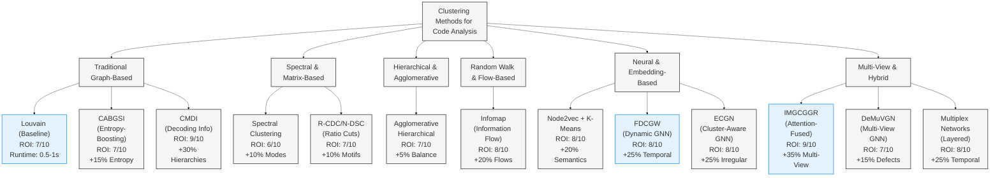

---

## ELI5: Intuitive Visualizations of Each Clustering Method

### 🏘️ **Traditional Graph-Based Methods**

#### **Louvain (Baseline)**
```
🏘️ Neighborhood Finder
Like finding natural neighborhoods in a city:
- Groups houses that are well-connected to each other
- Separates them by roads with fewer connections
- Each neighborhood = one cluster
```
**Think:** Finding friend groups in a school cafeteria

#### **CABGSI (Entropy-Boosting)**
```
🔥 Heat Detector
Like finding the warmest/coolest spots in a building:
- Measures how "mixed up" connections are
- Groups similar-temperature rooms together
- Creates clean, organized zones
```
**Think:** Sorting laundry by color intensity

#### **CMDI (Decoding Info)**
```
📚 Library Organizer
Like organizing books by how easy they are to understand:
- Groups books that tell similar stories
- Creates sections that make sense together
- Each section has a clear theme
```
**Think:** Creating reading levels for books

---

### 🎭 **Spectral & Matrix-Based Methods**

#### **Spectral Clustering**
```
🎵 Orchestra Sections
Like seating musicians by their instruments:
- Finds natural vibration patterns
- Groups similar-sounding instruments together
- Creates harmonious sections
```
**Think:** Separating a choir by voice parts

#### **R-CDC/N-DSC (Ratio Cuts)**
```
✂️ Smart Scissors
Like cutting a pizza with the fewest straight cuts:
- Finds the best places to make clean cuts
- Each piece has balanced toppings
- Minimal cutting required
```
**Think:** Dividing a chocolate bar evenly

---

### 🌳 **Hierarchical & Agglomerative**

#### **Agglomerative Hierarchical**
```
🌳 Family Tree Builder
Like building a family tree from the bottom up:
- Start with individual people
- Group siblings, then parents, then grandparents
- Creates levels of relationships
```
**Think:** Organizing files in nested folders

---

### 🚶 **Random Walk & Flow-Based**

#### **Infomap**
```
🚶 Tourist Route Planner
Like planning the most efficient city tour:
- Follows the paths most people take
- Groups attractions that tourists visit together
- Creates logical tour districts
```
**Think:** Finding popular walking paths in a park

---

### 🧠 **Neural & Embedding-Based**

#### **Node2vec + K-Means**
```
🧠 Personality Test
Like giving each function a personality test:
- Learns what each function "likes" to do
- Groups functions with similar personalities
- Creates friend circles based on interests
```
**Think:** Dating app for code functions

#### **FDCGW (Dynamic GNN)**
```
🔄 Time-Lapse Camera
Like watching a neighborhood change over time:
- Tracks how relationships evolve
- Predicts future connections
- Adapts clusters as things change
```
**Think:** Social network that updates in real-time

#### **ECGN (Cluster-Aware GNN)**
```
🎨 Art Critic
Like analyzing paintings by their style:
- Understands that some art breaks rules beautifully
- Groups unconventional pieces together
- Appreciates unique patterns
```
**Think:** Finding avant-garde art movements

---

### 🌈 **Multi-View & Hybrid**

#### **IMGCGGR (Attention-Fused)**
```
🌈 Super Vision
Like having multiple pairs of glasses:
- One pair sees dependencies
- One sees semantics  
- One sees timing
- Combines all views for perfect understanding
```
**Think:** Doctor using MRI + CT scan + X-ray together

#### **DeMuVGN (Multi-View GNN)**
```
🔍 Detective Kit
Like a detective with multiple tools:
- Magnifying glass for details
- UV light for hidden patterns
- Fingerprint kit for identity
- Combines evidence to solve crimes
```
**Think:** Finding bugs using multiple debugging tools

#### **Multiplex Networks**
```
🏢 Office Building Maps
Like having maps for every floor of a building:
- Floor 1: Data flow connections
- Floor 2: Code dependencies  
- Floor 3: Time-based changes
- Elevators connect everything
```
**Think:** Understanding a company through all its departments

---

## 🎯 **Quick Reference Cheat Sheet**

| Method | Best For | Analogy | ROI |
|--------|----------|---------|-----|
| **Louvain** | Quick, basic clustering | 🏘️ Neighborhoods | 7/10 |
| **CMDI** | Hierarchical organization | 📚 Library shelves | 9/10 |
| **Infomap** | Flow analysis | 🚶 Tourist routes | 8/10 |
| **Node2vec** | Semantic similarity | 🧠 Personalities | 8/10 |
| **FDCGW** | Time-varying data | 🔄 Time-lapse | 8/10 |
| **IMGCGGR** | Multiple data types | 🌈 Super vision | 9/10 |

**Remember:** Pick the method that matches your "story" - are you finding neighborhoods, planning tours, or using super vision?