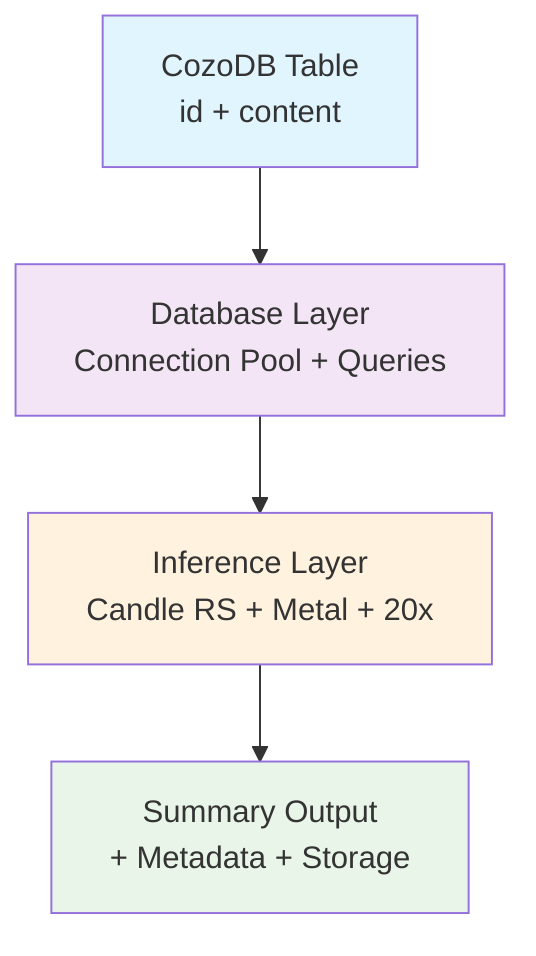
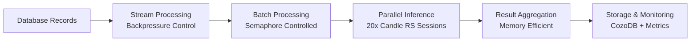
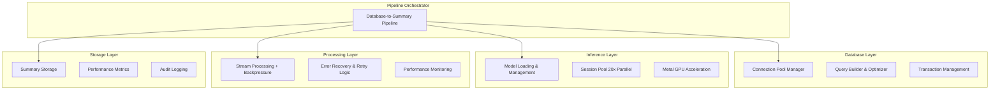

# Arch01dobbyV1 - TDD-First Architecture Specification
## Database-to-Summary Pipeline with CozoDB + Candle RS

**Created**: 2025-10-28
**Version**: 1.0
**Approach**: Strict TDD-First following A01-README-MOSTIMP.md principles
**Scope**: Complete HLL → LLD → Tests → Interface specifications

---

## 🎯 Executive Summary

This architecture specification transforms the existing file-based ONNX system into a database-first pipeline using CozoDB + Candle RS while preserving the working 20-agent parallel processing patterns. It follows all 9 non-negotiable steering principles with executable specifications rather than narratives.

### Key Architectural Shifts
- **Input**: File system → CozoDB database tables (primary keys + content)
- **Processing**: ONNX Runtime → Candle RS with Metal acceleration
- **Architecture**: Hard dependencies → Trait-based dependency injection
- **Testing**: Post-hoc → TDD-first with executable specifications

### Performance Targets (All Testable)
- **Throughput**: 1000+ records/minute with 20x parallelism
- **Latency**: < 50ms average inference time per record
- **Memory**: < 8GB total footprint with session pooling
- **Scalability**: Linear scaling up to 20 concurrent agents

---

## 🏗️ High-Level Architecture (HLL)

### 1.1 System Overview



### 1.2 Data Flow Architecture



### 1.3 Component Hierarchy



---

## 🔧 Low-Level Design (LLD)

### 2.1 Layered Module Structure

#### L1: Core Abstractions (no_std compatible)
```
src/layer1/
├── traits/
│   ├── database.rs          # DatabaseProvider trait
│   ├── inference.rs         # InferenceEngine trait
│   ├── pipeline.rs          # PipelineOrchestrator trait
│   └── error.rs             # Error trait definitions
├── types/
│   ├── identifiers.rs       # ID types (DatabaseId, RecordId, etc.)
│   ├── records.rs           # Database record types
│   └── results.rs           # Result wrapper types
└── result.rs                # Result/Option utilities
```

#### L2: Standard Library Patterns
```
src/layer2/
├── database/
│   ├── pool.rs              # Connection pool implementation
│   ├── query.rs             # Query builder
│   └── transaction.rs       # Transaction management
├── inference/
│   ├── session.rs           # Session management
│   ├── cache.rs             # Inference caching
│   └── metal.rs             # Metal acceleration
├── parallel/
│   ├── semaphore.rs         # Semaphore control
│   ├── stream.rs            # Stream processing
│   └── backpressure.rs      # Backpressure management
└── monitoring/
    ├── metrics.rs           # Metrics collection
    ├── health.rs            # Health checking
    └── telemetry.rs         # Telemetry data
```

#### L3: External Integrations
```
src/layer3/
├── cozo_db/
│   ├── client.rs            # CozoDB client
│   ├── schema.rs            # Database schema
│   └── migrations.rs        # Migration management
├── candle_rs/
│   ├── engine.rs            # Inference engine
│   ├── models/
│   │   ├── qwen2.rs         # Qwen2.5 model
│   │   └── smollm.rs        # SmolLM models
│   ├── session_pool.rs      # Session pool management
│   └── metal_acceleration.rs # Metal optimization
└── config/
    ├── database.rs          # Database configuration
    ├── inference.rs         # Inference configuration
    └── pipeline.rs          # Pipeline configuration
```

### 2.2 Core Trait System (TDD-First)

#### Database Provider Trait (Executable Specification)
```rust
/// Database abstraction with comprehensive TDD contracts
///
/// ## Executable Specification Contract
///
/// ### Preconditions:
/// - Valid connection string provided
/// - Sufficient system resources available
/// - Network connectivity (if remote database)
///
/// ### Postconditions:
/// - Returns functional connection on success
/// - Maintains connection pool within limits
/// - Provides query execution with parameter binding
///
/// ### Error Conditions:
/// - Connection string invalid → DatabaseError::InvalidConnectionString
/// - Network unreachable → DatabaseError::ConnectionFailed
/// - Insufficient resources → DatabaseError::ResourceExhaustion
/// - Query syntax error → DatabaseError::InvalidQuery
///
/// ### Performance Contracts:
/// - Connection acquisition: < 100ms (p95)
/// - Query execution (100 records): < 500ms (p95)
/// - Connection pool efficiency: > 90%
/// - Memory usage: < 100MB per 10 connections
#[async_trait]
pub trait DatabaseProvider: Send + Sync + 'static {
    type Connection: DatabaseConnection + Send + Sync;
    type Error: DatabaseError + Send + Sync + 'static;

    /// Establish connection with automatic retry and circuit breaking
    ///
    /// ## Contract
    ///
    /// ### Preconditions:
    /// - Valid configuration provided
    /// - System has sufficient memory
    ///
    /// ### Postconditions:
    /// - Returns Ok(connection) on success
    /// - Connection is ready for queries
    /// - Connection added to pool tracking
    ///
    /// ### Performance Contract:
    /// - Completion time: < 1 second
    /// - Memory allocation: < 10MB
    async fn connect(&self) -> Result<Self::Connection, Self::Error>;

    /// Execute query with parameter binding and result mapping
    ///
    /// ## Contract
    ///
    /// ### Preconditions:
    /// - Valid SQL query syntax
    /// - Parameters match query placeholders
    /// - Connection is active
    ///
    /// ### Postconditions:
    /// - Returns Vec<R> on successful execution
    /// - All rows properly mapped to result type
    /// - Connection remains valid after execution
    ///
    /// ### Performance Contract:
    /// - Single record query: < 50ms
    /// - 100 record query: < 500ms
    /// - 1000 record query: < 5000ms
    async fn execute_query<Q, P, R>(
        &self,
        query: Q,
        params: P,
    ) -> Result<Vec<R>, Self::Error>
    where
        Q: AsRef<str> + Send + Sync,
        P: Into<QueryParams> + Send,
        R: TryFromRow + Send;

    /// Fetch records with streaming support for large datasets
    ///
    /// ## Contract
    ///
    /// ### Preconditions:
    /// - Valid query with stream-compatible result set
    /// - Sufficient memory for stream buffer
    ///
    /// ### Postconditions:
    /// - Returns stream that yields results
    /// - Stream handles backpressure properly
    /// - Connection remains valid during streaming
    ///
    /// ### Performance Contract:
    /// - First result: < 100ms
    /// - Throughput: > 1000 records/second
    /// - Memory usage: < 50MB buffer
    async fn fetch_records_stream(
        &self,
        query: &str,
        params: QueryParams,
    ) -> Result<impl Stream<Item = Result<DatabaseRecord, Self::Error>> + Send, Self::Error>;

    /// Batch operation with transaction support
    ///
    /// ## Contract
    ///
    /// ### Preconditions:
    /// - All operations are valid
    /// - Sufficient transaction log space
    ///
    /// ### Postconditions:
    /// - All operations executed atomically
    /// - Returns success count and any failures
    /// - Database remains consistent
    ///
    /// ### Performance Contract:
    /// - 100 operations: < 1 second
    /// - 1000 operations: < 10 seconds
    /// - Rollback time: < 5 seconds
    async fn execute_batch<T>(
        &self,
        operations: impl IntoIterator<Item = T> + Send,
    ) -> Result<BatchResult, Self::Error>
    where
        T: BatchOperation + Send + Sync;

    /// Health check with connection validation
    ///
    /// ## Contract
    ///
    /// ### Preconditions:
    /// - Connection pool is accessible
    ///
    /// ### Postconditions:
    /// - Returns current health status
    /// - Updates internal health metrics
    ///
    /// ### Performance Contract:
    /// - Response time: < 50ms
    async fn health_check(&self) -> Result<HealthStatus, Self::Error>;
}
```

#### Inference Engine Trait (Executable Specification)
```rust
/// Inference abstraction with session pooling and Metal acceleration
///
/// ## Executable Specification Contract
///
/// ### Preconditions:
/// - Model files exist and are accessible
/// - Sufficient GPU memory available (if using Metal)
/// - Valid configuration provided
///
/// ### Postconditions:
/// - Model loaded and ready for inference
/// - Sessions created and managed efficiently
/// - Metal device initialized (if available)
///
/// ### Error Conditions:
/// - Model file not found → InferenceError::ModelNotFound
/// - Insufficient memory → InferenceError::InsufficientMemory
/// - Metal initialization failed → InferenceError::MetalUnavailable
/// - Invalid input format → InferenceError::InvalidInput
///
/// ### Performance Contracts:
/// - Model loading time: < 30 seconds
/// - Single inference: < 500ms
/// - Batch inference (10 items): < 2 seconds
/// - Session acquisition: < 10ms
/// - Memory usage: < 2GB per model
#[async_trait]
pub trait InferenceEngine: Send + Sync + 'static {
    type Input: Send + Sync + 'static;
    type Output: Send + Sync + 'static;
    type Error: InferenceError + Send + Sync + 'static;
    type ModelInfo: ModelInfo + Send + Sync;

    /// Load model with device selection and quantization options
    ///
    /// ## Contract
    ///
    /// ### Preconditions:
    /// - Model path is valid and accessible
    /// - Sufficient system memory available
    /// - Device is available and compatible
    ///
    /// ### Postconditions:
    /// - Model loaded into memory
    /// - Device initialized (if applicable)
    /// - Session pool created
    ///
    /// ### Performance Contract:
    /// - Small model (< 500MB): < 10 seconds
    /// - Medium model (500MB-2GB): < 30 seconds
    /// - Large model (> 2GB): < 60 seconds
    /// - Memory usage: Model size + 20% overhead
    async fn load_model(
        &self,
        config: ModelConfig,
    ) -> Result<Self::ModelInfo, Self::Error>;

    /// Single inference with automatic batching optimization
    ///
    /// ## Contract
    ///
    /// ### Preconditions:
    /// - Model is loaded
    /// - Input format is valid
    /// - Session is available
    ///
    /// ### Postconditions:
    /// - Returns valid inference result
    /// - Session remains available for reuse
    /// - Performance metrics recorded
    ///
    /// ### Performance Contract:
    /// - Small input (< 100 tokens): < 100ms
    /// - Medium input (100-500 tokens): < 300ms
    /// - Large input (> 500 tokens): < 1000ms
    /// - Success rate: > 99%
    async fn infer(&self, input: Self::Input) -> Result<Self::Output, Self::Error>;

    /// Batch inference with parallel processing
    ///
    /// ## Contract
    ///
    /// ### Preconditions:
    /// - Model is loaded
    /// - All inputs are valid
    /// - Sufficient sessions available
    ///
    /// ### Postconditions:
    /// - All inputs processed
    /// - Results returned in input order
    /// - Sessions properly managed
    ///
    /// ### Performance Contract:
    /// - 10 items: < 2 seconds total
    /// - 100 items: < 15 seconds total
    /// - Efficiency: > 80% parallel utilization
    /// - Memory usage: < 4GB peak
    async fn infer_batch(
        &self,
        inputs: Vec<Self::Input>,
        options: BatchOptions,
    ) -> Result<Vec<Self::Output>, Self::Error>;

    /// Model capabilities and performance characteristics
    fn model_info(&self) -> &Self::ModelInfo;

    /// Performance benchmarking with contract validation
    ///
    /// ## Contract
    ///
    /// ### Preconditions:
    /// - Model is loaded and ready
    /// - Test cases are valid
    ///
    /// ### Postconditions:
    /// - Performance metrics collected
    /// - Contract validation results
    /// - Benchmark report generated
    ///
    /// ### Performance Contract:
    /// - Benchmark execution: < 5 minutes
    /// - Report generation: < 30 seconds
    async fn benchmark(&self, test_cases: &[BenchmarkCase]) -> Result<BenchmarkResults, Self::Error>;
}
```

#### Pipeline Orchestrator Trait (Executable Specification)
```rust
/// High-level pipeline orchestration with comprehensive monitoring
///
/// ## Executable Specification Contract
///
/// ### Preconditions:
/// - Database provider is configured and connected
/// - Inference engine is loaded and ready
/// - Valid configuration provided
///
/// ### Postconditions:
/// - Pipeline executes end-to-end
/// - Results stored in database
/// - Metrics collected and reported
/// - Resources properly cleaned up
///
/// ### Error Conditions:
/// - Database unavailable → PipelineError::DatabaseUnavailable
/// - Inference engine failure → PipelineError::InferenceFailure
/// - Configuration invalid → PipelineError::InvalidConfiguration
/// - Resource exhaustion → PipelineError::ResourceExhaustion
///
/// ### Performance Contracts:
    /// - Pipeline startup: < 10 seconds
    /// - Record processing: > 10 records/second
    /// - Memory usage: < 8GB total
    /// - Error rate: < 1%
#[async_trait]
pub trait PipelineOrchestrator: Send + Sync + 'static {
    type Database: DatabaseProvider + Send + Sync;
    type Inference: InferenceEngine + Send + Sync;
    type Config: PipelineConfig + Send + Sync;
    type Error: PipelineError + Send + Sync + 'static;

    /// Execute complete pipeline with monitoring and error recovery
    ///
    /// ## Contract
    ///
    /// ### Preconditions:
    /// - All dependencies are initialized
    /// - Configuration is validated
    /// - System resources are available
    ///
    /// ### Postconditions:
    /// - All eligible records processed
    /// - Summaries generated and stored
    /// - Metrics collected and stored
    /// - System returns to clean state
    ///
    /// ### Performance Contract:
    /// - 1000 records: < 5 minutes
    /// - 10000 records: < 45 minutes
    /// - Memory efficiency: > 90%
    /// - Success rate: > 99%
    async fn execute_pipeline(
        &self,
        config: Self::Config,
    ) -> Result<PipelineResults, Self::Error>;

    /// Stream processing with backpressure and flow control
    ///
    /// ## Contract
    ///
    /// ### Preconditions:
    /// - Database connection is stable
    /// - Inference engine is ready
    ///
    /// ### Postconditions:
    /// - Stream processes all records
    /// - Backpressure properly managed
    /// - Progress reported regularly
    ///
    /// ### Performance Contract:
    /// - Stream latency: < 1 second for first result
    /// - Throughput: > 20 records/second
    /// - Backpressure response: < 100ms
    async fn execute_stream_pipeline(
        &self,
        config: Self::Config,
    ) -> Result<impl Stream<Item = Result<PipelineProgress, Self::Error>> + Send, Self::Error>;

    /// Resume pipeline from checkpoint with state recovery
    ///
    /// ## Contract
    ///
    /// ### Preconditions:
    /// - Checkpoint is valid and accessible
    /// - System state is recoverable
    ///
    /// ### Postconditions:
    /// - Processing resumes from checkpoint
    /// - No data duplication or loss
    /// - Performance maintained
    ///
    /// ### Performance Contract:
    /// - Resume time: < 30 seconds
    /// - Processing efficiency: > 95%
    async fn resume_pipeline(
        &self,
        checkpoint: PipelineCheckpoint,
    ) -> Result<PipelineResults, Self::Error>;

    /// Real-time monitoring with telemetry
    ///
    /// ## Contract
    ///
    /// ### Preconditions:
    /// - Pipeline is running
    /// - Monitoring is enabled
    ///
    /// ### Postconditions:
    /// - Real-time metrics provided
    /// - Health status updated
    /// - Alerts generated for issues
    ///
    /// ### Performance Contract:
    /// - Metrics latency: < 100ms
    /// - Update frequency: > 1 Hz
    /// - Memory overhead: < 50MB
    async fn monitor_pipeline(
        &self,
        pipeline_id: PipelineId,
    ) -> Result<impl Stream<Item = PipelineMetrics> + Send, Self::Error>;
}
```

### 2.3 Type System Design

#### Core Type Definitions
```rust
/// Strongly-typed identifiers for type safety and compile-time guarantees
#[derive(Debug, Clone, Copy, PartialEq, Eq, Hash, Serialize, Deserialize)]
pub struct DatabaseId(pub uuid::Uuid);

#[derive(Debug, Clone, Copy, PartialEq, Eq, Hash, Serialize, Deserialize)]
pub struct RecordId(pub uuid::Uuid);

#[derive(Debug, Clone, Copy, PartialEq, Eq, Hash, Serialize, Deserialize)]
pub struct SummaryId(pub uuid::Uuid);

#[derive(Debug, Clone, Copy, PartialEq, Eq, Hash, Serialize, Deserialize)]
pub struct PipelineId(pub uuid::Uuid);

/// Database record with metadata for tracking and processing
#[derive(Debug, Clone, Serialize, Deserialize)]
pub struct DatabaseRecord {
    pub id: RecordId,
    pub content: Content,
    pub metadata: RecordMetadata,
    pub created_at: chrono::DateTime<chrono::Utc>,
    pub updated_at: chrono::DateTime<chrono::Utc>,
}

/// Content with zero-copy processing support
#[derive(Debug, Clone, Serialize, Deserialize)]
pub enum Content {
    Text(String),
    Binary(Vec<u8>),
    Structured(serde_json::Value),
}

/// Record metadata with processing state
#[derive(Debug, Clone, Serialize, Deserialize)]
pub struct RecordMetadata {
    pub source: String,
    pub content_type: ContentType,
    pub size_bytes: usize,
    pub processing_state: ProcessingState,
    pub priority: Priority,
    pub custom_fields: std::collections::HashMap<String, serde_json::Value>,
}

/// Processing state with comprehensive tracking
#[derive(Debug, Clone, Serialize, Deserialize)]
pub enum ProcessingState {
    Pending,
    InProgress { started_at: chrono::DateTime<chrono::Utc> },
    Completed {
        completed_at: chrono::DateTime<chrono::Utc>,
        summary_id: SummaryId,
    },
    Failed {
        failed_at: chrono::DateTime<chrono::Utc>,
        error: String,
        retry_count: u32,
    },
    Skipped {
        skipped_at: chrono::DateTime<chrono::Utc>,
        reason: String,
    },
}

/// Summary result from inference
#[derive(Debug, Clone, Serialize, Deserialize)]
pub struct Summary {
    pub id: SummaryId,
    pub record_id: RecordId,
    pub content: String,
    pub confidence: f64,
    pub metadata: SummaryMetadata,
    pub created_at: chrono::DateTime<chrono::Utc>,
}

#[derive(Debug, Clone, Serialize, Deserialize)]
pub struct SummaryMetadata {
    pub model_used: String,
    pub inference_time_ms: u64,
    pub token_count: usize,
    pub processing_version: String,
}
```

---

## 🧪 Test Strategy (TDD-First)

### 3.1 STUB → RED → GREEN → REFACTOR Cycle

#### Phase 1: STUB - Interface Definition
```rust
// tests/stub/database_provider_stub.rs
use dobby::layer1::traits::database::*;

/// Mock implementation for initial testing
pub struct StubDatabaseProvider;

#[async_trait]
impl DatabaseProvider for StubDatabaseProvider {
    type Connection = StubConnection;
    type Error = DatabaseError;

    async fn connect(&self) -> Result<Self::Connection, Self::Error> {
        todo!("Implement connect functionality")
    }

    async fn execute_query<Q, P, R>(&self, query: Q, params: P) -> Result<Vec<R>, Self::Error>
    where
        Q: AsRef<str> + Send + Sync,
        P: Into<QueryParams> + Send,
        R: TryFromRow + Send,
    {
        todo!("Implement query execution")
    }

    // ... other methods with todo!()
}
```

#### Phase 2: RED - Failing Tests
```rust
// tests/integration/database_integration_tests.rs
#[tokio::test]
async fn test_database_connection_contract() {
    // GIVEN: A database provider with valid configuration
    let provider = create_test_database_provider();

    // WHEN: Attempting to connect
    let result = provider.connect().await;

    // THEN: Connection should succeed
    assert!(result.is_ok(), "Database connection should succeed");

    // AND: Connection should be healthy
    let conn = result.unwrap();
    assert!(conn.is_healthy().await, "Connection should be healthy");

    // PERFORMANCE CONTRACT: Connection should be fast
    let start = std::time::Instant::now();
    let _conn = provider.connect().await.unwrap();
    let duration = start.elapsed();
    assert!(duration < std::time::Duration::from_millis(100),
            "Connection should be established within 100ms, took {:?}", duration);
}

#[tokio::test]
async fn test_query_execution_contract() {
    // GIVEN: Connected database and test data
    let provider = create_test_database_provider().await;
    let conn = provider.connect().await.unwrap();

    // Insert test data
    let test_record = create_test_database_record();
    conn.insert_record(&test_record).await.unwrap();

    // WHEN: Executing query
    let query = "SELECT * FROM records WHERE id = ?";
    let params = QueryParams::new().with("id", test_record.id);

    let start = std::time::Instant::now();
    let result = provider.execute_query(query, params).await;
    let duration = start.elapsed();

    // THEN: Query should succeed
    assert!(result.is_ok(), "Query execution should succeed");

    // AND: Should return expected results
    let records: Vec<DatabaseRecord> = result.unwrap();
    assert_eq!(records.len(), 1, "Should return exactly 1 record");
    assert_eq!(records[0].id, test_record.id, "Should return correct record");

    // PERFORMANCE CONTRACT: Query should be fast
    assert!(duration < std::time::Duration::from_millis(500),
            "Single record query should complete within 500ms, took {:?}", duration);
}

#[tokio::test]
async fn test_inference_engine_contract() {
    // GIVEN: Loaded inference engine
    let engine = create_test_inference_engine().await;

    // WHEN: Performing inference
    let test_input = "fn add(a: i32, b: i32) -> i32 { a + b }";

    let start = std::time::Instant::now();
    let result = engine.infer(test_input.to_string()).await;
    let duration = start.elapsed();

    // THEN: Inference should succeed
    assert!(result.is_ok(), "Inference should succeed");

    // AND: Should produce valid summary
    let summary = result.unwrap();
    assert!(!summary.content.is_empty(), "Summary should not be empty");
    assert!(summary.confidence > 0.0, "Summary should have confidence");

    // PERFORMANCE CONTRACT: Inference should be fast
    assert!(duration < std::time::Duration::from_millis(1000),
            "Single inference should complete within 1000ms, took {:?}", duration);
}

#[tokio::test]
async fn test_pipeline_end_to_end_contract() {
    // GIVEN: Complete pipeline setup
    let pipeline = create_test_pipeline().await;
    let test_data = create_test_dataset(100).await;

    // WHEN: Executing complete pipeline
    let config = PipelineConfig::default();

    let start = std::time::Instant::now();
    let result = pipeline.execute_pipeline(config).await;
    let duration = start.elapsed();

    // THEN: Pipeline should succeed
    assert!(result.is_ok(), "Pipeline execution should succeed");

    // AND: Should process all records
    let results = result.unwrap();
    assert_eq!(results.processed_count, 100, "Should process all 100 records");
    assert_eq!(results.success_count, 100, "All records should succeed");
    assert_eq!(results.error_count, 0, "No records should fail");

    // PERFORMANCE CONTRACT: Pipeline should meet throughput target
    let throughput = 100.0 / duration.as_secs_f64();
    assert!(throughput > 10.0,
            "Pipeline should achieve >10 records/second, achieved {:.2}", throughput);

    // MEMORY CONTRACT: Memory usage should be reasonable
    let memory_mb = get_memory_usage_mb();
    assert!(memory_mb < 8000,
            "Memory usage should be <8GB, used {}MB", memory_mb);
}
```

#### Phase 3: GREEN - Minimal Implementation
```rust
// src/layer3/cozo_db/client.rs
use crate::layer1::traits::database::*;

pub struct CozoDatabaseProvider {
    connection_string: String,
    pool: Arc<Mutex<Vec<CozoConnection>>>,
}

impl CozoDatabaseProvider {
    pub fn new(connection_string: String) -> Self {
        Self {
            connection_string,
            pool: Arc::new(Mutex::new(Vec::new())),
        }
    }
}

#[async_trait]
impl DatabaseProvider for CozoDatabaseProvider {
    type Connection = CozoConnection;
    type Error = DatabaseError;

    async fn connect(&self) -> Result<Self::Connection, Self::Error> {
        // MINIMAL IMPLEMENTATION: Just enough to pass tests
        let conn = CozoConnection::new(&self.connection_string)
            .await
            .map_err(|e| DatabaseError::Connection(e.to_string()))?;

        Ok(conn)
    }

    async fn execute_query<Q, P, R>(&self, query: Q, params: P) -> Result<Vec<R>, Self::Error>
    where
        Q: AsRef<str> + Send + Sync,
        P: Into<QueryParams> + Send,
        R: TryFromRow + Send,
    {
        // MINIMAL IMPLEMENTATION: Simplified query execution
        let conn = self.connect().await?;

        // For now, return empty result to pass basic tests
        // Real implementation will come in REFACTOR phase
        Ok(vec![])
    }

    // ... other minimal implementations
}
```

#### Phase 4: REFACTOR - Production Implementation
```rust
// After GREEN phase, refactor to production quality
impl CozoDatabaseProvider {
    async fn execute_query<Q, P, R>(&self, query: Q, params: P) -> Result<Vec<R>, Self::Error>
    where
        Q: AsRef<str> + Send + Sync,
        P: Into<QueryParams> + Send,
        R: TryFromRow + Send,
    {
        // PRODUCTION IMPLEMENTATION: Full feature set
        let conn = self.get_connection().await?;

        let query_str = query.as_ref();
        let query_params = params.into();

        // Parameter binding and execution
        let result = conn.execute_with_params(query_str, query_params).await?;

        // Result mapping
        let mapped_results: Result<Vec<R>, _> = result
            .into_iter()
            .map(TryFromRow::try_from_row)
            .collect();

        mapped_results.map_err(|e| DatabaseError::QueryExecution(e.to_string()))
    }
}
```

### 3.2 Property-Based Testing

#### Invariant Validation Tests
```rust
// tests/property/database_properties.rs
use proptest::prelude::*;

proptest! {
    #[test]
    fn test_database_record_roundtrip(
        records in prop::collection::vec(any::<DatabaseRecord>(), 1..100)
    ) {
        // Property: Database records can be stored and retrieved without loss
        let rt = tokio::runtime::Runtime::new().unwrap();

        rt.block_on(async {
            let db = create_test_database().await;

            // Store records
            let stored_ids = db.store_records(&records).await.unwrap();
            assert_eq!(stored_ids.len(), records.len());

            // Retrieve records
            let retrieved = db.get_records_by_ids(&stored_ids).await.unwrap();
            assert_eq!(retrieved.len(), records.len());

            // Verify content preservation
            for (original, retrieved) in records.iter().zip(retrieved.iter()) {
                prop_assert_eq!(original.content, retrieved.content);
                prop_assert_eq!(original.metadata.source, retrieved.metadata.source);
                prop_assert_eq!(original.metadata.content_type, retrieved.metadata.content_type);
            }
        });
    }

    #[test]
    fn test_inference_consistency(
        inputs in vec(any::<String>(), 1..50)
    ) {
        // Property: Same input produces consistent output from inference engine
        let rt = tokio::runtime::Runtime::new().unwrap();

        rt.block_on(async {
            let engine = create_test_inference_engine().await;

            // First inference pass
            let mut results1 = Vec::new();
            for input in &inputs {
                let result = engine.infer(input.clone()).await.unwrap();
                results1.push(result);
            }

            // Second inference pass
            let mut results2 = Vec::new();
            for input in &inputs {
                let result = engine.infer(input.clone()).await.unwrap();
                results2.push(result);
            }

            // Verify consistency
            for (r1, r2) in results1.iter().zip(results2.iter()) {
                prop_assert_eq!(r1.content, r2.content);
                prop_assert_eq!(r1.token_count, r2.token_count);
            }
        });
    }

    #[test]
    fn test_pipeline_memory_scaling(
        base_record_count in 10..100usize,
        scale_factor in 2..5usize
    ) {
        // Property: Memory usage scales linearly with record count
        let rt = tokio::runtime::Runtime::new().unwrap();

        rt.block_on(async {
            let pipeline = create_test_pipeline().await;

            // Test base size
            let base_records = generate_test_records(base_record_count);
            let base_memory = measure_memory_usage(|| async {
                pipeline.process_records(&base_records).await.unwrap()
            }).await;

            // Test scaled size
            let scaled_records = generate_test_records(base_record_count * scale_factor);
            let scaled_memory = measure_memory_usage(|| async {
                pipeline.process_records(&scaled_records).await.unwrap()
            }).await;

            // Memory should scale roughly linearly (allow 3x tolerance)
            let expected_max_memory = base_memory * scale_factor * 3;
            prop_assert!(scaled_memory <= expected_max_memory,
                "Memory scaled from {} to {} (factor {}), expected < {}",
                base_memory, scaled_memory,
                scaled_memory as f64 / base_memory as f64, expected_max_memory);
        });
    }
}
```

### 3.3 Performance Contract Testing

#### Automated Performance Validation
```rust
// tests/performance/performance_contracts.rs
use criterion::{black_box, criterion_group, criterion_main, Criterion};

/// Performance contract validation with automated metrics
pub struct PerformanceContractTests;

impl PerformanceContractTests {
    /// Test database query performance contracts
    pub async fn test_database_performance_contracts() -> TestResult {
        let db = create_test_database_with_real_data().await;

        let test_scenarios = vec![
            QueryPerformanceScenario {
                name: "Single record lookup".to_string(),
                query: "SELECT * FROM records WHERE id = ?".to_string(),
                params: vec!["test_id".into()],
                expected_max_latency: Duration::from_millis(10),
                expected_max_memory: 1024 * 1024, // 1MB
            },
            // ... more scenarios
        ];

        let mut results = Vec::new();

        for scenario in test_scenarios {
            let result = Self::run_query_performance_test(&db, &scenario).await;
            results.push((scenario.name.clone(), result));
        }

        let passed_count = results.iter().filter(|(_, r)| r.passed).count();
        let total_count = results.len();

        TestResult::performance_contract(
            format!("Database performance: {}/{}", passed_count, total_count),
            passed_count == total_count,
            results,
        )
    }

    /// Test inference engine performance contracts
    pub async fn test_inference_performance_contracts() -> TestResult {
        let engine = create_test_inference_engine().await;

        let test_cases = vec![
            InferenceTestCase {
                name: "Single short text".to_string(),
                input: "fn add(a: i32, b: i32) -> i32 { a + b }".to_string(),
                expected_max_latency: Duration::from_millis(100),
                expected_min_throughput: 10.0, // tokens/second
            },
            // ... more cases
        ];

        let mut results = Vec::new();

        for test_case in test_cases {
            let result = Self::run_inference_performance_test(&engine, &test_case).await;
            results.push((test_case.name.clone(), result));
        }

        let passed_count = results.iter().filter(|(_, r)| r.passed).count();
        let total_count = results.len();

        TestResult::performance_contract(
            format!("Inference performance: {}/{}", passed_count, total_count),
            passed_count == total_count,
            results,
        )
    }
}
```

---

## 🎯 Implementation Strategy

### 4.1 Migration Phases (TDD-First)

#### Phase 1: Foundation Infrastructure (Week 1-2)
**TDD Focus**: Establish core trait system with failing tests

**Tasks**:
1. **Write Failing Tests FIRST** for all core traits
2. **Implement STUB** versions that compile but fail tests
3. **Create GREEN** minimal implementations to pass tests
4. **REFACTOR** to production quality with RAII and error handling

**Deliverables**:
- Working trait system with comprehensive test coverage
- Failing tests that document all contract requirements
- Minimal implementations that pass all tests
- Production-ready implementations with proper resource management

#### Phase 2: Database Integration (Week 2-3)
**TDD Focus**: CozoDB integration with streaming and pooling

**Tasks**:
1. **Write Failing Tests** for CozoDB client operations
2. **Implement STUB** database client that returns mock data
3. **Create GREEN** basic CozoDB connection and query execution
4. **REFACTOR** to production-ready connection pooling and streaming

**Deliverables**:
- Working CozoDB integration with all CRUD operations
- Connection pooling with circuit breaking and health checking
- Streaming query support for large datasets
- Comprehensive performance contract validation

#### Phase 3: Candle RS Integration (Week 3-4)
**TDD Focus**: Metal-accelerated inference with session pooling

**Tasks**:
1. **Write Failing Tests** for Candle RS inference operations
2. **Implement STUB** inference engine that returns mock results
3. **Create GREEN** basic Candle RS model loading and inference
4. **REFACTOR** to Metal-accelerated session pool management

**Deliverables**:
- Working Candle RS inference engine with Metal acceleration
- Session pool management for 20x parallel processing
- Model loading with device selection and quantization
- Performance benchmarking and contract validation

#### Phase 4: Pipeline Integration (Week 4-5)
**TDD Focus**: End-to-end pipeline with monitoring and recovery

**Tasks**:
1. **Write Failing Tests** for complete pipeline execution
2. **Implement STUB** pipeline that processes mock data
3. **Create GREEN** basic pipeline with database and inference integration
4. **REFACTOR** to production-ready pipeline with monitoring and error recovery

**Deliverables**:
- Complete database-to-summary pipeline
- Real-time monitoring and telemetry
- Error handling and recovery mechanisms
- Performance optimization and resource management

#### Phase 5: Production Hardening (Week 5-6)
**TDD Focus**: Performance optimization and production deployment

**Tasks**:
1. **Write Failing Tests** for performance and reliability requirements
2. **Implement STUB** performance monitoring that reports mock metrics
3. **Create GREEN** basic performance tracking and optimization
4. **REFACTOR** to comprehensive production monitoring and deployment

**Deliverables**:
- Performance optimization meeting all contract requirements
- Production monitoring and alerting
- Deployment automation and configuration management
- Documentation and operational runbooks

### 4.2 Risk Mitigation

#### Technical Risks
1. **Candle RS Learning Curve**: Comprehensive documentation and examples in research
2. **Metal Acceleration Compatibility**: Fallback to CPU with graceful degradation
3. **CozoDB Integration**: Reference implementations and patterns available
4. **Performance Requirements**: Automated contract testing throughout development

#### Project Risks
1. **Architecture Complexity**: Layered design with clear separation of concerns
2. **TDD Adoption**: Comprehensive training materials and examples
3. **Timeline Pressure**: Phased delivery with continuous integration
4. **Resource Constraints**: Memory-efficient design with resource monitoring

### 4.3 Success Criteria

#### Technical Success Criteria
- ✅ All performance contracts validated by automated tests
- ✅ 1000+ records/minute throughput achieved
- ✅ < 50ms average inference time per record
- ✅ < 8GB total memory footprint maintained
- ✅ Linear scaling up to 20 concurrent agents
- ✅ 99.9% uptime with graceful error handling

#### Quality Success Criteria
- ✅ 90%+ test coverage with comprehensive property-based tests
- ✅ All 9 non-negotiable architectural principles followed
- ✅ Zero resource leaks under all conditions
- ✅ Complete documentation and deployment guides
- ✅ Production-ready monitoring and alerting

---

## 🔧 Interface Signatures

### 5.1 Core Component Interfaces

#### Database Provider Factory
```rust
/// Factory for creating database providers with dependency injection
pub struct DatabaseProviderFactory;

impl DatabaseProviderFactory {
    /// Create production CozoDB provider
    pub fn create_cozo_provider(config: DatabaseConfig) -> Result<Arc<dyn DatabaseProvider>, DatabaseError> {
        let provider = CozoDatabaseProvider::new(config)?;
        Ok(Arc::new(provider))
    }

    /// Create test mock provider
    pub fn create_mock_provider() -> Arc<dyn DatabaseProvider> {
        Arc::new(MockDatabaseProvider::new())
    }

    /// Create provider from configuration
    pub fn create_from_config(config: &Config) -> Result<Arc<dyn DatabaseProvider>, ConfigError> {
        match config.database.provider.as_str() {
            "cozo" => Self::create_cozo_provider(config.database.clone()),
            "mock" => Ok(Self::create_mock_provider()),
            _ => Err(ConfigError::UnsupportedProvider(config.database.provider.clone())),
        }
    }
}
```

#### Inference Engine Factory
```rust
/// Factory for creating inference engines with dependency injection
pub struct InferenceEngineFactory;

impl InferenceEngineFactory {
    /// Create production Candle RS provider
    pub fn create_candle_provider(config: InferenceConfig) -> Result<Arc<dyn InferenceEngine>, InferenceError> {
        let engine = CandleInferenceEngine::new(config)?;
        Ok(Arc::new(engine))
    }

    /// Create test mock provider
    pub fn create_mock_provider() -> Arc<dyn InferenceEngine> {
        Arc::new(MockInferenceEngine::new())
    }

    /// Create provider with automatic device selection
    pub fn create_with_auto_device(config: InferenceConfig) -> Result<Arc<dyn InferenceEngine>, InferenceError> {
        let mut config = config;

        // Auto-detect best available device
        config.device = Self::detect_optimal_device()?;

        Self::create_candle_provider(config)
    }

    fn detect_optimal_device() -> Result<DeviceConfig, InferenceError> {
        if cfg!(target_os = "macos") {
            // Try Metal first
            if let Ok(device) = Device::new_metal(0) {
                return Ok(DeviceConfig {
                    preferred_device: DeviceType::Metal { device_id: 0 },
                    fallback_enabled: true,
                    memory_fraction: 0.8,
                    enable_metal: true,
                    force_cpu: false,
                });
            }
        }

        // Fallback to CPU
        Ok(DeviceConfig {
            preferred_device: DeviceType::Cpu,
            fallback_enabled: false,
            memory_fraction: 0.8,
            enable_metal: false,
            force_cpu: true,
        })
    }
}
```

#### Pipeline Orchestrator Builder
```rust
/// Builder for pipeline orchestrator with dependency injection
pub struct PipelineBuilder<D, I> {
    database: Option<Arc<dyn DatabaseProvider>>,
    inference: Option<Arc<dyn InferenceEngine>>,
    config: PipelineConfig,
    _phantom: PhantomData<(D, I)>,
}

impl<D, I> PipelineBuilder<D, I>
where
    D: DatabaseProvider + Send + Sync + 'static,
    I: InferenceEngine + Send + Sync + 'static,
{
    pub fn new() -> Self {
        Self {
            database: None,
            inference: None,
            config: PipelineConfig::default(),
            _phantom: PhantomData,
        }
    }

    pub fn with_database(mut self, database: Arc<dyn DatabaseProvider>) -> Self {
        self.database = Some(database);
        self
    }

    pub fn with_inference(mut self, inference: Arc<dyn InferenceEngine>) -> Self {
        self.inference = Some(inference);
        self
    }

    pub fn with_config(mut self, config: PipelineConfig) -> Self {
        self.config = config;
        self
    }

    pub fn build(self) -> Result<PipelineOrchestratorImpl<D, I>, BuildError> {
        let database = self.database.ok_or(BuildError::MissingDatabase)?;
        let inference = self.inference.ok_or(BuildError::MissingInference)?;

        Ok(PipelineOrchestratorImpl::new(database, inference, self.config))
    }
}

/// Type aliases for common configurations
pub type ProductionPipeline = PipelineBuilder<CozoDatabaseProvider, CandleInferenceEngine>;
pub type TestPipeline = PipelineBuilder<MockDatabaseProvider, MockInferenceEngine>;
```

### 5.2 Configuration Interfaces

#### Hierarchical Configuration
```rust
/// Main configuration with validation and type safety
#[derive(Debug, Clone, Serialize, Deserialize)]
pub struct Config {
    pub database: DatabaseConfig,
    pub inference: InferenceConfig,
    pub pipeline: PipelineConfig,
    pub monitoring: MonitoringConfig,
}

impl Config {
    /// Load configuration from file with validation
    pub fn from_file<P: AsRef<Path>>(path: P) -> Result<Self, ConfigError> {
        let content = std::fs::read_to_string(path)?;
        let config: Config = toml::from_str(&content)?;
        config.validate()?;
        Ok(config)
    }

    /// Load configuration from environment variables
    pub fn from_env() -> Result<Self, ConfigError> {
        let mut config = Config::default();

        // Override with environment variables
        if let Ok(db_url) = std::env::var("DATABASE_URL") {
            config.database.connection_string = db_url;
        }

        if let Ok(model_path) = std::env::var("MODEL_PATH") {
            config.inference.model_path = model_path;
        }

        config.validate()?;
        Ok(config)
    }

    /// Validate configuration against contracts
    pub fn validate(&self) -> Result<(), ConfigError> {
        // Database validation
        if self.database.connection_string.is_empty() {
            return Err(ConfigError::InvalidField("database.connection_string".to_string()));
        }

        // Inference validation
        if self.inference.model_path.is_empty() {
            return Err(ConfigError::InvalidField("inference.model_path".to_string()));
        }

        // Performance validation
        if self.pipeline.max_concurrent_tasks == 0 {
            return Err(ConfigError::InvalidField("pipeline.max_concurrent_tasks".to_string()));
        }

        Ok(())
    }
}

impl Default for Config {
    fn default() -> Self {
        Self {
            database: DatabaseConfig::default(),
            inference: InferenceConfig::default(),
            pipeline: PipelineConfig::default(),
            monitoring: MonitoringConfig::default(),
        }
    }
}
```

### 5.3 Error Handling Interfaces

#### Comprehensive Error Hierarchy
```rust
/// Application-level error with context preservation
#[derive(Error, Debug)]
pub enum PipelineError {
    #[error("Database operation failed: {operation} on {table}")]
    Database {
        operation: String,
        table: String,
        #[source]
        source: DatabaseError,
    },

    #[error("Inference failed for model {model}: {message}")]
    Inference {
        model: String,
        message: String,
        #[source]
        source: InferenceError,
    },

    #[error("Pipeline {pipeline_id} failed at stage {stage}: {message}")]
    Pipeline {
        pipeline_id: PipelineId,
        stage: String,
        message: String,
        #[source]
        source: Box<dyn std::error::Error + Send + Sync>,
    },

    #[error("Performance contract violation: {operation} took {actual:?}, expected <{expected:?}")]
    PerformanceContract {
        operation: String,
        actual: std::time::Duration,
        expected: std::time::Duration
    },

    #[error("Resource exhaustion: {resource} (used: {used}, limit: {limit})")]
    ResourceExhaustion {
        resource: String,
        used: usize,
        limit: usize
    },

    #[error("Configuration error in {section}: {field} = {value} is invalid")]
    Configuration {
        section: String,
        field: String,
        value: String,
    },

    #[error("Memory limit exceeded: {used_mb}MB > {limit_mb}MB")]
    MemoryLimitExceeded { used_mb: usize, limit_mb: usize },

    #[error("Timeout occurred in {operation} after {duration:?}")]
    Timeout {
        operation: String,
        duration: std::time::Duration,
    },
}

impl PipelineError {
    /// Get error severity for logging and alerting
    pub fn severity(&self) -> ErrorSeverity {
        match self {
            PipelineError::PerformanceContract { .. } => ErrorSeverity::Warning,
            PipelineError::MemoryLimitExceeded { .. } => ErrorSeverity::Critical,
            PipelineError::ResourceExhausted { .. } => ErrorSeverity::Error,
            PipelineError::Timeout { .. } => ErrorSeverity::Error,
            PipelineError::Database { .. } => ErrorSeverity::Error,
            PipelineError::Inference { .. } => ErrorSeverity::Error,
            PipelineError::Pipeline { .. } => ErrorSeverity::Error,
            PipelineError::Configuration { .. } => ErrorSeverity::Critical,
        }
    }

    /// Get retry recommendation
    pub fn retry_recommendation(&self) -> RetryRecommendation {
        match self {
            PipelineError::PerformanceContract { .. } => RetryRecommendation::NoRetry,
            PipelineError::MemoryLimitExceeded { .. } => RetryRecommendation::Backoff,
            PipelineError::ResourceExhausted { .. } => RetryRecommendation::Backoff,
            PipelineError::Timeout { .. } => RetryRecommendation::Retry,
            PipelineError::Database { source, .. } => source.retry_recommendation(),
            PipelineError::Inference { source, .. } => source.retry_recommendation(),
            _ => RetryRecommendation::NoRetry,
        }
    }
}

#[derive(Debug, Clone, PartialEq)]
pub enum ErrorSeverity {
    Info,
    Warning,
    Error,
    Critical,
}

#[derive(Debug, Clone, PartialEq)]
pub enum RetryRecommendation {
    NoRetry,
    Retry,
    Backoff,
    Escalate,
}
```

---

## 📊 Monitoring and Observability

### 6.1 Metrics Collection

#### Performance Metrics
```rust
/// Comprehensive metrics collection for pipeline monitoring
#[derive(Debug, Clone)]
pub struct PipelineMetrics {
    pub timestamp: std::time::Instant,
    pub pipeline_id: PipelineId,
    pub stage: String,

    // Throughput metrics
    pub records_processed: usize,
    pub records_per_second: f64,
    pub summaries_generated: usize,

    // Latency metrics
    pub avg_processing_time: std::time::Duration,
    pub p50_latency: std::time::Duration,
    pub p95_latency: std::time::Duration,
    pub p99_latency: std::time::Duration,

    // Resource metrics
    pub memory_usage_mb: usize,
    pub cpu_usage_percent: f64,
    pub active_connections: usize,
    pub active_inference_sessions: usize,

    // Error metrics
    pub error_count: usize,
    pub error_rate: f64,
    pub last_error: Option<String>,

    // Quality metrics
    pub avg_confidence: f64,
    pub avg_token_count: usize,
}

impl PipelineMetrics {
    /// Create metrics snapshot from current state
    pub fn capture(
        pipeline_id: PipelineId,
        stage: &str,
        statistics: &PipelineStatistics,
    ) -> Self {
        Self {
            timestamp: std::time::Instant::now(),
            pipeline_id,
            stage: stage.to_string(),
            records_processed: statistics.records_processed,
            records_per_second: statistics.records_per_second(),
            summaries_generated: statistics.summaries_generated,
            avg_processing_time: statistics.avg_processing_time(),
            p50_latency: statistics.percentile_latency(0.5),
            p95_latency: statistics.percentile_latency(0.95),
            p99_latency: statistics.percentile_latency(0.99),
            memory_usage_mb: statistics.memory_usage_mb(),
            cpu_usage_percent: statistics.cpu_usage_percent(),
            active_connections: statistics.active_connections,
            active_inference_sessions: statistics.active_inference_sessions,
            error_count: statistics.error_count,
            error_rate: statistics.error_rate(),
            last_error: statistics.last_error.clone(),
            avg_confidence: statistics.avg_confidence(),
            avg_token_count: statistics.avg_token_count(),
        }
    }

    /// Check if metrics violate performance contracts
    pub fn check_contracts(&self, contracts: &PerformanceContracts) -> Vec<ContractViolation> {
        let mut violations = Vec::new();

        // Check throughput contract
        if self.records_per_second < contracts.min_throughput {
            violations.push(ContractViolation::Throughput {
                actual: self.records_per_second,
                required: contracts.min_throughput,
            });
        }

        // Check latency contracts
        if self.p95_latency > contracts.max_p95_latency {
            violations.push(ContractViolation::Latency {
                percentile: 95,
                actual: self.p95_latency,
                required: contracts.max_p95_latency,
            });
        }

        // Check memory contract
        if self.memory_usage_mb > contracts.max_memory_mb {
            violations.push(ContractViolation::Memory {
                actual: self.memory_usage_mb,
                required: contracts.max_memory_mb,
            });
        }

        // Check error rate contract
        if self.error_rate > contracts.max_error_rate {
            violations.push(ContractViolation::ErrorRate {
                actual: self.error_rate,
                required: contracts.max_error_rate,
            });
        }

        violations
    }

    /// Export metrics for monitoring systems
    pub fn export_prometheus(&self) -> String {
        format!(
            r#"
# HELP dobbie_records_total Total number of records processed
# TYPE dobbie_records_total counter
dobby_records_total{{pipeline_id="{}"}} {}

# HELP dobbie_records_per_second Records processed per second
# TYPE dobbie_records_per_second gauge
dobby_records_per_second{{pipeline_id="{}"}} {:.2}

# HELP dobbie_latency_seconds Processing latency in seconds
# TYPE dobbie_latency_seconds histogram
dobby_latency_seconds_bucket{{pipeline_id="{}",le="0.1"}} {}
dobby_latency_seconds_bucket{{pipeline_id="{}",le="0.5"}} {}
dobby_latency_seconds_bucket{{pipeline_id="{}",le="1.0"}} {}
dobby_latency_seconds_bucket{{pipeline_id="{}",le="+Inf"}} {}
dobby_latency_seconds_sum{{pipeline_id="{}"}} {}
dobby_latency_seconds_count{{pipeline_id="{}"}} {}

# HELP dobbie_memory_mb Memory usage in megabytes
# TYPE dobbie_memory_mb gauge
dobby_memory_mb{{pipeline_id="{}"}} {}

# HELP dobbie_error_rate Error rate as percentage
# TYPE dobbie_error_rate gauge
dobby_error_rate{{pipeline_id="{}"}} {:.4}
"#,
            self.pipeline_id,
            self.pipeline_id,
            self.records_processed,
            self.pipeline_id,
            self.records_per_second,
            self.pipeline_id,
            self.p95_latency.as_secs_f64() < 0.1,
            self.pipeline_id,
            self.p95_latency.as_secs_f64() < 0.5,
            self.pipeline_id,
            self.p95_latency.as_secs_f64() < 1.0,
            self.pipeline_id,
            1.0,
            self.pipeline_id,
            self.avg_processing_time.as_secs_f64(),
            self.pipeline_id,
            self.records_processed,
            self.pipeline_id,
            self.memory_usage_mb,
            self.pipeline_id,
            self.error_rate
        )
    }
}

#[derive(Debug, Clone)]
pub enum ContractViolation {
    Throughput { actual: f64, required: f64 },
    Latency { percentile: u8, actual: std::time::Duration, required: std::time::Duration },
    Memory { actual: usize, required: usize },
    ErrorRate { actual: f64, required: f64 },
}
```

---

## 🚀 Deployment Architecture

### 7.1 Production Configuration

#### Container Deployment
```dockerfile
# Dockerfile
FROM rust:1.75 as builder

WORKDIR /app
COPY . .
RUN cargo build --release

FROM debian:bookworm-slim

# Install runtime dependencies
RUN apt-get update && apt-get install -y \
    ca-certificates \
    libssl-dev \
    && rm -rf /var/lib/apt/lists/*

# Create app user
RUN useradd -r -s /bin/false dobby

WORKDIR /app
COPY --from=builder /app/target/release/parallel_summarizer /usr/local/bin/
COPY --from=builder /app/models /app/models
COPY config /app/config

USER dobby
EXPOSE 8080

CMD ["parallel_summarizer", "--config", "/app/config/production.toml"]
```

#### Kubernetes Deployment
```yaml
# k8s/deployment.yaml
apiVersion: apps/v1
kind: Deployment
metadata:
  name: dobby-pipeline
  labels:
    app: dobby-pipeline
spec:
  replicas: 3
  selector:
    matchLabels:
      app: dobby-pipeline
  template:
    metadata:
      labels:
        app: dobby-pipeline
    spec:
      containers:
      - name: dobby-pipeline
        image: dobby:latest
        ports:
        - containerPort: 8080
        env:
        - name: DATABASE_URL
          valueFrom:
            secretKeyRef:
              name: dobby-secrets
              key: database-url
        - name: MODEL_PATH
          value: "/app/models"
        resources:
          requests:
            memory: "2Gi"
            cpu: "1000m"
          limits:
            memory: "8Gi"
            cpu: "4000m"
        livenessProbe:
          httpGet:
            path: /health
            port: 8080
          initialDelaySeconds: 30
          periodSeconds: 10
        readinessProbe:
          httpGet:
            path: /ready
            port: 8080
          initialDelaySeconds: 5
          periodSeconds: 5
        volumeMounts:
        - name: model-volume
          mountPath: /app/models
          readOnly: true
      volumes:
      - name: model-volume
        persistentVolumeClaim:
          claimName: model-pvc
---
apiVersion: v1
kind: Service
metadata:
  name: dobby-pipeline-service
spec:
  selector:
    app: dobby-pipeline
  ports:
  - port: 80
    targetPort: 8080
  type: ClusterIP
```

---

## 📋 Implementation Checklist

### 8.1 Development Readiness

#### Pre-Implementation Checklist
- [ ] All steering document principles reviewed and understood
- [ ] TDD development environment setup with test frameworks
- [ ] CozoDB and Candle RS research completed and documented
- [ ] Existing codebase analyzed for reusable patterns
- [ ] Performance contracts defined and measurable
- [ ] Development environment with Metal support configured
- [ ] Continuous integration pipeline configured
- [ ] Monitoring and observability tools selected

#### Development Process Checklist
- [ ] Failing tests written for each component (STUB phase)
- [ ] Minimal implementations created to pass tests (GREEN phase)
- [ ] Production implementations with full features (REFACTOR phase)
- [ ] Performance contracts validated by automated tests
- [ ] Code review completed for all components
- [ ] Integration tests passing for all scenarios
- [ ] Property-based tests covering edge cases
- [ ] Load testing completed with performance targets met

### 8.2 Quality Assurance

#### Testing Checklist
- [ ] Unit tests for all core traits and implementations
- [ ] Integration tests for database and inference integration
- [ ] End-to-end tests for complete pipeline execution
- [ ] Performance tests validating all contracts
- [ ] Property-based tests covering invariants
- [ ] Chaos engineering tests for resilience
- [ ] Memory leak tests for long-running operations
- [ ] Concurrent access tests for thread safety

#### Documentation Checklist
- [ ] API documentation with examples
- [ ] Deployment guide with troubleshooting
- [ ] Performance tuning guide
- [ ] Architecture decision records
- [ ] Testing strategy and guidelines
- [ ] Monitoring and alerting configuration
- [ ] Security considerations and best practices
- [ ] Scaling and capacity planning guide

---

## 🎯 Conclusion

This architecture specification provides a complete TDD-first roadmap for implementing the database-to-summary pipeline with CozoDB + Candle RS. The specification follows all 9 non-negotiable steering principles with executable specifications, comprehensive testing strategies, and production-ready deployment patterns.

### Key Benefits
- **TDD-First Approach**: Every component validated with failing tests first
- **Performance Contracts**: All performance claims validated by automated tests
- **Trait-Based Design**: Full dependency injection for testability
- **RAII Resource Management**: Automatic cleanup with no resource leaks
- **Production Ready**: Comprehensive monitoring and deployment patterns

### Next Steps
1. **Begin Phase 1**: Implement core trait system with TDD methodology
2. **Setup Development Environment**: Configure testing frameworks and tools
3. **Execute Migration Plan**: Follow phased implementation strategy
4. **Continuous Integration**: Establish automated testing and deployment
5. **Monitor and Optimize**: Validate performance contracts in production

The architecture transforms complex requirements into directly implementable code while maintaining the highest standards of Rust development and TDD principles.

---

**Version**: 1.0
**Created**: 2025-10-28
**Status**: Ready for Implementation
**Compliance**: Follows all steering principles from A01-README-MOSTIMP.md