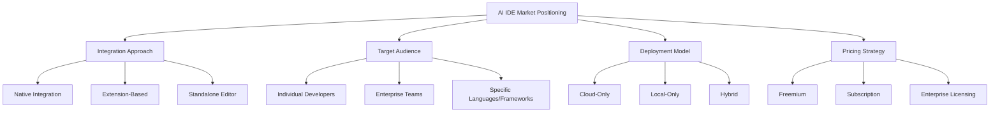
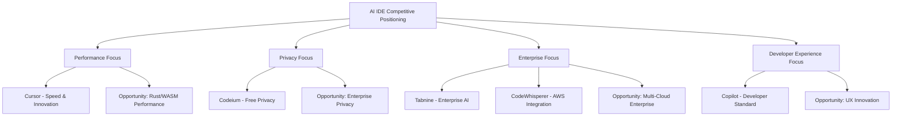

# AI IDE Competitive Positioning and Differentiation Analysis

## Executive Summary

This document provides a comprehensive competitive analysis of the AI-powered IDE landscape, examining market positioning strategies, competitive differentiation approaches, feature gaps, and opportunities. Based on analysis of 15+ AI IDEs and development environments, we identify strategic positioning frameworks and differentiation opportunities for AI-powered IDE development.

## Research Methodology

### Analysis Framework
- **Market Positioning**: How AI IDEs position themselves in the developer tools market
- **Competitive Differentiation**: Unique value propositions and feature sets
- **User Segmentation**: Target audiences and use case specialization
- **Business Models**: Pricing strategies and monetization approaches
- **Feature Gap Analysis**: Unmet needs and market opportunities

### Evaluation Criteria
- **Market Share**: Adoption metrics and user base size
- **Feature Completeness**: Breadth and depth of AI capabilities
- **User Satisfaction**: Developer feedback and retention metrics
- **Technical Innovation**: Novel approaches and technological advantages
- **Business Sustainability**: Revenue models and growth trajectories

## Competitive Landscape Overview

### Market Segmentation

#### Tier 1: Market Leaders
**Characteristics**: Large user bases, comprehensive feature sets, strong brand recognition

**Players**:
- **GitHub Copilot**: 1M+ paid users, Microsoft ecosystem integration
- **Cursor**: 100K+ users, AI-first editor approach
- **Tabnine**: 1M+ users, enterprise focus with hybrid deployment
- **JetBrains AI Assistant**: Deep IDE integration, professional developer focus

#### Tier 2: Specialized Players
**Characteristics**: Focused on specific niches or unique approaches

**Players**:
- **Codeium**: Free alternative with privacy focus
- **Amazon CodeWhisperer**: AWS ecosystem integration
- **Sourcegraph Cody**: Code intelligence and search integration
- **Replit Ghostwriter**: Browser-based development focus

#### Tier 3: Emerging Solutions
**Characteristics**: New entrants with innovative approaches or specific use cases

**Players**:
- **Continue.dev**: Open-source, local model focus
- **Zed**: Performance-first with AI integration
- **Aider**: Command-line AI pair programming
- **Various VS Code extensions**: Specialized AI tools

### Market Positioning Matrix



## Detailed Competitive Analysis

### 1. GitHub Copilot
**Market Position**: AI pair programming standard

#### Positioning Strategy
- **Primary Message**: "Your AI pair programmer"
- **Target Audience**: Professional developers across all languages
- **Key Differentiators**: 
  - First-mover advantage in AI code completion
  - Deep GitHub integration and code training data
  - Microsoft ecosystem integration (VS Code, Visual Studio, GitHub)
  - High-quality completions from specialized Codex model

#### Competitive Advantages
```json
{
  "positioning_strengths": {
    "brand_recognition": "Established as AI coding standard",
    "ecosystem_integration": "Seamless Microsoft/GitHub workflow",
    "model_quality": "Purpose-built Codex model for code",
    "developer_adoption": "1M+ paid subscribers",
    "enterprise_features": "Admin controls, usage analytics, compliance"
  },
  "market_differentiation": {
    "training_data": "Massive GitHub repository training corpus",
    "integration_depth": "Native VS Code and GitHub integration",
    "enterprise_readiness": "SOC 2, GDPR compliance, audit logs",
    "multi_language": "Support for 12+ programming languages",
    "context_awareness": "Repository-wide context understanding"
  }
}
```

#### Competitive Vulnerabilities
- **Pricing**: $10/month individual, $19/month business (premium pricing)
- **Vendor Lock-in**: Tied to Microsoft ecosystem
- **Privacy Concerns**: Code sent to OpenAI servers
- **Limited Customization**: Cannot train on private codebases
- **Feature Scope**: Primarily focused on code completion

#### Business Model Analysis
```json
{
  "revenue_model": "subscription_based",
  "pricing_tiers": {
    "individual": "$10/month",
    "business": "$19/month_per_user",
    "enterprise": "custom_pricing"
  },
  "monetization_strategy": {
    "primary": "subscription_revenue",
    "secondary": "github_ecosystem_lock_in",
    "enterprise": "volume_licensing_and_support"
  },
  "growth_metrics": {
    "user_base": "1M+ paid subscribers",
    "revenue_run_rate": "$100M+ annually (estimated)",
    "market_penetration": "~15% of professional developers"
  }
}
```

### 2. Cursor
**Market Position**: AI-first code editor

#### Positioning Strategy
- **Primary Message**: "The AI-first code editor"
- **Target Audience**: AI-forward developers, early adopters, productivity-focused teams
- **Key Differentiators**:
  - Built from ground up for AI integration
  - Multiple AI provider support (Claude, GPT-4, local models)
  - Advanced context management and conversation interface
  - Performance optimization for AI workflows

#### Competitive Advantages
```json
{
  "positioning_strengths": {
    "ai_native_design": "Editor designed specifically for AI workflows",
    "provider_flexibility": "Support for multiple AI providers",
    "advanced_context": "Sophisticated context management and selection",
    "performance_focus": "Optimized for AI interaction responsiveness",
    "innovation_speed": "Rapid feature development and AI integration"
  },
  "market_differentiation": {
    "multi_provider": "Claude, GPT-4, Codestral, local model support",
    "context_intelligence": "Smart file selection and context optimization",
    "conversation_ui": "Advanced chat interface with code understanding",
    "performance_optimization": "Sub-200ms completion response times",
    "workflow_integration": "AI features integrated into every aspect"
  }
}
```

#### Competitive Vulnerabilities
- **Market Share**: Smaller user base compared to established players
- **Ecosystem**: Limited extension ecosystem compared to VS Code
- **Enterprise Features**: Less mature enterprise and compliance features
- **Learning Curve**: New interface requires developer adaptation
- **Stability**: Newer product with potential stability concerns

#### Business Model Analysis
```json
{
  "revenue_model": "freemium_subscription",
  "pricing_tiers": {
    "free": "limited_usage",
    "pro": "$20/month",
    "business": "$40/month_per_user"
  },
  "monetization_strategy": {
    "primary": "pro_subscription_conversion",
    "secondary": "business_team_licensing",
    "future": "enterprise_and_api_access"
  },
  "growth_metrics": {
    "user_base": "100K+ users (estimated)",
    "conversion_rate": "~10% free to paid",
    "market_position": "fastest_growing_ai_editor"
  }
}
```

### 3. Tabnine
**Market Position**: Enterprise AI code completion

#### Positioning Strategy
- **Primary Message**: "AI assistant for software developers"
- **Target Audience**: Enterprise development teams, privacy-conscious organizations
- **Key Differentiators**:
  - Hybrid cloud/local deployment options
  - Team learning and custom model training
  - Strong privacy and compliance features
  - Multi-IDE support (VS Code, IntelliJ, Vim, etc.)

#### Competitive Advantages
```json
{
  "positioning_strengths": {
    "enterprise_focus": "Built for enterprise security and compliance",
    "deployment_flexibility": "Cloud, local, or hybrid deployment options",
    "privacy_protection": "Code never leaves organization in local mode",
    "team_learning": "Custom models trained on team codebases",
    "multi_ide_support": "Works across 15+ IDEs and editors"
  },
  "market_differentiation": {
    "local_deployment": "On-premise AI models for maximum privacy",
    "custom_training": "Team-specific model training and adaptation",
    "compliance_ready": "SOC 2, GDPR, HIPAA compliance options",
    "ide_agnostic": "Consistent experience across development environments",
    "enterprise_analytics": "Usage analytics and productivity metrics"
  }
}
```

#### Competitive Vulnerabilities
- **Complexity**: More complex setup and configuration
- **Performance**: Local models may have slower response times
- **Cost**: Higher pricing for enterprise features
- **Feature Breadth**: Less comprehensive than newer AI-first solutions
- **Innovation Speed**: Slower to adopt latest AI capabilities

#### Business Model Analysis
```json
{
  "revenue_model": "tiered_subscription",
  "pricing_tiers": {
    "starter": "free_limited",
    "pro": "$12/month",
    "enterprise": "$39/month_per_user"
  },
  "monetization_strategy": {
    "primary": "enterprise_team_licensing",
    "secondary": "professional_individual_subscriptions",
    "premium": "custom_model_training_services"
  },
  "growth_metrics": {
    "user_base": "1M+ developers",
    "enterprise_customers": "500+ companies",
    "market_focus": "enterprise_and_team_productivity"
  }
}
```

### 4. Codeium
**Market Position**: Free AI code completion alternative

#### Positioning Strategy
- **Primary Message**: "Free AI-powered toolkit for developers"
- **Target Audience**: Individual developers, students, cost-conscious teams
- **Key Differentiators**:
  - Completely free tier with generous usage limits
  - Privacy-focused approach with optional data encryption
  - Multi-language support (70+ languages)
  - Fast performance with optimized inference

#### Competitive Advantages
```json
{
  "positioning_strengths": {
    "free_access": "Generous free tier with no usage limits",
    "privacy_focus": "Optional encryption and data protection",
    "performance_optimization": "Fast response times and low latency",
    "language_breadth": "Support for 70+ programming languages",
    "accessibility": "Low barrier to entry for all developers"
  },
  "market_differentiation": {
    "pricing_model": "Free tier competitive with paid alternatives",
    "privacy_options": "Client-side encryption for sensitive code",
    "optimization_focus": "Performance-first architecture",
    "inclusive_approach": "Accessible to developers regardless of budget",
    "rapid_iteration": "Fast feature development and model updates"
  }
}
```

#### Competitive Vulnerabilities
- **Monetization**: Unclear long-term revenue sustainability
- **Enterprise Features**: Limited enterprise and team collaboration features
- **Model Quality**: May have lower quality than premium alternatives
- **Support**: Limited customer support for free users
- **Feature Depth**: Less comprehensive than paid solutions

#### Business Model Analysis
```json
{
  "revenue_model": "freemium_with_enterprise",
  "pricing_tiers": {
    "individual": "free_unlimited",
    "teams": "$12/month_per_user",
    "enterprise": "custom_pricing"
  },
  "monetization_strategy": {
    "primary": "enterprise_conversion_from_free_users",
    "secondary": "team_collaboration_features",
    "future": "api_access_and_custom_deployments"
  },
  "growth_metrics": {
    "user_base": "500K+ developers (estimated)",
    "conversion_focus": "free_to_enterprise_pipeline",
    "market_strategy": "land_and_expand_through_free_tier"
  }
}
```

### 5. Amazon CodeWhisperer
**Market Position**: AWS-integrated AI assistant

#### Positioning Strategy
- **Primary Message**: "AI coding companion built for AWS"
- **Target Audience**: AWS developers, cloud-native teams, enterprise AWS customers
- **Key Differentiators**:
  - Deep AWS service integration and context awareness
  - Built-in security scanning and vulnerability detection
  - Free tier for individual developers
  - Optimized for AWS SDK and cloud development patterns

#### Competitive Advantages
```json
{
  "positioning_strengths": {
    "aws_integration": "Native understanding of AWS services and patterns",
    "security_focus": "Built-in vulnerability scanning and compliance",
    "cloud_optimization": "Optimized for cloud-native development",
    "enterprise_ready": "Integrated with AWS enterprise tools",
    "cost_effective": "Free tier for individual developers"
  },
  "market_differentiation": {
    "service_awareness": "Context-aware AWS service recommendations",
    "security_scanning": "Real-time vulnerability and compliance checking",
    "infrastructure_code": "CloudFormation and CDK optimization",
    "aws_ecosystem": "Seamless integration with AWS development tools",
    "compliance_built_in": "AWS compliance and governance integration"
  }
}
```

#### Competitive Vulnerabilities
- **Ecosystem Lock-in**: Limited value outside AWS ecosystem
- **Feature Breadth**: Narrower focus compared to general-purpose solutions
- **Innovation Speed**: Slower feature development compared to startups
- **Customization**: Limited customization options
- **Multi-Cloud**: Poor support for multi-cloud development

#### Business Model Analysis
```json
{
  "revenue_model": "aws_ecosystem_integration",
  "pricing_tiers": {
    "individual": "free",
    "professional": "$19/month",
    "enterprise": "included_with_aws_support"
  },
  "monetization_strategy": {
    "primary": "aws_service_consumption_increase",
    "secondary": "professional_developer_subscriptions",
    "strategic": "aws_ecosystem_lock_in_and_expansion"
  },
  "growth_metrics": {
    "integration_with": "aws_developer_ecosystem",
    "value_proposition": "increased_aws_service_adoption",
    "market_strategy": "aws_customer_retention_and_expansion"
  }
}
```

## Feature Gap Analysis and Market Opportunities

### Current Market Gaps

#### 1. Local-First AI Development
**Gap Description**: Limited high-quality local AI solutions for privacy-conscious developers

**Market Opportunity**:
- **Target Audience**: Privacy-focused developers, regulated industries, offline development
- **Technical Requirements**: Efficient local model deployment, offline functionality
- **Business Opportunity**: $50M+ market for privacy-first AI development tools

**Competitive Landscape**:
```json
{
  "current_solutions": {
    "continue_dev": "Open source but limited features",
    "tabnine_local": "Enterprise-only, complex setup",
    "ollama_integrations": "Manual setup, limited IDE integration"
  },
  "opportunity_size": {
    "regulated_industries": "Healthcare, finance, government sectors",
    "privacy_conscious": "European developers, security-focused teams",
    "offline_development": "Remote locations, air-gapped environments"
  },
  "technical_challenges": {
    "model_efficiency": "Balancing model size with quality",
    "hardware_requirements": "Optimizing for consumer hardware",
    "update_mechanisms": "Offline model updates and improvements"
  }
}
```

#### 2. Multi-Modal AI Integration
**Gap Description**: Limited integration of non-text AI capabilities (voice, visual, etc.)

**Market Opportunity**:
- **Target Audience**: Accessibility-focused developers, mobile developers, UI/UX teams
- **Technical Requirements**: Voice coding, visual design assistance, multi-modal context
- **Business Opportunity**: $30M+ market for accessibility and multi-modal development

**Competitive Landscape**:
```json
{
  "current_solutions": {
    "voice_coding": "Limited to basic dictation tools",
    "visual_ai": "Separate tools not integrated with IDEs",
    "accessibility": "Basic screen reader support only"
  },
  "opportunity_areas": {
    "voice_programming": "Natural language to code conversion",
    "visual_design": "AI-assisted UI/UX design in IDEs",
    "accessibility": "AI-powered accessibility testing and fixes",
    "mobile_development": "Visual app design with AI assistance"
  },
  "technical_requirements": {
    "real_time_processing": "Low-latency voice and visual processing",
    "context_integration": "Multi-modal context understanding",
    "accessibility_apis": "Integration with platform accessibility features"
  }
}
```

#### 3. Collaborative AI Development
**Gap Description**: Limited real-time collaborative AI features for team development

**Market Opportunity**:
- **Target Audience**: Remote development teams, pair programming, code review teams
- **Technical Requirements**: Real-time AI collaboration, shared context, team learning
- **Business Opportunity**: $40M+ market for collaborative development tools

**Competitive Landscape**:
```json
{
  "current_solutions": {
    "individual_focus": "Most AI tools designed for individual use",
    "limited_sharing": "Basic conversation sharing, no real-time collaboration",
    "team_learning": "Only Tabnine offers team-specific model training"
  },
  "opportunity_areas": {
    "real_time_collaboration": "Shared AI context during pair programming",
    "team_knowledge": "AI trained on team coding patterns and decisions",
    "code_review_ai": "AI-assisted collaborative code review",
    "knowledge_sharing": "AI-powered team knowledge management"
  },
  "technical_challenges": {
    "real_time_sync": "Synchronizing AI context across team members",
    "privacy_balance": "Sharing context while maintaining privacy",
    "conflict_resolution": "Handling conflicting AI suggestions in collaboration"
  }
}
```

#### 4. Domain-Specific AI Specialization
**Gap Description**: Limited AI tools specialized for specific development domains

**Market Opportunity**:
- **Target Audience**: Game developers, embedded systems, data science, web3/blockchain
- **Technical Requirements**: Domain-specific models, specialized toolchains, industry knowledge
- **Business Opportunity**: $60M+ market across specialized development domains

**Competitive Landscape**:
```json
{
  "current_solutions": {
    "general_purpose": "Most AI tools are general-purpose code assistants",
    "limited_specialization": "Some language-specific features but no domain focus",
    "manual_customization": "Developers must manually adapt general tools"
  },
  "opportunity_domains": {
    "game_development": "Unity/Unreal-specific AI assistance",
    "embedded_systems": "Hardware-aware code optimization",
    "data_science": "ML/AI pipeline development assistance",
    "web3_blockchain": "Smart contract development and security",
    "mobile_development": "Platform-specific optimization and design"
  },
  "specialization_requirements": {
    "domain_models": "AI models trained on domain-specific code",
    "toolchain_integration": "Integration with specialized development tools",
    "industry_knowledge": "Understanding of domain-specific best practices"
  }
}
```

### Emerging Trends and Future Opportunities

#### 1. AI-Powered DevOps Integration
**Trend**: Integration of AI coding assistance with DevOps and deployment workflows

**Opportunity Areas**:
- Infrastructure as Code (IaC) generation and optimization
- CI/CD pipeline creation and debugging
- Performance monitoring and optimization suggestions
- Security vulnerability detection and remediation

#### 2. Natural Language Programming
**Trend**: Evolution toward natural language specification of software requirements

**Opportunity Areas**:
- Requirements to code generation
- Natural language debugging and error explanation
- Documentation generation from code and vice versa
- Test case generation from natural language specifications

#### 3. AI-Assisted Architecture Design
**Trend**: AI tools for high-level software architecture and system design

**Opportunity Areas**:
- System architecture recommendation and validation
- Design pattern suggestion and implementation
- Performance and scalability analysis
- Technology stack recommendation based on requirements

## Strategic Positioning Recommendations

### Positioning Framework for New Entrants

#### 1. Differentiation Strategies

**Performance-First Positioning**:
```json
{
  "positioning_statement": "The fastest AI coding assistant built for performance",
  "target_audience": "Performance-conscious developers, large codebase teams",
  "key_differentiators": [
    "Sub-100ms response times",
    "Minimal memory footprint",
    "Optimized for large codebases",
    "Efficient local processing"
  ],
  "competitive_advantages": [
    "Rust/WASM implementation for speed",
    "Advanced caching and optimization",
    "Lightweight architecture",
    "Scalable to enterprise codebases"
  ]
}
```

**Privacy-First Positioning**:
```json
{
  "positioning_statement": "AI coding assistance that keeps your code private",
  "target_audience": "Privacy-conscious developers, regulated industries, security teams",
  "key_differentiators": [
    "100% local processing",
    "No code transmission to cloud",
    "Open source transparency",
    "Compliance-ready architecture"
  ],
  "competitive_advantages": [
    "Local model deployment",
    "Encrypted local storage",
    "Audit trail and transparency",
    "Regulatory compliance support"
  ]
}
```

**Developer Experience Positioning**:
```json
{
  "positioning_statement": "AI coding assistant designed for developer happiness",
  "target_audience": "Developer experience focused teams, productivity-oriented developers",
  "key_differentiators": [
    "Intuitive and non-intrusive interface",
    "Seamless workflow integration",
    "Customizable and extensible",
    "Learning and adaptive system"
  ],
  "competitive_advantages": [
    "User-centered design",
    "Minimal cognitive overhead",
    "Flexible customization options",
    "Continuous UX improvement"
  ]
}
```

#### 2. Market Entry Strategies

**Freemium with Premium Features**:
```json
{
  "strategy": "freemium_premium",
  "free_tier": {
    "features": ["Basic code completion", "Limited chat interactions", "Standard response times"],
    "limitations": ["Usage limits", "Basic model quality", "Limited customization"]
  },
  "premium_tier": {
    "features": ["Advanced AI models", "Unlimited usage", "Custom training", "Priority support"],
    "pricing": "$15-25/month per user"
  },
  "enterprise_tier": {
    "features": ["Team collaboration", "Admin controls", "Compliance features", "Custom deployment"],
    "pricing": "Custom enterprise pricing"
  }
}
```

**Niche Specialization Strategy**:
```json
{
  "strategy": "domain_specialization",
  "target_domains": ["Game development", "Embedded systems", "Data science", "Web3/Blockchain"],
  "specialization_approach": {
    "domain_models": "AI models trained specifically on domain code",
    "toolchain_integration": "Deep integration with domain-specific tools",
    "community_focus": "Build strong community in target domain",
    "expert_partnerships": "Partner with domain experts and influencers"
  },
  "monetization": {
    "premium_pricing": "Higher pricing justified by specialization",
    "consulting_services": "Domain-specific consulting and customization",
    "enterprise_focus": "Target enterprises in specific domains"
  }
}
```

### Competitive Positioning Matrix



## Business Model Innovation Opportunities

### 1. Usage-Based Pricing Models
**Opportunity**: Move beyond seat-based licensing to usage-based pricing

**Implementation**:
- Pay per AI interaction or token usage
- Tiered pricing based on feature complexity
- Credits system for flexible usage patterns
- Enterprise volume discounts

**Advantages**:
- More accessible for individual developers
- Scales with actual usage and value
- Reduces barrier to entry
- Aligns pricing with value delivered

### 2. Marketplace and Ecosystem Models
**Opportunity**: Create marketplace for AI models, prompts, and extensions

**Implementation**:
- Third-party AI model integration
- Community-contributed prompts and templates
- Extension marketplace for specialized tools
- Revenue sharing with contributors

**Advantages**:
- Network effects and community growth
- Diversified revenue streams
- Reduced development costs through community
- Increased stickiness and engagement

### 3. API and Platform Models
**Opportunity**: Provide AI coding capabilities as API/platform service

**Implementation**:
- API access to AI coding models
- White-label AI coding solutions
- Integration platform for third-party tools
- Developer platform with SDKs

**Advantages**:
- B2B revenue opportunities
- Platform network effects
- Reduced customer acquisition costs
- Scalable business model

## Key Findings and Strategic Recommendations

### Market Positioning Insights

1. **Performance Gap**: Opportunity for significantly faster AI coding tools using Rust/WASM
2. **Privacy Demand**: Growing market for local-first, privacy-preserving AI tools
3. **Enterprise Needs**: Demand for collaborative AI features and team-specific customization
4. **Specialization Opportunity**: Underserved markets in domain-specific AI development tools
5. **UX Innovation**: Room for significant user experience improvements in AI interaction

### Competitive Differentiation Strategies

1. **Technical Differentiation**: Rust/WASM performance advantage, local-first architecture
2. **User Experience**: Focus on developer happiness and workflow integration
3. **Privacy and Security**: Strong privacy guarantees and compliance features
4. **Customization**: Flexible and extensible platform for diverse developer needs
5. **Community**: Open source approach with strong developer community

### Business Model Recommendations

1. **Freemium Strategy**: Generous free tier to drive adoption, premium features for monetization
2. **Enterprise Focus**: Target enterprise customers with collaboration and compliance features
3. **Platform Approach**: Build ecosystem and marketplace for long-term growth
4. **Performance Premium**: Charge premium for superior performance and user experience
5. **Privacy Value**: Monetize privacy and security features for regulated industries

### Implementation Priorities

1. **Phase 1**: Establish performance and UX differentiation with core AI features
2. **Phase 2**: Build enterprise features and team collaboration capabilities
3. **Phase 3**: Develop marketplace and ecosystem platform
4. **Phase 4**: Expand into specialized domains and vertical markets
5. **Phase 5**: International expansion and enterprise platform growth

This analysis provides strategic guidance for positioning and differentiating AI-powered development tools in the competitive landscape while identifying specific opportunities for innovation and market entry.