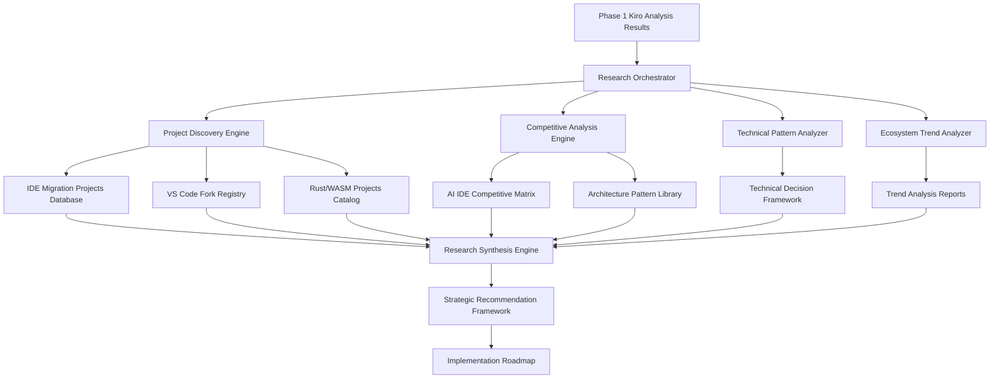

# Design Document: Static Analysis Phase 2 - Deep Research & Ecosystem Analysis

## Overview

This design document outlines the systematic approach for Phase 2: Deep Research & Ecosystem Analysis of IDE transfiguration projects, competitive landscape analysis, and strategic pattern identification. Building on our comprehensive Phase 1 Kiro analysis, this phase will provide evidence-based insights for our Rust/WASM implementation strategy.

## Architecture

### Research Pipeline Architecture



### Research Component Architecture

#### 1. Research Orchestrator
**Purpose**: Coordinate all research activities and manage data collection workflow
- **Input**: Research requirements and methodology specifications
- **Output**: Coordinated research execution and progress tracking
- **Technology**: Python-based research framework with structured data management

#### 2. Project Discovery Engine
**Purpose**: Systematically identify and catalog relevant projects across all research categories
- **Targets**: GitHub repositories, project documentation, technical blogs, conference talks
- **Methods**: API-based discovery, keyword search, network analysis, community recommendations
- **Output**: Comprehensive project database with metadata and classification

#### 3. Competitive Analysis Engine
**Purpose**: Deep-dive analysis of competitive projects and their technical approaches
- **Targets**: AI IDEs, VS Code forks, Rust/WASM applications, migration success stories
- **Methods**: Feature analysis, architecture review, performance benchmarking, user feedback analysis
- **Output**: Competitive intelligence reports with strategic insights

#### 4. Technical Pattern Analyzer
**Purpose**: Extract and categorize proven technical patterns and architectural decisions
- **Targets**: Extension systems, state management, performance optimization, security models
- **Methods**: Code analysis, documentation review, architectural pattern recognition
- **Output**: Pattern library with implementation guidance and trade-off analysis

#### 5. Ecosystem Trend Analyzer
**Purpose**: Identify and analyze trends in development environment evolution
- **Targets**: Technology adoption curves, user preference shifts, market dynamics
- **Methods**: Data analysis, survey research, community sentiment analysis, expert interviews
- **Output**: Trend reports with future scenario planning

## Components and Interfaces

### Research Data Models

#### Project Analysis Schema
```json
{
  "project": {
    "metadata": {
      "name": "string",
      "url": "string",
      "category": "ide_migration|vscode_fork|rust_ide|ai_ide|wasm_app",
      "status": "active|archived|deprecated",
      "last_updated": "date",
      "stars": "number",
      "contributors": "number"
    },
    "technical_details": {
      "source_technology": "electron|native|web",
      "target_technology": "rust|cpp|go|wasm|native",
      "migration_approach": "gradual|complete_rewrite|hybrid",
      "architecture_patterns": ["pattern1", "pattern2"],
      "performance_metrics": {
        "startup_time": "milliseconds",
        "memory_usage": "mb",
        "cpu_usage": "percentage"
      }
    },
    "analysis": {
      "strengths": ["strength1", "strength2"],
      "weaknesses": ["weakness1", "weakness2"],
      "lessons_learned": ["lesson1", "lesson2"],
      "applicability_to_kiro": "high|medium|low",
      "confidence_level": "high|medium|low"
    }
  }
}
```

#### Competitive Analysis Schema
```json
{
  "competitive_analysis": {
    "ai_integration": {
      "approach": "embedded|plugin|cloud_native",
      "providers": ["anthropic", "openai", "local"],
      "features": ["code_completion", "chat", "refactoring"],
      "performance": {
        "response_time": "milliseconds",
        "context_size": "tokens",
        "accuracy": "percentage"
      }
    },
    "extension_system": {
      "compatibility": "vscode|custom|hybrid",
      "marketplace": "microsoft|open_vsx|custom",
      "security_model": "sandboxed|trusted|mixed",
      "api_surface": "full|limited|extended"
    },
    "business_model": {
      "pricing": "free|freemium|subscription|enterprise",
      "monetization": ["subscriptions", "marketplace", "services"],
      "sustainability": "vc_funded|profitable|community"
    }
  }
}
```

#### Technical Pattern Schema
```json
{
  "technical_pattern": {
    "category": "extension_system|state_management|performance|security",
    "name": "string",
    "description": "string",
    "implementation": {
      "technology": "rust|javascript|wasm|native",
      "complexity": "low|medium|high",
      "maintenance_burden": "low|medium|high",
      "performance_impact": "positive|neutral|negative"
    },
    "trade_offs": {
      "pros": ["pro1", "pro2"],
      "cons": ["con1", "con2"],
      "use_cases": ["case1", "case2"]
    },
    "examples": [
      {
        "project": "string",
        "implementation_details": "string",
        "outcomes": "string"
      }
    ]
  }
}
```

### Research Methodology Framework

#### Systematic Project Evaluation
```python
class ProjectEvaluator:
    def __init__(self, evaluation_criteria):
        self.criteria = evaluation_criteria
        
    def evaluate_project(self, project_data):
        """Systematic evaluation using standardized criteria"""
        return {
            "technical_score": self.evaluate_technical_aspects(project_data),
            "adoption_score": self.evaluate_adoption_metrics(project_data),
            "sustainability_score": self.evaluate_sustainability(project_data),
            "relevance_score": self.evaluate_kiro_relevance(project_data),
            "overall_score": self.calculate_weighted_score(scores)
        }
    
    def generate_insights(self, evaluation_results):
        """Extract actionable insights from evaluation"""
        return {
            "key_patterns": self.identify_patterns(evaluation_results),
            "success_factors": self.extract_success_factors(evaluation_results),
            "risk_factors": self.identify_risks(evaluation_results),
            "recommendations": self.generate_recommendations(evaluation_results)
        }
```

#### Data Collection Framework
```python
class ResearchDataCollector:
    def __init__(self, sources_config):
        self.github_api = GitHubAPI()
        self.web_scraper = WebScraper()
        self.documentation_parser = DocumentationParser()
        
    def collect_project_data(self, project_url):
        """Comprehensive data collection for a project"""
        return {
            "repository_data": self.github_api.get_repo_data(project_url),
            "documentation": self.documentation_parser.extract_docs(project_url),
            "community_data": self.collect_community_metrics(project_url),
            "technical_analysis": self.analyze_codebase(project_url),
            "performance_data": self.collect_performance_metrics(project_url)
        }
    
    def validate_data_quality(self, collected_data):
        """Ensure data quality and completeness"""
        return {
            "completeness_score": self.calculate_completeness(collected_data),
            "accuracy_indicators": self.validate_accuracy(collected_data),
            "source_reliability": self.assess_source_reliability(collected_data),
            "data_freshness": self.check_data_freshness(collected_data)
        }
```

## Research Execution Strategy

### Phase 2.1: Project Discovery and Cataloging (Week 1-2)

#### IDE Migration Projects Research
- **Electron to Native Migrations**: Systematic search for successful migration projects
- **Performance Improvement Documentation**: Collect before/after performance metrics
- **Migration Strategy Analysis**: Document gradual vs. complete rewrite approaches
- **Technical Challenge Documentation**: Common obstacles and solution patterns

#### VS Code Fork Analysis
- **Major Fork Identification**: Comprehensive catalog of significant VS Code forks
- **Customization Pattern Analysis**: How forks differentiate from base VS Code
- **Extension Ecosystem Handling**: Marketplace strategies and compatibility approaches
- **Business Model Documentation**: Monetization and sustainability strategies

### Phase 2.2: Technical Deep-Dive Analysis (Week 2-3)

#### Rust/WASM Implementation Research
- **Rust IDE Architecture Analysis**: Study native Rust development environments
- **WASM Application Performance**: Benchmark successful WASM-based tools
- **Interop Pattern Documentation**: Proven Rust-JavaScript integration approaches
- **Toolchain Analysis**: Build systems and development workflows

#### AI Integration Pattern Analysis
- **Competitive AI IDE Analysis**: Feature comparison and technical approaches
- **Integration Architecture Study**: How AI is embedded in development workflows
- **Performance Characteristic Analysis**: Response times, resource usage, scalability
- **User Experience Pattern Documentation**: Interaction models and interface designs

### Phase 2.3: Pattern Recognition and Synthesis (Week 3-4)

#### Technical Pattern Extraction
- **Extension System Patterns**: Security models, API designs, plugin architectures
- **State Management Approaches**: Proven patterns for complex application state
- **Performance Optimization Techniques**: Validated optimization strategies
- **Cross-Platform Consistency**: Approaches for maintaining platform consistency

#### Success Factor Identification
- **Migration Success Patterns**: Common characteristics of successful projects
- **Failure Mode Analysis**: Common pitfalls and how to avoid them
- **Timeline and Resource Analysis**: Realistic estimates based on comparable projects
- **Risk Mitigation Strategies**: Proven approaches for managing migration risks

### Phase 2.4: Strategic Synthesis and Recommendations (Week 4-5)

#### Evidence-Based Decision Framework
- **Technology Choice Recommendations**: Rust/WASM implementation approaches
- **Migration Strategy Recommendations**: Proven migration patterns for our context
- **Architecture Pattern Recommendations**: Validated architectural approaches
- **Risk Assessment and Mitigation**: Comprehensive risk analysis with mitigation strategies

#### Implementation Roadmap Development
- **Phase Planning**: Detailed implementation phases based on research insights
- **Resource Requirements**: Team size and skill requirements based on comparable projects
- **Timeline Estimates**: Realistic timeline based on similar project data
- **Success Metrics**: Clear criteria for measuring implementation success

## Data Management and Quality Assurance

### Research Data Infrastructure

#### Structured Data Storage
```
research_data/
├── projects/
│   ├── ide_migrations/
│   │   ├── project_catalog.json
│   │   ├── technical_analysis/
│   │   └── performance_data/
│   ├── vscode_forks/
│   │   ├── fork_registry.json
│   │   ├── customization_patterns/
│   │   └── business_models/
│   ├── rust_ides/
│   │   ├── rust_projects.json
│   │   ├── architecture_analysis/
│   │   └── performance_benchmarks/
│   └── ai_ides/
│       ├── competitive_matrix.json
│       ├── feature_analysis/
│       └── integration_patterns/
├── patterns/
│   ├── technical_patterns.json
│   ├── success_factors.json
│   ├── failure_modes.json
│   └── best_practices.json
├── analysis/
│   ├── synthesis_reports/
│   ├── trend_analysis/
│   ├── competitive_intelligence/
│   └── strategic_recommendations/
└── validation/
    ├── source_verification/
    ├── peer_review/
    ├── bias_assessment/
    └── completeness_validation/
```

#### Quality Assurance Framework
- **Source Verification**: All claims backed by verifiable primary sources
- **Peer Review Process**: Multi-perspective validation of research conclusions
- **Bias Detection and Mitigation**: Systematic identification of research bias
- **Completeness Validation**: Comprehensive coverage verification
- **Accuracy Cross-Validation**: Multiple source verification for technical claims

### Research Validation Methodology

#### Multi-Source Verification
```python
class ResearchValidator:
    def __init__(self):
        self.source_reliability_scores = {}
        self.cross_reference_database = {}
        
    def verify_claim(self, claim, sources):
        """Verify research claims against multiple sources"""
        return {
            "claim_confidence": self.calculate_confidence(claim, sources),
            "source_reliability": self.assess_source_reliability(sources),
            "cross_references": self.find_cross_references(claim),
            "verification_status": self.determine_verification_status(claim, sources)
        }
    
    def detect_bias(self, research_data):
        """Systematic bias detection in research findings"""
        return {
            "selection_bias": self.check_selection_bias(research_data),
            "confirmation_bias": self.check_confirmation_bias(research_data),
            "temporal_bias": self.check_temporal_bias(research_data),
            "source_bias": self.check_source_bias(research_data)
        }
```

## Integration with Kiro Analysis

### Baseline Integration Strategy

#### Kiro Analysis Reference Framework
- **Configuration Comparison**: Compare Kiro's configuration patterns with discovered projects
- **API Surface Validation**: Validate our API compatibility approach against successful forks
- **UI Pattern Verification**: Cross-reference Kiro's UI patterns with proven approaches
- **Performance Baseline**: Use Kiro's current performance as baseline for improvement targets

#### Research-Informed Architecture Decisions
- **Extension System Design**: Apply proven extension patterns to our Rust/WASM implementation
- **AI Integration Strategy**: Leverage successful AI integration patterns for our architecture
- **Migration Approach**: Choose migration strategy based on comparable project outcomes
- **Performance Optimization**: Apply validated optimization techniques to our implementation

### Decision Support Integration

#### Evidence-Based Architecture Planning
```python
class ArchitectureDecisionSupport:
    def __init__(self, kiro_analysis, research_data):
        self.kiro_baseline = kiro_analysis
        self.research_insights = research_data
        
    def recommend_architecture_approach(self, decision_context):
        """Generate architecture recommendations based on research"""
        return {
            "recommended_approach": self.analyze_best_fit(decision_context),
            "supporting_evidence": self.gather_supporting_evidence(decision_context),
            "risk_assessment": self.assess_risks(decision_context),
            "implementation_guidance": self.generate_implementation_guidance(decision_context)
        }
    
    def validate_against_kiro_requirements(self, architecture_proposal):
        """Ensure architecture meets Kiro's specific requirements"""
        return {
            "compatibility_assessment": self.check_kiro_compatibility(architecture_proposal),
            "performance_projection": self.project_performance_impact(architecture_proposal),
            "migration_complexity": self.assess_migration_complexity(architecture_proposal),
            "risk_mitigation": self.identify_risk_mitigation(architecture_proposal)
        }
```

## Deliverables and Outputs

### Primary Research Deliverables

#### 1. Comprehensive Project Database
- **IDE Migration Projects**: Complete catalog with technical analysis and outcomes
- **VS Code Fork Registry**: Detailed analysis of customization strategies and business models
- **Rust/WASM Project Catalog**: Architecture patterns and performance characteristics
- **AI IDE Competitive Matrix**: Feature comparison and technical differentiation analysis

#### 2. Technical Pattern Library
- **Proven Architecture Patterns**: Validated approaches with implementation guidance
- **Success Factor Documentation**: Common characteristics of successful projects
- **Failure Mode Analysis**: Pitfalls to avoid with mitigation strategies
- **Best Practice Guidelines**: Evidence-based recommendations for implementation

#### 3. Strategic Analysis Reports
- **Competitive Intelligence**: Market positioning and differentiation opportunities
- **Technology Trend Analysis**: Future direction insights and adoption projections
- **Risk Assessment**: Comprehensive risk analysis with mitigation strategies
- **Implementation Roadmap**: Evidence-based timeline and resource requirements

#### 4. Decision Support Framework
- **Architecture Decision Matrix**: Structured approach for technical choices
- **Migration Strategy Recommendations**: Proven approaches applicable to Kiro
- **Performance Optimization Guide**: Validated techniques for Rust/WASM implementation
- **Success Metrics Framework**: Clear criteria for measuring implementation success

### Integration Outputs

#### Research-Informed Architecture Specification
- **Extension System Design**: Based on proven patterns from successful projects
- **AI Integration Architecture**: Leveraging best practices from competitive analysis
- **Performance Optimization Strategy**: Validated techniques for Rust/WASM implementation
- **Migration Approach**: Evidence-based strategy for Electron to Rust/WASM transition

#### Implementation Planning Documents
- **Detailed Project Timeline**: Based on comparable project data and complexity analysis
- **Resource Requirements**: Team composition and skill requirements
- **Risk Mitigation Plan**: Comprehensive risk management based on lessons learned
- **Quality Assurance Strategy**: Testing and validation approaches proven in similar projects

This design provides a systematic, evidence-based approach to understanding the ecosystem and making informed decisions for our Kiro Rust/WASM transfiguration project.