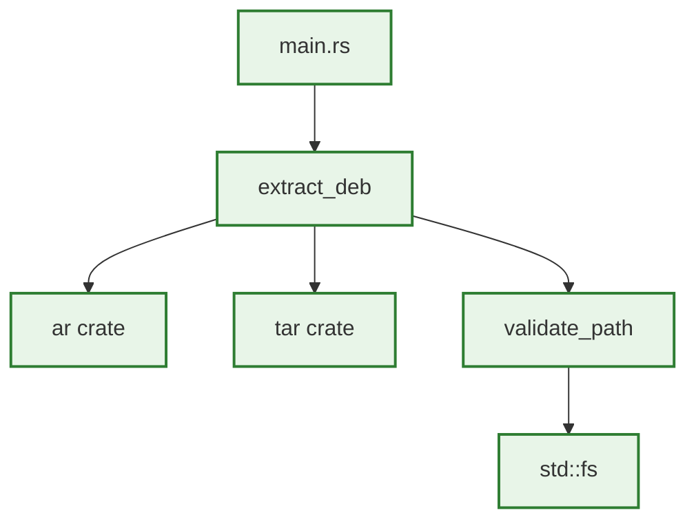

# Design Document

## Overview

This design document outlines a minimal Rust CLI tool to safely extract .deb files. The design follows TDD-first principles with executable specifications and focuses on the core MVP functionality: safe extraction with basic path traversal protection.

**Design Philosophy**: Test-driven development with executable contracts. Start simple, prove it works, then iterate.

## Architecture

### MVP Architecture (Single Crate)



**MVP Approach**: Single binary crate with minimal dependencies. Prove the core concept works before adding complexity.

## Components and Interfaces

### Core Functions (MVP)

#### 1. Main Entry Point
```rust
/// Extract .deb file to output directory
/// 
/// # Contract
/// - Precondition: input_path exists and is readable
/// - Postcondition: All safe files extracted to output_dir
/// - Error: Returns ExtractionError for any failure
fn extract_deb(input_path: &Path, output_dir: &Path) -> Result<(), ExtractionError>;
```

#### 2. Path Validation
```rust
/// Validate extraction path is safe
/// 
/// # Contract  
/// - Precondition: path is valid UTF-8
/// - Postcondition: Returns sanitized path within base_dir
/// - Error: Returns PathError for traversal attempts
fn validate_path(path: &str, base_dir: &Path) -> Result<PathBuf, PathError>;
```

#### 3. CLI Interface
```rust
use clap::Parser;

#[derive(Parser)]
#[command(about = "Extract .deb files safely")]
struct Args {
    /// Input .deb file
    input: PathBuf,
    
    /// Output directory (default: ./extracted)
    #[arg(short, long, default_value = "./extracted")]
    output: PathBuf,
    
    /// Verbose output
    #[arg(short, long)]
    verbose: bool,
}
```

## Data Models

### Minimal Error Types

```rust
use thiserror::Error;

#[derive(Error, Debug)]
pub enum ExtractionError {
    #[error("IO error: {0}")]
    Io(#[from] std::io::Error),
    
    #[error("Path traversal detected: {path}")]
    PathTraversal { path: String },
    
    #[error("Archive format error: {0}")]
    Format(String),
}

#[derive(Error, Debug)]
pub enum PathError {
    #[error("Path contains '..'")]
    Traversal,
    
    #[error("Absolute path not allowed")]
    Absolute,
}
```

## Error Handling

### Simple Error Strategy

- **Fatal Errors**: Path traversal, I/O failures → return error immediately
- **Logging**: Use `println!` for verbose output (no complex logging framework)
- **Recovery**: Fail fast on security issues, continue on individual file errors

## Testing Strategy

### TDD Test Contracts

Following the STUB → RED → GREEN → REFACTOR cycle:

#### Path Validation Contract
```rust
/// Test Contract: validate_path function
/// 
/// WHEN path is "file.txt" and base is "/tmp/safe"
/// THEN system SHALL return Ok("/tmp/safe/file.txt")
/// 
/// WHEN path contains ".." 
/// THEN system SHALL return Err(PathError::Traversal)
/// 
/// WHEN path starts with "/"
/// THEN system SHALL return Err(PathError::Absolute)
#[test]
fn test_path_validation_contract() {
    // Test safe path
    let result = validate_path("file.txt", Path::new("/tmp/safe"));
    assert_eq!(result.unwrap(), Path::new("/tmp/safe/file.txt"));
    
    // Test traversal rejection
    let result = validate_path("../etc/passwd", Path::new("/tmp/safe"));
    assert!(matches!(result, Err(PathError::Traversal)));
    
    // Test absolute path rejection  
    let result = validate_path("/etc/passwd", Path::new("/tmp/safe"));
    assert!(matches!(result, Err(PathError::Absolute)));
}
```

#### Extraction Contract
```rust
/// Test Contract: extract_deb function
/// 
/// WHEN valid .deb file is provided
/// THEN system SHALL extract all files to output directory
/// 
/// WHEN .deb contains malicious paths
/// THEN system SHALL reject dangerous files and continue
#[test]
fn test_extraction_contract() {
    let temp_dir = tempfile::tempdir().unwrap();
    let result = extract_deb(
        Path::new("test_data/simple.deb"), 
        temp_dir.path()
    );
    
    assert!(result.is_ok());
    assert!(temp_dir.path().join("debian-binary").exists());
}
```

## Dependencies

### Minimal Crate Selection

```toml
[dependencies]
clap = { version = "4.0", features = ["derive"] }
ar = "0.9"           # Parse .deb (ar archive)
tar = "0.4"          # Extract tar archives  
flate2 = "1.0"       # Handle gzip compression
thiserror = "1.0"    # Structured errors
```

**Rationale**: Only essential crates for MVP. No async, no complex logging, no streaming optimizations yet.

## Implementation Approach

### TDD Development Cycle

1. **STUB**: Write function signatures with `todo!()`
2. **RED**: Write failing tests for contracts
3. **GREEN**: Implement minimal code to pass tests
4. **REFACTOR**: Clean up while keeping tests green

### MVP Delivery Order

1. Path validation function (security foundation)
2. Basic .deb extraction (ar + tar)
3. CLI interface with clap
4. Integration test with real .deb file
5. Error handling and user feedback

This minimal design focuses on proving the core concept works safely before adding complexity. Each component has clear contracts that can be tested independently.