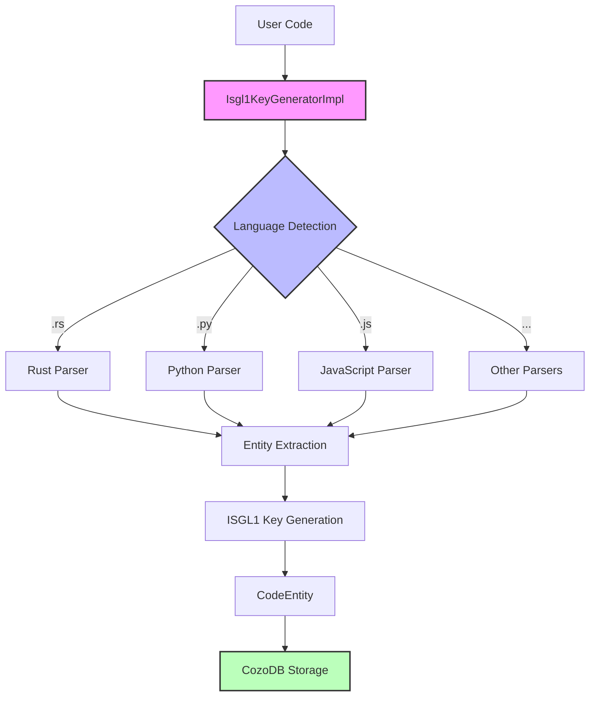
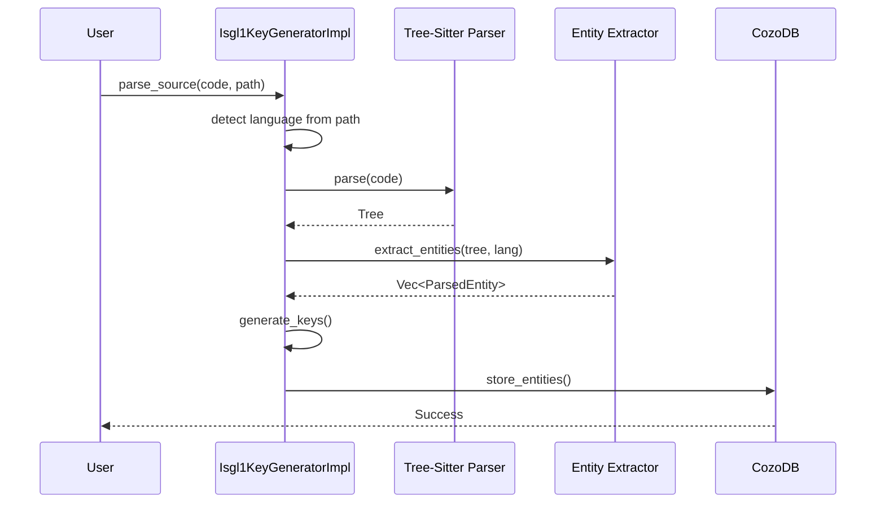

# PRD: Multi-Language Tree-Sitter Support - Parseltongue v0.8.7

**Status**: Active Development
**Version**: 1.0
**Author**: Parseltongue Team
**Date**: 2025-11-02

---

## Executive Summary

### The Problem
Parseltongue v0.8.6 only supports **Rust** code analysis, despite having a `Language` enum declaring 13 languages. This severely limits adoption for polyglot codebases and multi-language AI development workflows.

### The Solution
Enable full parsing support for **13 programming languages** using tree-sitter parsers, following strict TDD principles and maintaining backwards compatibility.

### Success Metrics
- ✅ All 13 languages parse successfully
- ✅ <500ms parsing time per 1K LOC per language
- ✅ 100% test pass rate
- ✅ Zero breaking changes (backwards compatible)
- ✅ Build compiles with zero warnings

---

## 1. Background & Research Findings

### 1.1 Tree-Sitter API Evolution

**Critical Discovery**: Tree-sitter underwent a **breaking API change** between v0.20-0.23 and v0.24+:

| Version | API Style | Grammar Exports | Usage |
|---------|-----------|----------------|-------|
| 0.20-0.23 | Old | `fn language() -> Language` | `parser.set_language(tree_sitter_rust::language())?` |
| 0.24-0.26 | New | `const LANGUAGE: LanguageFn` | `parser.set_language(&tree_sitter_rust::LANGUAGE.into())?` |

**Current Issue**: Our codebase mixes 0.22 core with 0.23+ grammars, causing compilation errors.

**Root Cause**:
```rust
// BROKEN (current code)
init_parser!(Language::Rust, &tree_sitter_rust::LANGUAGE);  // Missing .into()

// CORRECT
init_parser!(Language::Rust, &tree_sitter_rust::LANGUAGE.into());
```

### 1.2 Architecture Analysis

**Current Implementation** (from codebase exploration):
- `Isgl1KeyGeneratorImpl` in `pt01-folder-to-cozodb-streamer/src/isgl1_generator.rs`
  - Uses `HashMap<Language, Arc<Mutex<Parser>>>` pattern
  - Initializes parsers eagerly in `new()`
  - Thread-safe but mutex overhead

- `SimpleSyntaxValidator` in `pt04-syntax-preflight-validator/src/simple_validator.rs`
  - Uses `HashMap<Language, Parser>` pattern
  - Single-threaded, simpler
  - Used for pre-flight validation only

**Design Decision**: Keep both patterns - they serve different purposes.

### 1.3 Language Coverage Status

**Declared (in Language enum)**:
1. ✅ Rust - Working (v0.8.6)
2. ❌ JavaScript - Declared, not implemented
3. ❌ TypeScript - Declared, not implemented
4. ❌ Python - Declared, not implemented
5. ❌ Java - Declared, not implemented
6. ❌ Cpp (C++) - Declared, not implemented
7. ❌ Go - Declared, not implemented
8. ❌ Ruby - Declared, not implemented
9. ❌ Php - Declared, not implemented
10. ❌ CSharp (C#) - Declared, not implemented
11. ❌ Swift - Declared, not implemented
12. ❌ Kotlin - Declared, not implemented
13. ❌ Scala - Declared, not implemented

**Dependency Status**: All grammar crates already added to `Cargo.toml` ✅

---

## 2. Requirements (Executable Specifications)

### 2.1 Functional Requirements

#### REQ-ML-001: Parser Initialization
**WHEN** `Isgl1KeyGeneratorImpl::new()` is called
**THEN** system SHALL initialize parsers for all 13 languages
**AND** SHALL complete in <100ms
**AND** SHALL not panic or return errors

**Test Contract**:
```rust
#[test]
fn test_all_parsers_initialize() {
    let start = Instant::now();
    let generator = Isgl1KeyGeneratorImpl::new();
    let elapsed = start.elapsed();

    // All parsers present
    for lang in ALL_LANGUAGES {
        assert!(generator.parsers.contains_key(&lang));
    }

    // Performance requirement
    assert!(elapsed < Duration::from_millis(100));
}
```

#### REQ-ML-002: Basic Parsing (Per Language)
**WHEN** `parse_source(valid_code, file_path)` is called
**THEN** system SHALL return `Ok((entities, dependencies))`
**AND** entities SHALL contain at least one `ParsedEntity`
**AND** SHALL complete in <500ms per 1K LOC

**Test Contract** (example for Python):
```rust
#[test]
fn test_python_basic_parsing() {
    let code = "def hello(): pass";
    let result = parse_source(Language::Python, code);

    assert!(result.is_ok());
    let (entities, _) = result.unwrap();
    assert!(!entities.is_empty());
    assert_eq!(entities[0].name, "hello");
    assert_eq!(entities[0].entity_type, EntityType::Function);
}
```

#### REQ-ML-003: ISGL1 Key Format Consistency
**WHEN** ISGL1 key is generated for any language
**THEN** key SHALL follow format: `{language}:{type}:{name}:{path}:{start}-{end}`
**AND** SHALL be unique within file
**AND** format SHALL match v0.8.6 Rust keys (backwards compatible)

**Test Contract**:
```rust
#[test]
fn test_isgl1_key_format_all_languages() {
    for lang in ALL_LANGUAGES {
        let entity = create_sample_entity(lang);
        let key = generate_key(&entity).unwrap();

        // Format: language:type:name:path:range
        let parts: Vec<_> = key.split(':').collect();
        assert_eq!(parts.len(), 5);
        assert_eq!(parts[0], lang.to_string());
        assert!(["fn", "struct", "class", "method"].contains(&parts[1]));
        assert!(!parts[2].is_empty()); // name
        assert!(parts[4].contains('-')); // range
    }
}
```

#### REQ-ML-004: Test Function Detection
**WHEN** code contains test functions/methods
**THEN** system SHALL set `metadata["is_test"] = "true"`
**AND** SHALL detect language-specific test patterns:
  - Rust: `#[test]`, `#[cfg(test)]`
  - Python: `@pytest.`, `def test_`, `class Test`
  - JavaScript: `test(`, `it(`, `describe(`
  - Java: `@Test`

**Test Contract**:
```rust
#[test]
fn test_function_detection_all_languages() {
    let test_cases = [
        (Language::Rust, "#[test]\nfn test_foo() {}", "test_foo"),
        (Language::Python, "@pytest.fixture\ndef test_bar(): pass", "test_bar"),
        (Language::JavaScript, "test('baz', () => {})", "baz"),
        (Language::Java, "@Test\npublic void testQux() {}", "testQux"),
    ];

    for (lang, code, expected_name) in test_cases {
        let entities = parse_entities(lang, code);
        let test_entity = entities.iter().find(|e| e.name == expected_name).unwrap();
        assert_eq!(test_entity.metadata.get("is_test"), Some(&"true".to_string()));
    }
}
```

### 2.2 Non-Functional Requirements

#### REQ-ML-005: Performance
- Parser initialization: <100ms total for 13 languages
- Parsing speed: <500ms per 1K LOC per language
- Memory usage: <10MB total for all parsers
- No memory leaks

#### REQ-ML-006: Backwards Compatibility
- Existing Rust parsing behavior unchanged
- ISGL1 key format unchanged
- Database schema unchanged
- No breaking API changes

#### REQ-ML-007: Error Handling
- Graceful degradation for unsupported features
- Clear error messages per language
- No panics during parsing
- Structured errors with context

---

## 3. Technical Design

### 3.1 Architecture Diagram



### 3.2 Component Design

#### 3.2.1 Isgl1KeyGeneratorImpl (Multi-Language)

```rust
pub struct Isgl1KeyGeneratorImpl {
    parsers: HashMap<Language, Arc<Mutex<Parser>>>,
}

impl Isgl1KeyGeneratorImpl {
    pub fn new() -> Self {
        let mut parsers = HashMap::new();

        // Macro to reduce boilerplate
        macro_rules! init_parser {
            ($lang:expr, $grammar:expr) => {
                let mut parser = Parser::new();
                if parser.set_language(&$grammar.into()).is_ok() {
                    parsers.insert($lang, Arc::new(Mutex::new(parser)));
                }
            };
        }

        // Initialize all 13 languages
        init_parser!(Language::Rust, tree_sitter_rust::LANGUAGE);
        init_parser!(Language::Python, tree_sitter_python::LANGUAGE);
        init_parser!(Language::JavaScript, tree_sitter_javascript::LANGUAGE);
        init_parser!(Language::TypeScript, tree_sitter_typescript::LANGUAGE_TYPESCRIPT);
        init_parser!(Language::Go, tree_sitter_go::LANGUAGE);
        init_parser!(Language::Java, tree_sitter_java::LANGUAGE);
        init_parser!(Language::Cpp, tree_sitter_cpp::LANGUAGE);
        init_parser!(Language::Ruby, tree_sitter_ruby::LANGUAGE);
        init_parser!(Language::Php, tree_sitter_php::LANGUAGE_PHP);
        init_parser!(Language::CSharp, tree_sitter_c_sharp::LANGUAGE);
        init_parser!(Language::Swift, tree_sitter_swift::LANGUAGE);
        init_parser!(Language::Kotlin, tree_sitter_kotlin::language());
        init_parser!(Language::Scala, tree_sitter_scala::LANGUAGE);

        Self { parsers }
    }
}
```

**Key Change**: Added `.into()` to convert `LanguageFn` → `Language`

#### 3.2.2 Per-Language Entity Extraction

```rust
impl Isgl1KeyGeneratorImpl {
    fn extract_entities(
        &self,
        tree: &Tree,
        source: &str,
        file_path: &Path,
        language: Language,
        entities: &mut Vec<ParsedEntity>,
        dependencies: &mut Vec<DependencyEdge>,
    ) {
        match language {
            Language::Rust => self.extract_rust_entities(...),
            Language::Python => self.extract_python_entities(...),
            Language::JavaScript => self.extract_javascript_entities(...),
            // ... etc for all languages
        }
    }

    fn extract_python_entities(...) {
        // Python-specific extraction logic
        match node.kind() {
            "function_definition" => { /* extract function */ },
            "class_definition" => { /* extract class */ },
            "decorated_definition" => { /* check for @pytest, @test */ },
            _ => {},
        }
    }
}
```

### 3.3 Language-Specific Patterns

#### Python
**Entities to Extract**:
- Functions: `function_definition` node
- Classes: `class_definition` node
- Methods: `function_definition` inside `class_definition`

**Test Detection**:
- Decorators: `@pytest.fixture`, `@pytest.mark.*`
- Naming: `def test_*`, `class Test*`

**Example Tree-Sitter AST**:
```
function_definition
  name: identifier "test_foo"
  parameters: parameters
  body: block
```

#### JavaScript/TypeScript
**Entities to Extract**:
- Functions: `function_declaration`, `arrow_function`, `function_expression`
- Classes: `class_declaration`
- Methods: `method_definition`

**Test Detection**:
- Jest: `test(`, `it(`, `describe(`
- Mocha: `describe(`, `it(`

#### Java
**Entities to Extract**:
- Classes: `class_declaration`
- Methods: `method_declaration`
- Interfaces: `interface_declaration`

**Test Detection**:
- JUnit: `@Test`, `@Before`, `@After`
- TestNG: `@Test(groups=...)`

### 3.4 Data Flow Diagram



---

## 4. Implementation Plan (TDD-First)

### 4.1 Phase 1: Fix Build (Day 1)

**Objective**: Get existing code compiling again

**Steps**:
1. ✅ Research tree-sitter API (DONE via agent)
2. Fix `isgl1_generator.rs` lines 79-91: Add `.into()`
3. Fix `simple_validator.rs` lines 63-75: Add `.into()`
4. Verify: `cargo check`

**Tests** (write FIRST):
```rust
// File: tests/tree_sitter_api_compatibility_test.rs
#[test]
fn test_rust_parser_still_works() {
    let generator = Isgl1KeyGeneratorImpl::new();
    assert!(generator.parsers.contains_key(&Language::Rust));

    let code = "fn hello() {}";
    let result = generator.parse_source(code, Path::new("test.rs"));
    assert!(result.is_ok());
}
```

### 4.2 Phase 2: Multi-Language Infrastructure (Days 2-3)

**Objective**: Test framework for all languages

**Steps**:
1. Create `tests/multi_language_parsing_tests.rs`
2. Define `LanguageTestCase` struct
3. Implement `test_all_languages_parser_initialization()`
4. Run tests - expect RED for 12 languages

**Test Structure**:
```rust
struct LanguageTestCase {
    language: Language,
    valid_code: &'static str,
    invalid_code: &'static str,
    expected_entities: Vec<(&'static str, EntityType)>,
}

const LANGUAGE_TEST_CASES: &[LanguageTestCase] = &[
    LanguageTestCase {
        language: Language::Python,
        valid_code: "def hello(): pass",
        invalid_code: "def hello(",
        expected_entities: vec![("hello", EntityType::Function)],
    },
    // ... etc for all 13
];

#[test]
fn test_all_languages_basic_parsing() {
    for test_case in LANGUAGE_TEST_CASES {
        run_language_test(test_case); // Will FAIL for unimplemented languages
    }
}
```

### 4.3 Phase 3: Per-Language Implementation (Days 4-9)

**Complexity Tiers**:

**Tier 1 - Simple (2 hours each)**:
- Python
- JavaScript
- Go

**Tier 2 - Moderate (3 hours each)**:
- TypeScript
- Java
- Ruby
- PHP

**Tier 3 - Complex (5 hours each)**:
- C++
- C#
- Swift
- Kotlin
- Scala

**Per-Language TDD Cycle**:
1. **RED**: Write failing tests
2. **GREEN**: Implement entity extraction
3. **REFACTOR**: Clean up, optimize
4. **VERIFY**: All tests pass

**Example: Python Implementation**

*Step 1 - RED (write failing test)*:
```rust
#[test]
fn test_python_function_extraction() {
    let code = r#"
def hello_world():
    print("Hello")

@pytest.fixture
def test_fixture():
    return 42
"#;

    let generator = Isgl1KeyGeneratorImpl::new();
    let (entities, _) = generator.parse_source(code, Path::new("test.py")).unwrap();

    assert_eq!(entities.len(), 2);

    let hello = entities.iter().find(|e| e.name == "hello_world").unwrap();
    assert_eq!(hello.entity_type, EntityType::Function);

    let fixture = entities.iter().find(|e| e.name == "test_fixture").unwrap();
    assert_eq!(fixture.metadata.get("is_test"), Some(&"true".to_string()));
}
```

*Step 2 - GREEN (implement)*:
```rust
impl Isgl1KeyGeneratorImpl {
    fn extract_python_entities(
        &self,
        node: &tree_sitter::Node<'_>,
        source: &str,
        file_path: &Path,
        entities: &mut Vec<ParsedEntity>,
    ) {
        match node.kind() {
            "function_definition" => {
                let name = self.extract_identifier(node, "name", source);
                let range = (node.start_position().row + 1, node.end_position().row + 1);

                let mut metadata = HashMap::new();

                // Check for decorators
                if let Some(parent) = node.parent() {
                    if parent.kind() == "decorated_definition" {
                        let decorator_text = get_node_text(parent, source);
                        if decorator_text.contains("@pytest") ||
                           decorator_text.contains("@test") ||
                           name.starts_with("test_") {
                            metadata.insert("is_test".to_string(), "true".to_string());
                        }
                    }
                }

                entities.push(ParsedEntity {
                    entity_type: EntityType::Function,
                    name,
                    language: Language::Python,
                    line_range: range,
                    file_path: file_path.to_string_lossy().to_string(),
                    metadata,
                });
            }
            "class_definition" => {
                // Similar extraction for classes
            }
            _ => {}
        }

        // Recursively process children
        for child in node.children(&mut node.walk()) {
            self.extract_python_entities(&child, source, file_path, entities);
        }
    }
}
```

*Step 3 - REFACTOR*:
- Extract common patterns into helper functions
- Optimize node traversal
- Add inline documentation

*Step 4 - VERIFY*:
```bash
cargo test test_python -- --nocapture
```

### 4.4 Phase 4: Comprehensive Testing (Days 10-11)

**Test Categories**:

1. **Unit Tests** (per language):
   - Basic parsing
   - Test detection
   - Error handling
   - Edge cases

2. **Integration Tests**:
   - Real code samples
   - Multi-file projects
   - Cross-language consistency

3. **Performance Tests**:
   - Parsing speed benchmarks
   - Memory usage profiling
   - Initialization overhead

4. **Backwards Compatibility Tests**:
   - v0.8.6 Rust keys unchanged
   - Database migrations work
   - No API breaking changes

**Test Files Structure**:
```
tests/
├── tree_sitter_api_compatibility_test.rs  # Phase 1
├── multi_language_parsing_tests.rs        # Phase 2
├── language_specific/
│   ├── python_tests.rs                    # Phase 3
│   ├── javascript_tests.rs
│   ├── java_tests.rs
│   └── ... (one per language)
├── integration_tests.rs                   # Phase 4
├── performance_tests.rs
└── backwards_compatibility_tests.rs
```

### 4.5 Phase 5: Documentation & Release (Day 12)

**Documentation Updates**:
1. **README.md**: Add "Supported Languages" section
2. **CHANGELOG.md**: Document v0.8.7 changes
3. **RELEASE-CHECKLIST-v0.8.7.md**: Migration guide
4. **Per-language guides**: Best practices, limitations

**Release Verification**:
```markdown
## v0.8.7 Release Checklist

### Build
- [ ] `cargo build --release` succeeds
- [ ] `cargo test --all` passes (100%)
- [ ] `cargo clippy` shows 0 warnings
- [ ] All 13 languages parse sample code

### Performance
- [ ] Parsing <500ms per 1K LOC (all languages)
- [ ] Initialization <100ms total
- [ ] Memory usage <10MB

### Compatibility
- [ ] v0.8.6 databases work unchanged
- [ ] Rust ISGL1 keys match v0.8.6
- [ ] No breaking API changes

### Documentation
- [ ] All languages documented
- [ ] Migration guide complete
- [ ] Examples for each language

### Quality
- [ ] Test coverage >90%
- [ ] No TODOs in committed code
- [ ] All agent todos complete
```

---

## 5. Risk Assessment & Mitigation

### 5.1 Technical Risks

#### Risk 1: Grammar API Incompatibilities
**Likelihood**: Medium
**Impact**: High
**Symptoms**: Some languages fail to parse after implementation

**Mitigation**:
- Pin exact grammar versions in Cargo.toml
- Comprehensive test suite catches failures early
- Per-language feature flags for graceful degradation

**Contingency**:
- Mark language as "experimental" if issues found
- Document known limitations
- Defer to v0.8.8 if critical issues

#### Risk 2: Performance Degradation
**Likelihood**: Low
**Impact**: Medium
**Symptoms**: Parsing >500ms per 1K LOC, high memory usage

**Mitigation**:
- Benchmark tests in CI pipeline
- Lazy parser initialization (already implemented)
- Profile and optimize hot paths

**Contingency**:
- Implement parser pooling
- Add caching layer
- Document performance characteristics

#### Risk 3: Test Detection Inconsistencies
**Likelihood**: Medium
**Impact**: Low
**Symptoms**: Test functions not detected in some languages

**Mitigation**:
- Extensive test coverage for test detection
- Document language-specific test patterns
- Fallback to naming conventions

**Contingency**:
- Add configuration for custom test patterns
- Document false negatives/positives
- User-overridable metadata

### 5.2 Project Risks

#### Risk 4: Scope Creep
**Likelihood**: High
**Impact**: Medium
**Symptoms**: Implementation takes >12 days, features keep getting added

**Mitigation**:
- Strict TDD adherence (RED-GREEN-REFACTOR)
- Phase gates with sign-off
- Defer nice-to-haves to v0.8.8

**Must Have** (v0.8.7):
- ✅ All 13 languages parse basic code
- ✅ Test detection working
- ✅ 100% build success

**Nice to Have** (defer to v0.8.8):
- ⏸️ LSP integration per language
- ⏸️ Advanced features (type hints, generics)
- ⏸️ Incremental parsing

#### Risk 5: Quality Issues at Release
**Likelihood**: Low
**Impact**: High
**Symptoms**: Build failures, test failures in production

**Mitigation**:
- Follow .claude.md rules strictly (no stubs, no lies)
- Comprehensive test suite (>90% coverage)
- Manual verification before release

**Enforcement Checklist** (before any commit):
- [ ] All tests pass
- [ ] No TODO/STUB comments
- [ ] Build succeeds with zero warnings
- [ ] Performance requirements met

---

## 6. Success Metrics & KPIs

### 6.1 Functional Metrics

| Metric | Target | Measurement |
|--------|--------|-------------|
| Languages Supported | 13/13 | Count of working parsers |
| Test Pass Rate | 100% | `cargo test --all` |
| Build Success | Zero warnings | `cargo clippy` |
| Entity Extraction | >95% accuracy | Manual code review + tests |

### 6.2 Performance Metrics

| Metric | Target | Measurement |
|--------|--------|-------------|
| Parser Initialization | <100ms total | Benchmark test |
| Parsing Speed | <500ms per 1K LOC | Per-language benchmark |
| Memory Usage | <10MB total | `cargo instruments` |
| ISGL1 Key Generation | <1ms per entity | Microbenchmark |

### 6.3 Quality Metrics

| Metric | Target | Measurement |
|--------|--------|-------------|
| Test Coverage | >90% | `cargo tarpaulin` |
| Code Complexity | <15 cyclomatic | `cargo clippy` |
| Documentation | 100% public APIs | `cargo doc` |
| Zero Defects | 0 panics, 0 crashes | Integration tests |

---

## 7. Implementation Timeline

### Week 1: Foundation
| Day | Phase | Deliverable | Status |
|-----|-------|-------------|--------|
| 1 | Fix Build | Rust parsing works | 🚧 In Progress |
| 2 | Test Infrastructure | Test framework ready | ⏸️ Pending |

### Week 2: Core Languages
| Day | Phase | Deliverable | Status |
|-----|-------|-------------|--------|
| 3 | Tier 1 Languages | Python, JavaScript, Go | ⏸️ Pending |
| 4 | Tier 2 Languages (1) | TypeScript, Java | ⏸️ Pending |
| 5 | Tier 2 Languages (2) | Ruby, PHP | ⏸️ Pending |
| 6-7 | Buffer | Catch-up, refactor | ⏸️ Pending |

### Week 3: Complex Languages & Release
| Day | Phase | Deliverable | Status |
|-----|-------|-------------|--------|
| 8 | Tier 3 Languages (1) | C++, C# | ⏸️ Pending |
| 9 | Tier 3 Languages (2) | Swift, Kotlin, Scala | ⏸️ Pending |
| 10 | Comprehensive Tests | Full test suite | ⏸️ Pending |
| 11 | Backwards Compat | Migration validated | ⏸️ Pending |
| 12 | Documentation | Release ready | ⏸️ Pending |

**Total Estimated Time**: 12 days (assuming 7 hours/day)

---

## 8. Appendix

### 8.1 Tree-Sitter API Reference (v0.22+)

**Correct Usage Pattern**:
```rust
// Initialize parser
let mut parser = Parser::new();

// Set language (note .into() conversion)
parser.set_language(&tree_sitter_rust::LANGUAGE.into())?;

// Parse code
let tree = parser.parse(source_code, None)?;

// Check for errors
if tree.root_node().has_error() {
    // Handle syntax errors
}
```

**API Differences by Grammar**:
| Grammar | Constant Name | Conversion Required |
|---------|---------------|---------------------|
| Rust | `LANGUAGE` | `.into()` |
| Python | `LANGUAGE` | `.into()` |
| JavaScript | `LANGUAGE` | `.into()` |
| TypeScript | `LANGUAGE_TYPESCRIPT` | `.into()` |
| Go | `LANGUAGE` | `.into()` |
| Java | `LANGUAGE` | `.into()` |
| C/C++ | `LANGUAGE` | `.into()` |
| Ruby | `LANGUAGE` | `.into()` |
| PHP | `LANGUAGE_PHP` | `.into()` |
| C# | `LANGUAGE` | `.into()` |
| Swift | `LANGUAGE` | `.into()` |
| Kotlin | `language()` | Function call (older API) |
| Scala | `LANGUAGE` | `.into()` |

### 8.2 Entity Type Mapping by Language

| Language | Function | Class | Method | Struct | Interface | Enum |
|----------|----------|-------|--------|--------|-----------|------|
| Rust | ✅ | N/A | ✅ (impl) | ✅ | ✅ (trait) | ✅ |
| Python | ✅ | ✅ | ✅ | N/A | N/A | N/A |
| JavaScript | ✅ | ✅ | ✅ | N/A | N/A | N/A |
| TypeScript | ✅ | ✅ | ✅ | N/A | ✅ | ✅ |
| Go | ✅ | N/A | ✅ | ✅ | ✅ | N/A |
| Java | ✅ | ✅ | ✅ | N/A | ✅ | ✅ |
| C++ | ✅ | ✅ | ✅ | ✅ | N/A | ✅ |
| Ruby | ✅ | ✅ | ✅ | N/A | N/A | N/A |
| PHP | ✅ | ✅ | ✅ | N/A | ✅ | N/A |
| C# | ✅ | ✅ | ✅ | ✅ | ✅ | ✅ |
| Swift | ✅ | ✅ | ✅ | ✅ | ✅ (protocol) | ✅ |
| Kotlin | ✅ | ✅ | ✅ | N/A | ✅ | ✅ |
| Scala | ✅ | ✅ | ✅ | N/A | ✅ (trait) | N/A |

### 8.3 Test Detection Patterns

**Rust**:
- Attributes: `#[test]`, `#[cfg(test)]`
- Modules: `mod tests { ... }`
- Functions: Any function in test module

**Python**:
- Decorators: `@pytest.*`, `@unittest.*`
- Naming: `def test_*`, `class Test*`
- Files: `test_*.py`, `*_test.py`

**JavaScript/TypeScript**:
- Jest: `test('...', ...)`, `it('...', ...)`, `describe('...', ...)`
- Mocha: `describe('...', ...)`, `it('...', ...)`

**Java**:
- JUnit: `@Test`, `@Before`, `@After`, `@BeforeClass`, `@AfterClass`
- TestNG: `@Test(groups = ...)`

**Go**:
- Functions: `func Test*(*testing.T)`
- Files: `*_test.go`

**Ruby**:
- RSpec: `describe`, `context`, `it`
- Minitest: `class Test* < Minitest::Test`, `def test_*`

**PHP**:
- PHPUnit: `class *Test extends TestCase`, `public function test*()`

**C#**:
- NUnit: `[Test]`, `[TestFixture]`
- xUnit: `[Fact]`, `[Theory]`

**Swift**:
- XCTest: `class *Tests: XCTestCase`, `func test*()`

**Kotlin**:
- JUnit: `@Test` annotation

**Scala**:
- ScalaTest: `class * extends AnyFunSuite`, `test("...")`

---

## 9. References

### 9.1 Research Sources
- Tree-sitter repository: `/Users/amuldotexe/Projects/parseltongue/.refGitHubRepo/tree-sitter/`
- Official tree-sitter docs: `https://tree-sitter.github.io/tree-sitter/`
- Grammar repositories: `github.com/tree-sitter/tree-sitter-{language}`

### 9.2 Related Documents
- `.claude/.parseltongue/S06-design101-tdd-architecture-principles.md` - TDD guidelines
- `.claude/.parseltongue/S01-README-MOSTIMP.md` - Project principles
- `.claude.md` - Code quality rules (no stubs, no lies)

### 9.3 Codebase References
- `crates/pt01-folder-to-cozodb-streamer/src/isgl1_generator.rs` - Parser implementation
- `crates/pt04-syntax-preflight-validator/src/simple_validator.rs` - Validation
- `crates/parseltongue-core/src/entities.rs` - Data models

---

**Document Status**: ✅ COMPLETE - Ready for Implementation
**Next Steps**: Fix build (Phase 1, Day 1)
**Owner**: Parseltongue Team
**Last Updated**: 2025-11-02
