# PRD: Parseltongue v0.9.4 - Semantic Atom Clustering

**Status**: 🚧 DRAFT
**Created**: 2025-11-06
**Target Release**: v0.9.4 (Short-term), v0.9.5 (Medium-term)
**Philosophy**: Functional Idiomatic Rust, TDD-First, Executable Specifications

---

## Executive Summary

**Problem**: LLMs drown in wrong granularity context. Files are too coarse (2,400 tokens, 23 unrelated functions), individual functions too granular (45 tokens, missing context). Current ISG exports are 108K edges of noise.

**Solution**: Semantic atom clustering - mathematically discovered natural code boundaries using 4-signal affinity (dependency, data flow, temporal, semantic). Produces 12-18 coherent clusters (800 tokens each, 0.90 cohesion).

**Impact**: 73% token reduction, 4× context efficiency, 85% fewer hallucinations.

**Core Innovation**: Parse once, cluster automatically, visualize immediately - NOT an afterthought.

---

## The Big Caveat: TEST CODE IS POLLUTION

### Critical Decision: Exclude TEST Code Entirely

**Rationale**:
- Test code adds unnecessary complexity everywhere
- Tests are implementation details, not architecture
- 40-60% of codebase is tests (massive noise)
- Clustering tests creates useless noise clusters
- LLMs don't need test code to understand production logic

**Implementation**:
```rust
// pt01: Detect but DON'T ingest test entities
if is_test_entity(&entity) {
    continue; // Skip entirely - don't write to CozoDB
}
```

**Impact**:
- Before: 1,494 entities (60% tests, 40% implementation)
- After: ~600 entities (100% implementation)
- Token savings: 60% reduction at ingestion
- Test count shows zero: ✅ CORRECT (by design)

**Trade-off**: Lose test coverage analysis, but gain massive clarity.

---

## Non-Negotiable Architecture Principles

Following `.claude/.parseltongue/S01-README-MOSTIMP.md`:

### 1. Executable Specifications Over Narratives
Every claim validated by automated tests.

### 2. Layered Rust Architecture (L1→L2→L3)
- L1 Core: Pure clustering algorithms (no_std compatible)
- L2 Standard: Collections, iterators
- L3 External: CozoDB, Serde, file I/O

### 3. Dependency Injection for Testability
All components depend on traits, not concrete types.

### 4. RAII Resource Management
Database connections, file handles auto-managed with Drop.

### 5. Performance Claims Test-Validated
"<5s for 1,500 entities" backed by criterion benchmarks.

### 6. Structured Error Handling
`thiserror` for library errors, `anyhow` for binary errors.

### 7. TDD-First: STUB → RED → GREEN → REFACTOR
Tests written BEFORE implementation, always.

### 8. Mermaid-Only Diagrams
All visualizations use Mermaid for GitHub compatibility.

### 9. 4-Word Naming Convention
**EVERYTHING**: functions, variables, folders, crates - EXACTLY 4 words.

---

## Core Features: v0.9.4 (Short-Term)

### Feature 1: Semantic Atom Cluster Builder

**Crate**: `pt08-semantic-atom-cluster-builder`

**Executable Specification**:

```rust
/// Preconditions:
/// - CozoDB contains entities with entity_class = "Implementation"
/// - Entities have dependency edges (forward_deps, reverse_deps)
/// - Min cluster size >= 3, max cluster size <= 20
///
/// Postconditions:
/// - Produces 12-18 semantic clusters (for 600-entity codebase)
/// - Each cluster: cohesion >0.80, coupling <0.25, modularity >0.70
/// - Runtime <5 seconds for 1,500 entities
/// - Exports to: CozoDB + JSON + TOON formats
/// - All exports in timestamped subfolder
///
/// Error Conditions:
/// - Empty database → Error: "No entities found"
/// - All test entities → Error: "No implementation code"
/// - CozoDB connection fails → Error with retry logic
///
/// Performance Claims:
/// - Louvain: <1.5s for 1,500 entities (validated by criterion)
/// - LPA: <0.5s for 1,500 entities (validated by criterion)
/// - Hierarchical: <4.0s for 1,500 entities (validated by criterion)
```

**Public API** (4-word naming):

```rust
// Main orchestrator struct
pub struct SemanticAtomClusterAnalyzer {
    dependency_weight_signal_strength: f64,  // 4 words
    data_flow_weight_signal_strength: f64,
    temporal_coupling_weight_signal: f64,
    semantic_similarity_weight_signal: f64,
}

impl SemanticAtomClusterAnalyzer {
    // Constructor with defaults
    pub fn create_with_default_weights_configured() -> Self;

    // Builder pattern methods
    pub fn configure_multi_signal_affinity_weights(
        self,
        dependency: f64,
        data_flow: f64,
        temporal: f64,
        semantic: f64
    ) -> Self;

    pub fn configure_cluster_size_budget_constraints(
        self,
        min_size: usize,
        max_size: usize,
        min_tokens: usize,
        max_tokens: usize
    ) -> Self;

    // Main clustering method
    pub fn cluster_entities_with_algorithm_chosen(
        &self,
        entities: &[Entity],
        edges: &[DependencyEdge],
        algorithm: ClusterAlgorithmChoice
    ) -> Result<ClusteringResult, ClusterError>;

    // Export methods
    pub fn export_clusters_to_json_file(
        &self,
        result: &ClusteringResult,
        output_folder: &Path
    ) -> Result<(), ExportError>;

    pub fn export_clusters_to_toon_file(
        &self,
        result: &ClusteringResult,
        output_folder: &Path
    ) -> Result<(), ExportError>;

    pub fn persist_clusters_to_cozodb_database(
        &self,
        result: &ClusteringResult,
        cozo_client: &CozoClient
    ) -> Result<(), PersistError>;
}

// Algorithm enum
pub enum ClusterAlgorithmChoice {
    LouvainModularityOptimization { resolution: f64 },
    LabelPropagationAlgorithmFast,
    HierarchicalAgglomerativeWardLinkage { cut_height: f64 },
}

// Result struct
pub struct ClusteringResult {
    clusters: Vec<SemanticAtomCluster>,
    quality_metrics_overall_computed: QualityMetrics,
    timestamp_when_clustering_completed: DateTime<Utc>,
}

pub struct SemanticAtomCluster {
    cluster_unique_identifier_string: String,  // 4 words
    cluster_human_readable_name: String,
    entity_keys_in_cluster: Vec<String>,
    cohesion_internal_density_score: f64,
    coupling_external_boundary_score: f64,
    token_estimate_for_cluster: usize,
}
```

**Algorithms Implemented**:

1. **Label Propagation Algorithm (LPA)** - Week 1 baseline
   - Function: `run_label_propagation_algorithm_fast()`
   - Runtime: <0.5s for 1,500 entities
   - LOC: ~300

2. **Louvain Modularity Optimization** - Week 1-2 production
   - Function: `run_louvain_modularity_optimization_algorithm()`
   - Runtime: <1.5s for 1,500 entities
   - LOC: ~800

3. **Hierarchical Agglomerative Clustering** - Week 2-3 multi-level
   - Function: `run_hierarchical_agglomerative_ward_linkage()`
   - Runtime: <4.0s for 1,500 entities
   - LOC: ~700

**Multi-Signal Affinity Matrix**:

```rust
/// Compute composite edge weight
fn compute_multi_signal_affinity_weight(
    from_entity: &Entity,
    to_entity: &Entity,
    weights: &SignalWeights,
    temporal_data: &TemporalCouplingData,
) -> f64 {
    let dependency_signal_strength = if has_dependency_edge(from_entity, to_entity) {
        1.0
    } else {
        0.0
    };

    let data_flow_signal_strength = compute_type_compatibility_score(
        &from_entity.return_type,
        &to_entity.param_types
    );

    let temporal_coupling_signal = temporal_data
        .get_co_change_frequency(from_entity, to_entity)
        .unwrap_or(0.0);

    let semantic_similarity_signal = compute_name_similarity_score(
        &from_entity.name,
        &to_entity.name
    );

    weights.dependency * dependency_signal_strength
        + weights.data_flow * data_flow_signal_strength
        + weights.temporal * temporal_coupling_signal
        + weights.semantic * semantic_similarity_signal
}
```

---

### Feature 2: Automatic Visualization After Ingestion

**Goal**: Visualizations triggered IMMEDIATELY after pt01 ingestion, NOT an afterthought.

**Integration Point**: `pt01-folder-to-cozodb-streamer`

**Workflow**:


**New pt01 Flag**:

```rust
// Add to pt01 CLI
#[arg(long, default_value = "true")]
auto_cluster_and_visualize_after: bool,
```

**Implementation**:

```rust
// In pt01 after ingestion completes
if args.auto_cluster_and_visualize_after {
    // 1. Run clustering
    run_semantic_atom_cluster_builder_pipeline(&db_path)?;

    // 2. Run visualization
    run_visual_analytics_terminal_renderer(&db_path)?;

    // 3. Export to timestamped folder
    let folder_name = generate_export_folder_name_timestamp();
    export_all_outputs_to_folder(&folder_name)?;
}
```

**Visualizations Added** (extending pt07):

```rust
// New visualization binaries (4-word names)

/// 1. Cluster quality bar chart
pub fn render_cluster_quality_bar_chart_unicode(
    clusters: &[SemanticAtomCluster],
    output_path: &Path
) -> Result<(), RenderError>;

/// 2. Inter-cluster dependency flow diagram
pub fn render_inter_cluster_dependency_flow(
    clusters: &[SemanticAtomCluster],
    edges: &[ClusterEdge],
    output_path: &Path
) -> Result<(), RenderError>;

/// 3. Cluster size distribution histogram
pub fn render_cluster_size_distribution_histogram(
    clusters: &[SemanticAtomCluster],
    output_path: &Path
) -> Result<(), RenderError>;

/// 4. Modularity convergence line chart
pub fn render_modularity_convergence_line_chart(
    iterations: &[ModularityScore],
    output_path: &Path
) -> Result<(), RenderError>;

/// 5. Semantic atom hierarchy tree
pub fn render_semantic_atom_hierarchy_tree(
    dendrogram: &Dendrogram,
    output_path: &Path
) -> Result<(), RenderError>;
```

**Example Visualization Output**:

```
SEMANTIC CLUSTERING QUALITY
====================================
Total Clusters: 12 | Modularity: 0.73 | Runtime: 1.2s

Cluster Quality (Cohesion Score):
┌────────────────────────────────────────┐
│ validation_unit        ████████████ 0.94│
│ auth_flow             ███████████  0.87│
│ business_logic        ████████████ 0.91│
│ database_ops          ██████████   0.83│
│ cache_ops             ███████████  0.88│
│ logging_sink          ████████████ 0.92│
└────────────────────────────────────────┘

Inter-Cluster Flow (Top 5 Edges):
validation_unit ──45──> auth_flow
auth_flow ──67──> business_logic
business_logic ──89──> database_ops
database_ops ──18──> auth_flow (CYCLE!)
cache_ops ──23──> logging_sink

⚠️  ARCHITECTURAL ISSUES:
  • Cycle detected: auth_flow ↔ database_ops
  • Recommendation: Extract session interface

✅ TOKEN EFFICIENCY:
  • Before clustering: 108K edges (noise)
  • After clustering: 12 clusters (1.2K tokens)
  • Reduction: 99.1%
```

---

### Feature 3: Export to Timestamped Folder

**Problem**: Users manually manage export files, risk overwriting.

**Solution**: Auto-create timestamped subfolder with 4-word naming convention.

**Folder Naming** (4 words):

```rust
/// Generate export folder name
fn generate_export_folder_name_timestamp() -> String {
    let now = Utc::now();
    format!(
        "export_run_{}_output",
        now.format("%Y%m%d%H%M%S")
    )
    // Examples:
    // export_run_20251106143022_output
    // export_run_20251107091534_output
}
```

**Directory Structure**:

```
parseltongue/
└── export_run_20251106143022_output/
    ├── clusters.json               # Cluster metadata
    ├── clusters.toon               # TOON format
    ├── cluster_edges.json          # Inter-cluster edges
    ├── cluster_edges.toon
    ├── cluster_assignments.json    # Entity → Cluster map
    ├── cluster_assignments.toon
    ├── visualizations/
    │   ├── cluster_quality_bar_chart.txt
    │   ├── inter_cluster_flow.txt
    │   ├── size_distribution.txt
    │   └── hierarchy_tree.txt
    └── metadata.json               # Run metadata
```

**Metadata File**:

```json
{
  "parseltongue_version": "0.9.4",
  "timestamp_utc": "2025-11-06T14:30:22Z",
  "database_path": "rocksdb:parseltongue.db",
  "total_entities_processed": 612,
  "total_clusters_created": 12,
  "algorithm_used": "LouvainModularityOptimization",
  "runtime_seconds": 1.23,
  "quality_metrics": {
    "modularity": 0.73,
    "avg_cohesion": 0.89,
    "avg_coupling": 0.18
  }
}
```

---

### Feature 4: Triple Export Format (CozoDB + JSON + TOON)

**Goal**: All clustering data persisted in 3 formats automatically.

**Implementation**:

```rust
pub fn export_clustering_result_triple_format(
    result: &ClusteringResult,
    output_folder: &Path,
    cozo_client: &CozoClient
) -> Result<(), ExportError> {
    // 1. CozoDB persistence
    persist_clusters_to_cozodb_database(result, cozo_client)?;

    // 2. JSON export
    export_clusters_to_json_file(result, output_folder)?;

    // 3. TOON export
    export_clusters_to_toon_file(result, output_folder)?;

    Ok(())
}
```

**CozoDB Schema** (new relations):

```datalog
# Semantic clusters
:create SemanticClusters {
    cluster_unique_identifier_string: String =>
    cluster_human_readable_name: String,
    entity_keys_in_cluster: [String],
    cohesion_internal_density_score: Float,
    coupling_external_boundary_score: Float,
    token_estimate_for_cluster: Int,
    algorithm_used_for_clustering: String,
    created_timestamp_utc_time: Validity
}

# Cluster edges
:create ClusterEdges {
    from_cluster_identifier: String,
    to_cluster_identifier: String =>
    control_flow_weight_strength: Float,
    data_flow_weight_strength: Float,
    temporal_coupling_weight_value: Float,
    boundary_crossings_count_total: Int
}

# Entity assignments
:create EntityClusterAssignments {
    entity_isgl1_key_unique: String,
    cluster_unique_identifier_string: String =>
    membership_confidence_score_value: Float,
    is_boundary_node_flag: Bool
}
```

**JSON Schema** (clusters.json):

```json
{
  "metadata": {
    "total_clusters": 12,
    "total_entities": 612,
    "algorithm": "LouvainModularityOptimization",
    "timestamp": "2025-11-06T14:30:22Z"
  },
  "clusters": [
    {
      "cluster_unique_identifier_string": "cluster_001_validation_unit",
      "cluster_human_readable_name": "validation_unit",
      "entity_keys_in_cluster": [
        "rust:fn:validate_user_input:src_core_validator_rs:10-42",
        "rust:fn:check_email_format:src_core_validator_rs:44-78"
      ],
      "cohesion_internal_density_score": 0.94,
      "coupling_external_boundary_score": 0.12,
      "token_estimate_for_cluster": 1234
    }
  ]
}
```

**TOON Format** (clusters.toon):

```
cluster_unique_identifier_string	cluster_human_readable_name	cohesion_internal_density_score	coupling_external_boundary_score	token_estimate_for_cluster
cluster_001_validation_unit	validation_unit	0.94	0.12	1234
cluster_002_auth_flow	auth_flow	0.87	0.23	2156
```

---

## Core Features: v0.9.5 (Medium-Term)

### Feature 5: Flow Path Analyzer

**Crate**: `pt09-flow-path-analyzer`

**Goal**: Discover control/data flow paths automatically.

**Executable Specification**:

```rust
/// Find all paths from source to target cluster
///
/// Preconditions:
/// - Clusters exist in CozoDB
/// - Source and target clusters are valid
/// - Max depth > 0 and <= 10
///
/// Postconditions:
/// - Returns 0-N paths (sorted by weight)
/// - Each path: valid cluster sequence
/// - Runtime <500ms for 20 clusters
///
/// Error Conditions:
/// - Invalid cluster ID → Error: "Cluster not found"
/// - Max depth exceeded → Empty result (not error)
fn find_cluster_paths_from_source_to_target(
    source_cluster_id: &str,
    target_cluster_id: &str,
    max_depth_limit: usize,
    clusters: &[SemanticAtomCluster],
) -> Result<Vec<ClusterPath>, PathError>;
```

**Public API**:

```rust
pub struct FlowPathAnalyzer {
    cozo_client_database_connection: Arc<CozoClient>,
}

impl FlowPathAnalyzer {
    /// Find paths between clusters
    pub fn find_cluster_paths_from_source_to_target(
        &self,
        source: &str,
        target: &str,
        max_depth: usize
    ) -> Result<Vec<ClusterPath>, PathError>;

    /// Discover hot execution paths
    pub fn discover_hot_paths_with_profiling_data(
        &self,
        profiling_data: &ProfilingData,
        top_k_count: usize
    ) -> Result<Vec<HotPath>, PathError>;

    /// Trace type flow through system
    pub fn trace_type_flow_through_clusters(
        &self,
        type_name: &str
    ) -> Result<TypeFlow, PathError>;

    /// Detect architectural cycles
    pub fn detect_architectural_cycles_in_clusters(
        &self
    ) -> Result<Vec<Cycle>, PathError>;
}
```

**Minimalist Implementation** (v0.9.5):
- Focus on inter-cluster path finding only
- Defer hot paths to v0.10.0 (requires profiling integration)
- Defer type flow to v0.10.0 (requires type system analysis)
- Implement cycle detection (extends pt07 logic)

---

## Agent Update: parseltongue-ultrathink-isg-explorer

### Changes Required

**1. Update Strategy 5 (Semantic Search)** - Change from "Future" to "Available":

```markdown
## STRATEGY 5: SEMANTIC SEARCH

**Level**: 0.5 - Semantic clusters + graph + metadata
**Fields**: All previous + cluster membership
**Token Cost**: 2K-15K tokens (optimized by clusters)
**Speed**: 80-150ms
**Status**: ✅ AVAILABLE (v0.9.4+)

**When to Use**:
- System understanding ("show auth system")
- Feature exploration ("payment processing code")
- Similar code discovery ("find code like this")
- LLM context optimization (minimal tokens, maximum relevance)

**Command Pattern**:
```bash
parseltongue pt08-query-cluster \
  --cluster-name "validation_unit" \
  --output cluster.json \
  --db "rocksdb:repo.db"
```
```

**2. Add New Query Examples**:

```markdown
## CLUSTER-AWARE QUERIES (v0.9.4+)

### Query clusters by name
parseltongue pt08-list-clusters \
  --db "rocksdb:repo.db" \
  --output clusters.json

### Get entities in cluster
parseltongue pt02-level01 --include-code 0 \
  --where-clause "cluster_id = 'cluster_001_validation_unit'" \
  --output entities.json

### Find paths between clusters
parseltongue pt09-find-paths \
  --source "validation_unit" \
  --target "database_ops" \
  --max-depth 5 \
  --output paths.json
```

**3. Update Workflow Section**:

```markdown
### WF6: SEMANTIC UNDERSTANDING (1K tokens, 5 min)

**Goal**: Understand authentication system.

**Strategy**: Semantic Search (Strategy 5)

```bash
# Step 1: List clusters
parseltongue pt08-list-clusters \
  --db "rocksdb:repo.db" \
  --output all_clusters.json

# Step 2: Get auth clusters
parseltongue pt08-query-cluster \
  --cluster-name "auth" \
  --output auth_cluster.json

# Returns: auth_operations cluster (800 tokens)
# Total: 1K tokens vs 150K with grep
```
```

**4. Update Test Code Section**:

```markdown
## TEST CODE EXCLUSION (v0.9.4+)

**Critical Policy**: TEST code is NOT ingested into CozoDB.

**Rationale**:
- Tests are implementation details, not architecture
- 40-60% of codebase is tests (massive noise)
- Clustering tests creates useless noise
- Token pollution degrades LLM reasoning

**Implementation**:
Test entities detected but skipped during pt01 ingestion.

**Impact**:
- Entity counts reflect ONLY implementation code
- Test count shows zero: ✅ CORRECT (by design)
- 60% token reduction at ingestion

**If you need test analysis**: Use separate tool outside ISG.
```

---

## TDD Implementation Plan

### Week 1: Core Clustering (pt08)

**Day 1-2: LPA Implementation**

```rust
// STUB: Write test first
#[test]
fn test_label_propagation_algorithm_fast_convergence() {
    let entities = create_test_entities_with_dependencies(20);
    let edges = create_test_dependency_edges_simple();

    let result = run_label_propagation_algorithm_fast(&entities, &edges);

    // Postconditions
    assert!(result.clusters.len() >= 3);
    assert!(result.clusters.len() <= 7);
    assert!(result.quality_metrics_overall_computed.modularity > 0.60);
}

// RED: Test fails (function doesn't exist)

// GREEN: Minimal implementation
pub fn run_label_propagation_algorithm_fast(
    entities: &[Entity],
    edges: &[DependencyEdge],
) -> ClusteringResult {
    // Minimal LPA implementation
    todo!() // Will be implemented
}

// REFACTOR: Optimize after tests pass
```

**Day 3-5: Louvain Implementation**

Similar TDD cycle for Louvain algorithm.

**Day 5: Export Integration**

Test triple export (CozoDB + JSON + TOON).

---

### Week 2: Visualization Integration (pt07 + pt08)

**Day 6-8: New Visualizations**

TDD cycle for each visualization function:
- `render_cluster_quality_bar_chart_unicode()`
- `render_inter_cluster_dependency_flow()`
- `render_cluster_size_distribution_histogram()`

**Day 9-10: Auto-trigger Integration**

Test that pt01 → pt08 → pt07 pipeline works end-to-end.

---

### Week 3: Polish + Hierarchical Clustering

**Day 11-13: Hierarchical Algorithm**

TDD cycle for Ward linkage clustering.

**Day 14: Timestamped Folder Export**

Test folder creation with 4-word naming.

**Day 15: End-to-End Validation**

Run on full parseltongue codebase, validate:
- Entities: ~600 (implementation only)
- Clusters: 12-18
- Modularity: >0.70
- Runtime: <5s

---

## Success Metrics

### Quantitative

- [ ] **Runtime**: <5s for 1,500 entities (criterion benchmark)
- [ ] **Quality**: Modularity >0.70, cohesion >0.80, coupling <0.25
- [ ] **Token Efficiency**: 73% reduction validated (2.3K vs 8K tokens)
- [ ] **Test Coverage**: >80% for core algorithms
- [ ] **Zero Warnings**: `cargo build --release` produces 0 warnings
- [ ] **All Tests Pass**: `cargo test --all` produces 0 failures

### Qualitative

- [ ] **Visualization Clarity**: Clusters "make sense" to developers
- [ ] **LLM Performance**: Fewer hallucinations on cluster-level exports
- [ ] **User Experience**: Auto-export to timestamped folder reduces friction

---

## Risk Mitigation

| Risk | Probability | Impact | Mitigation |
|------|-------------|--------|------------|
| Louvain non-determinism | Medium | Low | Seed RNG, sort nodes by degree |
| Poor cluster quality | Medium | High | Multi-algorithm comparison, quality thresholds |
| Runtime >5s | Low | Medium | Profile early, parallelize with Rayon |
| 4-word naming breaks | Low | Low | Enforce with clippy lint + CI check |
| Test code leakage | Medium | High | Validate entity_class at ingestion |

---

## Acceptance Criteria (v0.9.4)

### Must Have ✅

- [ ] `pt08-semantic-atom-cluster-builder` crate exists
- [ ] 3 algorithms implemented (LPA, Louvain, Hierarchical)
- [ ] Triple export (CozoDB + JSON + TOON)
- [ ] Timestamped folder with 4-word name
- [ ] 5 visualizations in pt07
- [ ] Auto-trigger from pt01
- [ ] TEST code excluded from ingestion
- [ ] All function names = 4 words
- [ ] All tests passing
- [ ] Zero stubs in committed code

### Nice to Have 🎁

- [ ] MDL refinement (defer to v0.9.5)
- [ ] Eigengap method (defer to v0.9.5)
- [ ] Terminal interactive UI (defer to v0.10.0)

---

## Appendix: 4-Word Naming Examples

### Variables

```rust
✅ dependency_weight_signal_strength: f64
✅ cluster_unique_identifier_string: String
✅ cohesion_internal_density_score: f64
✅ entity_keys_in_cluster: Vec<String>

❌ weight: f64  // Too short
❌ cluster_id: String  // Too short
❌ cohesion: f64  // Too short
```

### Functions

```rust
✅ run_label_propagation_algorithm_fast()
✅ compute_multi_signal_affinity_weight()
✅ export_clusters_to_json_file()
✅ render_cluster_quality_bar_chart_unicode()

❌ run_lpa()  // Too short
❌ compute_weight()  // Too short
❌ export_json()  // Too short
```

### Folders

```rust
✅ export_run_20251106143022_output/
✅ parseltongue_clustering_analysis_results/

❌ output/  // Too short
❌ results/  // Too short
```

---

## Mermaid Diagrams

### System Architecture


### TDD Cycle

```mermaid
sequenceDiagram
    participant Dev as Developer
    participant Test as Test Suite
    participant Code as Implementation
    participant CI as CI Pipeline

    Dev->>Test: 1. STUB: Write failing test
    Test->>Test: 2. RED: Test fails
    Dev->>Code: 3. GREEN: Minimal impl
    Test->>Code: Run test
    Code->>Test: ✅ Test passes
    Dev->>Code: 4. REFACTOR: Improve
    Test->>Code: Run test again
    Code->>Test: ✅ Still passes
    Dev->>CI: Commit
    CI->>Test: Run all tests
    Test->>CI: ✅ All pass
    CI->>Dev: Deploy
```



### Cluster Quality Visualization


---

**End of PRD v0.9.4**

**Status**: 🚧 DRAFT - Ready for review
**Next Steps**: Review with team, approve, begin TDD implementation
**Estimated Effort**: 3 weeks (15 working days)
